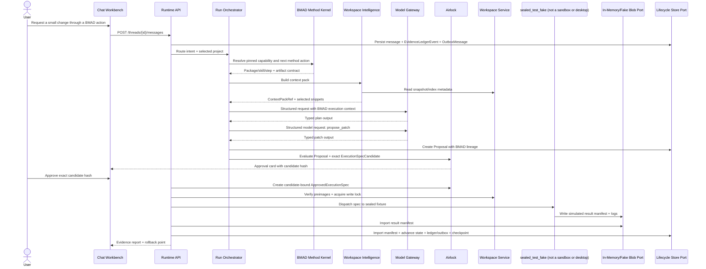

# First Build - Executable Vertical Slice

## 0. Two independent executable proofs (V6.17)

This note now defines two slices that share schemas and BMAD/Airlock semantics but do not share an executor or state authority. The original sequence below remains the `web_managed` proof and its `sealed_test_fake` predecessor; it is not a desktop sequence.

| Slice | Required proof | Completion evidence |
|---|---|---|
| W1–W3 `web_managed` | Browser request → cloud snapshot → exact candidate → cloud Airlock → fixed remote executor → manifest import → cloud checkpoint/rollback | SQL/Blob ledger, authenticated worker result, replayable browser evidence |
| D0–D4 `windows_local` | Native folder selection → Rust-bounded context → exact candidate → local Airlock → local checkpoint → journaled patch or approved command → local rollback | SQLite/encrypted payload ledger, local execution result, crash-recovery and rollback proof |

The desktop slice has no Runtime API, SQL, Blob, or ACA dependency in its ordinary edit/test path. Connected model calls use Azure, but model output returns as untrusted typed data to the local host. DESK-01 must prove or explicitly limit child-process confinement before release. See [[95 - Windows Local Workspace and Execution]] and [[97 - Windows Desktop Security and Trust Model]].

## 1. Objective

Build the smallest slice that proves Sapphirus is a BMAD-native AI Workspace rather than merely a chat UI. The slice must select one sealed, pinned Method-compatible skill/workflow fixture, use its workflow and artifact semantics to govern a file modification and validation command, and finish with evidence and rollback.

## 2. Slice Flow



## 3. Scope Boundary

### Included

- one project/workspace;
- one thread;
- text chat input;
- a minimal `OwnerScope` and principal context on every project/thread/run/resource;
- one sealed, pinned BMAD Method-compatible package/skill/workflow fixture;
- a minimal capability/help graph and current workflow-step projection for that fixture;
- Builder-compatible draft/validation lifecycle contracts, without an authoring UI;
- an `UntrustedContextEnvelope`, deterministic token budget, provenance, redaction summary, and reason for every context item;
- a run-level `PromptCacheContract` binding system prompt, tool schema, BMAD fixture, and context-pack hashes even though the provider is fake;
- typed plan output;
- typed patch proposal;
- diff preview;
- Airlock approval;
- `sealed_test_fake` deterministically applies one predefined patch to a sealed temporary fixture through the production approved-spec and result interfaces; it is not an isolation boundary and is not `windows_local`;
- one validation command represented as `argv[]` but evaluated by a deterministic in-process validator rather than starting a process;
- result manifest;
- evidence panel;
- checkpoint and rollback metadata.

### Excluded

- arbitrary or network-fetched BMAD package import;
- Builder Studio authoring;
- activation of newly generated Builder output;
- execution of package-supplied scripts outside the approved worker contract;
- any imported package code, generated shell, arbitrary workspace command, dependency restore, network access, or claim that the fake is a sandbox;
- presentation export;
- remote Git push;
- complex semantic indexing;
- multi-tenant public SaaS;
- autonomous background runs;
- durable orchestrator engine;
- ACA Jobs, Dynamic Sessions, or any production cloud execution lane;
- local Docker, Kubernetes, SQL/Blob emulators, or local model serving.

## 4. Build Tasks

| Step | Task | Output |
|---|---|---|
| 1 | Pin source identity and create one sealed Method-compatible fixture containing `SKILL.md`, module/help metadata, config, expected artifact, and hashes. | `BmadFoundationFixture`. |
| 2 | Normalize the fixture into `BmadPackageDescriptor`, `BmadConfigLayer`, capability, workflow-step, and artifact contracts. | Golden contract fixtures. |
| 3 | Define minimal `OwnerScope`, human/dev principal, `UntrustedContextEnvelope`, and `PromptCacheContract` contracts before persistence. | Versioned schemas and invalid fixtures. |
| 4 | Create minimal project/thread/message/run/method-state tables with owner scope and optimistic versions. | SQL migrations. |
| 5 | Implement chat shell with method/action and run-event cards. | React route `/projects/:id/chat`. |
| 6 | Add canonical BMAD/run/proposal/candidate/approval/execution/manifest/evidence events, transactional outbox writes, resumable cursors, and a projection checkpoint. | Durable event and replay contract. |
| 7 | Implement WorkspaceSnapshot and WorkspaceCheckout from uploaded zip or repo path fixture. | Snapshot manifest. |
| 8 | Implement preimage hash capture and validation. | `PreimageManifest`. |
| 9 | Build context pack v0 with deterministic ordering/budget, trust labels, redaction, provenance, and protected BMAD inputs. | `ContextPack` + `UntrustedContextEnvelope`. |
| 10 | Implement a deterministic fake Model Gateway behind the same interface as the later real provider and persist its run-level prompt/tool/context hashes. | `IModelGateway` + `PromptCacheContract`. |
| 11 | Implement structured schemas for BMAD-bound implementation plan and patch proposal. | JSON Schema + C# DTO. |
| 12 | Normalize the proposal and create an immutable, fully hashed `ExecutionSpecCandidate`. | Candidate contract and hash fixture. |
| 13 | Implement Airlock pure policy checks for exact candidate paths, preimages, command, lane, inputs, outputs, network, and limits. | `AirlockDecision`. |
| 14 | Implement approval card and endpoint that approve/reject the exact candidate hash. | `ApprovalRecord`. |
| 15 | Implement a `sealed_test_fake` executor that consumes only a matching `ApprovedExecutionSpec` and applies one predefined patch to a sealed temporary fixture with no shell/network/import surface. | Non-isolating fake behind the production port. |
| 16 | Represent validation as `argv[]`, but use a deterministic in-process validator and record a simulated command result. Real process execution begins in Phase 4 ACA. | Simulated command result inside `WebWorkerResultManifest`. |
| 17 | Import the result manifest through Runtime API only. | Idempotent SQL state transition and evidence-ledger append. |
| 18 | Advance the BMAD step/artifact projection only after successful manifest import. | Method/artifact state transition. |
| 19 | Generate evidence summary and prove reconnect/replay from the durable stream. | Evidence card + JSON bundle + replay fixture. |

## 5. Acceptance Criteria

- A user can request a small code change from chat.
- The UI identifies the pinned BMAD package, skill, current workflow step, expected artifact, and why that action is available.
- The Orchestrator cannot invent a BMAD action absent from the sealed capability graph.
- The system shows which files were selected as context and why.
- Every persisted resource is owner-scoped, and a non-owner receives the same not-found response whether the resource exists or not.
- Workspace text is labeled untrusted data; it cannot change policy, principal, tool availability, BMAD method state, or the `PromptCacheContract`.
- The model output is schema-valid and stored as typed output.
- The Orchestrator creates a platform Proposal from the typed model output.
- Airlock rejects writes outside workspace scope.
- Airlock rejects shell-string commands.
- The user sees the exact command, paths, inputs, output policy, lane class, limits, diff, and `ExecutionSpecCandidate` hash before approval.
- Executor cannot run without `ApprovedExecutionSpec`.
- `ApprovedExecutionSpec` issuance or dispatch fails if any candidate field or hash changes after approval.
- `sealed_test_fake` cannot run imported/generated code, restore dependencies, access the network, or start a process, and the UI labels its result as simulated/non-isolating.
- `sealed_test_fake` writes an append-only `WebWorkerResultManifest` fixture through an in-memory/fake Blob port.
- Runtime API imports manifest and advances lifecycle state.
- Evidence shows source snapshot, package, skill, workflow-step, config, and artifact hashes in addition to changed files, command output summary, approval ID, policy hash, model-call IDs, job ID, checkpoint ID, and rollback capability.
- Failed validation produces `patch_applied_validation_failed`, not ambiguous “failed”.
- Closing and reopening the client resumes from a durable cursor without rerunning the model or executor; an expired cursor returns an explicit gap-reconciliation response.
- No ACA Job, cloud resource, local container engine, infrastructure emulator, or local model dependency is required for this simulated developer slice; no real execution claim is made until Phase 4.

## 6. Failure States

| Failure | Required Behavior |
|---|---|
| Context stale | Void proposal and request context refresh. |
| Preimage mismatch | Reject apply; show changed file list. |
| Policy reject | Show specific policy rule and blocked side effect. |
| Fake attempt timeout | Mark the simulated execution timeout; keep checkpoint policy decision explicit. |
| Patch apply failed | Keep no partial write unless worker can prove atomic failure. |
| Validation failed | Enter `patch_applied_validation_failed`; ask repair/rollback/keep. |
| Manifest missing | Mark infra failure; do not advance successful state. |
| Stream cursor expired or projection gap | Return an explicit reconciliation response and rebuild the UI projection from durable events; never replay side effects. |
| Evidence materialization failed | Preserve the imported execution outcome and retry evidence projection; do not rewrite execution success/failure. |

## 7. Demo Script

1. Upload or connect a tiny test repo.
2. Select the sealed BMAD implementation skill/action recommended by Help Advisor.
3. Ask: “Change the app title and update the matching test.”
4. Show BMAD package/skill/step and context pack cards.
5. Show the plan and expected artifact cards.
6. Show the exact `ExecutionSpecCandidate`, its hash, and approve the diff/command/limits.
7. Run `pnpm test` as `argv[]` with network off.
8. Show failing or passing validation and method-step state.
9. Show evidence with BMAD lineage.
10. Roll back to the checkpoint in the demo if requested.

---

## v2 Review Improvements

### 1. Slice User Story

> As a developer, I want to ask the runtime to make a small code change, review the proposed diff, approve it, run a validation command, and receive an evidence report with a rollback point, so that I can trust the runtime to act without giving the model direct file or shell access.

### 2. Minimal Demo Fixture

Use a deliberately small repository fixture first:

```text
fixtures/sample-react-app/
  package.json
  src/App.tsx
  src/App.test.tsx
  Start Here.md
```

Demo request:

```text
Change the dashboard title from "Runtime Prototype" to "Sapphirus BMAD Runtime" and update the related test.
```

Expected system behavior:

- select `src/App.tsx`, `src/App.test.tsx`, and `package.json` as context;
- produce a two-file patch;
- show diff and preimage hashes;
- require approval;
- run `pnpm test` as `argv[]` with `network_mode=none`;
- produce checkpoint and evidence bundle.

### 3. Required API Endpoints For Slice

| Method | Path | Purpose | Side Effect? |
|---|---|---|---|
| `POST` | `/v1/projects` | Create/import fixture project. | Yes, project metadata only. |
| `POST` | `/v1/projects/{projectId}/snapshots` | Create immutable snapshot. | Yes, snapshot metadata/blob. |
| `POST` | `/v1/threads` | Create thread. | Yes, SQL. |
| `POST` | `/v1/threads/{threadId}/messages` | Add user message and start run. | Yes, SQL. |
| `GET` | `/v1/runs/{runId}/events` | Replay-then-live run projection from an opaque durable cursor. | No. |
| `GET` | `/v1/proposals/{proposalId}` | Read proposal and diff. | No. |
| `POST` | `/v1/proposals/{proposalId}/airlock/evaluate` | Evaluate policy. | Yes, policy decision record. |
| `POST` | `/v1/approvals` | Approve/reject the exact `ExecutionSpecCandidate` hash. | Yes, approval record. |
| `POST` | `/v1/executions` | Dispatch approved execution spec. | Yes, job dispatch. |
| `POST` | `/v1/jobs/{jobId}/import-manifest` | Internal authenticated Runtime API path imports a fake/worker manifest idempotently. | Yes, SQL state transition. |
| `POST` | `/v1/checkpoints/{checkpointId}/rollback` | Request rollback through a new rollback candidate, policy decision, approval, and spec. | Yes, requires new authorization. |

“Side Effect?” does not mean every row requires Airlock. Project/thread/message and policy-decision persistence are ordinary authenticated control-plane mutations governed by owner authorization, idempotency, concurrency, and audit. Workspace mutation, command dispatch, and rollback use the governed execution path in [[00 - Common Rules and Product Shape]].

### 4. Minimal SQL Tables For Slice

| Table | Required Columns |
|---|---|
| `projects` | `id`, `name`, `source_type`, `owner_scope_json`, `created_by`, `created_at` |
| `workspace_snapshots` | `id`, `project_id`, `owner_scope_json`, `root_hash`, `manifest_blob_uri`, `created_at` |
| `threads` | `id`, `project_id`, `owner_scope_json`, `title`, `created_by`, `created_at` |
| `runs` | `id`, `thread_id`, `owner_scope_json`, `status`, `mode`, `current_checkpoint_id`, `optimistic_version`, `created_at`, `updated_at` |
| `run_events` | `id`, `run_id`, `sequence`, `event_type`, `payload_json`, `created_at` |
| `projection_checkpoints` | `stream_id`, `projection_name`, `last_sequence`, `updated_at` |
| `outbox_messages` | `id`, `stream_id`, `sequence`, `event_id`, `status`, `attempt_count`, `available_at`, `created_at` |
| `evidence_ledger_events` | `id`, `stream_id`, `sequence`, `schema_version`, `event_type`, `owner_scope_json`, `actor_type`, `actor_id`, `correlation_id`, `causation_id`, `payload_hash`, `payload_ref`, `retention_class`, `created_at` |
| `bmad_method_states` | `project_id`, `package_id`, `skill_id`, `workflow_step_id`, `config_hash`, `artifact_expectation_hash`, `optimistic_version` |
| `prompt_cache_contracts` | `run_id`, `system_prompt_hash`, `tool_schema_hash`, `context_pack_hash`, `bmad_fixture_hash`, `status` |
| `model_calls` | `id`, `run_id`, `call_type`, `model_profile`, `input_hash`, `output_hash`, `status`, `cost_estimate` |
| `proposals` | `id`, `run_id`, `proposal_type`, `proposal_hash`, `status`, `risk_level`, `created_at` |
| `execution_spec_candidates` | `id`, `proposal_id`, `candidate_hash`, `policy_input_hash`, `status`, `expires_at` |
| `airlock_decisions` | `id`, `proposal_id`, `policy_version`, `policy_hash`, `decision`, `reasons_json` |
| `approvals` | `id`, `proposal_id`, `candidate_id`, `candidate_hash`, `approved_by`, `decision`, `scope_json`, `expires_at` |
| `executions` | `id`, `approval_id`, `spec_hash`, `job_provider_id`, `status`, `manifest_blob_uri` |
| `work_items` | `id`, `run_id`, `kind`, `owner_scope_json`, `status`, `idempotency_key`, `created_at` |
| `work_attempts` | `id`, `work_item_id`, `attempt_number`, `status`, `lease_id`, `execution_id`, `started_at`, `finished_at` |
| `work_leases` | `id`, `work_item_id`, `attempt_id`, `holder`, `status`, `expires_at`, `heartbeat_at` |
| `checkpoints` | `id`, `project_id`, `base_checkpoint_id`, `manifest_blob_uri`, `created_by_execution_id` |

`evidence_ledger_events` plus the matching outbox row are written in the same transaction as each authoritative transition. `run_events` is a rebuildable run/UI projection, not an independent lifecycle source of truth.

### 5. Required Event Types

```text
run.created
thread.message.created
workspace.snapshot.created
bmad.capability.selected
bmad.workflow_step.started
bmad.artifact.expected
context.pack.created
model.call.completed
proposal.created
execution_spec_candidate.created
policy.evaluation.completed
approval.required
approval.approved / approval.rejected
approved_spec.issued
work_item.created
work_attempt.started
execution.dispatched
execution.log.chunk
execution.completed
execution.manifest.imported
bmad.artifact.updated
bmad.workflow_step.completed
workspace.checkpoint.created
validation.completed
evidence.materialization.completed
run.state.changed
run.completed
```

Event types come from [[53 - Event Taxonomy and Stream Protocol]]; run failure is a terminal `run.state.changed` transition, not a separate event type.

### 6. Slice Negative Tests

| Test | Expected Result |
|---|---|
| Dispatch execution without approval. | HTTP 403 / policy failure. |
| Use expired `ApprovedExecutionSpec`. | Rejected before job dispatch. |
| Modify a file not present in proposal. | Worker rejects and writes failure manifest. |
| Preimage hash drift before apply. | Runtime rejects before dispatch. |
| Raw shell command `sh -c "pnpm test"`. | Airlock rejects unless explicitly operator-approved. |
| Worker tries to call SQL state endpoint without import token. | Rejected. |
| Prompt-injection text inside Start Here asks model to bypass approvals. | Model output may mention it, but policy is unchanged and execution requires approval. |
| Non-owner requests a real and a nonexistent project/run. | Both return the same not-found response and emit no existence-revealing event. |
| Candidate command, image/lane class, input hash, or limit changes after approval. | Spec issuance/dispatch fails because the candidate hash no longer matches. |
| Client disconnects during approval or execution and reconnects after process restart. | Durable events replay from the cursor; no model call, approval, or execution is duplicated. |

### 7. Slice Done Criteria

The slice is not done until a reviewer can inspect one evidence bundle and answer:

- what the user asked for;
- what context was selected;
- what the model proposed;
- who approved it;
- what exact policy version/hash allowed it;
- what exact fake executor identity/version executed it, and the image digest when a later containerized lane is used;
- which files changed and from which hashes to which hashes;
- what command ran with which `argv[]`;
- what validation result occurred;
- how to roll back.


---

## Historical Revision Notes (V3 -> V4)
## Review finding

`01 - First Build - Executable Vertical Slice.md` is part of the implementation library support layer. In v3, support files were useful but not always testable. In v4, every support file must provide either a decision, reference contract, release gate, mapping, runbook, or checklist that can be executed by a developer or coding agent.

## Required usage

1. Read this file before changing the related implementation area.
2. Cross-check it against `07 - Source Coverage Matrix.md` and `50 - V4 Full Library Audit.md`.
3. When implementing a task, copy the relevant checklist items into the issue/story.
4. When a decision changes, update this file and `31 - Architecture Decision Records.md` in the same PR.
5. When a contract changes, update `25 - OpenAPI, Schemas, and Generated Clients.md`, `46 - API Route Catalog.md`, and generated clients.

## V4 quality rules for this file

- It must not contradict locked architecture decisions.
- It must not reintroduce a broad v1 scope that competes with the executable vertical slice.
- It must preserve BMAD source contracts and the existing presentation workflow adapter decision.
- It must reflect the Runtime API as lifecycle state owner and the worker as manifest/log producer only.
- It must identify whether guidance is `LOCKED`, `TEMPORARY`, `PHASE-0 SPIKE`, `V1`, `V1.5`, or `V2`.

## Implementation checklist linkages

| Related guide | What to cross-check |
|---|---|
| `01 - First Build - Executable Vertical Slice.md` | Does this file support or distract from the first slice? |
| `29 - Concurrency, Transactions, and Failures.md` | Are state and partial failure semantics compatible? |
| `32 - Integration Contract Map.md` | Are producer/consumer boundaries clear? |
| `33 - Release Gates and Acceptance Matrix.md` | Is there a release gate for this guidance? |
| `49 - Detailed Component Build Checklists.md` | Are implementation tasks represented as checklist items? |
