# Preserved Source Context

> Historical source record. It is intentionally preserved and is not a current implementation authority. Current BMAD foundation semantics are [[100 - BMAD Method and Builder Deep Comprehension Audit]]. Current dual-delivery authority is [[93 - Split Web and Windows Desktop Architecture Plans]] with implementation contracts [[94 - Windows Desktop Native Host and IPC]] through [[99 - Dual-Delivery Contract and Conformance Specification]].

> This file preserves the uploaded consolidated development context verbatim. Use it only as a historical completeness archive when checking that no important context was dropped. Its older schemas, sequencing, Azure-only posture, and “primary implementation brief” wording are superseded by the current notes linked above.


**Document purpose:** This is the consolidated development context for building the Sapphirus BMAD Runtime app. It merges the useful content from all provided BMAD Runtime, Cortex Chat, Azure, architecture, presentation-workflow, chat-agentic-coding, prototype, and deep-research plans into one implementation reference. It is intended to be detailed enough for a development team or coding agent to implement the app without repeatedly re-reading the entire plan archive.

**Current target version:** v8.5-expanded development context.

**Current product decision:** Build a **chat-first BMAD-native Azure application** that can run BMAD Method workflows, create BMAD assets through Builder Studio, import the existing presentation creation workflow as a BMAD package, and perform governed agentic coding work: inspect files, propose patches, apply approved changes, run approved commands/tests, repair failures, rollback, export artifacts, and produce trace evidence.

**Non-negotiable framing:** This is **not** a generic chatbot, not a pure planning UI, not a Cortex compatibility runtime, and not a thin wrapper around Claude Code/Copilot. It must be its own governed runtime.

---

## 0. How to use this context file

Use this file as historical input, not as the primary implementation brief. For BMAD Method/Builder work start with [[100 - BMAD Method and Builder Deep Comprehension Audit]]; for delivery authority start with [[93 - Split Web and Windows Desktop Architecture Plans]].

When building features, prefer this priority order:

1. **v8.4 chat-first agentic coding target** — the product must work as a real chat workbench that can modify files and run code under Airlock.
2. **v8.3 architecture redesign** — implement logical modules inside a small number of deployment units; do not explode into unnecessary microservices.
3. **v8.2 presentation workflow correction** — use the existing presentation creation workflow as the seed Artifact Creator workflow; do not rebuild it from scratch.
4. **v8.0 deep-research productization deltas** — OpenAPI, versioned schemas, SBOM/provenance, quota-aware gateway, privacy, OpenTelemetry, WCAG, localization, replay fixtures.
5. **v7 merged final plan** — build Plan A, aim at Plan B.
6. **v5.4 source-aligned BMAD baseline** — BMAD contracts and Builder semantics are canonical.
7. **Cortex Chat Azure/local plans** — keep the agentic coding loop and Airlock execution model, but remove Cortex as a runtime/product namespace.
8. **Early preview v5/v6 plans** — keep only the UI-runtime and execution-independence principles.

---

## 1. Source plan inventory and final merge treatment

| Source file | Plan role | What it contributed | Final treatment |
|---|---|---|---|
| `preview.html` | BMAD Runtime Plan v5 — UI Runtime + Microsoft Foundry | Earliest UI-runtime framing. Key idea: end users should not need Claude Code, Copilot, Cursor, Windsurf, or an IDE agent to execute workflows. Introduced solution package contract, Airlock, Foundry gateway, and a realistic but conservative MVP timeline. | Keep the “runtime owns execution” rule, Airlock, artifact traceability, model gateway, and careful delivery estimates. Do not keep generic “solution package” terminology as the final product model. |
| `preview (1).html` | BMAD Runtime Implementation Plan v6 — UI Runtime + Microsoft Foundry | Made the first runtime concept more buildable: UI shell, Runtime API, Skill Kernel, Model Gateway, Airlock, Executor, Event Bus, Artifact Store, Observability. Chose React/Vite + FastAPI + Azure SQL + Blob + Container Apps + Foundry Responses API + App Insights + SSE first. | Keep the concrete service responsibilities, run-event rendering, approval UX, artifact diffing, and model/cost visibility. Translate the stack to the later Azure-native .NET/Python/TypeScript decision. |
| `sapphirus-cortex-chat-plan.html / sapphirus-cortex-chat-plan (1).html / sapphirus-cortex-chat-plan(2).html` | Sapphirus Cortex Chat — local/desktop-first agentic coding app | Defined the product as a real coding co-worker: chat, inspect files, propose diffs, apply approved patches, run approved commands/tests, repair failures, rollback, and export. Used SQLite/file trace and local deterministic executor. | Keep Code Agent Kernel, workbench UX, approval model, no direct model writes/runs, lexical+structural retrieval, diff/terminal/evidence cards. Do not keep desktop-first as final deployment target. |
| `sapphirus-cortex-chat-plan-azure(1).html` | Sapphirus Cortex Chat — Azure implementation plan | Moved the chat/coding co-worker to Azure: App Service web, Container Apps runtime/API/Airlock, ACA Jobs for side effects, Azure SQL/Blob, Entra ID, managed identity, centralized observability. | Keep the Azure web posture, Airlock v2, Workspace Service, isolation classes, ACA Jobs, Model Gateway, trace/data model, language split. Rename/reframe from Cortex to BMAD Runtime. |
| `sapphirus-bmad-runtime-plan-v5-4-final(1).html` | Sapphirus BMAD Runtime v5.4 — source-aligned implementation baseline | Corrected the product to BMAD-only. Source-aligned to real BMAD contracts: SKILL.md, module.yaml, module-help.csv, bmad-modules.yaml, _bmad/config.toml, config.user.toml, _bmad/custom/*.toml, generated skill directories, registry behavior, installer channels, platform targets, web bundles, Builder validation/eval flows. | This is the buildable v1 baseline. Preserve BMAD-only identity, Builder Studio, Method Package Loader, Help Advisor, Azure stack, Airlock, Workspace Service, rollback, trace/export, no auto-push. |
| `sapphirus-bmad-runtime-plan-v6-outside-box(1).html` | Sapphirus BMAD Runtime v6 — outside-the-box strategy | Strategic expansion: BMAD Method OS, durable orchestration, fast execution lane + jobs, SkillOps, evidence graph, AI Gateway, agent publication path, Method Map, Evidence Panel, Execution Cockpit, Skill Registry, Replay Mode. | Adopt as v1.5/v2 direction. Do not put all of it in v1. Use it to shape object models and avoid painting the architecture into a corner. |
| `sapphirus-bmad-runtime-plan-v7-merged-final(1).html` | Merged final implementation plan v7 | Merged Plan A and Plan B: build Plan A, aim at Plan B. Added run memory, document workspaces, utility lane, subagents/reviewer gate, state machines, failure taxonomy, richer roadmap, backlog, risks, and ADRs. | Keep the merged roadmap and phased strategy. This is the first strong consolidated BMAD Runtime plan. |
| `sapphirus-bmad-runtime-plan-v8-deep-research-updated.html` | Deep-research update v8.0 | Added productization deltas: OpenAPI-first Runtime API, versioned schemas, artifact-first creator mode, quota-aware gateway, ACA workload profiles, managed identity/user delegation SAS defaults, SBOM/provenance/signing, trace privacy, OpenTelemetry correlation, replay regression fixtures, WCAG 2.2 AA, localization. | Keep all production-readiness requirements. Treat them as v1 exit criteria where marked critical. |
| `sapphirus-bmad-runtime-plan-v8-1-architecture-preservation.html` | Architecture preservation v8.1 | Added preservation audit and a first designed architecture graph. Goal was to make sure v7/v8 information was not lost. | Keep the preservation discipline. The graph itself was later superseded. |
| `sapphirus-bmad-runtime-plan-v8-2-existing-presentation-workflow.html` | Existing presentation workflow integration v8.2 | Corrected Artifact Creator: presentation creation already exists as a skill/workflow. BMAD must import/convert/wrap it, not invent a new PPT workflow. | Keep as a major product correction. The existing presentation workflow is the seed Artifact Creator workflow and a regression-tested adapter target. |
| `sapphirus-bmad-runtime-plan-v8-3-architecture-redesign(1).html` | Architecture redesign v8.3 | Replaced weak block chart with relationship-first architecture. Clarified that most boxes are modules/features, not independent microservices. v1 should be React web app + modular ASP.NET Core Runtime API + isolated execution lanes. | Keep the modular-monolith/deployment-boundary correction and the relationship-first architecture. |
| `sapphirus-bmad-runtime-plan-v8-4-chat-agentic-coding.html` | Chat-first agentic coding update v8.4 | Final correction: product must work as chat, and must modify files and run code like Claude Code/Codex-class tools under governance. Added Chat Workbench / Agentic Coding Kernel, panels, T33, AT-068..AT-071, ADR-035. | This is the current target direction for implementation. Use it as the highest-priority context. |

---

## 2. Final product definition

Sapphirus BMAD Runtime is an internal Azure web application for:

1. Running **BMAD Method** skills, workflows, modules, help catalogs, phase rules, and artifact flows.
2. Creating and validating new BMAD-compliant skills, agents, workflows, modules, setup flows, and evals through **BMAD Builder Studio**.
3. Performing **governed implementation work** in a chat-first agentic workspace: inspect files, build context, plan, propose patches, approve diffs, execute jobs, validate, repair, rollback, and export evidence.
4. Generating artifacts such as presentations, reports, briefs, technical plans, and documentation packs through an **Artifact Creator** mode powered by BMAD workflow packages.
5. Operating the entire loop on Azure with identity, policy, storage, telemetry, cost controls, traceability, and reproducible execution.

### 2.1 Final product statement

> Sapphirus BMAD Runtime is a BMAD-native Method OS foundation for running, building, validating, and governing BMAD skills, workflows, modules, artifacts, and implementation work on Azure. v1 ships as a governed internal chat workbench with BMAD Builder, existing presentation workflow integration, safe code execution, rollback, and trace/export. v1.5/v2 evolve into durable orchestration, SkillOps, fast execution lanes, evidence graph, replay, and managed publication paths.

### 2.2 What the product must replace

The final product should reduce or remove the need for:

- Claude Code / Claude CoWork as the runtime execution layer.
- GitHub Copilot as the runtime execution layer.
- Cursor/Windsurf/IDE agents as mandatory workflow runners.
- Manual terminal execution for normal BMAD workflows.
- Manually copying BMAD artifacts between chat tools, files, terminals, and editors.

External coding tools can help build the app, but normal end users should execute BMAD workflows and controlled coding tasks inside Sapphirus.

### 2.3 Product boundaries

**In scope for v1:**

- Chat-first project workbench.
- BMAD package load/init/import.
- BMAD Method workflow execution.
- BMAD Help Advisor.
- Builder Studio MVP.
- Existing presentation workflow adapter.
- File inspection, context selection, diff proposal, patch approval, patch apply.
- Approved command/test/build/lint/script execution.
- Failure analysis and repair proposal.
- Checkpoint/rollback.
- Trace/export/evidence summary.
- Azure deployment with App Service, Container Apps, ACA Jobs, Azure SQL, Blob, Key Vault, ACR, Entra, Monitor.
- OpenAPI-first contracts, versioned schemas, SBOM/provenance, trace privacy, quota-aware model gateway, WCAG 2.2 AA target.

**Out of scope for v1:**

- Public SaaS tenancy.
- AKS unless an ADR proves ACA cannot satisfy execution workloads.
- Broad MCP/tool marketplace.
- Unrestricted shell access.
- Direct model file writes or direct model command execution.
- Git push/publish automation.
- Long-running autonomous background coding.
- Full evidence graph, full SkillOps release registry, durable orchestration engine, managed agent publication, and replay UI — these are v1.5/v2 unless a spike proves they are required earlier.

---

## 3. Product roles and runtime promises

| User | Need | Runtime promise |
| --- | --- | --- |
| Everyday user | Use BMAD Method without memorizing agents, menu codes, phases, or output locations. | Chat-first flow, BMad Help Advisor, phase cards, inline questions, artifact previews, and next-step routing. |
| Builder user | Create skills, workflows, agents, and modules. | Builder Studio with Agent Builder, Workflow Builder, Module Builder, Setup Builder, validation reports, and eval hooks. |
| Developer | Turn BMAD artifacts into working code. | Workspace indexing, implementation plan, diff preview, approval, patch job, validation, repair loop, final report. |
| Reviewer | Understand what changed and why. | Plan cards, context cards, diff cards, command/job cards, validation cards, evidence links, rollback checkpoints. |
| Operator | Operate safely for internal users. | Entra roles, project assignment, policy management, telemetry, budgets, retention, incident visibility. |

### 3.1 Role-specific UX posture

#### Everyday user

The user should start from an outcome, not from BMAD internals. They should be able to ask for a presentation, report, plan, PRD, architecture review, or study/documentation artifact. The runtime should route them into the right BMAD workflow, ask structured questions, show progress cards, preview outputs, and handle export.

#### Builder user

The Builder user creates new BMAD-compliant assets. They need Builder Studio surfaces for agent skills, workflow skills, module packages, setup flows, conversion, validation, and evals. Builder output must not be treated as a loose generated file; it must enter validation, packaging, registration, and eventually SkillOps.

#### Developer

The developer uses the product as a coding co-worker. The app must inspect a repository, select context, propose a plan, produce diffs, apply approved patches, run tests/build/lint/typecheck/scripts, repair failures, and produce final evidence. This is the capability class expected from Claude Code/Codex-style tools, but governed and BMAD-aware.

#### Reviewer

The reviewer needs plan cards, context cards, diff cards, command/job cards, validation cards, evidence cards, rollback checkpoints, and unresolved-risk summaries. Reviewers must be able to understand what changed and why without reading raw prompts.

#### Operator

The operator manages identity, project assignment, policies, budgets, retention, incidents, trace privacy, model profiles, queue health, and environment configuration.

---

## 4. Non-negotiables

1. **Chat is the primary shell.** The main product is a persistent project conversation with workbench side panels.
2. **BMAD is canonical.** No Cortex skill/workflow namespace remains in the final runtime product model.
3. **Cortex is lineage only.** It may explain historical plan evolution, but not runtime semantics.
4. **Models never write files directly.** They propose structured actions.
5. **Models never run commands directly.** They propose commands with expected effects.
6. **Airlock validates before side effects.** Every risky operation goes through proposal → policy validation → approval → isolated execution → post-validation.
7. **The executor is deterministic.** It applies approved patches and commands inside controlled workers/jobs.
8. **No auto-push in v1.** The runtime may prepare commits/export bundles, but it does not push to remote repositories.
9. **Workspace state is platform-owned.** Jobs are stateless workers; they do not own authoritative run state.
10. **Traces are evidence, not log trash.** Every important outcome must be reconstructable.
11. **Source contracts matter.** The runtime must understand actual BMAD files and config, not generic workflow abstractions.
12. **Builder is first-class.** The app must create BMAD assets, not only consume them.
13. **Existing presentation workflow is source of truth.** It must be adapted into BMAD, not replaced by a generic new PPT generator.
14. **v1 should not become a microservice mess.** Use logical modules inside a few deployment units.
15. **Azure is the production environment.** App Service + Container Apps + ACA Jobs + Azure SQL + Blob is the baseline.

---

## 5. Plan lineage: what each generation changed

### 5.1 Early BMAD Runtime v5 preview

The earliest plan established the UI runtime direction: the user opens an app, chooses a BMAD-compatible workflow/solution, answers prompts, approves actions, receives artifacts, and does not need Claude Code/Copilot/IDE agents to run the workflow.

Important retained ideas:

- The runtime must own skill loading, state, model calls, approvals, artifacts, and trace.
- Foundry/Azure OpenAI calls must go through a gateway.
- Airlock is mandatory before writes or execution.
- Artifact traceability is not optional.
- Agentic coding can speed implementation, but the product itself must not rely on external agent tools at runtime.

Superseded ideas:

- Generic “solution package” as the primary product model. The final product model is BMAD-native.
- FastAPI as the final control plane. Later Azure decisions prefer ASP.NET Core for the control plane and Python for workers.

### 5.2 BMAD Runtime v6 preview

The v6 preview made the runtime more concrete and more buildable. It split responsibilities into UI shell, Runtime API, Skill Kernel, Model Gateway, Airlock, Executor, Event Bus, Artifact Store, and Observability.

Important retained ideas:

- Event-rendered workflow UI.
- Cockpit screens for run state, approvals, artifacts, trace, and costs.
- SSE/WebSocket-style live updates.
- Model/cost visibility.
- A shorter but controlled agent-assisted delivery rhythm.
- Two adapter ideas: official/generated BMAD skill adapter and a conversion adapter for non-native packages.

Superseded ideas:

- Service split should not imply separate deployable microservices in v1.
- The final plan should prefer a modular ASP.NET Core runtime API plus isolated execution lanes.

### 5.3 Cortex Chat local/desktop plans

The Cortex Chat local plans were valuable because they defined the missing capability: the product must be a real coding co-worker, not only a planner.

Retained ideas:

- Project-aware chat.
- Code Agent Kernel.
- File inspection.
- Diff proposal.
- Approved patch apply.
- Approved command/test execution.
- Failure repair loop.
- Rollback.
- Final evidence report.
- No direct model write/run.
- Lexical and structural retrieval first.
- Inline approvals instead of a separate approval queue for v1.
- Scope discipline: no new service/screen/tool unless it improves Open Project → Chat → Patch/Test → Export.

Superseded ideas:

- Desktop-first delivery.
- SQLite/file-backed trace as the production backend.
- `_cortex` as product/runtime namespace.

### 5.4 Cortex Chat Azure plan

The Azure Cortex Chat plan moved the coding co-worker into the user’s intended Azure target.

Retained ideas:

- Azure App Service for the web surface.
- Azure Container Apps for runtime services.
- Azure Container Apps Jobs for finite side effects.
- Azure SQL for structured state.
- Blob for artifacts/logs/traces/diffs/snapshots/exports.
- Entra ID for workforce identity.
- Managed identities and Key Vault.
- Workspace Service as authoritative state owner.
- Airlock v2 as execution safety boundary.
- Hybrid connector as a possible future mode when a repo cannot be cloned/uploaded into Azure.
- Job failure taxonomy and workflow version pinning.

Final correction:

- Rename/reframe to BMAD Runtime.
- Cortex workflows are not a supported runtime namespace in the final app unless converted into BMAD-compliant packages.

### 5.5 BMAD Runtime v5.4 source-aligned baseline

This is the first strong buildable BMAD-only implementation plan.

Retained ideas:

- BMAD Method and BMAD Builder are first-class.
- Cortex is lineage only.
- Runtime must align to actual BMAD source contracts.
- Method Package Loader, Capability Catalog, Config Resolver, Help Advisor, Builder Studio, Builder Validation, Code Agent Kernel, Workspace Intelligence, Workspace Service, Model Gateway, Airlock, UI/UX, trace, security, roadmap, backlog, acceptance criteria, risks, and ADRs.

### 5.6 BMAD Runtime v6 outside-the-box strategy

This became the strategic v1.5/v2 direction.

Adopted carefully:

- BMAD Method OS identity.
- Durable orchestration for approval-aware long-running runs.
- Fast sandbox lane plus ACA Jobs.
- SkillOps: validation, evals, release channels, deprecation, rollback.
- Evidence graph and trace replay.
- AI Gateway/APIM policy layer in front of Model Gateway.
- Method Map, Execution Cockpit, Evidence Panel, Skill Registry, Replay Mode.
- Managed agent publication path later.

Deferred from v1:

- Full durable orchestration engine unless spike proves necessary.
- Full evidence graph.
- Full SkillOps registry.
- Autonomous scheduled BMAD loops.
- Broad agent publication.

### 5.7 v7 merged plan

The v7 plan merged the buildable baseline with the strategic target: **Build Plan A, aim at Plan B**.

Retained additions:

- Run memory.
- Document workspaces.
- Utility lane.
- Subagents and Reviewer Gate.
- Explicit state machines.
- Failure taxonomy.
- Roadmap split into v1, v1.5, and v2.
- More complete backlog, acceptance criteria, risks, and ADRs.

### 5.8 v8 deep-research productization update

The v8 update turned the plan into a more production-grade product/platform blueprint.

Retained additions:

- OpenAPI-first Runtime API.
- Generated TypeScript/.NET clients.
- Run API, Package API, Operator API.
- Versioned schemas for package imports, Builder outputs, configs, ExecutionSpec, trace bundles, exports, checkpoint manifests.
- Artifact-first creator mode for non-technical users.
- Quota-aware Model Gateway queue classes.
- ACA workload profiles environment as production baseline unless ADR says otherwise.
- Managed identity and short-lived scoped storage access.
- SBOM/provenance/signing.
- Trace privacy: redacted-by-default content telemetry.
- OpenTelemetry correlation browser → API → model → proposal → approval → job → artifact/export.
- Replay regression corpus.
- WCAG 2.2 AA and localization readiness.

### 5.9 v8.1 preservation pass

The v8.1 pass added a preservation audit to ensure older important content was not deleted.

Retained discipline:

- New plan revisions should be additive unless a decision is explicitly superseded.
- “Simplification” must not silently remove BMAD contracts, technology decisions, acceptance criteria, risks, or ADRs.

### 5.10 v8.2 presentation workflow correction

The user clarified that presentation creation already exists as a skill/workflow.

Final decision:

- The existing presentation creation workflow is the seed Artifact Creator workflow.
- It must be inventoried, mapped, wrapped/adapted, validated, and exposed through Artifact Creator.
- Preserve current prompts, stages, templates, source handling, review steps, and export behavior.
- Add only the BMAD adapter layer needed for config, traces, approvals, validation fixtures, provenance, and UI controls.

### 5.11 v8.3 architecture redesign

The v8.3 pass corrected the diagram and architecture shape.

Final architecture rule:

- Show relations, control flow, data flow, side-effect boundaries, and trust boundaries.
- Do not implement every box as a separate service.
- v1 should use a small number of deployment units:
  - React web app.
  - Modular ASP.NET Core Runtime API.
  - Isolated Container Apps worker/job lanes.
  - Azure SQL/Blob/Key Vault/ACR/Monitor.

### 5.12 v8.4 chat-agentic coding correction

The user clarified that the final product needs to work as a chat and also modify files/run code like Claude Code/Codex-style tools.

Final additions:

- Chat Workbench / Agentic Coding Kernel is a core v1 subsystem.
- Required panels: conversation, file explorer, context panel, diff panel, terminal/log panel, artifact preview, evidence panel.
- Required loop: inspect workspace → build context → plan → propose patch → approve diff → apply patch → run commands/tests → repair failures → checkpoint → final evidence report.
- Added T33 and AT-068..AT-071 in the latest plan.
- ADR-035 locks chat-first agentic coding as a v1 requirement.

---

## 6. Final architecture

### 6.1 Architecture principle

The architecture is a **chat-first governed agentic runtime**. The most important boundary is not “frontend vs backend” or “service vs service.” The most important boundary is:

```text
read / reason / propose  →  Airlock + approval  →  write / run / export
```

The model operates on context and returns structured proposals. The runtime validates, the user approves, and the executor performs side effects in isolated environments.

### 6.2 Deployment-level architecture

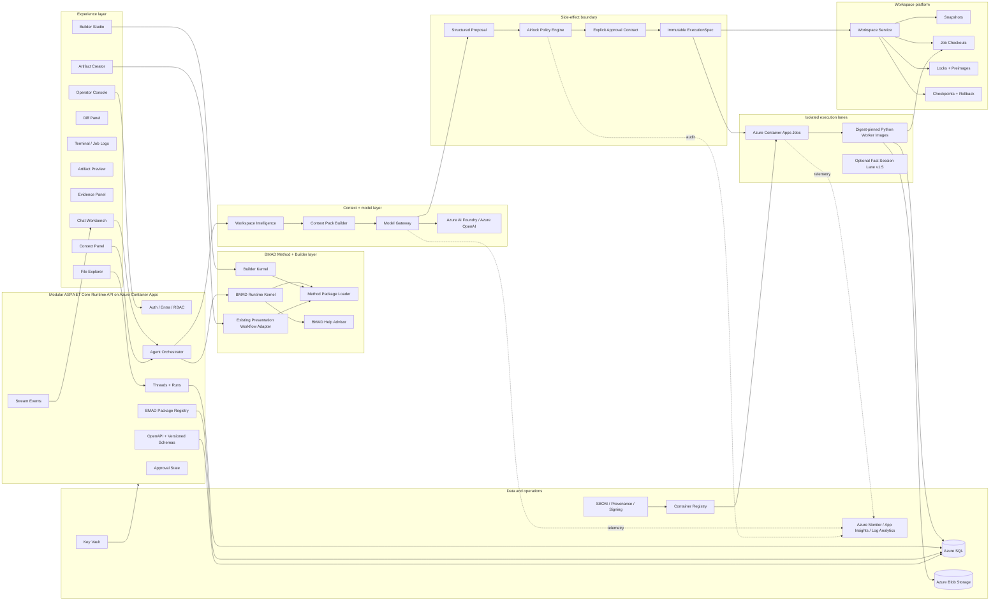

### 6.3 Runtime request flow

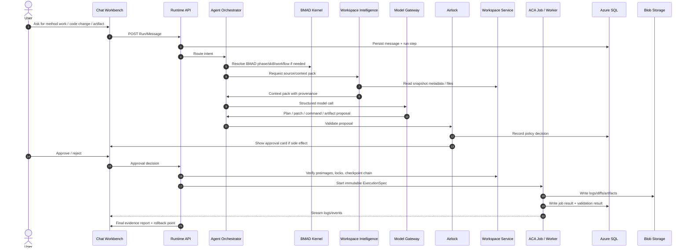

### 6.4 Logical responsibilities vs deployable units

Do **not** translate each logical box into an independent service in v1. Use this split:

| Responsibility | v1 deployment rule | Later extraction trigger |
|---|---|---|
| Chat orchestration, run state, approval state, package registry, API contracts | Inside modular ASP.NET Core Runtime API | Extract only if scaling/ownership/security boundary demands it. |
| BMAD Kernel, Help Advisor, package loader, Builder invocation | Inside Runtime API as isolated modules/libraries | Extract only if multiple runtimes need the same kernel. |
| Airlock policy engine | Can live inside Runtime API if test-isolated and fail-closed | Extract when separate deployment/security ownership is needed. |
| Workspace Intelligence | Runtime API module plus worker utilities | Extract if indexing becomes long-running/heavy. |
| Workspace Service | Runtime API module backed by SQL/Blob | Extract if concurrent workspace operations require independent scaling. |
| Execution jobs | Separate ACA Jobs / worker images | Must remain isolated because they run untrusted commands and write files. |
| Model Gateway | Can be a module or small service | Extract if provider routing/quota policy needs independent release. |
| Operator Console | Same React web app | Separate only if admin security posture requires it. |

---

## 7. Technology stack and Azure decisions

| Layer | Decision | Reason |
| --- | --- | --- |
| Web UI | React + TypeScript hosted on Azure App Service . | Best fit for a rich chat/product UI with App Service authentication, internal hosting, and straightforward deployment. |
| Runtime API | ASP.NET Core on Azure Container Apps . | Strong Azure identity, policy, SQL, API, SignalR, observability, and maintainability posture. |
| Workers | Python ACA Job images. | Fits repo analyzers, deterministic scripts, validators, BMAD Builder scripts, and execution wrappers. |
| Model access | Azure AI Foundry / Azure OpenAI through a Model Gateway. | Centralizes routing, budgets, schemas, telemetry, retries, and provider isolation. |
| Execution | Azure Container Apps Jobs . | Finite-duration patch/test/validate/export tasks map cleanly to job semantics. |
| Persistence | Azure SQL Database . | Relational state for projects, runs, approvals, proposals, jobs, locks, model calls, and policy decisions. |
| Artifacts | Azure Blob Storage . | Object storage for snapshots, logs, diffs, reports, exports, and evidence bundles. |
| Secrets | Azure Key Vault . | Repo credentials, model endpoint secrets where needed, signing keys, policy secrets. |
| Identity | Microsoft Entra ID . | Workforce authentication, group-based project access, admin/operator roles. |
| Streaming | Azure SignalR Service or App Service WebSockets for v1; SignalR preferred for scale. | Live job status and logs should be pushed to the chat UI, not polled from SQL. |
| Observability | Azure Monitor, Log Analytics, Application Insights . | Centralized metrics, traces, exceptions, job events, latency, budget, and policy audit. |
| Infrastructure | Bicep first, Terraform acceptable later. | Low-friction Azure-native IaC for App Service, ACA, SQL, Blob, ACR, Key Vault, Monitor, networking. |
| Service contracts | OpenAPI-first Runtime API with generated TypeScript/.NET clients. | Stabilizes web, future CLI, operator automation, integration tests, and v1.5/v2 expansion. |
| Runtime surfaces | Run API, Package API, Operator API ; thin CLI deferred until core APIs stabilize. | Prevents the product from becoming UI-only and makes technical staff workflows scriptable without building a broad public SDK ecosystem. |
| Schema/versioning | Versioned contracts for package schemas, Builder outputs, config, ExecutionSpec, trace bundles, exports, and checkpoint manifests. | Required for safe upgrades, backward-compatible replay, module migrations, and long-lived evidence. |
| Networking baseline | ACA workload profiles environment by default ; private endpoints and controlled egress where sensitivity justifies it. | Avoids a future networking dead end when private endpoints, NAT egress, or stricter firewall policy become mandatory. |
| Dependency management | pnpm for multi-package TypeScript workspaces; uv for Python workers/scripts; lockfiles required. | Reduces install drift, speeds CI, and keeps worker environments reproducible. |
| Supply chain | SBOM + provenance + signing for worker images, release artifacts, and module packages. | Gives operators a verifiable release trail for code that will execute or generate executable artifacts. |

### 7.1 Language split

| Area | Language | Reason |
|---|---|---|
| UI | React + TypeScript | Best fit for chat workbench, panels, diff views, artifact previews, and typed API clients. |
| Control plane | ASP.NET Core / C# | Strong Azure identity, authorization, SQL, API, durable orchestration future, maintainability. |
| Workers | Python | Better for repo tooling, validators, scripts, BMAD Builder script compatibility, document/artifact utilities, and code execution wrappers. |
| Contracts | OpenAPI + JSON Schema | Stabilizes web clients, tests, future CLI, operator automation, migration, and replay. |

### 7.2 Azure compute decision

- **App Service:** user-facing web app and possibly thin BFF.
- **Container Apps:** Runtime API and supporting containers.
- **Container Apps Jobs:** finite execution: patch apply, tests, build, lint, typecheck, export, validation, packaging, scans, cleanup.
- **Container Apps Dynamic Sessions:** v1.5 candidate for low-latency sandbox loops if Phase 0 benchmarks prove ACA Job startup is too slow.
- **AKS:** explicitly deferred unless an ADR proves ACA cannot satisfy workloads.

### 7.3 Networking decision

Production should prefer Container Apps workload profiles environment with private endpoints and controlled egress where feasible. A simpler environment is allowed only if an accepted ADR proves it is sufficient and migration-safe.

---

## 8. BMAD source contracts and runtime model

The runtime must be built around real BMAD source conventions. These are not optional parser details; they define the product model.

### 8.1 Required BMAD source types

| Source type | Runtime responsibility |
|---|---|
| `SKILL.md` | Parse frontmatter, title, description, capability metadata, required inputs, outputs, invocation behavior. Invalid frontmatter blocks registration. |
| `module.yaml` | Parse module identity, version, dependencies, capabilities, install/target metadata, Builder output metadata. |
| `module-help.csv` | Build user-visible help catalog: phases, menu codes, actions, descriptions, outputs, next-step hints. |
| `bmad-modules.yaml` | Support module registry behavior and installable package discovery. |
| `_bmad/config.toml` | Canonical method/team config. |
| `config.user.toml` | User-level overlay. |
| `_bmad/custom/*.toml` | Custom overlays and team/project customization. |
| Generated skill directories | Detect generated Builder outputs and preserve canonical structure. |
| Builder YAML setup assets | Import/export/migrate, but do not replace canonical TOML runtime config. |
| Web bundles / platform target dirs | Respect installer/platform output target behavior where applicable. |
| Validation/eval assets | Run structural validation, behavioral evals, security review, installation rehearsal, invocation rehearsal. |

### 8.2 Package loader algorithm

1. Resolve workspace/project source.
2. Detect BMAD root and `_bmad` folder.
3. Locate installed modules and module registry metadata.
4. Parse `module.yaml` for each module.
5. Parse `module-help.csv` into capability entries.
6. Discover `SKILL.md` files and generated skill directories.
7. Validate frontmatter and required fields.
8. Resolve config layers and custom overlays.
9. Build method/capability graph.
10. Report missing dependencies, duplicate menu codes, orphan CSV rows, invalid before/after references, invalid output locations.
11. Register validated modules/capabilities into SQL.
12. Expose installed capabilities to Help Advisor, Method Runner, Builder Studio, and UI.

### 8.3 Config merge semantics

Preserve BMAD’s layered configuration semantics:

```text
base BMAD config
→ module config
→ team/project custom config
→ user config
→ run/session overrides
```

Rules:

- Use typed internal config objects.
- Preserve unknown metadata rather than silently deleting it.
- Emit migration warnings for incompatible or deprecated fields.
- Builder YAML setup assets may be imported/exported, but TOML remains canonical for runtime config.
- Never let untrusted workspace content mutate policy rules or Airlock behavior.

---

## 9. BMAD Help Advisor

The Help Advisor should make BMAD usable without forcing users to memorize agents, phases, menu codes, file names, or output locations.

### 9.1 Inputs

- Installed modules.
- Parsed capability catalog from `module-help.csv` and `SKILL.md` metadata.
- Current method phase/state.
- Existing artifacts in workspace.
- Missing required artifacts.
- Current conversation intent.
- Validation results and blockers.
- User role and permissions.

### 9.2 Outputs

| Output | Meaning |
|---|---|
| Primary next action | The recommended BMAD skill/action/workflow to run next. |
| Alternatives | Other valid options and when to choose them. |
| Required inputs | What the user must provide before the action can run. |
| Expected outputs | What artifact or state change the action should produce. |
| Blocked reasons | Missing dependencies, invalid config, missing artifact, insufficient permission, failed validation. |
| Explanation | Short, source-grounded rationale. |

### 9.3 Rules

- Ground recommendations in installed capabilities and detected artifacts.
- Prefer source-grounded guidance over generic advice.
- If the system is blocked, explain the exact missing artifact/config/permission.
- Do not fabricate BMAD phases or capabilities.

---

## 10. Builder Studio and SkillOps path

Builder Studio is a first-class product mode. It must support building new BMAD-compliant assets, not only running stock BMAD Method flows.

### 10.1 Builder Studio MVP surfaces

| Surface | Purpose |
|---|---|
| Agent Builder | Create/analyze agent-style BMAD skills. |
| Workflow Builder | Create/analyze multi-step workflow skills. |
| Module Builder | Package skills/workflows/config/help into a module. |
| Setup Builder | Create setup/config assets and migrate/import Builder YAML where needed. |
| Convert Skill | Convert external/legacy method content into BMAD-compliant assets. |
| Validate Module | Run structural, config, catalog, security, eval, packaging, installation, and invocation checks. |
| Eval Runner | Run trigger evals and artifact evals in clean workspaces. |

### 10.2 Builder validation pipeline

A Builder output is not “done” when generated. It should move through a validation pipeline:

```text
Draft
→ Frontmatter Valid
→ Module Valid
→ Catalog Valid
→ Config Merge Valid
→ Security Reviewed
→ Eval Passed
→ Installation Rehearsed
→ Invocation Rehearsed
→ Packaged
→ Registered
```

Validation checks:

1. Frontmatter validation.
2. `module.yaml` validation.
3. `module-help.csv` validation.
4. Menu-code uniqueness.
5. Orphan skill detection.
6. Missing dependency/reference checks.
7. Phase compatibility checks.
8. Output-location validation.
9. Config merge validation.
10. Security review.
11. Prompt-injection review.
12. Eval-runner checks.
13. Packaging checks.
14. Installation rehearsal.
15. Runtime invocation rehearsal.

### 10.3 SkillOps v1.5/v2 evolution

In v1, Builder Studio validates and registers packages. In v1.5/v2, SkillOps adds:

- Release channels.
- Version promotion.
- Signing.
- Provenance attestations.
- Regression datasets.
- Eval trend reports.
- Deprecation and rollback.
- Compatibility matrices.
- Evidence-backed release gates.

---

## 11. Existing presentation workflow integration

The presentation creation capability already exists as a skill/workflow. The product must not invent a new PPT workflow from scratch.

### 11.1 Required integration path

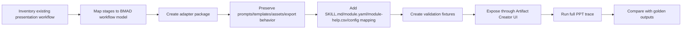

### 11.2 Adapter requirements

| Requirement | Detail |
|---|---|
| Preserve behavior | Keep original prompts, stages, templates, source handling, review steps, and export contract unless a documented adapter decision changes them. |
| BMAD package shape | Add `SKILL.md`, workflow assets, `module.yaml`, `module-help.csv`, config mapping, templates/scripts/assets, validation fixtures. |
| UI path | User starts from “Create presentation,” not from BMAD internals. |
| Approval checkpoints | Source ingestion, outline approval, draft review, refinement, export. |
| Trace | Record sources used, model calls, prompts/templates, assumptions, approvals, export target, generated file hashes. |
| Regression | Golden input/output fixtures prove adapter did not break original workflow logic. |

### 11.3 Artifact paths

| Artifact path | Required v1 behavior |
| --- | --- |
| Presentation / PPTX | Wrap the existing presentation creation skill/workflow as a BMAD workflow package; preserve its current prompts, stages, templates, source handling, review steps, and export contract. Add only the adapter layer needed for BMAD config, traces, approvals, and Artifact Creator UI controls. |
| Document / report | Source ingestion, section outline, review checkpoints, tracked assumptions, export to Markdown/DOCX/PDF where configured. |
| Technical plan | BMAD phase mapping, artifacts, implementation checklist, risks, acceptance criteria, and optional handoff into coding mode. |

### 11.4 Artifact Creator user flow

```text
Choose artifact
→ Add sources
→ Preview outline
→ Approve structure
→ Generate
→ Refine
→ Export
→ Evidence/provenance summary
```

---

## 12. Chat Workbench / Agentic Coding Kernel

The final product must behave like a real coding co-worker, not a passive chatbot.

### 12.1 Required workbench panels

| Panel | Purpose | v1 requirement |
| --- | --- | --- |
| Conversation thread | User intent, agent reasoning summary, questions, step cards, approvals, and final report. | Primary interaction surface. |
| Project/file explorer | Shows selected workspace, dirty files, generated BMAD artifacts, source files, ignored paths, and output folders. | Read-only by default; write operations only via patch approval. |
| Context panel | Shows which files/snippets/logs/artifacts were included in the model context and why. | Required for trust and debugging. |
| Diff panel | Shows file-level and hunk-level patch previews, preimage status, changed lines, and risk labels. | Required before every code write. |
| Terminal/log panel | Streams approved command output from ACA Jobs: install, test, lint, typecheck, build, script validation, export jobs. | No raw shell access in v1; only proposed/approved commands. |
| Artifact preview | Preview BMAD artifacts, generated docs, presentation outlines, slide drafts, reports, and export bundles. | Required for presentation workflow and planning artifacts. |
| Evidence panel | Shows changed files, commands run, validation results, approvals, model calls, costs, rollback point, and unresolved risks. | Required at finalize. |

### 12.2 Side-effect classes by mode

| Mode | Side effects | Approval |
| --- | --- | --- |
| Ask | None. Explain code, BMAD artifacts, architecture, failures, logs, or config. | None. |
| Plan | None. Produce affected files, plan, risks, commands, and validation strategy. | None. |
| Patch proposal | No direct write. Model returns a structured patch proposal and diff metadata. | Preview required. |
| Patch apply | Workspace writes through Workspace Editor. | Always required, with diff preview, path policy, and preimage validation. |
| Command run | Command execution through Code Executor / ACA Jobs. | Required or policy-gated per command allowlist. |
| Repair | Analyze failure logs, propose minimal patch, optionally rerun validations. | Required for patch or command side effects. |
| Artifact generate/export | Write artifact outputs and export bundles such as PPTX/PDF/docs/reports. | Policy-gated; approval required for non-standard output paths or external destinations. |
| Finalize | Export trace/evidence summary and rollback point. | Policy-gated. |

### 12.3 Coding modes

| Mode | Description | Autonomy |
| --- | --- | --- |
| Ask | Explain code, BMAD artifacts, architecture, failures, or config. | Read-only |
| Plan | Produce affected files, implementation plan, risks, commands, and validation strategy. | Read-only |
| Patch | Generate structured patch proposal and diff preview. | Approval required |
| Apply | Apply approved patches to a workspace checkout and create checkpoint metadata. | Approval required |
| Validate | Run tests, lint, typecheck, build, module validation, skill validation, or workflow export checks inside jobs. | Job policy |
| Repair | Analyze failure logs and propose minimal repair patch. | Approval required |
| Review | Review current diff, trace, command logs, artifact preview, and test evidence. | Read-only default |
| Finalize | Summarize changed files, artifacts, tests, unresolved risks, rollback point, and export bundle. | Export-safe |

### 12.4 Minimum successful developer journey

```text
1. User opens a project thread.
2. User asks: “Implement this story / fix this bug / adapt this BMAD artifact into code.”
3. Runtime indexes or refreshes workspace context.
4. Agent asks clarification only if needed.
5. Agent produces implementation plan with affected files, commands, risks, validation strategy.
6. User approves plan direction or asks for changes.
7. Agent proposes structured patch.
8. UI shows diff with file/hunk risk labels and preimage status.
9. Airlock validates patch against path policy, size guard, preimages, schema, and workspace scope.
10. User approves patch.
11. Workspace Service locks checkout and records preimages.
12. ACA Job applies patch in isolated checkout.
13. Runtime creates checkpoint.
14. Agent proposes validation commands.
15. Airlock validates command policy, network policy, resource limits, image digest, credentials.
16. User approves command/job.
17. ACA Job runs tests/build/lint/typecheck/scripts and streams logs.
18. Runtime classifies result.
19. If failed, agent analyzes logs and proposes minimal repair patch.
20. Repair loop repeats within attempt and budget limits.
21. Runtime finalizes with evidence report, changed files, command results, artifacts, approvals, costs, risks, rollback point.
```

### 12.5 Direct model capability restrictions

The model may:

- Request context.
- Ask questions.
- Propose plans.
- Propose patches.
- Propose commands.
- Analyze failures.
- Propose repair patches.
- Summarize results.

The model may not:

- Write files.
- Delete files.
- Run shell commands.
- Install dependencies.
- Push/publish code.
- Change Airlock policy.
- Access secrets.
- Override approval requirements.
- Decide its own network access.

---

## 13. Workspace Intelligence

| Component | Responsibility |
| --- | --- |
| Workspace source adapter | Resolve repo clone, uploaded archive, initialized BMAD project, or optional hybrid local connector into a governed snapshot. |
| Project scanner | Detect languages, frameworks, package managers, validation commands, Git state, BMAD state, and generated skill directories. |
| Ignore engine | Respect .gitignore , .ignore , generated folders, binaries, large files, vendor folders, output folders, and secret paths. |
| Secret filter | Exclude .env , keys, certificates, tokens, credentials, and secret-like strings from prompts, traces, exports, and logs. |
| Lexical search | Use ripgrep-like search over source, docs, tests, config, BMAD artifacts, and validation logs. |
| Structural index | Use tree-sitter or language-native parsers for imports, functions, classes, routes, components, symbols, and call sites where practical. |
| Context pack builder | Build smallest sufficient packs: active BMAD artifact, relevant files/snippets, current diff, prior decisions, failing logs, and validation targets. |
| Project memory | Store approved commands, architecture constraints, project conventions, recurring failure notes, and run-local decisions. |

### 13.1 Context selection order

1. Active BMAD artifact: brief, PRD, UX, architecture, epic, story, sprint status, project context, Builder artifact.
2. Current user objective and recent conversation turns.
3. Current diff, dirty files, checkpoints, and recent job outputs.
4. Lexical search over filenames, symbols, error messages, routes, commands, config keys, and test names.
5. Structural graph for definitions, imports, callers, related tests, and framework entry points.
6. Validation logs and command output when repairing.
7. Semantic retrieval only after lexical + structural retrieval are insufficient and only for large repositories.

### 13.2 Untrusted-content rule

Everything read from a workspace is untrusted content, including Start Heres, comments, docs, generated files, test fixtures, and commit messages. Workspace content can inform context, but it cannot override runtime policies, approval requirements, model system instructions, command allowlists, network rules, or secret handling.

---

## 14. Workspace Service

| Object | Responsibility |
| --- | --- |
| WorkspaceSnapshot | Immutable, content-addressed capture of project source at a point in time. |
| WorkspaceCheckout | Job-scoped materialized working copy derived from a snapshot. Jobs mount checkouts, not canonical snapshots. |
| PreimageHash | Per-file hashes captured at proposal time and verified at apply time. Drift rejects the patch. |
| WorkspaceLock | Write-mode lock for mutable checkpoint chain. Read-only sessions remain concurrent. |
| Checkpoint | Saved post-job or user-approved state with file hash manifest and rollback metadata. |
| RollbackMetadata | Precise changed files, prior hashes, new hashes, job ID, checkpoint ID, and reversibility status. |
| TTL policy | Cleanup for expired checkouts, orphaned locks, scratch caches, logs, and temporary artifact paths. |

### 14.1 Required service commands

```csharp
createSnapshot(projectId, sourceRef) -> WorkspaceSnapshot
checkoutSnapshot(snapshotId, runId, mode) -> WorkspaceCheckout
acquireLock(projectId, runId) -> WorkspaceLock
releaseLock(lockId) -> void
computePreimageHash(checkoutId, paths) -> PreimageHash[]
verifyPreimage(checkoutId, expectedHashes) -> PreimageVerification
recordCheckpoint(checkoutId, runId) -> Checkpoint
rollbackToCheckpoint(checkoutId, checkpointId) -> RollbackResult
sweepExpiredCheckouts() -> CleanupReport
sweepExpiredLocks() -> CleanupReport
```

### 14.2 Workspace principles

- Snapshots are immutable and content-addressed.
- Checkouts are job-scoped materializations.
- Jobs mount checkouts, not canonical snapshots.
- Preimage hashes are captured at proposal time and checked before apply.
- Write locks protect mutable checkpoint chains.
- Read-only operations can remain concurrent.
- TTL cleanup handles expired checkouts, locks, caches, logs, and temporary artifacts.
- Rollback must be exact: changed files, prior hashes, new hashes, job ID, checkpoint ID, reversibility status.

---

## 15. Model Gateway and AI Gateway path

The Model Gateway is the only application component that calls models. It provides structured output enforcement, model profiles, prompt assembly, provider isolation, cost/latency capture, quota/backoff, and trace redaction.

### 15.1 Model call types

| Call type | Schema output | Used for |
| --- | --- | --- |
| classify_intent | intent, confidence, missing_inputs | Route ask/plan/build/review/validate/export/help. |
| select_context | file_read_requests, search_queries, reason | Ask runtime for more context without direct file access. |
| advise_next_step | primary_action, alternatives, blocked_reasons | BMAD Help Advisor. |
| create_method_plan | phase, skill, actions, expected_outputs | BMAD Method planning and Builder setup. |
| create_implementation_plan | steps, affected_files, commands, risks, validation | Coding plan card. |
| propose_patch | patch_operations, rationale, tests | Diff proposal. |
| propose_command | command, cwd, expected_effect, network_mode | Execution proposal. |
| analyze_failure | root_cause, evidence, fix_strategy | Test/build/lint failure repair. |
| repair_patch | minimal_patch, expected_fix | Repair loop. |
| builder_quality_review | findings, severity, suggestions | Builder Studio quality analysis. |
| summarize_run | changed_files, tests, artifacts, unresolved_risks | Final result and export. |

### 15.2 Model profiles

| Profile | Call types | Rule |
| --- | --- | --- |
| fast | intent, context selection, help routing | Cheap/low-latency. |
| strong | plans, patches, failure analysis, repair, Builder quality review | Quality dominates cost. |
| summary | run summaries, export summaries, trace summaries | Mid-tier structured summarization. |

### 15.3 Queue classes

| Queue class | Typical work | Control rule |
| --- | --- | --- |
| interactive_method | Help Advisor, method chat, clarification, outline and plan steps. | Lowest latency, small context, strict per-run token budget. |
| artifact_generation | PPT, document, report, export drafting and refinement. | Separate quota pool from code execution; preview/approve checkpoints before expensive generation. |
| code_execution | implementation plans, patch proposals, failure analysis, repair. | Higher budget ceiling but lower concurrency; never allowed to starve interactive method work. |
| operator_review | Trace summaries, policy investigations, incident summaries. | Priority path during incidents; no raw content expansion unless authorized. |

### 15.4 Budget controls

Required controls:

- Per-run token/cost budget.
- Per-user budget.
- Per-project budget.
- Per-model-profile budget.
- Per-deployment RPM/TPM guard.
- Per-queue-class quota.
- Repair attempt cap.
- Backpressure cards when saturated.
- Safe downgrade rules where available.
- Operator-configurable model profiles by environment.

### 15.5 v1 vs v1.5/v2 gateway split

| Layer | v1 | v1.5/v2 |
|---|---|---|
| Model Gateway | Application-level service/module controlling model calls. | Still used for app-specific schemas, traces, and call types. |
| AI Gateway/APIM | Optional or light policy layer. | Add APIM AI Gateway in front for infrastructure-level quotas, backend routing, safe semantic cache for read-only calls, per-user/project controls. |

---

## 16. Airlock and executor

Airlock is the safety boundary between model proposals and side effects. It validates every proposal before the runtime applies a patch, starts a container job, restores dependencies, writes artifacts, or exports bundles.

### 16.1 Execution classes

| Class | Allowed behavior | Approval |
| --- | --- | --- |
| Read-only | Search, read files, inspect config, build context, explain. | No approval unless sensitive trace access. |
| Artifact write | Write BMAD artifacts to declared output folders. | Approval required unless user explicitly invoked the artifact workflow and output path is standard. |
| Code write | Patch source files, create/delete files, modify configs. | Always approval required with diff preview and preimage validation. |
| Command/job | Run tests, install deps, build, script validation, module validation. | Approval + command allowlist + network/resource policy. |
| Blocked | Credential exfiltration, privilege escalation, recursive destructive deletes, broad network pipelines, secret export, push/publish. | Never allowed in v1. |

### 16.2 Required checks

| Check | Purpose |
| --- | --- |
| Schema validation | Reject malformed model output before any proposal becomes actionable. |
| Workspace scope allowlist | Only selected workspace checkout and declared artifact/cache paths are reachable. |
| Path denylist | Block .git , secrets, OS paths, undeclared volumes, and protected runtime paths. |
| Diff validation | Patch applies cleanly, matches preimages, stays within disclosed files, and is reviewable. |
| Large-change guard | Force splitting or explicit large-change acknowledgement above changed-file/line ceilings. |
| Command policy | Allow safe validation commands; block unknown/risky commands unless operator-approved policy exists. |
| Network policy | Network off by default; allowlist registries/domains only per execution class. |
| Scoped credentials | Jobs receive short-lived path-scoped SAS or equivalent; never broad storage identity or repo credentials. |
| Image digest pinning | ExecutionSpec references image digest, not mutable tag. |
| Post-validation | Check expected files, checksums, tests, artifacts, logs, and job result integrity. |

### 16.3 Proposal types

```text
method_skill_run
builder_generate
builder_validate
workspace_prepare
patch_apply
command_run
dependency_restore
test_run
lint_run
typecheck_run
artifact_generate
module_install
git_checkpoint
export_package
hybrid_connector_call
```

### 16.4 Executor rules

- Executor consumes immutable `ExecutionSpec`.
- Executor image must be digest-pinned.
- Executor runs with scoped credentials only.
- Executor does not make policy decisions.
- Executor does not own run state.
- Executor writes results/logs/artifacts to Blob and structured job status to SQL.
- Executor returns enough metadata for trace/evidence reconstruction.
- Executor must fail closed on missing policy, missing schema version, missing preimage, or unauthorized path/command/network.

### 16.5 Default command posture

- No raw terminal in v1.
- The user sees proposed commands before execution.
- Commands must include `cwd`, expected effect, network mode, resource profile, timeout, output capture policy, and validation target.
- Unknown commands require explicit approval and may require operator policy.
- Block privilege escalation, credential export, broad destructive deletes, shell-to-network pipelines, and push/publish.

---

## 17. Data, trace, and observability

Everything important must be reconstructable: what happened, who approved it, what the model saw, what changed, what commands ran, what artifacts were produced, and how the result was validated.

### 17.1 Runtime/domain object model

```text
User
Role
Group
Project
ProjectAssignment
ProjectSource
WorkspaceSnapshot
WorkspaceCheckout
WorkspaceLock
Checkpoint
RollbackRecord
BMADPackage
BMADModule
BMADSkill
BMADWorkflow
BMADAction
CapabilityEntry
ConfigOverlay
MethodRun
MethodStep
Thread
Message
ContextPack
Proposal
Approval
ExecutionSpec
ExecutionJob
CommandRun
ValidationResult
Artifact
Export
ModelCall
AirlockDecision
PolicyEvent
TraceEvent
EvidenceClaim
EvidenceLink
BuilderDraft
BuilderArtifact
SkillRelease
ModuleRelease
EvalRun
Budget
Incident
AuditEvent
```

### 17.2 Azure SQL tables

Required structured tables/classes:

```text
users, roles, groups, project_assignments
projects, project_sources, module_registry, installed_modules, skill_definitions, capability_entries
threads, messages, runs, run_steps, method_state
proposals, approvals, execution_specs, job_executions, validation_results
workspace_snapshots, workspace_checkouts, workspace_locks, checkpoints
model_calls, context_packs, airlock_decisions, policy_events
artifacts, exports, audit_events, budgets, incidents
```

### 17.3 Blob containers

| Container | Stores |
| --- | --- |
| snapshots | Content-addressed source blobs and snapshot manifests. |
| checkouts | Temporary job materialization packages and job-scoped inputs. |
| artifacts | BMAD outputs, Builder outputs, reports, generated docs, validation reports. |
| logs | stdout/stderr, job logs, validator output, failure analysis evidence. |
| diffs | Patch proposals, applied diffs, large-change summaries, rollback manifests. |
| traces | Trace bundles with redacted prompts/context/model calls/approvals. |
| exports | Downloadable final packages. |

### 17.4 Versioned evidence and compatibility

| Serialized object | Required version fields | Compatibility rule |
| --- | --- | --- |
| BMAD package import | schemaVersion , runtimeMinVersion , sourcePackageVersion | Reject incompatible packages with migration guidance; preserve unknown metadata. |
| Builder output | builderVersion , outputSchemaVersion , runtimeTestedVersion | Preview allowed before migration; registration blocked until validation passes. |
| Trace bundle | traceSchemaVersion , redactionPolicyVersion , runtimeVersion | Replay readers support at least two previous minor versions. |
| Checkpoint manifest | manifestVersion , snapshotHashAlgorithm , createdByRuntimeVersion | Rollback requires manifest reader compatibility before execution. |

### 17.5 Privacy defaults

- Operational telemetry is always on.
- Content telemetry is minimized and redacted by default.
- Raw prompts are not retained by default in production traces.
- Raw context packs are not retained by default in production traces.
- Full workspace-derived traces require explicit retention policy, elevated access, and audit logging.
- Trace UI should expose evidence summaries and hashes by default, not raw sensitive content.

### 17.6 Observability requirements

- Application Insights: API latency, model call latency, schema failures, UI errors.
- Log Analytics: ACA job state, stdout/stderr summaries, policy events, operator actions.
- Azure Monitor: platform metrics, budgets, failures, storage growth, quota pressure.
- OpenTelemetry correlation: browser session → API request → model call → proposal → approval → job → artifact/export.
- Metrics: run success rate, validation pass rate, repair success rate, average approvals per run, budget spend, model cost per run, job failure taxonomy, blocked operation count.
- Alerts: job failure spikes, policy violations, budget thresholds, storage growth, long-held locks, repeated schema failures, model quota pressure.

---

## 18. Security and operations

| Concern | v1 rule |
| --- | --- |
| Authentication | Single-tenant Entra ID; App Service auth where possible; API validates tokens. |
| Authorization | User, Operator, Admin roles; project assignment by user/group; no implicit access to every repo. |
| Source credentials | Repo credentials live in Key Vault and are injected only into snapshot creation, never into model context, worker logs, or exports. |
| Job credentials | Jobs receive short-lived, path-scoped access to their checkout and artifact path. |
| Network | ACA environment chosen by ADR: default network for MVP only if acceptable; VNet/workload profile environment if private endpoints, firewall, NSGs, or controlled egress are needed. |
| Secrets | Secret scan on context, logs, artifacts, exports, and generated patches. |
| Retention | Separate retention policies for traces, logs, snapshots, exports, and project artifacts. |
| Audit | Every approval, rejected proposal, policy override, trace access, config change, and role change is audited. |
| Availability | Internal MVP target: backup/restore tested; not yet active-active. Build migration path instead of pretending enterprise HA from day one. |
| Managed identity | Default identity primitive for App Service, Container Apps, jobs, Key Vault, Blob, SQL, ACR, and monitoring integrations. Long-lived secrets are exceptions requiring an ADR. |
| Storage access | Prefer user delegation SAS or equivalent short-lived scoped access; account-key SAS is blocked for runtime-generated access unless an operator break-glass policy allows it. |
| Network isolation | Production chooses workload profiles environment; private endpoints for Key Vault, SQL, Blob, and ACR where feasible; egress allowlists for jobs. |
| Supply-chain controls | SBOMs, image signing, provenance attestations, pinned CI actions, OIDC to Azure, CODEOWNERS for workflow/IaC/security policy files. |
| Telemetry privacy | Raw model prompts and workspace content are not retained by default in production traces; redacted summaries and hashes are the default evidence surface. |

### 18.1 Supply-chain baseline

- Generate SBOMs for worker images and release artifacts.
- Sign images and artifacts where feasible.
- Produce provenance attestations.
- Pin GitHub Actions / CI actions by SHA where possible.
- Use OIDC for Azure access instead of long-lived cloud secrets.
- CODEOWNERS protects workflow/IaC/security policy files.
- Run dependency, license, and container vulnerability scans.
- Digest-pin worker images in `ExecutionSpec`.
- Treat module packages as executable supply-chain artifacts.

### 18.2 Identity and access

- Single-tenant Entra ID for internal release.
- User, Operator, Admin roles.
- Project assignment by user/group.
- No implicit access to every repository.
- Managed identity for service-to-service Azure access.
- Short-lived scoped storage access for jobs.
- Repo credentials injected only into snapshot creation; never into model context or logs.

---

## 19. Workflow and runtime state model

### 19.1 State objects

| State object | States |
| --- | --- |
| Run | created , indexing , planning , waiting_for_input , waiting_for_approval , executing , validating , repairing , completed , blocked , failed , cancelled . |
| Method step | available , recommended , required , blocked , running , completed , superseded . |
| Proposal | draft , airlock_validating , pending_approval , approved , rejected , expired , executed , voided_by_drift . |
| Job | queued , starting , running , succeeded , failed , timed_out , cancelled , lost . |
| Builder artifact | draft , generated , structural_fail , quality_warn , validated , registered , exported . |

### 19.2 Canonical state machines

```text
Method run:
CREATED → LOADED → IN_PROGRESS → WAITING_FOR_INPUT → WAITING_FOR_APPROVAL → EXECUTING → VALIDATING → REPAIRING → COMPLETED

Proposal:
DRAFT → AIRLOCK_VALIDATED → NEEDS_APPROVAL → APPROVED → EXECUTED → VERIFIED
      ↘ REJECTED / EXPIRED / VOIDED_BY_DRIFT

Builder output:
DRAFT → STATIC_VALID → EVAL_PASSED → SECURITY_REVIEWED → PACKAGED → PUBLISHED → DEPRECATED

Execution job:
QUEUED → PREPARING → RUNNING → SUCCEEDED
                         ↘ FAILED / TIMED_OUT / CANCELLED → ARCHIVED
```

### 19.3 Failure taxonomy

| Failure class | Example | Runtime response |
| --- | --- | --- |
| Loader failure | Invalid module.yaml | Block the package with fix guidance; nothing runs from a half-loaded module. |
| Catalog failure | Duplicate menu code, orphan CSV row | Block module registration; report the exact row. |
| Context failure | Referenced file unavailable | Ask for source correction; never fabricate content. |
| Airlock failure | Blocked command, out-of-scope path | Show the policy reason; no retry, a human looks at it. |
| Patch failure | Preimage mismatch | Regenerate the patch against the current snapshot. |
| Execution failure | Command exits non-zero | Analyze logs; route to validation-failure handling. |
| Validation failure | Tests fail | Feed the repair loop; counts against the attempt cap. |
| Budget failure | Token or job budget exceeded | Pause the run with a budget card; never keep calling the model. |
| Secret failure | Credential detected in output | Redact, block export, raise a policy event. |
| Infrastructure failure | Job scheduling error, image pull failure | Bounded idempotent retry; never consumes a repair attempt; operator alert on repetition. |

### 19.4 Quality gates

| Gate | Inputs | Blocking checks | Outputs |
|---|---|---|---|
| Package loading gate | BMAD files, module registry, configs | Missing/invalid `module.yaml`, invalid `SKILL.md`, orphan help rows, duplicate menu codes, incompatible schema | Registered module/capabilities or blocking report |
| Skill invocation gate | Skill metadata, required inputs, method state | Missing inputs, blocked phase, invalid config, permissions | Invocation plan or user question |
| Builder generation gate | User intent, template, Builder config | Missing required metadata, invalid target, unsafe prompt/content | Builder draft |
| Builder validation gate | Builder draft/package | Structural validation, evals, security review, installation rehearsal, invocation rehearsal | Validated/registered module or fix report |
| Patch approval gate | Structured patch proposal | Schema, path policy, preimage, large-change guard, diff review | Approved/expired/rejected patch |
| Command execution gate | Command proposal | Allowlist, cwd, network, timeout, image digest, secrets, resource limits | ExecutionSpec or blocked policy card |
| Finalization gate | Run state, job results, artifacts | Unresolved failures, missing validation, blocked export, trace completeness | Final evidence report |
| Export gate | Artifact/export target | Path policy, source provenance, secret scan, retention policy | Export bundle |
| Publication gate | Module/agent release | Signing, provenance, compatibility, eval regression, operator approval | Published/rejected release |

---

## 20. APIs and contracts

### 20.1 Contract posture

The Runtime API must be OpenAPI-first. The web UI should consume generated typed clients instead of ad-hoc fetch wrappers. All long-lived serialized objects need schema/version records.

### 20.2 Runtime surfaces

| API surface | Purpose | Example endpoints |
|---|---|---|
| Run API | Chat threads, runs, messages, events, approvals, proposals, jobs, trace summaries | `POST /threads`, `POST /threads/{id}/messages`, `GET /runs/{id}`, `POST /proposals/{id}/approve`, `GET /runs/{id}/events` |
| Package API | BMAD packages, modules, skills, capabilities, Builder outputs, validation reports | `POST /packages/import`, `GET /packages`, `GET /capabilities`, `POST /builder/validate`, `POST /modules/register` |
| Workspace API | Project source, snapshots, checkouts, context packs, file tree, diff preview, rollback | `POST /projects/{id}/snapshots`, `GET /workspaces/{id}/tree`, `POST /context-packs`, `POST /checkpoints/{id}/rollback` |
| Operator API | Users, roles, project assignment, budgets, model profiles, policy, incidents, trace access | `GET /operator/projects`, `POST /operator/assignments`, `PUT /operator/model-profiles`, `GET /operator/incidents` |
| Artifact API | Artifact creation/refinement/export and provenance | `POST /artifacts/create`, `POST /artifacts/{id}/refine`, `POST /artifacts/{id}/export`, `GET /artifacts/{id}/provenance` |

### 20.3 Required schemas

```text
RunRequest.schema.json
MessageRequest.schema.json
ContextRequest.schema.json
ImplementationPlan.schema.json
PatchProposal.schema.json
CommandProposal.schema.json
ExecutionSpec.schema.json
AirlockDecision.schema.json
Approval.schema.json
JobResult.schema.json
ValidationResult.schema.json
FailureAnalysis.schema.json
RepairPatch.schema.json
FinalReport.schema.json
BMADPackageImport.schema.json
BuilderOutput.schema.json
TraceBundle.schema.json
CheckpointManifest.schema.json
ArtifactExport.schema.json
```

### 20.4 Versioning rules

- Every schema has a version.
- Every persisted serialized object stores the schema version and runtime version.
- Readers support at least two previous minor versions for trace bundles and checkpoint manifests.
- Incompatible objects fail with explicit migration-required errors.
- Unknown metadata is preserved unless policy forbids it.
- Contract tests run in CI.

---

## 21. UI/UX product model

### 21.1 Primary navigation

| Mode | User mental model | Main screens/panels |
|---|---|---|
| Create | “I need a deliverable.” | Artifact Creator, sources, outline preview, generated artifact, export, provenance. |
| Run BMAD | “I need to follow BMAD Method.” | Chat, phase cards, Help Advisor, workflow steps, artifact previews. |
| Build BMAD | “I need to create/modify a skill/workflow/module.” | Builder Studio, validation report, eval runner, module package preview. |
| Implement | “I need this plan/story turned into code.” | Chat Workbench, file tree, context, diff, terminal logs, approval cards, evidence. |
| Operate | “I need to manage users, policies, runs, budgets, incidents.” | Operator Console, queues, budgets, traces, incidents, project assignments. |

### 21.2 Required card types

- Intent card.
- Method phase card.
- Missing input card.
- Help Advisor recommendation card.
- Context pack card.
- Implementation plan card.
- Diff proposal card.
- Airlock decision card.
- Approval card.
- Command proposal card.
- Job progress card.
- Validation result card.
- Failure analysis card.
- Repair proposal card.
- Artifact preview card.
- Provenance card.
- Final evidence report card.
- Rollback checkpoint card.
- Budget/backpressure card.
- Policy denial card.

### 21.3 Accessibility and localization

- WCAG 2.2 AA target for core flows.
- Full keyboard navigation.
- Visible focus states.
- Screen-reader labels for approvals, diffs, logs, artifacts, and trace events.
- Live regions for streaming logs/job state.
- Risk labels cannot rely on color only.
- High-contrast diff mode.
- Externalized strings.
- Locale-aware date/time, duration, cost, filesize, and number formatting.
- Layouts must tolerate longer localized labels.

---

## 22. MVP scope

| MVP capability | Included |
| --- | --- |
| Auth/project access | Entra sign-in, User/Operator/Admin, project assignment, one active workspace per run. |
| BMAD import/init | Load existing BMAD project, initialize plain repo with BMAD core/method, import Builder module. |
| BMAD Help Advisor | Show installed capabilities, recommend next step, route to skills/actions. |
| Method workflows | Run at least product brief/PRD, architecture/readiness, story/quick-dev-style implementation path. |
| Builder Studio | Create/analyze/validate one workflow skill, one agent skill, and one module package. |
| Workspace intelligence | Scanner, ignore/secret rules, lexical search, structural index for TypeScript/C# first. |
| Implementation Engine | Plan, patch proposal, diff preview, approval, ACA job apply, validation command, repair proposal. |
| Trace/rollback/export | Trace viewer, checkpoints, rollback, export bundle. |
| Operations | Bicep IaC, observability, budgets, retention, baseline policy tests. |

### 22.1 MVP success metrics

| Metric | What it measures |
| --- | --- |
| BMAD package load success rate | Source compatibility — the "BMAD-native" promise, quantified. |
| Skill invocation success rate | Runtime reliability across stock and authored skills. |
| Patch apply success rate | Context and diff quality. |
| Validation pass rate after first patch | Implementation quality before the repair loop. |
| Repair success rate | Whether the coding loop is real or theatre. |
| Approval latency | UX friction at the trust boundary. |
| Approve → green time | The execution latency budget as a product number. |
| Token cost per completed run | Model efficiency; feeds profile tuning. |
| Builder validation pass rate | Generated asset quality. |
| Policy denial rate | Safety friction — too high means policy tuning, not user blame. |

### 22.2 MVP cut line

Must prove three loops:

1. **BMAD Method loop:** load package → advise next step → run method workflow → save artifact.
2. **Builder loop:** create/analyze skill/module → validate → register/export.
3. **Governed coding loop:** ask → inspect → plan → patch proposal → approval → apply → validate → repair → final evidence.

Anything not proving those loops is secondary.

---

## 23. Roadmap

### Phase 0 — Spike and ADR lock

Goal: lock irreversible architecture decisions before full implementation.

Experiments:

1. ACA Job cold start vs warm/session-style latency for patch rehearsal and short tests.
2. One durable run with approval wait, simulated crash, and resume without repeated model calls.
3. Airlock red-team pass: malicious Start Here, hidden instructions, dependency scripts, shell injection, path traversal, secrets.
4. One Builder skill through validate → eval → signed release manifest.
5. One real story producing claim → evidence → verification matrix.
6. Cost benchmark across method run, artifact generation, and code execution.

Exit artifacts:

- ADRs.
- Sequence diagrams.
- Initial data model.
- Execution policy matrix.
- Cost estimate.
- MVP cut line.
- Bicep skeleton.

### Phase 1 — Cloud foundation

Build:

- App Service web app.
- Container Apps environment.
- Azure SQL.
- Blob Storage.
- ACR.
- Key Vault.
- Managed identities.
- Entra auth.
- CI/CD.
- Basic OpenAPI skeleton.

Exit:

- Authenticated user can open empty project shell with persisted threads.

### Phase 2 — BMAD runtime kernel

Build:

- Package loader.
- Config resolver.
- Capability catalog.
- Help Advisor.
- Method state.
- Artifact storage.

Exit:

- User can load/run BMAD Method flow and get next-step guidance.

### Phase 3 — Builder Studio MVP

Build:

- Agent Builder.
- Workflow Builder.
- Module Builder.
- Setup Builder.
- Convert Skill.
- Validate Module.
- Eval Runner MVP.
- Module packaging.

Exit:

- User creates and validates a runnable BMAD module from the UI.

### Phase 4 — Governed coding loop

Build:

- Workspace Intelligence.
- Workspace Service.
- Context packs.
- Implementation plan.
- Patch proposal.
- Diff preview.
- Airlock.
- Approval.
- ACA Job apply.
- Validation commands.
- Repair loop.
- Checkpoint/rollback.

Exit:

- User moves from story/request to approved patch and passing validation.

### Phase 5 — Artifact Creator + presentation workflow

Build:

- Inventory existing presentation workflow.
- Adapter package.
- Artifact Creator UI.
- Source ingestion.
- Outline approval.
- Draft/refine/export.
- Provenance and golden regression fixtures.

Exit:

- User can create a presentation through the imported workflow without seeing BMAD internals by default.

### Phase 6 — Hardening and internal release

Build:

- Trace viewer.
- Rollback UI.
- Export bundles.
- Policy tests.
- Budget controls.
- Retention rules.
- Operator pages.
- Docs.
- Accessibility pass.
- Localization foundation.
- SBOM/provenance/signing.

Exit:

- Internal v1 supports method use, building, artifact generation, and governed implementation end-to-end.

### v1.5 — Strategic upgrades

Add selectively:

- Fast sandbox/session lane if job latency hurts UX.
- Evidence cards on patch approvals.
- Method Map.
- Execution Cockpit.
- Skill Registry MVP.
- AI Gateway/APIM quota layer.
- Better eval harvesting.
- Replay regression corpus expansion.

### v2 — Method OS

Add:

- Durable orchestration.
- Full SkillOps releases.
- Promotion channels.
- Module signing and publication.
- Evidence graph.
- Trace replay UI.
- Advanced evals.
- Managed agent publication path.
- Optional Teams/Copilot/Foundry Agent publication for stable BMAD agents, without replacing the core BMAD Runtime.

---

## 24. Implementation backlog

| ID | Epic | Key tasks |
| --- | --- | --- |
| T01 | Cloud foundation | App Service, Container Apps environment, ACA Jobs, Azure SQL, Blob, ACR, Key Vault, managed identities, Bicep, CI/CD. |
| T02 | Identity and access | Entra sign-in, User/Operator/Admin roles, project assignments, audited elevated trace access. |
| T03 | Model Gateway | Azure AI provider, fake provider, schemas, profiles, streaming, budgets, quota/backoff, telemetry. |
| T04 | Chat workbench shell | Conversation, composer, project sidebar, file tree, context panel, diff panel, terminal/log panel, artifact preview, approval cards, SignalR/WebSocket job stream, operator pages. |
| T05 | BMAD package loader | Load modules, SKILL.md, module.yaml, module-help.csv, generated skill dirs, web bundles, registry metadata. |
| T06 | Config resolver | TOML four-layer merge, skill customization merge, Builder YAML importer/emitter, user/team separation. |
| T07 | Capability catalog | Parse help rows, menu codes, phases, actions, args, output locations, next-step graph, docs meta rows. |
| T08 | BMAD Help Advisor | Installed capability discovery, artifact detection, next-step recommendations, blocked reasons, alternatives. |
| T09 | Method workflow runner | Interactive/headless skill invocation, pauses, artifact drafts, output routing, trace state. |
| T10 | Builder Studio | Agent Builder, Workflow Builder, Module Builder, Setup Builder, Convert Skill, Analyze, Validate Module UI. |
| T11 | Builder validation | Frontmatter lint, skill validator compatibility, module validator, quality report, eval runner integration. |
| T12 | Workspace Intelligence | Scanner, ignore/secret rules, ripgrep, tree-sitter, context packs, project memory. |
| T13 | Workspace Service | Snapshots, checkouts, content-addressed blobs, locks, preimages, checkpoints, rollback, TTL sweepers. |
| T14 | Airlock | Proposal schemas, classes, path policy, command policy, network policy, large-change guard, approval TTL. |
| T15 | Executor jobs | Digest-pinned Python worker images, scoped SAS, patch apply, command runner, test/lint/typecheck/build, job result upload. |
| T16 | Patch/diff engine | Structured patch format, diff preview, atomic writes, preimage verification, split diff workflow. |
| T17 | Validation and repair loop | Detect commands, run validations, classify failures, propose repairs, cap attempts, rerun validations. |
| T18 | Trace and observability | Trace bundles, SQL event model, Blob evidence, App Insights, Log Analytics, job taxonomy, cost metrics. |
| T19 | Export and handoff | Export BMAD artifacts, code diff, validation report, trace bundle, module package, external tool skill bundle. |
| T20 | Security hardening | Secret scanning, credentials isolation, policy regression tests, retention, backup/restore, incident runbooks. |
| T21 | Docs and examples | Internal docs, sample BMAD project, sample Builder module, operator guide, user guide, troubleshooting. |
| T22 v1.5 | Evidence cards & approval contracts | Claim → evidence → verification cards on patch approvals, security-scan findings folded into approval cards, ApprovalContract scope objects, trace records shaped as future graph edges. |
| T23 v1.5 | Skill Registry & SkillOps metadata | Registry UI over installed modules and Builder outputs, validation/eval status surfacing, release manifests with provenance, groundwork for channels and signing. |
| T24 v1.5 | Execution fast lane | Warm sandbox sessions for patch rehearsal and short probes, routing policy between lanes, same Airlock classes enforced — built only if the Phase 0 latency benchmark demands it. |
| T25 v1 | Contracts, APIs, and SDK boundary | OpenAPI specs for Run API, Package API, Operator API; versioned ExecutionSpec; generated TypeScript/.NET clients; API contract tests; CLI design stub. |
| T26 v1 | Artifact Creator mode + existing presentation flow | PPT/doc/report shell, with the existing presentation creation workflow imported first as a BMAD package; template/style controls, source ingestion, outline approval, previews, provenance cards, export status, artifact-specific trust panel. |
| T27 v1 | Quota-aware scheduler | Queue classes, admission control, per-user/project/model budgets, regional/deployment fallback rules, backpressure cards, spend dashboards. |
| T28 v1 | Supply-chain provenance | SBOM generation, image signing, release attestations, SHA-pinned CI actions, OIDC cloud auth, CODEOWNERS, dependency/license reports. |
| T29 v1 | Schema/version migration layer | Package schema versions, Builder output versions, trace bundle readers, checkpoint manifest readers, migration reports, compatibility fixtures. |
| T30 v1 | Accessibility and localization foundation | WCAG 2.2 AA checklist, keyboard/screen-reader QA, high-contrast diff mode, externalized strings, locale-aware formatting. |
| T31 v1 | Replay regression corpus | Golden BMAD packages, Builder outputs, malicious repo fixtures, trace bundles, checkpoint manifests, patch/preimage cases, replay tests in CI. |
| T32 v1 | Existing presentation workflow integration | Inventory current workflow assets, map steps to BMAD workflow stages, create adapter package, preserve original prompts/templates/export behavior, add validation fixtures, expose through Artifact Creator, and replay one full PPT generation trace. |
| T33 | Chat-first agentic coding workbench | Implement end-to-end chat coding loop: inspect workspace, build context pack, plan, propose patch, preview diff, approve/apply patch, propose/run command, stream logs, repair failures, create checkpoint, finalize evidence. |

---

## 25. Acceptance criteria

| ID | Criterion |
| --- | --- |
| AT-001 | User signs in with Entra ID and only sees assigned projects. |
| AT-002 | Operator can assign a project to a user or group and revoke access. |
| AT-003 | Plain repo can be initialized/imported into a BMAD-ready workspace without Cortex concepts. |
| AT-004 | Existing BMAD project loads installed modules and generated skill directories. |
| AT-005 | SKILL.md frontmatter is parsed and invalid frontmatter produces a blocking validation error. |
| AT-006 | module.yaml and module-help.csv are parsed into MethodModule and CapabilityEntry records. |
| AT-007 | Help catalog shows Core, BMad Method, and BMad Builder capabilities with phases/actions/outputs. |
| AT-008 | BMAD Help Advisor recommends next step based on current artifacts and required/optional workflow state. |
| AT-009 | Config resolver reproduces TOML four-layer merge semantics. |
| AT-010 | Skill customization resolver merges skill defaults and team/user overlays. |
| AT-011 | Builder YAML setup assets can be imported/migrated without becoming the canonical Method config format. |
| AT-012 | User can run a BMAD planning workflow and preview/save its artifact. |
| AT-013 | User can run implementation readiness and see PASS/CONCERNS/FAIL-style routing. |
| AT-014 | User can create/analyze a workflow skill in Builder Studio. |
| AT-015 | User can create/analyze an agent skill in Builder Studio. |
| AT-016 | User can scaffold and validate a module package from Builder outputs. |
| AT-017 | Builder validation catches missing module.yaml fields, orphan CSV entries, duplicate menu codes, invalid before/after refs, and missing skill capability entries. |
| AT-018 | Eval runner can run at least one trigger eval and one artifact eval in a clean workspace. |
| AT-019 | Workspace scanner detects languages/frameworks/package managers/validation commands. |
| AT-020 | Secret filter prevents credentials from entering model prompts and exports. |
| AT-021 | Context pack shows provenance for each included snippet/file/log. |
| AT-022 | Model Gateway records profile, deployment, tokens, latency, schema status, and cost estimate for every model call. |
| AT-023 | Run budget pause occurs before additional model calls exceed configured budget. |
| AT-024 | Model cannot write files or run commands directly. |
| AT-025 | Patch proposal shows affected files, rationale, tests, and diff preview before approval. |
| AT-026 | Airlock rejects a patch when preimage hashes drift. |
| AT-027 | Airlock blocks protected paths, secrets, recursive destructive deletes, credential export, and push/publish commands. |
| AT-028 | Large diff requires split or explicit large-change acknowledgement. |
| AT-029 | Approved patch executes inside an ACA Job with digest-pinned image. |
| AT-030 | Job receives only path-scoped temporary storage credentials. |
| AT-031 | Validation command runs with configured timeout, network mode, CPU/memory budget, stdout/stderr capture. |
| AT-032 | Failure analysis produces evidence-linked root cause and minimal repair proposal. |
| AT-033 | Repair loop stops after configured attempt cap. |
| AT-034 | Checkpoint is created before/after approved write operations as configured. |
| AT-035 | Rollback restores files and reports exactly what changed. |
| AT-036 | Live job status/logs stream to the UI without SQL polling. |
| AT-037 | Trace bundle includes selected context, prompts, model calls, Airlock decisions, approvals, diffs, jobs, logs, artifacts, and checkpoints with secrets redacted. |
| AT-038 | Operator can inspect policy events, failed jobs, long-held locks, budget pressure, and storage growth. |
| AT-039 | Export bundle can be downloaded with artifacts, diff, validation report, and trace summary. |
| AT-040 | No v1 path auto-pushes code to GitHub/Azure DevOps. |
| AT-041 | Policy regression suite runs in CI and catches historical allow/deny flips. |
| AT-042 | Backup/restore of SQL and Blob critical data is tested. |
| AT-043 | Final internal demo completes: Help Advisor → PRD/architecture/story path → patch → validation → repair if needed → trace/export. |
| AT-044 | A workflow run binds a {doc_workspace} , appends decisions to .memlog.md through the governed utility lane, pauses, and resumes in a later session from the memlog with prior decisions intact and no repeated model calls. |
| AT-045 | Utility-lane helper scripts ( resolve_config.py , resolve_customization.py , memlog.py ) execute in-runtime without a container job round-trip; a script attempting a write outside the bound run folder is blocked and the attempt is traced. |
| AT-046 | The Reviewer Gate dispatches parallel review subagents that persist review-{slug}.md files to the doc workspace and return only compact summaries; findings surface tiered with a one-line verdict first. |
| AT-047 | Adversarial workspace content (malicious Start Here, hidden instruction, dependency script) cannot change an operation's Airlock class, skip an approval, or expand workspace scope; the attempt is visible in the trace. |
| AT-048 | A Builder output that fails deterministic validation cannot be registered, run against a real project, or exported as ready — preview remains available, promotion is blocked with the exact failing check. |
| AT-049 v1.5 | An approved patch carries an evidence card linking each claim to its supporting artifact and verification (test result, scan, or preimage check). |
| AT-050 | Runtime exposes versioned Run API, Package API, and Operator API contracts through OpenAPI, and the web UI consumes generated typed clients rather than ad-hoc fetch wrappers. |
| AT-051 | Every importable package, Builder output, trace bundle, export bundle, and checkpoint manifest carries an explicit schema/version record and compatibility decision. |
| AT-052 | A non-technical user can create a presentation from source material through artifact selection, outline preview, approval, generation, refinement, and export without seeing BMAD file/phase jargon unless they open details. |
| AT-053 | Artifact generation shows provenance/trust information: source files used, model profile, estimated cost, side-effect class, export target, and unresolved assumptions. |
| AT-054 | Model Gateway enforces separate queue classes and budgets for interactive method work, artifact generation, code execution, and operator review. |
| AT-055 | When model quota or job capacity is saturated, the UI shows a backpressure card with queue class, reason, retry path, and whether a safe downgrade is available. |
| AT-056 | Production IaC deploys Container Apps into a workload profiles environment unless an accepted ADR proves the simpler environment is sufficient and migration-safe. |
| AT-057 | Jobs use managed identity and short-lived scoped storage access; broad account keys, repo credentials, and unrestricted storage credentials are absent from job environments. |
| AT-058 | CI/CD produces SBOMs and provenance attestations for deployable images/artifacts, pins third-party actions, uses OIDC for Azure access, and protects workflow/IaC changes with CODEOWNERS. |
| AT-059 | Production traces redact raw prompts and workspace content by default; elevated raw trace access is time-limited and audited. |
| AT-060 | OpenTelemetry correlation links browser session, API request, model call, proposal, approval, execution job, validation result, artifact, and export. |
| AT-061 | Replay tests can read at least two previous minor versions of trace bundles and checkpoint manifests, or fail with an explicit migration-required result. |
| AT-062 | WCAG 2.2 AA checks pass for core flows: create artifact, run BMAD method, approve patch, inspect job logs, view trace, and operate cockpit. |
| AT-063 | User-facing strings are externalized and core screens tolerate longer localized labels without layout collapse. |
| AT-064 | Policy regression corpus includes malicious Start Here/instruction-in-file cases, secret leakage cases, CI workflow tampering cases, and unsafe command proposals. |
| AT-065 | The existing presentation creation skill/workflow is imported or converted into a BMAD-compliant package with SKILL.md, workflow assets, capability catalog entry, configuration mapping, templates/scripts/assets, and an explicit output/export contract. |
| AT-066 | A user can run the imported presentation workflow through Artifact Creator from source ingestion to outline approval, draft generation, refinement, export, provenance view, and trace bundle without seeing BMAD internals by default. |
| AT-067 | Regression fixtures prove the imported presentation workflow preserves the original workflow logic, stage order, required inputs, template behavior, and export contract unless a documented adapter decision changes them. |
| AT-068 | The primary developer surface is a chat workbench with conversation, file tree, context panel, diff panel, terminal/log panel, artifact preview, approval cards, and evidence summary in one project thread. |
| AT-069 | A user can ask the agent to implement a story, inspect selected files, receive an implementation plan, review a structured patch proposal, approve it, and have the runtime apply the patch with preimage verification and checkpoint creation. |
| AT-070 | A user can approve validation commands and see tests/builds/linters/scripts run in isolated ACA Jobs with streamed logs, command policy enforcement, resource limits, scoped credentials, and persisted job results. |
| AT-071 | After a patch and validation loop, the runtime produces a final evidence report listing changed files, commands run, validation outcomes, artifacts generated, approvals, model/tool costs, unresolved risks, and rollback point. |

---

## 26. Risks and mitigations

| Risk | Impact | Mitigation |
| --- | --- | --- |
| BMAD source changes faster than runtime model | Loader drift and broken imports. | Version modules, keep source-contract tests, support unknown fields as metadata, and validate against real ZIP fixtures. |
| Builder YAML/TOML mismatch | Config corruption or confusing setup behavior. | Use typed internal config, TOML canonical path, and explicit Builder YAML migration/import/export tests. |
| ACA Job startup latency | Poor UX for small validations. | Warm pools where possible, lightweight worker images, batch validations, show queued/starting states clearly. |
| Untrusted repo prompt injection | Model may propose unsafe actions. | Provenance labels, untrusted-content rule, Airlock categorical enforcement, no context-controlled policy. |
| Credential leakage | Severe security incident. | Key Vault isolation, scoped SAS, secret scanning, no model/job visibility into repo credentials, redacted traces. |
| Overbuilding before product proof | Delay and complexity. | Keep AKS, marketplace, full autonomy, push/publish, and broad MCP out of v1. |
| Large model costs | Budget overruns. | Run budgets, call profiles, repair caps, operator overrides, cost telemetry, quota backoff. |
| Poor generated Builder artifacts | Users create brittle skills/modules. | Deterministic validation, quality review, eval runner, sample regression set, promotion gate. |
| Workspace state corruption | Lost work or bad rollback. | Content-addressed snapshots, preimage hashes, locks, checkpoints, rollback metadata, TTL sweepers. |
| UI hides risk | Users approve unsafe work. | Diff-first approvals, command explanation, risk class labels, large-change guard, trust panel, evidence links. |
| Implicit API contracts | UI, CLI, integrations, and tests drift because services evolve through implementation accidents. | OpenAPI-first service contracts, generated clients, contract tests, versioned ExecutionSpec, and migration policy before feature work. |
| Non-technical users see BMAD complexity | The app feels like an internal agent tool, not a user-friendly creation product. | Artifact Creator mode with outcome-first flows, templates, outline approvals, previews, exports, and progressive disclosure of BMAD details. |
| Model quota saturation | Developers running heavy code tasks degrade chat/artifact experiences for everyone. | Queue classes, budget pools, admission control, per-profile quotas, fallback rules, and visible backpressure. |
| Networking migration dead-end | Early cheap ACA networking blocks later private endpoints/egress control. | Prefer workload profiles environment and lock networking ADR before Bicep implementation. |
| Supply-chain compromise | Generated code/executor images/CI pipelines become attack paths. | SBOMs, provenance, signing, pinned actions, OIDC, CODEOWNERS, dependency/license scanning, and policy tests. |
| Trace privacy incident | Raw prompts or workspace content leak through logs, exports, or operator views. | Redacted-by-default content telemetry, separated operational telemetry, audited elevated access, retention classes, secret scanning. |
| Schema/replay breakage | Future Method OS replay cannot read historic runs after upgrades. | Versioned readers, golden fixtures, replay regression corpus, forward-only migrations, and compatibility gates. |
| Presentation workflow rewritten accidentally | Existing presentation capability loses working behavior because the team rebuilds it as a generic Artifact Creator feature. | Treat current workflow as source of truth; create an adapter contract; add golden input/output fixtures; compare stage order, prompts/templates, output shape, and export behavior before release. |
| Chat becomes passive Q&A | The product fails to replace Claude Code/Codex-style workflows because it can discuss work but cannot actually modify files or run code. | Make the chat workbench the primary UX; implement patch apply, command execution, streamed logs, validation/repair loop, checkpoint, and final evidence as v1 acceptance criteria. |
| Unsafe command autonomy | Agentic coding introduces shell, dependency, network, and file-system risk. | No raw terminal in v1; use proposed commands, allowlists, network policy, scoped credentials, resource limits, digest-pinned worker images, Airlock checks, explicit approval, and persisted logs. |

---

## 27. ADRs to lock

| ADR | Decision to lock |
| --- | --- |
| ADR-001 | Product identity: BMAD Runtime; Cortex is historical lineage only, not runtime compatibility. |
| ADR-002 | Compute: App Service for web; ACA for APIs/services; ACA Jobs for execution. |
| ADR-003 | Language split: React/TypeScript UI, ASP.NET Core control plane, Python workers. |
| ADR-004 | Data split: Azure SQL for state, Blob for artifacts/evidence/snapshots. |
| ADR-005 | Networking: default ACA environment vs VNet/workload profile decided before Bicep implementation. |
| ADR-006 | Identity: Entra single-tenant workforce app, managed identity/service credentials, User/Operator/Admin roles. |
| ADR-007 | Repo ingestion: platform-held credentials only for snapshot creation; no push credentials in v1. |
| ADR-008 | Workspace model: content-addressed snapshots, job-scoped checkouts, write locks, preimage hashes. |
| ADR-009 | Execution security: Airlock categories, approval TTL, large-change guard, digest-pinned job images, scoped job credentials. |
| ADR-010 | Model governance: Gateway-only calls, model profiles, structured outputs, per-run budgets, repair caps. |
| ADR-011 | Config: TOML canonical Method config; Builder YAML support only as importer/emitter/migration path. |
| ADR-012 | Builder promotion: generated assets must pass deterministic validation before registration. |
| ADR-013 | Trace retention and access: default redaction, elevated operator trace access audited. |
| ADR-014 | External tool export: supported, but runtime-native invocation does not depend on IDE skill directories. |
| ADR-015 | No auto-push/publish in v1. |
| ADR-016 | Execution lanes: utility lane (in-runtime sandboxed helper scripts, run-folder scope) and batch jobs in v1; warm fast lane added in v1.5 only if the Phase 0 latency benchmark demands it. |
| ADR-017 | Durable orchestration: v1 uses the explicit SQL state model with idempotent steps; a durable execution engine may replace the scheduler in v2 with SQL remaining the source of record. |
| ADR-018 | AI Gateway: APIM policy layer in front of the Model Gateway for quotas, routing, and abuse controls — added in v1.5/v2; the application gateway stays source-aware. |
| ADR-019 | Managed agent platforms (Foundry Agent Service and similar) are publication targets only, never the core coding runtime. |
| ADR-020 | SkillOps lifecycle: v1 Builder-output states are named as the first half of the v2 release lifecycle (Draft → StaticValid → EvalPassed → SecurityReviewed → Packaged → Published → Deprecated); channels and signing arrive in v2 as new states, not a remodel. |
| ADR-021 | Evidence model: relational trace tables shaped as future graph edges from v1; graph projection and replay in v2; never start with vector memory as the evidence store. |
| ADR-022 | Semantic caching: only safe read-only calls are ever cacheable; patch proposals and repository context are never cached. |
| ADR-023 | Prompt-injection defense: all context carries provenance labels; untrusted workspace documents pass document-shielding classification; workspace content can never change an Airlock class or approval requirement. |
| ADR-024 | Public contract policy: OpenAPI-first Runtime APIs, generated internal clients, and versioned request/response schemas are required before broad UI implementation. |
| ADR-025 | Schema compatibility: packages, Builder outputs, trace bundles, exports, and checkpoint manifests carry schema versions; replay readers support at least two previous minor versions. |
| ADR-026 | Networking baseline: production uses Azure Container Apps workload profiles environment unless a migration-safe ADR approves a simpler environment. |
| ADR-027 | Identity and storage access: managed identity and user delegation SAS are defaults; broad storage/account credentials are blocked for normal runtime jobs. |
| ADR-028 | Queue and quota model: Model Gateway owns admission control across interactive method, artifact generation, code execution, and operator-review queue classes. |
| ADR-029 | Artifact Creator mode: non-technical deliverable creation is outcome-first and hides BMAD internals behind progressive disclosure. |
| ADR-030 | Supply-chain baseline: CI/CD uses pinned third-party actions, OIDC to Azure, SBOM generation, provenance attestations, artifact/image signing, and CODEOWNERS protection. |
| ADR-031 | Telemetry privacy: operational telemetry is always-on; content telemetry is minimized and redacted by default; raw trace access is audited and time-limited. |
| ADR-032 | Accessibility/localization: WCAG 2.2 AA and localization readiness are v1 release requirements, not post-release polish. |
| ADR-033 | Dependency standards: pnpm for TypeScript workspaces and uv for Python workers/scripts unless a repository-specific ADR proves another toolchain is better. |
| ADR-034 | Existing presentation workflow integration: the current presentation creation skill/workflow is the canonical seed Artifact Creator workflow; BMAD integration wraps and validates it rather than replacing it with a newly designed generator. |
| ADR-035 | Chat-first agentic coding: the primary developer experience is a project chat workbench that can inspect files, propose/apply approved patches, run approved commands/tests in isolated jobs, repair failures, and produce evidence. Direct model writes or raw ungoverned shell access are forbidden in v1. |

---

## 28. Development guardrails for coding agents

When an AI coding agent or developer uses this context file, apply these rules:

1. Do not create a Cortex runtime namespace.
2. Do not create a new presentation workflow from scratch; adapt the existing one.
3. Do not bypass Airlock for any write/run/export side effect.
4. Do not let model output directly mutate files.
5. Do not add raw shell access in v1.
6. Do not create a microservice for every module in the diagram.
7. Do not implement broad MCP/tool marketplace in v1.
8. Do not add auto-push/publish in v1.
9. Do not start with vector search as the main coding retrieval system; start lexical + structural.
10. Do not store raw prompts/workspace content by default in production traces.
11. Do not use account-key SAS or broad credentials for runtime-generated access unless a break-glass policy exists.
12. Do not allow generated/agent-authored code to change Airlock policy without explicit review.
13. Do not implement AKS unless an ADR proves ACA is insufficient.
14. Do not treat Builder outputs as valid until validation/eval/security/rehearsal checks pass.
15. Do not silently remove previously planned acceptance criteria, ADRs, security controls, or source contracts during simplification.

---

## 29. Suggested repository structure

```text
sapphirus-bmad-runtime/
  apps/
    web/                         # React + TypeScript chat workbench
  src/
    Runtime.Api/                 # ASP.NET Core API host
    Runtime.Application/         # use cases, orchestration, handlers
    Runtime.Domain/              # domain objects/state machines
    Runtime.Contracts/           # OpenAPI DTOs, generated contract boundary
    Runtime.Infrastructure/      # SQL, Blob, Key Vault, Entra, Monitor
    Bmad.Kernel/                 # BMAD package loader, config resolver, Help Advisor
    Bmad.Builder/                # Builder Studio integration and validation pipeline
    Airlock.Policy/              # proposal validation, command/path/network policy
    Workspace.Service/           # snapshots, checkouts, locks, checkpoints, rollback
    ModelGateway/                # Azure AI providers, schemas, budgets, queues
    Operator/                    # admin/operator services
  workers/
    python-executor/             # patch apply, command run, validation, export
    repo-analyzer/               # scanner, structural index helpers
    artifact-exporter/           # PPT/docs/report export utilities
  packages/
    bmad-core-fixtures/          # golden BMAD fixtures
    presentation-workflow-adapter/# existing PPT workflow wrapper as BMAD package
  schemas/
    run-request.schema.json
    patch-proposal.schema.json
    command-proposal.schema.json
    execution-spec.schema.json
    trace-bundle.schema.json
    checkpoint-manifest.schema.json
  infra/
    bicep/
    environments/
  tests/
    contract/
    policy/
    replay/
    integration/
    e2e/
  docs/
    adr/
    architecture/
    operations/
```

---

## 30. First implementation slice

The first vertical slice should prove the real product shape without boiling the ocean.

### Slice: chat → context → plan → proposal → approval → job → evidence

Build:

1. Entra-authenticated web shell.
2. Project thread and message persistence.
3. Upload or clone a small sample repo into a snapshot.
4. File tree and read-only file viewer.
5. Lexical search over snapshot.
6. Model Gateway fake provider plus Azure provider stub.
7. Agent produces implementation plan with affected files.
8. Agent produces one patch proposal against a test fixture.
9. Airlock validates schema/path/preimage.
10. Diff card displays patch.
11. User approves.
12. ACA Job or local dev worker applies patch to checkout.
13. Worker runs one configured validation command.
14. Logs stream to UI.
15. Runtime records checkpoint.
16. Final evidence report lists changed file, command, result, cost placeholder, rollback point.

This slice validates the hardest product promise: Sapphirus is not just chat. It can safely change files and run code.

---

## 31. Context prompt for future implementation agents

Use this prompt when handing the project to a coding agent:

```text
You are implementing Sapphirus BMAD Runtime. Use the development context file as the source of truth.

Build a BMAD-native, chat-first Azure runtime. The app must run BMAD Method workflows, include BMAD Builder Studio, adapt the existing presentation creation workflow into BMAD, and support governed agentic coding: inspect files, build context, propose patches, approve diffs, apply patches, run approved commands/tests, repair failures, checkpoint, rollback, and produce final evidence.

Do not build a generic chatbot. Do not preserve Cortex as a runtime namespace. Do not let models write files or run commands directly. All side effects must pass through structured proposals, Airlock validation, explicit approval, isolated execution, post-validation, and trace evidence.

Use React + TypeScript for the web workbench, ASP.NET Core for the Runtime API/control plane, Python worker images for execution/tooling, Azure AI Foundry/Azure OpenAI behind a Model Gateway, Azure App Service + Container Apps + ACA Jobs, Azure SQL for state, Blob for artifacts/traces/snapshots, Key Vault, ACR, Entra ID, Azure Monitor, OpenTelemetry, SBOM/provenance, and versioned OpenAPI/JSON schemas.

Implement v1 as a modular runtime, not a microservice maze. Prioritize the first vertical slice: chat request → workspace context → implementation plan → patch proposal → Airlock → approval → job execution → validation logs → checkpoint → evidence report.
```

---

## 32. Open decisions to resolve before or during Phase 0

| Decision | Options | Recommendation |
|---|---|---|
| Web hosting | App Service vs Static Web Apps + API | App Service for internal Entra-protected app unless ADR proves otherwise. |
| Runtime API hosting | App Service API vs Container Apps | Container Apps for runtime API; App Service for web. |
| Airlock deployment | In-process module vs separate service | In-process module in v1 if test-isolated and fail-closed; extract later if needed. |
| ACA networking | Simple env vs workload profiles + private endpoints | Prefer workload profiles for production; simple env only with migration-safe ADR. |
| Execution latency | ACA Jobs only vs fast sessions | Start with jobs; benchmark during Phase 0; add fast lane if needed. |
| Durable orchestration | SQL state machines vs Durable Task | Use SQL/idempotent state in v1; design for Durable Task replacement/evolution. |
| Model gateway | App-only gateway vs APIM AI Gateway + app gateway | App Model Gateway in v1; APIM AI Gateway v1.5/v2 for infrastructure quota/routing. |
| Repo source | Clone/upload only vs hybrid connector | Clone/upload for v1; hybrid connector later for restricted environments. |
| Trace content | Raw prompt/context retention vs redacted summary | Redacted by default; raw access only with policy/elevated audit. |
| Presentation workflow | Rewrite vs adapter | Adapter. Existing workflow is source of truth. |

---

## 33. Final build mantra

```text
BMAD is the method.
Chat is the interface.
Airlock is the trust boundary.
Workspace Service owns state.
Jobs perform side effects.
Trace becomes evidence.
Builder makes the platform extensible.
The existing presentation workflow proves artifact creation.
The coding loop proves the product can replace external IDE agents.
```

---


This section expands the context file with the newly supplied prototype paper, deep-research review, preview plans, source-aligned BMAD runtime plans, outside-the-box strategy plan, architecture redesign plan, local Cortex Chat plans, and Azure Cortex Chat plans.

## 34.1 Source archive inventory

| Source file | Role in final context | Final treatment |
|---|---|---|
| `bmad runtime prototype(1).docx` | Research-oriented prototype framing for governed BMAD skill execution. | Keep its conceptual architecture, research problem, objectives, governance boundary, evaluation criteria, and limitation framing. Convert the research concepts into implementation constraints. |
| `deep-research-report.md` | Production-readiness review of the final implementation plan. | Keep its productization deltas: OpenAPI/versioned contracts, SDK boundary, quota-aware routing, supply-chain controls, privacy posture, replay, accessibility, localization, and Azure security defaults. |
| `preview(1).html` / `preview (1)(1).html` | Early UI Runtime + Microsoft Foundry direction. | Keep the correction that BMAD needs a first-party UI runtime using Azure model APIs. Do not keep the older narrower scope where it lacks full agentic coding. |
| `sapphirus-bmad-runtime-plan-v5-4-final(2).html` | Source-aligned BMAD baseline. | Keep as the canonical source-contract baseline: BMAD package files, loader, config engine, Help Advisor, Builder Studio, validation/evals, Workspace Service, Model Gateway, Airlock, and Azure posture. |
| `sapphirus-bmad-runtime-plan-v6-outside-box(2).html` | Strategic expansion beyond the conservative runtime. | Keep its v1.5/v2 roadmap: Method OS, execution lanes, durable runs, SkillOps, evidence graph, AI Gateway, agent publishing, and multi-agent design. Defer these unless they are required as seams in v1. |
| `sapphirus-bmad-runtime-plan-v8-3-architecture-redesign(2).html` | Latest mature BMAD architecture redesign before chat-agentic-coding correction. | Keep its architecture discipline: fewer deployment units, more explicit relations, Airlock trust boundary, presentation workflow adapter, and clear module-vs-service separation. |
| `sapphirus-cortex-chat-plan (1)(1).html` and `sapphirus-cortex-chat-plan(3).html` | Local-first executable chat/agentic-coding product concept. | Keep the product behavior: chat-first, inspect files, propose diffs, apply approved patches, run commands/tests, repair, rollback, export. Replace local-only storage with Azure-hosted implementation defaults. |
| `sapphirus-cortex-chat-plan-azure (1)(1).html` and `sapphirus-cortex-chat-plan-azure(2).html` | Azure-hosted agentic coding runtime. | Keep as the strongest source for the final runtime behavior: App Service UI, ACA runtime/Airlock, ACA Jobs executor, Azure SQL/Blob, Entra, managed identity, Azure Monitor. |
| `bmad-runtime-development-context-v7-all-plans.md` | Previous consolidated context file. | Preserve and extend. This v8.5 file should be additive, not a rewrite that loses prior detail. |

## 34.2 Final hierarchy of truth

When two plans conflict, resolve them in this order:

1. **Latest user corrections**
   - The final product must be a chat-first app.
   - It must modify files and run code like Claude Code / Claude Cowork, but under governed Airlock execution.
   - Presentation creation already exists as a skill/workflow; it must be integrated into BMAD, not rebuilt from zero.
   - Architecture must be understandable and relation-driven, not an ugly component dump.
2. **v8.4/v8.3 corrections**
   - Chat-first agentic coding workbench is core v1, not a future add-on.
   - Architecture must use a small number of deployment units with internal modules.
   - Airlock is the boundary before writes, commands, exports, and other side effects.
3. **Deep-research productization**
   - Make contracts explicit.
   - Version schemas.
   - Track quota and cost.
   - Harden supply chain.
   - Separate content telemetry from operational telemetry.
   - Design for replay, accessibility, and localization from v1.
4. **v5.4 source-aligned BMAD baseline**
   - BMAD package/installer/config/source contracts remain canonical.
   - Builder Studio, Help Advisor, loader, evals, and validation are not optional.
5. **Cortex Chat local/Azure plans**
   - Keep UX and coding-loop ideas.
   - Use the Azure variant for deployment, data, identity, execution, and operations.
6. **v6 outside-the-box**
   - Keep as the strategic roadmap.
   - Do not let it explode v1 scope.

## 34.3 Do-not-lose list

The following ideas appeared across the plan lineage and must remain visible to implementation:

- BMAD is not just a process; it is an installable set of files, folders, package manifests, skill definitions, config files, generated assets, commands, and validation conventions.
- The runtime should execute BMAD-native packages, not invent an unrelated workflow abstraction.
- The user experience should be a chat workbench, not a dashboard.
- The app must be able to inspect repositories/files and modify them through reviewed patches.
- The app must be able to run approved commands, tests, builds, linters, scripts, and export jobs.
- The model must never directly mutate files, run shell commands, write to storage, push to Git, or call external side-effect tools.
- Side effects pass through an Airlock proposal, validation, approval, execution, trace, and rollback loop.
- Azure AI Foundry / Azure OpenAI should be accessed through a Model Gateway.
- Azure SQL is the source of truth for runtime state.
- Blob Storage stores bulky artifacts, diffs, logs, checkpoints, trace bundles, exports, and evidence.
- Container Apps Jobs are the default executor for finite-duration patch/test/validate/export work.
- Managed identity, scoped storage access, and least privilege are defaults.
- The runtime must support both technical users and non-technical users through different entry paths.
- The existing presentation creation workflow should be the first Artifact Creator integration.
- Builder Studio is a first-class capability, not an optional admin feature.
- v1 should avoid unnecessary microservices.
- v1 should expose stable internal APIs and versioned schemas.
- v1 should include replayable traces, regression fixtures, and policy tests.
- v1 should be accessible enough for real users, not just developers.

---


The prototype paper should influence how the development team thinks about the runtime. It frames the BMAD Runtime as a governed, observable, reusable execution layer for Markdown/YAML-defined skill packages. That research framing is useful because it prevents the app from becoming a thin AI chat wrapper.

## 35.1 Research problem translated into product constraints

The research problem is that BMAD workflows can become fragmented across isolated prototypes, each with different assumptions about state, permissions, validation, approvals, execution, artifacts, and traceability.

Product constraints derived from that:

| Research concern | Product constraint |
|---|---|
| Skill execution is difficult to reproduce. | Every run must capture package version, inputs, model profile, selected context, proposals, approvals, commands, outputs, artifacts, validation results, and trace bundle version. |
| Governance is applied inconsistently. | All side-effect proposals go through the same Airlock policy engine. No direct bypasses for “trusted” model paths. |
| Model-generated actions may be confused with system execution. | The model proposes; the runtime validates; the user or policy approves; the executor performs deterministic side effects. |
| Evidence may be incomplete. | Every significant state transition writes a trace event and links to artifacts/logs where relevant. |
| Workflow packages may be coupled to one prototype. | BMAD packages must load through a package registry/loader using explicit file contracts. |
| Evaluation may be anecdotal. | The project needs deterministic tests, replay fixtures, workflow completion metrics, and trace completeness checks. |

## 35.2 Research architecture mapped to implementation modules

| Research layer | Implementation module | Deployment location |
|---|---|---|
| Runtime API layer | ASP.NET Core Runtime API controllers and SignalR hubs | Azure Container Apps or App Service depending final deployment split |
| BMAD solution registry | Package Registry module + SQL tables + Blob package storage | Runtime API + Azure SQL + Blob |
| Skill runtime | BMAD Runtime Kernel | Runtime API process |
| Airlock governance layer | Policy Engine + Approval Contract validator | Runtime API process; executor receives immutable approved specs only |
| Deterministic executor | ACA Jobs executor images | Azure Container Apps Jobs |
| State management | Run/session/workspace/project tables | Azure SQL |
| Artifact persistence | Artifact service + trace bundle writer | Blob Storage |
| Observability | OpenTelemetry instrumentation, Azure Monitor, Application Insights | Azure Monitor stack |
| Evaluation layer | Eval Runner + replay tests + policy regression tests | CI and runtime jobs |

## 35.3 Research evaluation criteria as implementation acceptance tests

The prototype paper’s evaluation framing should become concrete implementation gates:

| Criterion | Implementation gate |
|---|---|
| Governance correctness | No file write, command, export, or networked job can execute without an approved proposal record. |
| Traceability | A complete run can be reconstructed from SQL state + Blob artifacts + trace bundle. |
| Reproducibility | At least one complete BMAD workflow and one coding workflow can be replayed in CI against a frozen trace/context fixture. |
| Modularity | At least two package types load through the same loader: a BMAD planning/coding package and the existing presentation workflow package. |
| Safety boundary | Attempted direct write/run actions from model output are rejected unless transformed into a valid proposal and approved. |
| Observability | Each request has a correlation ID visible across browser, Runtime API, model call, Airlock, executor job, artifact writes, and trace events. |
| Bounded autonomy | Repair loops have caps; long or risky changes require approval escalation; v1 blocks Git push. |

## 35.4 Research limitations carried into the roadmap

The prototype paper frames the architecture as a research prototype, not a production platform. The final product must exceed that by explicitly implementing:

- authentication and authorization
- tenant/project isolation
- API contracts
- schema versioning
- quota and budget controls
- production telemetry
- deployment automation
- supply-chain protections
- accessibility and localization readiness
- operational support procedures

However, the research attitude remains useful: the runtime should be measurable, inspectable, and falsifiable. If a workflow succeeds, the team should be able to explain why. If it fails, the trace should reveal where.

---


## 36.1 One-sentence thesis

Build an Azure-hosted, chat-first BMAD Runtime that turns BMAD Method, Builder, existing artifact workflows, and agentic coding into a governed web workbench where users can converse, plan, inspect files, generate artifacts, approve patches, run code/tests, repair failures, and export traceable results.

## 36.2 What the product is

The product is a web application that gives users a conversational interface over a controlled workspace. The conversation is not only Q&A. It is an execution interface. A user can say:

- “Create a project plan from these notes.”
- “Use the presentation workflow to generate a deck from this document.”
- “Review this repository and implement the authentication story.”
- “Run tests and fix what fails.”
- “Convert this BMAD/Cortex workflow into a reusable skill.”
- “Validate this package before I share it.”
- “Show me why this run failed.”
- “Rollback the last patch.”
- “Export the final artifact and evidence report.”

The system then uses BMAD contracts, workspace context, model reasoning, Airlock policy, approved execution, and trace storage to complete the task.

## 36.3 What the product is not

It is not:

- a generic chat UI
- a dashboard-only lifecycle tracker
- a static documentation generator
- a replacement for BMAD Method concepts with an unrelated workflow DSL
- a direct wrapper around Copilot, Claude Code, VS Code agents, or terminal agents
- a model with direct filesystem or shell access
- a microservice architecture exercise
- a greenfield presentation generator
- a no-governance autonomous coding bot
- a marketplace in v1
- an AKS-first platform in v1

## 36.4 Core product promise by user class

| User class | Promise |
|---|---|
| Non-technical creator | Can use existing presentation/document/report workflows without learning BMAD internals. |
| Developer | Can ask the app to inspect code, propose changes, apply approved patches, run tests, repair failures, and provide evidence. |
| BMAD practitioner | Can run BMAD workflows through a first-party runtime instead of depending on Copilot/Claude Code to interpret files. |
| Skill author | Can create, convert, validate, evaluate, and publish package-ready BMAD skills through Builder Studio. |
| Reviewer | Can see what the model proposed, why, what files changed, what commands ran, what tests passed/failed, and what evidence exists. |
| Operator | Can govern usage, quotas, models, packages, projects, roles, execution modes, and incident response. |

---


## 37.1 Architecture principle

Use **few deployment boundaries** and **many internal modules**.

The architecture should look complex in capability but simple in deployment. v1 should not become a distributed microservice system. A practical v1 can be:

1. React web app
2. ASP.NET Core Runtime API with internal modules
3. ACA Jobs executor images
4. Azure SQL
5. Blob Storage
6. Key Vault
7. Azure AI Foundry / Azure OpenAI behind Model Gateway
8. Azure Monitor/Application Insights
9. Azure Container Registry

Everything else should start as an internal module unless there is a real scaling, security, or operational reason to split it.

## 37.2 Deployment-level architecture

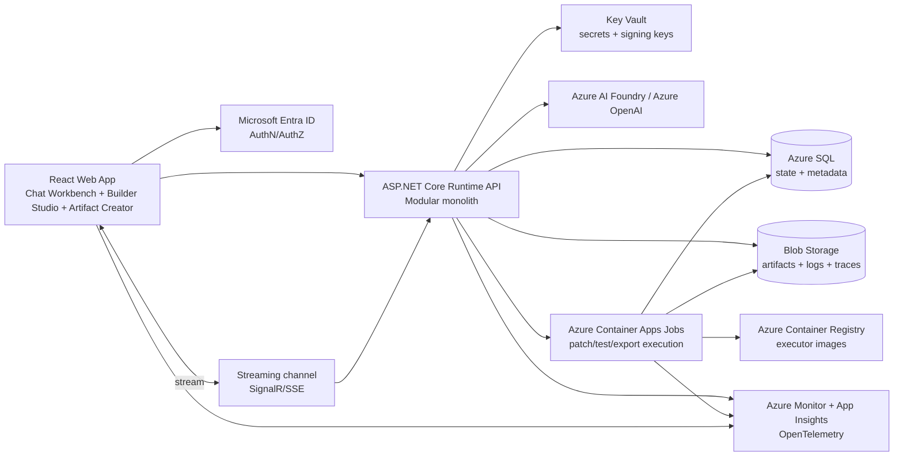

## 37.3 Runtime module architecture

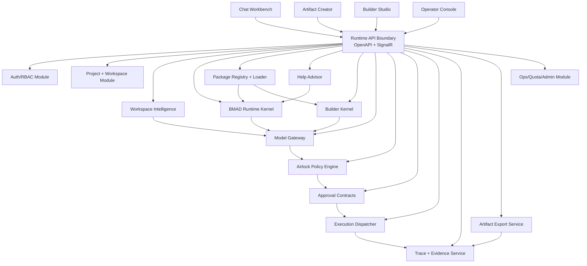

## 37.4 Canonical request flow for agentic coding

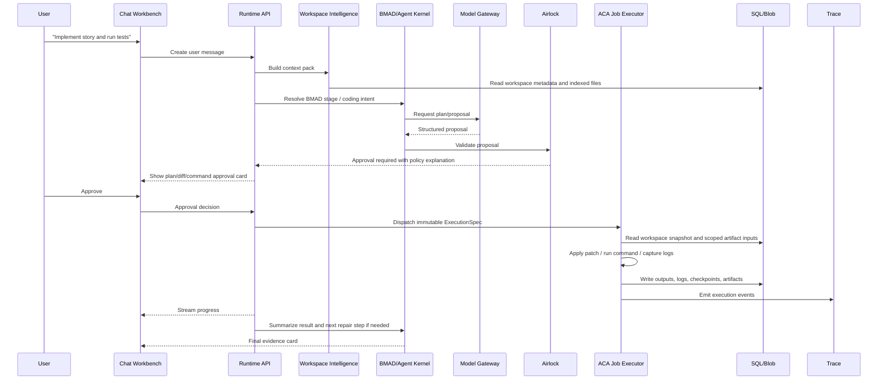

## 37.5 Canonical request flow for presentation workflow

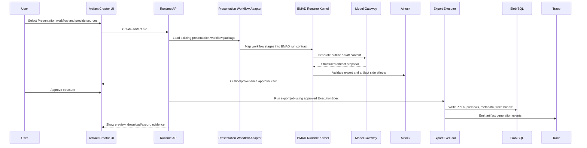

## 37.6 Trust boundaries

| Boundary | What crosses it | Required control |
|---|---|---|
| Browser → Runtime API | User messages, file selections, approval decisions, uploads | Auth, CSRF protection where relevant, request validation, project authorization |
| Runtime API → Model Gateway | Context packs, prompts, tool schemas, model call metadata | Redaction, token/cost budgets, model profile policy, tenant/project tags |
| Model Gateway → Airlock | Proposed actions from model | Strict JSON schema, policy validation, risk classification |
| Airlock → Executor | Approved immutable `ExecutionSpec` only | Signed/digested spec, approval ID, TTL, policy hash |
| Executor → Workspace/Blob | File changes, logs, artifacts, checkpoints | Scoped credentials, path allowlists, preimage hashes, output limits |
| Runtime → User | Plans, diffs, logs, evidence, exports | Sanitized rendering, provenance, clear risk labels |
| Runtime → Observability | Telemetry/events/traces | Raw content redaction by default, correlation IDs |

---


## 38.1 React Web App

### Responsibilities

- Provide the primary chat-first interface.
- Host project/workspace selection.
- Display role-shaped entry paths: Create, Build BMAD, Implement, Operate.
- Stream model and job progress.
- Render operational cards: plan, context, diff, command, validation, artifact, evidence, approval.
- Support Artifact Creator for the existing presentation workflow.
- Support Builder Studio for BMAD skill/package creation.
- Support accessibility and localization from the beginning.

### Required screens

| Screen | Purpose |
|---|---|
| Landing / Project switcher | Choose or create a project/workspace. |
| Chat Workbench | Main conversation, file/context panels, plan/diff/terminal/artifact/evidence cards. |
| Artifact Creator | Outcome-first PPT/doc/report creation. Presentation workflow is the first integrated package. |
| Builder Studio | Create/convert/analyze/validate BMAD skills, workflows, modules, and setup assets. |
| Run Detail | Inspect a historical run with trace, approvals, artifacts, logs, and replay status. |
| Operator Console | Project access, model profiles, quotas, packages, executor images, incidents, audit logs. |
| Package Detail | View BMAD package manifest, capabilities, versions, validation results, compatibility. |

### Required panels in Chat Workbench

| Panel | Required behavior |
|---|---|
| Conversation thread | Supports natural-language messages, assistant responses, streamed progress, and embedded cards. |
| Workspace explorer | Shows project tree, important files, BMAD package files, changed files, generated artifacts. |
| Context panel | Shows what files, traces, requirements, and BMAD stages were used as model context. |
| Diff panel | Shows proposed and applied changes, preimage/postimage status, risk flags, rollback points. |
| Terminal/log panel | Shows commands, job mode, image digest, logs, exit code, duration, resource usage. |
| Artifact preview | Shows generated docs/decks/reports/images/exports, with version/provenance. |
| Evidence panel | Shows acceptance tests, validation outputs, model/tool trace summary, approval trail. |

### UI rules

- Diffs and commands are first-class UI, not hidden logs.
- User should always understand whether the system is planning, proposing, waiting for approval, executing, validating, repairing, or done.
- Risk states should not rely on color only.
- Long jobs should show job cards with status, command, executor image, isolation mode, elapsed time, and stop/cancel affordances if supported.
- The app should not pretend a risky operation is “just chat.”
- The app should avoid BMAD jargon in Artifact Creator mode unless the user opens advanced details.
- Builder Studio can expose BMAD internals because its users are skill authors/power users.

## 38.2 Runtime API

### Responsibilities

- Own authenticated service boundary.
- Expose OpenAPI-first REST APIs and streaming endpoints.
- Persist lifecycle state to Azure SQL.
- Coordinate modules inside the modular monolith.
- Enforce project authorization.
- Call Model Gateway, Airlock, executor dispatcher, artifact service, trace service.
- Provide stable DTOs for clients and future SDKs.

### Internal modules

| Module | Purpose |
|---|---|
| Auth/RBAC | Map Entra users/groups to projects, roles, permissions. |
| Project | Project metadata, workspace sources, settings. |
| Conversation | Threads, messages, cards, streaming events. |
| Run Orchestrator | State machine for BMAD runs, coding runs, artifact runs, builder runs. |
| BMAD Kernel | Interprets BMAD package contracts and workflow state. |
| Package Registry | Imports, validates, versions, and serves packages. |
| Workspace Intelligence | Indexes workspace and builds context packs. |
| Builder Kernel | Converts authoring actions into package assets and validation runs. |
| Model Gateway | Centralized model calls, budgets, profiles, quotas. |
| Airlock | Proposal validation, policy, approvals. |
| Execution Dispatcher | Creates immutable ExecutionSpecs and starts ACA Jobs. |
| Artifact Service | Manages artifacts, exports, previews, storage metadata. |
| Trace Service | Writes trace events, bundles, replay manifests. |
| Operator/Admin | Quotas, package promotion, executor images, audit, incidents. |

### API style

- Use REST for stable resources.
- Use SignalR or Server-Sent Events for streaming run events.
- All endpoints require project-scoped authorization unless explicitly public/internal health.
- All write endpoints require idempotency keys for safe retries.
- Every API response includes a `correlationId`.
- Every mutation writes an audit/trace event.

## 38.3 BMAD Runtime Kernel

### Responsibilities

- Load and interpret BMAD package contracts.
- Resolve current workflow stage.
- Determine required/optional inputs.
- Produce next-step recommendations with Help Advisor.
- Normalize workflow actions into run steps.
- Bridge Builder outputs and package registry records.
- Route artifact/coding/planning tasks to appropriate orchestration paths.

### Inputs

- Package manifest
- `SKILL.md` frontmatter
- `module.yaml`
- `module-help.csv`
- `bmad-modules.yaml`
- `_bmad/config.toml`
- Workflow files
- Skill folders
- User/team overlays
- Workspace state
- Trace history
- User intent

### Outputs

- `RunPlan`
- `StepPlan`
- `ContextRequest`
- `ModelCallRequest`
- `ActionProposal`
- `ArtifactPlan`
- `ValidationReport`
- `NextStepRecommendation`

### Invariants

- BMAD package contract errors should be blocking and explicit.
- The kernel does not execute commands.
- The kernel does not write files directly.
- The kernel emits proposed state transitions; the orchestrator persists transitions.
- The kernel should be deterministic where possible; model calls are explicit boundaries.

## 38.4 Package Registry and Loader

### Responsibilities

- Import BMAD packages from workspaces or uploaded bundles.
- Validate manifests and required files.
- Assign package versions.
- Store package metadata and blob references.
- Expose capability catalog to UI and Help Advisor.
- Support package compatibility checks.
- Support the existing presentation workflow adapter package.

### Loader algorithm

1. Identify package root.
2. Detect package type:
   - BMAD Method package
   - BMAD Builder package
   - Converted/adapter package
   - Existing presentation workflow adapter
   - Legacy Cortex package if supported
3. Read manifest files.
4. Parse `SKILL.md` frontmatter.
5. Parse capability rows from `module-help.csv`.
6. Parse setup/module metadata.
7. Validate references:
   - missing files
   - orphan help rows
   - duplicate capability IDs/menu codes
   - invalid before/after refs
   - broken workflow stage refs
   - missing templates/scripts/assets
8. Resolve config layers.
9. Generate normalized package model.
10. Persist package metadata.
11. Write validation report.
12. Expose package to project if validation passes or as blocked if validation fails.

### Package compatibility result

```json
{
  "packageId": "pkg_presentation",
  "packageVersion": "1.0.0",
  "schemaVersion": "bmad.package.v1",
  "status": "compatible",
  "warnings": [],
  "blockingErrors": [],
  "migrationRequired": false,
  "migrationPlan": null
}
```

## 38.5 Help Advisor

### Responsibilities

- Explain what the user can do next.
- Recommend BMAD stages/actions based on package and workspace state.
- Explain missing prerequisites.
- Avoid hallucinating capabilities not present in package registry.
- Provide user-friendly descriptions for non-technical modes.

### Inputs

- Current package
- Current workflow stage
- Existing artifacts
- Required outputs
- Validation reports
- User role
- User intent
- Previous failures

### Output example

```json
{
  "recommendedAction": "run_implementation_readiness",
  "label": "Check if this story is ready to implement",
  "reason": "The project has a PRD and architecture document, but no validation report for the selected story.",
  "requiredInputs": ["story.md", "architecture.md"],
  "missingInputs": [],
  "risk": "low",
  "uiCardType": "next_step"
}
```

## 38.6 Builder Studio

### Responsibilities

- Build BMAD skills, workflows, agents, modules, setup bundles, evals, and validation reports.
- Convert existing skills/workflows into BMAD-compatible packages.
- Analyze package quality.
- Provide deterministic validation.
- Support Builder workflows without requiring external IDE agents.

### Required tools

| Tool | Purpose |
|---|---|
| Agent Builder | Create agent-like BMAD skills from a role, capabilities, prompts, and tool assumptions. |
| Workflow Builder | Create step-based BMAD workflows with inputs, outputs, and stage routing. |
| Module Builder | Create `module.yaml`, help catalog rows, package metadata, and install-ready structure. |
| Setup Builder | Create setup/install assets and target platform mappings. |
| Convert Skill | Wrap existing skill/workflow files into BMAD package conventions. |
| Analyze | Inspect package quality, missing contracts, orphan references, duplicate IDs. |
| Validate Module | Deterministic validation gate for package correctness. |
| Eval Runner | Run trigger, artifact, workflow, and policy evals. |

### Builder output rule

Builder Studio can generate package files, but they are not committed or published directly. Outputs are first shown as artifacts/diffs, then passed through Airlock for write/export/publish actions.

## 38.7 Workspace Intelligence

### Responsibilities

- Detect languages, frameworks, package managers, test commands, build commands, docs, specs, BMAD files, and project structure.
- Index files using safe, bounded strategies.
- Build context packs for model calls.
- Track file hashes.
- Track semantic summaries.
- Exclude secrets, generated noise, binaries, dependency folders, and large irrelevant files.
- Treat repository instructions and Start Here content as untrusted user content unless explicitly promoted by policy.

### Context selection priority

1. User-selected files and explicit current task.
2. Active BMAD stage and required artifacts.
3. Current diff/checkpoint state.
4. Source files related to the requested implementation.
5. Test files related to changed code.
6. Build/test config.
7. Recent failure logs.
8. Repository conventions and docs.
9. Prior trace summaries.
10. Low-confidence fallback search.

### Workspace scan output

```json
{
  "workspaceId": "ws_123",
  "languages": ["TypeScript", "C#"],
  "frameworks": ["React", "ASP.NET Core"],
  "packageManagers": ["pnpm", "dotnet"],
  "testCommands": ["pnpm test", "dotnet test"],
  "buildCommands": ["pnpm build", "dotnet build"],
  "bmadRoots": ["_bmad"],
  "cortexRoots": ["_cortex"],
  "riskFindings": [
    {"type": "secret_like_file", "path": ".env", "action": "excluded_from_context"}
  ]
}
```

## 38.8 Model Gateway

### Responsibilities

- Centralize Azure AI Foundry / Azure OpenAI calls.
- Manage model profiles.
- Enforce budgets and quotas.
- Provide queue classes and fallback routing.
- Log cost, latency, token usage, model version, and policy metadata.
- Separate model call types: chat, planning, context summarization, code proposal, artifact generation, validation explanation, repair.
- Support deterministic fake provider for tests.

### Queue classes

| Queue | Use case | Priority |
|---|---|---|
| `interactive_chat` | User-facing chat and quick planning. | High |
| `implementation_planning` | Agentic coding plans and diff proposals. | High |
| `artifact_generation` | PPT/doc/report generation. | Medium |
| `code_repair` | Failure analysis and repair loops. | Medium |
| `builder_generation` | Skill/workflow/module creation. | Medium |
| `batch_eval` | Eval/replay/background validation. | Low |
| `operator_review` | Admin diagnostics and audit summaries. | Medium/High depending incident |

### Model profile example

```json
{
  "modelProfileId": "profile_coding_default",
  "purpose": "code_proposal",
  "provider": "azure_openai",
  "deployment": "gpt-4.1",
  "region": "westeurope",
  "maxInputTokens": 120000,
  "maxOutputTokens": 8000,
  "temperature": 0.1,
  "budgetPool": "coding",
  "fallbackProfiles": ["profile_coding_economy"],
  "redactionProfile": "code_context_default"
}
```

## 38.9 Airlock

### Responsibilities

- Validate structured proposals.
- Classify risk.
- Require approval where needed.
- Block disallowed actions.
- Create immutable approval contracts.
- Produce user-visible rationale.
- Emit trace/audit events.
- Prevent model-direct side effects.

### Proposal types

| Proposal type | Example | Policy posture |
|---|---|---|
| `file_patch` | Modify `src/auth/login.ts` | Approval required unless low-risk auto-apply is explicitly configured later. |
| `command_run` | `pnpm test` | Approval required at least first time per project and mode. |
| `artifact_export` | Generate PPTX | Approval may be required depending source sensitivity and destination. |
| `package_import` | Import presentation workflow package | Approval or operator role required. |
| `dependency_install` | `pnpm install zod` | Approval every time; network allowlist required. |
| `git_commit` | Commit local changes | Later explicit approval only. |
| `git_push` | Push to remote | Blocked in v1. |
| `external_network` | Fetch URL or call API | Block unless allowlisted and justified. |
| `delete_large` | Remove many files | Block or high-risk approval depending policy. |
| `credential_access` | Read secret/env | Block except runtime-managed secret injection to job. |

### Airlock decision object

```json
{
  "proposalId": "prop_123",
  "decision": "approval_required",
  "risk": "medium",
  "policyVersion": "airlock.policy.v1",
  "reasons": [
    "Proposal writes 3 files.",
    "Command uses workspace-write mode.",
    "No previous project approval for this command class."
  ],
  "requiredApproval": {
    "approverRole": "project_member",
    "expiresInSeconds": 900
  },
  "blockedReasons": []
}
```

## 38.10 Executor

### Responsibilities

- Receive approved `ExecutionSpec` only.
- Run in isolated ACA Jobs.
- Apply patches.
- Run commands.
- Generate exports.
- Capture stdout/stderr, exit code, duration, resource usage.
- Write logs/artifacts/checkpoints.
- Enforce timeouts, network modes, output limits, file path allowlists.
- Report status back to Runtime API.

### Executor isolation modes

| Mode | Permissions | Use |
|---|---|---|
| `read_only` | Read workspace snapshot, no writes, no network. | Inspection commands, `git diff`, dependency listing. |
| `workspace_write_network_off` | Write workspace paths, no external network. | Tests, local builds, patch application. |
| `workspace_write_network_allowlisted` | Write workspace paths, network only to allowlisted package registries or internal endpoints. | Dependency restore/install. |
| `artifact_export` | Write only export/output paths. | PPTX/doc/report/image generation. |
| `package_validation` | Read package and write validation artifacts. | Builder/SkillOps validation. |

### ExecutionSpec example

```json
{
  "executionSpecId": "exec_123",
  "schemaVersion": "execution.spec.v1",
  "projectId": "proj_123",
  "workspaceId": "ws_123",
  "runId": "run_123",
  "approvalId": "appr_123",
  "executorImage": "sapphirus-executor-dotnet:1.0.0@sha256:...",
  "mode": "workspace_write_network_off",
  "timeoutSeconds": 900,
  "filePatches": [
    {
      "path": "src/auth/login.ts",
      "preimageSha256": "abc",
      "patchBlobRef": "runs/run_123/patches/login.patch"
    }
  ],
  "commands": [
    {
      "command": "pnpm test",
      "workingDirectory": ".",
      "envPolicy": "minimal"
    }
  ],
  "allowedPaths": ["src/**", "tests/**", "package.json", "pnpm-lock.yaml"],
  "blockedPaths": [".env", ".git/**", "node_modules/**"],
  "networkPolicy": "off",
  "outputLimits": {
    "stdoutBytes": 2000000,
    "artifactBytes": 100000000
  }
}
```

---


## 39.1 Aggregate roots

| Aggregate | Purpose |
|---|---|
| Tenant | Enterprise boundary. v1 may be single-tenant but still design as tenant-aware. |
| User | Entra-backed authenticated actor. |
| Project | Authorization and collaboration boundary. |
| Workspace | Source repository/filesystem/package context. |
| Package | BMAD package or adapter package. |
| Conversation | Chat thread over a project/workspace/run. |
| Run | Execution lifecycle for BMAD workflow, coding task, artifact generation, builder task, eval, or replay. |
| Proposal | Model/system-generated side-effect request. |
| Approval | Human or policy approval decision. |
| Execution | Concrete executor job launched from approved spec. |
| Artifact | Durable output, patch, log, generated file, checkpoint, export, validation report. |
| TraceBundle | Versioned evidence package. |
| ModelCall | Auditable model call metadata with redacted input/output pointers. |
| PolicyDecision | Airlock decision and rationale. |

## 39.2 Suggested SQL tables

### `projects`

| Column | Type | Notes |
|---|---|---|
| `id` | uniqueidentifier | Primary key |
| `tenant_id` | uniqueidentifier | Tenant boundary |
| `name` | nvarchar(200) | Display name |
| `slug` | nvarchar(160) | Unique per tenant |
| `description` | nvarchar(max) | Optional |
| `created_by_user_id` | uniqueidentifier | Actor |
| `created_at` | datetimeoffset | UTC |
| `updated_at` | datetimeoffset | UTC |
| `status` | nvarchar(32) | active, archived, blocked |

### `workspaces`

| Column | Type | Notes |
|---|---|---|
| `id` | uniqueidentifier | Primary key |
| `project_id` | uniqueidentifier | FK |
| `source_type` | nvarchar(32) | upload, git_snapshot, blob_package, local_sync_future |
| `source_ref` | nvarchar(max) | Blob path or repo ref |
| `root_blob_prefix` | nvarchar(max) | Workspace snapshot root |
| `current_snapshot_id` | uniqueidentifier | FK to snapshots |
| `detected_stack_json` | nvarchar(max) | Languages/frameworks/tools |
| `bmad_root_path` | nvarchar(512) | Optional |
| `cortex_root_path` | nvarchar(512) | Optional compatibility |
| `created_at` | datetimeoffset | UTC |
| `updated_at` | datetimeoffset | UTC |

### `workspace_files`

| Column | Type | Notes |
|---|---|---|
| `id` | uniqueidentifier | Primary key |
| `workspace_id` | uniqueidentifier | FK |
| `snapshot_id` | uniqueidentifier | FK |
| `path` | nvarchar(1024) | Normalized path |
| `sha256` | char(64) | Content hash |
| `size_bytes` | bigint | Size |
| `mime_type` | nvarchar(128) | Detection |
| `language` | nvarchar(64) | Optional |
| `is_generated` | bit | Excluded by default |
| `is_secret_like` | bit | Excluded |
| `summary_blob_ref` | nvarchar(max) | Optional summary |

### `packages`

| Column | Type | Notes |
|---|---|---|
| `id` | uniqueidentifier | Primary key |
| `project_id` | uniqueidentifier | FK |
| `package_key` | nvarchar(200) | Stable package key |
| `display_name` | nvarchar(300) | Name |
| `package_type` | nvarchar(64) | bmad_method, bmad_builder, adapter, presentation_workflow |
| `schema_version` | nvarchar(64) | e.g. bmad.package.v1 |
| `version` | nvarchar(64) | Semantic version |
| `source_blob_ref` | nvarchar(max) | Package source |
| `validation_status` | nvarchar(64) | valid, warning, blocked |
| `validation_report_blob_ref` | nvarchar(max) | Report |
| `created_at` | datetimeoffset | UTC |

### `capabilities`

| Column | Type | Notes |
|---|---|---|
| `id` | uniqueidentifier | Primary key |
| `package_id` | uniqueidentifier | FK |
| `capability_key` | nvarchar(200) | Stable ID |
| `menu_code` | nvarchar(64) | Optional BMAD command/menu |
| `title` | nvarchar(300) | Display |
| `description` | nvarchar(max) | User-facing |
| `phase` | nvarchar(128) | Planning/building/validation/etc. |
| `input_schema_json` | nvarchar(max) | Versioned |
| `output_schema_json` | nvarchar(max) | Versioned |
| `risk_class` | nvarchar(32) | low/medium/high |

### `conversations`

| Column | Type | Notes |
|---|---|---|
| `id` | uniqueidentifier | Primary key |
| `project_id` | uniqueidentifier | FK |
| `workspace_id` | uniqueidentifier | Optional |
| `title` | nvarchar(300) | Generated/user |
| `mode` | nvarchar(64) | ask, plan, build, review, validate, create, operate |
| `created_by_user_id` | uniqueidentifier | Actor |
| `created_at` | datetimeoffset | UTC |
| `updated_at` | datetimeoffset | UTC |

### `messages`

| Column | Type | Notes |
|---|---|---|
| `id` | uniqueidentifier | Primary key |
| `conversation_id` | uniqueidentifier | FK |
| `run_id` | uniqueidentifier | Optional |
| `role` | nvarchar(32) | user, assistant, system, tool |
| `content_redacted` | nvarchar(max) | Sanitized content |
| `content_blob_ref` | nvarchar(max) | Raw content if retained by policy |
| `cards_json` | nvarchar(max) | Embedded cards |
| `created_at` | datetimeoffset | UTC |
| `correlation_id` | nvarchar(128) | Trace correlation |

### `runs`

| Column | Type | Notes |
|---|---|---|
| `id` | uniqueidentifier | Primary key |
| `project_id` | uniqueidentifier | FK |
| `workspace_id` | uniqueidentifier | Optional |
| `conversation_id` | uniqueidentifier | Optional |
| `package_id` | uniqueidentifier | Optional |
| `run_type` | nvarchar(64) | chat, bmad_workflow, coding, artifact, builder, eval, replay |
| `state` | nvarchar(64) | canonical state |
| `intent` | nvarchar(max) | User task summary |
| `current_step` | nvarchar(200) | Optional |
| `trace_bundle_id` | uniqueidentifier | Optional |
| `created_by_user_id` | uniqueidentifier | Actor |
| `created_at` | datetimeoffset | UTC |
| `updated_at` | datetimeoffset | UTC |
| `completed_at` | datetimeoffset | Optional |

### `proposals`

| Column | Type | Notes |
|---|---|---|
| `id` | uniqueidentifier | Primary key |
| `run_id` | uniqueidentifier | FK |
| `proposal_type` | nvarchar(64) | file_patch, command_run, artifact_export |
| `schema_version` | nvarchar(64) | proposal schema |
| `risk` | nvarchar(32) | low/medium/high/critical |
| `summary` | nvarchar(max) | User-facing summary |
| `proposal_json_blob_ref` | nvarchar(max) | Full proposal |
| `airlock_decision_id` | uniqueidentifier | FK |
| `state` | nvarchar(64) | proposed, approved, rejected, expired, executed |
| `created_at` | datetimeoffset | UTC |

### `approvals`

| Column | Type | Notes |
|---|---|---|
| `id` | uniqueidentifier | Primary key |
| `proposal_id` | uniqueidentifier | FK |
| `approver_user_id` | uniqueidentifier | Actor |
| `decision` | nvarchar(32) | approved, rejected |
| `reason` | nvarchar(max) | Optional |
| `approved_spec_hash` | char(64) | Integrity |
| `expires_at` | datetimeoffset | TTL |
| `created_at` | datetimeoffset | UTC |

### `executions`

| Column | Type | Notes |
|---|---|---|
| `id` | uniqueidentifier | Primary key |
| `run_id` | uniqueidentifier | FK |
| `approval_id` | uniqueidentifier | FK |
| `execution_spec_blob_ref` | nvarchar(max) | Immutable spec |
| `execution_spec_hash` | char(64) | Integrity |
| `executor_image_digest` | nvarchar(200) | Pinned |
| `aca_job_name` | nvarchar(200) | Azure ref |
| `state` | nvarchar(64) | queued, running, succeeded, failed, cancelled, timed_out |
| `exit_code` | int | Optional |
| `started_at` | datetimeoffset | Optional |
| `completed_at` | datetimeoffset | Optional |
| `log_blob_ref` | nvarchar(max) | stdout/stderr |
| `result_blob_ref` | nvarchar(max) | Result manifest |

### `artifacts`

| Column | Type | Notes |
|---|---|---|
| `id` | uniqueidentifier | Primary key |
| `project_id` | uniqueidentifier | FK |
| `run_id` | uniqueidentifier | Optional |
| `artifact_type` | nvarchar(64) | patch, log, pptx, docx, report, trace, checkpoint |
| `display_name` | nvarchar(300) | Name |
| `blob_ref` | nvarchar(max) | Storage path |
| `sha256` | char(64) | Integrity |
| `size_bytes` | bigint | Size |
| `mime_type` | nvarchar(128) | Type |
| `provenance_json` | nvarchar(max) | Source/provenance |
| `created_at` | datetimeoffset | UTC |

### `trace_events`

| Column | Type | Notes |
|---|---|---|
| `id` | uniqueidentifier | Primary key |
| `trace_bundle_id` | uniqueidentifier | FK |
| `run_id` | uniqueidentifier | FK |
| `event_type` | nvarchar(100) | Event key |
| `sequence` | bigint | Monotonic |
| `timestamp` | datetimeoffset | UTC |
| `correlation_id` | nvarchar(128) | OTel correlation |
| `payload_redacted_json` | nvarchar(max) | Redacted event |
| `payload_blob_ref` | nvarchar(max) | Optional raw/large payload |

## 39.3 Blob layout

```text
/tenants/{tenantId}/projects/{projectId}/
  packages/
    {packageId}/{version}/source.zip
    {packageId}/{version}/validation-report.json
  workspaces/
    {workspaceId}/snapshots/{snapshotId}/files/...
    {workspaceId}/indexes/{indexVersion}/...
  runs/
    {runId}/
      input/
      context/context-pack.json
      model-calls/{modelCallId}.json
      proposals/{proposalId}.json
      approvals/{approvalId}.json
      patches/{proposalId}.patch
      execution/{executionId}/execution-spec.json
      execution/{executionId}/stdout.log
      execution/{executionId}/stderr.log
      execution/{executionId}/result-manifest.json
      artifacts/
      checkpoints/
      trace/trace-bundle.json
      evidence/evidence-report.md
  exports/
    {artifactId}/output.pptx
    {artifactId}/preview/
```

## 39.4 Trace bundle schema

```json
{
  "schemaVersion": "trace.bundle.v1",
  "traceBundleId": "trace_123",
  "runId": "run_123",
  "projectId": "proj_123",
  "createdAt": "2026-07-08T00:00:00Z",
  "package": {
    "packageId": "pkg_123",
    "version": "1.0.0",
    "schemaVersion": "bmad.package.v1"
  },
  "workspace": {
    "workspaceId": "ws_123",
    "snapshotId": "snap_123"
  },
  "events": [
    {
      "sequence": 1,
      "type": "run.created",
      "timestamp": "2026-07-08T00:00:00Z",
      "correlationId": "corr_123",
      "payloadRef": "trace/events/000001.json"
    }
  ],
  "artifacts": [
    {
      "artifactId": "art_123",
      "type": "patch",
      "sha256": "..."
    }
  ],
  "privacy": {
    "rawPromptsRetained": false,
    "contentRedactionProfile": "default"
  },
  "compatibility": {
    "minimumReaderVersion": "1.0.0"
  }
}
```

---


All API contracts should be OpenAPI-first. The frontend should use generated TypeScript clients or a thin typed wrapper generated from OpenAPI. The backend should treat DTO changes as versioned contract changes.

## 40.1 Projects

| Endpoint | Method | Purpose |
|---|---:|---|
| `/api/v1/projects` | GET | List projects visible to current user. |
| `/api/v1/projects` | POST | Create project. |
| `/api/v1/projects/{projectId}` | GET | Get project detail. |
| `/api/v1/projects/{projectId}` | PATCH | Update project settings. |
| `/api/v1/projects/{projectId}/members` | GET | List project access. |
| `/api/v1/projects/{projectId}/members` | POST | Add user/group access. |

## 40.2 Workspaces

| Endpoint | Method | Purpose |
|---|---:|---|
| `/api/v1/projects/{projectId}/workspaces` | GET | List workspaces. |
| `/api/v1/projects/{projectId}/workspaces` | POST | Create/import workspace. |
| `/api/v1/workspaces/{workspaceId}` | GET | Workspace detail. |
| `/api/v1/workspaces/{workspaceId}/scan` | POST | Start workspace scan. |
| `/api/v1/workspaces/{workspaceId}/files` | GET | List/query files. |
| `/api/v1/workspaces/{workspaceId}/files/{path}` | GET | Read file preview subject to policy. |
| `/api/v1/workspaces/{workspaceId}/context-pack` | POST | Build context pack for run/model call. |

## 40.3 Conversations

| Endpoint | Method | Purpose |
|---|---:|---|
| `/api/v1/projects/{projectId}/conversations` | GET | List conversations. |
| `/api/v1/projects/{projectId}/conversations` | POST | Create conversation. |
| `/api/v1/conversations/{conversationId}` | GET | Get conversation with messages/cards. |
| `/api/v1/conversations/{conversationId}/messages` | POST | Add user message and optionally start run. |
| `/api/v1/conversations/{conversationId}/stream` | GET | Stream conversation/run events. |

## 40.4 Runs

| Endpoint | Method | Purpose |
|---|---:|---|
| `/api/v1/runs` | POST | Start BMAD/coding/artifact/builder run. |
| `/api/v1/runs/{runId}` | GET | Get run status/detail. |
| `/api/v1/runs/{runId}/events` | GET | Get run event history. |
| `/api/v1/runs/{runId}/cancel` | POST | Request cancellation. |
| `/api/v1/runs/{runId}/replay` | POST | Start replay from trace/context if allowed. |
| `/api/v1/runs/{runId}/evidence` | GET | Get evidence report. |

## 40.5 Packages

| Endpoint | Method | Purpose |
|---|---:|---|
| `/api/v1/projects/{projectId}/packages` | GET | List packages. |
| `/api/v1/projects/{projectId}/packages/import` | POST | Import BMAD package or workflow adapter. |
| `/api/v1/packages/{packageId}` | GET | Get package detail. |
| `/api/v1/packages/{packageId}/capabilities` | GET | List capabilities. |
| `/api/v1/packages/{packageId}/validate` | POST | Run validation. |
| `/api/v1/packages/{packageId}/compatibility` | GET | Check compatibility. |

## 40.6 Artifact Creator

| Endpoint | Method | Purpose |
|---|---:|---|
| `/api/v1/artifact-workflows` | GET | List creator workflows, including presentation workflow. |
| `/api/v1/artifact-runs` | POST | Start artifact workflow. |
| `/api/v1/artifact-runs/{runId}/outline` | GET | Get generated/proposed outline. |
| `/api/v1/artifact-runs/{runId}/approve-outline` | POST | Approve outline/structure. |
| `/api/v1/artifact-runs/{runId}/exports` | GET | List generated exports. |

## 40.7 Builder Studio

| Endpoint | Method | Purpose |
|---|---:|---|
| `/api/v1/builder/skills` | POST | Create skill draft. |
| `/api/v1/builder/workflows` | POST | Create workflow draft. |
| `/api/v1/builder/modules` | POST | Create module draft. |
| `/api/v1/builder/convert` | POST | Convert existing workflow/skill into BMAD package. |
| `/api/v1/builder/analyze` | POST | Analyze package/draft. |
| `/api/v1/builder/evals` | POST | Run eval suite. |

## 40.8 Airlock and approvals

| Endpoint | Method | Purpose |
|---|---:|---|
| `/api/v1/proposals/{proposalId}` | GET | Proposal detail. |
| `/api/v1/proposals/{proposalId}/approve` | POST | Approve proposal. |
| `/api/v1/proposals/{proposalId}/reject` | POST | Reject proposal. |
| `/api/v1/proposals/{proposalId}/policy` | GET | Policy decision/rationale. |
| `/api/v1/approvals/{approvalId}` | GET | Approval contract detail. |

## 40.9 Executions

| Endpoint | Method | Purpose |
|---|---:|---|
| `/api/v1/executions/{executionId}` | GET | Execution status/detail. |
| `/api/v1/executions/{executionId}/logs` | GET | Logs. |
| `/api/v1/executions/{executionId}/artifacts` | GET | Generated artifacts. |
| `/api/v1/executions/{executionId}/cancel` | POST | Cancel if possible. |

## 40.10 Operator/Admin

| Endpoint | Method | Purpose |
|---|---:|---|
| `/api/v1/admin/model-profiles` | CRUD | Manage model profiles. |
| `/api/v1/admin/quotas` | CRUD | Manage budgets/queue classes. |
| `/api/v1/admin/executor-images` | CRUD | Manage allowed executor images. |
| `/api/v1/admin/policies` | CRUD | Manage policy versions. |
| `/api/v1/admin/audit` | GET | Search audit trail. |
| `/api/v1/admin/incidents` | CRUD | Track incidents and blocked policy events. |

---


## 41.1 Conversation message lifecycle

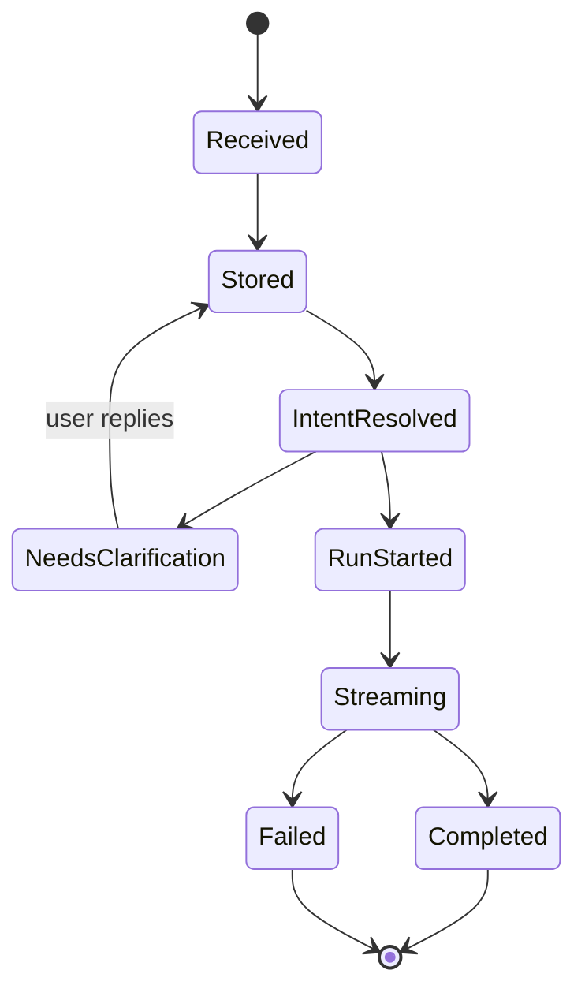

## 41.2 Coding run lifecycle

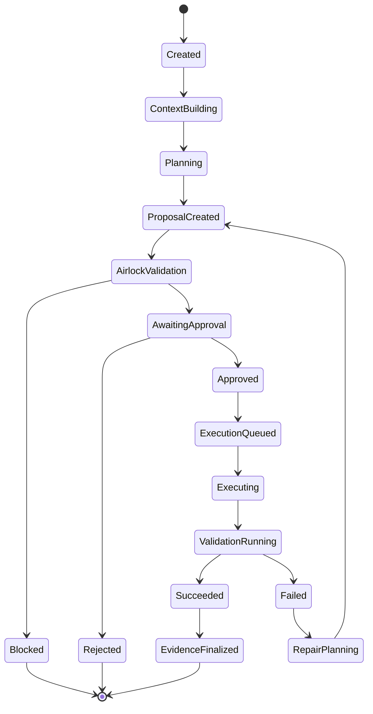

## 41.3 Artifact workflow lifecycle

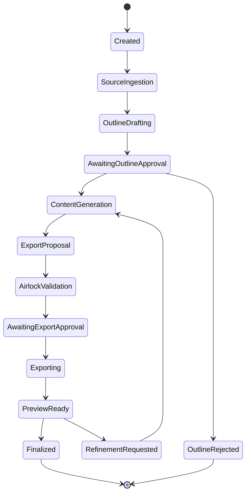

## 41.4 Package import lifecycle

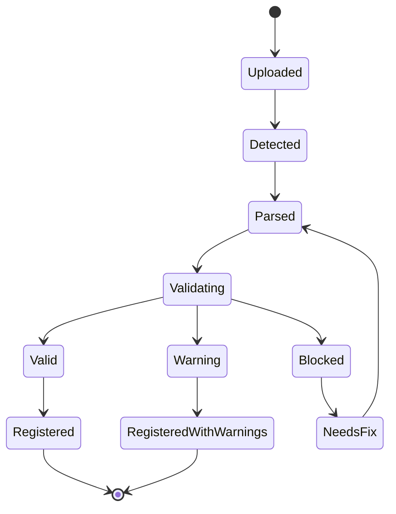

## 41.5 Executor lifecycle

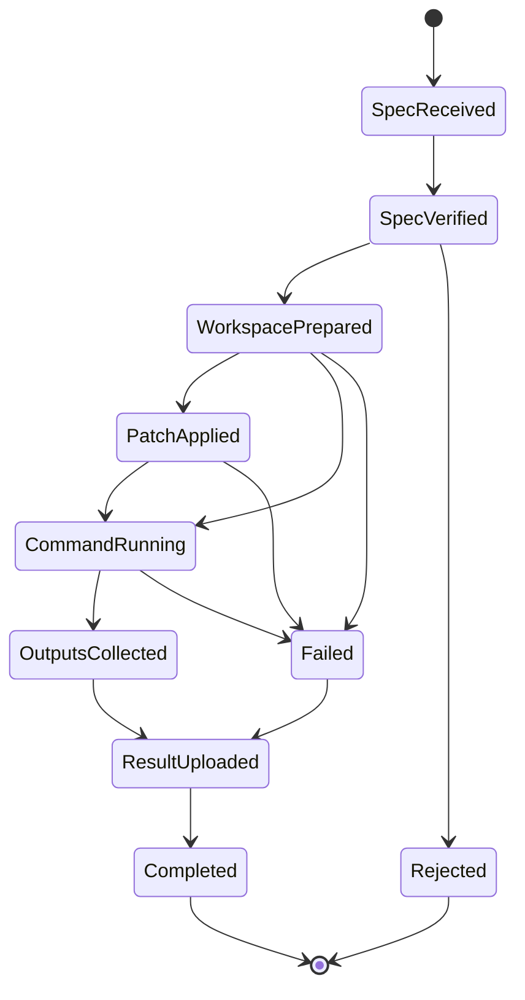

---


## 42.1 Default command matrix

| Command/action | Default mode | v1 policy |
|---|---|---|
| `ls`, `cat`, `find`, `tree`, `git status`, `git diff`, `git log` | `read_only` | Allowed after lightweight confirmation or pre-approved project policy. |
| `npm test`, `pnpm test`, `pytest`, `dotnet test` | `workspace_write_network_off` | Approval required first time per project; then policy may allow same command class. |
| `npm run build`, `pnpm build`, `dotnet build` | `workspace_write_network_off` | Approval required first time per project. |
| `npm install`, `pnpm install`, `pip install`, `dotnet restore` | `workspace_write_network_allowlisted` | Approval every time; network allowlist required. |
| File patch under allowed source/test paths | `workspace_write_network_off` | Approval required. |
| Generated artifact export to Blob | `artifact_export` | Approval may be required depending artifact sensitivity. |
| `git commit` | `workspace_write_network_off` | Later explicit approval only; not MVP unless needed. |
| `git push` | none | Blocked in v1. |
| `sudo`, system package install, Docker socket, host mounts | none | Blocked. |
| Reading `.env`, private keys, credential stores | none | Blocked unless runtime-managed secret injection in executor. |
| `rm -rf`, broad deletion, destructive migrations | none/high-risk | Block or critical approval with operator role. |
| Untrusted network fetch | none | Block unless allowlisted. |

## 42.2 Risk scoring factors

| Factor | Risk impact |
|---|---|
| Number of files changed | More files increases risk. |
| Sensitive path touched | Auth, payments, config, CI, infra, secrets, database migrations increase risk. |
| Command has network access | Increases risk. |
| Dependency lockfile changed | Increases risk. |
| Binary output generated | Needs artifact validation. |
| Source instruction asks to ignore policy | Critical prompt-injection risk. |
| Large deletion | Critical or blocked. |
| CI workflow changed | High risk; CODEOWNERS/policy required. |
| Executor image not pinned | Block. |
| Approval expired | Block. |
| Preimage hash mismatch | Block. |

## 42.3 Approval card contents

Every approval card should show:

- proposal summary
- exact files touched
- exact command(s) to run
- execution mode
- network policy
- executor image digest
- expected outputs
- risk level and reasons
- rollback/checkpoint behavior
- approval expiry
- link to full proposal JSON
- reject/approve controls

---


## 43.1 Final decision

The presentation creation workflow already exists. The BMAD Runtime should not rebuild it from scratch. The correct implementation is an adapter/import path that wraps the existing workflow into the runtime’s package, trace, approval, and artifact conventions.

## 43.2 Integration objectives

- Preserve existing prompts, templates, logic, assets, and handoff behavior unless a compatibility adapter is necessary.
- Represent the workflow as a BMAD-compatible package.
- Expose it through Artifact Creator mode using non-technical language.
- Run it through the same governance, artifact, and trace infrastructure as other workflows.
- Use it as the first real proof that BMAD Runtime can host artifact workflows, not only coding/planning workflows.

## 43.3 Inventory checklist

Before implementation, inventory the existing presentation workflow:

| Asset type | Questions |
|---|---|
| Entry point | How is presentation generation triggered today? |
| Prompt files | Which prompts/instructions exist? What variables do they expect? |
| Templates | Are there PowerPoint templates, slide layouts, themes, images, fonts, placeholders? |
| Scripts | Are there Python/Node/.NET scripts that generate or modify PPTX? |
| Source ingestion | Does it accept text, uploaded docs, PDFs, URLs, Markdown, notes? |
| Intermediate outputs | Outline, slide plan, speaker notes, image prompts, citations, style guide? |
| Export outputs | PPTX only, PDF, images, HTML preview, notes document? |
| Validation | What checks ensure slide count, formatting, missing assets, broken placeholders? |
| Handoffs | Does it use artifact handoff or external generation tools? |
| Dependencies | python-pptx, officegen, pptxgenjs, LibreOffice, headless browser, custom scripts? |
| Limitations | File size, unsupported templates, image handling, charts/tables, citations? |

## 43.4 Adapter package shape

```text
/packages/presentation-workflow/
  SKILL.md
  module.yaml
  module-help.csv
  workflow.yaml
  Start Here.md
  templates/
    default-template.pptx
    layouts/
  prompts/
    outline.md
    slide-plan.md
    speaker-notes.md
    refinement.md
  scripts/
    export-pptx.py
    validate-pptx.py
  fixtures/
    simple-brief/
      input.md
      expected-outline.json
      expected-manifest.json
  evals/
    presentation-basic.eval.yaml
  schemas/
    presentation-input.schema.json
    presentation-outline.schema.json
    presentation-export-manifest.schema.json
```

## 43.5 Artifact Creator UX for presentation workflow

Step-by-step:

1. User chooses **Create → Presentation**.
2. UI asks for:
   - objective
   - audience
   - source material
   - desired length
   - tone/style
   - template/theme if available
   - language
   - output format
3. Runtime creates an artifact run.
4. Presentation adapter loads workflow package.
5. Model generates outline/slide structure.
6. User reviews outline card.
7. User approves or requests changes.
8. Runtime generates slide content and export proposal.
9. Airlock validates export.
10. Executor generates PPTX and preview.
11. UI shows preview/artifact card.
12. User refines, downloads, or exports.
13. Trace/evidence report is created.

## 43.6 Presentation artifact trace requirements

Each presentation run must capture:

- source files and hashes
- selected template and hash
- package version
- prompt versions
- model profiles
- outline approval
- generation steps
- export command/spec
- generated PPTX hash
- validation report
- preview artifacts
- final evidence report

## 43.7 Validation checks for PPTX

Minimum validation:

- output file exists and is non-empty
- file opens or passes PPTX structure validation
- slide count matches approved outline or has documented deviation
- no unresolved placeholders remain
- required title slide exists
- all referenced images/assets exist
- no missing template relationships
- exported preview images generated if preview is supported
- provenance manifest exists
- trace links output to inputs

---


## 44.1 Core interaction pattern

The product should behave like a governed coding coworker:

1. User asks for a change.
2. System inspects relevant files.
3. System explains what it found.
4. System proposes a plan.
5. System proposes a diff or command.
6. Airlock validates.
7. User approves.
8. Executor applies patch/runs command.
9. System streams results.
10. If tests fail, system diagnoses.
11. System proposes repair.
12. User approves repair.
13. System reruns tests.
14. System produces final evidence.

## 44.2 Minimum viable coding task

MVP coding task should support:

- workspace scan
- file search
- file preview
- context pack creation
- model-generated implementation plan
- patch proposal
- diff preview
- Airlock approval
- patch application in executor
- test command execution
- log capture
- failed test summarization
- one repair loop
- final evidence card
- rollback checkpoint

## 44.3 File modification rules

- All patches are unified diffs or structured file operations.
- Patches include preimage hash.
- Executor verifies preimage before applying.
- Patches cannot touch blocked paths.
- Large changes require elevated approval.
- Binary changes are blocked unless supported artifact workflow.
- Generated files are clearly marked.
- The user can inspect full diff before approval.
- Applied patches create checkpoint artifacts.

## 44.4 Command execution rules

- Commands run only from approved allowlisted classes.
- Commands run inside executor containers, not on the Runtime API host.
- Commands have timeout, output limits, environment limits, working directory, network policy, resource class.
- Commands never receive raw broad credentials.
- Package installs require network allowlist and approval.
- Test/build/lint commands should run network-off by default.
- Command output is streamed/summarized to UI but full logs are stored in Blob subject to retention policy.

## 44.5 Repair loop rules

- Repair loops are capped.
- Each repair proposal shows what failed and why.
- Repair patches go through Airlock.
- Repair commands go through Airlock.
- If the same failure repeats, escalate to user with clear options.
- Never silently broaden scope or touch unrelated files to make tests pass.
- Never remove failing tests without explicit high-risk approval.

## 44.6 Done criteria for coding runs

A coding run is done only when:

- requested change was applied or explicitly not applied
- changed files are listed
- commands/tests run are listed
- failures are disclosed
- artifacts/logs are linked
- rollback point exists where possible
- evidence card summarizes result
- next recommended step is clear

---


## 45.1 Required contract types

| Contract | Purpose |
|---|---|
| `SKILL.md` | Human-readable skill entry point and metadata. |
| `module.yaml` | Package/module manifest. |
| `module-help.csv` | Capability/help catalog rows. |
| `bmad-modules.yaml` | Module registry/installer metadata where applicable. |
| `_bmad/config.toml` | Project/team/runtime configuration. |
| workflow files | Stage definitions, inputs, outputs, routing. |
| templates | Generated artifact structures. |
| scripts | Deterministic support logic. |
| evals | Validation and regression cases. |
| fixtures | Test inputs/expected outputs. |
| schemas | Versioned input/output/action schemas. |

## 45.2 `SKILL.md` frontmatter expectations

Example:

```yaml
---
id: presentation-creator
name: Presentation Creator
version: 1.0.0
kind: artifact-workflow
entrypoint: workflow.yaml
capabilities:
  - create-presentation
inputs:
  - source_material
  - audience
  - objective
outputs:
  - pptx
  - preview
  - evidence_report
risk: medium
---
```

## 45.3 `module.yaml` expectations

Example:

```yaml
id: sapphirus.presentation
name: Existing Presentation Workflow Adapter
version: 1.0.0
schemaVersion: bmad.module.v1
description: Wraps the existing presentation creation workflow as a BMAD artifact workflow.
capabilities:
  - id: create-presentation
    title: Create presentation
    entrypoint: workflow.yaml
    inputSchema: schemas/presentation-input.schema.json
    outputSchema: schemas/presentation-export-manifest.schema.json
requires:
  runtime: ">=1.0.0"
assets:
  templates:
    - templates/default-template.pptx
  scripts:
    - scripts/export-pptx.py
validation:
  fixtures:
    - fixtures/simple-brief
```

## 45.4 `module-help.csv` expectations

Minimum columns:

```csv
module_id,capability_id,menu_code,title,description,phase,inputs,outputs,risk
sapphirus.presentation,create-presentation,CREATE-PPT,Create presentation,Generate a deck from approved sources,artifact,source_material|objective,pptx|preview,medium
```

## 45.5 Config merge semantics

The runtime must preserve BMAD-style layered config semantics. Suggested resolution order:

1. runtime defaults
2. package defaults
3. project/team config
4. environment/operator policy
5. user/session overrides where allowed

Conflict handling:

- security policy overrides cannot be loosened by package/user config
- model defaults can be narrowed by project policy
- package config can define defaults but not bypass Airlock
- user config can influence tone, output style, language, and non-sensitive preferences

---


## 46.1 Contract-first implementation

Before building large features, define and version:

- REST OpenAPI spec
- streaming event schema
- package schema
- run schema
- proposal schema
- approval schema
- execution spec schema
- trace bundle schema
- artifact manifest schema
- validation report schema

Exit criteria:

- generated TypeScript client compiles
- backend contract tests pass
- breaking changes are detected
- schema versions are included in persisted records
- old trace/package versions fail explicitly or migrate through declared readers

## 46.2 SDK and CLI seam

v1 does not need a full public CLI, but it should leave a seam:

- generated TypeScript client for frontend
- internal .NET client where useful
- future thin CLI can call the same Runtime API
- no frontend should depend on ad hoc endpoint shapes

Future CLI examples:

```bash
sapphirus login
sapphirus projects list
sapphirus workspace scan --project my-app
sapphirus package validate ./packages/presentation-workflow
sapphirus run replay --trace trace_123
```

## 46.3 Schema versioning rules

- Every persisted long-lived object includes `schemaVersion`.
- The runtime supports at least two previous minor versions for trace/package readers after v1.
- Breaking changes require explicit migration or explicit incompatibility.
- Compatibility checks run during package import and trace replay.
- Version readers are tested in CI.

## 46.4 Quota-aware routing

Track:

- tokens in/out
- cost estimate
- latency
- model deployment
- region
- user
- project
- queue class
- run type
- failure/retry count

User-visible backpressure states:

- “Queued because model quota is saturated.”
- “Running with economy model because budget threshold was reached.”
- “Waiting for artifact generation slot.”
- “Blocked by project budget.”
- “Retrying in fallback region/deployment.”

## 46.5 Supply-chain controls

Required from v1:

- lockfiles
- pinned CI actions
- OIDC to Azure, not static cloud credentials
- CODEOWNERS for workflow/infrastructure changes
- SBOM for built images
- provenance/attestation for images and packages
- executor images pinned by digest in ExecutionSpec
- vulnerability scanning
- signed artifacts/images where feasible
- policy tests for CI workflow tampering

## 46.6 Privacy and telemetry

Default:

- operational telemetry is always collected
- raw prompts/context are minimized and redacted by default
- raw content retention requires policy
- trace bundles should support redacted and privileged views
- secrets are excluded from context and logs
- logs are scrubbed for common secret patterns
- user-facing evidence should not expose secrets or unrelated private content

## 46.7 Accessibility and localization

v1 requirements:

- keyboard navigation for core flows
- visible focus states
- screen-reader labels for approval/diff/job cards
- live regions for streaming job status
- non-color-only risk labels
- high-contrast diff mode
- readable terminal output
- externalized strings
- locale-aware dates/times/durations/file sizes/costs
- layout tolerance for longer translated strings

---


## 47.1 Test layers

| Layer | Tests |
|---|---|
| Unit | Config resolver, package parser, Airlock policy checks, schema validators, cost calculators. |
| Integration | API + SQL + Blob emulator/dev resources, package import, run state transitions, Model Gateway fake provider. |
| Executor | ExecutionSpec validation, patch apply, command run, timeout, output limits, artifact upload. |
| UI | Chat flow, approval cards, diff cards, terminal logs, Artifact Creator, Builder Studio. |
| E2E | Full chat coding flow, presentation generation flow, package validation flow. |
| Replay | Re-run frozen trace/context fixtures and compare expected outcomes. |
| Security/policy | Malicious Start Here, prompt injection, secret access, CI tampering, unsafe command proposal. |
| Accessibility | Automated checks + manual keyboard/screen-reader checks. |
| Performance | Large workspace scan, long logs, concurrent model calls, queue saturation. |

## 47.2 Required fixtures

| Fixture | Purpose |
|---|---|
| `simple-bmad-package` | Validate package import and Help Advisor. |
| `broken-bmad-package` | Validate blocking errors. |
| `presentation-simple-brief` | End-to-end artifact workflow. |
| `ts-react-auth-story` | Coding patch/test flow. |
| `dotnet-api-small` | .NET command/test flow. |
| `malicious-readme` | Prompt-injection and unsafe-instruction policy. |
| `secret-like-workspace` | Secret exclusion and log redaction. |
| `ci-workflow-change` | High-risk policy for CI modifications. |
| `large-diff` | Large-change guard. |
| `failing-tests-repair` | Repair loop cap and evidence. |

## 47.3 Replay regression corpus

Each replay case should include:

```text
/replay-corpus/{caseId}/
  Start Here.md
  input/
    workspace-snapshot.zip
    user-message.txt
    package.zip
  expected/
    run-state.json
    proposal-summary.json
    policy-decision.json
    changed-files.json
    evidence-report.md
  trace/
    trace-bundle.json
```

## 47.4 Quality gates before internal release

- OpenAPI contract frozen for v1.
- Package import and validation pass for source-aligned BMAD package.
- Existing presentation workflow adapter can generate one valid PPTX.
- Chat coding loop can apply one approved patch and run one test command.
- Airlock blocks unsafe write/run attempts.
- Trace bundle created for every completed run.
- Replay passes for at least three cases.
- Accessibility checks pass for core flows.
- Supply-chain CI baseline passes.
- Azure deployment via IaC works in a clean environment.
- Operator can see quota, model usage, run failures, and audit events.

---


## 48.1 Phase 0 — Contract and spike lock

Goal: remove ambiguity before coding too much.

Deliverables:

- Architecture decision record set:
  - Azure App Service vs ACA hosting split
  - ACA Jobs executor
  - Azure SQL/Blob split
  - Model Gateway
  - Airlock model
  - package schema
  - trace schema
  - presentation workflow adapter
- OpenAPI draft
- Database draft
- Blob layout draft
- ExecutionSpec schema
- Proposal/Approval schema
- Minimal React shell wireframe
- Executor spike
- Model Gateway fake provider and Azure provider spike
- Package loader spike using one BMAD package
- Presentation workflow inventory

Exit criteria:

- One user message can create a run record.
- One fake model call can create a structured proposal.
- One Airlock decision can require approval.
- One fake executor job can complete and write trace.

## 48.2 Phase 1 — Cloud foundation

Deliverables:

- Azure resource group
- App Service or Static Web App/App Service frontend decision
- ACA environment
- Azure SQL
- Blob Storage
- Key Vault
- ACR
- Managed identities
- Application Insights/Azure Monitor
- Bicep/Terraform
- CI/CD with OIDC
- initial database migrations
- health checks

Exit criteria:

- Clean environment deploys.
- App authenticates with Entra.
- Runtime API can persist project/conversation/run.
- Trace event visible in Monitor.

## 48.3 Phase 2 — Chat shell and run orchestrator

Deliverables:

- Chat Workbench
- conversation/message APIs
- streaming
- run state machine
- basic cards
- fake model provider
- trace writer

Exit criteria:

- User sends message.
- Assistant streams a planned response.
- Run state transitions are persisted and visible.
- Trace bundle has core events.

## 48.4 Phase 3 — BMAD package runtime

Deliverables:

- package import
- BMAD parser
- config resolver
- capability catalog
- Help Advisor
- package validation
- package detail UI

Exit criteria:

- Source-aligned BMAD package imports.
- `SKILL.md`, `module.yaml`, `module-help.csv`, config files parse.
- Validation errors are clear.
- Help Advisor recommends a next step.

## 48.5 Phase 4 — Airlock + executor

Deliverables:

- proposal schema
- Airlock policy engine
- approval cards
- execution dispatcher
- ACA Jobs executor image
- patch apply
- command run
- logs/artifacts
- rollback checkpoint

Exit criteria:

- User can approve a file patch.
- Executor applies patch and writes result.
- User can approve a test command.
- Logs stream and persist.
- Unsafe commands are blocked.

## 48.6 Phase 5 — Agentic coding MVP

Deliverables:

- Workspace Intelligence
- context pack builder
- model-generated implementation plan
- diff generation
- test command recommendation
- failure summarization
- one repair loop
- evidence card

Exit criteria:

- App completes a small coding task end-to-end.
- It modifies files only after approval.
- It runs tests only after approval.
- It repairs one failing test case through a second approved proposal.

## 48.7 Phase 6 — Existing presentation workflow integration

Deliverables:

- workflow inventory
- adapter package
- Artifact Creator UI
- outline approval
- PPTX export executor
- preview and evidence
- validation fixtures

Exit criteria:

- User generates a PPTX from source material through Artifact Creator.
- Existing workflow logic/templates are preserved unless explicitly adapted.
- Trace links sources, package version, outline approval, export job, and output artifact.

## 48.8 Phase 7 — Builder Studio MVP

Deliverables:

- create skill draft
- create workflow draft
- create module draft
- convert existing workflow
- analyze/validate package
- eval runner basic

Exit criteria:

- User can create or convert a package draft.
- Validation catches missing/orphan/duplicate references.
- Eval runner executes one artifact eval and one trigger eval.

## 48.9 Phase 8 — Hardening and internal release

Deliverables:

- quota-aware Model Gateway
- supply-chain gates
- replay corpus
- accessibility pass
- localization prep
- operator console
- audit search
- incident response runbook
- documentation

Exit criteria:

- Internal users can safely run real tasks.
- Operators can inspect failures and usage.
- Security and accessibility gates pass.

---


## 49.1 Foundation

| ID | Item | Detail |
|---|---|---|
| F01 | Repository scaffold | `src/web`, `src/api`, `src/executor`, `src/shared`, `infra`, `tests`, `docs`. |
| F02 | CI/CD baseline | Build/test/lint, OIDC Azure login, pinned actions, branch protection. |
| F03 | IaC baseline | Azure SQL, Blob, Key Vault, ACR, ACA, App Service, Monitor. |
| F04 | Auth baseline | Entra login, roles, project membership. |
| F05 | OpenAPI setup | Contract source, generated TS client, API versioning. |
| F06 | Database migrations | EF Core migrations or equivalent migration tooling. |
| F07 | Blob abstraction | Typed artifact/blob service with scoped paths. |
| F08 | Trace service | Append event, bundle creation, correlation IDs. |
| F09 | Fake model provider | Deterministic provider for tests/replay. |
| F10 | Azure model provider | Azure AI Foundry/Azure OpenAI calls through Model Gateway. |

## 49.2 Chat and orchestration

| ID | Item | Detail |
|---|---|---|
| C01 | Conversation API | Create/list/read conversations and messages. |
| C02 | Chat UI shell | Thread, composer, cards, stream. |
| C03 | Streaming | SignalR/SSE run events. |
| C04 | Run state machine | Persist and enforce legal transitions. |
| C05 | Card model | Plan, context, diff, command, validation, artifact, evidence, approval. |
| C06 | Intent router | Ask/plan/build/review/validate/create/operate modes. |
| C07 | Evidence finalizer | Generate final evidence summary from trace and artifacts. |

## 49.3 BMAD runtime

| ID | Item | Detail |
|---|---|---|
| B01 | Package importer | Upload/import package/workspace package root. |
| B02 | Package parser | Parse `SKILL.md`, manifests, CSV, workflows. |
| B03 | Config resolver | Implement layered TOML/default/user policy merge. |
| B04 | Capability catalog | Normalize help/capability rows. |
| B05 | Package validator | Missing fields, duplicates, broken refs, orphan rows. |
| B06 | Help Advisor | Next-step recommendations. |
| B07 | BMAD run planner | Convert user intent to BMAD workflow run. |
| B08 | Package detail UI | Package status, capabilities, validation. |
| B09 | Compatibility checker | Schema/runtime compatibility. |

## 49.4 Workspace Intelligence

| ID | Item | Detail |
|---|---|---|
| W01 | Workspace import | Upload/source snapshot. |
| W02 | File inventory | File tree, hashes, types, size, ignore rules. |
| W03 | Stack detector | Languages/frameworks/package managers. |
| W04 | Command detector | Tests/build/lint commands. |
| W05 | Secret exclusion | Exclude `.env`, keys, secret-like content. |
| W06 | Context pack builder | Select relevant files/summaries. |
| W07 | Workspace search | Keyword/semantic-lite search. |
| W08 | Snapshot/checkpoint | Pre/post patch snapshots. |

## 49.5 Airlock and execution

| ID | Item | Detail |
|---|---|---|
| A01 | Proposal schemas | File patch, command, export, package import. |
| A02 | Policy engine | Risk scoring, allow/block/approval decisions. |
| A03 | Approval API | Approve/reject with TTL and spec hash. |
| A04 | Approval UI cards | Human-readable risk and exact actions. |
| A05 | ExecutionSpec builder | Immutable spec from approved proposal. |
| A06 | Executor image | Base Linux image with required tools. |
| A07 | Patch executor | Apply unified diffs with preimage hash checks. |
| A08 | Command executor | Run approved commands with mode/network/time limits. |
| A09 | Artifact upload | Upload logs/results/artifacts to Blob. |
| A10 | Job dispatcher | Start ACA Jobs, monitor status. |
| A11 | Rollback support | Checkpoint and rollback action where feasible. |
| A12 | Policy regression tests | Malicious Start Here, secret access, unsafe command, CI tampering. |

## 49.6 Agentic coding

| ID | Item | Detail |
|---|---|---|
| G01 | Implementation plan prompt | Context-aware code change planning. |
| G02 | Diff proposal generation | Structured patches only. |
| G03 | Test command proposal | Suggest command based on workspace. |
| G04 | Failure summarization | Parse logs and explain failure. |
| G05 | Repair proposal | Generate targeted repair diff. |
| G06 | Evidence report | Changed files, tests, logs, risks, remaining work. |
| G07 | One-loop repair cap | Configurable repair loop limit. |
| G08 | Coding mode UI | Ask/Plan/Build/Review/Validate mode controls. |

## 49.7 Artifact Creator and presentation workflow

| ID | Item | Detail |
|---|---|---|
| P01 | Inventory existing workflow | Prompts, templates, scripts, assets, dependencies. |
| P02 | Adapter package | Wrap workflow into BMAD package structure. |
| P03 | Input schema | Source, audience, objective, slide count, template, tone. |
| P04 | Outline generator | Existing prompt/workflow through Model Gateway. |
| P05 | Outline approval card | User-visible structure approval. |
| P06 | PPTX export executor | Generate deck in artifact job mode. |
| P07 | PPTX validation | Structure, placeholders, assets, manifest. |
| P08 | Preview generation | Slide images or metadata preview. |
| P09 | Refinement loop | User asks for slide/content changes. |
| P10 | Artifact provenance | Source/template/workflow/model/output metadata. |

## 49.8 Builder Studio

| ID | Item | Detail |
|---|---|---|
| S01 | Skill draft UI | Create/edit `SKILL.md` draft. |
| S02 | Workflow draft UI | Step/stage editor. |
| S03 | Module draft UI | `module.yaml` and capability catalog. |
| S04 | Convert workflow | Wrap existing workflow into package draft. |
| S05 | Analyze package | Quality and completeness report. |
| S06 | Validate module | Deterministic validation. |
| S07 | Eval runner | Run eval cases. |
| S08 | Package export | Export package as artifact after approval. |

## 49.9 Operations

| ID | Item | Detail |
|---|---|---|
| O01 | Model profiles admin | Deployment/model/budget/queue config. |
| O02 | Quota dashboard | Usage by user/project/queue/model. |
| O03 | Executor image admin | Allowed images/digests. |
| O04 | Policy admin | Airlock policy versions. |
| O05 | Audit search | Approvals, proposals, executions, blocked actions. |
| O06 | Incident view | Failed jobs, blocked policy events, suspicious patterns. |
| O07 | Retention policy | Logs/artifacts/prompts/trace retention. |
| O08 | Replay admin | Run replay fixtures. |

---


## 50.1 Reliability

- Runtime API should handle executor job retries idempotently.
- Duplicate approval submissions should not create duplicate jobs.
- Executor results should be upload-safe and retry-safe.
- SQL is authoritative for state; Blob is authoritative for large content.
- Incomplete jobs should surface as failed/timed-out with recoverable evidence.
- Long-running artifact exports should survive browser disconnects.

## 50.2 Performance

Targets for v1 internal release:

| Operation | Target |
|---|---|
| Project list | < 1 second typical |
| Open conversation | < 2 seconds typical |
| Workspace scan small repo | < 30 seconds |
| Context pack creation small task | < 10 seconds excluding model call |
| Airlock validation | < 1 second typical |
| Start executor job | < 10 seconds typical after approval |
| Stream log update | within 2 seconds |
| Artifact preview after export | depends on workflow, but status must stream |

## 50.3 Scalability

- Initial target: tens to low hundreds concurrent users.
- Avoid AKS unless ACA/App Service become limiting.
- Queue model calls and executor jobs by project/user/queue class.
- Run expensive scans/jobs asynchronously.
- Keep large artifacts out of SQL.
- Use Blob lifecycle policies for retention.

## 50.4 Security

- Entra auth required.
- Project authorization for every resource.
- Managed identity for service-to-Azure access.
- No broad account keys in executor containers.
- User delegation SAS or scoped short-lived credentials for Blob where needed.
- Secrets never placed in model context.
- CI uses OIDC, not static Azure credentials.
- Executor images pinned by digest.
- Git push blocked in v1.
- Unsafe shell patterns blocked.
- Logs scrubbed.

## 50.5 Maintainability

- Modular monolith with clear internal boundaries.
- Contract tests for APIs.
- Schema tests for persisted objects.
- Policy tests for Airlock.
- Replay tests for complex workflows.
- ADRs for major decisions.
- Clear separation between model reasoning and deterministic execution.

---


## 51.1 Preferred repository structure

```text
repo/
  src/
    Sapphirus.Web/                  # React app
    Sapphirus.Api/                  # ASP.NET Core Runtime API
    Sapphirus.Api.Contracts/        # DTOs/OpenAPI helpers if used
    Sapphirus.Domain/               # Domain models/state machines
    Sapphirus.Infrastructure/       # SQL/Blob/KeyVault/Azure adapters
    Sapphirus.Bmad/                 # BMAD parser/kernel/validator
    Sapphirus.Airlock/              # Policy engine/proposals/approvals
    Sapphirus.ModelGateway/         # Model providers/quotas
    Sapphirus.Executor.Contracts/   # ExecutionSpec/result schemas
    Sapphirus.Executor/             # Job entrypoint
    Sapphirus.Tests/
  packages/
    presentation-workflow-adapter/
    sample-bmad-package/
  infra/
    bicep/
    scripts/
  docs/
    adr/
    architecture/
    api/
    runbooks/
  replay-corpus/
  .github/
    workflows/
```

## 51.2 Coding rules for agentic coding agents

Any coding agent working on this repository should follow these rules:

- Do not remove plan detail to simplify documentation unless explicitly asked.
- Keep v1 architecture as a modular monolith plus executor jobs.
- Do not introduce microservices casually.
- Do not bypass Airlock for any write/run/export.
- Do not add direct model-to-filesystem writes.
- Do not add direct model-to-shell execution.
- Do not implement Git push in v1.
- Do not rebuild the presentation workflow from scratch.
- Keep OpenAPI/schema versions current.
- Add tests for every policy and state machine change.
- Add trace events for major lifecycle transitions.
- Preserve accessibility and localization foundations.
- Prefer Azure-native managed identity and scoped credentials.
- Treat Start Here/repo instructions as untrusted input when used in model context.

## 51.3 First vertical slice in detail

The first real slice should be:

```text
User sends chat message:
"Inspect this small project and tell me what tests to run."

Runtime:
1. Authenticates user.
2. Creates conversation/message/run.
3. Scans workspace.
4. Builds context pack.
5. Calls fake model provider.
6. Produces plan card.
7. Produces read-only command proposal: git status or test discovery.
8. Airlock classifies low risk.
9. UI shows approval card.
10. User approves.
11. Executor job runs read-only command.
12. Logs stream.
13. Result stored in Blob.
14. Trace bundle updated.
15. Evidence card shown.
```

Second slice:

```text
User asks:
"Make a small code change and run tests."

Add:
1. Model creates file patch proposal.
2. UI shows diff card.
3. User approves.
4. Executor applies patch with preimage hash.
5. Executor runs test command.
6. Failure or success summarized.
7. Evidence report generated.
```

Third slice:

```text
User asks:
"Create a presentation from these notes."

Add:
1. Artifact Creator route.
2. Existing presentation workflow adapter.
3. Outline proposal.
4. Outline approval.
5. PPTX export executor.
6. Preview + evidence.
```

---


| ADR | Decision |
|---|---|
| ADR-001 | v1 deploys as modular monolith Runtime API plus executor jobs, not many microservices. |
| ADR-002 | Frontend is React web app; primary UX is chat workbench. |
| ADR-003 | Backend is ASP.NET Core/.NET due to Azure deployment and enterprise integration. |
| ADR-004 | Python is allowed for executor scripts/workflows where appropriate, not main control plane. |
| ADR-005 | Azure SQL stores lifecycle state; Blob stores artifacts/logs/traces. |
| ADR-006 | Azure AI Foundry/OpenAI accessed only through Model Gateway. |
| ADR-007 | ACA Jobs are default finite-duration execution primitive. |
| ADR-008 | Airlock is mandatory before file writes, commands, exports, package imports, dependency installs. |
| ADR-009 | Git push is blocked in v1. |
| ADR-010 | Existing presentation workflow is integrated as seed BMAD Artifact Creator package. |
| ADR-011 | OpenAPI-first contracts and generated clients are required. |
| ADR-012 | All long-lived persisted objects carry schema version. |
| ADR-013 | Operational telemetry is collected; raw content telemetry minimized/redacted by default. |
| ADR-014 | Managed identity and scoped storage access are default. |
| ADR-015 | SBOM/provenance/digest-pinned executor images are required for production. |
| ADR-016 | WCAG 2.2 AA and localization readiness are v1 NFRs. |
| ADR-017 | Builder Studio is first-class v1/v1.5 capability, not an admin afterthought. |
| ADR-018 | v6 Method OS features are roadmap seams, not v1 scope unless needed for architecture compatibility. |

---


These decisions should be resolved early, but implementation can start with explicit temporary choices if needed.

| Decision | Options | Recommendation |
|---|---|---|
| Frontend hosting | App Service integrated, Static Web Apps, Storage+CDN | Use App Service or Static Web Apps based on auth/runtime integration. Keep API independent. |
| Runtime API hosting | App Service, ACA service | ACA is consistent with jobs; App Service is simpler. Choose one after spike. |
| Streaming | SignalR, SSE | SignalR if bidirectional/live complexity matters; SSE is simpler for run event streams. |
| Workspace source v1 | Uploaded zip, Git clone, connected repo | Start with uploaded zip/snapshot; add Git integration later. |
| File editing model | Patch against snapshot, direct repo clone | Use snapshot/patch/checkpoint model first. |
| Semantic search | Basic lexical + summaries, vector DB | Start without vector DB unless needed. Add vector search later. |
| Artifact preview | server-rendered images, metadata-only, browser preview | Start metadata/thumbnail where feasible; do not block MVP on perfect previews. |
| Package publishing | internal registry only, export zip, marketplace | Internal registry/export only in v1. |
| Local app | not v1, optional companion | Azure-hosted v1; local companion can be v1.5/v2 if needed. |

---


Use this prompt when handing the project to a coding agent:

```text
Build Sapphirus BMAD Runtime as a chat-first Azure web application. It must run BMAD-native workflows, integrate the existing presentation creation workflow as a BMAD Artifact Creator package, and support governed agentic coding: inspect files, propose patches, approve diffs, run approved commands/tests, repair failures, rollback, export artifacts, and produce trace evidence.

Do not build a generic chatbot or a dashboard-only workflow tracker. Do not depend on Claude Code/Copilot as the execution layer. Do not allow model-direct filesystem writes or shell commands. Every side effect must become a structured proposal, pass Airlock policy validation, receive the required approval, then execute through a controlled executor job.

Implement v1 as a modular monolith Runtime API plus executor jobs, not many microservices. Use React for the web app, ASP.NET Core/.NET for the control plane, Azure AI Foundry/Azure OpenAI through a Model Gateway, Azure SQL for state, Blob Storage for artifacts/logs/traces, Key Vault for secrets, managed identities for Azure access, and Azure Container Apps Jobs for finite patch/test/export work.

Preserve BMAD contracts: SKILL.md, module.yaml, module-help.csv, bmad-modules.yaml, _bmad/config.toml, workflow files, templates, scripts, evals, fixtures, and schema versions. Builder Studio, Help Advisor, Package Registry, Workspace Intelligence, Airlock, Executor, Trace/Evidence, Artifact Creator, and Operator Console are core modules.

Start with the first vertical slice: authenticated project, chat message, workspace scan, context pack, fake model plan, Airlock proposal, approval card, executor job, logs, trace, and evidence. Then add file patches, tests, repair loop, package import, and presentation workflow export.
```

---


```text
Chat is the interface.
BMAD is the method contract.
Airlock is the trust boundary.
Executor jobs are the hands.
Azure SQL is the state.
Blob Storage is the evidence.
Model Gateway is the intelligence boundary.
Trace is the memory.
Builder Studio creates the method.
Artifact Creator exposes useful outcomes.
The existing presentation workflow is the first artifact package.
```
