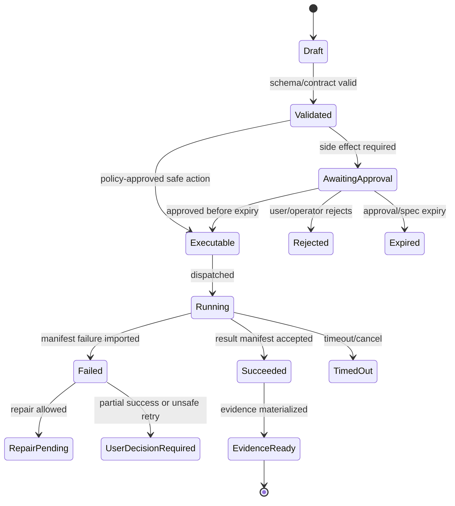

# Source Coverage Matrix

## V6.18 BMAD semantic coverage correction

[[100 - BMAD Method and Builder Deep Comprehension Audit]] is the current Method/Builder semantic coverage authority. Coverage now includes all 47 Method skill entrypoints, execution archetypes, composite host-native installation, installed-skill versus help-action catalogs, three config graphs, five live Builder skills, authoring loops, agent archetypes, module shapes, eval modes, validation profiles, script boundaries, and staged promotion. Earlier rows that described only installer/package/help/validator surfaces were preliminary.

Builder coverage is split deliberately: contracts and inactive Build/Edit/Analyze drafts are early foundation work; candidate execution, eval, install rehearsal, signing, publication, and activation require later governed-execution evidence.

## V6.17 coverage axis

All coverage is now classified as `shared`, `web_managed`, or `windows_local`. A claim is complete only when it identifies both the semantic owner and the delivery authority that enforces it.

| Coverage area | Shared contract | Web-managed realization | Windows-local realization |
|---|---|---|---|
| BMAD workflow/package semantics | [[13 - BMAD Kernel, Package Loader, and Help Advisor]], [[39 - BMAD Package Format]] | Cloud catalog and Runtime API | Signed local cache and Rust interpreter |
| Airlock | [[19 - Airlock Policy and Approvals]], [[55 - Airlock Policy Rulebook]] | .NET policy + Azure audience | Rust policy + local-host audience |
| Workspace/effects | [[99 - Dual-Delivery Contract and Conformance Specification]] | [[16 - Workspace Service]], [[20 - Execution Lanes and Container App Jobs]] | [[95 - Windows Local Workspace and Execution]] |
| Evidence/recovery | [[21 - Trace, Evidence, and Observability]], [[45 - Trace Bundle Schema]] | SQL/Blob authority | [[96 - Windows Local State, Evidence, Checkpoint, and Rollback]] |
| Security | Common threat vocabulary/rule IDs | [[23 - Security, Identity, and Secrets]], [[40 - Threat Model and Security Tests]] | [[97 - Windows Desktop Security and Trust Model]] |
| Connected Azure features | API/schema semantics | Core web platform | [[98 - Azure Support Plane for Windows Desktop]] |

> This file is part of the V6 implementation library, generated from the project context, review corrections, and the decomposed architecture library.


---

## Implementation-depth contract

This file is part of the V6 implementation library. It is written as an implementation guide, not as a strategy memo. Every component must be built against the same system-wide constraints:

1. **The first executable slice comes before breadth.** The first demonstrable product must prove authenticated chat, workspace context, typed plan output, proposal creation, Airlock validation, approval, isolated execution, validation, checkpoint, and evidence.
2. **The delivery-specific authority owns lifecycle state.** The web Runtime API imports remote-worker facts into SQL; the signed desktop Rust host imports local-executor facts into SQLite. Workers, child processes, renderers, models, sync services, and support APIs do not advance authoritative lifecycle state.
3. **Airlock creates the only side-effect token.** Workspace writes, command runs, exports, package imports, dependency restores, and policy-sensitive actions require an `ApprovedExecutionSpec` issued by Airlock.
4. **The model does not own proposals.** Model Gateway returns typed model outputs. Run Orchestrator creates normalized `Proposal` records. Airlock validates proposals.
5. **No raw shell by default.** Commands are represented as `argv[]` plus policy metadata; `sh -c`, shell expansion, broad environment access, and open network access are blocked unless explicitly operator-approved.
6. **Every side effect is reconstructable.** Diffs, preimages, spec hashes, policy hashes, approvals, job image digests, result manifests, logs, artifacts, and rollback metadata must be traceable.
7. **Each module has ports.** Even inside a modular monolith, use explicit interfaces and contracts to avoid creating a god control plane.


## 1. Component identity

| Field | Value |
|---|---|
| Component | `Source Coverage Matrix` |
| Area | `coverage` |
| Primary implementation package | `docs` |
| Runtime/technology | `Markdown` |
| First-slice priority | `after-core or supporting` |


## 2. Purpose

Map original context/review themes to v3 files and prove no major implementation context was dropped.

The implementation must be narrow enough to fit the corrected first vertical slice, but designed so BMAD package execution, the existing presentation adapter, Builder Studio, SkillOps, replay, and operator controls can plug into the same contracts later.


## 3. Owns / does not own

### Owns
- Detailed implementation guidance
- Cross-reference to related component files
- Acceptance criteria
- Test expectations

### Does not own
- Replacing source context
- Implicit architecture changes without ADR


## 4. Public/API surface and internal ports

### Required API/routes or callable operations
- `See route catalog and block-specific files`


### Internal contract rules

- Every boundary uses typed, schema-versioned values. C# uses `Runtime.Contracts` / `Runtime.Domain`, Rust uses generated contract types plus `desktop-domain`, and TypeScript uses generated web or desktop facade types; no generated DTO grants runtime authority.
- External payloads must be schema-versioned. Internal objects may evolve faster but must not leak into OpenAPI without a contract version.
- Every state mutation must be idempotent or protected by optimistic concurrency.
- Every side-effect operation must receive an `ApprovedExecutionSpec` or be provably read-only.
- Every error response must use the standard error envelope with `code`, `message`, `correlationId`, `retryable`, and optional `detailsRef`.


### Starter interface/type sketch

```python
@dataclass(frozen=True)
class WorkerInvocation:
    job_id: str
    approved_spec_path: Path
    checkout_path: Path
    output_dir: Path
    log_dir: Path
```


## 5. State model

### Component states
- `draft`
- `reviewed`
- `accepted`
- `implemented`
- `verified`


### Generic side-effect lifecycle





## 6. Persistence responsibilities

### SQL tables or domain records touched
- `See data model and DDL starter where applicable`

### Blob/object storage paths touched
- `See blob layout reference where applicable`


### Persistence rules

- In `web_managed`, SQL stores lifecycle state, compact indexes, ownership metadata, and references. In `windows_local`, SQLite stores the corresponding local authority records.
- In `web_managed`, Blob stores large immutable payloads: snapshots, logs, diffs, manifests, artifacts, exports, packages, traces, and validation reports. In `windows_local`, encrypted local content-addressed storage holds authority-owned payloads; cloud upload is explicit and purpose-scoped.
- Any Blob payload referenced from SQL must include content hash, schema version, created timestamp, and retention class.
- No raw secrets, broad credentials, or unredacted prompt/context payloads are stored by default.
- Migrations must be forward-safe and testable against fixture data.


## 7. Detailed implementation steps


### Phase 0 — Contract and spike

1. Create or update the relevant ADR before implementation when the decision affects hosting, policy, security, data ownership, or external dependencies.

2. Define public DTOs and durable JSON schemas first. Do not let implementation classes silently become external contracts.

3. Create a minimal fixture that exercises the component without requiring the whole platform.

4. Add negative tests for the most dangerous bypass or failure case before adding the happy path.

5. Record assumptions in the component file and in the ADR index if they are not final.

6. For `Source Coverage Matrix`, implement only the smallest behavior that proves its contract in the first executable slice, then add extended BMAD/Builder/artifact behavior after gate approval.


### Phase 1 — Skeleton implementation

1. Create the package/module/folder with explicit ports/interfaces and dependency direction rules.

2. Add dependency injection registration with narrow interfaces rather than passing broad services everywhere.

3. Implement persistence only through repository/store abstractions that expose business operations, not raw table access.

4. Emit structured events for every important state transition even if the UI does not yet render them.

5. Add unit tests for object creation, invalid input, authorization/policy denial, and idempotency where relevant.

6. For `Source Coverage Matrix`, implement only the smallest behavior that proves its contract in the first executable slice, then add extended BMAD/Builder/artifact behavior after gate approval.


### Phase 2 — First vertical integration

1. Connect the component to the first executable slice only. Avoid adding full future scope before the vertical path works.

2. Use fake/stub adapters for expensive external systems until the contract is proven.

3. Make all side effects flow through Proposal → AirlockDecision → Approval/Grant → ApprovedExecutionSpec → Dispatch.

4. Persist large payloads to Blob and store only compact references in SQL.

5. Return UI-consumable run events so the Chat Workbench can render progress without polling raw tables.

6. For `Source Coverage Matrix`, implement only the smallest behavior that proves its contract in the first executable slice, then add extended BMAD/Builder/artifact behavior after gate approval.


### Phase 3 — Production hardening

1. Add telemetry attributes, correlation IDs, redaction, and audit events.

2. Add retry, timeout, cancellation, and stale-state handling.

3. Add migration scripts and seed data for dev/test.

4. Add operator visibility for status, errors, budget/policy impact, and cleanup status.

5. Document runbooks for the top failure modes.

6. For `Source Coverage Matrix`, implement only the smallest behavior that proves its contract in the first executable slice, then add extended BMAD/Builder/artifact behavior after gate approval.


### Phase 4 — Regression and release gate

1. Add contract tests against OpenAPI/JSON Schema.

2. Add replay fixtures or golden outputs where deterministic behavior is expected.

3. Add security tests for prompt injection, secret leakage, excessive agency, insecure output handling, and supply-chain drift where relevant.

4. Update release gate evidence with screenshots/log excerpts/manifests rather than informal claims.

5. Mark open risks and deferred v1.5/v2 items explicitly.

6. For `Source Coverage Matrix`, implement only the smallest behavior that proves its contract in the first executable slice, then add extended BMAD/Builder/artifact behavior after gate approval.


## 8. Validation and test plan

### Required tests
- guide completeness review
- cross-reference check
- acceptance criteria check


### Minimum test layers

| Layer | What to test | Required before merge |
|---|---|---|
| Unit | object validation, state transitions, parsing, policy predicates | yes |
| Contract | OpenAPI/JSON Schema compatibility, generated clients, worker manifests | yes for public/durable payloads |
| Integration | SQL + Blob references, dispatch/import, authz, Airlock boundary | yes for side-effect paths |
| E2E | chat → proposal → approval → execution → evidence | yes for first slice files |
| Replay/golden | BMAD package fixtures, presentation adapter, evidence bundle | yes before v1 beta |
| Security negative | prompt injection, secret leak, policy bypass, path traversal, raw shell | yes for all side-effect components |


## 9. Failure modes and recovery

| Failure | Detection | Required behavior | User/operator visibility |
|---|---|---|---|
| Invalid schema | contract validation | reject before persistence or dispatch | show actionable error with correlation ID |
| Stale proposal/preimage | hash mismatch | void proposal or require rebase/new proposal | show stale context warning |
| Approval expired | expiry check | reject dispatch | show re-approve option |
| Policy mismatch | policy hash mismatch | reject spec | operator audit event |
| Worker timeout | job monitor | mark job timed out; preserve partial logs | timeline event + retry option if safe |
| Manifest missing/invalid | manifest import validation | do not advance success state | incident/failure card |
| Partial success | checkpoint/validation state | enter `user_decision_required` or `kept_for_repair` | explicit decision card |
| Secret detected | scanner/redactor | redact and block if high confidence | security finding card/operator event |


## 10. Security and policy requirements

- Treat workspace files, package files, generated artifacts, model outputs, and logs as untrusted input.
- Never let untrusted content override system instructions, Airlock policy, command allowlists, network policy, or secret handling.
- Enforce project-level authorization on every read and write.
- Log security-relevant denials as audit events, but do not include raw secret values.
- Prefer fail-closed behavior when policy, identity, schema, or storage checks are ambiguous.
- Add negative tests for the most likely bypass path before writing happy-path code.


## 11. Observability

Minimum telemetry fields for this component:

- `correlation.id`
- `project.id`
- `run.id` when available
- `component.name`
- `operation.name`
- `operation.outcome`
- `policy.version` when applicable
- `spec.id` when applicable
- `job.id` when applicable
- `artifact.id` when applicable
- redaction counters, not raw secrets

Metrics to consider: request latency, state-transition count, policy denials, approval wait time, job duration, manifest import failures, schema validation failures, retry count, budget blocks, and evidence materialization time.


## 12. Acceptance criteria

- [ ] The component has a clear owner package and does not leak responsibilities into unrelated modules.
- [ ] Public routes/payloads are represented in OpenAPI/JSON Schema where applicable.
- [ ] Side-effect paths cannot execute without Airlock evaluation and `ApprovedExecutionSpec`.
- [ ] SQL lifecycle state is mutated only by the Runtime API/Application layer.
- [ ] Blob payloads have content hashes and schema versions.
- [ ] Tests include at least one negative/bypass case.
- [ ] Events and evidence are emitted for user-visible actions.
- [ ] The component is represented in the release gate matrix.
- [ ] The implementation does not introduce Cortex as a runtime namespace.
- [ ] Documentation includes deferred v1.5/v2 scope explicitly rather than silently omitting it.


## 13. Integration checklist

- [ ] Update `32 - Integration Contract Map.md` with any new caller/callee relationship.
- [ ] Update `25 - OpenAPI, Schemas, and Generated Clients.md` for public route or schema changes.
- [ ] Update `22 - Data Model - SQL and Blob.md`, `47 - Database DDL Starter.md`, or `48 - Blob Storage Layout.md` for persistence changes.
- [ ] Update `27 - Testing, Validation, and Replay.md` for new fixtures or replay needs.
- [ ] Update `33 - Release Gates and Acceptance Matrix.md` if the change affects release readiness.
- [ ] Add or update ADR in `31 - Architecture Decision Records.md` if the change alters architecture, hosting, policy, or security posture.


## Coverage table

| Original source theme | V3 files that preserve/implement it | Coverage level |
|---|---|---|
| Chat-first governed runtime | `00`, `01`, `10`, `12`, `19`, `20`, `21` | Implementation guide + preserved source |
| BMAD-only identity, no Cortex namespace | `00`, `13`, `31`, `35`, `39` | Locked rule + parser guide |
| Existing presentation workflow adapter | `15`, `39`, `27`, `33`, `35` | Dedicated component guide + regression fixtures |
| Modular monolith, not microservice maze | `02`, `11`, `32`, `31` | Locked decision + ports/contracts |
| Airlock side-effect boundary | `19`, `32`, `38`, `40`, `33` | Spec + policy tests + release gates |
| Workspace snapshots/checkouts/preimages/checkpoints | `16`, `22`, `29`, `47`, `48` | Domain + persistence + failure semantics |
| Workspace Intelligence lexical/structural first | `17`, `27`, `38` | Async scanner + tests |
| Model Gateway provider isolation and structured outputs | `18`, `25`, `35`, `40` | Contract-first + security tests |
| Trace/evidence/privacy/observability | `21`, `41`, `45`, `33` | Evidence schema + OTel operational plan |
| Azure deployment baseline | `28`, `37`, `35`, `24` | IaC/runbook + source alignment |
| Review correction: one executable slice first | `01`, `04`, `08`, `30`, `33` | Corrected build order |
| Review correction: API-owned SQL lifecycle state | `11`, `20`, `22`, `29`, `32` | Ports + state machine + worker protocol |
| Review correction: command DSL not raw shell | `19`, `20`, `38`, `40` | Schema + tests |
| Review correction: partial failure semantics | `29`, `21`, `30`, `33` | State machine + release gates |
| Builder Studio deferred after core execution | `08`, `14`, `30`, `33` | Build order + gates |
| BMAD Method deep semantic review: 47 skills, prompt execution archetypes, composite install, config/customization, help/actions, state, validation limits | `13`, `34`, `39`, `54`, `69`, `83`, `100` | Profile-aware Method runner, final composite inventory, help confidence, and source-derived fixtures |
| BMAD Builder deep semantic review: Build/Edit/Analyze loops, agents/workflows/modules, eval drift, script boundaries, lifecycle and promotion | `14`, `34`, `39`, `51`, `54`, `69`, `83`, `100` | Early inactive authoring plus isolated evaluation/rehearsal and reversible activation |
| OpenClaw comparable runtime review: plugin manifests, sandbox/tool policy split, exec approvals, safe file ops, scenario QA packs | `12`, `19`, `20`, `23`, `27`, `84` | Hardened governance, execution, package-install, and replay guidance |
| OpenClaw structured code review: 20 core packages, 140 plugin manifests, protocol schemas, plugin approvals, skill proposals, maturity scorecard, shrinkwrap/release controls | `14`, `19`, `20`, `23`, `25`, `27`, `28`, `32`, `33`, `34`, `39`, `85` | Contract-first extension descriptors, exact execution binding, evidence-led maturity gates, package proposal queue, and supply-chain lock/provenance guidance |
| Odysseus self-hosted AI workspace review: auth, owner scope, internal loopback, SSRF guards, uploads, context compaction, tasks, providers, memory, skills, operations | `00`, `10`, `12`, `16`, `17`, `18`, `20`, `23`, `24`, `25`, `27`, `29`, `32`, `34`, `36`, `39`, `40`, `41`, `42`, `43`, `88` | Self-hosted trust profile, owner-scoped resources, internal tool principal, DNS-pinned egress policy, upload/document confinement, adaptive context, task chains, local model operations, and degraded-state UX |
| Consolidated AI workspace source synthesis: BMAD, OpenClaw, Hermes, Odysseus, technology, architecture, infrastructure, release gates | `00`, `02`, `07`, `08`, `11`, `18`, `20`, `23`, `24`, `25`, `27`, `28`, `30`, `32`, `33`, `34`, `35`, `36`, `37`, `51`, `60`, `76`, `77`, `82`, `89` | Unified operating doctrine, locked architecture additions, stack gates, infrastructure runbook updates, package/tool/runtime governance, and source-derived release blockers |

## Coverage audit method

- The full source context is preserved in `05 - Preserved Source Context.md`.
- The full technical review is preserved in `06 - Preserved Critical Review.md`.
- The preliminary BMAD package/install review is `83`; the current complete semantic audit is [[100 - BMAD Method and Builder Deep Comprehension Audit]].
- The OpenClaw comparable-runtime review is captured in `84 - OpenClaw Source Review - Comparable Runtime Patterns.md`.
- The deeper OpenClaw subsystem review is captured in `85 - OpenClaw Structured Code Review.md`.
- The Odysseus self-hosted AI workspace review is captured in `88 - Odysseus Source Code Review - Self-Hosted AI Workspace.md`.
- The consolidated AI workspace synthesis is captured in `89 - Consolidated AI Workspace Source Review and Architecture Improvements.md`.
- Every block-specific guide has implementation steps, contracts, states, persistence, tests, failure handling, and acceptance criteria.
- Any future simplification must update this matrix and explicitly mark removed context as `superseded`, not silently delete it.


---

## Historical Revision Notes (V3 -> V4)
## Review finding

`07 - Source Coverage Matrix.md` is part of the implementation library support layer. In v3, support files were useful but not always testable. In v4, every support file must provide either a decision, reference contract, release gate, mapping, runbook, or checklist that can be executed by a developer or coding agent.

## Required usage

1. Read this file before changing the related implementation area.
2. Cross-check it against `07 - Source Coverage Matrix.md` and `50 - V4 Full Library Audit.md`.
3. When implementing a task, copy the relevant checklist items into the issue/story.
4. When a decision changes, update this file and `31 - Architecture Decision Records.md` in the same PR.
5. When a contract changes, update `25 - OpenAPI, Schemas, and Generated Clients.md`, `46 - API Route Catalog.md`, and generated clients.

## V4 quality rules for this file

- It must not contradict locked architecture decisions.
- It must not reintroduce a broad v1 scope that competes with the executable vertical slice.
- It must preserve BMAD source contracts and the existing presentation workflow adapter decision.
- It must reflect the Runtime API as lifecycle state owner and the worker as manifest/log producer only.
- It must identify whether guidance is `LOCKED`, `TEMPORARY`, `PHASE-0 SPIKE`, `V1`, `V1.5`, or `V2`.

## Implementation checklist linkages

| Related guide | What to cross-check |
|---|---|
| `01 - First Build - Executable Vertical Slice.md` | Does this file support or distract from the first slice? |
| `29 - Concurrency, Transactions, and Failures.md` | Are state and partial failure semantics compatible? |
| `32 - Integration Contract Map.md` | Are producer/consumer boundaries clear? |
| `33 - Release Gates and Acceptance Matrix.md` | Is there a release gate for this guidance? |
| `49 - Detailed Component Build Checklists.md` | Are implementation tasks represented as checklist items? |

## Hermes Source Coverage

Source: [[86 - Hermes Source Code Review - Agent Runtime and Learning Loop]].

| Hermes source area | Sapphirus notes updated |
|---|---|
| `AGENTS.md` narrow core and prompt-cache invariants | [[00 - Common Rules and Product Shape]], [[12 - Run Orchestrator and Agent Kernel]], [[18 - Model Gateway and Microsoft Foundry]] |
| `docs/session-lifecycle.md` and `hermes_state.py` session state | [[25 - OpenAPI, Schemas, and Generated Clients]], [[29 - Concurrency, Transactions, and Failures]], [[34 - Canonical Object Model]] |
| `SECURITY.md`, `tools/approval.py`, `tools/file_safety.py` | [[19 - Airlock Policy and Approvals]], [[23 - Security, Identity, and Secrets]], [[27 - Testing, Validation, and Replay]] |
| `tools/registry.py` and plugin/provider directories | [[12 - Run Orchestrator and Agent Kernel]], [[25 - OpenAPI, Schemas, and Generated Clients]], [[32 - Integration Contract Map]] |
| `docs/chronos-managed-cron-contract.md` | [[25 - OpenAPI, Schemas, and Generated Clients]], [[29 - Concurrency, Transactions, and Failures]], [[34 - Canonical Object Model]] |
| `docs/relay-connector-contract.md` | [[32 - Integration Contract Map]], [[34 - Canonical Object Model]] |
| `tools/skills_guard.py`, `tools/skill_manager_tool.py`, `tools/write_approval.py` | [[14 - Builder Studio and SkillOps]], [[39 - BMAD Package Format]] |
| `pyproject.toml`, `package.json`, lockfiles | [[28 - Supply Chain, Deployment, and IaC]] |
| Hermes test inventory | [[27 - Testing, Validation, and Replay]], [[40 - Threat Model and Security Tests]], [[68 - Security Test Case Catalog]] |

## Hermes Second Deep Review Coverage

Source: [[87 - Hermes Deep Review - Extension Runtime and Operational Contracts]].

| Hermes deep-review area | Sapphirus notes updated |
|---|---|
| Provider runtime and credential binding | [[18 - Model Gateway and Microsoft Foundry]], [[23 - Security, Identity, and Secrets]], [[25 - OpenAPI, Schemas, and Generated Clients]] |
| Context compression and prompt-cache safety | [[17 - Workspace Intelligence and Context Packs]], [[18 - Model Gateway and Microsoft Foundry]], [[41 - Observability Dashboards and Alerts]] |
| ACP/editor session contracts | [[25 - OpenAPI, Schemas, and Generated Clients]], [[32 - Integration Contract Map]], [[34 - Canonical Object Model]] |
| Platform adapters and delivery targets | [[24 - Operator Console and Operations]], [[32 - Integration Contract Map]], [[34 - Canonical Object Model]] |
| Secret sources and profile scopes | [[23 - Security, Identity, and Secrets]], [[27 - Testing, Validation, and Replay]], [[29 - Concurrency, Transactions, and Failures]] |
| Cron, kanban, and task claims | [[24 - Operator Console and Operations]], [[27 - Testing, Validation, and Replay]], [[29 - Concurrency, Transactions, and Failures]] |
| Dashboard auth and WebSocket tickets | [[23 - Security, Identity, and Secrets]], [[24 - Operator Console and Operations]], [[42 - Migrations, Retention, and Cleanup]] |
| Verification evidence | [[27 - Testing, Validation, and Replay]], [[41 - Observability Dashboards and Alerts]], [[42 - Migrations, Retention, and Cleanup]] |

## Odysseus Source Coverage

Source: [[88 - Odysseus Source Code Review - Self-Hosted AI Workspace]].

| Odysseus source area | Sapphirus notes updated |
|---|---|
| `THREAT_MODEL.md`, `core/auth.py`, `core/middleware.py`, `routes/api_token_routes.py` | [[00 - Common Rules and Product Shape]], [[23 - Security, Identity, and Secrets]], [[25 - OpenAPI, Schemas, and Generated Clients]], [[40 - Threat Model and Security Tests]] |
| `src/webhook_manager.py`, `services/search/content.py`, `src/url_security.py`, `routes/webhook_routes.py` | [[23 - Security, Identity, and Secrets]], [[25 - OpenAPI, Schemas, and Generated Clients]], [[27 - Testing, Validation, and Replay]], [[32 - Integration Contract Map]] |
| `src/upload_handler.py`, `routes/upload_routes.py`, `src/agent_tools/filesystem_tools.py`, document routes/tools | [[16 - Workspace Service]], [[25 - OpenAPI, Schemas, and Generated Clients]], [[42 - Migrations, Retention, and Cleanup]], [[43 - Product UX Flows and Wireframe Notes]] |
| `src/agent_loop.py`, `src/context_budget.py`, `src/context_compactor.py`, `src/prompt_security.py` | [[10 - Chat Workbench]], [[12 - Run Orchestrator and Agent Kernel]], [[17 - Workspace Intelligence and Context Packs]], [[27 - Testing, Validation, and Replay]] |
| `routes/task_routes.py`, `src/task_scheduler.py`, `src/task_action_policy.py`, `src/tool_execution.py`, `routes/shell_routes.py` | [[20 - Execution Lanes and Container App Jobs]], [[24 - Operator Console and Operations]], [[27 - Testing, Validation, and Replay]], [[29 - Concurrency, Transactions, and Failures]] |
| `src/endpoint_resolver.py`, `src/model_discovery.py`, `routes/model_routes.py`, `src/secret_storage.py` | [[18 - Model Gateway and Microsoft Foundry]], [[23 - Security, Identity, and Secrets]], [[24 - Operator Console and Operations]], [[41 - Observability Dashboards and Alerts]] |
| `src/memory_provider.py`, `src/memory.py`, `src/memory_vector.py`, `routes/skills_routes.py` | [[17 - Workspace Intelligence and Context Packs]], [[25 - OpenAPI, Schemas, and Generated Clients]], [[34 - Canonical Object Model]], [[39 - BMAD Package Format]] |
| `ROADMAP.md`, `specs/architecture-runtime-inventory.md`, test inventory | [[24 - Operator Console and Operations]], [[27 - Testing, Validation, and Replay]], [[36 - Local Development and DevEx]], [[35 - Source Alignment Notes]] |

## Consolidated Source Synthesis Coverage

Source: [[89 - Consolidated AI Workspace Source Review and Architecture Improvements]].

| Synthesis area | Sapphirus notes updated |
|---|---|
| Unified operating doctrine and feature acceptance questions | [[00 - Common Rules and Product Shape]], [[02 - Locked Architecture Decisions]], [[51 - Master Implementation Sequence]] |
| Technology stack review and official platform revalidation | [[60 - External Platform References and Verification Sources]], [[76 - Current Stack Baseline]], [[77 - Platform Revalidation Register]], [[82 - Current Technology Decision Summary]] |
| Runtime, model gateway, execution, security, and schema boundaries | [[11 - Runtime API Control Plane]], [[18 - Model Gateway and Microsoft Foundry]], [[20 - Execution Lanes and Container App Jobs]], [[23 - Security, Identity, and Secrets]], [[25 - OpenAPI, Schemas, and Generated Clients]] |
| Infrastructure, IaC, supply chain, and Azure runbooks | [[28 - Supply Chain, Deployment, and IaC]], [[36 - Local Development and DevEx]], [[37 - Azure Environments and Deployment Runbooks]] |
| Backlog, roadmap, release gates, testing, and integration map | [[08 - Phased Roadmap and Build Order]], [[27 - Testing, Validation, and Replay]], [[30 - Implementation Epics and Backlog]], [[32 - Integration Contract Map]], [[33 - Release Gates and Acceptance Matrix]] |
| Canonical object grouping and source alignment | [[34 - Canonical Object Model]], [[35 - Source Alignment Notes]] |
