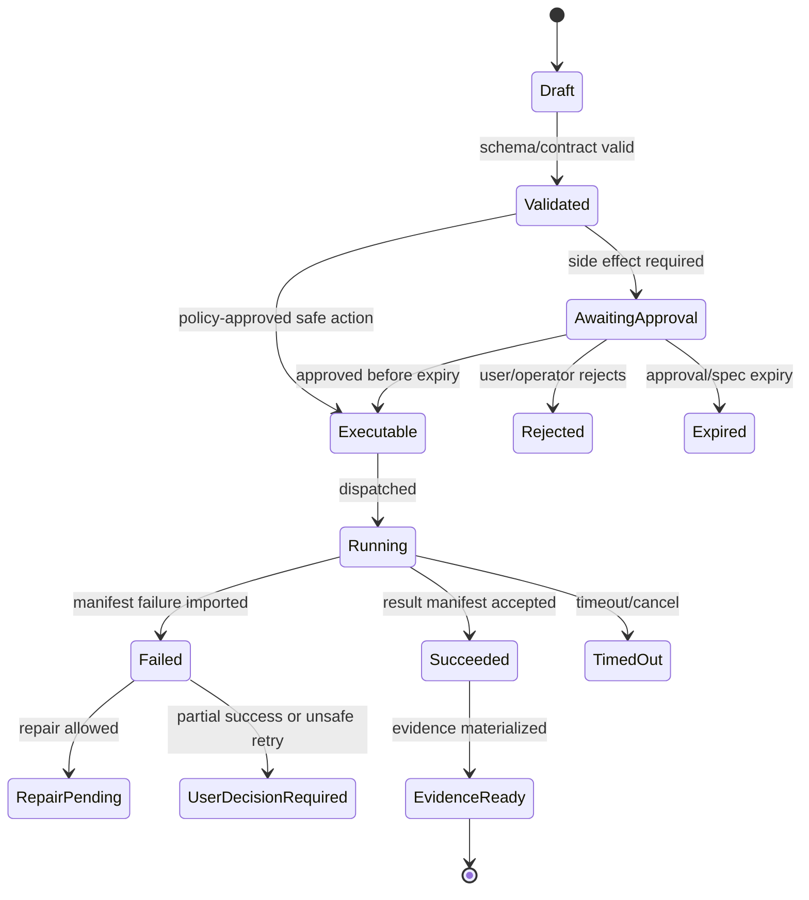

# Chat Workbench

## V6.17 delivery surfaces

The interaction model is shared, but the shells and authority adapters are distinct:

| User action | Web application | Windows desktop |
|---|---|---|
| Start workspace | Clone/import/upload into a cloud-managed project | Choose an existing local folder with the native picker |
| Browse files | Read immutable cloud snapshot/checkouts | Read only through a Rust `LocalWorkspaceCapability` |
| Review change | Browser diff backed by cloud candidate | Desktop diff backed by local candidate/checkpoint |
| Approve/apply | .NET Airlock → fixed remote executor → manifest import | Rust Airlock → journaled local apply or structured local command |
| Evidence/rollback | SQL/Blob evidence and cloud checkpoint | SQLite/encrypted local evidence and local checkpoint |

Shared React components consume `WebRuntimeFacade` or `DesktopRuntimeFacade`; they never call SQL, filesystem, process, or Tauri plugin primitives directly. Sync and remote jobs are visibly separate desktop actions.

## 1. Mission

Provide the primary product shell: a persistent project conversation that can inspect context, show plans, request approvals, stream execution, preview artifacts, and present evidence without forcing the user into terminal/IDE workflows.

## 2. Responsibilities

- Render project threads and run events as first-class cards.
- Expose side panels for files, context, diff, logs, artifacts, and evidence.
- Make exact candidate-bound approval decisions explicit and inspectable. A future policy grant may be revoked; a consumed execution authority is immutable and cannot be retroactively repurposed.
- Show stale context, preimage drift, blocked policy, and partial failure states clearly.
- Support Ask, Plan, Patch, Apply, Validate, Repair, Review, and Finalize modes.
- Never present a model suggestion as if it already happened.

## 3. Explicit Non-Responsibilities

- Do not bypass Airlock.
- Do not mutate authoritative state outside the Runtime API state transition path.
- Do not hide policy decisions inside UI-only code.
- Do not let model text become executable behavior without typed validation.
- Do not introduce a separate runtime semantics path unless an ADR approves it.

## 4. Interfaces and Ports

| Interface | Purpose |
|---|---|
| IThreadClient | Create/read messages, runs, and event streams. |
| IApprovalClient | Submit approve/reject decisions with visible policy/spec hashes. |
| IArtifactClient | Fetch artifact previews and evidence bundles. |
| IWorkspaceClient | Read snapshot/file tree/status, never write directly. |
| IExecutionStream | Receive SignalR/SSE events for logs and state changes. |

## 5. State and Lifecycle

The UI is a projection of server state. A run card must map to a persisted run/proposal/approval/execution/evidence record. Optimistic UI is allowed only for draft user input, never for side effects.

## 6. Data Contracts

```ts
type RunCard =
  | { kind: 'context_pack'; contextPackId: string; selectedFiles: FileSelection[] }
  | { kind: 'plan'; planId: string; risks: Risk[]; validation: ValidationStrategy }
  | { kind: 'proposal'; proposalId: string; diffSummary?: DiffSummary; command?: CommandSpec }
  | { kind: 'approval'; approvalId: string; policyDecisionId: string; candidateId: string; candidateHash: string; expiresAt: string }
  | { kind: 'execution'; executionId: string; status: ExecutionStatus; logRef?: string }
  | { kind: 'evidence'; evidenceBundleId: string; rollbackPoint?: string };
```

## 7. Primary Flow

```text
User message → message card
→ context card
→ plan card
→ proposal/diff card
→ approval card
→ execution/log card
→ validation card
→ evidence card
```

## 8. Implementation Steps

- Build route skeleton: project list, project chat, operator shell placeholder.
- Generate TypeScript client from OpenAPI.
- Implement event stream hook with reconnect and event ordering.
- Implement card renderer by event kind.
- Implement diff viewer with file/hunk risk labels.
- Implement terminal/log panel as read-only stream.
- Implement evidence panel with copied summary and downloadable bundle.
- Add Playwright demo for the vertical slice.

## 9. Failure Modes and Mitigations

| Failure | Mitigation |
|---|---|
| Approval fatigue | Display scoped reusable policy grants as non-executable; every governed dispatch still uses a fresh evaluated candidate and single-use spec. |
| User confusion between proposal and execution | Use distinct visual states: proposed, approved, running, applied, validated. |
| Long logs freeze UI | Virtualize logs and stream chunks by reference. |
| Operator routes leaked to normal users | Use route guards and API scope checks, not CSS hiding. |
| Raw secrets shown in logs | Display redacted output only; raw privileged view separate. |

## 10. Acceptance Criteria

- User can complete the vertical slice without leaving the web app.
- Every governed high-risk effect requiring a human is preceded by a card showing the exact `ExecutionSpecCandidate` hash. Policy-allowed governed effects still show policy/spec evidence; ordinary CRUD does not create a fake execution approval.
- The diff panel shows preimage status before apply.
- The log panel is read-only and tied to an execution ID.
- Evidence panel links all relevant hashes/IDs.
- UI represents partial failure states explicitly.


## 11. Panel Requirements

| Panel | Required v1 Content |
|---|---|
| Conversation | Messages, agent summaries, run cards, approval prompts. |
| Files | Snapshot tree, ignored paths, dirty state, generated artifacts. |
| Context | File/snippet list, selection reason, source hash, stale marker. |
| Diff | Unified diff, hunk risk, path policy result, preimage hash status. |
| Logs | Live output chunks, command spec, timeout, exit code, redaction status. |
| Artifacts | Markdown/doc/presentation previews and export state. |
| Evidence | approvals, model calls, costs, jobs, changed files, rollback, risks. |

---

## v2 Review Improvements

### 1. Required Route Model

| Route | Purpose |
|---|---|
| `/sign-in` | Web authentication entry; desktop uses the native sign-in/entitlement flow. |
| `/projects` | Project list and import/open actions. |
| `/projects/new` | Delivery-specific cloud project creation/import; desktop opens the native folder selection flow instead. |
| `/projects/:projectId/chat/:threadId?` | Main chat workbench. |
| `/projects/:projectId/files/*` | File tree and read-only source view in the current workspace authority. |
| `/projects/:projectId/artifacts` | Project artifact index and status. |
| `/projects/:projectId/artifacts/:artifactId` | Artifact preview with evidence references. |
| `/projects/:projectId/history` | Run, evidence, checkpoint, and rollback history. |
| `/projects/:projectId/checkpoints/:checkpointId` | Checkpoint detail and rollback request. |
| `/activity` | Cross-project runs that are active, blocked, awaiting a decision, or recently completed. |
| `/builder/*` | Capability-gated Builder Studio; imported lazily and excluded from the first workbench chunk. |
| `/operator/*` | Operator-only routes behind admin guard. |

### 2. Workbench Layout Contract

The normative V6.18 layout is defined in [[43 - Product UX Flows and Wireframe Notes]]. The workbench has a narrow global rail, an optional route-specific context rail, the conversation workspace, and one stable inspector. At `≥1440 px`, all four may coexist; from `1200–1439 px`, only one secondary rail opens beside the conversation by default; below `1200 px`, context and inspector use focus-managed sheets; below `768 px`, review and activity become single-column routes.

The center column owns the conversation scroll root and sticky composer. The inspector owns Context, Changes, Command, Logs, and Evidence tabs. Selecting a run stage changes the inspector's content but never navigates the conversation away or creates a second execution path.

The wide-screen sketch below is illustrative; the responsive geometry and component dimensions in files 26, 43, and 66 are normative.

```text
┌────────┬─────────────────┬───────────────────────────────┬──────────────────────┐
│ Global │ Context rail    │ Conversation                  │ Inspector            │
│ rail   │ threads / files │ messages + RunCapsules        │ context / changes    │
│ 56 px  │ 220–280 px      │ sticky scoped composer        │ command / logs /     │
│        │ collapsible     │ project + delivery header     │ evidence, resizable  │
└────────┴─────────────────┴───────────────────────────────┴──────────────────────┘
```

The conversation remains the primary control surface. Panels expose evidence and decisions; they do not create alternate execution semantics.

### 2.1 Progressive run presentation

Do not render every persisted event as a permanent large timeline card. Each run is one `RunCapsule` with five stages: `Understand`, `Plan`, `Review`, `Execute`, and `Evidence`.

- The active stage shows one concise summary and at most one primary action.
- Completed stages collapse to a summary row and remain inspectable.
- Context, diff, command, log, and evidence payloads open in the inspector.
- A completed run collapses to outcome, changed-file count, validation, evidence, and rollback availability.
- Unknown or diagnostic events remain available under Technical details without breaking the capsule.
- Partial failure keeps the capsule expanded until the user selects repair, rollback, keep, or explicit dismissal.

### 3. Card Types

| Card | Trigger Event | Required Fields |
|---|---|---|
| Intent card | `run.intent.classified` | intent, confidence, route, missing inputs. |
| Context card | `context.pack.created` | files/snippets, reason, token estimate, redactions. |
| Plan card | `model.call.completed` (plan call) | steps, affected files, risks, validation commands. |
| Proposal card | `proposal.created` | proposal type, risk, diff summary, side effects. |
| Approval card | `approval.required` | exact candidate fields/hash, policy result/hash, audience/template, mutable inputs, limits, expiration, approve/reject. |
| Execution card | `execution.dispatched` | worker image digest, command `argv[]`, limits. |
| Validation card | `validation.completed` | command, exit code, summary, logs link. |
| Evidence card | `evidence.materialization.completed` | changed files, approvals, hashes, rollback point. |

The table above defines event-to-view data, not a mandate for eight separate visual cards. `Intent`, `Context`, `Plan`, `Proposal`, `Approval`, `Execution`, `Validation`, and `Evidence` render as stages or details within the owning `RunCapsule`. Only an attention-requiring decision may use a visually elevated inner surface.

### 4. UI State Machine

```text
idle
→ composing
→ run_starting
→ context_selecting
→ model_working
→ proposal_ready
→ awaiting_approval
→ executing
→ validation_failed_user_decision
→ repair_proposed
→ evidence_ready
→ complete
```

The UI must never show a governed effect as complete until the Runtime API has validated/imported `WebWorkerResultManifest` and atomically advanced completion/lifecycle/Evidence Ledger/outbox state.

### 5. Frontend Data Boundaries

- The UI renders server state; it does not infer policy status locally.
- Approval buttons send an approval decision; they do not build execution specs.
- Diff views are read-only until Airlock decision exists.
- Logs are streamed as append-only chunks and can be truncated with a Blob link.
- Raw secrets, raw full prompts, and raw full context packs are hidden unless the user has explicit privileged trace access.

### 6. Accessibility and Keyboard Requirements

| Interaction | Requirement |
|---|---|
| Approval card | Keyboard approve/reject, visible focus, confirmation for high risk. |
| Diff panel | File/hunk navigation by keyboard. |
| Terminal logs | Pause autoscroll, copy redacted logs, preserve line numbers. |
| Panels | Resizable and collapsible with persisted layout. |
| Status changes | Announced via accessible live region without noisy log spam. |

### 6.1 Composer anatomy

The composer contains, in order:

1. selected attachments/context sources with remove controls;
2. multiline prompt field with a clear accessible label;
3. delivery-safe supporting controls such as BMAD action/profile selection;
4. upload/progress/error text when present;
5. one primary send/stop control whose label reflects the current state.

The composer does not contain model/provider health, raw budgets, every tool, or a generic execution button. `Ctrl/Cmd + Enter` submits only while focus is in the composer. During a running request the primary control becomes `Stop response` only when stopping is supported; governed execution stop remains on the owning `ExecutionProgress` surface.

### 6.2 Workbench state presentation

| State | Presentation |
|---|---|
| Empty | One useful explanation and up to three grounded starting actions. |
| Loading | Stable shell geometry and small region skeletons; no shimmering fake paragraphs. |
| Reconnecting | Keep last confirmed state and show non-blocking reconnect status beside the active run. |
| Stale | Disable the affected decision, explain the source of drift, and offer refresh/rebase. |
| Degraded | Explain the effect on this request; show retry or fallback only when policy allows. |
| Approval expired | Preserve the review, disable the old decision, and require authority refresh. |
| Partial failure | Show succeeded work, failed work, current workspace state, and valid recovery choices inline. |
| Output truncated | Show retained/total size and link durable redacted output. |

### 6.3 Motion and visual behavior

Use the centralized recipes in [[26 - Frontend Design System]]: CSS for hover/focus/press; Motion for inspector/sheet entrance, one-time capsule entrance, and approval-to-execution continuity. Streaming content, log rows, and elapsed-time updates do not animate into place. Reduced motion removes transform/layout animation while preserving immediate state feedback.

### 7. Frontend Acceptance Tests

- Approval card cannot be submitted twice.
- Expired approval refreshes policy state before submission.
- Diff panel shows preimage drift status.
- Terminal panel displays `argv[]`, not a shell-composed string.
- Evidence panel links proposal, candidate, policy, approval, spec, work item/attempt/completion, worker result, ledger range, checkpoint, artifact, and rollback IDs/hashes.
- Operator routes are absent or blocked for non-operator users.
- The first slice remains usable at `1280×720`, `1440×900`, and narrow mobile review widths without clipped decisions or composer overlap.
- A user can identify `Cloud workspace` versus `Local folder` without relying on color.
- A completed run collapses without hiding evidence or rollback availability.
- Opening and closing the inspector restores focus to its exact trigger.
- Keyboard-only review can inspect changes, command, risk, policy, and then reject or approve.
- Reduced-motion mode removes transform/layout animation and keeps every state transition understandable.


---


---

## Implementation-depth contract

This file is part of the V6 implementation library. It is written as an implementation guide, not as a strategy memo. Every component must be built against the same system-wide constraints:

1. **The first executable slice comes before breadth.** The first demonstrable product must prove authenticated chat, workspace context, typed plan output, proposal creation, Airlock validation, approval, isolated execution, validation, checkpoint, and evidence.
2. **The delivery-specific authority owns lifecycle state.** The web Runtime API imports remote-worker facts into SQL; the signed desktop Rust host imports local-executor facts into SQLite. Workers, child processes, renderers, models, sync services, and support APIs do not advance authoritative lifecycle state.
3. **Airlock creates the only side-effect token.** Workspace writes, command runs, exports, package imports, dependency restores, and policy-sensitive actions require an `ApprovedExecutionSpec` issued by Airlock.
4. **The model does not own proposals.** Model Gateway returns typed model outputs. Run Orchestrator creates normalized `Proposal` records. Airlock validates proposals.
5. **No raw shell by default.** Commands are represented as `argv[]` plus policy metadata; `sh -c`, shell expansion, broad environment access, and open network access are blocked unless explicitly operator-approved.
6. **Every side effect is reconstructable.** Diffs, preimages, spec hashes, policy hashes, approvals, job image digests, result manifests, logs, artifacts, and rollback metadata must be traceable.
7. **Each module has ports.** Even inside a modular monolith, use explicit interfaces and contracts to avoid creating a god control plane.


## 1. Component identity

| Field | Value |
|---|---|
| Component | `Chat Workbench` |
| Area | `Experience layer` |
| Primary implementation package | `apps/web` |
| Runtime/technology | `React + TypeScript` |
| First-slice priority | `core` |


## 2. Purpose

Provide the primary product shell: persistent project chat with panels for files, context, diffs, logs, artifacts, approvals, and evidence.

The implementation must be narrow enough to fit the corrected first vertical slice, but designed so BMAD package execution, the existing presentation adapter, Builder Studio, SkillOps, replay, and operator controls can plug into the same contracts later.


## 3. Owns / does not own

### Owns
- Conversation UX state
- Thread timeline rendering
- Approval cards
- Diff previews
- Terminal/log streaming views
- Artifact preview routing
- Evidence panel views
- Keyboard/accessibility behavior

### Does not own
- Policy decisions
- Workspace writes
- Model calls
- Command execution
- Authoritative run state


## 4. Public/API surface and internal ports

### Required API/routes or callable operations
- `GET /api/projects`
- `GET /api/threads/{threadId}`
- `POST /api/threads/{threadId}/messages`
- `GET /api/runs/{runId}/events`
- `POST /api/approvals/{approvalId}/decisions`
- `GET /api/workspaces/{workspaceId}/tree`
- `GET /api/artifacts/{artifactId}`


### Internal contract rules

- Every boundary uses typed, schema-versioned values. C# uses `Runtime.Contracts` / `Runtime.Domain`, Rust uses generated contract types plus `desktop-domain`, and TypeScript uses generated web or desktop facade types; no generated DTO grants runtime authority.
- External payloads must be schema-versioned. Internal objects may evolve faster but must not leak into OpenAPI without a contract version.
- Every state mutation must be idempotent or protected by optimistic concurrency.
- Every side-effect operation must receive an `ApprovedExecutionSpec` or be provably read-only.
- Every error response must use the standard error envelope with `code`, `message`, `correlationId`, `retryable`, and optional `detailsRef`.


### Starter interface/type sketch

```ts
export type UiLoadState = 'idle' | 'loading' | 'ready' | 'stale' | 'blocked' | 'error';

export interface RunEventViewModel {
  runId: string;
  eventId: string;
  kind: string;
  occurredAt: string;
  severity: 'info' | 'warning' | 'error';
  summary: string;
  payloadRef?: string;
}
```


## 5. State model

### Component states
- `idle`
- `composing`
- `submitted`
- `planning`
- `awaiting_approval`
- `executing`
- `validating`
- `repairing`
- `completed`
- `blocked`
- `failed`


### Generic side-effect lifecycle





## 6. Persistence responsibilities

### SQL tables or domain records touched
- `Thread`
- `Message`
- `Run`
- `RunEvent`
- `Approval`
- `Artifact`
- `EvidenceBundle`

### Blob/object storage paths touched
- `artifacts/{projectId}/{runId}/previews/*`
- `evidence/{projectId}/{runId}/summary.md`
- `logs/{projectId}/{jobId}/stream.ndjson`


### Persistence rules

- In `web_managed`, SQL stores lifecycle state, compact indexes, ownership metadata, and references. In `windows_local`, SQLite stores the corresponding local authority records.
- In `web_managed`, Blob stores large immutable payloads: snapshots, logs, diffs, manifests, artifacts, exports, packages, traces, and validation reports. In `windows_local`, encrypted local content-addressed storage holds authority-owned payloads; cloud upload is explicit and purpose-scoped.
- Any Blob payload referenced from SQL must include content hash, schema version, created timestamp, and retention class.
- No raw secrets, broad credentials, or unredacted prompt/context payloads are stored by default.
- Migrations must be forward-safe and testable against fixture data.


## 7. Detailed implementation steps


### Phase 0 — Contract and spike

1. Create or update the relevant ADR before implementation when the decision affects hosting, policy, security, data ownership, or external dependencies.

2. Define public DTOs and durable JSON schemas first. Do not let implementation classes silently become external contracts.

3. Create a minimal fixture that exercises the component without requiring the whole platform.

4. Add negative tests for the most dangerous bypass or failure case before adding the happy path.

5. Record assumptions in the component file and in the ADR index if they are not final.

6. For `Chat Workbench`, implement only the smallest behavior that proves its contract in the first executable slice, then add extended BMAD/Builder/artifact behavior after gate approval.


### Phase 1 — Skeleton implementation

1. Create the package/module/folder with explicit ports/interfaces and dependency direction rules.

2. Add dependency injection registration with narrow interfaces rather than passing broad services everywhere.

3. Implement persistence only through repository/store abstractions that expose business operations, not raw table access.

4. Emit structured events for every important state transition even if the UI does not yet render them.

5. Add unit tests for object creation, invalid input, authorization/policy denial, and idempotency where relevant.

6. For `Chat Workbench`, implement only the smallest behavior that proves its contract in the first executable slice, then add extended BMAD/Builder/artifact behavior after gate approval.


### Phase 2 — First vertical integration

1. Connect the component to the first executable slice only. Avoid adding full future scope before the vertical path works.

2. Use fake/stub adapters for expensive external systems until the contract is proven.

3. Make governed effects flow through `Proposal → ExecutionSpecCandidate → AirlockDecision → exact candidate approval when required → Airlock-minted single-use ApprovedExecutionSpec → Dispatch`.

4. Persist large payloads to Blob and store only compact references in SQL.

5. Return UI-consumable run events so the Chat Workbench can render progress without polling raw tables.

6. For `Chat Workbench`, implement only the smallest behavior that proves its contract in the first executable slice, then add extended BMAD/Builder/artifact behavior after gate approval.


### Phase 3 — Production hardening

1. Add telemetry attributes, correlation IDs, redaction, and audit events.

2. Add retry, timeout, cancellation, and stale-state handling.

3. Add migration scripts and seed data for dev/test.

4. Add operator visibility for status, errors, budget/policy impact, and cleanup status.

5. Document runbooks for the top failure modes.

6. For `Chat Workbench`, implement only the smallest behavior that proves its contract in the first executable slice, then add extended BMAD/Builder/artifact behavior after gate approval.


### Phase 4 — Regression and release gate

1. Add contract tests against OpenAPI/JSON Schema.

2. Add replay fixtures or golden outputs where deterministic behavior is expected.

3. Add security tests for prompt injection, secret leakage, excessive agency, insecure output handling, and supply-chain drift where relevant.

4. Update release gate evidence with screenshots/log excerpts/manifests rather than informal claims.

5. Mark open risks and deferred v1.5/v2 items explicitly.

6. For `Chat Workbench`, implement only the smallest behavior that proves its contract in the first executable slice, then add extended BMAD/Builder/artifact behavior after gate approval.


## 8. Validation and test plan

### Required tests
- render timeline from recorded events
- approval card rejects stale/changed candidate and never exposes a reusable executable spec
- diff panel handles large hunks
- log panel reconnects without duplicate lines
- screen-reader labels for all side-effect controls


### Minimum test layers

| Layer | What to test | Required before merge |
|---|---|---|
| Unit | object validation, state transitions, parsing, policy predicates | yes |
| Contract | OpenAPI/JSON Schema compatibility, generated clients, worker manifests | yes for public/durable payloads |
| Integration | SQL + Blob references, dispatch/import, authz, Airlock boundary | yes for side-effect paths |
| E2E | chat → proposal → approval → execution → evidence | yes for first slice files |
| Replay/golden | BMAD package fixtures, presentation adapter, evidence bundle | yes before v1 beta |
| Security negative | prompt injection, secret leak, policy bypass, path traversal, raw shell | yes for all side-effect components |


## 9. Failure modes and recovery

| Failure | Detection | Required behavior | User/operator visibility |
|---|---|---|---|
| Invalid schema | contract validation | reject before persistence or dispatch | show actionable error with correlation ID |
| Stale proposal/preimage | hash mismatch | void proposal or require rebase/new proposal | show stale context warning |
| Approval expired | expiry check | reject dispatch | show re-approve option |
| Policy mismatch | policy hash mismatch | reject spec | operator audit event |
| Worker timeout | job monitor | mark job timed out; preserve partial logs | timeline event + retry option if safe |
| Manifest missing/invalid | manifest import validation | do not advance success state | incident/failure card |
| Partial success | checkpoint/validation state | enter `user_decision_required` or `kept_for_repair` | explicit decision card |
| Secret detected | scanner/redactor | redact and block if high confidence | security finding card/operator event |


## 10. Security and policy requirements

- Treat workspace files, package files, generated artifacts, model outputs, and logs as untrusted input.
- Never let untrusted content override system instructions, Airlock policy, command allowlists, network policy, or secret handling.
- Enforce project-level authorization on every read and write.
- Log security-relevant denials as audit events, but do not include raw secret values.
- Prefer fail-closed behavior when policy, identity, schema, or storage checks are ambiguous.
- Add negative tests for the most likely bypass path before writing happy-path code.


## 11. Observability

Minimum telemetry fields for this component:

- `correlation.id`
- `project.id`
- `run.id` when available
- `component.name`
- `operation.name`
- `operation.outcome`
- `policy.version` when applicable
- `spec.id` when applicable
- `job.id` when applicable
- `artifact.id` when applicable
- redaction counters, not raw secrets

Metrics to consider: request latency, state-transition count, policy denials, approval wait time, job duration, manifest import failures, schema validation failures, retry count, budget blocks, and evidence materialization time.


## 12. Acceptance criteria

- [ ] The component has a clear owner package and does not leak responsibilities into unrelated modules.
- [ ] Public routes/payloads are represented in OpenAPI/JSON Schema where applicable.
- [ ] Side-effect paths cannot execute without Airlock evaluation and `ApprovedExecutionSpec`.
- [ ] SQL lifecycle state is mutated only by the Runtime API/Application layer.
- [ ] Blob payloads have content hashes and schema versions.
- [ ] Tests include at least one negative/bypass case.
- [ ] Events and evidence are emitted for user-visible actions.
- [ ] The component is represented in the release gate matrix.
- [ ] The implementation does not introduce Cortex as a runtime namespace.
- [ ] Documentation includes deferred v1.5/v2 scope explicitly rather than silently omitting it.


## 13. Integration checklist

- [ ] Update `32 - Integration Contract Map.md` with any new caller/callee relationship.
- [ ] Update `25 - OpenAPI, Schemas, and Generated Clients.md` for public route or schema changes.
- [ ] Update `22 - Data Model - SQL and Blob.md`, `47 - Database DDL Starter.md`, or `48 - Blob Storage Layout.md` for persistence changes.
- [ ] Update `27 - Testing, Validation, and Replay.md` for new fixtures or replay needs.
- [ ] Update `33 - Release Gates and Acceptance Matrix.md` if the change affects release readiness.
- [ ] Add or update ADR in `31 - Architecture Decision Records.md` if the change alters architecture, hosting, policy, or security posture.


---

## Historical Revision Notes (V3 -> V4 Hardening Pass)
### V4 audit finding applied to this file
The v3 library was detailed, but several files still behaved like expanded planning notes rather than implementation handbooks. This pass adds enforceable implementation details: exact build sequence, explicit boundaries, input/output contracts, database/blob ownership, event names, failure states, tests, and release gates.

## System invariants this component must obey

1. Delivery has two visible modes: **simulated** proves BMAD/context → proposal/candidate → policy/exact approval → fake result → checkpoint/Evidence Ledger; **Azure isolated** appears only after a remotely built fixed ACA Job completes the same contracts.
2. No worker image receives Azure SQL write credentials. Workers produce signed/hashed append-only manifests in Blob; the Runtime API imports them and advances SQL lifecycle state.
3. No model/package-originated file write, command run, dependency restore, executable package rehearsal/activation, artifact export, checkpoint mutation, or rollback can execute without an `ApprovedExecutionSpec` minted by Airlock. Static Source Intake/parse and ordinary CRUD use their separate authority classes.
4. The Model Gateway returns typed model outputs only. The Run Orchestrator creates platform `Proposal` records. Airlock validates proposals and creates approved specs.
5. Commands are `argv[]` specs, not raw shell strings. Shell execution is a separate high-risk command class.
6. Every state transition emits a run event and trace event with correlation ID, actor/service principal, schema version, and payload hash or payload reference.
7. Every persisted object carries schema version, retention class, project scope, created/updated timestamps, and hash/provenance where relevant.
8. Any component that reads workspace content treats it as untrusted user-controlled input and cannot allow it to override system policy, command allowlists, approval requirements, or secrets handling.


## Component build card

| Field | Value |
|---|---|
| Component | `Chat Workbench` |
| Primary package/path | `apps/web` |
| Current implementation status | `v6-validated` |
| Required for first vertical slice | `yes` |

## Validated API/port touchpoints

- `GET /api/projects/{projectId}/threads`
- `POST /api/projects/{projectId}/threads/{threadId}/messages`
- `GET /api/projects/{projectId}/runs/{runId}/events/stream`
- `POST /api/approvals/{approvalId}/decisions`

## Validated domain events to implement or consume

- `thread.message.created`
- `run.intent.classified`
- `context.pack.created`
- `proposal.created`
- `approval.required`
- `execution.dispatched`
- `execution.log.chunk`
- `evidence.materialization.completed`

## Validated SQL ownership / indexes

- `threads`
- `messages`
- `runs`
- `run_events`
- `approvals`
- `artifacts`

Implementation notes:

- Tables listed here are owned by their module or exposed through its port; other modules must not perform direct ad-hoc writes.
- Mutable lifecycle tables need optimistic concurrency tokens.
- All records need `project_id`, `schema_version`, `created_at`, `updated_at`, and retention classification where applicable.

## Validated Blob payload layout

- `artifacts/{projectId}/{artifactId}/preview/*`
- `traces/{runId}/evidence/*`
- `logs/{executionId}/chunks/*`

Implementation notes:

- Blob payloads are content-addressed or hash-checked before import.
- SQL stores compact payload references, not bulky logs/prompts/artifacts.
- Retention class and redaction level must be explicit for every payload family.

## Validated step-by-step build procedure

1. Create typed API client generated from OpenAPI; forbid hand-written fetch shapes for contract endpoints.
2. Implement project/thread route shell with resilient stream reconnection and sequence-number de-duplication.
3. Build card registry keyed by run event type; unknown event types render as safe diagnostic cards, not blank UI.
4. Implement approval card with exact candidate hash/fields, policy hash, audience/fixed-template id, mutable inputs, expiration, diff summary, typed argv intent, network mode, limits, and risk labels. The card sends a decision; it never builds a spec.
5. Implement diff panel with preimage status, path-policy result, hunk grouping, generated-file badge, and rollback impact note.
6. Implement log panel with virtualization, redacted chunks, pause autoscroll, copy redacted output, and Blob link for truncated logs.
7. Implement evidence panel that links proposal, candidate, policy, approval, spec, work attempt/completion, worker result, Evidence Ledger range, checkpoint, artifacts, model-profile/eval summary, rollback, and unresolved risks.

## Validated edge cases that must be tested

| Edge case | Expected behavior |
|---|---|
| Duplicate API request with same idempotency key | Returns original result; no duplicate state transition or worker dispatch. |
| Stale proposal after newer checkpoint | Proposal is voided or requires rebase; approval is blocked. |
| Expired approval/spec | Side-effect endpoint rejects request; UI asks for refresh. |
| Unknown schema version | Import/read path rejects or routes to migration handler. |
| Blob payload hash mismatch | Runtime refuses import and creates security/audit finding. |
| User lacks project role | API returns access denied; no object existence leakage. |
| Workspace contains prompt injection in docs/code | Treated as untrusted content; cannot change system policy or tool permissions. |
| Worker crashes after writing partial logs | Execution becomes failed/unknown with partial log refs; retry uses same spec rules. |

## Validated release gate for this component

- Unit tests cover all domain transitions owned by this component.
- Contract tests cover all listed API touchpoints or port methods.
- Integration tests prove SQL/Blob responsibility boundaries.
- Security tests cover unauthorized access and malformed payloads.
- Replay fixture includes at least one success path and one failure path relevant to this component.
- Observability emits trace/span/log attributes with the shared correlation ID.
- Documentation examples compile or validate against JSON Schema/OpenAPI where relevant.

## Odysseus-Informed Chat Workbench States

Source: [[88 - Odysseus Source Code Review - Self-Hosted AI Workspace]].

Add user-visible cards or panels for these runtime states:

| State | UI behavior |
|---|---|
| Tool progress | Show tool name, owner-safe label, current phase, elapsed time, and bounded output preview. |
| Tool budget exceeded | Explain that the run hit its tool-call budget and offer retry with a higher budget or a narrower request. |
| Repeated tool stall | Show that repeated same-argument tool calls were halted and surface the next user decision. |
| Background job running | Show job id, lane, owner-safe command summary, cancel/stop control, and completion follow-up. |
| Context compacted | Show that older context was summarized, with token counts and protected tail status. |
| Untrusted context used | Mark web pages, notes, memory, uploaded documents, skills, and tool outputs as data sources, not authority. |
| Provider degraded | Show provider probe/fallback status without leaking credentials or raw endpoint secrets. |

The chat UI must not present a tool as "available" only because it is in a static schema. It should reflect `ToolAvailabilitySnapshot`, policy result, owner privilege, and degraded dependency state.
