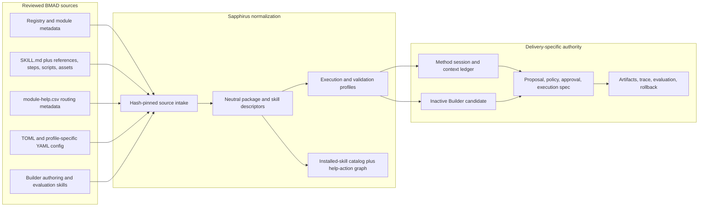
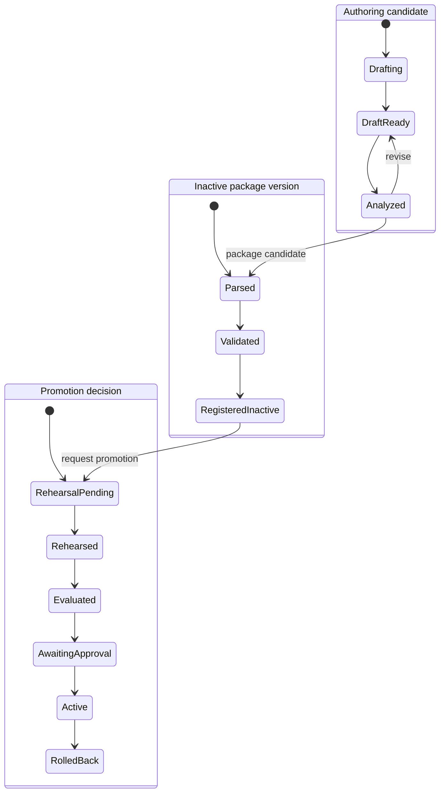

# BMAD Method and Builder Deep Comprehension Audit

## 0. Verdict and authority

BMAD Method and BMAD Builder remain the product foundation, but they must be integrated at their real semantic boundaries:

- **BMAD Method owns method semantics**: skill instructions, conversational workflows, roles, phase/help metadata, customization, working artifacts, resume conventions, and quality practices.
- **BMAD Builder owns authoring semantics**: conversational Build/Edit/Analyze loops, agent and workflow design patterns, module scaffolding, deterministic prepasses, quality lenses, and evaluation concepts.
- **Sapphirus owns operational authority**: identity, tenant/project scope, model routing, durable run state, Airlock, approvals, filesystem/process/network mediation, isolation, evidence, rollback, signing, activation, and publication.

This note is the current semantic authority for the reviewed snapshots. [[83 - BMAD Source Code Review - Method and Builder]] remains the preliminary archive/package/install review. Apply this note through [[13 - BMAD Kernel, Package Loader, and Help Advisor]], [[14 - Builder Studio and SkillOps]], [[39 - BMAD Package Format]], and [[69 - BMAD Validation Rules]]. Delivery authority remains defined by [[93 - Split Web and Windows Desktop Architecture Plans]] and [[99 - Dual-Delivery Contract and Conformance Specification]].

### Locked implementation correction

**Builder contracts and inactive draft authoring are foundational and early. Builder-supplied code execution, evaluation, installation rehearsal, publication, and activation remain gated behind the governed execution substrate.**

This resolves the previous false choice between treating Builder as foundational and postponing it until the end of the roadmap.

## 1. Review scope and evidence standard

| Source | Snapshot identity | Reviewed surface | Inventory facts |
|---|---|---|---|
| BMAD Method | `bmad-method` `6.10.0` | package metadata, registry, installer, manifests, config/customization scripts, help catalog, all source skill entrypoints, representative direct/step/rendered workflows, validators, tests, platform targets | 560 extracted files; 47 source `SKILL.md` entrypoints; 37 `customize.toml`; 50 `step-*.md`; 9 non-test Python scripts and 7 Python test files under `src/` |
| BMAD Builder | package `2.1.0`; module descriptor `1.0.0` | five live Builder skills, embedded setup-skill template, 48 reference files, templates, scanners, module/setup scripts, eval runner, plugin manifest, help catalog, samples, changelog, tests | 282 extracted files; 5 live skill roots plus 1 embedded `SKILL.md` template; 48 reference Markdown files; 39 Python files including 8 tests; 36 packaged assets |

Within Method, 6 customization files expose `[agent]`, 31 expose `[workflow]`, and 4 skills are deprecated compatibility shims. Method's bundled Claude marketplace advertises only 45 of the 47 source skills, omitting `bmad-dev-auto` and `bmad-forge-idea`, and its plugin entries declare `6.8.0` while the package declares `6.10.0`. Distribution metadata must therefore be checked independently rather than inferred from the source tree.

The archives have no Git metadata. Archive hashes and provenance limits remain recorded in [[83 - BMAD Source Code Review - Method and Builder]] and [[92 - Source Snapshot Verification and Adoption Ledger]]. Static inspection and selected dependency-free self-tests were performed; this is not a certification of an upstream release or its full Node/Python suite.

### Evidence precedence inside a snapshot

When source files disagree, use this order:

1. live `SKILL.md` entrypoint and the files it currently invokes;
2. invoked scripts and their executable tests;
3. current package/module manifests and help catalogs;
4. current changelog entries explaining breaking changes;
5. templates and samples that the live builder actually emits;
6. published/reference documentation;
7. contributor instructions or historical prose.

An upstream document is not authoritative merely because it is more detailed. This matters because Builder's current skills and changelog removed fixed build phases and Convert while older command/eval documentation still advertises them.

## 2. The correct foundation model



### What BMAD is not

- It is not one generic YAML or step-file workflow engine.
- `module-help.csv` is not an executable workflow definition.
- A `SKILL.md` body is not trusted system policy.
- A clean eval directory is not a security sandbox.
- A generated package is not active merely because it parses or scores well.
- Upstream memlog, sprint, or sanctum files are not Sapphirus' durable lifecycle ledger.

## 3. BMAD Method inventory and capability topology

### 3.1 Source skill inventory

| Area | Source skills |
|---|---|
| Core utilities | `bmad-advanced-elicitation`, `bmad-brainstorming`, `bmad-customize`, `bmad-editorial-review-prose`, `bmad-editorial-review-structure`, `bmad-forge-idea`, `bmad-help`, `bmad-index-docs`, `bmad-party-mode`, `bmad-review-adversarial-general`, `bmad-review-edge-case-hunter`, `bmad-review-verification-gap`, `bmad-shard-doc`, `bmad-spec` |
| Analysis | `bmad-agent-analyst`, `bmad-agent-tech-writer`, `bmad-document-project`, `bmad-prfaq`, `bmad-product-brief`, `bmad-domain-research`, `bmad-market-research`, `bmad-technical-research` |
| Planning | `bmad-agent-pm`, `bmad-agent-ux-designer`, `bmad-create-prd`, `bmad-edit-prd`, `bmad-prd`, `bmad-ux`, `bmad-validate-prd` |
| Solutioning | `bmad-agent-architect`, `bmad-architecture`, `bmad-check-implementation-readiness`, `bmad-create-architecture`, `bmad-create-epics-and-stories`, `bmad-generate-project-context` |
| Implementation | `bmad-agent-dev`, `bmad-checkpoint-preview`, `bmad-code-review`, `bmad-correct-course`, `bmad-create-story`, `bmad-dev-auto`, `bmad-dev-story`, `bmad-qa-generate-e2e-tests`, `bmad-quick-dev`, `bmad-retrospective`, `bmad-sprint-planning`, `bmad-sprint-status` |

The 47 skill directories are not 47 equal public workflow actions. The two Method help files contain 41 non-meta action rows across 35 distinct skill names: 12 Core actions and 29 BMM actions. Some source skills are agents, helpers, deprecated shims, or internal review utilities; some cataloged skills expose multiple actions. Therefore Sapphirus needs two related catalogs:

1. **Installed skill catalog** — every installed skill directory and its exact hash, entrypoint, resources, scripts, requirements, and provenance.
2. **Help action graph** — user-facing `(skill, action)` rows, menu codes, phase hints, sequencing hints, required flags, and artifact hints.

Neither catalog may be derived solely from the other.

### 3.2 Capability identity

The stable help capability key is not just `skill`:

```text
CapabilityKey = packageVersionId + moduleCode + skillName + normalizedAction
```

`action` may be empty for single-action skills. `preceded-by` and `followed-by` may use `skill-name` or `skill-name:action`; phases are module-defined strings; `output-location` may contain alternatives; `outputs` is free-form/fuzzy source metadata. Preserve the raw row and also store the normalized interpretation.

Menu codes are presentation aliases, not identifiers. Official source already reuses `SP` for Core Spec and BMM Sprint Planning, so uniqueness is scoped rather than global.

### 3.3 Method execution archetypes

| Archetype | Source examples | Runtime consequence |
|---|---|---|
| Direct conversational skill | `bmad-help`, editorial/review utilities | Load the entrypoint as model instructions, but mediate every tool/side-effect request. |
| Inline multi-stage workflow | `bmad-dev-story`, `bmad-create-story`, `bmad-sprint-planning` | Stages are embedded in prose/XML-like directives; there is no general upstream AST that safely executes them deterministically. |
| Just-in-time step workflow | research skills, `bmad-generate-project-context`, `bmad-code-review` | Enforce current-file-only loading and persist the current semantic checkpoint; file order alone is insufficient for branching. |
| Script-rendered workflow | `bmad-quick-dev` (`SKILL.md` → `render.py` → rendered Markdown) | Rendering is an explicit, versioned preparation operation. Archive inputs, resolved config/customization, script digest, and rendered output digest. |
| Consolidated skill plus compatibility shim | `bmad-prd` with create/edit/validate shims; `bmad-architecture` with create shim | Resolve deprecation and forwarded intent while preserving legacy customization identity. Do not expose shims as independent new capabilities. |
| Persona/role skill | analyst, PM, architect, developer, tech writer | Persona influences model behavior; it does not grant tools or authority. |
| Multi-agent/subagent workflow | `bmad-party-mode`, `bmad-dev-auto`, PRD reviewers/researchers | Host must support bounded synchronous fan-out/fan-in, provenance for every child result, and an explicit unavailable/failed path. |
| Headless or unattended variant | `bmad-dev-auto`, Builder headless flows, eval cases | Headless is a per-skill invocation contract, not a platform-wide boolean that removes approval or policy. |

The Method runner therefore needs a `SkillExecutionProfile`, not a fiction that all packages compile into the same workflow-step graph.

### 3.4 Required execution profile fields

```text
SkillExecutionProfile
  entrypointKind: direct | inline | step_jit | script_rendered | compatibility_shim
  invocationModes: interactive[] | headless[] | action[]
  requiredRuntimes: node/python/uv/host capability constraints
  resourcePolicy: files that may be loaded and when
  declaredToolIntents: file/read/write, process, web, subagent, browser, external handoff
  stateHints: memlog, artifact workspace, sprint status, story/spec, sanctum
  completionContract: artifacts/events/status evidence
  customizationProfile
  validationProfile
```

This descriptor is discovered and reviewed; it does not authorize a tool call.

## 4. Method installation, config, customization, and state

### 4.1 Method CLI installed shape

The Method installer creates and maintains a composite installed workspace, including:

- `_bmad/_config/manifest.yaml`;
- `_bmad/_config/skill-manifest.csv`;
- `_bmad/_config/files-manifest.csv`;
- `_bmad/_config/bmad-help.csv`;
- `_bmad/config.toml` and optional `config.user.toml`;
- `_bmad/custom/` overrides;
- `_bmad/<module>/config.yaml` compatibility files;
- shared `_bmad/scripts/` helpers;
- verbatim skill directories in the selected platform target such as `.claude/skills/` or `.agents/skills/`.

The installer later removes redundant skill copies from `_bmad/`, so `_bmad/` alone is not the installed skill catalog. The platform target plus upstream metadata is required. Upstream `skill-manifest.csv` and `files-manifest.csv` are generated while skills are still staged under `_bmad`, before host copying/cleanup and before the final help catalog/custom stubs. Their staged paths and hashes are useful declared evidence, but they are not a final observed installation inventory. Sapphirus must independently inventory and hash every final host-native skill/config location.

The built-in source `module.yaml` is an installer question/roster schema and is not necessarily copied into the final installed module folder. Some plugin installs can synthesize module/help metadata. Normalized records therefore need `metadataOrigin: source | synthesized | installed_projection` and may not require an installed `module.yaml` path.

Interactive upstream installation also permits selecting no host tool. The installer then performs no host copy but still cleans the staged skill directories, despite a summary implying an `_bmad`-only install. Treat this as an upstream regression fixture, not a supported Sapphirus install profile.

### 4.2 Three distinct configuration graphs

| Graph | Upstream shape | Use |
|---|---|---|
| Central Method config | `config.toml` → `config.user.toml` → `custom/config.toml` → `custom/config.user.toml` | Canonical team/user module settings for the Method CLI profile. |
| Per-skill customization | `<skill>/customize.toml` → `custom/<skill>.toml` → `custom/<skill>.user.toml` | Skill defaults, activation hooks, persistent facts, templates, output paths, reviewer/eval gates. |
| YAML compatibility/setup config | Method `_bmad/<module>/config.yaml`; Builder standalone root `_bmad/config.yaml` and `config.user.yaml` | Profile-specific compatibility or standalone setup behavior; never silently merged with central TOML. |

Central and per-skill TOML use structural merge:

- scalar: later value replaces earlier;
- table: recursive merge;
- arrays of tables: merge by `code` or `id` only if every combined item shares that key;
- all other arrays: append.

There is no general deletion operator. An empty override array does not clear a base array. Keyed defaults can only be replaced, often with a no-op entry. Sapphirus must preview the resolved value and warn when a user's apparent removal is impossible under upstream semantics.

The upstream resolver fails on an invalid required base file but warns and skips invalid optional layers. Sapphirus may apply a stricter activation policy, but it must record that as a platform gate rather than claim it is upstream merge behavior.

### 4.3 Customization is untrusted instruction data

Activation steps, persistent facts, reviewer directives, external source/handoff entries, and `on_complete` instructions can originate in package or user TOML. They may influence the model's task context, but they cannot change identity scope, Airlock policy, tool grants, network policy, secret handling, or execution containment. Every requested effect is reclassified by Sapphirus.

### 4.4 Working state is not the lifecycle ledger

Method skills use `.memlog.md`, draft artifacts, story/spec files, `sprint-status.yaml`, review files, and rendered workflow files to resume work. The shared `memlog.py` uses temp-file replacement and `fsync`, which protects a single write from partial-file corruption; it has no cross-process concurrency protocol and its mutable frontmatter means it is not literally append-only as a whole file.

Sapphirus should preserve these files as user-visible workflow state while separately recording:

- package/skill/config/customization hashes;
- current semantic checkpoint and invocation mode;
- loaded resource set and context digest;
- parent/child model calls and subagent provenance;
- proposals, approvals, execution specs, and tool results;
- produced artifact hashes and completion evidence.

### 4.5 Help Advisor confidence model

Upstream `bmad-help` uses catalog metadata plus fuzzy artifact discovery and may fall back to model knowledge. Sapphirus must be stricter:

| Evidence | Meaning | Confidence |
|---|---|---|
| Recorded successful Method run with artifact lineage | Capability completed under this package/config version | authoritative |
| Imported artifact explicitly bound by the user | Likely completed outside Sapphirus | user-asserted |
| File fuzzy-matches `output-location`/`outputs` | Possible completion | heuristic |
| Conversation statement only | User-reported | contextual |
| No catalog/config/artifact evidence | Unknown | never fabricate |

`required=true` is a Method guidance gate, not permission to run a side effect and not necessarily a hard platform lifecycle block. `_meta` documentation URLs require governed egress, provenance, caching/freshness metadata, and prompt-injection treatment.

## 5. BMAD Builder: actual authoring system

### 5.1 Live surface inventory

| Live skill | Actual intents/modes | Key output |
|---|---|---|
| `bmad-agent-builder` | Create/rebuild, Edit, Analyze; headless supported | Stateless, memory, or autonomous agent skill candidate plus reports/memlog. |
| `bmad-workflow-builder` | Build, Edit, Analyze; one goal-driven Process loop | Utility/simple/complex workflow skill candidate plus reports/memlog. |
| `bmad-module-builder` | Ideate, Create/scaffold, Validate; headless for create/validate | Multi-skill setup package or standalone self-registering package. |
| `bmad-eval-runner` | Baseline, Variant, Quality, Trigger | Case transcripts, artifacts, timing/token data, grading/trigger evidence. |
| `bmad-bmb-setup` | Fresh setup or update/migration | Standalone root YAML config/help layout and cleanup actions. |

The plugin manifest installs four skills and omits `bmad-eval-runner`; `module-help.csv` exposes nine actions across four skill names and also omits the eval runner. Yet Agent Builder and Workflow Builder invoke the eval runner at their eval beat. Capability resolution must detect this missing/hidden dependency and show `evaluation_unavailable`, not silently claim the Builder installation is complete.

### 5.2 Workflow Builder is a loop, not six fixed phases

Builder `2.0.0` replaced its fixed phase sequence with one conversational Process loop. The live flow:

1. understand the user's desired outcome and what good means;
2. ground the skill in real project expertise and examples;
3. harden scope and challenge whether a skill is warranted;
4. propose implied patterns or sibling intents;
5. capture decisions continuously in a memlog;
6. write the smallest outcome-driven skill first;
7. run it on real input and optionally evaluate it;
8. add structure/scripts/customization only when evidence earns them;
9. run deterministic lint/tests and optional parallel analysis lenses;
10. hand off an inactive candidate and its evidence.

Builder's current design is inline-first. Complex workflows carve descriptive standalone references only when needed. This directly conflicts with applying Method's mandatory numbered-step rules to every Builder output.

### 5.3 Agent Builder is three runtime products

| Agent type | Runtime state | Additional authority required |
|---|---|---|
| Stateless | Skill files only; no persistent sanctum | Normal skill/tool policy. |
| Memory | Mutable owner-specific sanctum with identity, creed, bond, memory, capabilities, first-breath/wake behavior | Owner-scoped storage, safe memory writes, conflict/version policy, privacy/retention, prompt-injection controls. |
| Autonomous | Memory model plus Pulse/scheduled wake, named tasks, frequency and quiet hours | Scheduler, budgets, cancellation, quiet hours, unattended approval policy, containment, incident loop protection. |

The sanctum contains `INDEX.md`, `PERSONA.md`, `CREED.md`, `BOND.md`, `MEMORY.md`, and `CAPABILITIES.md`; autonomous agents add `PULSE.md`. Generated guidance allows learned capability authoring and memory pruning. In Sapphirus, learned capabilities, scripts, memory mutation, and deletions become explicit proposals. Executable code may never be loaded from mutable memory as trusted code.

Memory/autonomous support is therefore deferred until its storage and scheduler contracts exist. Stateless Agent Builder and simple Workflow Builder are the safe early authoring slices.

### 5.4 Builder quality pipeline

Builder combines deterministic and model-based evidence:

- deterministic prepasses: frontmatter/path/script checks, token counts, template substitution, module/help structure, report rendering;
- parallel quality lenses: leanness, architecture, determinism, customization, enhancement, cohesion, plus a conditional sanctum lens;
- synthesized HTML/Markdown reports with traceable finding IDs;
- eval modes: baseline skill vs bare model, variant full vs stripped, rubric quality, and trigger precision/recall.

Model-authored grades are review evidence, not activation authority. Store the lens prompt/version, model/profile, inputs, raw finding objects, synthesis, grader output, timing, token counts, and artifacts separately so a polished report cannot hide missing or failed evidence.

## 6. Builder source drift and incompatibility ledger

| Finding | Source evidence | Sapphirus decision |
|---|---|---|
| Convert is removed, but still advertised | Builder `CHANGELOG.md` 1.8.0 says Convert was removed; live Workflow Builder has Build/Edit/Analyze only; stale help/docs still expose `convert-process`. | Do not claim upstream Convert. If Sapphirus builds a conversion adapter, label it platform-owned and test it independently. |
| Eval runner is a missing install dependency | Plugin manifest and help catalog omit it; build flows invoke it. | Capability snapshot records dependency as missing/hidden; bundle it only after explicit source/provenance review. |
| Eval documentation describes the retired runner | Published doc describes `evals.json`, overlays, `rsync`, and Docker; live runner uses `cases.json`-style input/rubric/state/files and explicitly has no Docker/overlay isolation. | Use live skill/reference/script/test contract. Reject stale overlay/Docker claims. |
| Official naming contradicts user naming | Method deterministic `SKILL-04` requires `^bmad-...$`; Builder reserves `bmad-` for official assets and tells users not to use it. | Profile-aware naming rules; never apply the official-source regex to user skills. |
| Workflow structure rules conflict | Method validator favors numbered `step-NN` files and 2–10 steps; Builder v2 is inline-first with descriptive references. | Separate `MethodOfficialSkillV6` and `BuilderOutcomeSkillV2` validation profiles. |
| Method and standalone Builder layouts differ | Method uses central TOML, `_config/bmad-help.csv`, platform skill targets, and per-module compatibility YAML; Builder setup writes root YAML/help and removes directories. | Explicit install profiles; mixed layouts block activation pending migration. |
| Builder headless memlog completion is inconsistent | Build flows call `set-complete` on shared `_bmad/scripts/memlog.py`; Method's shared current script exposes `init`, `append`, and `set`, while Builder Eval Runner carries another memlog with `set-complete`. | Define a Sapphirus working-state adapter; do not assume the command exists. Add a source regression fixture. |
| Contributor/reference prose is stale | Root `AGENTS.md`, fixed-phase command docs, old prompt paths, and old eval format disagree with live files. | Source Intake runs declared-path/command consistency checks and records drift findings. |
| Package and module versions differ | Builder package is `2.1.0`; module descriptor is `1.0.0`. | Persist source package, module schema/version, descriptor schema, and runtime compatibility separately. |
| Method distribution metadata drifts | Package is `6.10.0`; Claude plugin entries are `6.8.0` and omit two source skills. | Model distribution profile and source identity independently; diff advertised, installed, and source inventories. |
| Upstream manifests describe staging | Skill/file manifests are emitted before final host copy/cleanup and do not fully inventory final host-native locations. | Preserve declared entries, then create an observed final composite inventory with independent hashes. |
| Help menu codes collide globally | Core Spec and BMM Sprint Planning both use `SP`. | Scope menu aliases; identify capabilities by package/module/skill/action. |

## 7. Script and containment findings

Upstream scripts are useful references and fixtures, but several are unsafe as direct production boundaries:

| Boundary | Finding | Required platform hardening |
|---|---|---|
| Eval adapter | Adjacent candidate-controlled adapter JSON can select invocation argv and environment passthrough. | Only operator-installed, signed adapter definitions; candidate packages cannot define process commands or env passthrough. |
| Eval staging | Runner may symlink the source skill into the case workspace. | Immutable copy or read-only mount; never a writable link back to source/draft. |
| Fixture destinations | File destinations and case/run labels are not sufficient containment boundaries. | Normalize IDs; reject absolute paths, drive/UNC paths, `..`, links/reparse points, reserved names, collisions, and overlong paths; verify final path stays under staging root. |
| Module scaffold/setup | Module codes and output paths influence created paths and marketplace files. | Validate normalized IDs and write only to a disposable candidate tree or approved Workspace Service proposal. |
| Legacy cleanup | Cleanup recursively deletes computed module/core/`_config` targets after name-based skill checks; setup writes config/help separately and directs scripts to run in parallel. | Never execute against an authoritative Method workspace. Rehearse in disposable staging; Sapphirus performs transactional, preimage-bound activation/migration. |
| Memory initialization | Sanctum initialization is multi-write and treats directory existence as already initialized, so a partial run can become sticky. | Journaled initialization with completeness manifest, resume/repair state, atomic promotion, and rollback. |
| Quality/eval isolation | Reduced environment and clean cwd improve reproducibility but do not confine filesystem, process, network, keychain, or host tools. | Delivery-specific sandbox/worker containment plus Airlock; clean cwd is not a security claim. |
| Method external/custom install | Upstream installer may run `npm install` without `--ignore-scripts`; dependency failure can degrade to a warning. | Static intake never installs dependencies. Exact install rehearsal runs only in a network/policy-constrained ephemeral worker and failure blocks promotion. |
| Method module replacement/cache | Existing module directories can be removed before replacement finishes; mutable `~/.bmad/cache` content may be reused after update failure. | Content-address source, rehearse on disposable copies, publish atomically, and never let mutable home cache select package identity. |
| Method module/skill path identifiers | Registry/plugin/module codes flow into install paths and host targets. | Validate normalized identifiers and resolved containment before extraction, copy, cleanup, or host projection. |

No upstream setup, eval, scaffold, cleanup, wake, or candidate-provided script runs inside the Runtime API/model process.

## 8. Validation profiles

Four orthogonal dimensions must be stored rather than collapsed into a single package `type`:

- `BmadDistributionProfile`: source tree, Method Claude plugin, Method Web Bundle v1, Builder source/plugin, or Sapphirus package;
- `BmadInstallProfile`: Method CLI composite host-native install, standalone Builder YAML setup, or Sapphirus managed install;
- `SkillExecutionProfile`: direct/inline/JIT/rendered/shim plus required host capabilities;
- `ValidationProfile`: the rule set selected for the exact source/output shape.

Method's executable validator implements 13 deterministic rule IDs and leaves many path, workflow, sequence, and reference checks to inference. Its normal discovery finds directories that already contain `SKILL.md`, so it cannot prove a missing entrypoint in an arbitrary candidate tree. Step checks apply only to a literal `steps/` folder even though 27 of Method's 50 `step-*.md` files live elsewhere. Preserve upstream findings as evidence, then run Sapphirus schema/referential/security/install/final-layout gates.

| Profile | Applies to | Key distinctions |
|---|---|---|
| `MethodOfficialSkillV6` | Hash-pinned official Method source/installed skills | Official `bmad-` naming; Method path/JIT-step/template rules; compatibility shims allowed with explicit target. |
| `BuilderOutcomeSkillV2` | User-created workflow/utility skills | `bmad-` prefix forbidden/reserved; inline-first; descriptive references allowed; outcome, trigger, headless, script, customization, and evidence checks. |
| `BuilderAgentV2Stateless` | Stateless agent candidate | Agent metadata, persona/capability cohesion, tool references, no sanctum. |
| `BuilderAgentV2Memory` | Memory/autonomous candidate | Stateless checks plus sanctum schema, owner scope, memory/write policy, and optional Pulse profile. |
| `BuilderModuleV2` | Setup-skill or standalone module candidate | Module/help/roster/marketplace shape, setup plan, dependency and migration analysis. |
| `MethodCliInstalledV6` | Installed Method CLI workspace | Manifests, platform skill targets, central TOML, per-module compatibility config, assembled help catalog, file hashes. |
| `StandaloneBuilderSetupV2` | Builder standalone root YAML/help profile | Root YAML/help semantics; no implicit compatibility with Method CLI layout. |
| `SapphirusActivationV1` | Any candidate seeking activation | Ownership, provenance, license, signature, path safety, tool requirements, Airlock, rehearsal/evaluation evidence, rollback, delivery compatibility. |

Upstream rule IDs remain namespaced, for example `upstream.method.SKILL-04`; Sapphirus rules use stable platform IDs. The same textual rule ID must never mean two different naming policies.

## 9. Canonical authoring and activation lifecycles

Do not compress authoring, package registration, evaluation, and activation into one status field.



Suggested objects:

- `BuilderDraft` and immutable `BuilderDraftRevision`;
- `BuilderAnalysisRun` with deterministic and model-lens evidence;
- `SkillPackageCandidate` and immutable `SkillPackageVersion`;
- `PackageValidationRun`, `InstallRehearsalRun`, `InvocationRehearsalRun`, `EvaluationRun`;
- `PackageRegistration` (inactive catalog presence);
- `PackagePromotionRequest`, `PackageActivation`, and `PackageRollback`;
- `ToolAvailabilitySnapshot` before and after activation.

## 10. Governed end-to-end flows

### 10.1 Method run

```text
select installed skill/action
→ bind exact package + skill + config/customization hashes
→ prepare execution profile and bounded context
→ model advances the conversational method
→ every requested read/write/process/web/subagent action is classified
→ read-only allowed action or Proposal → Airlock → approval/spec
→ delivery-specific executor performs the effect
→ result is imported and the method resumes at a recorded checkpoint
→ artifacts + lineage + help-state projection + evidence
```

### 10.2 Builder draft to active skill

```text
authoring conversation
→ immutable draft revisions + memlog projection
→ deterministic lint and optional model analysis
→ inactive package candidate
→ profile-aware validation
→ catalog registration (still inactive)
→ isolated install/invocation rehearsal
→ baseline/variant/quality/trigger evidence as applicable
→ explicit promotion proposal and approval
→ signed activation with reversible tool-availability update
```

Editing an active skill never mutates its files in place. It forks a new candidate version through the same pipeline.

## 11. Adopt, adapt, defer, reject

| Decision | Source concept | Treatment |
|---|---|---|
| Adopt | `SKILL.md` plus progressive resources/scripts/assets; module/help contracts; exact config merge semantics; two module packaging shapes; Builder Process loop; deterministic prepasses and traceable lenses; four eval concepts | Preserve semantics and golden fixtures. |
| Adapt | Help completion inference; memlog/resume; headless modes; subagents; config hooks; eval adapters/runners; module setup; package validation; memory writes | Wrap in typed profiles, delivery authority, Airlock, evidence, containment, and concurrency rules. |
| Defer | Memory agent activation; autonomous/Pulse scheduling; marketplace publication; self-improving learned tools; broad arbitrary package support in the first slice | Contract now; implement only after prerequisite owner-scope/scheduler/promotion gates. |
| Reject | Generic one-DSL interpretation; direct candidate adapter argv/env; symlink-to-source eval staging; direct legacy cleanup on authoritative workspace; implicit Convert claim; generated/evaluated-equals-active; mutable memory as executable code | Do not implement. |

## 12. Delivery-model support

| Capability | `web_managed` | `windows_local` |
|---|---|---|
| Parse/inspect exact Method and Builder packages | Shared neutral schemas; cloud catalog authority | Shared neutral schemas; signed local cache |
| Run Method conversational skills | Runtime API/model + governed remote effects | Desktop host/model access + governed local effects |
| Create inactive Builder drafts | Supported early | Supported early in owner-selected local project |
| Deterministic static validation | API/worker depending on file/code needs | Rust/native parser or explicit local worker capability |
| Execute candidate scripts/evals | Fixed isolated remote worker only | Deferred until a declared containment profile exists, or explicit remote handoff |
| Publish/sign/promote | Cloud review/signing/catalog authority | Upload is explicit; local activation remains a local decision |
| Memory/autonomous agents | Deferred owner-scoped store/scheduler | Deferred local encrypted state/scheduler and DESK-01 containment decision |

## 13. Revised implementation plan

### P0 — Semantic source freeze

Deliver:

1. exact Method/Builder source intake records, hashes, license/trademark decision, and evidence precedence;
2. full skill/help/config/runtime inventory and drift register;
3. adopt/adapt/defer/reject decision per source surface;
4. no-promote rule while immutable upstream identity remains unresolved.

Exit evidence: reviewed inventory matches the extracted tree; every claimed command/path exists or is recorded as drift.

### P1 — Contracts and representative fixtures

Deliver:

1. neutral package/skill/help/config descriptors and raw-extension preservation;
2. explicit install, execution, and validation profiles;
3. separate installed-skill and help-action catalogs;
4. Method session/checkpoint/context ledger objects;
5. Builder draft/revision/analysis/package/promotion objects;
6. fixtures for direct, step-JIT, script-rendered, compatibility-shim, stateless-agent, simple-workflow, setup-skill, standalone-module, and invalid/mixed layouts.

Exit evidence: C# and Rust normalization/conformance tests yield the same canonical descriptors for shared fixtures.

### P2 — BMAD-native proof plus early inactive Builder authoring

Deliver in parallel:

- one sealed snapshot-derived Method capability through chat, artifact, help-state, and evidence;
- inactive Build/Edit/Analyze draft flow for one simple workflow and one stateless agent;
- deterministic lint/report preview with no candidate script execution;
- diff/revision history and explicit `not_active` UI state.

Exit evidence: a real source-derived Method run and Builder draft work without inventing a generic DSL or granting a generated skill tools.

### P3 — Real conversational authoring

After Model Gateway and context controls exist:

- enable real Builder Process conversations;
- add project-source grounding, memlog projection, draft revisioning, deterministic prepasses, and model quality lenses;
- keep outputs as inactive artifacts/diffs;
- detect missing eval runner/skills/runtime dependencies before offering gates.

Exit evidence: reproducible draft plus raw/synthesized analysis evidence; no activation path exists yet.

### P4 — Isolated evaluation and rehearsal

After governed execution exists:

- operator-owned platform adapters only;
- containment-safe copied staging and destination validation;
- baseline, variant, quality, and trigger evidence;
- install and invocation rehearsal in exact digest-pinned runtime;
- failure, timeout, cancellation, budget, and evidence-import behavior.

Exit evidence: malicious adapter/path/symlink/cleanup fixtures fail closed; clean-directory claims are never used as containment proof.

### P5 — Promotion and advanced types

- signing, inactive catalog registration, explicit promotion, reversible activation, revocation, and rollback;
- publication only after license/trademark/provenance policy;
- memory agents only after owner-scoped sanctum and safe knowledge-write contracts;
- autonomous agents only after scheduler, Pulse, quiet-hours, budgets, cancellation, and containment gates.

Exit evidence: `Draft → Validated → Rehearsed → Evaluated → Approved → Active` is reconstructable and rollback restores the prior tool-availability snapshot.

## 14. Required golden and negative fixtures

| Fixture | Proves |
|---|---|
| Official Method direct skill | Basic entrypoint/profile fidelity. |
| Method JIT step skill with branch | Current-step loading and checkpoint/resume. |
| `bmad-quick-dev` render fixture | Config/customization/render hashes and generated instruction lineage. |
| PRD/architecture compatibility shim | Intent forwarding and legacy override identity. |
| Help rows with multi-action refs and alternative output paths | Correct capability keys and non-authoritative completion hints. |
| User skill without `bmad-` prefix | Builder naming passes while official Method naming profile remains strict. |
| Same user skill under Method official profile | Profile mismatch fails clearly. |
| Stateless agent candidate | Early Agent Builder path without sanctum. |
| Memory/autonomous agent candidate | Parses but activation blocks on deferred prerequisites. |
| Builder install missing eval runner | Dependency is visible and eval gate cannot be claimed. |
| Stale Convert action | Marked unsupported/platform-owned, never routed to a missing file. |
| Malicious adapter argv/env and fixture destination | Candidate cannot acquire process/env/path authority. |
| Symlink/reparse/UNC/drive/path traversal package | Final resolved paths remain inside staging or fail closed. |
| Partial setup/sanctum initialization | Repair/rollback state is explicit; existence alone never means complete. |
| Mixed Method TOML and standalone Builder YAML layouts | Import blocks with migration guidance. |

## 15. Definition of done for the foundation

- [ ] Every active capability is bound to immutable package, skill, config, customization, and execution-profile identities.
- [ ] Installed skills and Help Advisor actions are modeled separately.
- [ ] No generic parser claims to deterministically execute arbitrary `SKILL.md` prose.
- [ ] Validation selects an explicit profile; official and user naming/structure rules cannot collide.
- [ ] Builder draft authoring is available early and unmistakably inactive.
- [ ] Convert is either absent or explicitly implemented as a Sapphirus-owned adapter.
- [ ] Missing Builder eval dependencies are visible before an eval is offered or required.
- [ ] Candidate-controlled files cannot select process argv, environment passthrough, staging escape paths, or cleanup targets.
- [ ] Working-state files remain usable without becoming authoritative lifecycle/evidence state.
- [ ] Memory/autonomous candidates cannot write executable tools or delete knowledge without governed proposals.
- [ ] Registration, rehearsal, evaluation, approval, activation, and rollback have separate durable evidence.
- [ ] Web and Windows implementations pass the shared descriptor/fixture conformance suite while keeping separate authority.

## 16. Local source evidence map

### Method

- Package/runtime floor: `_source_review/BMAD-METHOD-main/BMAD-METHOD-main/package.json`
- Official registry: `_source_review/BMAD-METHOD-main/BMAD-METHOD-main/bmad-modules.yaml`
- Installer and platform targets: `_source_review/BMAD-METHOD-main/BMAD-METHOD-main/tools/installer/`
- Core/BMM modules and help: `_source_review/BMAD-METHOD-main/BMAD-METHOD-main/src/core-skills/`, `src/bmm-skills/`
- Central config/customization/memlog: `_source_review/BMAD-METHOD-main/BMAD-METHOD-main/src/scripts/`
- Help behavior: `_source_review/BMAD-METHOD-main/BMAD-METHOD-main/src/core-skills/bmad-help/SKILL.md`
- Validation: `_source_review/BMAD-METHOD-main/BMAD-METHOD-main/tools/skill-validator.md`, `tools/validate-skills.js`, `tools/validate-file-refs.js`
- Script-rendered example: `_source_review/BMAD-METHOD-main/BMAD-METHOD-main/src/bmm-skills/4-implementation/bmad-quick-dev/`

### Builder

- Package, changelog, and plugin manifest: `_source_review/bmad-builder-main/bmad-builder-main/package.json`, `CHANGELOG.md`, `.claude-plugin/marketplace.json`
- Live skills and help: `_source_review/bmad-builder-main/bmad-builder-main/skills/`
- Agent creation/runtime templates: `skills/bmad-agent-builder/`
- Workflow Process and scanners: `skills/bmad-workflow-builder/`
- Module scaffolding/validation: `skills/bmad-module-builder/`
- Eval runner and current reference contract: `skills/bmad-eval-runner/`
- Standalone YAML/setup/cleanup profile: `skills/bmad-bmb-setup/`
- Stale public docs retained as drift evidence: `_source_review/bmad-builder-main/bmad-builder-main/docs/reference/`
