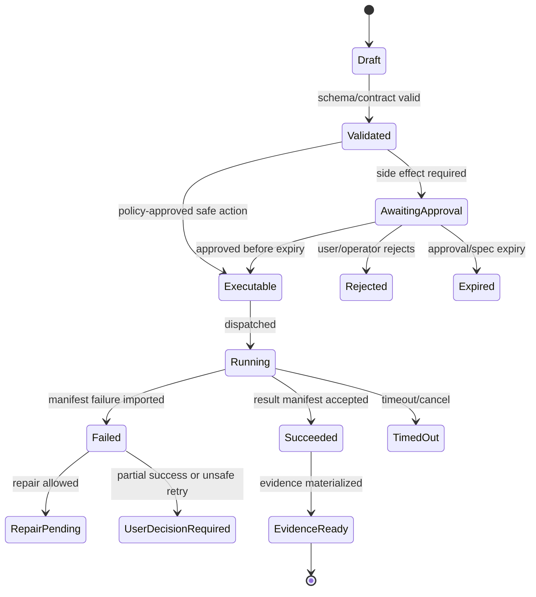

# Runtime API Control Plane

## V6.17 scope: web authority and desktop support plane

The Runtime API is authoritative for `web_managed` projects only. Its SQL lifecycle, Blob workspace, approval issuance, executor dispatch, and manifest import rules must not be reused as the ordinary `windows_local` authority.

For desktop it exposes only support-plane APIs: Entra-backed entitlement, Model Access, signed package catalog, optional consented sync/collaboration, redacted telemetry intake, and explicit remote-job handoff. It must never receive a local folder handle, enumerate a local path, mint a local-host execution spec, advance a desktop-local run, or directly apply a remote result. See [[98 - Azure Support Plane for Windows Desktop]].

## 1. Mission

Own authoritative lifecycle state, expose OpenAPI contracts, coordinate modules through internal ports, and prevent the modular monolith from becoming an unbounded god control plane.

## 2. Responsibilities

- Authenticate users and enforce project/RBAC scopes.
- Persist threads, messages, runs, proposals, exact execution candidates, approvals/spec consumption, durable work/completions, Evidence Ledger/outbox, and compact projections/indexes.
- Host internal ports for BMAD, Workspace, Airlock, Model Gateway, Execution Dispatcher, Trace Writer.
- Expose Runtime API, Package API, and Operator API surfaces.
- Validate/import `WebWorkerResultManifest` and atomically advance completion/lifecycle/evidence/outbox state.
- Emit ordered run events to stream channels.

## 3. Explicit Non-Responsibilities

- Do not bypass Airlock.
- Do not mutate authoritative state outside the Runtime API state transition path.
- Do not hide policy decisions inside UI-only code.
- Do not let model text become executable behavior without typed validation.
- Do not introduce a separate runtime semantics path unless an ADR approves it.

## 4. Interfaces and Ports

| Interface | Purpose |
|---|---|
| IRunStateStore | Authoritative state transitions and lifecycle reads. |
| IAirlockPolicy | Pure evaluation of side-effect proposals. |
| IWorkspaceService | Snapshots, checkouts, preimages, checkpoints, rollback. |
| IModelGateway | Structured model completions with telemetry. |
| IExecutionDispatcher | Creates ACA Job executions from ApprovedExecutionSpec. |
| ITraceWriter | Writes trace/evidence events and payload refs. |

## 5. State and Lifecycle

All state changes are command-style operations with optimistic concurrency. A transition must know current state, expected state, actor, correlation ID, policy context, and emitted events. SQL rows use rowversion or equivalent concurrency token.

## 6. Data Contracts

Core aggregates: Project, Workspace, Thread, Message, Run, Proposal, Approval, Execution, Artifact, TraceEvent, PolicyDecision, Checkpoint.

Each aggregate has:

- stable ID;
- tenant/project scope;
- lifecycle state;
- created/updated timestamps;
- actor or service principal;
- correlation/trace ID;
- schema version;
- retention class.

## 7. Primary Flow

```text
HTTP endpoint
→ auth/RBAC
→ command validator
→ application service
→ domain transition
→ state store
→ event outbox
→ stream publisher
```

## 8. Implementation Steps

- Create domain project with aggregates and states.
- Define OpenAPI endpoints before controllers.
- Implement service ports as interfaces in Application layer.
- Implement SQL adapters behind ports.
- Implement Blob payload-ref adapter.
- Implement event outbox for streaming/retry.
- Implement idempotency keys for side-effect submissions.
- Add contract and integration tests.

## 9. Failure Modes and Mitigations

| Failure | Mitigation |
|---|---|
| God-object growth | Module code depends on ports, not concrete services. |
| Worker directly writes SQL | Forbid worker DB credentials; workers upload manifests only. |
| Open decisions conflict | Use decision status file; block PRs that contradict LOCKED decisions. |
| State transition race | Use expected-state checks and concurrency tokens. |
| Long request work | Move indexing/execution/export into jobs. |

## 10. Acceptance Criteria

- No worker has SQL write credentials.
- All governed mutation/worker-dispatch endpoints require exact-candidate Airlock policy and `ApprovedExecutionSpec`; ordinary authenticated CRUD and offline Source Intake use separate authority classes.
- Every state transition emits a trace event.
- OpenAPI contract has tests.
- Runtime API can run with fake ModelGateway and fake Executor for deterministic tests.

---

## v2 Review Improvements

### 1. Module Boundary Map

| Module | Owns | Must Not Own |
|---|---|---|
| Threads | thread/message CRUD, conversation ordering | model calls, policy, execution |
| Runs | run state machine, run events | workspace file writes |
| Proposals | proposal records and hashes | model provider calls |
| Airlock | policy evaluation, approval spec minting | applying patches or running commands |
| Workspace | snapshots, checkouts, locks, checkpoints | model reasoning |
| Execution | dispatch, manifest import | worker implementation details |
| Evidence | evidence bundle materialization | raw secret access by default |
| BMAD | package parsing, help graph | general intent routing |
| ModelGateway | provider calls, structured output validation | platform Proposal creation |
| Operator | admin config, policy versions, budgets | normal project chat behavior |

### 2. Internal Port Contract Rules

- Ports are versioned at the interface boundary even when in-process.
- No module may directly access another module's tables except through its port.
- Cross-module operations use application services with explicit transactions.
- Domain events are append-only and ordered per run.
- Any module that performs a state transition must emit a run event.

### 3. Core Middleware

| Middleware | Purpose |
|---|---|
| Correlation ID | Creates/propagates trace ID and run correlation. |
| Auth/RBAC | Maps Entra identity/groups to project roles. |
| Request idempotency | Supports retry-safe POSTs for approvals and dispatch. |
| Schema validation | Validates request/response contracts. |
| Audit logging | Records admin/policy/approval/security events. |
| Redaction | Prevents secrets from entering logs/traces. |
| Rate/budget guard | Enforces model and execution quotas before expensive actions. |

### 4. State Transition Pattern

```csharp
await using var tx = await db.BeginTransactionAsync();
var run = await runStore.LoadForUpdate(runId);
run.Transition(expectedState, nextState, commandId);
await runEvents.Append(runId, sequence, eventType, payloadRef);
await outbox.Enqueue(integrationEvent);
await tx.CommitAsync();
```

No state transition should be performed outside a transaction that also appends the corresponding run event.

### 5. Runtime Error Model

| Code | Meaning |
|---|---|
| `RUN_STATE_CONFLICT` | Request expected a different run state. |
| `PROPOSAL_HASH_MISMATCH` | Client/proposal/spec hash mismatch. |
| `APPROVAL_EXPIRED` | Approval or reusable grant expired. |
| `POLICY_DENIED` | Airlock denied requested side effect. |
| `PREIMAGE_DRIFT` | Workspace changed since proposal. |
| `WORKER_RESULT_MANIFEST_INVALID` | Worker result failed schema/authentication/candidate/spec/audience/attempt/template/image/workspace/output/completion validation. |
| `TRACE_ACCESS_DENIED` | User lacks permission for raw trace view. |
| `BUDGET_EXCEEDED` | Model/execution budget would be exceeded. |

### 6. Runtime API Release Gate

- Contract tests cover all public endpoints.
- Module boundary tests prove forbidden direct table access is not used.
- Idempotency tests cover repeated approval and manifest import.
- State machine tests reject invalid transitions.
- Outbox/retry tests prove duplicate worker callbacks do not duplicate state transitions.


---


---

## Implementation-depth contract

This file is part of the V6 implementation library. It is written as an implementation guide, not as a strategy memo. Every component must be built against the same system-wide constraints:

1. **The first executable slice comes before breadth.** The first demonstrable product must prove authenticated chat, workspace context, typed plan output, proposal creation, Airlock validation, approval, isolated execution, validation, checkpoint, and evidence.
2. **The delivery-specific authority owns lifecycle state.** The web Runtime API imports remote-worker facts into SQL; the signed desktop Rust host imports local-executor facts into SQLite. Workers, child processes, renderers, models, sync services, and support APIs do not advance authoritative lifecycle state.
3. **Airlock creates the only side-effect token.** Workspace writes, command runs, exports, package imports, dependency restores, and policy-sensitive actions require an `ApprovedExecutionSpec` issued by Airlock.
4. **The model does not own proposals.** Model Gateway returns typed model outputs. Run Orchestrator creates normalized `Proposal` records. Airlock validates proposals.
5. **No raw shell by default.** Commands are represented as `argv[]` plus policy metadata; `sh -c`, shell expansion, broad environment access, and open network access are blocked unless explicitly operator-approved.
6. **Every side effect is reconstructable.** Diffs, preimages, spec hashes, policy hashes, approvals, job image digests, result manifests, logs, artifacts, and rollback metadata must be traceable.
7. **Each module has ports.** Even inside a modular monolith, use explicit interfaces and contracts to avoid creating a god control plane.


## 1. Component identity

| Field | Value |
|---|---|
| Component | `Runtime API Control Plane` |
| Area | `Control plane` |
| Primary implementation package | `src/Runtime.Api + Runtime.Application + Runtime.Domain + Runtime.Infrastructure` |
| Runtime/technology | `ASP.NET Core / C#` |
| First-slice priority | `core` |


## 2. Purpose

Provide the OpenAPI-first stateful control plane for projects, threads, runs, approvals, proposals, dispatch, imports, artifacts, evidence, and operator APIs.

The implementation must be narrow enough to fit the corrected first vertical slice, but designed so BMAD package execution, the existing presentation adapter, Builder Studio, SkillOps, replay, and operator controls can plug into the same contracts later.


## 3. Owns / does not own

### Owns
- Auth/RBAC enforcement
- OpenAPI endpoints
- Lifecycle state transitions
- Transaction boundaries
- Event publishing
- Internal port composition
- Idempotency and optimistic concurrency

### Does not own
- Raw worker execution
- Direct model reasoning
- Airlock policy internals
- UI presentation
- Direct code mutation without approved spec


## 4. Public/API surface and internal ports

### Required API/routes or callable operations
- `POST /api/projects`
- `POST /api/projects/{id}/sources`
- `POST /api/runs`
- `GET /api/runs/{id}`
- `POST /api/execution-candidates/{id}/submit-for-policy`
- `POST /api/executions/dispatch`
- `POST /api/executions/{id}/worker-result`
- `GET /api/evidence/{runId}`


### Internal contract rules

- Every boundary uses typed, schema-versioned values. C# uses `Runtime.Contracts` / `Runtime.Domain`, Rust uses generated contract types plus `desktop-domain`, and TypeScript uses generated web or desktop facade types; no generated DTO grants runtime authority.
- External payloads must be schema-versioned. Internal objects may evolve faster but must not leak into OpenAPI without a contract version.
- Every state mutation must be idempotent or protected by optimistic concurrency.
- Every side-effect operation must receive an `ApprovedExecutionSpec` or be provably read-only.
- Every error response must use the standard error envelope with `code`, `message`, `correlationId`, `retryable`, and optional `detailsRef`.


### Starter interface/type sketch

```csharp
public interface IComponentPort<TRequest, TResult>
{
    Task<TResult> ExecuteAsync(TRequest request, CancellationToken ct);
}

public sealed record OperationContext(
    Guid ProjectId,
    Guid RunId,
    string ActorUserId,
    string CorrelationId,
    string PolicyVersion,
    DateTimeOffset RequestedAt);
```


## 5. State model

### Component states
- `run_created`
- `context_requested`
- `planned`
- `proposal_created`
- `approval_required`
- `approved`
- `dispatched`
- `manifest_received`
- `state_imported`
- `finalized`


### Generic side-effect lifecycle





## 6. Persistence responsibilities

### SQL tables or domain records touched
- `Project`
- `WorkspaceSnapshot`
- `Run`
- `RunStep`
- `Proposal`
- `AirlockDecision`
- `Approval`
- `ExecutionJob`
- `WebWorkerResultManifest`
- `ValidationResult`
- `EvidenceBundle`
- `AuditEvent`

### Blob/object storage paths touched
- `manifests/{jobId}/result.json`
- `traces/{runId}/operational.json`
- `exports/{runId}/*`


### Persistence rules

- In `web_managed`, SQL stores lifecycle state, compact indexes, ownership metadata, and references. In `windows_local`, SQLite stores the corresponding local authority records.
- In `web_managed`, Blob stores large immutable payloads: snapshots, logs, diffs, manifests, artifacts, exports, packages, traces, and validation reports. In `windows_local`, encrypted local content-addressed storage holds authority-owned payloads; cloud upload is explicit and purpose-scoped.
- Any Blob payload referenced from SQL must include content hash, schema version, created timestamp, and retention class.
- No raw secrets, broad credentials, or unredacted prompt/context payloads are stored by default.
- Migrations must be forward-safe and testable against fixture data.


## 7. Detailed implementation steps


### Phase 0 — Contract and spike

1. Create or update the relevant ADR before implementation when the decision affects hosting, policy, security, data ownership, or external dependencies.

2. Define public DTOs and durable JSON schemas first. Do not let implementation classes silently become external contracts.

3. Create a minimal fixture that exercises the component without requiring the whole platform.

4. Add negative tests for the most dangerous bypass or failure case before adding the happy path.

5. Record assumptions in the component file and in the ADR index if they are not final.

6. For `Runtime API Control Plane`, implement only the smallest behavior that proves its contract in the first executable slice, then add extended BMAD/Builder/artifact behavior after gate approval.


### Phase 1 — Skeleton implementation

1. Create the package/module/folder with explicit ports/interfaces and dependency direction rules.

2. Add dependency injection registration with narrow interfaces rather than passing broad services everywhere.

3. Implement persistence only through repository/store abstractions that expose business operations, not raw table access.

4. Emit structured events for every important state transition even if the UI does not yet render them.

5. Add unit tests for object creation, invalid input, authorization/policy denial, and idempotency where relevant.

6. For `Runtime API Control Plane`, implement only the smallest behavior that proves its contract in the first executable slice, then add extended BMAD/Builder/artifact behavior after gate approval.


### Phase 2 — First vertical integration

1. Connect the component to the first executable slice only. Avoid adding full future scope before the vertical path works.

2. Use fake/stub adapters for expensive external systems until the contract is proven.

3. Make all side effects flow through Proposal → AirlockDecision → Approval/Grant → ApprovedExecutionSpec → Dispatch.

4. Persist large payloads to Blob and store only compact references in SQL.

5. Return UI-consumable run events so the Chat Workbench can render progress without polling raw tables.

6. For `Runtime API Control Plane`, implement only the smallest behavior that proves its contract in the first executable slice, then add extended BMAD/Builder/artifact behavior after gate approval.


### Phase 3 — Production hardening

1. Add telemetry attributes, correlation IDs, redaction, and audit events.

2. Add retry, timeout, cancellation, and stale-state handling.

3. Add migration scripts and seed data for dev/test.

4. Add operator visibility for status, errors, budget/policy impact, and cleanup status.

5. Document runbooks for the top failure modes.

6. For `Runtime API Control Plane`, implement only the smallest behavior that proves its contract in the first executable slice, then add extended BMAD/Builder/artifact behavior after gate approval.


### Phase 4 — Regression and release gate

1. Add contract tests against OpenAPI/JSON Schema.

2. Add replay fixtures or golden outputs where deterministic behavior is expected.

3. Add security tests for prompt injection, secret leakage, excessive agency, insecure output handling, and supply-chain drift where relevant.

4. Update release gate evidence with screenshots/log excerpts/manifests rather than informal claims.

5. Mark open risks and deferred v1.5/v2 items explicitly.

6. For `Runtime API Control Plane`, implement only the smallest behavior that proves its contract in the first executable slice, then add extended BMAD/Builder/artifact behavior after gate approval.


## 8. Validation and test plan

### Required tests
- no lifecycle transition outside orchestrator
- idempotency key replay test
- policy bypass integration test
- manifest import transaction rollback
- OpenAPI contract snapshot test


### Minimum test layers

| Layer | What to test | Required before merge |
|---|---|---|
| Unit | object validation, state transitions, parsing, policy predicates | yes |
| Contract | OpenAPI/JSON Schema compatibility, generated clients, worker manifests | yes for public/durable payloads |
| Integration | SQL + Blob references, dispatch/import, authz, Airlock boundary | yes for side-effect paths |
| E2E | chat → proposal → approval → execution → evidence | yes for first slice files |
| Replay/golden | BMAD package fixtures, presentation adapter, evidence bundle | yes before v1 beta |
| Security negative | prompt injection, secret leak, policy bypass, path traversal, raw shell | yes for all side-effect components |


## 9. Failure modes and recovery

| Failure | Detection | Required behavior | User/operator visibility |
|---|---|---|---|
| Invalid schema | contract validation | reject before persistence or dispatch | show actionable error with correlation ID |
| Stale proposal/preimage | hash mismatch | void proposal or require rebase/new proposal | show stale context warning |
| Approval expired | expiry check | reject dispatch | show re-approve option |
| Policy mismatch | policy hash mismatch | reject spec | operator audit event |
| Worker timeout | job monitor | mark job timed out; preserve partial logs | timeline event + retry option if safe |
| Manifest missing/invalid | manifest import validation | do not advance success state | incident/failure card |
| Partial success | checkpoint/validation state | enter `user_decision_required` or `kept_for_repair` | explicit decision card |
| Secret detected | scanner/redactor | redact and block if high confidence | security finding card/operator event |


## 10. Security and policy requirements

- Treat workspace files, package files, generated artifacts, model outputs, and logs as untrusted input.
- Never let untrusted content override system instructions, Airlock policy, command allowlists, network policy, or secret handling.
- Enforce project-level authorization on every read and write.
- Log security-relevant denials as audit events, but do not include raw secret values.
- Prefer fail-closed behavior when policy, identity, schema, or storage checks are ambiguous.
- Add negative tests for the most likely bypass path before writing happy-path code.


## 11. Observability

Minimum telemetry fields for this component:

- `correlation.id`
- `project.id`
- `run.id` when available
- `component.name`
- `operation.name`
- `operation.outcome`
- `policy.version` when applicable
- `spec.id` when applicable
- `job.id` when applicable
- `artifact.id` when applicable
- redaction counters, not raw secrets

Metrics to consider: request latency, state-transition count, policy denials, approval wait time, job duration, manifest import failures, schema validation failures, retry count, budget blocks, and evidence materialization time.


## 12. Acceptance criteria

- [ ] The component has a clear owner package and does not leak responsibilities into unrelated modules.
- [ ] Public routes/payloads are represented in OpenAPI/JSON Schema where applicable.
- [ ] Side-effect paths cannot execute without Airlock evaluation and `ApprovedExecutionSpec`.
- [ ] SQL lifecycle state is mutated only by the Runtime API/Application layer.
- [ ] Blob payloads have content hashes and schema versions.
- [ ] Tests include at least one negative/bypass case.
- [ ] Events and evidence are emitted for user-visible actions.
- [ ] The component is represented in the release gate matrix.
- [ ] The implementation does not introduce Cortex as a runtime namespace.
- [ ] Documentation includes deferred v1.5/v2 scope explicitly rather than silently omitting it.


## 13. Integration checklist

- [ ] Update `32 - Integration Contract Map.md` with any new caller/callee relationship.
- [ ] Update `25 - OpenAPI, Schemas, and Generated Clients.md` for public route or schema changes.
- [ ] Update `22 - Data Model - SQL and Blob.md`, `47 - Database DDL Starter.md`, or `48 - Blob Storage Layout.md` for persistence changes.
- [ ] Update `27 - Testing, Validation, and Replay.md` for new fixtures or replay needs.
- [ ] Update `33 - Release Gates and Acceptance Matrix.md` if the change affects release readiness.
- [ ] Add or update ADR in `31 - Architecture Decision Records.md` if the change alters architecture, hosting, policy, or security posture.


## internal port set

The Runtime API may be deployed as one ASP.NET Core process, but it must behave internally like a set of ports. Minimum ports:

```csharp
public interface IRunStateStore { Task<Run> LoadAsync(Guid runId, CancellationToken ct); Task TransitionAsync(Guid runId, RunTransition transition, CancellationToken ct); }
public interface IProposalStore { Task<Proposal> CreateAsync(NormalizedProposal proposal, CancellationToken ct); Task<Proposal> LoadAsync(Guid proposalId, CancellationToken ct); }
public interface IAirlockPolicy { Task<AirlockDecision> EvaluateAsync(NormalizedProposal proposal, PolicyContext context, CancellationToken ct); }
public interface IExecutionDispatcher { Task<ExecutionJob> DispatchAsync(ApprovedExecutionSpec spec, CancellationToken ct); }
public interface IWorkspaceSnapshotStore { Task<WorkspaceSnapshot> CreateSnapshotAsync(SourceRef source, CancellationToken ct); }
public interface ITraceWriter { Task AppendAsync(RunEvent runEvent, CancellationToken ct); }
public interface IModelGateway { Task<TypedModelOutput> CompleteAsync(ModelRequest request, CancellationToken ct); }
```

### Transaction rule

Only application services in `Runtime.Application` may call state-transition methods. Infrastructure repositories may persist data but must not decide state transitions. Workers may only submit manifests; the API imports them.


---

## Historical Revision Notes (V3 -> V4 Hardening Pass)
### V4 audit finding applied to this file
The v3 library was detailed, but several files still behaved like expanded planning notes rather than implementation handbooks. This pass adds enforceable implementation details: exact build sequence, explicit boundaries, input/output contracts, database/blob ownership, event names, failure states, tests, and release gates.

## System invariants this component must obey

1. Web delivery has two gates: a **sealed test simulation** proves BMAD/context → proposal/candidate → policy/exact approval/spec → fake result → checkpoint/Evidence Ledger; internal alpha later proves the identical contracts through a remotely built fixed ACA Job for real isolation.
2. No worker image receives Azure SQL write credentials. Workers produce signed/hashed append-only manifests in Blob; the Runtime API imports them and advances SQL lifecycle state.
3. No file write, command run, dependency restore, package import, artifact export, checkpoint mutation, or rollback can execute without an `ApprovedExecutionSpec` minted by Airlock.
4. The Model Gateway returns typed model outputs only. The Run Orchestrator creates platform `Proposal` records. Airlock validates proposals and creates approved specs.
5. Commands are `argv[]` specs, not raw shell strings. Shell execution is a separate high-risk command class.
6. Every state transition emits a run event and trace event with correlation ID, actor/service principal, schema version, and payload hash or payload reference.
7. Every persisted object carries schema version, retention class, project scope, created/updated timestamps, and hash/provenance where relevant.
8. Any component that reads workspace content treats it as untrusted user-controlled input and cannot allow it to override system policy, command allowlists, approval requirements, or secrets handling.


## Component build card

| Field | Value |
|---|---|
| Component | `Runtime API Control Plane` |
| Primary package/path | `src/Runtime.Api + src/Runtime.Application + src/Runtime.Domain + src/Runtime.Infrastructure` |
| Current implementation status | `v6-validated` |
| Required for first vertical slice | `yes` |

## Validated API/port touchpoints

- `POST /api/projects`
- `POST /api/projects/{projectId}/threads`
- `POST /api/runs`
- `POST /api/proposals`
- `POST /api/approvals/{approvalId}/decisions`
- `POST /api/executions/{executionId}/worker-result`

## Validated domain events to implement or consume

- `run.created`
- `run.state.changed`
- `proposal.created`
- `execution_spec_candidate.created`
- `policy.evaluation.completed`
- `approval.approved` / `approval.rejected`
- `approved_spec.issued`
- `work_completion.recorded`
- `execution.manifest.imported`
- authoritative `EvidenceLedgerEvent` append plus outbox; `trace.event.appended` is a diagnostic projection only

## Validated SQL ownership / indexes

- `projects`
- `project_memberships`
- `threads`
- `messages`
- `runs`
- `proposals`
- `execution_spec_candidates`
- `policy_decisions`
- `approvals`
- `approved_execution_specs`
- `executions`
- `work_items`
- `work_attempts`
- `work_leases`
- `work_completions`
- `evidence_ledger_events`
- `outbox_messages`
- `trace_events` (projection only)

Implementation notes:

- Tables listed here are owned by their module or exposed through its port; other modules must not perform direct ad-hoc writes.
- Mutable lifecycle tables need optimistic concurrency tokens.
- All records need `project_id`, `schema_version`, `created_at`, `updated_at`, and retention classification where applicable.

## Validated Blob payload layout

- `payloads/{runId}/model-output/*.json`
- `work/{ownerScopeId}/{workItemId}/{attemptId}/result/worker-result.json`
- `evidence/{ownerScopeId}/{streamId}/bundles/{bundleId}/*`
- `traces/{ownerScopeId}/{runId}/*` (diagnostic only)

Implementation notes:

- Blob payloads are content-addressed or hash-checked before import.
- SQL stores compact payload references, not bulky logs/prompts/artifacts.
- Retention class and redaction level must be explicit for every payload family.

## Validated step-by-step build procedure

1. Create domain state-machine package before controllers.
2. Define OpenAPI and generated clients before implementing route handlers.
3. Implement port interfaces: IRunStateStore, IAirlockPolicy, IWorkspaceSnapshotStore, IExecutionDispatcher, IModelGateway, ITraceWriter.
4. Block direct module-to-module table access; modules call ports/application services.
5. Implement event outbox and stream publisher with per-run sequence ordering.
6. Implement result import as an atomic, idempotent command keyed by work item + attempt + audience + completion nonce + manifest hash; persist completion/lifecycle/Evidence Ledger/outbox together and never re-execute on redelivery.
7. Add integration test proving workers cannot advance SQL state directly.

## Validated edge cases that must be tested

| Edge case | Expected behavior |
|---|---|
| Duplicate API request with same idempotency key | Returns original result; no duplicate state transition or worker dispatch. |
| Stale proposal after newer checkpoint | Proposal is voided or requires rebase; approval is blocked. |
| Expired approval/spec | Side-effect endpoint rejects request; UI asks for refresh. |
| Unknown schema version | Import/read path rejects or routes to migration handler. |
| Blob payload hash mismatch | Runtime refuses import and creates security/audit finding. |
| User lacks project role | API returns access denied; no object existence leakage. |
| Workspace contains prompt injection in docs/code | Treated as untrusted content; cannot change system policy or tool permissions. |
| Worker crashes after writing partial logs | Execution becomes failed/unknown with partial log refs; retry uses same spec rules. |

## Validated release gate for this component

- Unit tests cover all domain transitions owned by this component.
- Contract tests cover all listed API touchpoints or port methods.
- Integration tests prove SQL/Blob responsibility boundaries.
- Security tests cover unauthorized access and malformed payloads.
- Replay fixture includes at least one success path and one failure path relevant to this component.
- Observability emits trace/span/log attributes with the shared correlation ID.
- Documentation examples compile or validate against JSON Schema/OpenAPI where relevant.


## V6 API runtime baseline

The Runtime API implementation baseline is ASP.NET Core on .NET 10 LTS.

Rules:

1. New API projects must target .NET 10 unless an ADR records a compatibility blocker.
2. OpenAPI 3.1.2 with JSON Schema 2020-12 is the single v1 contract target; generated clients must compile in CI. OpenAPI 3.2 remains a .NET 11/tooling migration gate.
3. Internal module boundaries must be represented by interfaces, even when implementation is in-process.
4. EF/database writes that advance lifecycle state must occur only through Runtime API state services.
5. Workers do not receive SQL lifecycle credentials.
6. Every state-changing endpoint must require idempotency keys and authorization checks.
7. Every governed side-effect dispatch endpoint accepts only `ApprovedExecutionSpec` references created by Airlock; ordinary authenticated CRUD follows owner-scope/authz/idempotency/domain-transaction rules without inventing an execution token.

## Consolidated Source-Review API Boundary Additions

Source: [[89 - Consolidated AI Workspace Source Review and Architecture Improvements]].

The Runtime API must expose or own these boundary contracts before broad feature expansion:

| Boundary | Requirement |
|---|---|
| Principal resolution | Human, token, internal loopback, worker, scheduler, and connector principals resolve to typed context before authorization. |
| Owner scope | Every route that touches sessions, uploads, documents, memory, tasks, providers, jobs, packages, or artifacts verifies `OwnerScope`. |
| Tool registry boundary | API reads computed `ToolAvailabilitySnapshot`; route handlers do not assemble prompt tool schemas ad hoc. |
| Package activation | Package writes flow through proposal, validation, scan, rehearsal, approval, activation, and capability snapshot. |
| Outbound network calls | Runtime calls a network adapter that applies `OutboundUrlPolicy`; feature routes do not implement private-network checks independently. |
| Worker dispatch | Dispatch accepts only approved specs and writes an execution record before starting external compute. |
| Result import | Import validates all candidate/spec/policy/approval/audience/attempt/template/image/workspace/mutable-input/output/completion bindings and is idempotent; worker output never advances SQL state directly. |
