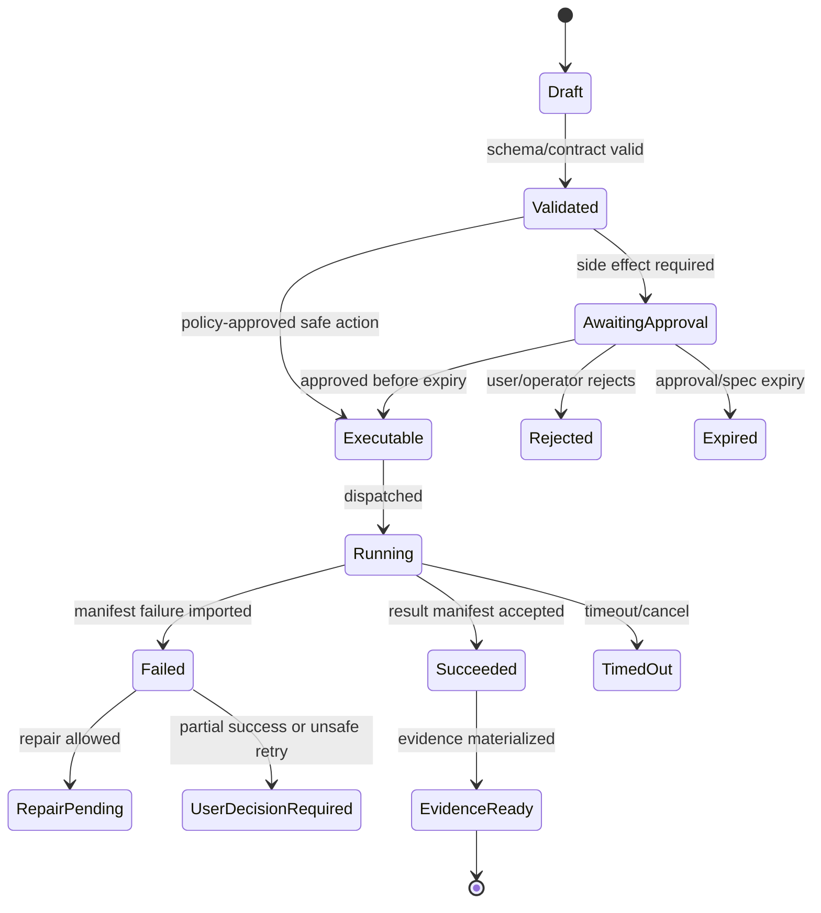

# Run Orchestrator and Agent Kernel

## V6.17 runtime split

This note defines shared orchestration semantics, not one shared process. The .NET orchestrator owns `web_managed` lifecycle and the Rust local runtime owns `windows_local` lifecycle. Both interpret the same BMAD fixtures and canonical proposal/state contracts, but each stores transitions and invokes Airlock inside its own authority boundary.

No cloud orchestrator command may mutate a local folder. No desktop orchestrator may import an ACA result into local state as success. An explicit remote job creates a linked `web_managed` record; its output returns as an untrusted local proposal. Detached/background runs must preserve their original `deliveryModel` and authority reference.

## 1. Mission

Route user intent, gather BMAD/context, call the Model Gateway for typed outputs, construct platform proposals and complete immutable execution candidates, coordinate exact-candidate Airlock policy, and drive repair/finalization loops without letting the model own actions or durable state.

## 2. Responsibilities

- Classify user intent into Ask/Plan/Patch/Apply/Validate/Repair/Review/Finalize/Artifact/BMAD/Builder.
- Request context from Workspace Intelligence and BMAD Kernel.
- Call Model Gateway using schema-bound call types.
- Convert typed model outputs into platform Proposal records.
- Build `ExecutionSpecCandidate` from normalized proposal plus exact lane/audience/template, inputs/mutable hashes, outputs, command/effect, network/environment, policy context, limits, and expiry; send the candidate to Airlock.
- Manage repair loop caps, budgets, and user escalation.
- Summarize results into evidence.

## 3. Explicit Non-Responsibilities

- Do not bypass Airlock.
- Do not mutate authoritative state outside the Runtime API state transition path.
- Do not hide policy decisions inside UI-only code.
- Do not let model text become executable behavior without typed validation.
- Do not introduce a separate runtime semantics path unless an ADR approves it.

## 4. Interfaces and Ports

| Interface | Purpose |
|---|---|
| IIntentClassifier | Intent classification via rules + model fallback. |
| IContextPackBuilder | Build scoped context packs. |
| IBmadKernel | BMAD state/capability information. |
| IModelGateway | Typed completions only. |
| IProposalFactory | Convert model output to platform proposals. |
| IRunStateStore | Persist run transitions. |
| IAirlockPolicy | Evaluate exact `ExecutionSpecCandidate`; approval decision returns to Airlock for spec minting. |

## 5. State and Lifecycle

Run states: `created`, `context_building`, `planning`, `proposal_ready`, `approval_required`, `approved`, `dispatching`, `running`, `validation_failed`, `repairing`, `completed`, `cancelled`, `failed`, `rollback_available`.

Proposal states: `draft`, `policy_evaluating`, `approval_required`, `approved`, `rejected`, `voided_stale_context`, `executed`, `expired`.

## 6. Data Contracts

Typed model outputs are not platform actions. Example:

```json
{
  "call_type": "propose_patch",
  "schema_version": "model.patch_output.v1",
  "operations": [{"path":"src/App.tsx","type":"replace_range","start":12,"end":15,"content":"..."}],
  "rationale": "...",
  "tests": [{"argv":["pnpm","test"],"cwd":".","network_mode":"none"}]
}
```

The Orchestrator converts this into `Proposal(kind=file_patch)` and `Proposal(kind=command_run)`.

## 7. Primary Flow

```text
Message received
→ classify intent
→ build/read context
→ typed model call
→ proposal construction
→ Airlock evaluation
→ approval card
→ execution dispatch
→ manifest import
→ repair/finalize
```

## 8. Implementation Steps

- Implement deterministic rule classifier for obvious modes.
- Implement model-backed classifier only as fallback.
- Implement proposal factories for patch, command, artifact export, package import.
- Implement repair loop manager with attempt/budget caps.
- Implement stale context invalidation when checkpoint changes.
- Implement final evidence summary generation.
- Add replay fixtures for successful, failed, and policy-blocked runs.

## 9. Failure Modes and Mitigations

| Failure | Mitigation |
|---|---|
| Model returns invalid schema | Retry with validation error once; then fail typed output. |
| Agent tries to bypass policy | No execution port is available to agent; only proposal path. |
| Repeated repair failures | Escalate with evidence after cap. |
| Stale context | Void proposal if newer checkpoint invalidates context pack. |
| Ambiguous user request | Ask only when necessary; otherwise produce safe plan-first output. |

## 10. Acceptance Criteria

- Model Gateway output is stored separately from Proposal.
- All governed mutations produce a complete candidate and pass Airlock before any required exact-hash approval; ordinary CRUD and offline Source Intake do not masquerade as execution proposals.
- Repair loop distinguishes infra/dependency/test/policy/model failures.
- Run can be replayed from stored events and payload refs.
- User sees exact reason when system stops for clarification or escalation.


## 11. Repair Loop Policy

| Failure Class | Default Next Action |
|---|---|
| `test_failure` | Analyze logs and propose minimal repair patch. |
| `flake_suspected` | Rerun once if command grant allows; otherwise ask approval. |
| `infra_failure` | Retry job once; do not ask model for code repair. |
| `dependency_restore_failure` | Ask approval for dependency/network policy change. |
| `policy_block` | Explain blocked rule; no repair patch. |
| `patch_generation_error` | Request revised patch proposal. |
| `timeout` | Suggest narrower test or increased limit requiring approval. |
| `output_limit_exceeded` | Summarize available logs and request targeted rerun. |

## OpenClaw-Informed Orchestration Improvements

OpenClaw's source review in [[84 - OpenClaw Source Review - Comparable Runtime Patterns]] adds useful guardrails for future Sapphirus orchestration:

- Carry prepared facts forward instead of rediscovering them on every request: project id, run id, agent/profile id, package id, capability id, tool family, approval state, sandbox/isolation mode, and artifact/output class.
- Treat generated BMAD skills, Builder outputs, and package edits as proposals first. A Builder-generated `SKILL.md` or package file should enter a review/validation queue before it can update active package state.
- Support extension UI descriptors later, but keep them typed: `pluginId`, `surface`, `label`, `description`, required scopes, and schema-shaped payload. Do not hard-code extension-specific UI behavior in the Orchestrator.
- Avoid default manager-of-managers agent hierarchies. Use explicit capability routing, scoped sub-runs, and evidence-linked child runs only when a real workflow needs them.
- Separate decision surfaces: intent routing chooses what the user is trying to do; Airlock chooses whether the side effect is allowed; Execution chooses where it runs; package/install policy chooses whether imported code is trusted enough to register.

---

## v2 Review Improvements

### 1. Orchestrator Responsibility Split

```text
Intent routing      → Orchestrator
BMAD semantics      → BMAD Kernel
Context selection   → Workspace Intelligence
Model calls         → Model Gateway
Proposal creation   → Orchestrator
Policy              → Airlock
Execution           → Execution Dispatcher + workers
State transitions   → Runtime API run services
```

### 2. Intent Routing Matrix

| Intent | Route | Output |
|---|---|---|
| `ask.explain` | read-only answer | Explanation card, no proposal. |
| `coding.plan` | context + model plan | Plan card. |
| `coding.patch` | context + patch proposal | Proposal + diff card. |
| `coding.validate` | command proposal | Approval card for validation command. |
| `coding.repair` | failure analysis + minimal patch | Repair proposal. |
| `bmad.help` | BMAD Help Advisor | Next-action card. |
| `bmad.run_workflow` | BMAD Kernel workflow stage | Method run card. |
| `artifact.presentation` | Presentation adapter | Artifact workflow cards. |
| `builder.validate_package` | Builder validation worker | Validation report. |

### 3. Proposal Construction Pipeline

```text
TypedModelOutput
→ schema validation
→ safety normalization
→ path canonicalization
→ proposal hash computation
→ risk classification
→ side-effect classification
→ persistence
→ Airlock evaluation request
```

Model output is not trusted merely because it validates against a schema. The orchestrator must normalize and classify it before Airlock sees it.

### 4. Risk Labels

| Risk | Examples | Required UI Treatment |
|---|---|---|
| `low` | single test/doc copy change | Normal approval. |
| `medium` | source code change, config change | Diff-focused approval. |
| `high` | dependency change, auth/security code, workflow policy | Extra confirmation and reviewer note. |
| `blocked` | secret path, destructive command, external publish | Cannot approve under v1 policy. |

### 5. Repair Loop Algorithm

1. Import and validate `WebWorkerResultManifest` through Runtime, atomically recording completion/lifecycle/Evidence Ledger/outbox.
2. Classify failure type.
3. If infrastructure/policy/dependency failure, do not generate source patch automatically.
4. If deterministic test/lint/type failure, request minimal repair context.
5. Ask model for failure analysis and minimal repair patch.
6. Create new proposal linked to failed execution.
7. Require user approval.
8. Cap loop by attempt count, token budget, and changed-file budget.
9. Escalate with evidence if repeated failure.

### 6. Repair Loop Stop Conditions

| Stop Condition | Action |
|---|---|
| Same test fails after two repair attempts. | Ask user with evidence summary. |
| New unrelated file area is proposed. | Block and request plan revision. |
| Patch size exceeds policy. | Require user to split work. |
| Failure classified as infra. | Route to operator/developer, no source repair. |
| Budget exceeded. | Pause run with cost/budget explanation. |

### 7. Orchestrator Tests

- Prompt-injection in workspace cannot alter policy route.
- BMAD workflow intent does not route through coding patch path unless explicitly requested.
- Model Gateway failure produces resumable run state.
- Invalid model output creates `model_output_invalid`, not partial proposal.
- Repair loop links every repair proposal to the failed execution that motivated it.


---


---

## Implementation-depth contract

This file is part of the V6 implementation library. It is written as an implementation guide, not as a strategy memo. Every component must be built against the same system-wide constraints:

1. **The first executable slice comes before breadth.** The first demonstrable product must prove authenticated chat, workspace context, typed plan output, proposal creation, Airlock validation, approval, isolated execution, validation, checkpoint, and evidence.
2. **The delivery-specific authority owns lifecycle state.** The web Runtime API imports remote-worker facts into SQL; the signed desktop Rust host imports local-executor facts into SQLite. Workers, child processes, renderers, models, sync services, and support APIs do not advance authoritative lifecycle state.
3. **Airlock creates the only side-effect token.** Workspace writes, command runs, exports, package imports, dependency restores, and policy-sensitive actions require an `ApprovedExecutionSpec` issued by Airlock.
4. **The model does not own proposals.** Model Gateway returns typed model outputs. Run Orchestrator creates normalized `Proposal` records. Airlock validates proposals.
5. **No raw shell by default.** Commands are represented as `argv[]` plus policy metadata; `sh -c`, shell expansion, broad environment access, and open network access are blocked unless explicitly operator-approved.
6. **Every side effect is reconstructable.** Diffs, preimages, spec hashes, policy hashes, approvals, job image digests, result manifests, logs, artifacts, and rollback metadata must be traceable.
7. **Each module has ports.** Even inside a modular monolith, use explicit interfaces and contracts to avoid creating a god control plane.


## 1. Component identity

| Field | Value |
|---|---|
| Component | `Run Orchestrator and Agent Kernel` |
| Area | `Application orchestration` |
| Primary implementation package | `src/Runtime.Application/Orchestration` |
| Runtime/technology | `C# domain services` |
| First-slice priority | `core` |


## 2. Purpose

Route user intent, request context, call Model Gateway, convert typed model outputs into normalized proposals, drive repair loops, and advance run state.

The implementation must be narrow enough to fit the corrected first vertical slice, but designed so BMAD package execution, the existing presentation adapter, Builder Studio, SkillOps, replay, and operator controls can plug into the same contracts later.


## 3. Owns / does not own

### Owns
- Intent routing
- Run state machine
- Proposal construction
- Context request orchestration
- Repair-loop policy
- Final evidence assembly trigger

### Does not own
- Model provider calls beyond gateway port
- Airlock decision rules
- Worker lifecycle mutation from worker
- BMAD package parsing internals


## 4. Public/API surface and internal ports

### Required API/routes or callable operations
- `POST /api/runs`
- `POST /api/runs/{id}/continue`
- `POST /api/runs/{id}/repair`
- `POST /api/runs/{id}/finalize`


### Internal contract rules

- Every boundary uses typed, schema-versioned values. C# uses `Runtime.Contracts` / `Runtime.Domain`, Rust uses generated contract types plus `desktop-domain`, and TypeScript uses generated web or desktop facade types; no generated DTO grants runtime authority.
- External payloads must be schema-versioned. Internal objects may evolve faster but must not leak into OpenAPI without a contract version.
- Every state mutation must be idempotent or protected by optimistic concurrency.
- Every side-effect operation must receive an `ApprovedExecutionSpec` or be provably read-only.
- Every error response must use the standard error envelope with `code`, `message`, `correlationId`, `retryable`, and optional `detailsRef`.


### Starter interface/type sketch

```csharp
public interface IComponentPort<TRequest, TResult>
{
    Task<TResult> ExecuteAsync(TRequest request, CancellationToken ct);
}

public sealed record OperationContext(
    Guid ProjectId,
    Guid RunId,
    string ActorUserId,
    string CorrelationId,
    string PolicyVersion,
    DateTimeOffset RequestedAt);
```


## 5. State model

### Component states
- `classifying_intent`
- `building_context`
- `calling_model`
- `normalizing_output`
- `creating_proposal`
- `awaiting_decision`
- `dispatching_job`
- `analyzing_failure`
- `finalizing`


### Generic side-effect lifecycle





## 6. Persistence responsibilities

### SQL tables or domain records touched
- `Run`
- `RunStep`
- `IntentClassification`
- `ContextPackRef`
- `ModelCall`
- `TypedModelOutput`
- `Proposal`
- `RepairAttempt`
- `RunDecision`

### Blob/object storage paths touched
- `context-packs/{runId}/{packId}.json`
- `model-outputs/{runId}/{callId}.redacted.json`
- `evidence/{runId}/run-summary.md`


### Persistence rules

- In `web_managed`, SQL stores lifecycle state, compact indexes, ownership metadata, and references. In `windows_local`, SQLite stores the corresponding local authority records.
- In `web_managed`, Blob stores large immutable payloads: snapshots, logs, diffs, manifests, artifacts, exports, packages, traces, and validation reports. In `windows_local`, encrypted local content-addressed storage holds authority-owned payloads; cloud upload is explicit and purpose-scoped.
- Any Blob payload referenced from SQL must include content hash, schema version, created timestamp, and retention class.
- No raw secrets, broad credentials, or unredacted prompt/context payloads are stored by default.
- Migrations must be forward-safe and testable against fixture data.


## 7. Detailed implementation steps


### Phase 0 — Contract and spike

1. Create or update the relevant ADR before implementation when the decision affects hosting, policy, security, data ownership, or external dependencies.

2. Define public DTOs and durable JSON schemas first. Do not let implementation classes silently become external contracts.

3. Create a minimal fixture that exercises the component without requiring the whole platform.

4. Add negative tests for the most dangerous bypass or failure case before adding the happy path.

5. Record assumptions in the component file and in the ADR index if they are not final.

6. For `Run Orchestrator and Agent Kernel`, implement only the smallest behavior that proves its contract in the first executable slice, then add extended BMAD/Builder/artifact behavior after gate approval.


### Phase 1 — Skeleton implementation

1. Create the package/module/folder with explicit ports/interfaces and dependency direction rules.

2. Add dependency injection registration with narrow interfaces rather than passing broad services everywhere.

3. Implement persistence only through repository/store abstractions that expose business operations, not raw table access.

4. Emit structured events for every important state transition even if the UI does not yet render them.

5. Add unit tests for object creation, invalid input, authorization/policy denial, and idempotency where relevant.

6. For `Run Orchestrator and Agent Kernel`, implement only the smallest behavior that proves its contract in the first executable slice, then add extended BMAD/Builder/artifact behavior after gate approval.


### Phase 2 — First vertical integration

1. Connect the component to the first executable slice only. Avoid adding full future scope before the vertical path works.

2. Use fake/stub adapters for expensive external systems until the contract is proven.

3. Make governed effects flow through `Proposal → ExecutionSpecCandidate → AirlockDecision → exact candidate approval when required → Airlock-minted single-use ApprovedExecutionSpec → Dispatch`.

4. Persist large payloads to Blob and store only compact references in SQL.

5. Return UI-consumable run events so the Chat Workbench can render progress without polling raw tables.

6. For `Run Orchestrator and Agent Kernel`, implement only the smallest behavior that proves its contract in the first executable slice, then add extended BMAD/Builder/artifact behavior after gate approval.


### Phase 3 — Production hardening

1. Add telemetry attributes, correlation IDs, redaction, and audit events.

2. Add retry, timeout, cancellation, and stale-state handling.

3. Add migration scripts and seed data for dev/test.

4. Add operator visibility for status, errors, budget/policy impact, and cleanup status.

5. Document runbooks for the top failure modes.

6. For `Run Orchestrator and Agent Kernel`, implement only the smallest behavior that proves its contract in the first executable slice, then add extended BMAD/Builder/artifact behavior after gate approval.


### Phase 4 — Regression and release gate

1. Add contract tests against OpenAPI/JSON Schema.

2. Add replay fixtures or golden outputs where deterministic behavior is expected.

3. Add security tests for prompt injection, secret leakage, excessive agency, insecure output handling, and supply-chain drift where relevant.

4. Update release gate evidence with screenshots/log excerpts/manifests rather than informal claims.

5. Mark open risks and deferred v1.5/v2 items explicitly.

6. For `Run Orchestrator and Agent Kernel`, implement only the smallest behavior that proves its contract in the first executable slice, then add extended BMAD/Builder/artifact behavior after gate approval.


## 8. Validation and test plan

### Required tests
- typed output cannot become side effect directly
- proposal normalization rejects incomplete patches
- repair loop cap enforced
- BMAD intent routed to BMAD Kernel not Model Gateway directly
- failure category maps to next action


### Minimum test layers

| Layer | What to test | Required before merge |
|---|---|---|
| Unit | object validation, state transitions, parsing, policy predicates | yes |
| Contract | OpenAPI/JSON Schema compatibility, generated clients, worker manifests | yes for public/durable payloads |
| Integration | SQL + Blob references, dispatch/import, authz, Airlock boundary | yes for side-effect paths |
| E2E | chat → proposal → approval → execution → evidence | yes for first slice files |
| Replay/golden | BMAD package fixtures, presentation adapter, evidence bundle | yes before v1 beta |
| Security negative | prompt injection, secret leak, policy bypass, path traversal, raw shell | yes for all side-effect components |


## 9. Failure modes and recovery

| Failure | Detection | Required behavior | User/operator visibility |
|---|---|---|---|
| Invalid schema | contract validation | reject before persistence or dispatch | show actionable error with correlation ID |
| Stale proposal/preimage | hash mismatch | void proposal or require rebase/new proposal | show stale context warning |
| Approval expired | expiry check | reject dispatch | show re-approve option |
| Policy mismatch | policy hash mismatch | reject spec | operator audit event |
| Worker timeout | job monitor | mark job timed out; preserve partial logs | timeline event + retry option if safe |
| Manifest missing/invalid | manifest import validation | do not advance success state | incident/failure card |
| Partial success | checkpoint/validation state | enter `user_decision_required` or `kept_for_repair` | explicit decision card |
| Secret detected | scanner/redactor | redact and block if high confidence | security finding card/operator event |


## 10. Security and policy requirements

- Treat workspace files, package files, generated artifacts, model outputs, and logs as untrusted input.
- Never let untrusted content override system instructions, Airlock policy, command allowlists, network policy, or secret handling.
- Enforce project-level authorization on every read and write.
- Log security-relevant denials as audit events, but do not include raw secret values.
- Prefer fail-closed behavior when policy, identity, schema, or storage checks are ambiguous.
- Add negative tests for the most likely bypass path before writing happy-path code.


## 11. Observability

Minimum telemetry fields for this component:

- `correlation.id`
- `project.id`
- `run.id` when available
- `component.name`
- `operation.name`
- `operation.outcome`
- `policy.version` when applicable
- `spec.id` when applicable
- `job.id` when applicable
- `artifact.id` when applicable
- redaction counters, not raw secrets

Metrics to consider: request latency, state-transition count, policy denials, approval wait time, job duration, manifest import failures, schema validation failures, retry count, budget blocks, and evidence materialization time.


## 12. Acceptance criteria

- [ ] The component has a clear owner package and does not leak responsibilities into unrelated modules.
- [ ] Public routes/payloads are represented in OpenAPI/JSON Schema where applicable.
- [ ] Side-effect paths cannot execute without Airlock evaluation and `ApprovedExecutionSpec`.
- [ ] SQL lifecycle state is mutated only by the Runtime API/Application layer.
- [ ] Blob payloads have content hashes and schema versions.
- [ ] Tests include at least one negative/bypass case.
- [ ] Events and evidence are emitted for user-visible actions.
- [ ] The component is represented in the release gate matrix.
- [ ] The implementation does not introduce Cortex as a runtime namespace.
- [ ] Documentation includes deferred v1.5/v2 scope explicitly rather than silently omitting it.


## 13. Integration checklist

- [ ] Update `32 - Integration Contract Map.md` with any new caller/callee relationship.
- [ ] Update `25 - OpenAPI, Schemas, and Generated Clients.md` for public route or schema changes.
- [ ] Update `22 - Data Model - SQL and Blob.md`, `47 - Database DDL Starter.md`, or `48 - Blob Storage Layout.md` for persistence changes.
- [ ] Update `27 - Testing, Validation, and Replay.md` for new fixtures or replay needs.
- [ ] Update `33 - Release Gates and Acceptance Matrix.md` if the change affects release readiness.
- [ ] Add or update ADR in `31 - Architecture Decision Records.md` if the change alters architecture, hosting, policy, or security posture.


---

## Historical Revision Notes (V3 -> V4 Hardening Pass)
### V4 audit finding applied to this file
The v3 library was detailed, but several files still behaved like expanded planning notes rather than implementation handbooks. This pass adds enforceable implementation details: exact build sequence, explicit boundaries, input/output contracts, database/blob ownership, event names, failure states, tests, and release gates.

## System invariants this component must obey

1. Web delivery has two gates: a **sealed test simulation** proves BMAD/context → proposal/candidate → policy/exact approval/spec → fake result → checkpoint/Evidence Ledger; internal alpha later proves identical contracts through a remotely built fixed ACA Job for real isolation.
2. No worker image receives Azure SQL write credentials. Workers produce signed/hashed append-only manifests in Blob; the Runtime API imports them and advances SQL lifecycle state.
3. No model/package-originated file write, command, dependency restore, executable package rehearsal/activation, export, checkpoint mutation, external mutation, or rollback can execute without an audience-bound single-use `ApprovedExecutionSpec`. Ordinary CRUD/static Source Intake uses separate authority.
4. Model Gateway returns typed outputs only under an evaluated `ModelProfile`; Orchestrator creates `Proposal` and `ExecutionSpecCandidate`; Airlock evaluates candidates and mints specs after any exact-hash approval.
5. Commands are `argv[]` specs, not raw shell strings. Shell execution is a separate high-risk command class.
6. Every state transition emits a run event and trace event with correlation ID, actor/service principal, schema version, and payload hash or payload reference.
7. Every persisted object carries schema version, retention class, project scope, created/updated timestamps, and hash/provenance where relevant.
8. Any component that reads workspace content treats it as untrusted user-controlled input and cannot allow it to override system policy, command allowlists, approval requirements, or secrets handling.


## Component build card

| Field | Value |
|---|---|
| Component | `Run Orchestrator and Agent Kernel` |
| Primary package/path | `src/Runtime.Application/Orchestration` |
| Current implementation status | `v6-validated` |
| Required for first vertical slice | `yes` |

## Validated API/port touchpoints

- `POST /api/runs/{runId}/continue`
- `POST /api/runs/{runId}/context-requests`
- `POST /api/runs/{runId}/proposals`
- `POST /api/runs/{runId}/repair`

## Validated domain events to implement or consume

- `orchestrator.intent.routed`
- `orchestrator.context.requested`
- `model.output.received`
- `proposal.created`
- `repair.strategy.created`
- `run.blocked`

## Validated SQL ownership / indexes

- `runs`
- `run_steps`
- `model_calls`
- `proposals`
- `context_packs`
- `repair_attempts`

Implementation notes:

- Tables listed here are owned by their module or exposed through its port; other modules must not perform direct ad-hoc writes.
- Mutable lifecycle tables need optimistic concurrency tokens.
- All records need `project_id`, `schema_version`, `created_at`, `updated_at`, and retention classification where applicable.

## Validated Blob payload layout

- `context-packs/{runId}/{contextPackId}.json`
- `model-calls/{runId}/{modelCallId}.json`
- `repair/{runId}/{attemptId}.json`

Implementation notes:

- Blob payloads are content-addressed or hash-checked before import.
- SQL stores compact payload references, not bulky logs/prompts/artifacts.
- Retention class and redaction level must be explicit for every payload family.

## Validated step-by-step build procedure

1. Implement routing outside BMAD Kernel; BMAD Kernel only answers BMAD-specific package/workflow questions.
2. Represent each orchestration action as a command object with expected current run state.
3. Validate model outputs against JSON Schema before constructing platform proposals.
4. Normalize plan/patch/command/artifact outputs into Proposal records with stable hashes.
5. Use attempt budgets for repair loops and halt on repeated same-signature failures.
6. Create user-decision-required state for ambiguous partial failures instead of silently rolling back.

## Validated edge cases that must be tested

| Edge case | Expected behavior |
|---|---|
| Duplicate API request with same idempotency key | Returns original result; no duplicate state transition or worker dispatch. |
| Stale proposal after newer checkpoint | Proposal is voided or requires rebase; approval is blocked. |
| Expired approval/spec | Side-effect endpoint rejects request; UI asks for refresh. |
| Unknown schema version | Import/read path rejects or routes to migration handler. |
| Blob payload hash mismatch | Runtime refuses import and creates security/audit finding. |
| User lacks project role | API returns access denied; no object existence leakage. |
| Workspace contains prompt injection in docs/code | Treated as untrusted content; cannot change system policy or tool permissions. |
| Worker crashes after writing partial logs | Execution becomes failed/unknown with partial log refs; retry uses same spec rules. |

## Validated release gate for this component

- Unit tests cover all domain transitions owned by this component.
- Contract tests cover all listed API touchpoints or port methods.
- Integration tests prove SQL/Blob responsibility boundaries.
- Security tests cover unauthorized access and malformed payloads.
- Replay fixture includes at least one success path and one failure path relevant to this component.
- Observability emits trace/span/log attributes with the shared correlation ID.
- Documentation examples compile or validate against JSON Schema/OpenAPI where relevant.

## Hermes-Informed Orchestrator Contract

Source: [[86 - Hermes Source Code Review - Agent Runtime and Learning Loop]].

### Active Run Invariants

The orchestrator must create and persist a `TurnContext` and `PromptCacheContract` before the first model call in a run.

Required fields:

- run id, session id, turn id, actor id, approval mode, and correlation id;
- system prompt version hash;
- tool schema hash;
- context pack hash;
- model/provider id and cache mode;
- allowed transition reason: start, retry, compression, finalization, or resume.

During a run, the orchestrator must not silently mutate the system prompt, active tool schema set, or context pack. If compression, model fallback, package activation, or connector availability requires a change, record a transition event and explain why the prior prompt-cache contract ended.

### Capability Footprint Ladder

Before adding any new runtime capability, apply this order:

1. Extend an existing component contract.
2. Add or update a BMAD package/skill.
3. Add a service-gated tool with availability checks.
4. Add a connector/plugin boundary.
5. Add an MCP/worker integration.
6. Add a core runtime feature only when every run needs it.

### Loop Guardrails

The orchestrator must detect repeated tool calls with the same canonical arguments and classify them as progress, retry, warning, block, or halt. Store only hashed/canonical signatures in telemetry unless raw arguments are explicitly permitted for forensic evidence.

### Background Self-Improvement

Autonomous skill/package/memory improvements must not edit active artifacts directly. They create `PendingKnowledgeWrite` or `SkillPackageProposal` records with origin, read evidence, summary, and replay payload.

## Odysseus-Informed Agent Loop Contracts

Source: [[88 - Odysseus Source Code Review - Self-Hosted AI Workspace]].

Add these contracts to the Run Orchestrator backlog:

| Contract | Requirement |
|---|---|
| `UntrustedContextEnvelope` | Web content, emails, notes, memories, skill text, uploaded documents, and tool output enter model context as labeled data, never as system authority. |
| `AdaptiveContextBudget` | Default input budget scales to the model context window with headroom, explicit user caps, and conservative fallback for unknown models. |
| `ToolLoopProgressGuard` | Repeated same-tool/same-argument calls are classified as progress, retry, warning, block, or halt. |
| `ToolBudgetExceededEvent` | Runs emit a typed event when max tool calls, max elapsed time, or max output budget is reached. |
| `ToolSchemaUnlock` | Skills or packages may request additional toolsets, but the unlock creates an explicit prompt/tool transition event. |
| `InternalLoopbackPrincipal` | Internal tool dispatch carries a distinct principal and still checks owner/admin/tool policy before privileged execution. |

Tool results must be normalized before being returned to the model. Raw textual tool-call JSON should not be persisted as assistant prose when a structured tool-call event already exists.

## Odysseus Deep-Dive: Detached Run and Reconnect Contract

Source: Odysseus `src/agent_runs.py` (detached agent-run manager), reviewed directly in `_source_review/odysseus-dev`.

A run must not depend on a connected client to make progress. Odysseus proves the shape:

| Rule | Requirement |
|---|---|
| Server-side drain | The run's event stream is drained by a server-side task into a per-run replay buffer; closing the client connection drops only the subscriber, never the run. |
| Replay-then-live subscribe | A (re)connecting client replays the buffered events in order, then continues live. With the sequence rule in [[53 - Event Taxonomy and Stream Protocol]], reconnect passes the last sequence received and replays from there. |
| Completion without observers | Results are persisted on completion even when no client is connected; reopening the thread shows the finished run. |
| Bounded retention | A finished run's replay buffer is retained for a stated window after the last subscriber disconnects, then evicted to bound memory. |
| Honest durability scope | The buffer's durability scope is documented explicitly (Odysseus: survives tab close/refresh, not server restart). In Sapphirus the durable record is the SQL/Blob event log; the replay buffer is an acceleration layer only, and the contract must say so. |

For Sapphirus this is not optional polish: the first vertical slice already promises approval waits and worker executions that outlive a browser tab, so the detached-run contract belongs to the slice, not to v1.5.

## Odysseus Deep-Dive: Cheap-Path Discipline

Odysseus short-circuits formatting-only work (for example, rendering a tool's list output for chat) with deterministic code instead of an extra model call. Orchestrator rule: when a step's output transformation is mechanical, implement it as code on the run path — a model call is reserved for judgment, not formatting. This keeps run latency and token cost proportional to actual reasoning.

## V6.16 cloud-first and model-profile orchestration

- Phase-1 dispatch targets only the deterministic non-isolating fake and sealed fixture. The Orchestrator rejects imported/generated code, arbitrary commands, dependency restores, or network work on that lane and records `simulated=true` in result/evidence.
- Phase-4 real dispatch targets a named fixed ACA Job template from `ApprovedExecutionSpec`; the Orchestrator cannot select/override a raw image, entrypoint, identity, secret, network profile, or arbitrary environment.
- Every model purpose selects a versioned role `ModelProfile`, not a provider “latest” name. The Model Gateway supplies exact capabilities/schema/credential/retention and typed outcome evidence; the Orchestrator never guesses them.
- A fallback is an evaluated transition, not an exception handler. The run stops visibly when fallback would cross provider, credential, residency, retention, hosted-tool, schema, or material-quality boundaries.
- Refusal, incomplete output, content policy, schema/capability failure, budget block, rate limit, timeout, and provider outage are distinct run inputs. None can be normalized into a proposal as if it were a successful model value.
- `WorkItem`, attempt, lease, completion, Evidence Ledger, and outbox are the recovery path. Provider response chains, detached-run memory buffers, UI streams, audit queues, and OTEL spans are disposable projections/optimizations.
