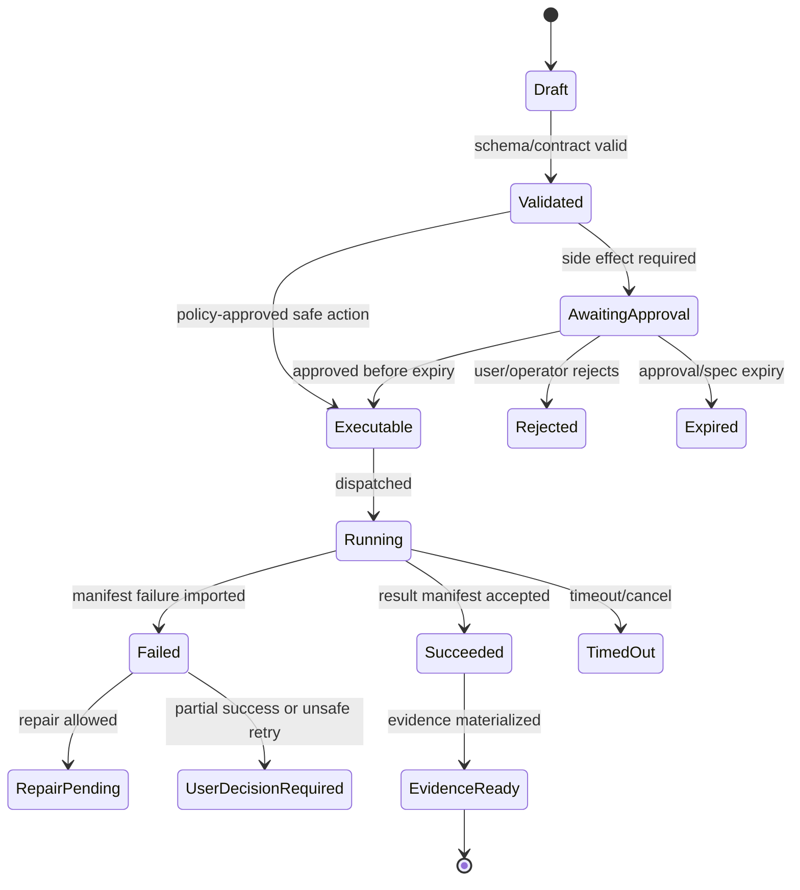

# BMAD Kernel, Package Loader, and Help Advisor

## V6.17 shared semantics, separate package authorities

BMAD parsing, help/action vocabulary, workflow/artifact semantics, validation rules, compatibility metadata, and golden fixtures are shared across C# and Rust. The web product resolves packages from the governed cloud catalog; desktop consumes signed, versioned packages from a revocable local cache. Discovery/download never implies activation.

Package activation is delivery-specific and creates delivery-specific evidence. Desktop package setup scripts or executable hooks are not run merely because a package is signed; they require local policy, an exact candidate, and the applicable DESK-01 containment profile. Cross-language conformance is governed by [[99 - Dual-Delivery Contract and Conformance Specification]].

## V6.18 current-authority overlay — Method/Builder source truth

This overlay is grounded in [[100 - BMAD Method and Builder Deep Comprehension Audit]] and supersedes any conflicting package, parser, config, help, or lifecycle statement later in this historical note.

- A source skill is a directory with `SKILL.md`; Method requires `name` and `description` frontmatter, with `name` matching the directory/canonical ID. Inputs, outputs, actions, and capabilities are separate inferred or catalog metadata, not required Method frontmatter.
- Method `module.yaml` is an installer prompt/result-expression, declarative-directory, and agent-roster schema. Built-in definitions need not declare version/dependencies/capabilities; the installer omits root `module.yaml` from the installed module folder, and plugin fallback may synthesize module/help metadata.
- `MethodCliV6` is a composite install: `_bmad` retains config, scripts, help, and module-level compatibility files while executable skill directories are copied verbatim to one or more host-native roots such as `.agents/skills` or `.claude/skills`. The import contract records distribution profile, host adapter, and every observed runtime location.
- Upstream `manifest.yaml`, `skill-manifest.csv`, and `files-manifest.csv` are staging descriptors. Their skill paths/hashes may describe pre-copy `_bmad` files later deleted, so Sapphirus independently inventories and hashes the final composite install before promotion.
- Config has three distinct surfaces: central four-layer TOML (`config.toml` -> `config.user.toml` -> `custom/config.toml` -> `custom/config.user.toml`), per-skill TOML (`customize.toml` -> team override -> user override), and generated per-module `config.yaml` compatibility projections still read by Method skills.
- Installed skill inventory, help actions, persona menus, and agent roster are related but non-identical graphs. Canonical action identity is `(module, skill, action?)`; menu codes are scoped aliases, hidden skills are valid, and artifact matches are completion evidence rather than authoritative completion.
- Execution is prompt-native and capability-dependent. Normalize an explicit archetype/profile (`persona_session`, `guided_intent`, `jit_steps`, `embedded_xml`, `rendered_workflow`, `unattended_iteration`, `compatibility_forwarder`, or `atomic_utility`) without pretending all Method content has one workflow AST.
- Builder authoring state, immutable package proposal, promotion decision, and project/delivery activation are separate objects and lifecycles. Authoring or validation never implies catalog promotion; promotion never implies activation.

## 1. Mission

Parse and validate real BMAD packages, resolve method state and capabilities, merge config layers, and advise the user on valid next BMAD actions without absorbing general orchestration responsibilities.

## 2. Responsibilities

- Detect BMAD roots and modules.
- Parse `SKILL.md`, `module.yaml`, `module-help.csv`, `bmad-modules.yaml`, `_bmad/config.toml`, `config.user.toml`, and `_bmad/custom/*.toml`.
- Build capability graph and help catalog.
- Validate package compatibility and missing dependencies.
- Resolve workflow phase and required inputs/outputs.
- Provide Help Advisor recommendations grounded in installed capabilities.

## 3. Explicit Non-Responsibilities

- Do not bypass Airlock.
- Do not mutate authoritative state outside the Runtime API state transition path.
- Do not hide policy decisions inside UI-only code.
- Do not let model text become executable behavior without typed validation.
- Do not introduce a separate runtime semantics path unless an ADR approves it.

## 4. Interfaces and Ports

| Interface | Purpose |
|---|---|
| IBmadPackageLoader | Load and validate package files. |
| IConfigResolver | Apply config merge semantics. |
| ICapabilityCatalog | Query available actions and outputs. |
| IHelpAdvisor | Recommend next BMAD action. |
| IPackageRegistry | Persist package/capability metadata. |
| IValidationRunner | Run structural/package checks. |

## 5. State and Lifecycle

Package import lifecycle: `detected`, `parsing`, `structural_validating`, `config_resolving`, `catalog_building`, `compatibility_checking`, `registered`, `blocked`, `failed`.

## 6. Data Contracts

Required source contracts:

| Contract | Runtime Handling |
|---|---|
| `SKILL.md` | Required `name` and `description`, canonical-ID/directory match, raw prompt body, resources, and inferred execution profile; inputs/outputs are not required Method frontmatter. |
| `module.yaml` | Installer prompts/result expressions, declarative directories, module code/name, and optional agent roster; version/dependencies/capabilities are optional extension metadata. |
| `module-help.csv` | phases, menu codes, action descriptions, expected outputs. |
| `_bmad/config.toml` | canonical method/team config. |
| `config.user.toml` | user overlay. |
| `_bmad/custom/*.toml` | project/team customization. |
| generated skill dirs | detect and preserve canonical structure. |

Source-code alignment from BMAD Method `6.10.0` adds these installed contracts:

| Installed artifact | Runtime handling |
|---|---|
| `_bmad/_config/manifest.yaml` | Upstream installation descriptor; preserve as source evidence but verify against the final composite layout. |
| `_bmad/_config/skill-manifest.csv` | Skill manifest with `canonicalId,name,description,module,path`. |
| `_bmad/_config/files-manifest.csv` | Upstream staging inventory; never substitute its hashes for Sapphirus-observed final host-native hashes. |
| `_bmad/config.toml` | Installer-managed central team/project config. |
| `_bmad/config.user.toml` | Installer-managed user-scoped config. |
| `_bmad/custom/config.toml` | Team-owned override that installer must not overwrite. |
| `_bmad/custom/config.user.toml` | User-owned override that installer must not overwrite. |
| `_bmad/custom/{skill-name}.toml` and `.user.toml` | Per-skill customization used by Builder-style workflows. |
| `_bmad/{module-code}/...` plus host-native skill roots | Composite control/config files under `_bmad`; executable skills under the selected host adapter roots. Root `module.yaml` may be absent. |

Config merge:

```text
central TOML: config.toml -> config.user.toml -> custom/config.toml -> custom/config.user.toml
per-skill TOML: <skill>/customize.toml -> custom/<skill>.toml -> custom/<skill>.user.toml
compatibility projection: generated _bmad/<module>/config.yaml (not another canonical merge layer)
Sapphirus run override: separate typed runtime input, never written into upstream config
```

## 7. Primary Flow

```text
Workspace snapshot
→ detect BMAD root
→ parse modules/skills/help/config
→ validate contracts
→ resolve config graph
→ register package/capabilities
→ expose to Help Advisor and Orchestrator
```

## 8. Implementation Steps

- Implement parser models and JSON schema equivalents.
- Create fixtures for valid and invalid packages.
- Implement config resolver with unknown-field preservation.
- Implement catalog builder from module-help and SKILL metadata.
- Implement Help Advisor output schema.
- Expose package endpoints in API.
- Add UI cards for package import result and next actions.

## Source-Code Alignment Update

The BMAD Kernel must be built against the reviewed BMAD Method and Builder source archives, summarized in [[83 - BMAD Source Code Review - Method and Builder]].

### Real BMAD Input Surfaces

| Surface | Must parse |
|---|---|
| Installed workspace | Composite `_bmad` control/config tree plus every selected host-native skill root; parse upstream manifests as staging descriptors and produce an independently observed final inventory. |
| Method source package | `SKILL.md`, `module.yaml`, `module-help.csv`, `bmad-modules.yaml`, `web-bundles/bundles.json`. |
| Builder output | setup-skill modules, standalone self-registration modules, generated skills, prompts/resources/scripts/templates, eval fixtures. |

### Help Catalog Contract

The exact `module-help.csv` header is:

```csv
module,skill,display-name,menu-code,description,action,args,phase,preceded-by,followed-by,required,output-location,outputs
```

The Help Advisor capability graph must use `phase`, `preceded-by`, `followed-by`, `required`, `output-location`, and `outputs` as typed fields. It must also load the agent roster from `module.yaml agents`, because BMAD Method source defines agents there rather than only in skill files.

### Help Advisor Runtime Data Sources

The source `bmad-help` skill defines the exact data sources the Help Advisor must reproduce:

| Source | Contract |
|---|---|
| Assembled catalog | `_bmad/_config/bmad-help.csv`, the installer-merged union of all installed `module-help.csv` files. The advisor reads this file, not per-module CSVs. |
| Merged config | The four-layer TOML merge (see [[69 - BMAD Validation Rules]]) resolves `output-location` variables, `core.communication_language`, and `modules.bmm.project_knowledge`. |
| Artifacts as workflow state | Files matching each row's `outputs` pattern at the resolved `output-location` indicate which steps are likely complete; artifact content may ground recommendations. |
| Module docs via `_meta` rows | Catalog rows with `_meta` in the `skill` column point to module documentation (URL or path, e.g. `llms.txt`) in `output-location`; the advisor uses these to answer general questions about a module. |
| Sequencing semantics | `phase` values are `anytime` or ordered numbered phases; `preceded-by`/`followed-by` are soft ordering hints, while `required=true` rows are the only hard gates before later phases. |

Advisor answers must degrade honestly: if catalog, config, or artifacts are missing, say what is unknown instead of fabricating workflow state. In Sapphirus, doc fetches for `_meta` URLs are outbound network calls and go through the egress policy in [[23 - Security, Identity, and Secrets]].

### Config Ownership Contract

- Installer-managed files: `_bmad/config.toml`, `_bmad/config.user.toml`, and `_bmad/_config/*`.
- User/team-owned files: `_bmad/custom/config.toml`, `_bmad/custom/config.user.toml`, `_bmad/custom/{skill-name}.toml`, and `_bmad/custom/{skill-name}.user.toml`.
- Per-module `config.yaml` is a generated compatibility projection still read by many Method skills. Central TOML remains canonical, but import/rehearsal must preserve and test the YAML projection.
- Runtime import may read installer-managed files, but writes must go through an approved install/update action.

## 9. Failure Modes and Mitigations

| Failure | Mitigation |
|---|---|
| Fabricated BMAD capabilities | Advisor only uses registered capability catalog. |
| Unknown config fields lost | Round-trip and preserve unknown metadata. |
| Duplicate menu codes | Scope aliases by module/skill/action; block only an ambiguity within the applicable invocation scope. First-party catalogs legitimately reuse some codes. |
| Invalid dependency chain | Produce compatibility report with exact missing module/version. |
| Prompt injection in package docs | Treat all package content as untrusted context. |

## 10. Acceptance Criteria

- Package loader blocks invalid frontmatter.
- Config merge produces deterministic output.
- Help Advisor explains blocked reasons.
- Package registry stores schema version and source hashes.
- User can statically import/inspect a BMAD package proposal; actions become available only after component-license/trust/scan/Azure-rehearsal/evaluation/policy/activation gates pass.

---

## v2 Review Improvements

### 1. BMAD Parser Responsibilities

| File | Parser Output | Required Validation |
|---|---|---|
| `SKILL.md` | `SkillDefinition` | required `name`/`description`, directory match, body/resources, execution-profile inference; no invented required input/output fields. |
| `module.yaml` | `ModuleDefinition` | installer prompt/result schema, directories, code/name, optional roster; preserve optional/synthetic metadata and do not require version/dependencies/capabilities. |
| `module-help.csv` | `HelpCatalogEntry[]` | scoped menu alias, `(module,skill,action?)` references, output hints, and distinction from installed-skill inventory. |
| `bmad-modules.yaml` | `ModuleRegistry` | registry schema, installable package references. |
| `_bmad/config.toml` | `BmadConfigLayer` | typed fields, unknown metadata preservation. |
| `config.user.toml` | `BmadConfigLayer` | overlay validity and user-scoped fields. |
| `_bmad/custom/*.toml` | `BmadConfigLayer[]` | overlay order and conflict warnings. |

### 2. Capability Graph

The package loader must build a graph, not a flat list.

```text
Module
→ Skill
→ Action/Menu Entry
→ Required Inputs
→ Produced Outputs
→ Phase Constraints
→ Follow-up Actions
```

This graph powers the Help Advisor and prevents generic hallucinated BMAD guidance.

### 3. Config Merge Contract

```text
base config
→ module defaults
→ team/project custom config
→ user config
→ run override
```

Rules:

- later layer overrides earlier layer only for known mergeable fields;
- unknown fields are preserved in metadata;
- incompatible field types generate validation warnings;
- policy and Airlock settings cannot be imported from workspace config;
- config merge output is hash-addressed and attached to run evidence.

### 4. Help Advisor Decision Model

Inputs:

- current phase;
- installed capabilities;
- artifact presence/absence;
- validation blockers;
- user role;
- last successful BMAD action;
- current conversation intent.

Output schema:

```json
{
  "primary_action": "string",
  "reason": "string",
  "required_inputs": [],
  "expected_outputs": [],
  "blocked_reasons": [],
  "alternatives": [],
  "source_refs": []
}
```

### 5. BMAD Package Failure Codes

| Code | Meaning |
|---|---|
| `BMAD_ROOT_NOT_FOUND` | Workspace does not contain detectable BMAD root. |
| `MODULE_YAML_INVALID` | Module definition failed schema validation. |
| `SKILL_FRONTMATTER_INVALID` | Skill cannot be registered. |
| `HELP_CATALOG_ORPHAN` | CSV references missing skill/action. |
| `MENU_CODE_AMBIGUOUS` | Two entries resolve to the same menu alias within one invocation scope; reuse across modules/skills is valid. |
| `CONFIG_MERGE_CONFLICT` | Overlay cannot be merged safely. |
| `PHASE_REFERENCE_INVALID` | Workflow references unknown phase/stage. |
| `OUTPUT_PATH_INVALID` | Package output path violates workspace policy. |

### 6. BMAD Release Gate

A BMAD package is executable only after:

- structural parse passes;
- config merge produces deterministic hash;
- capability graph has no orphan references;
- Help Advisor can recommend at least one valid next action;
- package import emits evidence with source hashes;
- any execution action maps to normal proposal/Airlock/execution substrate.


---


---

## Implementation-depth contract

This file is part of the V6 implementation library. It is written as an implementation guide, not as a strategy memo. Every component must be built against the same system-wide constraints:

1. **The first executable slice comes before breadth.** The first demonstrable product must prove authenticated chat, workspace context, typed plan output, proposal creation, Airlock validation, approval, isolated execution, validation, checkpoint, and evidence.
2. **The delivery-specific authority owns lifecycle state.** The web Runtime API imports remote-worker facts into SQL; the signed desktop Rust host imports local-executor facts into SQLite. Workers, child processes, renderers, models, sync services, and support APIs do not advance authoritative lifecycle state.
3. **Airlock creates the only side-effect token.** Workspace writes, command runs, exports, package imports, dependency restores, and policy-sensitive actions require an `ApprovedExecutionSpec` issued by Airlock.
4. **The model does not own proposals.** Model Gateway returns typed model outputs. Run Orchestrator creates normalized `Proposal` records. Airlock validates proposals.
5. **No raw shell by default.** Commands are represented as `argv[]` plus policy metadata; `sh -c`, shell expansion, broad environment access, and open network access are blocked unless explicitly operator-approved.
6. **Every side effect is reconstructable.** Diffs, preimages, spec hashes, policy hashes, approvals, job image digests, result manifests, logs, artifacts, and rollback metadata must be traceable.
7. **Each module has ports.** Even inside a modular monolith, use explicit interfaces and contracts to avoid creating a god control plane.


## 1. Component identity

| Field | Value |
|---|---|
| Component | `BMAD Kernel, Package Loader, and Help Advisor` |
| Area | `BMAD method layer` |
| Primary implementation package | `src/Bmad.Kernel` |
| Runtime/technology | `C# library with validation helpers` |
| First-slice priority | `after-core or supporting` |


## 2. Purpose

Parse and validate BMAD source contracts, resolve config overlays, build capability graphs, and provide source-grounded Help Advisor recommendations.

The implementation must be narrow enough to fit the corrected first vertical slice, but designed so BMAD package execution, the existing presentation adapter, Builder Studio, SkillOps, replay, and operator controls can plug into the same contracts later.


## 3. Owns / does not own

### Owns
- SKILL.md parsing
- module.yaml parsing
- module-help.csv catalog
- config.toml merge
- capability graph
- BMAD method-state transitions
- Help Advisor recommendations

### Does not own
- Generic coding orchestration
- Presentation workflow generation from scratch
- Airlock policy
- Worker execution


## 4. Public/API surface and internal ports

### Required API/routes or callable operations
- `POST /api/packages/import`
- `GET /api/projects/{id}/bmad/capabilities`
- `POST /api/bmad/help`
- `POST /api/bmad/validate-package`
- `POST /api/bmad/runs/{runId}/advance-stage`


### Internal contract rules

- Every boundary uses typed, schema-versioned values. C# uses `Runtime.Contracts` / `Runtime.Domain`, Rust uses generated contract types plus `desktop-domain`, and TypeScript uses generated web or desktop facade types; no generated DTO grants runtime authority.
- External payloads must be schema-versioned. Internal objects may evolve faster but must not leak into OpenAPI without a contract version.
- Every state mutation must be idempotent or protected by optimistic concurrency.
- Every side-effect operation must receive an `ApprovedExecutionSpec` or be provably read-only.
- Every error response must use the standard error envelope with `code`, `message`, `correlationId`, `retryable`, and optional `detailsRef`.


### Starter interface/type sketch

```csharp
public interface IComponentPort<TRequest, TResult>
{
    Task<TResult> ExecuteAsync(TRequest request, CancellationToken ct);
}

public sealed record OperationContext(
    Guid ProjectId,
    Guid RunId,
    string ActorUserId,
    string CorrelationId,
    string PolicyVersion,
    DateTimeOffset RequestedAt);
```


## 5. State model

### Component states
- `package_detected`
- `parsed`
- `validated`
- `registered`
- `capability_graph_built`
- `help_ready`
- `invalid_package`
- `blocked_missing_dependency`


### Generic side-effect lifecycle





## 6. Persistence responsibilities

### SQL tables or domain records touched
- `Package`
- `PackageVersion`
- `Skill`
- `Workflow`
- `Capability`
- `CapabilityDependency`
- `BmadConfigLayer`
- `BmadHelpEntry`
- `BmadValidationFinding`

### Blob/object storage paths touched
- `packages/{packageId}/{version}/source.zip`
- `packages/{packageId}/{version}/validation-report.json`
- `packages/{packageId}/{version}/capability-graph.json`


### Persistence rules

- In `web_managed`, SQL stores lifecycle state, compact indexes, ownership metadata, and references. In `windows_local`, SQLite stores the corresponding local authority records.
- In `web_managed`, Blob stores large immutable payloads: snapshots, logs, diffs, manifests, artifacts, exports, packages, traces, and validation reports. In `windows_local`, encrypted local content-addressed storage holds authority-owned payloads; cloud upload is explicit and purpose-scoped.
- Any Blob payload referenced from SQL must include content hash, schema version, created timestamp, and retention class.
- No raw secrets, broad credentials, or unredacted prompt/context payloads are stored by default.
- Migrations must be forward-safe and testable against fixture data.


## 7. Detailed implementation steps


### Phase 0 — Contract and spike

1. Create or update the relevant ADR before implementation when the decision affects hosting, policy, security, data ownership, or external dependencies.

2. Define public DTOs and durable JSON schemas first. Do not let implementation classes silently become external contracts.

3. Create a minimal fixture that exercises the component without requiring the whole platform.

4. Add negative tests for the most dangerous bypass or failure case before adding the happy path.

5. Record assumptions in the component file and in the ADR index if they are not final.

6. For `BMAD Kernel, Package Loader, and Help Advisor`, implement only the smallest behavior that proves its contract in the first executable slice, then add extended BMAD/Builder/artifact behavior after gate approval.


### Phase 1 — Skeleton implementation

1. Create the package/module/folder with explicit ports/interfaces and dependency direction rules.

2. Add dependency injection registration with narrow interfaces rather than passing broad services everywhere.

3. Implement persistence only through repository/store abstractions that expose business operations, not raw table access.

4. Emit structured events for every important state transition even if the UI does not yet render them.

5. Add unit tests for object creation, invalid input, authorization/policy denial, and idempotency where relevant.

6. For `BMAD Kernel, Package Loader, and Help Advisor`, implement only the smallest behavior that proves its contract in the first executable slice, then add extended BMAD/Builder/artifact behavior after gate approval.


### Phase 2 — First vertical integration

1. Connect the component to the first executable slice only. Avoid adding full future scope before the vertical path works.

2. Use fake/stub adapters for expensive external systems until the contract is proven.

3. Make all side effects flow through Proposal → AirlockDecision → Approval/Grant → ApprovedExecutionSpec → Dispatch.

4. Persist large payloads to Blob and store only compact references in SQL.

5. Return UI-consumable run events so the Chat Workbench can render progress without polling raw tables.

6. For `BMAD Kernel, Package Loader, and Help Advisor`, implement only the smallest behavior that proves its contract in the first executable slice, then add extended BMAD/Builder/artifact behavior after gate approval.


### Phase 3 — Production hardening

1. Add telemetry attributes, correlation IDs, redaction, and audit events.

2. Add retry, timeout, cancellation, and stale-state handling.

3. Add migration scripts and seed data for dev/test.

4. Add operator visibility for status, errors, budget/policy impact, and cleanup status.

5. Document runbooks for the top failure modes.

6. For `BMAD Kernel, Package Loader, and Help Advisor`, implement only the smallest behavior that proves its contract in the first executable slice, then add extended BMAD/Builder/artifact behavior after gate approval.


### Phase 4 — Regression and release gate

1. Add contract tests against OpenAPI/JSON Schema.

2. Add replay fixtures or golden outputs where deterministic behavior is expected.

3. Add security tests for prompt injection, secret leakage, excessive agency, insecure output handling, and supply-chain drift where relevant.

4. Update release gate evidence with screenshots/log excerpts/manifests rather than informal claims.

5. Mark open risks and deferred v1.5/v2 items explicitly.

6. For `BMAD Kernel, Package Loader, and Help Advisor`, implement only the smallest behavior that proves its contract in the first executable slice, then add extended BMAD/Builder/artifact behavior after gate approval.


## 8. Validation and test plan

### Required tests
- invalid frontmatter rejected
- ambiguous same-scope menu aliases detected; cross-scope reuse accepted
- config overlay order deterministic
- orphan module-help rows flagged
- Help Advisor never fabricates capability


### Minimum test layers

| Layer | What to test | Required before merge |
|---|---|---|
| Unit | object validation, state transitions, parsing, policy predicates | yes |
| Contract | OpenAPI/JSON Schema compatibility, generated clients, worker manifests | yes for public/durable payloads |
| Integration | SQL + Blob references, dispatch/import, authz, Airlock boundary | yes for side-effect paths |
| E2E | chat → proposal → approval → execution → evidence | yes for first slice files |
| Replay/golden | BMAD package fixtures, presentation adapter, evidence bundle | yes before v1 beta |
| Security negative | prompt injection, secret leak, policy bypass, path traversal, raw shell | yes for all side-effect components |


## 9. Failure modes and recovery

| Failure | Detection | Required behavior | User/operator visibility |
|---|---|---|---|
| Invalid schema | contract validation | reject before persistence or dispatch | show actionable error with correlation ID |
| Stale proposal/preimage | hash mismatch | void proposal or require rebase/new proposal | show stale context warning |
| Approval expired | expiry check | reject dispatch | show re-approve option |
| Policy mismatch | policy hash mismatch | reject spec | operator audit event |
| Worker timeout | job monitor | mark job timed out; preserve partial logs | timeline event + retry option if safe |
| Manifest missing/invalid | manifest import validation | do not advance success state | incident/failure card |
| Partial success | checkpoint/validation state | enter `user_decision_required` or `kept_for_repair` | explicit decision card |
| Secret detected | scanner/redactor | redact and block if high confidence | security finding card/operator event |


## 10. Security and policy requirements

- Treat workspace files, package files, generated artifacts, model outputs, and logs as untrusted input.
- Never let untrusted content override system instructions, Airlock policy, command allowlists, network policy, or secret handling.
- Enforce project-level authorization on every read and write.
- Log security-relevant denials as audit events, but do not include raw secret values.
- Prefer fail-closed behavior when policy, identity, schema, or storage checks are ambiguous.
- Add negative tests for the most likely bypass path before writing happy-path code.


## 11. Observability

Minimum telemetry fields for this component:

- `correlation.id`
- `project.id`
- `run.id` when available
- `component.name`
- `operation.name`
- `operation.outcome`
- `policy.version` when applicable
- `spec.id` when applicable
- `job.id` when applicable
- `artifact.id` when applicable
- redaction counters, not raw secrets

Metrics to consider: request latency, state-transition count, policy denials, approval wait time, job duration, manifest import failures, schema validation failures, retry count, budget blocks, and evidence materialization time.


## 12. Acceptance criteria

- [ ] The component has a clear owner package and does not leak responsibilities into unrelated modules.
- [ ] Public routes/payloads are represented in OpenAPI/JSON Schema where applicable.
- [ ] Side-effect paths cannot execute without Airlock evaluation and `ApprovedExecutionSpec`.
- [ ] SQL lifecycle state is mutated only by the Runtime API/Application layer.
- [ ] Blob payloads have content hashes and schema versions.
- [ ] Tests include at least one negative/bypass case.
- [ ] Events and evidence are emitted for user-visible actions.
- [ ] The component is represented in the release gate matrix.
- [ ] The implementation does not introduce Cortex as a runtime namespace.
- [ ] Documentation includes deferred v1.5/v2 scope explicitly rather than silently omitting it.


## 13. Integration checklist

- [ ] Update `32 - Integration Contract Map.md` with any new caller/callee relationship.
- [ ] Update `25 - OpenAPI, Schemas, and Generated Clients.md` for public route or schema changes.
- [ ] Update `22 - Data Model - SQL and Blob.md`, `47 - Database DDL Starter.md`, or `48 - Blob Storage Layout.md` for persistence changes.
- [ ] Update `27 - Testing, Validation, and Replay.md` for new fixtures or replay needs.
- [ ] Update `33 - Release Gates and Acceptance Matrix.md` if the change affects release readiness.
- [ ] Add or update ADR in `31 - Architecture Decision Records.md` if the change alters architecture, hosting, policy, or security posture.


## BMAD package parser checklist

1. Detect BMAD root and `_bmad` folder.
2. Parse `bmad-modules.yaml` registry metadata if present.
3. Discover source/cache module definitions when available; installed module folders may omit `module.yaml`, and synthetic plugin metadata must be labeled.
4. Parse `module-help.csv`; validate columns, menu codes, action names, expected outputs, and phase hints.
5. Discover final host-native `SKILL.md` directories as well as upstream staging records; parse required `name`/`description` and independently hash final bytes.
6. Resolve central TOML, per-skill TOML, and the generated per-module YAML compatibility projection without flattening their ownership or precedence.
7. Preserve unknown metadata in a typed extension bag.
8. Build capability graph and dependency graph.
9. Validate duplicate capabilities, missing dependencies, orphan help rows, invalid output paths, invalid setup assets, and generated skill directories.
10. Register only validated packages/capabilities.

### Do not do this

- Do not treat generic workflow YAML as BMAD without an adapter.
- Do not execute package scripts during parse.
- Do not let package content mutate Airlock policy.
- Do not fabricate Help Advisor actions outside installed package metadata.


---

## Historical Revision Notes (V3 -> V4 Hardening Pass)
### V4 audit finding applied to this file
The v3 library was detailed, but several files still behaved like expanded planning notes rather than implementation handbooks. This pass adds enforceable implementation details: exact build sequence, explicit boundaries, input/output contracts, database/blob ownership, event names, failure states, tests, and release gates.

## System invariants this component must obey

1. The first delivered slice remains: **authenticated chat → workspace context → implementation plan → proposal → Airlock → approval → isolated job → validation → checkpoint → evidence**.
2. No worker image receives Azure SQL write credentials. Workers produce signed/hashed append-only manifests in Blob; the Runtime API imports them and advances SQL lifecycle state.
3. No file write, command run, dependency restore, package import, artifact export, checkpoint mutation, or rollback can execute without an `ApprovedExecutionSpec` minted by Airlock.
4. The Model Gateway returns typed model outputs only. The Run Orchestrator creates platform `Proposal` records. Airlock validates proposals and creates approved specs.
5. Commands are `argv[]` specs, not raw shell strings. Shell execution is a separate high-risk command class.
6. Every state transition emits a run event and trace event with correlation ID, actor/service principal, schema version, and payload hash or payload reference.
7. Every persisted object carries schema version, retention class, project scope, created/updated timestamps, and hash/provenance where relevant.
8. Any component that reads workspace content treats it as untrusted user-controlled input and cannot allow it to override system policy, command allowlists, approval requirements, or secrets handling.


## Component build card

| Field | Value |
|---|---|
| Component | `BMAD Kernel, Package Loader, Help Advisor` |
| Primary package/path | `src/Bmad.Kernel` |
| Current implementation status | `v6-validated` |
| Required for first vertical slice | `after-first-slice or v1 extension` |

## Validated API/port touchpoints

- `POST /api/packages/import`
- `GET /api/projects/{projectId}/bmad/capabilities`
- `GET /api/projects/{projectId}/bmad/help/next-step`
- `POST /api/projects/{projectId}/bmad/validate`

## Validated domain events to implement or consume

- `bmad.package.detected`
- `bmad.package.validated`
- `bmad.config.resolved`
- `bmad.capability.indexed`
- `bmad.help.recommended`

## Validated SQL ownership / indexes

- `bmad_packages`
- `bmad_modules`
- `bmad_capabilities`
- `bmad_configs`
- `bmad_validation_findings`

Implementation notes:

- Tables listed here are owned by their module or exposed through its port; other modules must not perform direct ad-hoc writes.
- Mutable lifecycle tables need optimistic concurrency tokens.
- All records need `project_id`, `schema_version`, `created_at`, `updated_at`, and retention classification where applicable.

## Validated Blob payload layout

- `packages/{packageId}/source.zip`
- `packages/{packageId}/validation-report.json`
- `packages/{packageId}/resolved-config.toml`

Implementation notes:

- Blob payloads are content-addressed or hash-checked before import.
- SQL stores compact payload references, not bulky logs/prompts/artifacts.
- Retention class and redaction level must be explicit for every payload family.

## Validated step-by-step build procedure

1. Implement source contract readers for SKILL.md, module.yaml, module-help.csv, bmad-modules.yaml, _bmad/config.toml, config.user.toml, _bmad/custom/*.toml.
2. Create parser tests with malformed frontmatter, ambiguous same-scope menu aliases, valid cross-scope alias reuse, orphan help rows, missing dependencies, and invalid output paths.
3. Generate a capability graph that the Help Advisor can query without invoking a model.
4. Separate package import validation from package registration; invalid packages never enter active capability catalog.
5. Implement config merge with unknown-field preservation and warning emission.
6. Expose Help Advisor as source-grounded recommendations with blocked reasons and exact missing artifacts/config.

## Validated edge cases that must be tested

| Edge case | Expected behavior |
|---|---|
| Duplicate API request with same idempotency key | Returns original result; no duplicate state transition or worker dispatch. |
| Stale proposal after newer checkpoint | Proposal is voided or requires rebase; approval is blocked. |
| Expired approval/spec | Side-effect endpoint rejects request; UI asks for refresh. |
| Unknown schema version | Import/read path rejects or routes to migration handler. |
| Blob payload hash mismatch | Runtime refuses import and creates security/audit finding. |
| User lacks project role | API returns access denied; no object existence leakage. |
| Workspace contains prompt injection in docs/code | Treated as untrusted content; cannot change system policy or tool permissions. |
| Worker crashes after writing partial logs | Execution becomes failed/unknown with partial log refs; retry uses same spec rules. |

## Validated release gate for this component

- Unit tests cover all domain transitions owned by this component.
- Contract tests cover all listed API touchpoints or port methods.
- Integration tests prove SQL/Blob responsibility boundaries.
- Security tests cover unauthorized access and malformed payloads.
- Replay fixture includes at least one success path and one failure path relevant to this component.
- Observability emits trace/span/log attributes with the shared correlation ID.
- Documentation examples compile or validate against JSON Schema/OpenAPI where relevant.

## V6.16 foundation/import boundary

- BMAD Method 6.10.0 and BMAD Builder package 2.1.0/module 1.0.0 are the authoritative foundation inputs, with separate source/package/module/runtime versions, MIT/trademark review, archive hashes, and immutable upstream identity required before release promotion.
- Every import declares both a distribution profile and install profile. `MethodCliV6` is a composite `_bmad` plus host-native-skills layout; `StandaloneBuilderSetupV2`, Claude marketplace, and Web Bundle inputs remain distinct. Ambiguous/mixed layouts fail.
- The first slice loads only one sealed hash-pinned foundation fixture. Its package/skill/config/help/workflow-step/artifact lineage exists from Phase 0/1; this is not arbitrary package support.
- Static archive safety, license inventory, and parsing may use pure data readers. Package/provider modules and upstream scripts are never imported into the .NET Runtime API/model process or executed by `sealed_test_fake`.
- A remotely built, digest-pinned Node/Python import/rehearsal worker runs exact upstream tooling only in the fixed Azure lane and emits neutral `BmadPackageDescriptor`, validation, install/invocation, dependency, and evidence records.
- Activation requires accepted `ComponentLicenseDecision[]`, trust/scan, exact dependency lock/provenance/SBOM, Azure rehearsal, evaluation, policy, any required exact candidate approval, and reversible `ToolAvailabilitySnapshot` transition.
- BMAD owns method semantics, not identity, Airlock, worker dispatch, SQL lifecycle state, or Evidence Ledger authority.
