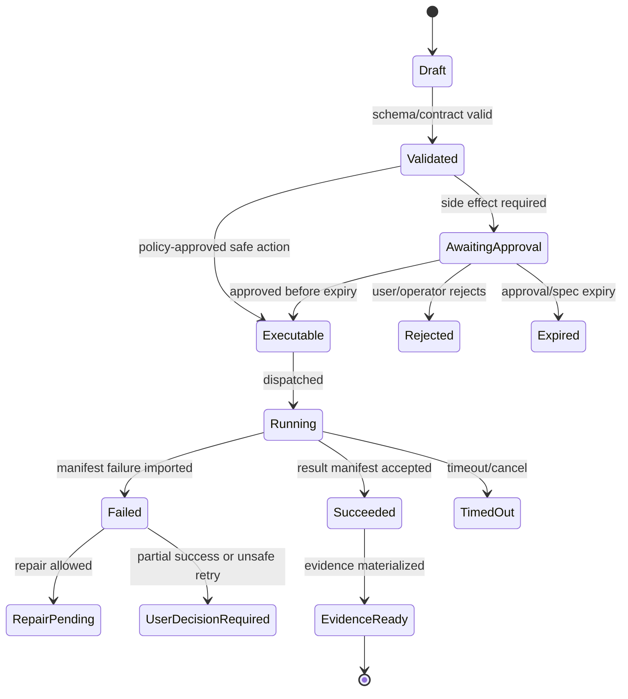

# Builder Studio and SkillOps

## V6.17 delivery binding

Builder Studio remains primarily a `web_managed` authoring, evaluation, review, signing, and publication surface. Windows desktop is a governed consumer of signed BMAD packages and may create local drafts, but publishing, shared rehearsal, and promotion require an explicit upload and cloud review record.

The cloud catalog cannot activate a desktop package remotely. Desktop downloads a signed descriptor/bundle, verifies publisher, digest, compatibility, revocation, and policy locally, then records a local activation decision. Package identity and compatibility are shared; activation state and evidence are not.

## V6.18 current-authority Builder overlay

This overlay is the current authority for Builder semantics. It is grounded in [[100 - BMAD Method and Builder Deep Comprehension Audit]] and supersedes conflicting import-only, fixed-phase, Convert, evaluation, or activation language later in this historical implementation note.

### Source-supported surface

| Surface | Current treatment |
|---|---|
| Agent Builder | Preserve the conversational `Create`/`Edit`/`Analyze` loop and its stateless, memory, and autonomous output gradient. |
| Workflow Builder | Preserve the conversational `Build`/`Edit`/`Analyze` loop, inline-first authoring, progressive disclosure, deterministic scripts, and optional working-state strategy. |
| Convert | Upstream Builder removed its dedicated Convert flow. Any Sapphirus conversion feature is a platform-owned import adapter and must not be represented as an existing upstream command. |
| Module Builder | Preserve `Ideate`/`Create`/`Validate`, including standalone self-registration and multi-skill setup-skill shapes. |
| Eval Runner | Preserve the concepts `baseline`, `variant`, `quality`, and `trigger`, but normalize them behind Sapphirus-owned schemas and adapters. The Builder plugin manifest does not install `bmad-eval-runner`, so it is an explicit runtime dependency, not an assumed colocated skill. |
| Builder Setup | Treat the direct YAML setup flow as the `StandaloneBuilderSetupV2` compatibility profile. It is not the Method CLI installer and must not clean a `MethodCliV6` workspace. |

The Agent and Workflow builders are adaptive goal-driven loops, not fixed six-phase forms. The product experience must keep the source's open-floor discovery, minimal-first draft, real-input/eval beat, explicit customization decision, deterministic lint, and memlog audit while representing those behaviors through typed platform actions.

### Early inactive authoring is foundational

Builder authoring contracts and inactive drafts move into the early foundation work. The first Builder proof creates one stateless agent draft and one simple inline workflow draft with Create/Build, Edit, Analyze, resume, deterministic file generation, validation, and a reviewable diff. These outputs remain inactive and cannot grant tools, schedule work, mutate an authoritative workspace, or register themselves.

Executable rehearsal, provider-backed evaluation, signing, publication, promotion, memory agents, and autonomous agents remain gated on the governed execution, storage, policy, and evidence substrate. This reconciles Builder's foundational role with the first executable slice instead of deferring all creation to a late import-only studio.

### Separate lifecycle authorities

Do not encode every concern as one linear status field. Persist and relate these state machines separately:

1. **Authoring draft:** `ideating -> drafting -> generated -> statically_validated -> analyzed -> user_accepted` with `blocked`, `abandoned`, and `superseded` exits.
2. **Catalog registration:** `unregistered -> registered_inactive -> withdrawn`; registration never changes tool availability.
3. **Rehearsal/evaluation:** immutable candidate runs move independently through `queued -> running -> passed|failed|unknown`, with distinct installation, invocation, quality, trigger, safety, latency, and cost verdicts.
4. **Release promotion:** `draft -> validated -> rehearsed -> evaluated -> approved -> signed -> promoted` and fails closed on missing or unknown mandatory evidence.
5. **Runtime activation:** `inactive -> activation_pending -> active -> deactivation_pending -> inactive|rolled_back`, owned separately by the web Runtime API or signed desktop host.

Generated model text never advances any lifecycle. The authoritative application imports typed validator/worker facts and performs the transition.

### Safe authoring and evaluation boundary

- Author only in a disposable, content-addressed draft workspace. Existing files require preimage hashes and changes are materialized as a proposed diff.
- Never run upstream scaffolding, setup, merge, cleanup, eval, or self-improvement scripts directly against authoritative workspace or package state.
- Candidate packages cannot supply executable eval adapters. Adapter definitions, commands, credential scopes, model bindings, tool availability, and image digests come from an operator-owned registry.
- Normalize all package, case, fixture, transcript, adapter, skill-directory, and output paths; reject absolute paths, traversal, symlinks/reparse points, and any resolved target outside its approved root.
- Copy immutable candidate bytes into rehearsal; do not symlink the source tree. Mount source and fixtures read-only where supported.
- Inspect structured result payloads rather than trusting process exit code. Upstream eval scripts can exit zero with failed cases.
- Grade candidate and baseline with an independent evaluator over frozen inputs. A timing/token comparison alone is not a baseline or variant quality verdict.

### Memory, evolvability, and autonomy

Memory and autonomous agents are advanced output types, not first authoring fixtures. Their sanctum is owner/project-scoped runtime state outside package bytes and requires a schema version, manifest, bounded context loading, retention, redaction, checkpoint, repair, and rollback contract.

First Breath initialization must be transactional and recoverable from partial creation. Mutable memory cannot become executable capability state: learned prompts or scripts create a `SkillPackageProposal`, memory deletion creates a governed knowledge-write proposal, and code never executes from the mutable sanctum. Autonomous packages install disabled and require an explicit schedule, budget, quiet hours, capability allowlist, owner scope, and reversible activation.

## 1. Mission

Provide a controlled path to author, import, validate, package, and later release BMAD assets. When conversion is supported, it is a Sapphirus-owned import adapter because upstream Builder v2 removed its dedicated Convert flow. v1 must avoid turning Builder Studio into a full platform before the execution substrate is stable.

## 2. Responsibilities

- Support import of one existing workflow package in v1; an optional conversion path is platform-owned and separately versioned.
- Validate module package contracts.
- Generate package compatibility reports.
- Run installation, invocation, script, and eval rehearsal only in an approved fixed ACA Job; a clean directory is reproducibility, not containment.
- Expose Builder output as draft until validation passes.
- Prepare later SkillOps release-channel model.

## 3. Explicit Non-Responsibilities

- Do not bypass Airlock.
- Do not mutate authoritative state outside the Runtime API state transition path.
- Do not hide policy decisions inside UI-only code.
- Do not let model text become executable behavior without typed validation.
- Do not introduce a separate runtime semantics path unless an ADR approves it.

## 4. Interfaces and Ports

| Interface | Purpose |
|---|---|
| IBuilderDraftStore | Store draft assets and validation results. |
| IPackageValidationPipeline | Run structural/security/eval/package checks. |
| IArtifactTemplateStore | Manage templates/assets used by generated packages. |
| ISkillOpsRegistry | Future release channels and provenance. |
| IExecutionDispatcher | Run validation jobs as approved specs. |

## 5. State and Lifecycle

Historical validation-gate vector: `draft`, `frontmatter_valid`, `module_valid`, `catalog_valid`, `config_valid`, `security_reviewed`, `eval_passed`, `installation_rehearsed`, `invocation_rehearsed`, `packaged`, `registered`. Under V6.18 these are evidence/check states distributed across the separate authoring, registration, rehearsal/evaluation, promotion, and activation lifecycles above, not one mutable linear status.

## 6. Data Contracts

Validation report schema:

```json
{
  "package_id": "pkg_...",
  "validation_version": "builder-validation.v1",
  "checks": [
    {"id":"skill.frontmatter.required_fields","status":"passed"},
    {"id":"module.dependencies.resolved","status":"failed","details":"missing module x"}
  ],
  "blocking": true,
  "artifact_refs": []
}
```

## 7. Primary Flow

```text
Import workflow or run a Sapphirus-owned conversion adapter
→ create Builder draft
→ run structural validation
→ run config/catalog validation
→ run security/prompt-injection review
→ run installation rehearsal
→ run invocation rehearsal
→ register package if clean
```

## 8. Implementation Steps

- Implement draft model and validation result schema.
- Implement import flow for the existing presentation workflow adapter; add conversion only through a separately tested Sapphirus-owned adapter.
- Implement package validation worker.
- Create invalid fixture suite.
- Expose Builder Studio MVP UI: import, validation report, package manifest preview.
- Defer full visual workflow builder until v1.5.

## 9. Failure Modes and Mitigations

| Failure | Mitigation |
|---|---|
| Builder MVP becomes too broad | Keep the early authoring proof inactive and bound executable v1 work to importing/validating one package; conversion is present only if the Sapphirus-owned adapter is implemented. |
| Generated package bypasses validation | Runtime refuses unvalidated Builder outputs. |
| Security review treated as text lint | Use explicit checks for prompt-injection/tool misuse/secrets. |
| Eval fixtures missing | Block registered status until fixture exists. |
| Release provenance missing | Record source hashes and validation manifest from day one. |

## 10. Acceptance Criteria

- A Builder draft cannot become registered without validation.
- The presentation adapter can be imported and validated.
- Validation failures are specific and actionable.
- Security review includes prompt-injection and excessive-agency checks.
- SkillOps fields exist even if release channels are deferred.


## 11. v1 Cut Line

Build only:

- import an existing workflow, with platform-owned conversion only when that adapter is implemented;
- inspect package files;
- validate package;
- show validation report;
- register if valid.

Do not build drag-and-drop workflow authoring, marketplace publication, broad release channels, or full eval trend dashboards in v1.

## Source-Code Alignment Update

Builder Studio should align with the reviewed Builder source, summarized in [[83 - BMAD Source Code Review - Method and Builder]], instead of inventing a separate authoring model.

### Builder Source Baseline

| Source fact | Planning consequence |
|---|---|
| Builder package is `bmad-builder` version `2.1.0` and requires Node `>=22.0.0`. | Builder static parsing may run without imports; executable validation/rehearsal uses a remotely built, digest-pinned fixed ACA worker with the exact Node/Python script profile. |
| Builder module code is `bmb`, default-selected `false`, with output defaults under `{project-root}/skills`. | Import UI should make Builder optional and show where generated assets will land. |
| Builder skills include `bmad-agent-builder`, `bmad-workflow-builder`, `bmad-module-builder`, `bmad-eval-runner`, and `bmad-bmb-setup`. | MVP should recognize these skills, not generic low-code objects. |
| Builder treats agents, workflows, and modules as skills with `SKILL.md` plus optional resources/scripts/templates. | Builder drafts should use the same package parser and validator as BMAD Kernel. |

### Supported Builder Output Types

- Stateless agent skill.
- Memory agent skill.
- Autonomous agent skill.
- Simple utility skill.
- Simple workflow skill.
- Complex workflow skill.
- Standalone module with self-registration assets.
- Multi-skill module with setup skill and module assets.

### Module Packaging Shapes

| Shape | Required structure |
|---|---|
| Multi-skill module | Dedicated setup skill containing `assets/module.yaml` and `assets/module-help.csv`. |
| Standalone module | Skill with `assets/module-setup.md`, `assets/module.yaml`, and `assets/module-help.csv`. |
| Distribution package | Optional `.claude-plugin/marketplace.json` plus module files, reports, and docs. |

### Builder Validation and Rehearsal Gates

- Run deterministic skill validation before package registration.
- Validate `module.yaml`, exact `module-help.csv` header, menu codes, phases, outputs, and generated paths.
- Run install rehearsal in a clean workspace inside the approved Azure worker; the clean workspace alone is not a sandbox.
- Run invocation rehearsal using headless prompts where available.
- Support both explicit eval profiles: legacy `evals.json`/`triggers.json` plus setup overlays, and Builder v2 cases using `input`/`rubric`/optional `state_prefix`; normalize both before staged execution.
- Store reports under a Builder validation run and include source hashes, package hashes, logs, and replay artifacts.

### OpenClaw-Informed Proposal Queue

OpenClaw's skill workshop stores generated skills as reviewable proposals instead of installing them silently. Builder Studio should use the same pattern for generated or converted packages:

| Field | Required content |
|---|---|
| `proposalId` | Stable proposal ID. |
| `origin` | Project, thread, run, actor, source prompt/ref, and builder version. |
| `target` | Package ID, intended version, destination, and current target content hash if updating. |
| `draftHash` | Hash of generated files plus bounded support files. |
| `scan` | Structural validation, prompt-injection review, secrets scan, dependency scan, and safe archive extraction report refs. |
| `evidence` | Validation run, install rehearsal, invocation rehearsal, logs, and replay fixture refs. |
| `decision` | Pending, applied, rejected, superseded, or expired with timestamp and actor. |

Activating a `SkillPackageProposal` is a governed mutation. It must pass component-license/trust/static scan, immutable dependency lock/provenance, fixed-Azure install/invocation rehearsal, independent evaluation, Airlock policy, and exact approval when required. Registration may remain an inactive catalog record; activation alone changes tool availability.

---

## v2 Review Improvements

### 1. Corrected v1 Scope

Builder Studio v1 is not a general low-code authoring environment. It supports:

1. import an existing workflow/package;
2. optionally convert/wrap one workflow through a Sapphirus-owned adapter into BMAD package shape;
3. validate structure/catalog/config/security/eval fixtures;
4. register the package in the internal catalog;
5. emit a package evidence bundle.

Full visual authoring, release channels, eval dashboards, and broad SkillOps promotion are deferred.

### 2. Builder v1 Workflow

```text
Upload/import workflow source
→ inventory files/prompts/templates/scripts
→ map to BMAD package structure
→ generate/verify SKILL.md + module.yaml + module-help.csv
→ run structural validation
→ run invocation rehearsal in clean workspace
→ run security/prompt-injection review
→ package and register
→ evidence bundle
```

### 3. Builder Validation Matrix

| Validation | Required Inputs | Output |
|---|---|---|
| Structure | package directory | file inventory + missing required files. |
| Skill schema | `SKILL.md` | valid/invalid frontmatter report. |
| Module schema | `module.yaml` | module identity/dependency report. |
| Help catalog | `module-help.csv` | menu/action graph report. |
| Config merge | TOML layers | deterministic config hash. |
| Invocation rehearsal | clean workspace + package | run transcript and outputs. |
| Security review | package text/scripts/templates | findings by severity. |
| Prompt-injection fixture | malicious source docs | policy bypass result. |
| Package evidence | all above | signed/hash-addressed report. |

### 4. Builder Data Contracts

```json
{
  "builder_package_id": "bpkg_...",
  "source_inventory_hash": "sha256:...",
  "generated_files": [],
  "validation_results": [],
  "registration_status": "draft|validated|registered|rejected",
  "evidence_bundle_uri": "blob://..."
}
```

### 5. SkillOps Deferral Criteria

Move to SkillOps only when at least three validated internal packages exist and package maintenance becomes a repeatable operational concern. Until then, keep SkillOps as validation metadata, not a separate platform.

Deferred features:

- release channels;
- deprecation windows;
- compatibility matrix;
- eval trend dashboards;
- package signing UI;
- package marketplace/discovery;
- managed publication path.

### 6. Builder Acceptance Tests

- Importing the presentation workflow creates a package with deterministic file inventory hash.
- Missing `module-help.csv` row blocks registration.
- Invalid skill frontmatter blocks registration.
- Prompt-injection text in a template cannot change package policy.
- Invocation rehearsal runs through normal Airlock/execution/evidence substrate.


---


---

## Implementation-depth contract

This file is part of the V6 implementation library. It is written as an implementation guide, not as a strategy memo. Every component must be built against the same system-wide constraints:

1. **The first executable slice comes before breadth.** The first demonstrable product must prove authenticated chat, workspace context, typed plan output, proposal creation, Airlock validation, approval, isolated execution, validation, checkpoint, and evidence.
2. **The delivery-specific authority owns lifecycle state.** The web Runtime API imports remote-worker facts into SQL; the signed desktop Rust host imports local-executor facts into SQLite. Workers, child processes, renderers, models, sync services, and support APIs do not advance authoritative lifecycle state.
3. **Airlock creates the only side-effect token.** Workspace writes, command runs, exports, package imports, dependency restores, and policy-sensitive actions require an `ApprovedExecutionSpec` issued by Airlock.
4. **The model does not own proposals.** Model Gateway returns typed model outputs. Run Orchestrator creates normalized `Proposal` records. Airlock validates proposals.
5. **No raw shell by default.** Commands are represented as `argv[]` plus policy metadata; `sh -c`, shell expansion, broad environment access, and open network access are blocked unless explicitly operator-approved.
6. **Every side effect is reconstructable.** Diffs, preimages, spec hashes, policy hashes, approvals, job image digests, result manifests, logs, artifacts, and rollback metadata must be traceable.
7. **Each module has ports.** Even inside a modular monolith, use explicit interfaces and contracts to avoid creating a god control plane.


## 1. Component identity

| Field | Value |
|---|---|
| Component | `Builder Studio and SkillOps` |
| Area | `BMAD authoring and lifecycle` |
| Primary implementation package | `src/Bmad.Builder + apps/web builder routes` |
| Runtime/technology | `C# validation + React UX + Python validators where useful` |
| First-slice priority | `after-core or supporting` |


## 2. Purpose

Create, import, validate, package, rehearse, register, and later promote BMAD-compliant skills/workflows/modules. Conversion, when present, is a separately versioned Sapphirus-owned import adapter.

The implementation must be narrow enough to fit the corrected first vertical slice, but designed so BMAD package execution, the existing presentation adapter, Builder Studio, SkillOps, replay, and operator controls can plug into the same contracts later.


## 3. Owns / does not own

### Owns
- Authoring UX
- Draft package workspace
- Validation pipeline
- Eval fixtures
- Package rehearsal
- SkillOps release metadata
- Provenance for generated packages

### Does not own
- Core run orchestration
- Unvalidated package activation
- Replacing canonical presentation workflow


## 4. Public/API surface and internal ports

### Required API/routes or callable operations
- `POST /api/builder/drafts`
- `POST /api/builder/drafts/{id}/generate`
- `POST /api/builder/drafts/{id}/validate`
- `POST /api/builder/drafts/{id}/package`
- `POST /api/builder/packages/{id}/register`
- `POST /api/skillops/packages/{id}/promote`


### Internal contract rules

- Every boundary uses typed, schema-versioned values. C# uses `Runtime.Contracts` / `Runtime.Domain`, Rust uses generated contract types plus `desktop-domain`, and TypeScript uses generated web or desktop facade types; no generated DTO grants runtime authority.
- External payloads must be schema-versioned. Internal objects may evolve faster but must not leak into OpenAPI without a contract version.
- Every state mutation must be idempotent or protected by optimistic concurrency.
- Every side-effect operation must receive an `ApprovedExecutionSpec` or be provably read-only.
- Every error response must use the standard error envelope with `code`, `message`, `correlationId`, `retryable`, and optional `detailsRef`.


### Starter interface/type sketch

```csharp
public interface IComponentPort<TRequest, TResult>
{
    Task<TResult> ExecuteAsync(TRequest request, CancellationToken ct);
}

public sealed record OperationContext(
    Guid ProjectId,
    Guid RunId,
    string ActorUserId,
    string CorrelationId,
    string PolicyVersion,
    DateTimeOffset RequestedAt);
```


## 5. State model

### Component states
- `draft`
- `frontmatter_valid`
- `module_valid`
- `catalog_valid`
- `config_valid`
- `security_reviewed`
- `eval_passed`
- `installation_rehearsed`
- `invocation_rehearsed`
- `packaged`
- `registered`
- `promoted`


### Generic side-effect lifecycle





## 6. Persistence responsibilities

### SQL tables or domain records touched
- `BuilderDraft`
- `BuilderArtifact`
- `BuilderValidationRun`
- `EvalCase`
- `EvalResult`
- `PackageRelease`
- `SkillOpsChannel`
- `PackageProvenance`

### Blob/object storage paths touched
- `builder/{draftId}/files/*`
- `builder/{draftId}/validation/*`
- `skillops/{packageId}/{version}/release-bundle.zip`


### Persistence rules

- In `web_managed`, SQL stores lifecycle state, compact indexes, ownership metadata, and references. In `windows_local`, SQLite stores the corresponding local authority records.
- In `web_managed`, Blob stores large immutable payloads: snapshots, logs, diffs, manifests, artifacts, exports, packages, traces, and validation reports. In `windows_local`, encrypted local content-addressed storage holds authority-owned payloads; cloud upload is explicit and purpose-scoped.
- Any Blob payload referenced from SQL must include content hash, schema version, created timestamp, and retention class.
- No raw secrets, broad credentials, or unredacted prompt/context payloads are stored by default.
- Migrations must be forward-safe and testable against fixture data.


## 7. Detailed implementation steps


### Phase 0 — Contract and spike

1. Create or update the relevant ADR before implementation when the decision affects hosting, policy, security, data ownership, or external dependencies.

2. Define public DTOs and durable JSON schemas first. Do not let implementation classes silently become external contracts.

3. Create a minimal fixture that exercises the component without requiring the whole platform.

4. Add negative tests for the most dangerous bypass or failure case before adding the happy path.

5. Record assumptions in the component file and in the ADR index if they are not final.

6. For `Builder Studio and SkillOps`, implement only the smallest behavior that proves its contract in the first executable slice, then add extended BMAD/Builder/artifact behavior after gate approval.


### Phase 1 — Skeleton implementation

1. Create the package/module/folder with explicit ports/interfaces and dependency direction rules.

2. Add dependency injection registration with narrow interfaces rather than passing broad services everywhere.

3. Implement persistence only through repository/store abstractions that expose business operations, not raw table access.

4. Emit structured events for every important state transition even if the UI does not yet render them.

5. Add unit tests for object creation, invalid input, authorization/policy denial, and idempotency where relevant.

6. For `Builder Studio and SkillOps`, implement only the smallest behavior that proves its contract in the first executable slice, then add extended BMAD/Builder/artifact behavior after gate approval.


### Phase 2 — First vertical integration

1. Connect the component to the first executable slice only. Avoid adding full future scope before the vertical path works.

2. Use fake/stub adapters for expensive external systems until the contract is proven.

3. Make all side effects flow through Proposal → AirlockDecision → Approval/Grant → ApprovedExecutionSpec → Dispatch.

4. Persist large payloads to Blob and store only compact references in SQL.

5. Return UI-consumable run events so the Chat Workbench can render progress without polling raw tables.

6. For `Builder Studio and SkillOps`, implement only the smallest behavior that proves its contract in the first executable slice, then add extended BMAD/Builder/artifact behavior after gate approval.


### Phase 3 — Production hardening

1. Add telemetry attributes, correlation IDs, redaction, and audit events.

2. Add retry, timeout, cancellation, and stale-state handling.

3. Add migration scripts and seed data for dev/test.

4. Add operator visibility for status, errors, budget/policy impact, and cleanup status.

5. Document runbooks for the top failure modes.

6. For `Builder Studio and SkillOps`, implement only the smallest behavior that proves its contract in the first executable slice, then add extended BMAD/Builder/artifact behavior after gate approval.


### Phase 4 — Regression and release gate

1. Add contract tests against OpenAPI/JSON Schema.

2. Add replay fixtures or golden outputs where deterministic behavior is expected.

3. Add security tests for prompt injection, secret leakage, excessive agency, insecure output handling, and supply-chain drift where relevant.

4. Update release gate evidence with screenshots/log excerpts/manifests rather than informal claims.

5. Mark open risks and deferred v1.5/v2 items explicitly.

6. For `Builder Studio and SkillOps`, implement only the smallest behavior that proves its contract in the first executable slice, then add extended BMAD/Builder/artifact behavior after gate approval.


## 8. Validation and test plan

### Required tests
- draft cannot register without validation
- eval failure blocks promotion
- package hash stable across validation
- malicious SKILL.md cannot change policy
- generated module installs/invokes in a clean workspace inside the fixed Azure rehearsal lane using the exact candidate digest/lock


### Minimum test layers

| Layer | What to test | Required before merge |
|---|---|---|
| Unit | object validation, state transitions, parsing, policy predicates | yes |
| Contract | OpenAPI/JSON Schema compatibility, generated clients, worker manifests | yes for public/durable payloads |
| Integration | SQL + Blob references, dispatch/import, authz, Airlock boundary | yes for side-effect paths |
| E2E | chat → proposal → approval → execution → evidence | yes for first slice files |
| Replay/golden | BMAD package fixtures, presentation adapter, evidence bundle | yes before v1 beta |
| Security negative | prompt injection, secret leak, policy bypass, path traversal, raw shell | yes for all side-effect components |


## 9. Failure modes and recovery

| Failure | Detection | Required behavior | User/operator visibility |
|---|---|---|---|
| Invalid schema | contract validation | reject before persistence or dispatch | show actionable error with correlation ID |
| Stale proposal/preimage | hash mismatch | void proposal or require rebase/new proposal | show stale context warning |
| Approval expired | expiry check | reject dispatch | show re-approve option |
| Policy mismatch | policy hash mismatch | reject spec | operator audit event |
| Worker timeout | job monitor | mark job timed out; preserve partial logs | timeline event + retry option if safe |
| Manifest missing/invalid | manifest import validation | do not advance success state | incident/failure card |
| Partial success | checkpoint/validation state | enter `user_decision_required` or `kept_for_repair` | explicit decision card |
| Secret detected | scanner/redactor | redact and block if high confidence | security finding card/operator event |


## 10. Security and policy requirements

- Treat workspace files, package files, generated artifacts, model outputs, and logs as untrusted input.
- Never let untrusted content override system instructions, Airlock policy, command allowlists, network policy, or secret handling.
- Enforce project-level authorization on every read and write.
- Log security-relevant denials as audit events, but do not include raw secret values.
- Prefer fail-closed behavior when policy, identity, schema, or storage checks are ambiguous.
- Add negative tests for the most likely bypass path before writing happy-path code.


## 11. Observability

Minimum telemetry fields for this component:

- `correlation.id`
- `project.id`
- `run.id` when available
- `component.name`
- `operation.name`
- `operation.outcome`
- `policy.version` when applicable
- `spec.id` when applicable
- `job.id` when applicable
- `artifact.id` when applicable
- redaction counters, not raw secrets

Metrics to consider: request latency, state-transition count, policy denials, approval wait time, job duration, manifest import failures, schema validation failures, retry count, budget blocks, and evidence materialization time.


## 12. Acceptance criteria

- [ ] The component has a clear owner package and does not leak responsibilities into unrelated modules.
- [ ] Public routes/payloads are represented in OpenAPI/JSON Schema where applicable.
- [ ] Side-effect paths cannot execute without Airlock evaluation and `ApprovedExecutionSpec`.
- [ ] SQL lifecycle state is mutated only by the Runtime API/Application layer.
- [ ] Blob payloads have content hashes and schema versions.
- [ ] Tests include at least one negative/bypass case.
- [ ] Events and evidence are emitted for user-visible actions.
- [ ] The component is represented in the release gate matrix.
- [ ] The implementation does not introduce Cortex as a runtime namespace.
- [ ] Documentation includes deferred v1.5/v2 scope explicitly rather than silently omitting it.


## 13. Integration checklist

- [ ] Update `32 - Integration Contract Map.md` with any new caller/callee relationship.
- [ ] Update `25 - OpenAPI, Schemas, and Generated Clients.md` for public route or schema changes.
- [ ] Update `22 - Data Model - SQL and Blob.md`, `47 - Database DDL Starter.md`, or `48 - Blob Storage Layout.md` for persistence changes.
- [ ] Update `27 - Testing, Validation, and Replay.md` for new fixtures or replay needs.
- [ ] Update `33 - Release Gates and Acceptance Matrix.md` if the change affects release readiness.
- [ ] Add or update ADR in `31 - Architecture Decision Records.md` if the change alters architecture, hosting, policy, or security posture.


---

## Historical Revision Notes (V3 -> V4 Hardening Pass)
### V4 audit finding applied to this file
The v3 library was detailed, but several files still behaved like expanded planning notes rather than implementation handbooks. This pass adds enforceable implementation details: exact build sequence, explicit boundaries, input/output contracts, database/blob ownership, event names, failure states, tests, and release gates.

## System invariants this component must obey

1. Phase 1 proves only a trusted simulated BMAD action. Builder executable rehearsal waits for the Phase-4 fixed ACA lane; Builder authoring/activation remains Phase 6B.
2. No worker image receives Azure SQL write credentials. Workers produce signed/hashed append-only manifests in Blob; the Runtime API imports them and advances SQL lifecycle state.
3. Static Source Intake/parse creates inactive data. No generated/imported file mutation, dependency restore, package script/eval/rehearsal/activation, export, checkpoint mutation, or rollback executes without candidate-bound Airlock authority in the Azure lane.
4. The Model Gateway returns typed model outputs only. The Run Orchestrator creates platform `Proposal` records. Airlock validates proposals and creates approved specs.
5. Commands are `argv[]` specs, not raw shell strings. Shell execution is a separate high-risk command class.
6. Every state transition emits a run event and trace event with correlation ID, actor/service principal, schema version, and payload hash or payload reference.
7. Every persisted object carries schema version, retention class, project scope, created/updated timestamps, and hash/provenance where relevant.
8. Any component that reads workspace content treats it as untrusted user-controlled input and cannot allow it to override system policy, command allowlists, approval requirements, or secrets handling.


## Component build card

| Field | Value |
|---|---|
| Component | `Builder Studio and SkillOps` |
| Primary package/path | `src/Bmad.Builder + apps/web/builder` |
| Current implementation status | `v6-validated` |
| Required for first vertical slice | `after-first-slice or v1 extension` |

## Validated API/port touchpoints

- `POST /api/builder/packages/drafts`
- `POST /api/builder/packages/{draftId}/validate`
- `POST /api/builder/packages/{draftId}/rehearse-install`
- `POST /api/builder/packages/{draftId}/register`

## Validated domain events to implement or consume

- `builder.draft.created`
- `builder.validation.started`
- `builder.validation.completed`
- `builder.rehearsal.completed`
- `builder.package.registered`

## Validated SQL ownership / indexes

- `builder_drafts`
- `builder_validation_runs`
- `builder_findings`
- `bmad_packages`
- `package_versions`

Implementation notes:

- Tables listed here are owned by their module or exposed through its port; other modules must not perform direct ad-hoc writes.
- Mutable lifecycle tables need optimistic concurrency tokens.
- All records need `project_id`, `schema_version`, `created_at`, `updated_at`, and retention classification where applicable.

## Validated Blob payload layout

- `builder/{draftId}/source/*`
- `builder/{draftId}/reports/validation.json`
- `builder/{draftId}/rehearsal/*`

Implementation notes:

- Blob payloads are content-addressed or hash-checked before import.
- SQL stores compact payload references, not bulky logs/prompts/artifacts.
- Retention class and redaction level must be explicit for every payload family.

## Validated step-by-step build procedure

1. Scope v1 executable Builder work to importing one existing workflow (plus platform-owned conversion only if implemented) and validating/registering one package, while the early inactive authoring proof remains non-executable.
2. Implement validation pipeline as gates, not a single lint command.
3. Add security and prompt-injection review checks before package registration.
4. Add installation/invocation rehearsal in a clean workspace inside the fixed Azure lane before marking package eligible for independent evaluation/activation.
5. Add invocation rehearsal with fixture inputs and expected artifact outputs.
6. Defer full visual authoring UX until package execution and validation are stable.

## Validated edge cases that must be tested

| Edge case | Expected behavior |
|---|---|
| Duplicate API request with same idempotency key | Returns original result; no duplicate state transition or worker dispatch. |
| Stale proposal after newer checkpoint | Proposal is voided or requires rebase; approval is blocked. |
| Expired approval/spec | Side-effect endpoint rejects request; UI asks for refresh. |
| Unknown schema version | Import/read path rejects or routes to migration handler. |
| Blob payload hash mismatch | Runtime refuses import and creates security/audit finding. |
| User lacks project role | API returns access denied; no object existence leakage. |
| Workspace contains prompt injection in docs/code | Treated as untrusted content; cannot change system policy or tool permissions. |
| Worker crashes after writing partial logs | Execution becomes failed/unknown with partial log refs; retry uses same spec rules. |

## Validated release gate for this component

- Unit tests cover all domain transitions owned by this component.
- Contract tests cover all listed API touchpoints or port methods.
- Integration tests prove SQL/Blob responsibility boundaries.
- Security tests cover unauthorized access and malformed payloads.
- Replay fixture includes at least one success path and one failure path relevant to this component.
- Observability emits trace/span/log attributes with the shared correlation ID.
- Documentation examples compile or validate against JSON Schema/OpenAPI where relevant.

## Hermes-Informed SkillOps Improvements

Source: [[86 - Hermes Source Code Review - Agent Runtime and Learning Loop]].

SkillOps must treat package and skill changes as governed proposals:

| Requirement | Implementation |
|---|---|
| Staged writes | Builder-generated and background-generated edits create `PendingKnowledgeWrite` or `SkillPackageProposal` records before activation. |
| Provenance | Each proposal records origin: foreground user request, Builder import, migration, background review, or operator repair. |
| Read-before-write | Autonomous review may patch only files it read in the same review context. |
| Replay payload | Pending records include the exact payload to replay after approval. |
| Pinned deletion guard | Pinned skills/packages cannot be deleted by automated cleanup, though reviewed patches may still apply. |
| Trust scan | External packages and skills are scanned before install or activation; `SKILL.md` and manifests are always scanned. |

The Operator Console should show pending SkillOps writes with diff, source evidence, scanner verdict, and activation impact.

## Hermes Deep-Review Extension Runtime Rules

Source: [[87 - Hermes Deep Review - Extension Runtime and Operational Contracts]].

SkillOps and Builder Studio should classify extension surfaces before activation:

| Extension surface | Required handling |
|---|---|
| Tool | Register through `ToolContract` with availability gate, schema hash, structured result, structured error, and dangerous-action class. |
| Memory provider | Allow only one active external memory provider per profile unless an ADR proves no schema conflict; disclose cloud/off-device data flow. |
| Context engine | Never auto-activate plugin context engines; require explicit config and compatibility checks. |
| Secret source | Register through versioned source API and produce `SecretSourceApplyReport`; no prompting during startup. |
| Platform adapter | Provide `ConnectorConfigBridge`, capability descriptor, auth mode, delivery target semantics, and credential lock requirements. |
| Skill/package source | Keep setup schema minimal; optional advanced config belongs in config files, not first-run prompts. |

## Deep-Dive: Background Skill Learning Contracts

Sources: Hermes `agent/background_review.py` and Odysseus `services/memory/skill_extractor.py`, reviewed directly in `_source_review/`.

Both runtimes implement the SkillOps learning loop the Sapphirus plan defers to v1.5+. Their concrete contracts should shape the `SkillPackageProposal` design now so the substrate does not preclude them:

| Contract | Requirement (source-proven) |
|---|---|
| Complexity trigger | Skill extraction runs only for runs above a complexity threshold (Odysseus: ≥ 2 agent rounds or ≥ 2 tool calls). Trivial runs never spend extraction tokens. |
| Null-biased extraction | The extraction prompt enumerates the cases that must return nothing: work that happened outside the system, one-off personal context, pure Q&A, and failed approaches. "Be conservative: if in doubt, return null." A confidence score accompanies every extracted skill. |
| Isolated review fork | Background review runs in a forked agent context with a tool allowlist restricted to memory/skill management; everything else is denied at runtime. The parent conversation and its prompt cache are never touched. |
| Cache-aware replay | The fork's payload shape follows the cache-key rule in [[18 - Model Gateway and Microsoft Foundry]] (full replay on the warm cache, digest when routed to a cheaper model). |
| Staged writes | Hermes stages only when its optional `skills.write_approval` is enabled; Sapphirus does not inherit that default. Extraction always lands as a durable `SkillPackageProposal`, never as direct active package/catalog state, and missing scanner/gate/storage fails closed. |

## Deep-Dive: Guard Self-Destructive Scheduled Work at Creation Time

Source: Hermes `cron/lifecycle_guard.py`. A scheduled/background job that restarts or kills the runtime that hosts it creates a kill-respawn loop. The Sapphirus rule generalizes:

- job/task creation validates the spec against command-shaped patterns that target the runtime's own lifecycle (service restart/stop, self-`pkill`); rejection happens at creation with an informative error, on every creation path (API and any internal tool path);
- the pattern anchors on concrete command shapes, not prose keywords — a task *description* mentioning "restart" is fine; an `argv` that restarts the host service is not;
- this is defense-in-depth: the execution layer (Airlock command policy in [[19 - Airlock Policy and Approvals]] and [[38 - Worker Images and Command DSL]]) independently blocks the same commands at run time.

## V6.16 Builder activation and evaluation gate

1. Source Intake binds Builder Method/package/module versions separately, immutable source/archive identity, install profile, component license/notice inventory, and generated fixture hashes. Root MIT/trademark context does not authorize unrelated bundled assets.
2. The Hermes PowerPoint skill is excluded from Builder ingestion, conversion, datasets, fixtures, packages, and release output unless a named entitlement/legal decision explicitly permits the exact use. Odysseus code remains clean-room requirements only by default.
3. Import/discovery is data-only and cannot import provider/plugin/package modules into the .NET API/model process. A digest-pinned Node/Python worker normalizes/rehearses upstream tooling in Azure and emits neutral descriptors/evidence.
4. Dependencies use immutable refs/digests, authoritative locks, signer/provenance, component licenses, vulnerability scan, SBOM, egress policy, and exact install/invocation records. Mutable shallow HEAD/pull is denied.
5. Promotion is `Draft -> Validated -> Rehearsed -> Evaluated -> Approved -> Active`; failed/unknown scanner, evaluator, storage, dependency, license, or rehearsal state blocks. Generation, clean directory, source test count, or model-authored score cannot skip a state.
6. Evaluation compares frozen baseline/candidate fixtures across output quality, trigger precision/recall, determinism, safety/prompt injection, dependency/tool footprint, latency, and cost. Author/model separation and critical safety thresholds are mandatory.
7. Activation updates `ToolAvailabilitySnapshot` explicitly and reversibly. Deactivation/rollback restores the prior capability surface; active packages and foundation snapshots are immutable.
