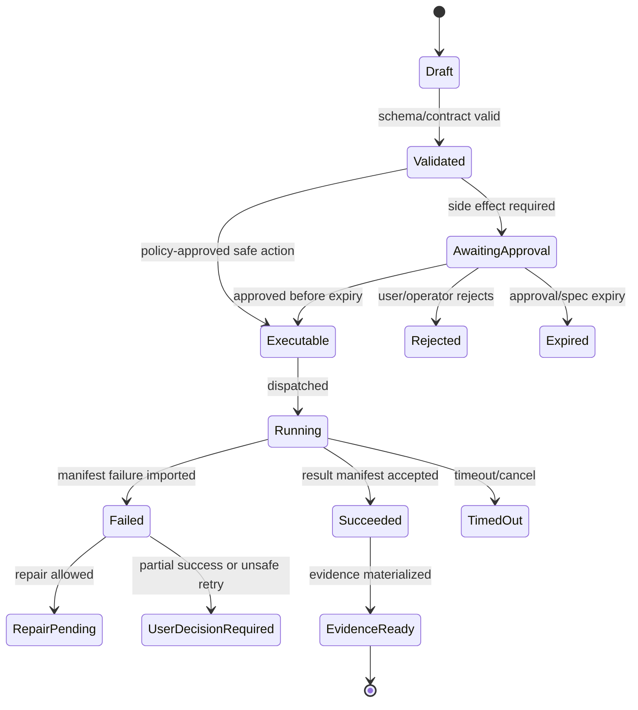

# Artifact Creator and Presentation Adapter

## V6.17 artifact execution choices

Artifact schemas, BMAD lineage, preview vocabulary, and adapter fixtures are shared. In `web_managed`, artifact generation/export runs against a cloud snapshot through an approved remote worker. In `windows_local`, an artifact may be generated in app-owned local storage or written to the selected folder only through local Airlock, checkpoint, and the local apply engine.

Optional cloud rendering from desktop is a `RemoteJobHandoff`: the exact selected inputs are uploaded with consent, the cloud produces an artifact/result, and the desktop imports it without granting cloud authority over the local folder.

## 1. Mission

Expose the existing presentation creation workflow as the seed Artifact Creator workflow by wrapping/adapting it into BMAD package shape without inventing a new PPT workflow.

## 2. Responsibilities

- Inventory existing workflow stages, prompts, templates, source handling, review steps, and export behavior.
- Map stages to BMAD workflow package contracts.
- Add SKILL.md/module.yaml/module-help.csv/config mapping.
- Preserve original behavior unless an adapter decision says otherwise.
- Expose user-friendly “Create presentation” flow.
- Create golden regression fixtures and compare outputs.

## 3. Explicit Non-Responsibilities

- Do not bypass Airlock.
- Do not mutate authoritative state outside the Runtime API state transition path.
- Do not hide policy decisions inside UI-only code.
- Do not let model text become executable behavior without typed validation.
- Do not introduce a separate runtime semantics path unless an ADR approves it.

## 4. Interfaces and Ports

| Interface | Purpose |
|---|---|
| IPresentationWorkflowAdapter | Maps existing stages to BMAD runtime steps. |
| IArtifactCreatorService | Creates artifact runs and preview/export records. |
| ITemplateResolver | Resolves templates/assets. |
| IExportWorker | Runs PPTX/export jobs. |
| IArtifactTraceWriter | Records sources, prompts, approvals, hashes. |

## 5. State and Lifecycle

Artifact workflow lifecycle: `created`, `source_ingesting`, `outline_ready`, `outline_approved`, `draft_generating`, `draft_ready`, `reviewing`, `refining`, `exporting`, `exported`, `evidence_ready`, `failed`.

## 6. Data Contracts

Adapter package shape:

```text
presentation-workflow-bmad/
  module.yaml
  module-help.csv
  skills/create-presentation/SKILL.md
  workflows/presentation.workflow.yaml
  templates/
  prompts/
  scripts/
  fixtures/golden/
  config/default.toml
```

Trace fields:

- source document refs/hashes;
- prompt/template versions;
- outline approval ID;
- draft review decisions;
- export format and file hash;
- assumptions and omissions;
- model-call IDs and costs.

## 7. Primary Flow

```text
Choose presentation
→ add sources
→ inventory/ingest sources
→ generate outline
→ approve outline
→ generate draft
→ review/refine
→ export PPTX
→ evidence/provenance summary
```

## 8. Implementation Steps

- Inventory current presentation workflow assets.
- Create mapping document stage-by-stage.
- Build adapter package skeleton.
- Implement artifact creator UI path.
- Implement outline approval card.
- Implement export worker integration.
- Create golden input/output regression fixture.
- Add evidence bundle fields specific to presentation generation.

## 9. Failure Modes and Mitigations

| Failure | Mitigation |
|---|---|
| Accidental workflow rewrite | Adapter tests compare against golden outputs. |
| Source provenance missing | Artifact export blocked without source hash list. |
| User forced into BMAD internals | UI entry is “Create presentation,” not package menu. |
| PPTX generation non-determinism | Use stable templates and capture export versions. |
| Large source documents | Chunk ingestion and summarize with references/hashes. |

## 10. Acceptance Criteria

- Existing workflow behavior is preserved by default.
- User can create a presentation from Artifact Creator UI.
- Outline requires approval before draft generation.
- Export produces PPTX with hash and evidence summary.
- Regression fixture detects adapter drift.

---

## v2 Review Improvements

### 1. Adapter-Not-Rewrite Rule

The existing presentation workflow is treated as the source asset. The runtime adds a BMAD adapter layer; it does not redesign the workflow logic unless an ADR explicitly records the change.

### 2. Adapter Inventory Checklist

| Asset | What To Capture |
|---|---|
| prompts | exact prompt text, variables, ordering, model requirements. |
| templates | slide layouts, style assumptions, placeholders. |
| source handling | accepted input types, chunking, citation rules. |
| stages | outline, draft, review, refine, export. |
| scripts | dependencies, command requirements, file outputs. |
| review points | human approval checkpoints. |
| exports | PPTX/PDF/markdown outputs and naming. |
| failure modes | missing source, bad template, export failure, image issue. |

### 3. Presentation Workflow State Machine

```text
source_collecting
→ source_inventory_ready
→ outline_proposed
→ outline_approved
→ draft_generating
→ draft_ready
→ revision_requested
→ export_proposed
→ export_approved
→ export_completed
→ evidence_ready
```

### 4. Artifact Provenance Requirements

Each exported presentation must record:

- input source file hashes;
- selected excerpts or source summary hashes;
- outline approval ID;
- template version/hash;
- model call IDs;
- generated slide manifest;
- export worker image digest;
- output file hashes;
- unresolved assumptions.

### 5. Adapter Package Shape

```text
presentation-adapter/
  SKILL.md
  module.yaml
  module-help.csv
  workflow.yaml
  prompts/
  templates/
  scripts/
  fixtures/
    input/
    golden/
  validation/
```

### 6. Regression Strategy

| Test | Expected Result |
|---|---|
| Golden input generates same outline structure. | Structural match, not byte-identical PPTX. |
| Missing source blocks outline generation. | Clear `SOURCE_REQUIRED` state. |
| Outline rejected by user. | No draft/export worker runs. |
| Template path outside package. | Airlock blocks. |
| Export worker fails. | Partial state `export_failed`, evidence includes logs. |

### 7. Artifact Creator UI Requirements

- User starts from “Create presentation,” not BMAD file names.
- Show source inventory before generation.
- Show outline as an approval card.
- Show slide draft preview before export.
- Export uses same `ApprovedExecutionSpec` flow for file writes.
- Evidence panel is mandatory after export.


---


---

## Implementation-depth contract

This file is part of the V6 implementation library. It is written as an implementation guide, not as a strategy memo. Every component must be built against the same system-wide constraints:

1. **The first executable slice comes before breadth.** The first demonstrable product must prove authenticated chat, workspace context, typed plan output, proposal creation, Airlock validation, approval, isolated execution, validation, checkpoint, and evidence.
2. **The delivery-specific authority owns lifecycle state.** The web Runtime API imports remote-worker facts into SQL; the signed desktop Rust host imports local-executor facts into SQLite. Workers, child processes, renderers, models, sync services, and support APIs do not advance authoritative lifecycle state.
3. **Airlock creates the only side-effect token.** Workspace writes, command runs, exports, package imports, dependency restores, and policy-sensitive actions require an `ApprovedExecutionSpec` issued by Airlock.
4. **The model does not own proposals.** Model Gateway returns typed model outputs. Run Orchestrator creates normalized `Proposal` records. Airlock validates proposals.
5. **No raw shell by default.** Commands are represented as `argv[]` plus policy metadata; `sh -c`, shell expansion, broad environment access, and open network access are blocked unless explicitly operator-approved.
6. **Every side effect is reconstructable.** Diffs, preimages, spec hashes, policy hashes, approvals, job image digests, result manifests, logs, artifacts, and rollback metadata must be traceable.
7. **Each module has ports.** Even inside a modular monolith, use explicit interfaces and contracts to avoid creating a god control plane.


## 1. Component identity

| Field | Value |
|---|---|
| Component | `Artifact Creator and Existing Presentation Adapter` |
| Area | `Artifact workflows` |
| Primary implementation package | `packages/presentation-workflow-adapter + artifact-exporter worker` |
| Runtime/technology | `BMAD package + React UX + Python export helpers` |
| First-slice priority | `after-core or supporting` |


## 2. Purpose

Expose the existing presentation creation workflow as the seed Artifact Creator workflow while preserving behavior and adding BMAD tracing, approvals, fixtures, and exports.

The implementation must be narrow enough to fit the corrected first vertical slice, but designed so BMAD package execution, the existing presentation adapter, Builder Studio, SkillOps, replay, and operator controls can plug into the same contracts later.


## 3. Owns / does not own

### Owns
- Presentation workflow inventory
- Adapter package
- Source ingestion checkpoints
- Outline approval
- Draft preview
- Export jobs
- Golden regression fixtures
- Provenance summary

### Does not own
- Inventing a new presentation workflow
- Bypassing original prompts/templates without ADR
- Raw external publishing in v1


## 4. Public/API surface and internal ports

### Required API/routes or callable operations
- `POST /api/artifacts/create`
- `POST /api/artifacts/{runId}/sources`
- `POST /api/artifacts/{runId}/outline`
- `POST /api/artifacts/{runId}/approve-outline`
- `POST /api/artifacts/{runId}/export`
- `GET /api/artifacts/{artifactId}/preview`


### Internal contract rules

- Every boundary uses typed, schema-versioned values. C# uses `Runtime.Contracts` / `Runtime.Domain`, Rust uses generated contract types plus `desktop-domain`, and TypeScript uses generated web or desktop facade types; no generated DTO grants runtime authority.
- External payloads must be schema-versioned. Internal objects may evolve faster but must not leak into OpenAPI without a contract version.
- Every state mutation must be idempotent or protected by optimistic concurrency.
- Every side-effect operation must receive an `ApprovedExecutionSpec` or be provably read-only.
- Every error response must use the standard error envelope with `code`, `message`, `correlationId`, `retryable`, and optional `detailsRef`.


### Starter interface/type sketch

```ts
export type UiLoadState = 'idle' | 'loading' | 'ready' | 'stale' | 'blocked' | 'error';

export interface RunEventViewModel {
  runId: string;
  eventId: string;
  kind: string;
  occurredAt: string;
  severity: 'info' | 'warning' | 'error';
  summary: string;
  payloadRef?: string;
}
```


## 5. State model

### Component states
- `sources_added`
- `sources_validated`
- `outline_proposed`
- `outline_approved`
- `draft_generated`
- `draft_reviewed`
- `export_requested`
- `export_approved`
- `exported`
- `regression_matched`


### Generic side-effect lifecycle





## 6. Persistence responsibilities

### SQL tables or domain records touched
- `ArtifactRun`
- `ArtifactSource`
- `ArtifactOutline`
- `ArtifactDraft`
- `ArtifactExport`
- `PresentationRegressionFixture`
- `ArtifactProvenance`

### Blob/object storage paths touched
- `artifacts/{runId}/sources/*`
- `artifacts/{runId}/outline.md`
- `artifacts/{runId}/draft.json`
- `artifacts/{runId}/exports/*.pptx`


### Persistence rules

- In `web_managed`, SQL stores lifecycle state, compact indexes, ownership metadata, and references. In `windows_local`, SQLite stores the corresponding local authority records.
- In `web_managed`, Blob stores large immutable payloads: snapshots, logs, diffs, manifests, artifacts, exports, packages, traces, and validation reports. In `windows_local`, encrypted local content-addressed storage holds authority-owned payloads; cloud upload is explicit and purpose-scoped.
- Any Blob payload referenced from SQL must include content hash, schema version, created timestamp, and retention class.
- No raw secrets, broad credentials, or unredacted prompt/context payloads are stored by default.
- Migrations must be forward-safe and testable against fixture data.


## 7. Detailed implementation steps


### Phase 0 — Contract and spike

1. Create or update the relevant ADR before implementation when the decision affects hosting, policy, security, data ownership, or external dependencies.

2. Define public DTOs and durable JSON schemas first. Do not let implementation classes silently become external contracts.

3. Create a minimal fixture that exercises the component without requiring the whole platform.

4. Add negative tests for the most dangerous bypass or failure case before adding the happy path.

5. Record assumptions in the component file and in the ADR index if they are not final.

6. For `Artifact Creator and Existing Presentation Adapter`, implement only the smallest behavior that proves its contract in the first executable slice, then add extended BMAD/Builder/artifact behavior after gate approval.


### Phase 1 — Skeleton implementation

1. Create the package/module/folder with explicit ports/interfaces and dependency direction rules.

2. Add dependency injection registration with narrow interfaces rather than passing broad services everywhere.

3. Implement persistence only through repository/store abstractions that expose business operations, not raw table access.

4. Emit structured events for every important state transition even if the UI does not yet render them.

5. Add unit tests for object creation, invalid input, authorization/policy denial, and idempotency where relevant.

6. For `Artifact Creator and Existing Presentation Adapter`, implement only the smallest behavior that proves its contract in the first executable slice, then add extended BMAD/Builder/artifact behavior after gate approval.


### Phase 2 — First vertical integration

1. Connect the component to the first executable slice only. Avoid adding full future scope before the vertical path works.

2. Use fake/stub adapters for expensive external systems until the contract is proven.

3. Make all side effects flow through Proposal → AirlockDecision → Approval/Grant → ApprovedExecutionSpec → Dispatch.

4. Persist large payloads to Blob and store only compact references in SQL.

5. Return UI-consumable run events so the Chat Workbench can render progress without polling raw tables.

6. For `Artifact Creator and Existing Presentation Adapter`, implement only the smallest behavior that proves its contract in the first executable slice, then add extended BMAD/Builder/artifact behavior after gate approval.


### Phase 3 — Production hardening

1. Add telemetry attributes, correlation IDs, redaction, and audit events.

2. Add retry, timeout, cancellation, and stale-state handling.

3. Add migration scripts and seed data for dev/test.

4. Add operator visibility for status, errors, budget/policy impact, and cleanup status.

5. Document runbooks for the top failure modes.

6. For `Artifact Creator and Existing Presentation Adapter`, implement only the smallest behavior that proves its contract in the first executable slice, then add extended BMAD/Builder/artifact behavior after gate approval.


### Phase 4 — Regression and release gate

1. Add contract tests against OpenAPI/JSON Schema.

2. Add replay fixtures or golden outputs where deterministic behavior is expected.

3. Add security tests for prompt injection, secret leakage, excessive agency, insecure output handling, and supply-chain drift where relevant.

4. Update release gate evidence with screenshots/log excerpts/manifests rather than informal claims.

5. Mark open risks and deferred v1.5/v2 items explicitly.

6. For `Artifact Creator and Existing Presentation Adapter`, implement only the smallest behavior that proves its contract in the first executable slice, then add extended BMAD/Builder/artifact behavior after gate approval.


## 8. Validation and test plan

### Required tests
- adapter preserves golden outline
- export hash recorded
- source citations retained
- approval required before export
- template asset missing produces actionable blocker


### Minimum test layers

| Layer | What to test | Required before merge |
|---|---|---|
| Unit | object validation, state transitions, parsing, policy predicates | yes |
| Contract | OpenAPI/JSON Schema compatibility, generated clients, worker manifests | yes for public/durable payloads |
| Integration | SQL + Blob references, dispatch/import, authz, Airlock boundary | yes for side-effect paths |
| E2E | chat → proposal → approval → execution → evidence | yes for first slice files |
| Replay/golden | BMAD package fixtures, presentation adapter, evidence bundle | yes before v1 beta |
| Security negative | prompt injection, secret leak, policy bypass, path traversal, raw shell | yes for all side-effect components |


## 9. Failure modes and recovery

| Failure | Detection | Required behavior | User/operator visibility |
|---|---|---|---|
| Invalid schema | contract validation | reject before persistence or dispatch | show actionable error with correlation ID |
| Stale proposal/preimage | hash mismatch | void proposal or require rebase/new proposal | show stale context warning |
| Approval expired | expiry check | reject dispatch | show re-approve option |
| Policy mismatch | policy hash mismatch | reject spec | operator audit event |
| Worker timeout | job monitor | mark job timed out; preserve partial logs | timeline event + retry option if safe |
| Manifest missing/invalid | manifest import validation | do not advance success state | incident/failure card |
| Partial success | checkpoint/validation state | enter `user_decision_required` or `kept_for_repair` | explicit decision card |
| Secret detected | scanner/redactor | redact and block if high confidence | security finding card/operator event |


## 10. Security and policy requirements

- Treat workspace files, package files, generated artifacts, model outputs, and logs as untrusted input.
- Never let untrusted content override system instructions, Airlock policy, command allowlists, network policy, or secret handling.
- Enforce project-level authorization on every read and write.
- Log security-relevant denials as audit events, but do not include raw secret values.
- Prefer fail-closed behavior when policy, identity, schema, or storage checks are ambiguous.
- Add negative tests for the most likely bypass path before writing happy-path code.


## 11. Observability

Minimum telemetry fields for this component:

- `correlation.id`
- `project.id`
- `run.id` when available
- `component.name`
- `operation.name`
- `operation.outcome`
- `policy.version` when applicable
- `spec.id` when applicable
- `job.id` when applicable
- `artifact.id` when applicable
- redaction counters, not raw secrets

Metrics to consider: request latency, state-transition count, policy denials, approval wait time, job duration, manifest import failures, schema validation failures, retry count, budget blocks, and evidence materialization time.


## 12. Acceptance criteria

- [ ] The component has a clear owner package and does not leak responsibilities into unrelated modules.
- [ ] Public routes/payloads are represented in OpenAPI/JSON Schema where applicable.
- [ ] Side-effect paths cannot execute without Airlock evaluation and `ApprovedExecutionSpec`.
- [ ] SQL lifecycle state is mutated only by the Runtime API/Application layer.
- [ ] Blob payloads have content hashes and schema versions.
- [ ] Tests include at least one negative/bypass case.
- [ ] Events and evidence are emitted for user-visible actions.
- [ ] The component is represented in the release gate matrix.
- [ ] The implementation does not introduce Cortex as a runtime namespace.
- [ ] Documentation includes deferred v1.5/v2 scope explicitly rather than silently omitting it.


## 13. Integration checklist

- [ ] Update `32 - Integration Contract Map.md` with any new caller/callee relationship.
- [ ] Update `25 - OpenAPI, Schemas, and Generated Clients.md` for public route or schema changes.
- [ ] Update `22 - Data Model - SQL and Blob.md`, `47 - Database DDL Starter.md`, or `48 - Blob Storage Layout.md` for persistence changes.
- [ ] Update `27 - Testing, Validation, and Replay.md` for new fixtures or replay needs.
- [ ] Update `33 - Release Gates and Acceptance Matrix.md` if the change affects release readiness.
- [ ] Add or update ADR in `31 - Architecture Decision Records.md` if the change alters architecture, hosting, policy, or security posture.


---

## Historical Revision Notes (V3 -> V4 Hardening Pass)
### V4 audit finding applied to this file
The v3 library was detailed, but several files still behaved like expanded planning notes rather than implementation handbooks. This pass adds enforceable implementation details: exact build sequence, explicit boundaries, input/output contracts, database/blob ownership, event names, failure states, tests, and release gates.

## System invariants this component must obey

1. The first delivered slice remains: **authenticated chat → workspace context → implementation plan → proposal → Airlock → approval → isolated job → validation → checkpoint → evidence**.
2. No worker image receives Azure SQL write credentials. Workers produce signed/hashed append-only manifests in Blob; the Runtime API imports them and advances SQL lifecycle state.
3. No file write, command run, dependency restore, package import, artifact export, checkpoint mutation, or rollback can execute without an `ApprovedExecutionSpec` minted by Airlock.
4. The Model Gateway returns typed model outputs only. The Run Orchestrator creates platform `Proposal` records. Airlock validates proposals and creates approved specs.
5. Commands are `argv[]` specs, not raw shell strings. Shell execution is a separate high-risk command class.
6. Every state transition emits a run event and trace event with correlation ID, actor/service principal, schema version, and payload hash or payload reference.
7. Every persisted object carries schema version, retention class, project scope, created/updated timestamps, and hash/provenance where relevant.
8. Any component that reads workspace content treats it as untrusted user-controlled input and cannot allow it to override system policy, command allowlists, approval requirements, or secrets handling.


## Component build card

| Field | Value |
|---|---|
| Component | `Artifact Creator and Presentation Adapter` |
| Primary package/path | `packages/presentation-workflow-adapter + workers/artifact-exporter` |
| Current implementation status | `v6-validated` |
| Required for first vertical slice | `after-first-slice or v1 extension` |

## Validated API/port touchpoints

- `POST /api/artifacts/create`
- `POST /api/artifacts/{artifactId}/outline-approval`
- `POST /api/artifacts/{artifactId}/generate`
- `POST /api/artifacts/{artifactId}/export`

## Validated domain events to implement or consume

- `artifact.intent.created`
- `presentation.workflow.mapped`
- `presentation.outline.ready`
- `presentation.export.started`
- `presentation.export.completed`

## Validated SQL ownership / indexes

- `artifacts`
- `artifact_sources`
- `artifact_versions`
- `artifact_approvals`
- `artifact_exports`

Implementation notes:

- Tables listed here are owned by their module or exposed through its port; other modules must not perform direct ad-hoc writes.
- Mutable lifecycle tables need optimistic concurrency tokens.
- All records need `project_id`, `schema_version`, `created_at`, `updated_at`, and retention classification where applicable.

## Validated Blob payload layout

- `artifacts/{artifactId}/sources/*`
- `artifacts/{artifactId}/drafts/*`
- `artifacts/{artifactId}/exports/*.pptx`
- `artifacts/{artifactId}/provenance.json`

Implementation notes:

- Blob payloads are content-addressed or hash-checked before import.
- SQL stores compact payload references, not bulky logs/prompts/artifacts.
- Retention class and redaction level must be explicit for every payload family.

## Validated step-by-step build procedure

1. Inventory the existing presentation workflow and preserve prompts, stages, templates, source handling, review steps, and export behavior.
2. Create BMAD wrapper package with SKILL.md, module.yaml, module-help.csv, workflow map, config map, fixtures, and golden-output tests.
3. Add approval checkpoints for source ingestion, outline, draft, refinement, and export.
4. Record source provenance, generated slide hashes, template versions, model calls, and assumptions.
5. Implement export worker as finite job with result manifest only; Runtime API imports export result.
6. Compare adapter output against golden workflow output before registering as seed Artifact Creator package.

## Validated edge cases that must be tested

| Edge case | Expected behavior |
|---|---|
| Duplicate API request with same idempotency key | Returns original result; no duplicate state transition or worker dispatch. |
| Stale proposal after newer checkpoint | Proposal is voided or requires rebase; approval is blocked. |
| Expired approval/spec | Side-effect endpoint rejects request; UI asks for refresh. |
| Unknown schema version | Import/read path rejects or routes to migration handler. |
| Blob payload hash mismatch | Runtime refuses import and creates security/audit finding. |
| User lacks project role | API returns access denied; no object existence leakage. |
| Workspace contains prompt injection in docs/code | Treated as untrusted content; cannot change system policy or tool permissions. |
| Worker crashes after writing partial logs | Execution becomes failed/unknown with partial log refs; retry uses same spec rules. |

## Validated release gate for this component

- Unit tests cover all domain transitions owned by this component.
- Contract tests cover all listed API touchpoints or port methods.
- Integration tests prove SQL/Blob responsibility boundaries.
- Security tests cover unauthorized access and malformed payloads.
- Replay fixture includes at least one success path and one failure path relevant to this component.
- Observability emits trace/span/log attributes with the shared correlation ID.
- Documentation examples compile or validate against JSON Schema/OpenAPI where relevant.

## V6.16 Azure execution and artifact-integrity lock

- The adapter, schemas, and golden-fixture assertions may run directly on the developer workstation; no local Docker daemon, Kubernetes cluster, storage emulator, model server, or renderer service is required or assumed.
- PPTX/PDF rendering, dependency restore, package import, and every other executable artifact operation run only as fixed Azure Container Apps Job templates built by Azure Container Registry Tasks or hosted CI. The local deterministic fake can validate contracts and state transitions, but is never an isolation boundary and cannot execute commands, scripts, dependencies, or untrusted content.
- Each export creates a new immutable `artifact_version`; retries never overwrite an earlier draft or export. SQL records the version graph and compact references, while Blob payloads remain content-addressed or hash-verified.
- The export result manifest must bind the approved execution spec, source hashes, template and renderer image digests, dependency lock hash, model profile and response identifiers, output hashes, component-license inventory, correlation ID, and worker identity before Runtime API import.
- Any inherited Hermes presentation asset carrying restrictive Anthropic terms is excluded unless a documented legal entitlement explicitly permits its use. The initial adapter may use only independently licensed or clean-room presentation assets.
- Phase 6A is the first artifact implementation milestone: typed planning and preview may precede it, but production rendering cannot be simulated locally or introduced as a second runtime path.
