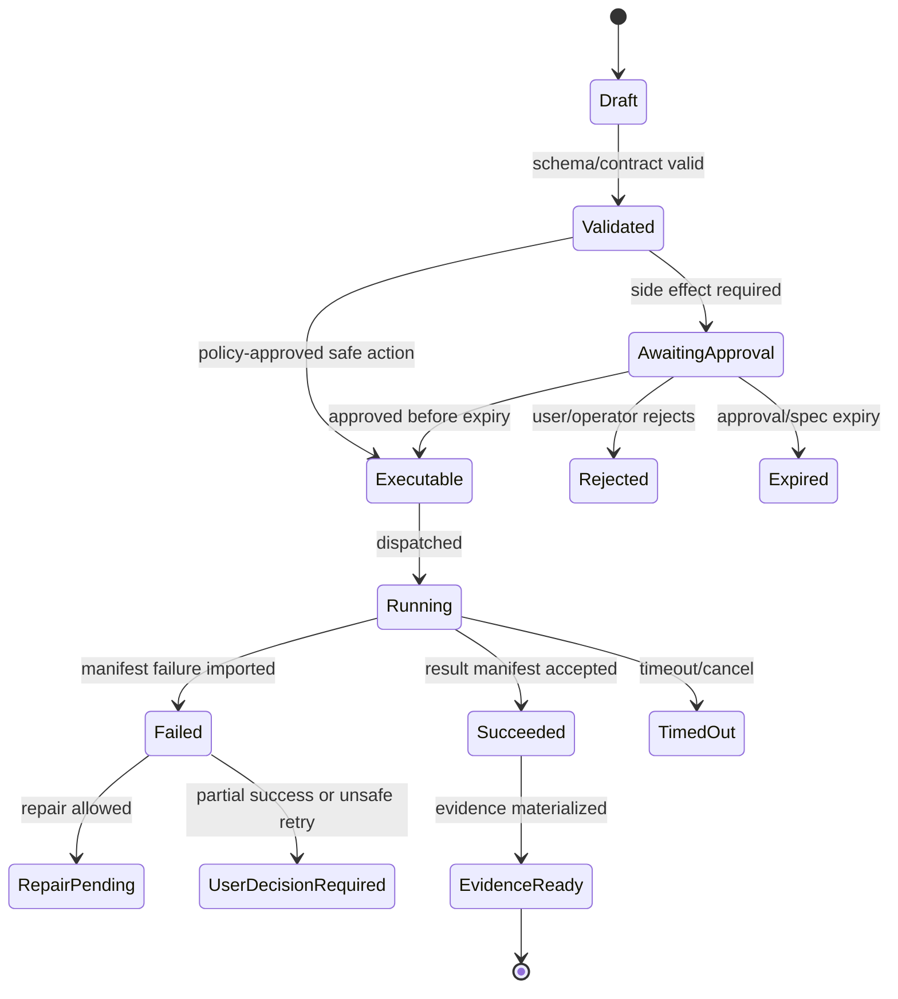

# Workspace Service

## V6.17 scope: `web_managed`

This service owns cloud imports, immutable Blob snapshots, job checkouts, cloud locks, preimages, checkpoints, rollback manifests, and retention for `web_managed`. It is not extracted or called as the ordinary workspace service for the installed desktop product.

The `windows_local` counterpart is the Rust `DesktopLocalWorkspace` in [[95 - Windows Local Workspace and Execution]], backed by user-selected folder capabilities and the state/recovery model in [[96 - Windows Local State, Evidence, Checkpoint, and Rollback]]. The two implementations share schema fixtures but never folder handles, mutable checkouts, locks, or checkpoint authority.

## 1. Mission

Own immutable snapshots, job checkouts, preimage hashes, write locks, checkpoints, rollback metadata, TTL cleanup, and workspace manifests for all code/artifact side effects.

## 2. Responsibilities

- Create content-addressed snapshots.
- Materialize job-scoped checkouts.
- Capture and verify preimage hashes.
- Enforce single-writer/multi-reader policy.
- Record checkpoints after successful or user-kept partial states.
- Support rollback to checkpoint.
- Clean expired checkouts and locks.

## 3. Explicit Non-Responsibilities

- Do not bypass Airlock.
- Do not mutate authoritative state outside the Runtime API state transition path.
- Do not hide policy decisions inside UI-only code.
- Do not let model text become executable behavior without typed validation.
- Do not introduce a separate runtime semantics path unless an ADR approves it.

## 4. Interfaces and Ports

| Interface | Purpose |
|---|---|
| IWorkspaceSnapshotStore | Create/read immutable snapshots. |
| ICheckoutManager | Materialize job checkouts. |
| IPreimageVerifier | Capture and verify hashes. |
| IWorkspaceLockManager | Acquire/release write locks. |
| ICheckpointStore | Record and rollback checkpoints. |
| IWorkspaceManifestWriter | Write manifests to Blob. |

## 5. State and Lifecycle

Workspace lifecycle: `created`, `snapshotting`, `indexed`, `checkout_created`, `locked_for_write`, `checkpointed`, `rollback_requested`, `rolled_back`, `expired`.

## 6. Data Contracts

Snapshot manifest:

```json
{
  "snapshot_id": "snap_...",
  "schema_version": "workspace-snapshot.v1",
  "source_ref": {"type":"upload|repo|generated", "ref":"..."},
  "files": [{"path":"src/App.tsx", "sha256":"...", "size":1234, "binary":false}],
  "ignore_rules_hash": "sha256:...",
  "created_at": "..."
}
```

Checkpoint manifest includes changed files, before/after hashes, execution ID, approval ID, reversibility status, and artifact refs.

## 7. Primary Flow

```text
Source import
→ immutable snapshot
→ async scan/index
→ context reads
→ proposal captures preimages
→ approval verifies preimages
→ checkout materialized
→ worker applies side effect
→ checkpoint recorded
→ rollback available
```

## 8. Implementation Steps

- Implement snapshot creation for uploaded archive fixture.
- Implement file manifest hashing and ignore rules.
- Implement checkout materialization in worker-accessible storage.
- Implement preimage hash capture at proposal time.
- Implement lock acquisition with timeout/expiry.
- Implement checkpoint and rollback operations.
- Implement TTL sweeper.
- Add tests for symlink/path escape and stale preimages.

## 9. Failure Modes and Mitigations

| Failure | Mitigation |
|---|---|
| Two runs edit same workspace | Single-writer lock and proposal voiding by newer checkpoint. |
| Stale preimages | Reject apply with exact changed files. |
| Path traversal/symlink escape | Canonicalize and reject escaped paths. |
| Rollback impossible | Mark checkpoint as non-reversible with reason before final evidence. |
| Orphaned checkouts | TTL sweeper and operator view. |

## 10. Acceptance Criteria

- Snapshot is immutable and content-addressed.
- Worker never edits canonical snapshot directly.
- Preimage mismatch blocks execution.
- Checkpoint can be rolled back in test fixture.
- Concurrent writer test blocks or queues second write.

---

## v2 Review Improvements

### 1. Workspace Object Model

| Object | Mutability | Storage | Purpose |
|---|---|---|---|
| `WorkspaceSnapshot` | immutable | SQL index + Blob manifest | Source state at a point in time. |
| `WorkspaceCheckout` | job-scoped mutable | worker volume + Blob metadata | Execution working copy. |
| `PreimageManifest` | immutable | SQL/Blob | Expected file hashes before patch. |
| `Checkpoint` | immutable | SQL index + Blob manifest | Approved post-execution state. |
| `RollbackPlan` | immutable once created | SQL/Blob | File-level reversal plan. |
| `WorkspaceLock` | temporary | SQL | Single-writer lock. |

### 2. Snapshot Manifest Example

```json
{
  "snapshot_id": "snap_001",
  "root_hash": "sha256:...",
  "files": [
    {"path":"src/App.tsx","sha256":"...","size":1234,"kind":"text"}
  ],
  "ignored_paths": ["node_modules", ".git"],
  "secret_redactions": [],
  "created_from": {"type":"upload|repo|fixture","ref":"..."}
}
```

### 3. Patch Apply Transaction

```text
1. Load proposal and approval.
2. Verify approval/spec not expired.
3. Acquire workspace write lock.
4. Verify base checkpoint still current.
5. Verify preimage hashes.
6. Dispatch worker with immutable spec.
7. On manifest import, verify output hashes.
8. Create checkpoint and rollback plan.
9. Release lock.
10. Emit evidence events.
```

### 4. Stale Proposal Rules

| Condition | Result |
|---|---|
| Newer checkpoint exists for same workspace. | Proposal becomes `voided_by_checkpoint`. |
| Preimage hash mismatch. | Proposal becomes `stale_preimage`. |
| File deleted since proposal. | Proposal requires regeneration. |
| Non-overlapping read-only context changed. | Warn only unless policy says context freshness required. |

### 5. Rollback Guarantees

Rollback is guaranteed only for file changes tracked in a checkpoint manifest. It is not guaranteed for:

- external network effects;
- package registry publication;
- remote Git push;
- database migrations run inside user code;
- commands that mutate external services.

Those side effects are blocked in v1 or require explicit non-reversible warnings.

### 6. Workspace Service Tests

- Two write locks cannot be active for same workspace.
- Read operations continue during a write lock.
- Preimage drift rejects patch before worker dispatch.
- Worker output manifest with unexpected path is rejected.
- Rollback restores exact prior file hashes for tracked files.
- TTL cleanup never deletes current checkpoint manifests.


---


---

## Implementation-depth contract

This file is part of the V6 implementation library. It is written as an implementation guide, not as a strategy memo. Every component must be built against the same system-wide constraints:

1. **The first executable slice comes before breadth.** The first demonstrable product must prove authenticated chat, workspace context, typed plan output, proposal creation, Airlock validation, approval, isolated execution, validation, checkpoint, and evidence.
2. **The delivery-specific authority owns lifecycle state.** The web Runtime API imports remote-worker facts into SQL; the signed desktop Rust host imports local-executor facts into SQLite. Workers, child processes, renderers, models, sync services, and support APIs do not advance authoritative lifecycle state.
3. **Airlock creates the only side-effect token.** Workspace writes, command runs, exports, package imports, dependency restores, and policy-sensitive actions require an `ApprovedExecutionSpec` issued by Airlock.
4. **The model does not own proposals.** Model Gateway returns typed model outputs. Run Orchestrator creates normalized `Proposal` records. Airlock validates proposals.
5. **No raw shell by default.** Commands are represented as `argv[]` plus policy metadata; `sh -c`, shell expansion, broad environment access, and open network access are blocked unless explicitly operator-approved.
6. **Every side effect is reconstructable.** Diffs, preimages, spec hashes, policy hashes, approvals, job image digests, result manifests, logs, artifacts, and rollback metadata must be traceable.
7. **Each module has ports.** Even inside a modular monolith, use explicit interfaces and contracts to avoid creating a god control plane.


## 1. Component identity

| Field | Value |
|---|---|
| Component | `Workspace Service` |
| Area | `Workspace platform` |
| Primary implementation package | `src/Workspace.Service` |
| Runtime/technology | `C# service + Blob/SQL storage + worker mount helpers` |
| First-slice priority | `core` |


## 2. Purpose

Own immutable snapshots, job checkouts, preimages, locks, checkpoints, rollback metadata, cleanup, and workspace integrity.

The implementation must be narrow enough to fit the corrected first vertical slice, but designed so BMAD package execution, the existing presentation adapter, Builder Studio, SkillOps, replay, and operator controls can plug into the same contracts later.


## 3. Owns / does not own

### Owns
- Snapshot manifests
- Checkout creation
- Preimage hashes
- Single-writer locks
- Checkpoint chain
- Rollback operations
- TTL cleanup
- Workspace integrity checks

### Does not own
- Run intent
- Model context selection
- Airlock policy decisions
- Worker command interpretation


## 4. Public/API surface and internal ports

### Required API/routes or callable operations
- `POST /api/workspaces/{id}/snapshots`
- `POST /api/snapshots/{id}/checkouts`
- `POST /api/workspaces/{id}/locks`
- `POST /api/checkouts/{id}/preimages`
- `POST /api/checkouts/{id}/checkpoints`
- `POST /api/checkpoints/{id}/rollback`


### Internal contract rules

- Every boundary uses typed, schema-versioned values. C# uses `Runtime.Contracts` / `Runtime.Domain`, Rust uses generated contract types plus `desktop-domain`, and TypeScript uses generated web or desktop facade types; no generated DTO grants runtime authority.
- External payloads must be schema-versioned. Internal objects may evolve faster but must not leak into OpenAPI without a contract version.
- Every state mutation must be idempotent or protected by optimistic concurrency.
- Every side-effect operation must receive an `ApprovedExecutionSpec` or be provably read-only.
- Every error response must use the standard error envelope with `code`, `message`, `correlationId`, `retryable`, and optional `detailsRef`.


### Starter interface/type sketch

```csharp
public interface IComponentPort<TRequest, TResult>
{
    Task<TResult> ExecuteAsync(TRequest request, CancellationToken ct);
}

public sealed record OperationContext(
    Guid ProjectId,
    Guid RunId,
    string ActorUserId,
    string CorrelationId,
    string PolicyVersion,
    DateTimeOffset RequestedAt);
```


## 5. State model

### Component states
- `snapshot_created`
- `checkout_created`
- `lock_acquired`
- `preimage_recorded`
- `patch_applied`
- `checkpoint_recorded`
- `rollback_ready`
- `rollback_completed`
- `expired`


### Generic side-effect lifecycle





## 6. Persistence responsibilities

### SQL tables or domain records touched
- `Workspace`
- `WorkspaceSnapshot`
- `SnapshotFile`
- `WorkspaceCheckout`
- `WorkspaceLock`
- `PreimageHash`
- `Checkpoint`
- `CheckpointFile`
- `RollbackOperation`

### Blob/object storage paths touched
- `snapshots/{snapshotId}/manifest.json`
- `snapshots/{snapshotId}/files/*`
- `checkouts/{checkoutId}/manifest.json`
- `checkpoints/{checkpointId}/manifest.json`


### Persistence rules

- In `web_managed`, SQL stores lifecycle state, compact indexes, ownership metadata, and references. In `windows_local`, SQLite stores the corresponding local authority records.
- In `web_managed`, Blob stores large immutable payloads: snapshots, logs, diffs, manifests, artifacts, exports, packages, traces, and validation reports. In `windows_local`, encrypted local content-addressed storage holds authority-owned payloads; cloud upload is explicit and purpose-scoped.
- Any Blob payload referenced from SQL must include content hash, schema version, created timestamp, and retention class.
- No raw secrets, broad credentials, or unredacted prompt/context payloads are stored by default.
- Migrations must be forward-safe and testable against fixture data.


## 7. Detailed implementation steps


### Phase 0 — Contract and spike

1. Create or update the relevant ADR before implementation when the decision affects hosting, policy, security, data ownership, or external dependencies.

2. Define public DTOs and durable JSON schemas first. Do not let implementation classes silently become external contracts.

3. Create a minimal fixture that exercises the component without requiring the whole platform.

4. Add negative tests for the most dangerous bypass or failure case before adding the happy path.

5. Record assumptions in the component file and in the ADR index if they are not final.

6. For `Workspace Service`, implement only the smallest behavior that proves its contract in the first executable slice, then add extended BMAD/Builder/artifact behavior after gate approval.


### Phase 1 — Skeleton implementation

1. Create the package/module/folder with explicit ports/interfaces and dependency direction rules.

2. Add dependency injection registration with narrow interfaces rather than passing broad services everywhere.

3. Implement persistence only through repository/store abstractions that expose business operations, not raw table access.

4. Emit structured events for every important state transition even if the UI does not yet render them.

5. Add unit tests for object creation, invalid input, authorization/policy denial, and idempotency where relevant.

6. For `Workspace Service`, implement only the smallest behavior that proves its contract in the first executable slice, then add extended BMAD/Builder/artifact behavior after gate approval.


### Phase 2 — First vertical integration

1. Connect the component to the first executable slice only. Avoid adding full future scope before the vertical path works.

2. Use fake/stub adapters for expensive external systems until the contract is proven.

3. Make all side effects flow through Proposal → AirlockDecision → Approval/Grant → ApprovedExecutionSpec → Dispatch.

4. Persist large payloads to Blob and store only compact references in SQL.

5. Return UI-consumable run events so the Chat Workbench can render progress without polling raw tables.

6. For `Workspace Service`, implement only the smallest behavior that proves its contract in the first executable slice, then add extended BMAD/Builder/artifact behavior after gate approval.


### Phase 3 — Production hardening

1. Add telemetry attributes, correlation IDs, redaction, and audit events.

2. Add retry, timeout, cancellation, and stale-state handling.

3. Add migration scripts and seed data for dev/test.

4. Add operator visibility for status, errors, budget/policy impact, and cleanup status.

5. Document runbooks for the top failure modes.

6. For `Workspace Service`, implement only the smallest behavior that proves its contract in the first executable slice, then add extended BMAD/Builder/artifact behavior after gate approval.


### Phase 4 — Regression and release gate

1. Add contract tests against OpenAPI/JSON Schema.

2. Add replay fixtures or golden outputs where deterministic behavior is expected.

3. Add security tests for prompt injection, secret leakage, excessive agency, insecure output handling, and supply-chain drift where relevant.

4. Update release gate evidence with screenshots/log excerpts/manifests rather than informal claims.

5. Mark open risks and deferred v1.5/v2 items explicitly.

6. For `Workspace Service`, implement only the smallest behavior that proves its contract in the first executable slice, then add extended BMAD/Builder/artifact behavior after gate approval.


## 8. Validation and test plan

### Required tests
- snapshot immutability enforced
- preimage drift rejects patch
- single-writer lock blocks concurrent apply
- rollback restores exact hashes
- TTL sweep preserves referenced evidence


### Minimum test layers

| Layer | What to test | Required before merge |
|---|---|---|
| Unit | object validation, state transitions, parsing, policy predicates | yes |
| Contract | OpenAPI/JSON Schema compatibility, generated clients, worker manifests | yes for public/durable payloads |
| Integration | SQL + Blob references, dispatch/import, authz, Airlock boundary | yes for side-effect paths |
| E2E | chat → proposal → approval → execution → evidence | yes for first slice files |
| Replay/golden | BMAD package fixtures, presentation adapter, evidence bundle | yes before v1 beta |
| Security negative | prompt injection, secret leak, policy bypass, path traversal, raw shell | yes for all side-effect components |


## 9. Failure modes and recovery

| Failure | Detection | Required behavior | User/operator visibility |
|---|---|---|---|
| Invalid schema | contract validation | reject before persistence or dispatch | show actionable error with correlation ID |
| Stale proposal/preimage | hash mismatch | void proposal or require rebase/new proposal | show stale context warning |
| Approval expired | expiry check | reject dispatch | show re-approve option |
| Policy mismatch | policy hash mismatch | reject spec | operator audit event |
| Worker timeout | job monitor | mark job timed out; preserve partial logs | timeline event + retry option if safe |
| Manifest missing/invalid | manifest import validation | do not advance success state | incident/failure card |
| Partial success | checkpoint/validation state | enter `user_decision_required` or `kept_for_repair` | explicit decision card |
| Secret detected | scanner/redactor | redact and block if high confidence | security finding card/operator event |


## 10. Security and policy requirements

- Treat workspace files, package files, generated artifacts, model outputs, and logs as untrusted input.
- Never let untrusted content override system instructions, Airlock policy, command allowlists, network policy, or secret handling.
- Enforce project-level authorization on every read and write.
- Log security-relevant denials as audit events, but do not include raw secret values.
- Prefer fail-closed behavior when policy, identity, schema, or storage checks are ambiguous.
- Add negative tests for the most likely bypass path before writing happy-path code.


## 11. Observability

Minimum telemetry fields for this component:

- `correlation.id`
- `project.id`
- `run.id` when available
- `component.name`
- `operation.name`
- `operation.outcome`
- `policy.version` when applicable
- `spec.id` when applicable
- `job.id` when applicable
- `artifact.id` when applicable
- redaction counters, not raw secrets

Metrics to consider: request latency, state-transition count, policy denials, approval wait time, job duration, manifest import failures, schema validation failures, retry count, budget blocks, and evidence materialization time.


## 12. Acceptance criteria

- [ ] The component has a clear owner package and does not leak responsibilities into unrelated modules.
- [ ] Public routes/payloads are represented in OpenAPI/JSON Schema where applicable.
- [ ] Side-effect paths cannot execute without Airlock evaluation and `ApprovedExecutionSpec`.
- [ ] SQL lifecycle state is mutated only by the Runtime API/Application layer.
- [ ] Blob payloads have content hashes and schema versions.
- [ ] Tests include at least one negative/bypass case.
- [ ] Events and evidence are emitted for user-visible actions.
- [ ] The component is represented in the release gate matrix.
- [ ] The implementation does not introduce Cortex as a runtime namespace.
- [ ] Documentation includes deferred v1.5/v2 scope explicitly rather than silently omitting it.


## 13. Integration checklist

- [ ] Update `32 - Integration Contract Map.md` with any new caller/callee relationship.
- [ ] Update `25 - OpenAPI, Schemas, and Generated Clients.md` for public route or schema changes.
- [ ] Update `22 - Data Model - SQL and Blob.md`, `47 - Database DDL Starter.md`, or `48 - Blob Storage Layout.md` for persistence changes.
- [ ] Update `27 - Testing, Validation, and Replay.md` for new fixtures or replay needs.
- [ ] Update `33 - Release Gates and Acceptance Matrix.md` if the change affects release readiness.
- [ ] Add or update ADR in `31 - Architecture Decision Records.md` if the change alters architecture, hosting, policy, or security posture.


---

## Historical Revision Notes (V3 -> V4 Hardening Pass)
### V4 audit finding applied to this file
The v3 library was detailed, but several files still behaved like expanded planning notes rather than implementation handbooks. This pass adds enforceable implementation details: exact build sequence, explicit boundaries, input/output contracts, database/blob ownership, event names, failure states, tests, and release gates.

## System invariants this component must obey

1. The first delivered slice remains: **authenticated chat → workspace context → implementation plan → proposal → Airlock → approval → isolated job → validation → checkpoint → evidence**.
2. No worker image receives Azure SQL write credentials. Workers produce signed/hashed append-only manifests in Blob; the Runtime API imports them and advances SQL lifecycle state.
3. No file write, command run, dependency restore, package import, artifact export, checkpoint mutation, or rollback can execute without an `ApprovedExecutionSpec` minted by Airlock.
4. The Model Gateway returns typed model outputs only. The Run Orchestrator creates platform `Proposal` records. Airlock validates proposals and creates approved specs.
5. Commands are `argv[]` specs, not raw shell strings. Shell execution is a separate high-risk command class.
6. Every state transition emits a run event and trace event with correlation ID, actor/service principal, schema version, and payload hash or payload reference.
7. Every persisted object carries schema version, retention class, project scope, created/updated timestamps, and hash/provenance where relevant.
8. Any component that reads workspace content treats it as untrusted user-controlled input and cannot allow it to override system policy, command allowlists, approval requirements, or secrets handling.


## Component build card

| Field | Value |
|---|---|
| Component | `Workspace Service` |
| Primary package/path | `src/Workspace.Service` |
| Current implementation status | `v6-validated` |
| Required for first vertical slice | `yes` |

## Validated API/port touchpoints

- `POST /api/projects/{projectId}/snapshots`
- `GET /api/workspaces/{workspaceId}/tree`
- `POST /api/workspaces/{workspaceId}/checkouts`
- `POST /api/workspaces/{workspaceId}/checkpoints`
- `POST /api/workspaces/{workspaceId}/rollback`

## Validated domain events to implement or consume

- `workspace.snapshot.created`
- `workspace.checkout.created`
- `workspace.preimage.captured`
- `workspace.preimage.drifted`
- `workspace.checkpoint.created`
- `workspace.rollback.completed`

## Validated SQL ownership / indexes

- `workspaces`
- `workspace_snapshots`
- `workspace_files`
- `workspace_checkouts`
- `workspace_locks`
- `preimage_hashes`
- `checkpoints`
- `rollback_records`

Implementation notes:

- Tables listed here are owned by their module or exposed through its port; other modules must not perform direct ad-hoc writes.
- Mutable lifecycle tables need optimistic concurrency tokens.
- All records need `project_id`, `schema_version`, `created_at`, `updated_at`, and retention classification where applicable.

## Validated Blob payload layout

- `snapshots/{snapshotId}/archive.tar.zst`
- `checkouts/{checkoutId}/manifest.json`
- `checkpoints/{checkpointId}/file-manifest.json`

Implementation notes:

- Blob payloads are content-addressed or hash-checked before import.
- SQL stores compact payload references, not bulky logs/prompts/artifacts.
- Retention class and redaction level must be explicit for every payload family.

## Validated step-by-step build procedure

1. Implement content-addressed immutable snapshots from uploaded zip first; Git clone integration comes later.
2. Create file manifest with path, canonical path, size, hash, media type, ignore status, and secret-scan status.
3. Implement single-writer/multi-reader lock policy and checkpoint chain.
4. Capture preimages at proposal time and verify before patch apply.
5. Reject symlink traversal, absolute paths, path casing collisions, and ignored/secret path mutations.
6. Implement rollback as new checkpoint derived from prior manifest, not destructive magic.

## Validated edge cases that must be tested

| Edge case | Expected behavior |
|---|---|
| Duplicate API request with same idempotency key | Returns original result; no duplicate state transition or worker dispatch. |
| Stale proposal after newer checkpoint | Proposal is voided or requires rebase; approval is blocked. |
| Expired approval/spec | Side-effect endpoint rejects request; UI asks for refresh. |
| Unknown schema version | Import/read path rejects or routes to migration handler. |
| Blob payload hash mismatch | Runtime refuses import and creates security/audit finding. |
| User lacks project role | API returns access denied; no object existence leakage. |
| Workspace contains prompt injection in docs/code | Treated as untrusted content; cannot change system policy or tool permissions. |
| Worker crashes after writing partial logs | Execution becomes failed/unknown with partial log refs; retry uses same spec rules. |

## Validated release gate for this component

- Unit tests cover all domain transitions owned by this component.
- Contract tests cover all listed API touchpoints or port methods.
- Integration tests prove SQL/Blob responsibility boundaries.
- Security tests cover unauthorized access and malformed payloads.
- Replay fixture includes at least one success path and one failure path relevant to this component.
- Observability emits trace/span/log attributes with the shared correlation ID.
- Documentation examples compile or validate against JSON Schema/OpenAPI where relevant.

## Odysseus-Informed Workspace and Upload Rules

Source: [[88 - Odysseus Source Code Review - Self-Hosted AI Workspace]].

Add these workspace-file invariants:

| Area | Rule |
|---|---|
| Upload ids | Upload ids are canonical, non-path identifiers; original filenames are display metadata only. |
| Upload metadata | Upload indexes are atomically written and include owner, media type, size, hash, created time, retention class, and source session. |
| Path confinement | Downloads, thumbnails, document sources, generated files, and file tools verify canonical paths stay inside the owning workspace/upload root. |
| Symlinks | Symlink escape is rejected for uploads, checkouts, thumbnails, generated PDFs, and file tool reads. |
| File tools | Read, grep, glob, and ls tools operate inside `FileToolWorkspaceScope` and filter sensitive paths before model exposure. |
| Document sources | PDFs, signatures, source images, and editor drafts use `DocumentSourceBinding` with owner checks independent of session lifetime. |

Sapphirus keeps the stronger worker isolation model, but the same upload and owner checks apply before any file reaches a worker.
