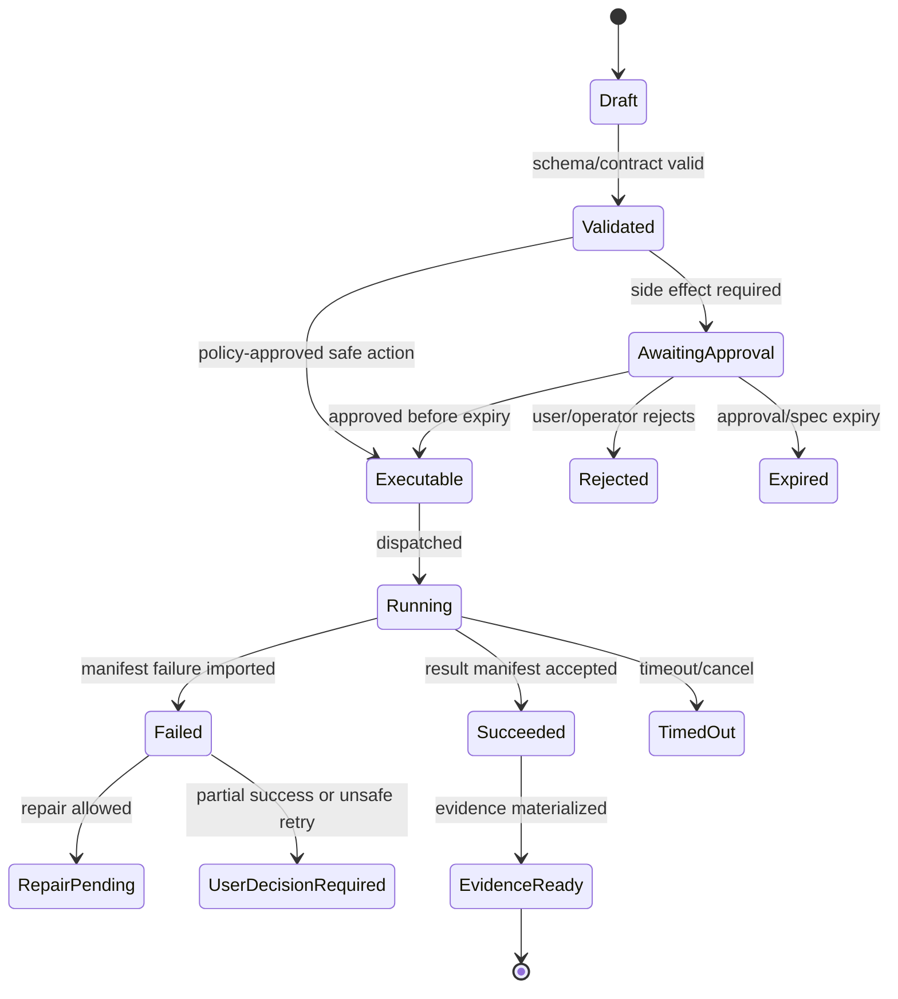

# Workspace Intelligence and Context Packs

## V6.17 context sources and egress

Context selection semantics, trust labels, provenance, redaction, token budgets, and `ContextPack` hashing are shared. Web scanners read only cloud snapshot authority. Desktop scanners run in Rust and read only through the selected-folder capability; paths exposed to the UI/model are relative and normalized.

Desktop model calls additionally produce a `ContextEgressManifest` containing item hashes, classification, redaction, purpose, size, retention/profile, and consent basis. Selecting a local folder does not consent to repository upload, evidence sync, telemetry payload upload, or a remote job.

## 1. Mission

Scan workspaces asynchronously, filter unsafe content, build minimal context packs, and provide grounded source context to the Orchestrator without turning indexing into a blocking API request path.

## 2. Responsibilities

- Detect languages/frameworks/package managers/test commands.
- Respect ignore rules and secret filters.
- Perform lexical search first.
- Perform structural indexing where useful.
- Build context packs with provenance and reasons.
- Invalidate context packs when checkpoints change.
- Treat workspace content as untrusted.

## 3. Explicit Non-Responsibilities

- Do not bypass Airlock.
- Do not mutate authoritative state outside the Runtime API state transition path.
- Do not hide policy decisions inside UI-only code.
- Do not let model text become executable behavior without typed validation.
- Do not introduce a separate runtime semantics path unless an ADR approves it.

## 4. Interfaces and Ports

| Interface | Purpose |
|---|---|
| IWorkspaceScanner | Async scan and index creation. |
| ISecretFilter | Detect and redact secrets. |
| ILexicalSearch | Search files/logs/artifacts. |
| IStructuralIndexer | Symbols/imports/routes/components. |
| IContextPackBuilder | Select snippets and explain selection. |
| IContextInvalidator | Void stale packs. |

## 5. State and Lifecycle

Context pack lifecycle: `requested`, `scanning_required`, `building`, `ready`, `used_by_model_call`, `stale`, `voided`, `expired`.

## 6. Data Contracts

Context pack:

```json
{
  "context_pack_id": "ctx_...",
  "snapshot_id": "snap_...",
  "checkpoint_id": "chk_...",
  "items": [
    {"kind":"file_snippet", "path":"src/App.tsx", "start":1, "end":80, "sha256":"...", "reason":"component under change"}
  ],
  "excluded": [{"path":".env", "reason":"secret path"}],
  "token_estimate": 4200
}
```

## 7. Primary Flow

Selection order:

```text
active BMAD artifact
→ user objective and recent thread
→ current diff/checkpoint/logs
→ lexical search
→ structural graph
→ validation logs
→ semantic retrieval only if needed
```

## 8. Implementation Steps

- Implement scan worker for repo fixture.
- Add ignore engine and secret path filters.
- Add lexical search endpoint.
- Add minimal structural index for TS/C# later.
- Implement context-pack selection reasons.
- Add stale invalidation by checkpoint ID.
- Add redaction before model calls and traces.

## 9. Failure Modes and Mitigations

| Failure | Mitigation |
|---|---|
| Indexing blocks API | Run scans as async jobs. |
| Secrets enter prompts | Secret filter blocks/redacts before context pack. |
| Context too broad | Budget-based selection and reason field. |
| Prompt injection in files | Mark all workspace content as untrusted in prompt assembly. |
| Stale context causes bad patch | Proposal stores context checkpoint and is voided on newer checkpoint. |

## 10. Acceptance Criteria

- Context pack shows selected and excluded files.
- Secrets fixture never reaches model payload.
- New checkpoint marks old context stale.
- Search works without semantic vector dependency.
- Context reasons are visible in UI.

---

## v2 Review Improvements

### 1. Async Indexing Rule

Workspace scans and structural indexing must run asynchronously from day one. The API may trigger or read index status, but request/response paths must not perform heavy repository walks.

### 2. Index Artifacts

| Artifact | Contents | Storage |
|---|---|---|
| `FileInventory` | path, size, hash, language, ignored/secret flags | Blob + SQL summary |
| `LexicalIndex` | ripgrep-compatible searchable text refs | worker artifact |
| `SymbolIndex` | functions/classes/routes/components/imports | Blob/SQL summary |
| `FrameworkProfile` | package manager, test/build/lint commands, framework hints | SQL JSON |
| `BmadProfile` | BMAD root, modules, skills, configs | SQL + BMAD Kernel |
| `SecretScanReport` | redacted findings and blocked files | restricted Blob |

### 3. Context Pack Construction Order

1. User-selected files/artifacts.
2. Active run objective and recent thread summary.
3. Current proposal/diff/checkpoint state.
4. Failing logs if repair mode.
5. Lexical search for exact identifiers/errors.
6. Symbol/call graph expansion.
7. BMAD artifact links.
8. Semantic search only if lexical/structural results are insufficient.

### 4. Context Pack Schema

```json
{
  "context_pack_id": "ctx_...",
  "workspace_snapshot_id": "snap_...",
  "budget": {"max_tokens": 24000, "estimated_tokens": 11200},
  "items": [
    {
      "kind": "file_snippet",
      "path": "src/App.tsx",
      "line_start": 1,
      "line_end": 80,
      "sha256": "...",
      "selection_reason": "contains dashboard title"
    }
  ],
  "redactions": [],
  "excluded_reasons": []
}
```

### 5. Secret Handling Rules

- `.env`, certificates, tokens, private keys, credentials, and known secret paths are excluded by default.
- Secret-like strings in otherwise relevant files are redacted before model calls.
- Raw secret scan reports are operator/security-visible only.
- A model can request a secret, but the runtime must refuse and explain a safe alternative.

### 6. Context Quality Tests

- Error message in test log retrieves failing test file and source file.
- Large binary files are excluded.
- Prompt-injection instructions in Start Here are included as untrusted content with boundary metadata.
- Context pack includes selection reasons for every file/snippet.
- Token budget overflow produces deterministic trimming, not random truncation.


---


---

## Implementation-depth contract

This file is part of the V6 implementation library. It is written as an implementation guide, not as a strategy memo. Every component must be built against the same system-wide constraints:

1. **The first executable slice comes before breadth.** The first demonstrable product must prove authenticated chat, workspace context, typed plan output, proposal creation, Airlock validation, approval, isolated execution, validation, checkpoint, and evidence.
2. **The delivery-specific authority owns lifecycle state.** The web Runtime API imports remote-worker facts into SQL; the signed desktop Rust host imports local-executor facts into SQLite. Workers, child processes, renderers, models, sync services, and support APIs do not advance authoritative lifecycle state.
3. **Airlock creates the only side-effect token.** Workspace writes, command runs, exports, package imports, dependency restores, and policy-sensitive actions require an `ApprovedExecutionSpec` issued by Airlock.
4. **The model does not own proposals.** Model Gateway returns typed model outputs. Run Orchestrator creates normalized `Proposal` records. Airlock validates proposals.
5. **No raw shell by default.** Commands are represented as `argv[]` plus policy metadata; `sh -c`, shell expansion, broad environment access, and open network access are blocked unless explicitly operator-approved.
6. **Every side effect is reconstructable.** Diffs, preimages, spec hashes, policy hashes, approvals, job image digests, result manifests, logs, artifacts, and rollback metadata must be traceable.
7. **Each module has ports.** Even inside a modular monolith, use explicit interfaces and contracts to avoid creating a god control plane.


## 1. Component identity

| Field | Value |
|---|---|
| Component | `Workspace Intelligence and Context Packs` |
| Area | `Context layer` |
| Primary implementation package | `src/Runtime.Application/Context + workers/repo-analyzer` |
| Runtime/technology | `C# orchestration + Python scanner/indexer` |
| First-slice priority | `core` |


## 2. Purpose

Scan workspaces asynchronously, respect ignore/secret rules, build lexical/structural indexes, and produce small auditable context packs for model calls.

The implementation must be narrow enough to fit the corrected first vertical slice, but designed so BMAD package execution, the existing presentation adapter, Builder Studio, SkillOps, replay, and operator controls can plug into the same contracts later.


## 3. Owns / does not own

### Owns
- Async scan jobs
- Ignore and secret filtering
- File summaries
- Lexical index
- Structural index
- Context-pack manifests
- Context provenance
- Staleness checks

### Does not own
- Model calls
- Proposal creation
- Worker side effects beyond scan output
- Bypassing user permissions


## 4. Public/API surface and internal ports

### Required API/routes or callable operations
- `POST /api/workspaces/{id}/scan`
- `GET /api/workspaces/{id}/index/status`
- `POST /api/context-packs`
- `GET /api/context-packs/{id}`
- `POST /api/context/search`


### Internal contract rules

- Every boundary uses typed, schema-versioned values. C# uses `Runtime.Contracts` / `Runtime.Domain`, Rust uses generated contract types plus `desktop-domain`, and TypeScript uses generated web or desktop facade types; no generated DTO grants runtime authority.
- External payloads must be schema-versioned. Internal objects may evolve faster but must not leak into OpenAPI without a contract version.
- Every state mutation must be idempotent or protected by optimistic concurrency.
- Every side-effect operation must receive an `ApprovedExecutionSpec` or be provably read-only.
- Every error response must use the standard error envelope with `code`, `message`, `correlationId`, `retryable`, and optional `detailsRef`.


### Starter interface/type sketch

```csharp
public interface IComponentPort<TRequest, TResult>
{
    Task<TResult> ExecuteAsync(TRequest request, CancellationToken ct);
}

public sealed record OperationContext(
    Guid ProjectId,
    Guid RunId,
    string ActorUserId,
    string CorrelationId,
    string PolicyVersion,
    DateTimeOffset RequestedAt);
```


## 5. State model

### Component states
- `scan_requested`
- `scan_dispatched`
- `scan_running`
- `scan_manifest_received`
- `index_imported`
- `context_pack_created`
- `stale`
- `blocked_secret_detected`


### Generic side-effect lifecycle





## 6. Persistence responsibilities

### SQL tables or domain records touched
- `WorkspaceScan`
- `FileIndex`
- `SymbolIndex`
- `SecretFinding`
- `ContextPack`
- `ContextPackItem`
- `ContextPackDecision`
- `ProjectMemory`

### Blob/object storage paths touched
- `indexes/{snapshotId}/lexical.sqlite`
- `indexes/{snapshotId}/symbols.jsonl`
- `context-packs/{runId}/{packId}.json`


### Persistence rules

- In `web_managed`, SQL stores lifecycle state, compact indexes, ownership metadata, and references. In `windows_local`, SQLite stores the corresponding local authority records.
- In `web_managed`, Blob stores large immutable payloads: snapshots, logs, diffs, manifests, artifacts, exports, packages, traces, and validation reports. In `windows_local`, encrypted local content-addressed storage holds authority-owned payloads; cloud upload is explicit and purpose-scoped.
- Any Blob payload referenced from SQL must include content hash, schema version, created timestamp, and retention class.
- No raw secrets, broad credentials, or unredacted prompt/context payloads are stored by default.
- Migrations must be forward-safe and testable against fixture data.


## 7. Detailed implementation steps


### Phase 0 — Contract and spike

1. Create or update the relevant ADR before implementation when the decision affects hosting, policy, security, data ownership, or external dependencies.

2. Define public DTOs and durable JSON schemas first. Do not let implementation classes silently become external contracts.

3. Create a minimal fixture that exercises the component without requiring the whole platform.

4. Add negative tests for the most dangerous bypass or failure case before adding the happy path.

5. Record assumptions in the component file and in the ADR index if they are not final.

6. For `Workspace Intelligence and Context Packs`, implement only the smallest behavior that proves its contract in the first executable slice, then add extended BMAD/Builder/artifact behavior after gate approval.


### Phase 1 — Skeleton implementation

1. Create the package/module/folder with explicit ports/interfaces and dependency direction rules.

2. Add dependency injection registration with narrow interfaces rather than passing broad services everywhere.

3. Implement persistence only through repository/store abstractions that expose business operations, not raw table access.

4. Emit structured events for every important state transition even if the UI does not yet render them.

5. Add unit tests for object creation, invalid input, authorization/policy denial, and idempotency where relevant.

6. For `Workspace Intelligence and Context Packs`, implement only the smallest behavior that proves its contract in the first executable slice, then add extended BMAD/Builder/artifact behavior after gate approval.


### Phase 2 — First vertical integration

1. Connect the component to the first executable slice only. Avoid adding full future scope before the vertical path works.

2. Use fake/stub adapters for expensive external systems until the contract is proven.

3. Make all side effects flow through Proposal → AirlockDecision → Approval/Grant → ApprovedExecutionSpec → Dispatch.

4. Persist large payloads to Blob and store only compact references in SQL.

5. Return UI-consumable run events so the Chat Workbench can render progress without polling raw tables.

6. For `Workspace Intelligence and Context Packs`, implement only the smallest behavior that proves its contract in the first executable slice, then add extended BMAD/Builder/artifact behavior after gate approval.


### Phase 3 — Production hardening

1. Add telemetry attributes, correlation IDs, redaction, and audit events.

2. Add retry, timeout, cancellation, and stale-state handling.

3. Add migration scripts and seed data for dev/test.

4. Add operator visibility for status, errors, budget/policy impact, and cleanup status.

5. Document runbooks for the top failure modes.

6. For `Workspace Intelligence and Context Packs`, implement only the smallest behavior that proves its contract in the first executable slice, then add extended BMAD/Builder/artifact behavior after gate approval.


### Phase 4 — Regression and release gate

1. Add contract tests against OpenAPI/JSON Schema.

2. Add replay fixtures or golden outputs where deterministic behavior is expected.

3. Add security tests for prompt injection, secret leakage, excessive agency, insecure output handling, and supply-chain drift where relevant.

4. Update release gate evidence with screenshots/log excerpts/manifests rather than informal claims.

5. Mark open risks and deferred v1.5/v2 items explicitly.

6. For `Workspace Intelligence and Context Packs`, implement only the smallest behavior that proves its contract in the first executable slice, then add extended BMAD/Builder/artifact behavior after gate approval.


## 8. Validation and test plan

### Required tests
- secret files excluded
- context pack includes provenance
- stale pack invalidated after checkpoint
- large binary skipped
- structural index failure degrades to lexical


### Minimum test layers

| Layer | What to test | Required before merge |
|---|---|---|
| Unit | object validation, state transitions, parsing, policy predicates | yes |
| Contract | OpenAPI/JSON Schema compatibility, generated clients, worker manifests | yes for public/durable payloads |
| Integration | SQL + Blob references, dispatch/import, authz, Airlock boundary | yes for side-effect paths |
| E2E | chat → proposal → approval → execution → evidence | yes for first slice files |
| Replay/golden | BMAD package fixtures, presentation adapter, evidence bundle | yes before v1 beta |
| Security negative | prompt injection, secret leak, policy bypass, path traversal, raw shell | yes for all side-effect components |


## 9. Failure modes and recovery

| Failure | Detection | Required behavior | User/operator visibility |
|---|---|---|---|
| Invalid schema | contract validation | reject before persistence or dispatch | show actionable error with correlation ID |
| Stale proposal/preimage | hash mismatch | void proposal or require rebase/new proposal | show stale context warning |
| Approval expired | expiry check | reject dispatch | show re-approve option |
| Policy mismatch | policy hash mismatch | reject spec | operator audit event |
| Worker timeout | job monitor | mark job timed out; preserve partial logs | timeline event + retry option if safe |
| Manifest missing/invalid | manifest import validation | do not advance success state | incident/failure card |
| Partial success | checkpoint/validation state | enter `user_decision_required` or `kept_for_repair` | explicit decision card |
| Secret detected | scanner/redactor | redact and block if high confidence | security finding card/operator event |


## 10. Security and policy requirements

- Treat workspace files, package files, generated artifacts, model outputs, and logs as untrusted input.
- Never let untrusted content override system instructions, Airlock policy, command allowlists, network policy, or secret handling.
- Enforce project-level authorization on every read and write.
- Log security-relevant denials as audit events, but do not include raw secret values.
- Prefer fail-closed behavior when policy, identity, schema, or storage checks are ambiguous.
- Add negative tests for the most likely bypass path before writing happy-path code.


## 11. Observability

Minimum telemetry fields for this component:

- `correlation.id`
- `project.id`
- `run.id` when available
- `component.name`
- `operation.name`
- `operation.outcome`
- `policy.version` when applicable
- `spec.id` when applicable
- `job.id` when applicable
- `artifact.id` when applicable
- redaction counters, not raw secrets

Metrics to consider: request latency, state-transition count, policy denials, approval wait time, job duration, manifest import failures, schema validation failures, retry count, budget blocks, and evidence materialization time.


## 12. Acceptance criteria

- [ ] The component has a clear owner package and does not leak responsibilities into unrelated modules.
- [ ] Public routes/payloads are represented in OpenAPI/JSON Schema where applicable.
- [ ] Side-effect paths cannot execute without Airlock evaluation and `ApprovedExecutionSpec`.
- [ ] SQL lifecycle state is mutated only by the Runtime API/Application layer.
- [ ] Blob payloads have content hashes and schema versions.
- [ ] Tests include at least one negative/bypass case.
- [ ] Events and evidence are emitted for user-visible actions.
- [ ] The component is represented in the release gate matrix.
- [ ] The implementation does not introduce Cortex as a runtime namespace.
- [ ] Documentation includes deferred v1.5/v2 scope explicitly rather than silently omitting it.


## 13. Integration checklist

- [ ] Update `32 - Integration Contract Map.md` with any new caller/callee relationship.
- [ ] Update `25 - OpenAPI, Schemas, and Generated Clients.md` for public route or schema changes.
- [ ] Update `22 - Data Model - SQL and Blob.md`, `47 - Database DDL Starter.md`, or `48 - Blob Storage Layout.md` for persistence changes.
- [ ] Update `27 - Testing, Validation, and Replay.md` for new fixtures or replay needs.
- [ ] Update `33 - Release Gates and Acceptance Matrix.md` if the change affects release readiness.
- [ ] Add or update ADR in `31 - Architecture Decision Records.md` if the change alters architecture, hosting, policy, or security posture.


---

## Historical Revision Notes (V3 -> V4 Hardening Pass)
### V4 audit finding applied to this file
The v3 library was detailed, but several files still behaved like expanded planning notes rather than implementation handbooks. This pass adds enforceable implementation details: exact build sequence, explicit boundaries, input/output contracts, database/blob ownership, event names, failure states, tests, and release gates.

## System invariants this component must obey

1. The first delivered slice remains: **authenticated chat → workspace context → implementation plan → proposal → Airlock → approval → isolated job → validation → checkpoint → evidence**.
2. No worker image receives Azure SQL write credentials. Workers produce signed/hashed append-only manifests in Blob; the Runtime API imports them and advances SQL lifecycle state.
3. No file write, command run, dependency restore, package import, artifact export, checkpoint mutation, or rollback can execute without an `ApprovedExecutionSpec` minted by Airlock.
4. The Model Gateway returns typed model outputs only. The Run Orchestrator creates platform `Proposal` records. Airlock validates proposals and creates approved specs.
5. Commands are `argv[]` specs, not raw shell strings. Shell execution is a separate high-risk command class.
6. Every state transition emits a run event and trace event with correlation ID, actor/service principal, schema version, and payload hash or payload reference.
7. Every persisted object carries schema version, retention class, project scope, created/updated timestamps, and hash/provenance where relevant.
8. Any component that reads workspace content treats it as untrusted user-controlled input and cannot allow it to override system policy, command allowlists, approval requirements, or secrets handling.


## Component build card

| Field | Value |
|---|---|
| Component | `Workspace Intelligence and Context Packs` |
| Primary package/path | `workers/repo-analyzer + src/Runtime.Application/Context` |
| Current implementation status | `v6-validated` |
| Required for first vertical slice | `yes` |

## Validated API/port touchpoints

- `POST /api/workspaces/{workspaceId}/scan`
- `GET /api/workspaces/{workspaceId}/search`
- `POST /api/runs/{runId}/context-packs`
- `GET /api/context-packs/{contextPackId}`

## Validated domain events to implement or consume

- `workspace.scan.requested`
- `workspace.scan.completed`
- `context.search.completed`
- `context.pack.created`
- `context.pack.invalidated`

## Validated SQL ownership / indexes

- `workspace_scan_runs`
- `workspace_symbols`
- `workspace_search_index`
- `context_packs`
- `context_pack_items`

Implementation notes:

- Tables listed here are owned by their module or exposed through its port; other modules must not perform direct ad-hoc writes.
- Mutable lifecycle tables need optimistic concurrency tokens.
- All records need `project_id`, `schema_version`, `created_at`, `updated_at`, and retention classification where applicable.

## Validated Blob payload layout

- `indexes/{snapshotId}/lexical.sqlite`
- `indexes/{snapshotId}/symbols.jsonl`
- `context-packs/{contextPackId}.json`

Implementation notes:

- Blob payloads are content-addressed or hash-checked before import.
- SQL stores compact payload references, not bulky logs/prompts/artifacts.
- Retention class and redaction level must be explicit for every payload family.

## Validated step-by-step build procedure

1. Run scanning asynchronously from day one; never block chat API requests on full repo indexing.
2. Use lexical search and structural metadata before vector search.
3. Store context pack item provenance: file hash, line range, selection reason, token estimate, redaction status.
4. Invalidate context packs when checkpoint changes or source file preimage no longer matches.
5. Exclude secrets, binaries, generated folders, vendor folders, and oversized files from prompt context by default.
6. Emit compact summaries for UI, not raw massive context dumps.

## Validated edge cases that must be tested

| Edge case | Expected behavior |
|---|---|
| Duplicate API request with same idempotency key | Returns original result; no duplicate state transition or worker dispatch. |
| Stale proposal after newer checkpoint | Proposal is voided or requires rebase; approval is blocked. |
| Expired approval/spec | Side-effect endpoint rejects request; UI asks for refresh. |
| Unknown schema version | Import/read path rejects or routes to migration handler. |
| Blob payload hash mismatch | Runtime refuses import and creates security/audit finding. |
| User lacks project role | API returns access denied; no object existence leakage. |
| Workspace contains prompt injection in docs/code | Treated as untrusted content; cannot change system policy or tool permissions. |
| Worker crashes after writing partial logs | Execution becomes failed/unknown with partial log refs; retry uses same spec rules. |

## Validated release gate for this component

- Unit tests cover all domain transitions owned by this component.
- Contract tests cover all listed API touchpoints or port methods.
- Integration tests prove SQL/Blob responsibility boundaries.
- Security tests cover unauthorized access and malformed payloads.
- Replay fixture includes at least one success path and one failure path relevant to this component.
- Observability emits trace/span/log attributes with the shared correlation ID.
- Documentation examples compile or validate against JSON Schema/OpenAPI where relevant.

## Hermes Deep-Review Context Compression Rules

Source: [[87 - Hermes Deep Review - Extension Runtime and Operational Contracts]].

Context packs and compression must be auditable, not invisible prompt surgery.

| Rule | Requirement |
|---|---|
| `ContextCompressionRecord` | Store threshold, token counts, protected head/tail ranges, summary template version, compression model, retained ranges, dropped ranges, and previous-summary id. |
| Tool grouping | Compression must preserve tool-call/tool-result adjacency or explicitly sanitize orphaned pairs. |
| Summary capacity | The summary model context limit must be at least the main model context limit; otherwise fail closed and keep the original context state. |
| Context provenance | Every summarized item must trace back to original message ids or context-pack item ids. |
| Invalidation | Compression summaries are invalidated when their source context pack hash, tool schema hash, or protected tail messages change. |
| User visibility | Operator/debug views should show compression happened, why it happened, and which regions were summarized without exposing raw secrets. |

Second-pass additions verified directly in Hermes `agent/context_compressor.py`:

- summaries use reference-only historical headings — never "Next Steps"/"Remaining Work" phrasing that a model could read as active instructions;
- the summarizer preamble treats prior turns as source material (filter-safe), so summarizing injected content cannot elevate it to instruction status;
- a cheap deterministic pre-pass may prune oversized tool outputs in a candidate copy before LLM summarization spend; unlike the reviewed Hermes path, Sapphirus never mutates the authoritative transcript until the complete compression result validates and commits atomically;
- tail protection is token-budget based, not a fixed message count, and the summary budget scales with the amount of content compressed;
- summaries update iteratively (each compaction feeds the previous summary) so information survives multiple compactions;
- sensitive text is redacted before it reaches the summarizer model.

## Odysseus-Informed Context Pack Additions

Source: [[88 - Odysseus Source Code Review - Self-Hosted AI Workspace]].

Context pack builders must emit:

| Field | Purpose |
|---|---|
| `trust_class` | Distinguishes first-party source, user-authored source, external fetched source, tool output, memory, and skill/package text. |
| `untrusted_context_envelope_id` | Links each untrusted payload to the guard text and delimiter escaping used before model assembly. |
| `owner_scope` | Preserves the owner filter that allowed the item into context. |
| `token_budget_lane` | Marks whether the item fits small, medium, large, or long-context model lanes. |
| `compaction_priority` | Tells trimming logic what can be summarized, truncated, preserved, or dropped. |

The scanner may produce profile-appropriate summaries for constrained evaluated Azure deployments so the Model Gateway does not improvise unsafe truncation at call time. This does not create a local-model requirement.

## Odysseus Deep-Dive: Foreground Activity Gate

Source: Odysseus `src/interactive_gate.py`, reviewed directly in `_source_review/odysseus-dev`.

Background scanning and context-pack production must yield to interactive traffic:

| Rule | Requirement |
|---|---|
| Quiet-period gate | Background scan/index/pack jobs start only after interactive API traffic has been quiet for a configured window (Odysseus default ~1.5s); a burst of user activity defers them again. |
| Bounded deferral | The gate has a configurable maximum wait (0 = wait indefinitely); operators choose whether background freshness or foreground latency wins under sustained load. |
| Operator toggle | The gate is a named, documented setting, not an emergent scheduling accident; it can be disabled in test environments. |
| Scope | The gate applies to workspace scans, embedding/index refreshes, retention sweeps, and scheduled background jobs — not to worker executions the user explicitly approved, which are foreground work regardless of channel. |

## Odysseus Deep-Dive: Adaptive Input Budget Contract

Source: Odysseus `src/context_budget.py`. This makes the `AdaptiveContextBudget` contract in [[12 - Run Orchestrator and Agent Kernel]] concrete:

- the default budget value acts as an "auto" sentinel: when the user has not explicitly set a budget, the effective budget scales to a headroom fraction (~0.85) of the model's discovered context window, capped by a hard ceiling;
- an explicit non-default user budget is honored exactly, clamped only to a *known* model window — the hard ceiling applies to auto-scaling, not to deliberate user choices;
- when the model's context window is unknown or unverified, the budget stays at the conservative default and never scales off an unproven window;
- the computation is a pure function with unit tests; the pack builder consumes its output rather than re-deriving budgets per call site.

## V6.16 context, compression, and memory truth rules

- `ContextPack` is deterministic for owner scope, workspace/BMAD artifact snapshot, query/purpose, trust/redaction policy, token budget, tool-availability hash, and selection algorithm version. Every item has a source hash/ref and selection/drop reason.
- Model context window/modality/tool/schema facts come from the exact `ProviderCapabilities` attached to the active `ModelProfile`; a provider/model name or unknown window never causes optimistic budget expansion.
- Lexical and structural/metadata retrieval remain the baseline. Embeddings/vector retrieval is adopted only after frozen relevance, owner-filtering, privacy/deletion, re-index, latency, and cost evidence passes; global top-k followed by owner filtering is rejected.
- Compression is transactional: original transcript/context remains byte-identical until candidate summary, protected ranges, references, redaction, token counts, and canonical hashes validate. Failure/abort returns the original without the Hermes-style pre-pruning mutation.
- A summary, recalled memory, web/file/package text, or tool result is always an `UntrustedContextEnvelope`, never instruction/policy/artifact truth.
- Memory promotion consumes only accepted finalized BMAD/runtime state through a durable `MemoryPromotionProposal` and outbox. Failed/incomplete turns, unimported worker output, or model-written “remember this” text cannot silently become durable knowledge.
- Deletion/supersession operates on owner/source/evidence-scoped records and rebuilds projections/vector indexes; deleting one vector row is not represented as complete privacy compliance.
