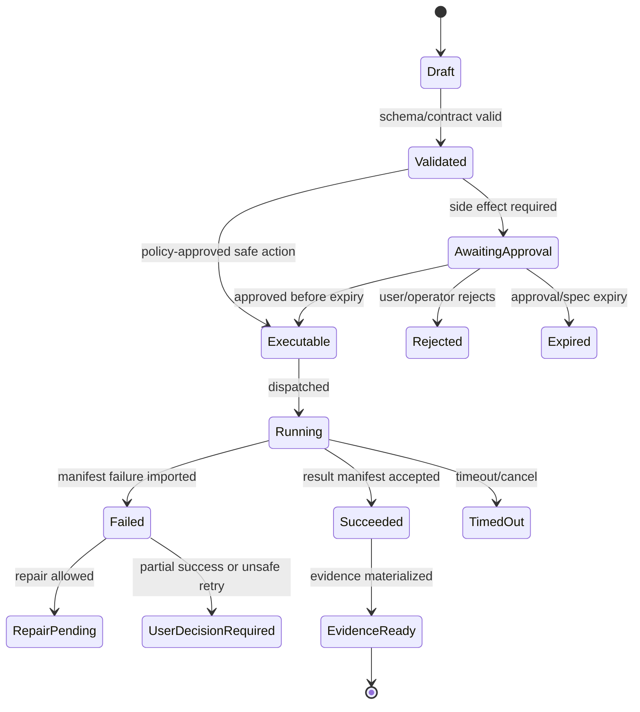

# Model Gateway and Microsoft Foundry

## V6.17 model-access paths

The provider-neutral profile, capability, schema-projection, evaluation, fallback, and evidence contracts are shared. `web_managed` calls the Model Gateway inside the cloud control plane. `windows_local` calls a dedicated Azure Model Access API with an Entra access token; the service uses managed identity/provider credentials and returns typed output to the Rust host.

No provider key is stored on the desktop. The Model Access API is not a proxy for filesystem/process actions and cannot mint a local execution spec. Every desktop request binds an approved model profile and a previewable `ContextEgressManifest`; source, prompts, paths, and terminal output are excluded from telemetry by default. See [[98 - Azure Support Plane for Windows Desktop]].

## 1. Mission

Centralize model access, enforce structured outputs, manage model profiles, budgets, quotas, retries, redaction, and telemetry while keeping proposal construction and policy enforcement outside the gateway.

## 2. Responsibilities

- Call Azure AI Foundry/Azure OpenAI through one gateway.
- Validate JSON Schema structured outputs.
- Route by call type and model profile.
- Capture token/cost/latency metrics.
- Apply quota and budget controls.
- Redact prompts/context according to trace policy.
- Resolve provider/deployment capabilities, credential scope, data residency, and retention mode for every call.
- Project canonical schemas into provider-supported Structured Outputs schemas and validate the result against both.
- Gate model/prompt/context profile promotion with immutable evaluation evidence.
- Return typed model outputs only.

## 3. Explicit Non-Responsibilities

- Do not bypass Airlock.
- Do not mutate authoritative state outside the Runtime API state transition path.
- Do not hide policy decisions inside UI-only code.
- Do not let model text become executable behavior without typed validation.
- Do not introduce a separate runtime semantics path unless an ADR approves it.
- Do not make provider response chains, compaction, hosted tools, or stored conversations authoritative state.

## 4. Interfaces and Ports

| Interface | Purpose |
|---|---|
| IModelGateway | Generic structured completion port. |
| IModelProfileStore | Profiles, deployment names, limits. |
| IPromptAssembler | Build prompt from trusted instructions and untrusted context sections. |
| ISchemaValidator | Validate output before returning. |
| IBudgetManager | Check and reserve run/project budget. |
| IModelTelemetry | Emit model spans and metrics. |
| IProviderCapabilityResolver | Resolve supported API/features for the exact provider deployment, region, and model snapshot. |
| IProviderSchemaProjector | Compile canonical JSON Schema into the provider-supported subset and retain both hashes. |
| IModelEvaluationGate | Promote or roll back versioned model/prompt/context profiles from immutable evaluation evidence. |

## 5. State and Lifecycle

Model call lifecycle: `queued`, `budget_checked`, `prompt_assembled`, `sent`, `schema_validating`, `retrying`, `succeeded`, `failed_schema`, `failed_provider`, `cancelled`.

## 6. Data Contracts

Call types:

| Call Type | Output |
|---|---|
| `classify_intent` | intent, confidence, missing inputs. |
| `create_implementation_plan` | steps, affected files, commands, risks, validation. |
| `propose_patch` | patch operations, rationale, tests. |
| `propose_command` | argv, cwd, expected effect, network mode. |
| `analyze_failure` | root cause, evidence, fix strategy. |
| `repair_patch` | minimal patch, expected fix. |
| `advise_next_step` | BMAD action recommendation and blockers. |
| `artifact_outline` | sections/slides, source mapping, assumptions. |

Gateway output never equals executable action.

## 7. Primary Flow

```text
Orchestrator requests typed output
→ budget/quota check
→ prompt assembly with untrusted context boundary
→ Azure model call with structured output/schema
→ schema validation
→ telemetry + redacted trace ref
→ typed output returned to Orchestrator
```

## 8. Implementation Steps

- Implement model profile config.
- Implement fake deterministic model for tests.
- Implement Azure OpenAI structured output adapter.
- Implement JSON Schema validation and retry-on-schema-failure.
- Implement budget reservation/release.
- Implement redacted trace payload ref.
- Add metrics: latency, tokens, schema failures, retries, cost.

## 9. Failure Modes and Mitigations

| Failure | Mitigation |
|---|---|
| Gateway becomes agent | Return typed outputs only; no Proposal creation. |
| Schema unsupported/too complex | Keep schemas shallow and tested in Phase 0. |
| Cost runaway | Per-run/project/user budgets and queue classes. |
| Prompt injection | Separate trusted instructions from quoted untrusted workspace content. |
| Provider outage | Classify provider failure and surface an evaluated alternative profile; never silently cross credential, residency, tool, schema, or capability boundaries. |
| Provider retention conflicts with policy | Send `store=false`; keep run/conversation/context authority in Sapphirus. Defer provider background mode when it requires stored state. |
| Provider schema subset rejects canonical contract | Project to the supported subset, retain projection/canonical hashes, validate against the full canonical schema, or split the generation. Never weaken domain invariants silently. |

## 10. Acceptance Criteria

- Every model call has call type and schema version.
- Every model call records purpose, provider/deployment capability snapshot, prompt/tool/context/schema hashes, credential binding, retention mode, and evaluated fallback policy.
- Invalid schema response does not reach Orchestrator.
- Budget checks occur before provider call.
- Model traces are redacted by default.
- Fake gateway supports replay tests.

---

## v2 Review Improvements

### 1. Gateway Contract

The Model Gateway owns provider access and structured output enforcement. It returns `ModelOutput<T>` only.

```csharp
public sealed record ModelOutput<T>(
    T Value,
    string OutputSchemaId,
    string OutputHash,
    string ModelProfile,
    UsageMetrics Usage,
    RedactionSummary Redactions,
    IReadOnlyList<ModelWarning> Warnings);
```

It does not create platform proposals, approve actions, call Workspace Service, or call Execution Dispatcher.

### 2. Model Profiles

| Profile | Use | Constraints |
|---|---|---|
| `cheap-classifier` | intent, route, simple extraction | low latency/cost. |
| `planner` | implementation plan, BMAD next step | structured output mandatory. |
| `patcher` | patch proposal | strict schema, path policy context. |
| `reviewer` | quality/security review | cannot approve own output. |
| `repair` | failure analysis/minimal patch | requires failure logs and cap. |
| `artifact-writer` | presentation/report generation | provenance and source references required. |

### 3. Queue Classes

| Queue | Calls | Policy |
|---|---|---|
| interactive | chat intent, small plan | strict latency budget. |
| coding | patch/repair/review | cost and attempt caps. |
| artifact | long generation | queue + progress events. |
| validation | model-assisted quality review | lower priority. |
| operator | admin analysis | restricted access. |

### 4. Structured Output Failure Handling

| Failure | Action |
|---|---|
| schema validation failure | retry once with schema error summary. |
| repeated schema failure | stop and create `model_output_invalid`. |
| over-large patch | ask for smaller plan or split proposal. |
| unsafe path proposal | keep typed output but classify blocked proposal. |
| model timeout | resumable run state with retry option. |
| budget exceeded | pause run and show budget card. |

### 5. Prompt Assembly Boundaries

Prompts are assembled from:

- system/runtime instructions;
- task template;
- context pack summary and refs;
- redacted snippets;
- schema instructions;
- policy summary.

Workspace content is always marked as untrusted. It may never override runtime instructions or Airlock policy.

### 6. Model Gateway Tests

- Invalid JSON output is not converted into a proposal.
- Schema-valid but unsafe path still becomes blocked proposal after Orchestrator classification.
- Raw context is not persisted in production trace view unless privileged retention is enabled.
- Cost metrics are recorded for every provider call.
- Retry does not duplicate model call records without idempotency key.


---


---

## Implementation-depth contract

This file is part of the V6 implementation library. It is written as an implementation guide, not as a strategy memo. Every component must be built against the same system-wide constraints:

1. **The first executable slice comes before breadth.** The first demonstrable product must prove authenticated chat, workspace context, typed plan output, proposal creation, Airlock validation, approval, isolated execution, validation, checkpoint, and evidence.
2. **The delivery-specific authority owns lifecycle state.** The web Runtime API imports remote-worker facts into SQL; the signed desktop Rust host imports local-executor facts into SQLite. Workers, child processes, renderers, models, sync services, and support APIs do not advance authoritative lifecycle state.
3. **Airlock creates the only side-effect token.** Workspace writes, command runs, exports, package imports, dependency restores, and policy-sensitive actions require an `ApprovedExecutionSpec` issued by Airlock.
4. **The model does not own proposals.** Model Gateway returns typed model outputs. Run Orchestrator creates normalized `Proposal` records. Airlock validates proposals.
5. **No raw shell by default.** Commands are represented as `argv[]` plus policy metadata; `sh -c`, shell expansion, broad environment access, and open network access are blocked unless explicitly operator-approved.
6. **Every side effect is reconstructable.** Diffs, preimages, spec hashes, policy hashes, approvals, job image digests, result manifests, logs, artifacts, and rollback metadata must be traceable.
7. **Each module has ports.** Even inside a modular monolith, use explicit interfaces and contracts to avoid creating a god control plane.


## 1. Component identity

| Field | Value |
|---|---|
| Component | `Model Gateway and Azure AI Foundry` |
| Area | `AI/model access` |
| Primary implementation package | `src/ModelGateway` |
| Runtime/technology | `C# service/library with provider adapters` |
| First-slice priority | `core` |


## 2. Purpose

Centralize all model access, structured-output validation, prompt assembly, model profile selection, quotas, retries, cost telemetry, and redaction.

The implementation must be narrow enough to fit the corrected first vertical slice, but designed so BMAD package execution, the existing presentation adapter, Builder Studio, SkillOps, replay, and operator controls can plug into the same contracts later.


## 3. Owns / does not own

### Owns
- Provider adapters
- Model profiles
- Structured output schema enforcement
- Prompt assembly
- Token/cost estimates
- Budget queues
- Retry/backoff
- Redacted model-call records

### Does not own
- Proposal creation
- Airlock decisions
- Workspace reads without context pack
- Raw secret access


## 4. Public/API surface and internal ports

### Required API/routes or callable operations
- `POST /api/model-gateway/calls`
- `GET /api/model-gateway/profiles`
- `POST /api/operator/model-profiles`
- `GET /api/model-gateway/usage`


### Internal contract rules

- Every boundary uses typed, schema-versioned values. C# uses `Runtime.Contracts` / `Runtime.Domain`, Rust uses generated contract types plus `desktop-domain`, and TypeScript uses generated web or desktop facade types; no generated DTO grants runtime authority.
- External payloads must be schema-versioned. Internal objects may evolve faster but must not leak into OpenAPI without a contract version.
- Every state mutation must be idempotent or protected by optimistic concurrency.
- Every side-effect operation must receive an `ApprovedExecutionSpec` or be provably read-only.
- Every error response must use the standard error envelope with `code`, `message`, `correlationId`, `retryable`, and optional `detailsRef`.


### Starter interface/type sketch

```csharp
public interface IComponentPort<TRequest, TResult>
{
    Task<TResult> ExecuteAsync(TRequest request, CancellationToken ct);
}

public sealed record OperationContext(
    Guid ProjectId,
    Guid RunId,
    string ActorUserId,
    string CorrelationId,
    string PolicyVersion,
    DateTimeOffset RequestedAt);
```


## 5. State model

### Component states
- `queued`
- `rate_limited`
- `calling_provider`
- `schema_validating`
- `returned`
- `schema_failed`
- `retried`
- `failed`
- `budget_blocked`


### Generic side-effect lifecycle





## 6. Persistence responsibilities

### SQL tables or domain records touched
- `ModelProfile`
- `ModelCall`
- `ModelCallUsage`
- `ModelQueueItem`
- `BudgetAccount`
- `StructuredOutputSchema`
- `PromptTemplateVersion`

### Blob/object storage paths touched
- `model-calls/{runId}/{callId}.redacted.json`
- `schemas/model-outputs/*.schema.json`
- `prompts/{templateVersion}.md`


### Persistence rules

- In `web_managed`, SQL stores lifecycle state, compact indexes, ownership metadata, and references. In `windows_local`, SQLite stores the corresponding local authority records.
- In `web_managed`, Blob stores large immutable payloads: snapshots, logs, diffs, manifests, artifacts, exports, packages, traces, and validation reports. In `windows_local`, encrypted local content-addressed storage holds authority-owned payloads; cloud upload is explicit and purpose-scoped.
- Any Blob payload referenced from SQL must include content hash, schema version, created timestamp, and retention class.
- No raw secrets, broad credentials, or unredacted prompt/context payloads are stored by default.
- Migrations must be forward-safe and testable against fixture data.


## 7. Detailed implementation steps


### Phase 0 — Contract and spike

1. Create or update the relevant ADR before implementation when the decision affects hosting, policy, security, data ownership, or external dependencies.

2. Define public DTOs and durable JSON schemas first. Do not let implementation classes silently become external contracts.

3. Create a minimal fixture that exercises the component without requiring the whole platform.

4. Add negative tests for the most dangerous bypass or failure case before adding the happy path.

5. Record assumptions in the component file and in the ADR index if they are not final.

6. For `Model Gateway and Azure AI Foundry`, implement only the smallest behavior that proves its contract in the first executable slice, then add extended BMAD/Builder/artifact behavior after gate approval.


### Phase 1 — Skeleton implementation

1. Create the package/module/folder with explicit ports/interfaces and dependency direction rules.

2. Add dependency injection registration with narrow interfaces rather than passing broad services everywhere.

3. Implement persistence only through repository/store abstractions that expose business operations, not raw table access.

4. Emit structured events for every important state transition even if the UI does not yet render them.

5. Add unit tests for object creation, invalid input, authorization/policy denial, and idempotency where relevant.

6. For `Model Gateway and Azure AI Foundry`, implement only the smallest behavior that proves its contract in the first executable slice, then add extended BMAD/Builder/artifact behavior after gate approval.


### Phase 2 — First vertical integration

1. Connect the component to the first executable slice only. Avoid adding full future scope before the vertical path works.

2. Use fake/stub adapters for expensive external systems until the contract is proven.

3. Make all side effects flow through Proposal → AirlockDecision → Approval/Grant → ApprovedExecutionSpec → Dispatch.

4. Persist large payloads to Blob and store only compact references in SQL.

5. Return UI-consumable run events so the Chat Workbench can render progress without polling raw tables.

6. For `Model Gateway and Azure AI Foundry`, implement only the smallest behavior that proves its contract in the first executable slice, then add extended BMAD/Builder/artifact behavior after gate approval.


### Phase 3 — Production hardening

1. Add telemetry attributes, correlation IDs, redaction, and audit events.

2. Add retry, timeout, cancellation, and stale-state handling.

3. Add migration scripts and seed data for dev/test.

4. Add operator visibility for status, errors, budget/policy impact, and cleanup status.

5. Document runbooks for the top failure modes.

6. For `Model Gateway and Azure AI Foundry`, implement only the smallest behavior that proves its contract in the first executable slice, then add extended BMAD/Builder/artifact behavior after gate approval.


### Phase 4 — Regression and release gate

1. Add contract tests against OpenAPI/JSON Schema.

2. Add replay fixtures or golden outputs where deterministic behavior is expected.

3. Add security tests for prompt injection, secret leakage, excessive agency, insecure output handling, and supply-chain drift where relevant.

4. Update release gate evidence with screenshots/log excerpts/manifests rather than informal claims.

5. Mark open risks and deferred v1.5/v2 items explicitly.

6. For `Model Gateway and Azure AI Foundry`, implement only the smallest behavior that proves its contract in the first executable slice, then add extended BMAD/Builder/artifact behavior after gate approval.


## 8. Validation and test plan

### Required tests
- invalid JSON schema output rejected
- budget exceeded blocks call
- provider timeout classified
- raw prompt retention disabled by default
- gateway cannot emit ApprovedExecutionSpec


### Minimum test layers

| Layer | What to test | Required before merge |
|---|---|---|
| Unit | object validation, state transitions, parsing, policy predicates | yes |
| Contract | OpenAPI/JSON Schema compatibility, generated clients, worker manifests | yes for public/durable payloads |
| Integration | SQL + Blob references, dispatch/import, authz, Airlock boundary | yes for side-effect paths |
| E2E | chat → proposal → approval → execution → evidence | yes for first slice files |
| Replay/golden | BMAD package fixtures, presentation adapter, evidence bundle | yes before v1 beta |
| Security negative | prompt injection, secret leak, policy bypass, path traversal, raw shell | yes for all side-effect components |


## 9. Failure modes and recovery

| Failure | Detection | Required behavior | User/operator visibility |
|---|---|---|---|
| Invalid schema | contract validation | reject before persistence or dispatch | show actionable error with correlation ID |
| Stale proposal/preimage | hash mismatch | void proposal or require rebase/new proposal | show stale context warning |
| Approval expired | expiry check | reject dispatch | show re-approve option |
| Policy mismatch | policy hash mismatch | reject spec | operator audit event |
| Worker timeout | job monitor | mark job timed out; preserve partial logs | timeline event + retry option if safe |
| Manifest missing/invalid | manifest import validation | do not advance success state | incident/failure card |
| Partial success | checkpoint/validation state | enter `user_decision_required` or `kept_for_repair` | explicit decision card |
| Secret detected | scanner/redactor | redact and block if high confidence | security finding card/operator event |


## 10. Security and policy requirements

- Treat workspace files, package files, generated artifacts, model outputs, and logs as untrusted input.
- Never let untrusted content override system instructions, Airlock policy, command allowlists, network policy, or secret handling.
- Enforce project-level authorization on every read and write.
- Log security-relevant denials as audit events, but do not include raw secret values.
- Prefer fail-closed behavior when policy, identity, schema, or storage checks are ambiguous.
- Add negative tests for the most likely bypass path before writing happy-path code.


## 11. Observability

Minimum telemetry fields for this component:

- `correlation.id`
- `project.id`
- `run.id` when available
- `component.name`
- `operation.name`
- `operation.outcome`
- `policy.version` when applicable
- `spec.id` when applicable
- `job.id` when applicable
- `artifact.id` when applicable
- redaction counters, not raw secrets

Metrics to consider: request latency, state-transition count, policy denials, approval wait time, job duration, manifest import failures, schema validation failures, retry count, budget blocks, and evidence materialization time.


## 12. Acceptance criteria

- [ ] The component has a clear owner package and does not leak responsibilities into unrelated modules.
- [ ] Public routes/payloads are represented in OpenAPI/JSON Schema where applicable.
- [ ] Side-effect paths cannot execute without Airlock evaluation and `ApprovedExecutionSpec`.
- [ ] SQL lifecycle state is mutated only by the Runtime API/Application layer.
- [ ] Blob payloads have content hashes and schema versions.
- [ ] Tests include at least one negative/bypass case.
- [ ] Events and evidence are emitted for user-visible actions.
- [ ] The component is represented in the release gate matrix.
- [ ] The implementation does not introduce Cortex as a runtime namespace.
- [ ] Documentation includes deferred v1.5/v2 scope explicitly rather than silently omitting it.


## 13. Integration checklist

- [ ] Update `32 - Integration Contract Map.md` with any new caller/callee relationship.
- [ ] Update `25 - OpenAPI, Schemas, and Generated Clients.md` for public route or schema changes.
- [ ] Update `22 - Data Model - SQL and Blob.md`, `47 - Database DDL Starter.md`, or `48 - Blob Storage Layout.md` for persistence changes.
- [ ] Update `27 - Testing, Validation, and Replay.md` for new fixtures or replay needs.
- [ ] Update `33 - Release Gates and Acceptance Matrix.md` if the change affects release readiness.
- [ ] Add or update ADR in `31 - Architecture Decision Records.md` if the change alters architecture, hosting, policy, or security posture.


---

## Historical Revision Notes (V3 -> V4 Hardening Pass)
### V4 audit finding applied to this file
The v3 library was detailed, but several files still behaved like expanded planning notes rather than implementation handbooks. This pass adds enforceable implementation details: exact build sequence, explicit boundaries, input/output contracts, database/blob ownership, event names, failure states, tests, and release gates.

## System invariants this component must obey

1. The first delivered slice remains: **authenticated chat → workspace context → implementation plan → proposal → Airlock → approval → isolated job → validation → checkpoint → evidence**.
2. No worker image receives Azure SQL write credentials. Workers produce signed/hashed append-only manifests in Blob; the Runtime API imports them and advances SQL lifecycle state.
3. No file write, command run, dependency restore, package import, artifact export, checkpoint mutation, or rollback can execute without an `ApprovedExecutionSpec` minted by Airlock.
4. The Model Gateway returns typed model outputs only. The Run Orchestrator creates platform `Proposal` records. Airlock validates proposals and creates approved specs.
5. Commands are `argv[]` specs, not raw shell strings. Shell execution is a separate high-risk command class.
6. Every state transition emits a run event and trace event with correlation ID, actor/service principal, schema version, and payload hash or payload reference.
7. Every persisted object carries schema version, retention class, project scope, created/updated timestamps, and hash/provenance where relevant.
8. Any component that reads workspace content treats it as untrusted user-controlled input and cannot allow it to override system policy, command allowlists, approval requirements, or secrets handling.


## Component build card

| Field | Value |
|---|---|
| Component | `Model Gateway / AI Foundry` |
| Primary package/path | `src/ModelGateway` |
| Current implementation status | `v6-validated` |
| Required for first vertical slice | `yes` |

## Validated API/port touchpoints

- `POST /api/model/classify-intent`
- `POST /api/model/create-plan`
- `POST /api/model/propose-patch`
- `POST /api/model/analyze-failure`

## Validated domain events to implement or consume

- `model.call.queued`
- `model.call.started`
- `model.call.completed`
- `model.call.failed`
- `model.output.schema_invalid`
- `budget.limit.reached`

## Validated SQL ownership / indexes

- `model_profiles`
- `model_calls`
- `model_usage`
- `model_budget_windows`
- `model_schema_failures`

Implementation notes:

- Tables listed here are owned by their module or exposed through its port; other modules must not perform direct ad-hoc writes.
- Mutable lifecycle tables need optimistic concurrency tokens.
- All records need `project_id`, `schema_version`, `created_at`, `updated_at`, and retention classification where applicable.

## Validated Blob payload layout

- `model-calls/{modelCallId}/redacted-request.json`
- `model-calls/{modelCallId}/redacted-response.json`
- `model-calls/{modelCallId}/raw-ref.locked`

Implementation notes:

- Blob payloads are content-addressed or hash-checked before import.
- SQL stores compact payload references, not bulky logs/prompts/artifacts.
- Retention class and redaction level must be explicit for every payload family.

## Validated step-by-step build procedure

1. Keep gateway provider-only: prompt assembly, schema enforcement, retry, budget, telemetry, redaction. It does not create platform Proposal records.
2. Define a JSON Schema per model output type and validate before returning to Orchestrator.
3. Implement fake provider first for deterministic vertical-slice tests.
4. Add Azure provider behind model profiles with quota class and cost tracking.
5. Persist redacted prompts/responses plus hashes; raw payload retention is privileged and off by default.
6. Classify schema failures and route to retry/repair/user-blocked states.

## Validated edge cases that must be tested

| Edge case | Expected behavior |
|---|---|
| Duplicate API request with same idempotency key | Returns original result; no duplicate state transition or worker dispatch. |
| Stale proposal after newer checkpoint | Proposal is voided or requires rebase; approval is blocked. |
| Expired approval/spec | Side-effect endpoint rejects request; UI asks for refresh. |
| Unknown schema version | Import/read path rejects or routes to migration handler. |
| Blob payload hash mismatch | Runtime refuses import and creates security/audit finding. |
| User lacks project role | API returns access denied; no object existence leakage. |
| Workspace contains prompt injection in docs/code | Treated as untrusted content; cannot change system policy or tool permissions. |
| Worker crashes after writing partial logs | Execution becomes failed/unknown with partial log refs; retry uses same spec rules. |

## Validated release gate for this component

- Unit tests cover all domain transitions owned by this component.
- Contract tests cover all listed API touchpoints or port methods.
- Integration tests prove SQL/Blob responsibility boundaries.
- Security tests cover unauthorized access and malformed payloads.
- Replay fixture includes at least one success path and one failure path relevant to this component.
- Observability emits trace/span/log attributes with the shared correlation ID.
- Documentation examples compile or validate against JSON Schema/OpenAPI where relevant.

---

## V6 verified model-output note

- Use Structured Outputs with JSON Schema where the selected Azure OpenAI profile supports it.
- JSON mode alone is insufficient for proposal, command, trace, or execution-spec contracts because it does not guarantee schema conformance.
- Even with Structured Outputs, the Runtime API must validate the returned JSON against local schemas before constructing any `Proposal`.
- Model Gateway returns typed model outputs; it does not own `Proposal`, `Approval`, or `ApprovedExecutionSpec` records.


## V6 Microsoft Foundry / OpenAI API modernization

Model Gateway must be implemented against internal model-call contracts, not directly against provider response objects. The preferred current integration path is Microsoft Foundry/Azure OpenAI v1-compatible APIs and the Responses API where it fits the call shape.

### Required internal abstraction

```csharp
public interface IModelGateway
{
    Task<ModelCallResult<TOutput>> CompleteStructuredAsync<TInput, TOutput>(
        ModelCallType callType,
        TInput input,
        JsonSchema outputSchema,
        ModelProfile profile,
        TraceContext trace,
        CancellationToken ct);
}
```

Rules:

1. The Agent Kernel receives typed model outputs, not provider SDK objects.
2. The Model Gateway records model deployment/profile, latency, token usage, cost estimate, schema validation result, retry count, redaction mode, and trace references.
3. Structured outputs are preferred for proposal-shaped outputs, but the Runtime API still performs server-side JSON Schema validation.
4. JSON mode alone is invalid for patch/command/approval proposals because it does not guarantee schema conformance.
5. Model Router is allowed only as a `ModelProfile` implementation after replay evaluation proves quality/cost benefit.
6. Foundry Agent Service must not replace the custom Run Orchestrator in v1 because the product requires app-owned Airlock, approval, workspace, and evidence semantics.

### V6.16 data, capability, credential, and schema rules

1. Send `store=false` on Responses API calls unless a separately approved feature has a documented retention purpose. Sapphirus SQL, Blob, and the Evidence Ledger remain the authoritative conversation and run state.
2. Provider background execution is deferred from the baseline. If later enabled, provider state is disposable and reconciled into Sapphirus through a typed, idempotent import path; it never becomes lifecycle authority.
3. Provider-hosted tools are disabled in the baseline. A hosted tool may be introduced only behind an Airlock-governed adapter with explicit egress, credential, owner-scope, evidence, and approval semantics.
4. `ProviderCapabilities` is resolved for the exact deployment, region, model snapshot, API version, retention mode, and credential class. Capability lookup is evidence for a call, not a global provider-name assumption.
5. `ProviderSchemaProjection` records the canonical schema id/hash, provider projection id/hash, unsupported keywords, and validation result. A provider-shaped response is validated against the canonical contract before domain construction; projection never weakens domain invariants silently.
6. Credential routing parses a normalized HTTPS URI and checks an allowlisted exact host or controlled DNS suffix, expected path shape, port, tenant/resource, and sovereign-cloud class before retrieving a secret. Substring checks such as `baseUrl.Contains("azure.com")` are prohibited.
7. Prompt caching is an optimization only. Cache misses, truncation, provider compaction, or cache-key changes cannot alter authorization, tool availability, schema validation, or recovery semantics.

### Model-profile evaluation and promotion

Model selection uses versioned role aliases such as `planner`, `schema_repair`, `context_compressor`, and `artifact_reviewer`; application code never hard-codes a provider's marketing alias or presumed newest model.

Promotion state is `candidate -> offline_evaluated -> policy_approved -> canary -> active -> rolled_back|retired`.

Each promotion bundle contains four evaluation lanes:

- contract adherence: JSON/schema success, refusal and incomplete-output handling, canonical validation, and deterministic repair caps;
- task quality: BMAD artifact completeness, plan correctness, grounded citations, patch quality, and reviewer independence;
- safety and privacy: prompt-injection resistance, secret/PII leakage, unsafe tool intent, owner-scope isolation, and credential/retention policy;
- operations: latency, cost, rate limits, fallback behavior, replay compatibility, cache behavior, and regional availability.

Fallback is pre-evaluated and boundary-aware. It must stop for approval or operator action when it would cross provider, credential, residency, retention, tool, schema, or materially different quality boundaries. No model can approve its own promotion evidence.

## Hermes-Informed Model Gateway Improvements

Source: [[86 - Hermes Source Code Review - Agent Runtime and Learning Loop]].

### Prompt Cache Contract

The Model Gateway owns provider-specific prompt-cache adaptation. The orchestrator supplies a stable `PromptCacheContract`; the gateway converts it into provider parameters without changing run semantics.

| Field | Purpose |
|---|---|
| `system_prompt_hash` | Detects instruction drift. |
| `tool_schema_hash` | Detects model tool-surface drift. |
| `context_pack_hash` | Detects context changes. |
| `provider_cache_strategy` | Names provider-specific cache marker behavior. |
| `cache_ttl_class` | Short, long, or no-cache provider hint. |
| `break_reason` | Required when cache continuity ends. |

### Provider Adapter Rules

- Cache marker placement must be a pure, unit-tested function per provider.
- Model fallback cannot silently change tool schemas; it must either preserve the schema hash or create a new cache transition event.
- Prompt-injection findings in context packs are blocked before payload assembly, not after a model response.
- Gateway telemetry records cache hits/misses, schema hash, context hash, and reason for cache breaks without storing raw prompts by default.

## Hermes Deep-Review Provider Contracts

Source: [[87 - Hermes Deep Review - Extension Runtime and Operational Contracts]].

Add these provider-runtime requirements before implementing real model routing:

| Contract | Requirement |
|---|---|
| `RuntimeProviderResolution` | Record effective provider, model, API mode, base URL, credential source, source precedence, fallback state, and routing metadata for every model call. |
| `ProviderCredentialBinding` | Bind each provider credential to its allowed provider/base URL so custom endpoints never receive the wrong API key. |
| Config precedence | Explicit runtime request wins, then saved project/profile config, then environment variables, then provider defaults. Saved config must not be silently overridden by stale shell exports. |
| Fallback transition | Any fallback that changes provider, model, API mode, base URL, account, or credential pool must emit a cache/cost transition event. |
| Auxiliary routing | Compression, extraction, vision, memory, and skill-hub calls may use auxiliary routing, but their provider identity must still be recorded. |
| Cache continuity | Prompt cache continuity is scoped to provider, model, account, credential, system prompt hash, tool schema hash, and context hash. |

## Odysseus-Informed Provider Endpoint Rules

Source: [[88 - Odysseus Source Code Review - Self-Hosted AI Workspace]].

These contracts preserve a future portability boundary; they do not introduce a v1 local-model or self-hosted-provider requirement. The locked baseline is an exact Azure deployment profile, and local provider probing/serving is deferred for the current hardware profile.

Add these provider and local-model requirements:

| Contract | Requirement |
|---|---|
| `ProviderEndpointProfile` | Endpoint rows include owner, provider kind, base URL, local/private/public classification, credential binding, health, and allowed use. |
| `ModelCatalogEntry` | Model rows include provider, model id, context window, modality, embedding/tts/chat flags, hidden/pinned status, and owner visibility. |
| `ProviderProbeStatus` | Probe results record degraded/unavailable reasons, last checked time, command/output summary if local, and safe next steps. |
| Local endpoint exception | Private or loopback provider URLs are allowed only when created by an admin/operator profile, not from arbitrary chat input. |
| First-chat-model filter | Default chat selection must exclude embedding, tts, incompatible, hidden, and unauthorized models. |
| Credential binding | A credential can be used only for its bound provider/base URL/account class. |

Provider fallback must not silently choose another user's private endpoint or credential when a caller has no configured endpoint.

## Consolidated Source-Review Model Gateway Verdict

Source: [[89 - Consolidated AI Workspace Source Review and Architecture Improvements]].

The Model Gateway is the only component allowed to translate Sapphirus model intent into provider-specific calls.

| Requirement | Implementation effect |
|---|---|
| Provider-owned adaptation | Run Orchestrator receives typed model results, not SDK objects, provider response internals, or raw tool-call streams. |
| Structured output first | Provider structured-output support is used when available, but server-side JSON Schema validation remains mandatory. |
| Responses API compatibility | OpenAI Responses-style fields such as `max_tool_calls`, `parallel_tool_calls`, background state, prompt cache keys, and truncation are mapped into Sapphirus contracts rather than leaking upward. |
| Prompt-cache transition | Provider/model/account/credential/tool/context changes emit a cache transition event. |
| Local/private endpoint safety | Local endpoints are saved operator-owned provider profiles; arbitrary chat-supplied private URLs are rejected. |
| Fallback evidence | Every fallback records original provider, attempted provider, reason, credential source, and cost/cache implication. |

## Hermes Deep-Dive: Cache-Aware Auxiliary Call Routing

Source: Hermes `agent/background_review.py`, reviewed directly in `_full/h/hermes-agent-main`.

Background/auxiliary model work (review forks, summarizers, judges) must be routed with prompt-cache economics as an explicit input, not an afterthought:

| Case | Rule |
|---|---|
| Auxiliary call on the same model/provider/credential as the parent conversation | Replay the full transcript — it hits the warm prefix cache, so the tokens are cheap cache reads. |
| Auxiliary call routed to a different (cheaper) model | The cache key differs, so the call is cold regardless; sending the full transcript just cold-writes it. Send a compact digest instead. |
| Either case | The choice (full replay vs digest) is derived from whether the cache key matches, and is recorded with the call so cost anomalies are explainable. |

The gateway should expose "would this call share the parent's cache key?" as a queryable fact so callers like SkillOps background review can pick the right payload shape without duplicating provider logic.
