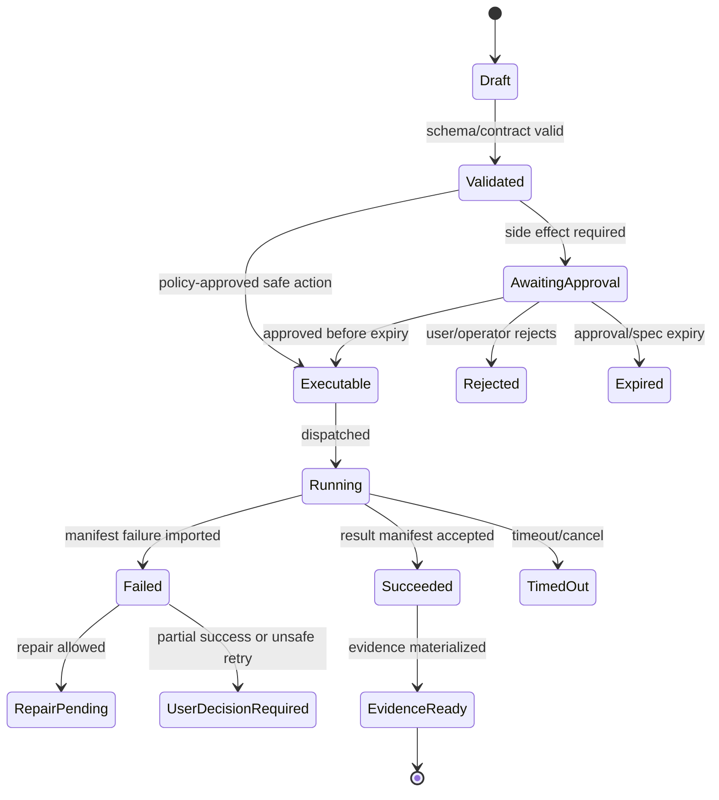

# Airlock Policy and Approvals

## V6.17 shared rules, separate issuers

Airlock shares rule IDs, risk vocabulary, candidate canonicalization, approval UX, and conformance fixtures, but has two implementations and two non-interchangeable audiences:

- .NET Airlock mints specs for an exact fixed Azure executor audience under `web_managed` authority.
- Rust Airlock mints specs for the signed local host/install/workspace grant under `windows_local` authority.

Every candidate, decision, approval, and spec carries `deliveryModel`, `authorityRef`, `workspaceTarget`, and a discriminated `executorAudience`. Approval tokens and specs never cross delivery models. Spec consumption is a separate immutable record; the approved spec itself is never mutated to “used.” Remote output is re-proposed and reapproved locally. See [[99 - Dual-Delivery Contract and Conformance Specification]].

## 1. Mission

Act as the pure policy kernel and execution-authority factory for governed mutations. Make bypass mechanically difficult by evaluating an exact `ExecutionSpecCandidate` and requiring an Airlock-created, audience-bound, expiring, single-use `ApprovedExecutionSpec` for worker dispatch. Ordinary authenticated CRUD and offline Source Intake use their separate authority classes.

## 2. Responsibilities

- Evaluate exact patch, command, artifact export, package activation/install rehearsal, dependency restore, external mutation, worker-dispatch, and rollback candidates.
- Compute risk score and blocked rules.
- Create approval cards.
- Create `ApprovedExecutionSpec` only from an unchanged policy-allowed candidate after any required exact-hash approval.
- Support scoped reusable policy grants that may waive a fresh prompt but can never execute or substitute for a newly evaluated candidate/spec.
- Fail closed on missing/invalid policy context.
- Record policy hash and decision evidence.

## 3. Explicit Non-Responsibilities

- Do not bypass Airlock.
- Do not mutate authoritative state outside the Runtime API state transition path.
- Do not hide policy decisions inside UI-only code.
- Do not let model text become executable behavior without typed validation.
- Do not introduce a separate runtime semantics path unless an ADR approves it.

## 4. Interfaces and Ports

| Interface | Purpose |
|---|---|
| IAirlockPolicy | Pure evaluation. |
| IApprovalStore | Approval decisions and grants. |
| IExecutionSpecFactory | Creates ApprovedExecutionSpec. |
| IPolicyVersionStore | Policy versions/hashes. |
| IRiskScorer | Risk classification. |
| IPathPolicy | Workspace path allow/deny checks. |

## 5. State and Lifecycle

Policy states: `proposal_received`, `evaluated_allowed_without_approval`, `approval_required`, `blocked`, `approved`, `expired`, `revoked`, `spec_created`.

## 6. Data Contracts

ApprovedExecutionSpec required fields:

- approval ID;
- execution candidate ID/hash;
- policy version/hash;
- proposal ID/hash;
- actor and project scope;
- workspace snapshot/checkpoint;
- preimage hashes;
- side-effect class;
- command spec or patch ref;
- resource/network/time limits;
- expiration;
- executor audience and fixed template/lane id;
- issue time, single-use nonce, and consumption state;
- trace correlation ID.

## 7. Primary Flow

```text
Proposal
→ normalize proposal and construct immutable ExecutionSpecCandidate
→ evaluate policy over the exact candidate
→ risk score
→ require approval or block
→ user approves the exact candidate hash when required
→ verify policy, identity, audience, workspace, and mutable inputs still current
→ mint audience-bound, expiring, single-use ApprovedExecutionSpec
→ dispatcher can execute
```

## 8. Implementation Steps

- Define policy DSL/data model.
- Implement path policy and command policy.
- Implement patch size/risk scoring.
- Implement approval card schema.
- Implement scoped reusable approval grants.
- Implement spec expiration and revocation.
- Add unit tests for blocked commands, path escape, stale preimages.

## 9. Failure Modes and Mitigations

| Failure | Mitigation |
|---|---|
| Bypass path introduced | ExecutionDispatcher accepts only ApprovedExecutionSpec. |
| Approval fatigue | Scoped policy grants may waive a prompt only after a fresh exact candidate evaluation; every dispatch still receives a new single-use spec. |
| Policy drift after approval | Spec includes policy hash and expiry. |
| User approves unclear action | Approval card must show exact side effects and risks. |
| Shell injection | Commands are argv arrays and shell is blocked by default. |

## 10. Acceptance Criteria

- Patch write cannot execute without spec.
- Command cannot execute as shell string.
- Policy block includes rule ID and explanation.
- Reusable approval cannot expand beyond original scope.
- Spec expiration prevents delayed execution.


## 11. Approval Grant Example

```json
{
  "grant_id": "grant_...",
  "scope": "run",
  "command_class": "test",
  "argv_prefix": ["pnpm", "test"],
  "cwd": ".",
  "network_mode": "none",
  "executor_image_digest": "sha256:...",
  "policy_hash": "sha256:...",
  "expires_at": "2026-07-09T13:00:00Z"
}
```

## OpenClaw-Informed Approval Hardening

OpenClaw's exec approval and plugin-install design, summarized in [[84 - OpenClaw Source Review - Comparable Runtime Patterns]], reinforces these Airlock rules:

| Concern | Sapphirus rule |
|---|---|
| Install policy vs runtime policy | Package import/install approval is its own policy gate. Passing install policy does not grant command, network, file-write, export, or plugin/tool execution rights. |
| Tool policy vs sandbox policy | Tool allow/deny, sandbox/isolation mode, network mode, and approval status are independent fields. A sandbox does not make a denied tool available, and an approval does not weaken sandbox limits. |
| No reviewer UI | If a required approval prompt cannot reach a reviewer UI or times out, default to deny. |
| Strict inline eval | Inline interpreter forms such as `python -c`, `node -e`, PowerShell command strings, `osascript -e`, `find -exec`, `xargs`, and shell heredocs are high-risk and blocked unless a specific operator policy allows them. |
| Concrete execution binding | ApprovedExecutionSpec must bind cwd, exact argv, env allowlist/bindings, executable path or image digest, workspace snapshot, preimages, and any approved script/interpreter file operand when one is identifiable. |
| Reusable grants | Durable grants must never expand from one command/context to a broader class without a new approval. |
| Generic plugin consent | Reviewer consent metadata without a typed action/candidate hash is not execution authority. |

### Policy Layers Must Stay Separate

| Layer | Decision | Must not imply |
|---|---|---|
| Package install policy | Whether a package/extension may be installed or updated. | Tool execution, network access, workspace writes, or runtime config migration. |
| Tool policy | Whether a tool/capability can be offered for a run. | Approval for a specific execution. |
| Sandbox/execution policy | Where the job runs and what workspace/network access it receives. | Permission to run a denied command. |
| Exec approval | Whether this exact argv/cwd/env/image/input-hash execution is allowed now. | Broader package trust or reusable access beyond the approved binding. |

Airlock diagnostics should explain which layer denied or constrained the action so the user sees the real blocker instead of a generic failure.

### Approval Request Payload Contract

OpenClaw's exec-approval client (`src/agents/bash-tools.exec-approval-request.ts`) registers a request with the gateway and then waits for the decision as two separate phases, with explicit timeouts for each. The Sapphirus approval-request record should carry the equivalent fields:

| Field group | Required content |
|---|---|
| Command identity | Structured `argv[]`, the resolved executable path, and cwd. Shell-wrapper forms (`sh -c`-style) are resolved to the underlying argv before review, never shown only as an opaque string. |
| Reviewer presentation | Highlight spans marking the risky parts of the command so the approval card can emphasize them; a warning text field for policy-generated cautions. |
| Decision constraints | Registration timeout and decision timeout as separate values; expiry timestamp computed server-side; the set of decisions that are unavailable in the current state (so the UI cannot offer an option the policy would reject). |
| Provenance | Session, channel, and origin-thread identifiers so the reviewer sees where the request came from; requesting agent identity. |
| Routing | Which reviewers/devices may decide, and whether delivery to a reviewer route is required for the request to be valid. No reachable reviewer within timeout means deny. |
| Security context | The evaluated security/ask mode that triggered the approval, so audit can reconstruct why a prompt was raised. |

---

## v2 Review Improvements

### 1. Policy Kernel Requirements

Airlock must be pure and deterministic:

```text
Proposal + PolicyContext + PolicyVersion → AirlockDecision
```

No network calls, no model calls, no mutable workspace reads during evaluation except through supplied context. This makes decisions testable and replayable.

### 2. Policy Context Inputs

| Input | Purpose |
|---|---|
| user role and project role | authorization. |
| proposal hash and type | tamper detection. |
| side-effect classes | file write, command run, export, package import. |
| workspace snapshot/checkpoint | scope and freshness. |
| path allow/deny rules | file safety. |
| command allowlist | execution safety. |
| network mode | data exfiltration control. |
| worker image digest | trusted execution image. |
| budget/resource limits | cost/resource control. |
| reusable grant scope | approval fatigue control. |

### 3. Policy Decision Shape

```json
{
  "decision": "allow|deny|require_approval|require_operator",
  "risk": "low|medium|high|blocked",
  "reasons": [],
  "required_approval_fields": [],
  "allowed_spec_template": {},
  "policy_version": "airlock-policy.v1",
  "policy_hash": "sha256:..."
}
```

### 4. Side-Effect Policy Matrix

| Side Effect | v1 Default | Notes |
|---|---|---|
| Read workspace files | allowed if project role permits | Still secret-filtered. |
| Write source files | approval required | Diff/preimage required. |
| Delete files | high-risk approval or deny | Deny for broad globs. |
| Run tests/lint/build | approval or scoped grant | `argv[]`, network off where possible. |
| Install dependencies | high-risk approval | Lockfile and network policy required. |
| Export artifact inside workspace | approval/policy-gated | Provenance required. |
| External publish/push | denied in v1 | Deferred ADR. |
| Access secrets | denied to model; scoped to worker only if needed | Never in prompt. |

### 5. Reusable Approval Grants

Reusable grants reduce approval fatigue without weakening boundaries. They must bind:

- project/workspace;
- run or time window;
- command class;
- exact `argv[]` or normalized pattern;
- cwd;
- network mode;
- worker image digest;
- policy hash;
- timeout/resource limits.

A grant is invalid if any bound field changes.

### 6. Airlock Tests

- Missing approval ID denies side effect.
- Different proposal hash denies execution.
- Changed policy hash requires re-evaluation.
- `sh -c` denied by default.
- Path traversal and symlink escape are denied.
- Broad delete is denied.
- External publish is denied in v1.
- Workspace content cannot create/modify policy.


---


---

## Implementation-depth contract

This file is part of the V6 implementation library. It is written as an implementation guide, not as a strategy memo. Every component must be built against the same system-wide constraints:

1. **The first executable slice comes before breadth.** The first demonstrable product must prove authenticated chat, workspace context, typed plan output, proposal creation, Airlock validation, approval, isolated execution, validation, checkpoint, and evidence.
2. **The delivery-specific authority owns lifecycle state.** The web Runtime API imports remote-worker facts into SQL; the signed desktop Rust host imports local-executor facts into SQLite. Workers, child processes, renderers, models, sync services, and support APIs do not advance authoritative lifecycle state.
3. **Airlock creates the only side-effect token.** Workspace writes, command runs, exports, package imports, dependency restores, and policy-sensitive actions require an `ApprovedExecutionSpec` issued by Airlock.
4. **The model does not own proposals.** Model Gateway returns typed model outputs. Run Orchestrator creates normalized `Proposal` records. Airlock validates proposals.
5. **No raw shell by default.** Commands are represented as `argv[]` plus policy metadata; `sh -c`, shell expansion, broad environment access, and open network access are blocked unless explicitly operator-approved.
6. **Every side effect is reconstructable.** Diffs, preimages, spec hashes, policy hashes, approvals, job image digests, result manifests, logs, artifacts, and rollback metadata must be traceable.
7. **Each module has ports.** Even inside a modular monolith, use explicit interfaces and contracts to avoid creating a god control plane.


## 1. Component identity

| Field | Value |
|---|---|
| Component | `Airlock Policy and Approvals` |
| Area | `Side-effect boundary` |
| Primary implementation package | `src/Airlock.Policy` |
| Runtime/technology | `Pure C# policy kernel + approval API integration` |
| First-slice priority | `core` |


## 2. Purpose

Validate normalized proposals, determine required approval, create immutable ApprovedExecutionSpec tokens, and make bypass mechanically difficult.

The implementation must be narrow enough to fit the corrected first vertical slice, but designed so BMAD package execution, the existing presentation adapter, Builder Studio, SkillOps, replay, and operator controls can plug into the same contracts later.


## 3. Owns / does not own

### Owns
- Proposal policy evaluation
- Path policy
- Command policy
- Network policy
- Risk scoring
- Approval requirements
- Reusable approval grants
- ApprovedExecutionSpec creation
- Policy test corpus

### Does not own
- Executing side effects
- Model calls
- UI card rendering
- SQL lifecycle transitions outside returned decisions


## 4. Public/API surface and internal ports

### Required API/routes or callable operations
- `POST /api/airlock/evaluate`
- `POST /api/approvals/{id}/approve`
- `POST /api/approvals/{id}/reject`
- `GET /api/approvals/{id}`
- `POST /api/operator/policies`


### Internal contract rules

- Every boundary uses typed, schema-versioned values. C# uses `Runtime.Contracts` / `Runtime.Domain`, Rust uses generated contract types plus `desktop-domain`, and TypeScript uses generated web or desktop facade types; no generated DTO grants runtime authority.
- External payloads must be schema-versioned. Internal objects may evolve faster but must not leak into OpenAPI without a contract version.
- Every state mutation must be idempotent or protected by optimistic concurrency.
- Every side-effect operation must receive an `ApprovedExecutionSpec` or be provably read-only.
- Every error response must use the standard error envelope with `code`, `message`, `correlationId`, `retryable`, and optional `detailsRef`.


### Starter interface/type sketch

```csharp
public interface IComponentPort<TRequest, TResult>
{
    Task<TResult> ExecuteAsync(TRequest request, CancellationToken ct);
}

public sealed record OperationContext(
    Guid ProjectId,
    Guid RunId,
    string ActorUserId,
    string CorrelationId,
    string PolicyVersion,
    DateTimeOffset RequestedAt);
```


## 5. State model

### Component states
- `received`
- `normalized`
- `blocked`
- `approval_required`
- `approved_by_policy`
- `approved_by_user`
- `expired`
- `revoked`
- `spec_issued`


### Generic side-effect lifecycle





## 6. Persistence responsibilities

### SQL tables or domain records touched
- `PolicyVersion`
- `AirlockDecision`
- `Approval`
- `ApprovalGrant`
- `ApprovedExecutionSpec`
- `PolicyViolation`
- `RiskFactor`

### Blob/object storage paths touched
- `policies/{policyVersion}/policy.json`
- `approved-specs/{specId}.json`
- `airlock-test-corpus/*.json`


### Persistence rules

- In `web_managed`, SQL stores lifecycle state, compact indexes, ownership metadata, and references. In `windows_local`, SQLite stores the corresponding local authority records.
- In `web_managed`, Blob stores large immutable payloads: snapshots, logs, diffs, manifests, artifacts, exports, packages, traces, and validation reports. In `windows_local`, encrypted local content-addressed storage holds authority-owned payloads; cloud upload is explicit and purpose-scoped.
- Any Blob payload referenced from SQL must include content hash, schema version, created timestamp, and retention class.
- No raw secrets, broad credentials, or unredacted prompt/context payloads are stored by default.
- Migrations must be forward-safe and testable against fixture data.


## 7. Detailed implementation steps


### Phase 0 — Contract and spike

1. Create or update the relevant ADR before implementation when the decision affects hosting, policy, security, data ownership, or external dependencies.

2. Define public DTOs and durable JSON schemas first. Do not let implementation classes silently become external contracts.

3. Create a minimal fixture that exercises the component without requiring the whole platform.

4. Add negative tests for the most dangerous bypass or failure case before adding the happy path.

5. Record assumptions in the component file and in the ADR index if they are not final.

6. For `Airlock Policy and Approvals`, implement only the smallest behavior that proves its contract in the first executable slice, then add extended BMAD/Builder/artifact behavior after gate approval.


### Phase 1 — Skeleton implementation

1. Create the package/module/folder with explicit ports/interfaces and dependency direction rules.

2. Add dependency injection registration with narrow interfaces rather than passing broad services everywhere.

3. Implement persistence only through repository/store abstractions that expose business operations, not raw table access.

4. Emit structured events for every important state transition even if the UI does not yet render them.

5. Add unit tests for object creation, invalid input, authorization/policy denial, and idempotency where relevant.

6. For `Airlock Policy and Approvals`, implement only the smallest behavior that proves its contract in the first executable slice, then add extended BMAD/Builder/artifact behavior after gate approval.


### Phase 2 — First vertical integration

1. Connect the component to the first executable slice only. Avoid adding full future scope before the vertical path works.

2. Use fake/stub adapters for expensive external systems until the contract is proven.

3. Make all side effects flow through Proposal → AirlockDecision → Approval/Grant → ApprovedExecutionSpec → Dispatch.

4. Persist large payloads to Blob and store only compact references in SQL.

5. Return UI-consumable run events so the Chat Workbench can render progress without polling raw tables.

6. For `Airlock Policy and Approvals`, implement only the smallest behavior that proves its contract in the first executable slice, then add extended BMAD/Builder/artifact behavior after gate approval.


### Phase 3 — Production hardening

1. Add telemetry attributes, correlation IDs, redaction, and audit events.

2. Add retry, timeout, cancellation, and stale-state handling.

3. Add migration scripts and seed data for dev/test.

4. Add operator visibility for status, errors, budget/policy impact, and cleanup status.

5. Document runbooks for the top failure modes.

6. For `Airlock Policy and Approvals`, implement only the smallest behavior that proves its contract in the first executable slice, then add extended BMAD/Builder/artifact behavior after gate approval.


### Phase 4 — Regression and release gate

1. Add contract tests against OpenAPI/JSON Schema.

2. Add replay fixtures or golden outputs where deterministic behavior is expected.

3. Add security tests for prompt injection, secret leakage, excessive agency, insecure output handling, and supply-chain drift where relevant.

4. Update release gate evidence with screenshots/log excerpts/manifests rather than informal claims.

5. Mark open risks and deferred v1.5/v2 items explicitly.

6. For `Airlock Policy and Approvals`, implement only the smallest behavior that proves its contract in the first executable slice, then add extended BMAD/Builder/artifact behavior after gate approval.


## 8. Validation and test plan

### Required tests
- workspace write rejected without spec
- dangerous path blocked
- sh-c blocked by default
- approval expiration enforced
- spec hash mismatch rejects dispatch


### Minimum test layers

| Layer | What to test | Required before merge |
|---|---|---|
| Unit | object validation, state transitions, parsing, policy predicates | yes |
| Contract | OpenAPI/JSON Schema compatibility, generated clients, worker manifests | yes for public/durable payloads |
| Integration | SQL + Blob references, dispatch/import, authz, Airlock boundary | yes for side-effect paths |
| E2E | chat → proposal → approval → execution → evidence | yes for first slice files |
| Replay/golden | BMAD package fixtures, presentation adapter, evidence bundle | yes before v1 beta |
| Security negative | prompt injection, secret leak, policy bypass, path traversal, raw shell | yes for all side-effect components |


## 9. Failure modes and recovery

| Failure | Detection | Required behavior | User/operator visibility |
|---|---|---|---|
| Invalid schema | contract validation | reject before persistence or dispatch | show actionable error with correlation ID |
| Stale proposal/preimage | hash mismatch | void proposal or require rebase/new proposal | show stale context warning |
| Approval expired | expiry check | reject dispatch | show re-approve option |
| Policy mismatch | policy hash mismatch | reject spec | operator audit event |
| Worker timeout | job monitor | mark job timed out; preserve partial logs | timeline event + retry option if safe |
| Manifest missing/invalid | manifest import validation | do not advance success state | incident/failure card |
| Partial success | checkpoint/validation state | enter `user_decision_required` or `kept_for_repair` | explicit decision card |
| Secret detected | scanner/redactor | redact and block if high confidence | security finding card/operator event |


## 10. Security and policy requirements

- Treat workspace files, package files, generated artifacts, model outputs, and logs as untrusted input.
- Never let untrusted content override system instructions, Airlock policy, command allowlists, network policy, or secret handling.
- Enforce project-level authorization on every read and write.
- Log security-relevant denials as audit events, but do not include raw secret values.
- Prefer fail-closed behavior when policy, identity, schema, or storage checks are ambiguous.
- Add negative tests for the most likely bypass path before writing happy-path code.


## 11. Observability

Minimum telemetry fields for this component:

- `correlation.id`
- `project.id`
- `run.id` when available
- `component.name`
- `operation.name`
- `operation.outcome`
- `policy.version` when applicable
- `spec.id` when applicable
- `job.id` when applicable
- `artifact.id` when applicable
- redaction counters, not raw secrets

Metrics to consider: request latency, state-transition count, policy denials, approval wait time, job duration, manifest import failures, schema validation failures, retry count, budget blocks, and evidence materialization time.


## 12. Acceptance criteria

- [ ] The component has a clear owner package and does not leak responsibilities into unrelated modules.
- [ ] Public routes/payloads are represented in OpenAPI/JSON Schema where applicable.
- [ ] Side-effect paths cannot execute without Airlock evaluation and `ApprovedExecutionSpec`.
- [ ] SQL lifecycle state is mutated only by the Runtime API/Application layer.
- [ ] Blob payloads have content hashes and schema versions.
- [ ] Tests include at least one negative/bypass case.
- [ ] Events and evidence are emitted for user-visible actions.
- [ ] The component is represented in the release gate matrix.
- [ ] The implementation does not introduce Cortex as a runtime namespace.
- [ ] Documentation includes deferred v1.5/v2 scope explicitly rather than silently omitting it.


## 13. Integration checklist

- [ ] Update `32 - Integration Contract Map.md` with any new caller/callee relationship.
- [ ] Update `25 - OpenAPI, Schemas, and Generated Clients.md` for public route or schema changes.
- [ ] Update `22 - Data Model - SQL and Blob.md`, `47 - Database DDL Starter.md`, or `48 - Blob Storage Layout.md` for persistence changes.
- [ ] Update `27 - Testing, Validation, and Replay.md` for new fixtures or replay needs.
- [ ] Update `33 - Release Gates and Acceptance Matrix.md` if the change affects release readiness.
- [ ] Add or update ADR in `31 - Architecture Decision Records.md` if the change alters architecture, hosting, policy, or security posture.


## `ApprovedExecutionSpec` minimum fields

```json
{
  "schemaVersion": "execution-spec.v1",
  "specId": "uuid",
  "approvalId": "uuid",
  "proposalId": "uuid",
  "projectId": "uuid",
  "runId": "uuid",
  "workspaceSnapshotId": "uuid",
  "checkoutId": "uuid",
  "preimageHashes": [{ "path": "src/App.tsx", "sha256": "..." }],
  "policyVersion": "airlock-policy-2026-07-09",
  "policyHash": "sha256:...",
  "specHash": "sha256:...",
  "issuedAt": "2026-07-09T00:00:00Z",
  "expiresAt": "2026-07-09T00:15:00Z",
  "allowedOperations": ["patch.apply", "command.run"],
  "commandSpecs": [],
  "patchRefs": [],
  "networkMode": "none",
  "executorImageDigest": "sha256:...",
  "actor": { "userId": "...", "tenantId": "..." }
}
```

Any side-effect service that does not receive this object must fail closed. Any mismatch between `specHash`, `policyHash`, workspace snapshot, checkout, preimages, executor image digest, or expiry must reject dispatch.


---

## Historical Revision Notes (V3 -> V4 Hardening Pass)
### V4 audit finding applied to this file
The v3 library was detailed, but several files still behaved like expanded planning notes rather than implementation handbooks. This pass adds enforceable implementation details: exact build sequence, explicit boundaries, input/output contracts, database/blob ownership, event names, failure states, tests, and release gates.

## System invariants this component must obey

1. The first delivered slice remains: **authenticated chat → workspace context → implementation plan → proposal → Airlock → approval → isolated job → validation → checkpoint → evidence**.
2. No worker image receives Azure SQL write credentials. Workers produce signed/hashed append-only manifests in Blob; the Runtime API imports them and advances SQL lifecycle state.
3. No file write, command run, dependency restore, package import, artifact export, checkpoint mutation, or rollback can execute without an `ApprovedExecutionSpec` minted by Airlock.
4. The Model Gateway returns typed model outputs only. The Run Orchestrator creates platform `Proposal` records. Airlock validates proposals and creates approved specs.
5. Commands are `argv[]` specs, not raw shell strings. Shell execution is a separate high-risk command class.
6. Every state transition emits a run event and trace event with correlation ID, actor/service principal, schema version, and payload hash or payload reference.
7. Every persisted object carries schema version, retention class, project scope, created/updated timestamps, and hash/provenance where relevant.
8. Any component that reads workspace content treats it as untrusted user-controlled input and cannot allow it to override system policy, command allowlists, approval requirements, or secrets handling.


## Component build card

| Field | Value |
|---|---|
| Component | `Airlock Policy and Approvals` |
| Primary package/path | `src/Airlock.Policy` |
| Current implementation status | `v6-validated` |
| Required for first vertical slice | `yes` |

## Validated API/port touchpoints

- `POST /api/airlock/evaluate`
- `POST /api/approvals`
- `POST /api/approvals/{approvalId}/decisions`
- `GET /api/approved-specs/{specId}`

## Validated domain events to implement or consume

- `policy.evaluation.started`
- `policy.evaluation.completed`
- `approval.required`
- `approval.approved`
- `approval.rejected`
- `approved_spec.issued`

Policy denial is not a separate event type: it is `policy.evaluation.completed` with outcome `denied`, and it must also produce an audit record.

## Validated SQL ownership / indexes

- `policy_versions`
- `policy_decisions`
- `approvals`
- `approval_grants`
- `approved_execution_specs`
- `approval_audit_events`

Implementation notes:

- Tables listed here are owned by their module or exposed through its port; other modules must not perform direct ad-hoc writes.
- Mutable lifecycle tables need optimistic concurrency tokens.
- All records need `project_id`, `schema_version`, `created_at`, `updated_at`, and retention classification where applicable.

## Validated Blob payload layout

- `policies/{policyVersion}/policy.json`
- `approved-specs/{specId}.json`
- `policy-decisions/{decisionId}.json`

Implementation notes:

- Blob payloads are content-addressed or hash-checked before import.
- SQL stores compact payload references, not bulky logs/prompts/artifacts.
- Retention class and redaction level must be explicit for every payload family.

## Validated step-by-step build procedure

1. Implement Airlock as pure policy kernel; it cannot apply patches, run commands, export artifacts, or mutate workspaces.
2. Every governed mutation/worker-dispatch endpoint accepts only `ApprovedExecutionSpec`, never raw Proposal + approval boolean; ordinary authenticated CRUD rejects executable fields and uses owner-scope/authz/idempotency/domain transactions.
3. `ApprovedExecutionSpec` includes exact candidate/proposal/approval/policy hashes, actor/owner, audience/fixed template, workspace snapshot/preimages/all mutable inputs, command/effect, limits, issue/expiry, and a single-use nonce/consumption record.
4. Add mechanical bypass tests: Workspace/Execution/Artifact import endpoints reject missing/expired/mismatched spec.
5. Support reusable policy grants only when bound to command/effect/schema class, argv/cwd, network, image/template, timeout, workspace/mutable inputs, run/owner, provider/data boundary, and policy; a fresh candidate/spec remains mandatory.
6. Fail closed on policy load failure, unknown command class, path ambiguity, or missing preimage.

## Validated edge cases that must be tested

| Edge case | Expected behavior |
|---|---|
| Duplicate API request with same idempotency key | Returns original result; no duplicate state transition or worker dispatch. |
| Stale proposal after newer checkpoint | Proposal is voided or requires rebase; approval is blocked. |
| Expired approval/spec | Side-effect endpoint rejects request; UI asks for refresh. |
| Unknown schema version | Import/read path rejects or routes to migration handler. |
| Blob payload hash mismatch | Runtime refuses import and creates security/audit finding. |
| User lacks project role | API returns access denied; no object existence leakage. |
| Workspace contains prompt injection in docs/code | Treated as untrusted content; cannot change system policy or tool permissions. |
| Worker crashes after writing partial logs | Execution becomes failed/unknown with partial log refs; retry uses same spec rules. |

## Validated release gate for this component

- Unit tests cover all domain transitions owned by this component.
- Contract tests cover all listed API touchpoints or port methods.
- Integration tests prove SQL/Blob responsibility boundaries.
- Security tests cover unauthorized access and malformed payloads.
- Replay fixture includes at least one success path and one failure path relevant to this component.
- Observability emits trace/span/log attributes with the shared correlation ID.
- Documentation examples compile or validate against JSON Schema/OpenAPI where relevant.

## Hermes-Informed Approval Rules

Source: [[86 - Hermes Source Code Review - Agent Runtime and Learning Loop]].

### Boundary Wording

Airlock is the authorization, approval, and audit boundary for side effects. It is not the containment boundary for adversarial code or model behavior. Containment belongs to process, OS, container, network, and credential isolation.

### Context-Local Approval State

Every Airlock decision must receive typed context:

- run id;
- session id;
- turn id;
- proposal id;
- tool call id where relevant;
- actor id;
- approval surface;
- interactivity mode;
- scheduled/background flag.

Do not use mutable environment variables or process-global flags as the live source of approval authority after startup. If an unsafe mode exists for local development, freeze it into startup configuration and include it in audit metadata.

### Scheduled and Background Work

Scheduled jobs and background self-improvement runs do not borrow interactive approval callbacks. They either use a pre-granted policy envelope, stage a pending approval, or fail closed.

### Policy-Sensitive Writes

Treat these as high-risk proposals even when the file path is inside the workspace:

- runtime config and policy files;
- connector credentials and settings;
- package manifests and install records;
- dependency manifests and lockfiles;
- skill/package activation state;
- secret stores and environment files.
