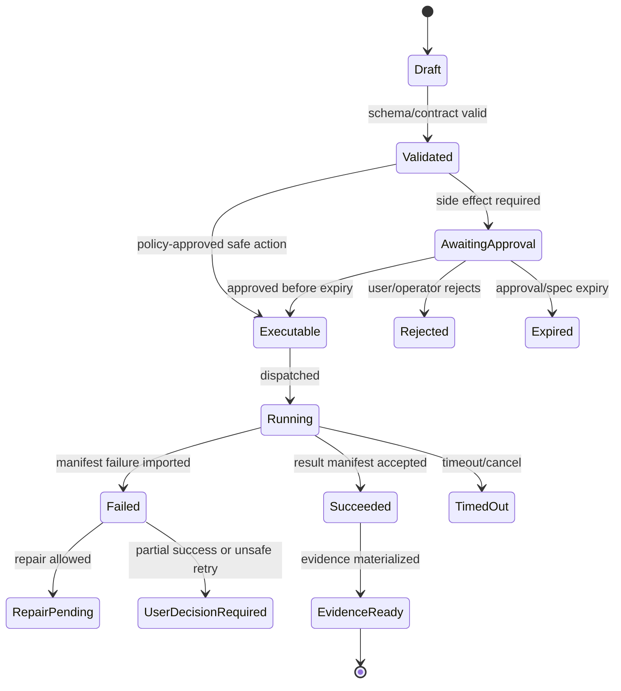

# Execution Lanes and Container App Jobs

## V6.17 scope: web and explicit remote work only

All ACA/job-template, worker-image, Blob checkout, managed-identity, network-profile, and manifest-import statements in this note apply to `web_managed` projects or an explicitly created desktop remote-job handoff. They do not describe ordinary `windows_local` edits or tests.

The local runner is specified separately in [[95 - Windows Local Workspace and Execution]] and must not be described as ACA-equivalent isolation. Job Objects supply process-tree lifetime/resource control only. A desktop remote request uploads an exact immutable snapshot into a distinct `web_managed` work record; the returned output has `cannotApplyDirectly: true` and becomes a fresh local proposal.

## 1. Mission

Run finite side-effect tasks inside isolated, digest-pinned worker containers. Workers apply patches, run commands, validate packages, scan workspaces, and export artifacts without owning authoritative lifecycle state.

## 2. Responsibilities

- Run ACA Jobs for patch, command, scan, validation, and export tasks.
- Mount or materialize job-scoped checkouts only.
- Enforce argv command execution.
- Redact output before model repair.
- Write result manifests and logs to Blob.
- Emit callbacks/events without direct SQL mutation.
- Use remotely built, digest-pinned worker images and fixed job templates with resource limits.
- Reject request-time image, entrypoint, identity, secret, network-profile, and arbitrary environment overrides.

## 3. Explicit Non-Responsibilities

- Do not bypass Airlock.
- Do not mutate authoritative state outside the Runtime API state transition path.
- Do not hide policy decisions inside UI-only code.
- Do not let model text become executable behavior without typed validation.
- Do not introduce a separate runtime semantics path unless an ADR approves it.

## 4. Interfaces and Ports

| Interface | Purpose |
|---|---|
| IExecutionDispatcher | Dispatches jobs from ApprovedExecutionSpec. |
| IWorkerManifestProtocol | Common manifest schema. |
| IWorkerLogSink | Writes chunked logs to Blob/stream. |
| IRedactor | Redacts secrets from output. |
| IResultImporter | Runtime API imports manifests. |
| IImagePolicy | Allowed worker image digests. |

## 5. State and Lifecycle

Execution lifecycle: `created`, `queued`, `dispatched`, `starting`, `running`, `manifest_written`, `import_pending`, `imported`, `succeeded`, `failed`, `timeout`, `cancelled`.

## 6. Data Contracts

Canonical `WebWorkerResultManifest`:

```json
{
  "execution_id": "exec_...",
  "schema_version": "worker-result.v1",
  "spec_hash": "sha256:...",
  "status": "succeeded|failed|timeout",
  "exit_code": 0,
  "changed_files": [{"path":"src/App.tsx","before":"sha256:...","after":"sha256:..."}],
  "log_refs": [{"kind":"stdout","blob":"...","redacted":true}],
  "artifact_refs": [],
  "started_at": "...",
  "finished_at": "..."
}
```

## 7. Primary Flow

```text
ApprovedExecutionSpec
→ dispatcher selects an allowlisted, pre-provisioned fixed job template whose image digest, entrypoint, identity, and network profile cannot be overridden by the request
→ job materializes checkout
→ worker verifies spec hash and scope
→ worker executes deterministic operation
→ worker writes manifest/logs
→ Runtime API imports manifest and advances state
```

## 8. Implementation Steps

- Create base worker protocol package.
- Implement patch worker.
- Implement command worker with argv only.
- Implement scan worker.
- Implement package-validation worker.
- Implement artifact-export worker later.
- Configure fixed ACA Jobs with resource limits, least-privilege identities, and start-only dispatcher permissions.
- Implement manifest importer and failure classification.

## 9. Failure Modes and Mitigations

| Failure | Mitigation |
|---|---|
| Worker mutates SQL | No SQL credentials in worker; manifest-only protocol. |
| Long startup hurts UX | Measure ACA Job latency; evaluate dynamic sessions for v1.5. |
| Network misuse | Network mode from spec; default none. |
| Output leaks secrets | Redact before logs are stored/streamed/model-visible. |
| Image drift | Use digest-pinned images and policy allowlist. |

## 10. Acceptance Criteria

- Worker rejects missing/invalid spec hash.
- Worker writes manifest for success and failure.
- API imports manifest idempotently.
- Command execution uses argv without shell.
- Logs are chunked and redacted.
- Remote ACR/hosted-CI build and ACA Job startup/result-import smoke evidence is documented without requiring local Docker.

## OpenClaw-Informed Isolation Model

OpenClaw separates sandbox mode, sandbox scope, backend, workspace access, tool policy, and elevated escape hatches. Sapphirus should model the same concepts explicitly even though v1 uses ACA Jobs as the primary execution lane.

| Field | Required meaning |
|---|---|
| `isolationMode` | Whether the execution is isolated, host-like, or operator-break-glass. V1 should default to isolated jobs. |
| `isolationScope` | Whether the checkout/container is per run, per job, per package validation, or shared read-only fixture. V1 should default to per job. |
| `workspaceAccess` | `none`, `ro`, or `rw`; package validation should not get workspace write access unless it is rehearsing an approved install. |
| `networkMode` | `none` by default; dependency restore, marketplace/package fetch, and external publish require explicit approval and evidence. |
| `toolPolicy` | Tool allow/deny list visible to the worker. It is evaluated before execution and cannot be expanded by package content. |
| `escapeHatch` | Operator-only break-glass path, audited separately and unavailable to model-generated proposals in v1. |

Execution workers should expose a diagnostic equivalent to "why was this blocked?" showing effective tool policy, isolation mode, workspace access, network mode, and approval/spec status.

### Exact Execution Binding

The dispatcher and worker must treat `ApprovedExecutionSpec` as an immutable execution receipt. Before process start, the worker verifies:

| Binding | Verification |
|---|---|
| `argv` | Exact ordered arguments match the approved spec; no shell expansion unless policy explicitly approved a shell command class. |
| `cwd` | Canonical path remains under the approved checkout root. |
| `env` | Only approved environment keys exist; secret values are mounted through approved secret refs, not logged payloads. |
| `imageDigest` | Worker image digest matches spec and release policy. |
| `mutableInputs` | Approved file operands and preimages still match recorded hashes. |
| `networkMode` | Effective network policy matches spec. |
| `workspaceAccess` | Mount mode is `none`, `ro`, or `rw` exactly as approved. |

If any binding fails, the worker writes a failed manifest and does not run the command.

---

## v2 Review Improvements

### 1. Worker Protocol

All workers implement the same protocol:

```text
input: ApprovedExecutionSpec JSON + mounted checkout + read-only policy bundle
output: WebWorkerResultManifest JSON + log chunks + artifact/hash manifests
```

Workers must fail closed if required fields are missing, hashes do not match, or paths escape workspace root.

### 2. Worker Types

| Worker | Purpose | v1? |
|---|---|---|
| `patch-worker` | apply approved file patch | yes |
| `command-worker` | run approved `argv[]` command | yes |
| `bmad-validation-worker` | validate package structure/invocation | after BMAD loader |
| `artifact-export-worker` | PPTX/PDF/doc export | after presentation adapter |
| `scan-worker` | workspace inventory/indexing | yes, async |
| `cleanup-worker` | TTL cleanup | yes |

### 3. Result Manifest Schema

```json
{
  "manifest_version": "worker-result.v1",
  "execution_id": "exec_...",
  "spec_hash": "sha256:...",
  "worker_image_digest": "sha256:...",
  "status": "succeeded|failed|partial",
  "started_at": "...",
  "finished_at": "...",
  "changed_files": [],
  "command_results": [],
  "artifact_outputs": [],
  "logs": [{"stream":"stdout","blob_uri":"...","sha256":"..."}],
  "failure": null
}
```

### 4. Command Execution Rules

- Run command as `argv[]`; no shell unless policy explicitly permits.
- Canonicalize `cwd` under workspace root.
- Environment variables are allowlisted.
- Network mode is explicit and default-denied.
- Output is capped and redacted before model repair.
- Exit code is captured exactly.
- Timeout kills process tree and marks `timeout` failure.

### 5. Azure Execution Posture

Use ACA Jobs for finite patch/test/validate/export tasks. Dynamic Sessions are a v1.5 candidate if cold-start and interaction latency harm the developer loop. Worker images are digest-pinned and run with minimal identity/permissions.

### 6. Execution Failure Classification

| Failure | Manifest Status | Runtime State |
|---|---|---|
| patch path denied | failed | `execution_policy_failed` |
| preimage mismatch in worker | failed | `preimage_drift_detected` |
| command nonzero exit | partial/failed | `validation_failed_user_decision` |
| timeout | failed | `execution_timeout` |
| infra start failure | failed | `execution_infra_failed` |
| output limit exceeded | partial | `output_truncated_review_required` |

### 7. Worker Tests

- Worker rejects path traversal.
- Worker rejects symlink escape.
- Worker cannot access blocked env variables.
- Worker emits valid manifest on success and failure.
- Worker result import is idempotent.
- Worker image digest is recorded in evidence.


---


---

## Implementation-depth contract

This file is part of the V6 implementation library. It is written as an implementation guide, not as a strategy memo. Every component must be built against the same system-wide constraints:

1. **The first executable slice comes before breadth.** The first demonstrable product must prove authenticated chat, workspace context, typed plan output, proposal creation, Airlock validation, approval, isolated execution, validation, checkpoint, and evidence.
2. **The delivery-specific authority owns lifecycle state.** The web Runtime API imports remote-worker facts into SQL; the signed desktop Rust host imports local-executor facts into SQLite. Workers, child processes, renderers, models, sync services, and support APIs do not advance authoritative lifecycle state.
3. **Airlock creates the only side-effect token.** Workspace writes, command runs, exports, package imports, dependency restores, and policy-sensitive actions require an `ApprovedExecutionSpec` issued by Airlock.
4. **The model does not own proposals.** Model Gateway returns typed model outputs. Run Orchestrator creates normalized `Proposal` records. Airlock validates proposals.
5. **No raw shell by default.** Commands are represented as `argv[]` plus policy metadata; `sh -c`, shell expansion, broad environment access, and open network access are blocked unless explicitly operator-approved.
6. **Every side effect is reconstructable.** Diffs, preimages, spec hashes, policy hashes, approvals, job image digests, result manifests, logs, artifacts, and rollback metadata must be traceable.
7. **Each module has ports.** Even inside a modular monolith, use explicit interfaces and contracts to avoid creating a god control plane.


## 1. Component identity

| Field | Value |
|---|---|
| Component | `Execution Lanes and Azure Container Apps Jobs` |
| Area | `Isolated execution` |
| Primary implementation package | `workers/python-executor + src/Runtime.Infrastructure/Execution` |
| Runtime/technology | `Python workers in ACA Jobs` |
| First-slice priority | `core` |


## 2. Purpose

Run finite side-effect jobs in isolated containers: patch apply, commands, validation, export, package validation, and manifest generation.

The implementation must be narrow enough to fit the corrected first vertical slice, but designed so BMAD package execution, the existing presentation adapter, Builder Studio, SkillOps, replay, and operator controls can plug into the same contracts later.


## 3. Owns / does not own

### Owns
- Worker entrypoint
- Command DSL execution
- Patch apply mechanics
- Output redaction
- Result manifests
- Job artifact uploads
- Resource/time limits
- Image digest reporting

### Does not own
- Lifecycle SQL transitions
- Airlock policy creation
- Model calls
- Unapproved network access


## 4. Public/API surface and internal ports

### Required API/routes or callable operations
- `POST /api/executions/dispatch`
- `POST /api/executions/{id}/heartbeat`
- `POST /api/executions/{id}/manifest`
- `GET /api/executions/{id}/logs`


### Internal contract rules

- Every boundary uses typed, schema-versioned values. C# uses `Runtime.Contracts` / `Runtime.Domain`, Rust uses generated contract types plus `desktop-domain`, and TypeScript uses generated web or desktop facade types; no generated DTO grants runtime authority.
- External payloads must be schema-versioned. Internal objects may evolve faster but must not leak into OpenAPI without a contract version.
- Every state mutation must be idempotent or protected by optimistic concurrency.
- Every side-effect operation must receive an `ApprovedExecutionSpec` or be provably read-only.
- Every error response must use the standard error envelope with `code`, `message`, `correlationId`, `retryable`, and optional `detailsRef`.


### Starter interface/type sketch

```python
@dataclass(frozen=True)
class WorkerInvocation:
    job_id: str
    approved_spec_path: Path
    checkout_path: Path
    output_dir: Path
    log_dir: Path
```


## 5. State model

### Component states
- `job_created`
- `image_resolved`
- `checkout_mounted`
- `running`
- `streaming_logs`
- `manifest_written`
- `callback_sent`
- `succeeded`
- `failed`
- `timed_out`
- `policy_mismatch`


### Generic side-effect lifecycle





## 6. Persistence responsibilities

### SQL tables or domain records touched
- `ExecutionJob`
- `ExecutorImage`
- `ExecutionHeartbeat`
- `WorkerResultManifestImport`
- `ValidationResult`

### Blob/object storage paths touched
- `jobs/{jobId}/input/spec.json`
- `jobs/{jobId}/logs/stdout.ndjson`
- `jobs/{jobId}/logs/stderr.ndjson`
- `jobs/{jobId}/result/manifest.json`


### Persistence rules

- In `web_managed`, SQL stores lifecycle state, compact indexes, ownership metadata, and references. In `windows_local`, SQLite stores the corresponding local authority records.
- In `web_managed`, Blob stores large immutable payloads: snapshots, logs, diffs, manifests, artifacts, exports, packages, traces, and validation reports. In `windows_local`, encrypted local content-addressed storage holds authority-owned payloads; cloud upload is explicit and purpose-scoped.
- Any Blob payload referenced from SQL must include content hash, schema version, created timestamp, and retention class.
- No raw secrets, broad credentials, or unredacted prompt/context payloads are stored by default.
- Migrations must be forward-safe and testable against fixture data.


## 7. Detailed implementation steps


### Phase 0 — Contract and spike

1. Create or update the relevant ADR before implementation when the decision affects hosting, policy, security, data ownership, or external dependencies.

2. Define public DTOs and durable JSON schemas first. Do not let implementation classes silently become external contracts.

3. Create a minimal fixture that exercises the component without requiring the whole platform.

4. Add negative tests for the most dangerous bypass or failure case before adding the happy path.

5. Record assumptions in the component file and in the ADR index if they are not final.

6. For `Execution Lanes and Azure Container Apps Jobs`, implement only the smallest behavior that proves its contract in the first executable slice, then add extended BMAD/Builder/artifact behavior after gate approval.


### Phase 1 — Skeleton implementation

1. Create the package/module/folder with explicit ports/interfaces and dependency direction rules.

2. Add dependency injection registration with narrow interfaces rather than passing broad services everywhere.

3. Implement persistence only through repository/store abstractions that expose business operations, not raw table access.

4. Emit structured events for every important state transition even if the UI does not yet render them.

5. Add unit tests for object creation, invalid input, authorization/policy denial, and idempotency where relevant.

6. For `Execution Lanes and Azure Container Apps Jobs`, implement only the smallest behavior that proves its contract in the first executable slice, then add extended BMAD/Builder/artifact behavior after gate approval.


### Phase 2 — First vertical integration

1. Connect the component to the first executable slice only. Avoid adding full future scope before the vertical path works.

2. Use fake/stub adapters for expensive external systems until the contract is proven.

3. Make all side effects flow through Proposal → AirlockDecision → Approval/Grant → ApprovedExecutionSpec → Dispatch.

4. Persist large payloads to Blob and store only compact references in SQL.

5. Return UI-consumable run events so the Chat Workbench can render progress without polling raw tables.

6. For `Execution Lanes and Azure Container Apps Jobs`, implement only the smallest behavior that proves its contract in the first executable slice, then add extended BMAD/Builder/artifact behavior after gate approval.


### Phase 3 — Production hardening

1. Add telemetry attributes, correlation IDs, redaction, and audit events.

2. Add retry, timeout, cancellation, and stale-state handling.

3. Add migration scripts and seed data for dev/test.

4. Add operator visibility for status, errors, budget/policy impact, and cleanup status.

5. Document runbooks for the top failure modes.

6. For `Execution Lanes and Azure Container Apps Jobs`, implement only the smallest behavior that proves its contract in the first executable slice, then add extended BMAD/Builder/artifact behavior after gate approval.


### Phase 4 — Regression and release gate

1. Add contract tests against OpenAPI/JSON Schema.

2. Add replay fixtures or golden outputs where deterministic behavior is expected.

3. Add security tests for prompt injection, secret leakage, excessive agency, insecure output handling, and supply-chain drift where relevant.

4. Update release gate evidence with screenshots/log excerpts/manifests rather than informal claims.

5. Mark open risks and deferred v1.5/v2 items explicitly.

6. For `Execution Lanes and Azure Container Apps Jobs`, implement only the smallest behavior that proves its contract in the first executable slice, then add extended BMAD/Builder/artifact behavior after gate approval.


## 8. Validation and test plan

### Required tests
- argv command executes without shell
- network disabled by default
- worker cannot write SQL lifecycle state
- manifest schema valid
- timeout kills process tree


### Minimum test layers

| Layer | What to test | Required before merge |
|---|---|---|
| Unit | object validation, state transitions, parsing, policy predicates | yes |
| Contract | OpenAPI/JSON Schema compatibility, generated clients, worker manifests | yes for public/durable payloads |
| Integration | SQL + Blob references, dispatch/import, authz, Airlock boundary | yes for side-effect paths |
| E2E | chat → proposal → approval → execution → evidence | yes for first slice files |
| Replay/golden | BMAD package fixtures, presentation adapter, evidence bundle | yes before v1 beta |
| Security negative | prompt injection, secret leak, policy bypass, path traversal, raw shell | yes for all side-effect components |


## 9. Failure modes and recovery

| Failure | Detection | Required behavior | User/operator visibility |
|---|---|---|---|
| Invalid schema | contract validation | reject before persistence or dispatch | show actionable error with correlation ID |
| Stale proposal/preimage | hash mismatch | void proposal or require rebase/new proposal | show stale context warning |
| Approval expired | expiry check | reject dispatch | show re-approve option |
| Policy mismatch | policy hash mismatch | reject spec | operator audit event |
| Worker timeout | job monitor | mark job timed out; preserve partial logs | timeline event + retry option if safe |
| Manifest missing/invalid | manifest import validation | do not advance success state | incident/failure card |
| Partial success | checkpoint/validation state | enter `user_decision_required` or `kept_for_repair` | explicit decision card |
| Secret detected | scanner/redactor | redact and block if high confidence | security finding card/operator event |


## 10. Security and policy requirements

- Treat workspace files, package files, generated artifacts, model outputs, and logs as untrusted input.
- Never let untrusted content override system instructions, Airlock policy, command allowlists, network policy, or secret handling.
- Enforce project-level authorization on every read and write.
- Log security-relevant denials as audit events, but do not include raw secret values.
- Prefer fail-closed behavior when policy, identity, schema, or storage checks are ambiguous.
- Add negative tests for the most likely bypass path before writing happy-path code.


## 11. Observability

Minimum telemetry fields for this component:

- `correlation.id`
- `project.id`
- `run.id` when available
- `component.name`
- `operation.name`
- `operation.outcome`
- `policy.version` when applicable
- `spec.id` when applicable
- `job.id` when applicable
- `artifact.id` when applicable
- redaction counters, not raw secrets

Metrics to consider: request latency, state-transition count, policy denials, approval wait time, job duration, manifest import failures, schema validation failures, retry count, budget blocks, and evidence materialization time.


## 12. Acceptance criteria

- [ ] The component has a clear owner package and does not leak responsibilities into unrelated modules.
- [ ] Public routes/payloads are represented in OpenAPI/JSON Schema where applicable.
- [ ] Side-effect paths cannot execute without Airlock evaluation and `ApprovedExecutionSpec`.
- [ ] SQL lifecycle state is mutated only by the Runtime API/Application layer.
- [ ] Blob payloads have content hashes and schema versions.
- [ ] Tests include at least one negative/bypass case.
- [ ] Events and evidence are emitted for user-visible actions.
- [ ] The component is represented in the release gate matrix.
- [ ] The implementation does not introduce Cortex as a runtime namespace.
- [ ] Documentation includes deferred v1.5/v2 scope explicitly rather than silently omitting it.


## 13. Integration checklist

- [ ] Update `32 - Integration Contract Map.md` with any new caller/callee relationship.
- [ ] Update `25 - OpenAPI, Schemas, and Generated Clients.md` for public route or schema changes.
- [ ] Update `22 - Data Model - SQL and Blob.md`, `47 - Database DDL Starter.md`, or `48 - Blob Storage Layout.md` for persistence changes.
- [ ] Update `27 - Testing, Validation, and Replay.md` for new fixtures or replay needs.
- [ ] Update `33 - Release Gates and Acceptance Matrix.md` if the change affects release readiness.
- [ ] Add or update ADR in `31 - Architecture Decision Records.md` if the change alters architecture, hosting, policy, or security posture.


## command DSL

```json
{
  "schemaVersion": "command-spec.v1",
  "commandId": "uuid",
  "kind": "test",
  "argv": ["pnpm", "test"],
  "cwd": "workspace",
  "env": { "CI": "true" },
  "envAllowlist": ["CI", "NODE_ENV"],
  "networkMode": "none",
  "timeoutSeconds": 300,
  "resourceClass": "small-cpu",
  "outputLimits": { "stdoutBytes": 2000000, "stderrBytes": 2000000 },
  "allowedPaths": ["."],
  "blockedPaths": [".env", "**/*.pem", "**/node_modules/**"],
  "shell": false
}
```

Rules:

- `argv[]` is mandatory.
- `shell:false` is the default and must be enforced.
- `sh -c`, `cmd /c`, PowerShell inline strings, wildcard expansion, and command chaining are denied unless an operator policy explicitly permits the command class.
- Network is `none` unless dependency restore or external export is explicitly approved.
- The worker redacts secret-like output before writing logs.
- The worker writes `manifest.json` and does not mutate lifecycle SQL.


---

## Historical Revision Notes (V3 -> V4 Hardening Pass)
### V4 audit finding applied to this file
The v3 library was detailed, but several files still behaved like expanded planning notes rather than implementation handbooks. This pass adds enforceable implementation details: exact build sequence, explicit boundaries, input/output contracts, database/blob ownership, event names, failure states, tests, and release gates.

## System invariants this component must obey

1. The first delivered slice remains: **authenticated chat → workspace context → implementation plan → proposal → Airlock → approval → isolated job → validation → checkpoint → evidence**.
2. No worker image receives Azure SQL write credentials. Workers produce signed/hashed append-only manifests in Blob; the Runtime API imports them and advances SQL lifecycle state.
3. No file write, command run, dependency restore, package import, artifact export, checkpoint mutation, or rollback can execute without an `ApprovedExecutionSpec` minted by Airlock.
4. The Model Gateway returns typed model outputs only. The Run Orchestrator creates platform `Proposal` records. Airlock validates proposals and creates approved specs.
5. Commands are `argv[]` specs, not raw shell strings. Shell execution is a separate high-risk command class.
6. Every state transition emits a run event and trace event with correlation ID, actor/service principal, schema version, and payload hash or payload reference.
7. Every persisted object carries schema version, retention class, project scope, created/updated timestamps, and hash/provenance where relevant.
8. Any component that reads workspace content treats it as untrusted user-controlled input and cannot allow it to override system policy, command allowlists, approval requirements, or secrets handling.


## Component build card

| Field | Value |
|---|---|
| Component | `Execution Lanes / ACA Jobs` |
| Primary package/path | `workers/python-executor + src/Runtime.Infrastructure/Execution` |
| Current implementation status | `v6-validated` |
| Required for first vertical slice | `yes` |

## Validated API/port touchpoints

- `POST /api/executions/dispatch`
- `GET /api/executions/{executionId}`
- `POST /api/executions/{executionId}/cancel`
- `POST /api/executions/{executionId}/manifest-import`

## Validated domain events to implement or consume

- `execution.dispatched`
- `execution.job.created`
- `execution.log.chunk`
- `execution.completed`
- `execution.failed`
- `execution.manifest.imported`

## Validated SQL ownership / indexes

- `executions`
- `execution_attempts`
- `execution_logs_index`
- `execution_manifests`
- `worker_images`

Implementation notes:

- Tables listed here are owned by their module or exposed through its port; other modules must not perform direct ad-hoc writes.
- Mutable lifecycle tables need optimistic concurrency tokens.
- All records need `project_id`, `schema_version`, `created_at`, `updated_at`, and retention classification where applicable.

## Validated Blob payload layout

- `execution-specs/{specId}.json`
- `logs/{executionId}/stdout.jsonl`
- `logs/{executionId}/stderr.jsonl`
- `manifests/{executionId}/result.json`

Implementation notes:

- Blob payloads are content-addressed or hash-checked before import.
- SQL stores compact payload references, not bulky logs/prompts/artifacts.
- Retention class and redaction level must be explicit for every payload family.

## Validated step-by-step build procedure

1. Dispatch ACA Jobs for finite patch/test/export tasks; dynamic sessions remain a later latency optimization.
2. Pass spec by immutable Blob reference plus hash, not large mutable payloads.
3. Worker validates spec hash, policy hash, image digest, snapshot/checkpoint refs, command policy, and cwd before execution.
4. Worker writes logs and result manifest to Blob only; Runtime API imports and advances SQL state.
5. Implement job timeout, output limit, redaction, cancellation, and retry classification.
6. Pin worker image digests and attach SBOM/provenance before production use.

## Validated edge cases that must be tested

| Edge case | Expected behavior |
|---|---|
| Duplicate API request with same idempotency key | Returns original result; no duplicate state transition or worker dispatch. |
| Stale proposal after newer checkpoint | Proposal is voided or requires rebase; approval is blocked. |
| Expired approval/spec | Side-effect endpoint rejects request; UI asks for refresh. |
| Unknown schema version | Import/read path rejects or routes to migration handler. |
| Blob payload hash mismatch | Runtime refuses import and creates security/audit finding. |
| User lacks project role | API returns access denied; no object existence leakage. |
| Workspace contains prompt injection in docs/code | Treated as untrusted content; cannot change system policy or tool permissions. |
| Worker crashes after writing partial logs | Execution becomes failed/unknown with partial log refs; retry uses same spec rules. |

## Validated release gate for this component

- Unit tests cover all domain transitions owned by this component.
- Contract tests cover all listed API touchpoints or port methods.
- Integration tests prove SQL/Blob responsibility boundaries.
- Security tests cover unauthorized access and malformed payloads.
- Replay fixture includes at least one success path and one failure path relevant to this component.
- Observability emits trace/span/log attributes with the shared correlation ID.
- Documentation examples compile or validate against JSON Schema/OpenAPI where relevant.

---

## V6 verified platform note

- ACA Jobs remain the v1 execution baseline because Microsoft documents them as finite-duration containerized tasks that run and stop.
- Dynamic Sessions are not promoted to v1 baseline. They are validated as a low-latency isolated execution capability, but Sapphirus must benchmark latency, isolation, cost, timeout behavior, and worker protocol compatibility before adopting them.
- Worker images must keep producing append-only Blob manifests; changing the Azure execution primitive must not change Runtime API ownership of lifecycle state.

## Hermes-Informed Execution Lane Contract

Source: [[86 - Hermes Source Code Review - Agent Runtime and Learning Loop]].

Each `ExecutionLaneSpec` must explicitly define:

| Field | Requirement |
|---|---|
| `process_model` | Fresh process per command, persistent shell, job container, or remote worker. |
| `cwd_persistence` | Whether and how working directory persists across commands. |
| `env_forwarding` | Allowed variable names, secret source, redaction behavior, and deny rules. |
| `heartbeat_interval` | Activity signal for long-running commands. |
| `interrupt_semantics` | How cancellation maps to process kill, container stop, or remote cancel. |
| `output_limits` | Max bytes, max lines, max line length, and truncation marker. |
| `network_policy` | Egress mode, allowlist/proxy, and validation command. |
| `cleanup_policy` | Container/job labels, age limits, and rule that only owned exited resources are reaped. |

Do not scatter output caps or cleanup heuristics through worker code. They belong in lane configuration, worker manifests, and release tests.

## Odysseus-Informed Background Job Rules

Source: [[88 - Odysseus Source Code Review - Self-Hosted AI Workspace]].

Execution lanes should support long-running work with explicit state rather than hidden shell sessions:

| Rule | Requirement |
|---|---|
| Background job record | Store job id, lane, owner, run id, approved spec id, command summary, output refs, status, started time, and last heartbeat. |
| Completion callback | A finished background job emits a run event and can trigger a model follow-up only with the original owner and policy context. |
| Foreground interruption | Operator policy defines whether foreground activity pauses, cancels, or allows background jobs to continue. |
| Cancel/stop semantics | UI and API distinguish graceful cancel, forced stop, timeout, and worker crash. |
| Raw shell avoidance | Even self-hosted lanes keep structured `argv[]`; raw shell is an explicit high-risk lane, not the default. |
| Cross-site guard | Browser-origin requests cannot invoke privileged execution endpoints without same-origin and anti-CSRF controls. |

## Consolidated Source-Review Execution Verdict

Source: [[89 - Consolidated AI Workspace Source Review and Architecture Improvements]].

Execution lanes are product security boundaries, not mere hosting choices.

| Lane | v1 status | Required before use |
|---|---|---|
| ACA Job worker | `LOCKED_DEFAULT` | Digest-pinned image, SBOM/provenance/signature, command DSL, manifest protocol, output caps, heartbeat, timeout, and import fixture. |
| Dynamic Session worker | `V1.5_SPIKE` | Benchmark p50/p95 startup, first-output latency, cost, isolation, network controls, region availability, protocol fit, and manifest integration after the fixed Job lane is proven. |
| Local dev fake worker | `DEV_ONLY_NON_ISOLATING` | Same result shape and candidate/policy state tests, but only a deterministic sealed fixture; no shell, network, dependency restore, imported package, arbitrary command, or containment claim. |
| Raw shell lane | `HIGH_RISK_DEFERRED` | Explicit ADR, operator-only policy, no default exposure, and stronger audit/containment controls. |
| Package rehearsal lane | `V1_REQUIRED_FOR_BUILDER` | Clean workspace, no SQL credentials, package scan inputs, install/invocation logs, and activation-blocking findings. |

Do not choose a lane because it is convenient for the model. Choose it because its isolation, latency, output limits, and evidence behavior match the approved spec.

## V6.16 cloud-first execution binding

- The developer machine does not build or run worker containers. ACR Tasks (`az acr build`) or a hosted CI runner restores locked dependencies, scans/licenses the image, creates SBOM/provenance/attestation, pushes it, and returns the immutable digest.
- IaC—not a model request—binds digest, entrypoint, workload identity, secret refs, network profile, resource class, timeout/retry, and output locations to a named job template.
- Airlock mints a single-use spec for a template/audience/attempt. The dispatcher identity may start the allowlisted template but cannot mutate it.
- The worker result binds proposal/candidate/spec/policy/approval, owner/run/attempt/lease, job template, image digest, workspace snapshot and mutable-input hashes, command DSL, outputs, completion nonce, and timestamps.
- A completion and outbox record are durable before import acknowledgement. Retrying after an uncertain response imports the same result or reports an explicit unknown state; it never starts a second effect under the consumed spec.
- This fixed ACA Job lane is the first real isolated execution. Dynamic Sessions and Container Apps Sandboxes cannot weaken the contract if later adopted.
