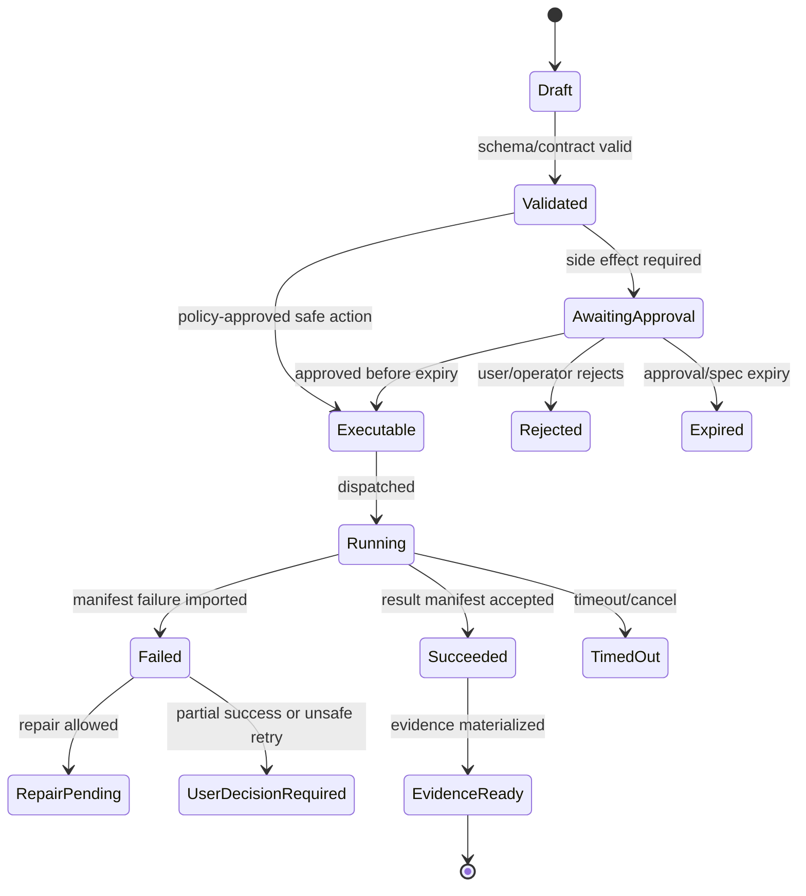

# Trace, Evidence, and Observability

## V6.17 evidence authorities

Evidence semantics and event vocabulary are shared, but durable authority is delivery-specific. `web_managed` commits lifecycle/ledger/outbox facts in Azure SQL and content-addressed payloads in Blob. `windows_local` commits them in SQLite and an encrypted local content-addressed store. Application Insights and optional sync are diagnostic/replica views and cannot repair or advance either ledger.

Every event carries `deliveryModel`, `authorityRef`, local/stream sequence, previous-event hash, actor kind, causation/correlation, and payload hash/ref. Desktop export/sync uses signed `SyncEnvelope` records and explicit consent; source, prompt, diff, path, and terminal payloads are excluded from telemetry by default. See [[96 - Windows Local State, Evidence, Checkpoint, and Rollback]].

## 1. Mission

Make every important outcome reconstructable while preserving privacy. Separate operational telemetry, evidence bundles, forensic raw references, and large payload storage.

## 2. Responsibilities

- Emit OpenTelemetry spans across browser/API/model/Airlock/job/artifact.
- Store compact state and indexes in SQL.
- Store large logs/payloads/bundles in Blob.
- Generate evidence bundles at run finalization.
- Implement trace privacy views.
- Correlate candidate-bound approvals, policy decisions, model calls, `WebWorkerResultManifest` imports, artifacts, and checkpoints.

## 3. Explicit Non-Responsibilities

- Do not bypass Airlock.
- Do not mutate authoritative state outside the Runtime API state transition path.
- Do not hide policy decisions inside UI-only code.
- Do not let model text become executable behavior without typed validation.
- Do not introduce a separate runtime semantics path unless an ADR approves it.

## 4. Interfaces and Ports

| Interface | Purpose |
|---|---|
| ITraceWriter | Append trace events and payload refs. |
| IEvidenceBuilder | Materialize evidence bundle. |
| ITelemetryEnricher | Adds correlation IDs and attributes. |
| ITracePrivacyPolicy | Controls raw/redacted/forensic views. |
| ILogChunkStore | Blob-backed chunked logs. |
| IOutboxPublisher | Reliable event streaming. |

## 5. State and Lifecycle

Trace event lifecycle: `captured`, `redacted`, `indexed`, `materialized`, `retained`, `expired`. Evidence lifecycle: `building`, `ready`, `downloaded`, `expired`.

## 6. Data Contracts

Evidence bundle includes:

- run ID and project ID;
- user objective;
- selected context summary and hashes;
- typed model call IDs and schema versions;
- proposals and approval IDs;
- Airlock decision/policy hashes;
- `WebWorkerResultManifest` imports;
- changed files and before/after hashes;
- validation results;
- artifact refs and hashes;
- rollback point;
- unresolved risks.

## 7. Primary Flow

```text
Domain event
→ trace writer
→ redaction policy
→ SQL compact index + Blob payload ref
→ stream event if user-visible
→ evidence builder materializes final bundle
```

## 8. Implementation Steps

- Define TraceEvent schema.
- Add correlation IDs to every API and worker operation.
- Implement redacted payload writer.
- Implement log chunk store.
- Implement evidence bundle builder.
- Add UI evidence panel.
- Add retention policies by data class.
- Add OpenTelemetry exporters/config.

## 9. Failure Modes and Mitigations

| Failure | Mitigation |
|---|---|
| SQL log bottleneck | SQL stores compact refs; Blob stores payloads. |
| Raw prompt retention conflict | Use operational/evidence/forensic views. |
| Uncorrelated worker logs | Spec includes traceparent/correlation ID. |
| Evidence too large | Bundle indexes with referenced payloads and summaries. |
| Sensitive data in evidence | Apply redaction policy before materialization. |

## 10. Acceptance Criteria

- Every side effect has trace path to approval and spec.
- Evidence bundle can be generated for successful and failed runs.
- Raw prompts are not retained by default in production mode.
- OpenTelemetry spans correlate API to worker.
- Log payloads are not stored as large SQL rows.

---

## v2 Review Improvements

### 1. Trace Views

| View | Audience | Contents |
|---|---|---|
| operational | developers/operators | spans, event summaries, errors, latency, resource use. |
| evidence | reviewers/users | proposal, approval, diff, jobs, artifacts, checkpoints, hashes. |
| privileged raw | security/admin only | raw prompts/context/logs if retained and redacted policy allows. |

Trace privacy and evidence completeness are reconciled by storing summaries and hashes by default, with raw payloads behind privileged refs when retention is enabled.

### 2. Required Trace Links

```text
thread_id
run_id
proposal_id
approval_id
execution_id
job_provider_id
checkpoint_id
artifact_id
trace_id
```

Each evidence bundle must be navigable through these IDs without exposing raw prompt/context by default.

### 3. OpenTelemetry Span Plan

| Span | Attributes |
|---|---|
| `chat.message.receive` | project, thread, user role. |
| `run.orchestrate` | run id, intent, state transition. |
| `workspace.context_pack` | snapshot id, item count, token estimate. |
| `model.structured_call` | profile, schema id, usage, status. |
| `airlock.evaluate` | policy version/hash, decision, risk. |
| `approval.record` | decision, side-effect classes, expiry. |
| `execution.dispatch` | worker type, image digest, limits. |
| `execution.import_manifest` | status, changed file count, command count. |
| `evidence.materialize` | bundle hash, artifact count. |

### 4. Evidence Bundle Contents

```text
evidence/
  summary.md
  run-events.jsonl
  proposal.json
  airlock-decision.json
  approval.json
  approved-execution-spec.json
  worker-result-manifest.json
  changed-files.json
  validation-results.json
  checkpoint.json
  artifacts.json
  redaction-report.json
```

### 5. Event Storage Policy

| Payload Type | Storage |
|---|---|
| Small lifecycle state | SQL JSON. |
| Large logs | Blob with SQL index. |
| Raw context/prompt | Redacted/hash summary by default; privileged Blob if enabled. |
| Diffs | Blob + SQL summary. |
| Evidence bundle | Blob immutable path + SQL index. |

### 6. Observability Release Gate

- One trace ID follows the full vertical slice.
- Evidence bundle can be generated from stored data without rerunning the model.
- Secret fixture does not appear in operational logs.
- Log truncation preserves hash and full Blob reference if retained.
- Failed run still produces evidence summary.


---


---

## Implementation-depth contract

This file is part of the V6 implementation library. It is written as an implementation guide, not as a strategy memo. Every component must be built against the same system-wide constraints:

1. **The first executable slice comes before breadth.** The first demonstrable product must prove authenticated chat, workspace context, typed plan output, proposal creation, Airlock validation, approval, isolated execution, validation, checkpoint, and evidence.
2. **The delivery-specific authority owns lifecycle state.** The web Runtime API imports remote-worker facts into SQL; the signed desktop Rust host imports local-executor facts into SQLite. Workers, child processes, renderers, models, sync services, and support APIs do not advance authoritative lifecycle state.
3. **Airlock creates the only side-effect token.** Workspace writes, command runs, exports, package imports, dependency restores, and policy-sensitive actions require an `ApprovedExecutionSpec` issued by Airlock.
4. **The model does not own proposals.** Model Gateway returns typed model outputs. Run Orchestrator creates normalized `Proposal` records. Airlock validates proposals.
5. **No raw shell by default.** Commands are represented as `argv[]` plus policy metadata; `sh -c`, shell expansion, broad environment access, and open network access are blocked unless explicitly operator-approved.
6. **Every side effect is reconstructable.** Diffs, preimages, spec hashes, policy hashes, approvals, job image digests, result manifests, logs, artifacts, and rollback metadata must be traceable.
7. **Each module has ports.** Even inside a modular monolith, use explicit interfaces and contracts to avoid creating a god control plane.


## 1. Component identity

| Field | Value |
|---|---|
| Component | `Trace, Evidence, and Observability` |
| Area | `Evidence and operations` |
| Primary implementation package | `src/Runtime.Application/Trace + Runtime.Infrastructure/Telemetry` |
| Runtime/technology | `C# services + OpenTelemetry + Azure Monitor/App Insights` |
| First-slice priority | `core` |


## 2. Purpose

Separate operational telemetry from evidence bundles, preserve privacy, correlate browser→API→model→Airlock→job→artifact, and make runs reconstructable.

The implementation must be narrow enough to fit the corrected first vertical slice, but designed so BMAD package execution, the existing presentation adapter, Builder Studio, SkillOps, replay, and operator controls can plug into the same contracts later.


## 3. Owns / does not own

### Owns
- Run events
- Evidence bundle materialization
- Trace privacy views
- Telemetry correlation IDs
- Metric taxonomy
- Audit events
- Evidence export
- Redaction summaries

### Does not own
- Raw trace expansion by default
- Worker lifecycle state mutation
- Secret retention


## 4. Public/API surface and internal ports

### Required API/routes or callable operations
- `GET /api/runs/{id}/events`
- `GET /api/evidence/{runId}`
- `POST /api/evidence/{runId}/materialize`
- `GET /api/operator/telemetry/health`
- `GET /api/operator/audit`


### Internal contract rules

- Every boundary uses typed, schema-versioned values. C# uses `Runtime.Contracts` / `Runtime.Domain`, Rust uses generated contract types plus `desktop-domain`, and TypeScript uses generated web or desktop facade types; no generated DTO grants runtime authority.
- External payloads must be schema-versioned. Internal objects may evolve faster but must not leak into OpenAPI without a contract version.
- Every state mutation must be idempotent or protected by optimistic concurrency.
- Every side-effect operation must receive an `ApprovedExecutionSpec` or be provably read-only.
- Every error response must use the standard error envelope with `code`, `message`, `correlationId`, `retryable`, and optional `detailsRef`.


### Starter interface/type sketch

```csharp
public interface IComponentPort<TRequest, TResult>
{
    Task<TResult> ExecuteAsync(TRequest request, CancellationToken ct);
}

public sealed record OperationContext(
    Guid ProjectId,
    Guid RunId,
    string ActorUserId,
    string CorrelationId,
    string PolicyVersion,
    DateTimeOffset RequestedAt);
```


## 5. State model

### Component states
- `event_recorded`
- `telemetry_emitted`
- `evidence_pending`
- `evidence_materializing`
- `evidence_ready`
- `evidence_exported`
- `redaction_required`
- `retention_expired`


### Generic side-effect lifecycle





## 6. Persistence responsibilities

### SQL tables or domain records touched
- `RunEvent`
- `AuditEvent`
- `TelemetryCorrelation`
- `EvidenceBundle`
- `EvidenceItem`
- `TracePrivacyPolicy`
- `RedactionRecord`

### Blob/object storage paths touched
- `evidence/{runId}/bundle.json`
- `evidence/{runId}/summary.md`
- `traces/{runId}/operational.json`
- `traces/{runId}/evidence.json`


### Persistence rules

- In `web_managed`, SQL stores lifecycle state, compact indexes, ownership metadata, and references. In `windows_local`, SQLite stores the corresponding local authority records.
- In `web_managed`, Blob stores large immutable payloads: snapshots, logs, diffs, manifests, artifacts, exports, packages, traces, and validation reports. In `windows_local`, encrypted local content-addressed storage holds authority-owned payloads; cloud upload is explicit and purpose-scoped.
- Any Blob payload referenced from SQL must include content hash, schema version, created timestamp, and retention class.
- No raw secrets, broad credentials, or unredacted prompt/context payloads are stored by default.
- Migrations must be forward-safe and testable against fixture data.


## 7. Detailed implementation steps


### Phase 0 — Contract and spike

1. Create or update the relevant ADR before implementation when the decision affects hosting, policy, security, data ownership, or external dependencies.

2. Define public DTOs and durable JSON schemas first. Do not let implementation classes silently become external contracts.

3. Create a minimal fixture that exercises the component without requiring the whole platform.

4. Add negative tests for the most dangerous bypass or failure case before adding the happy path.

5. Record assumptions in the component file and in the ADR index if they are not final.

6. For `Trace, Evidence, and Observability`, implement only the smallest behavior that proves its contract in the first executable slice, then add extended BMAD/Builder/artifact behavior after gate approval.


### Phase 1 — Skeleton implementation

1. Create the package/module/folder with explicit ports/interfaces and dependency direction rules.

2. Add dependency injection registration with narrow interfaces rather than passing broad services everywhere.

3. Implement persistence only through repository/store abstractions that expose business operations, not raw table access.

4. Emit structured events for every important state transition even if the UI does not yet render them.

5. Add unit tests for object creation, invalid input, authorization/policy denial, and idempotency where relevant.

6. For `Trace, Evidence, and Observability`, implement only the smallest behavior that proves its contract in the first executable slice, then add extended BMAD/Builder/artifact behavior after gate approval.


### Phase 2 — First vertical integration

1. Connect the component to the first executable slice only. Avoid adding full future scope before the vertical path works.

2. Use fake/stub adapters for expensive external systems until the contract is proven.

3. Make all side effects flow through Proposal → AirlockDecision → Approval/Grant → ApprovedExecutionSpec → Dispatch.

4. Persist large payloads to Blob and store only compact references in SQL.

5. Return UI-consumable run events so the Chat Workbench can render progress without polling raw tables.

6. For `Trace, Evidence, and Observability`, implement only the smallest behavior that proves its contract in the first executable slice, then add extended BMAD/Builder/artifact behavior after gate approval.


### Phase 3 — Production hardening

1. Add telemetry attributes, correlation IDs, redaction, and audit events.

2. Add retry, timeout, cancellation, and stale-state handling.

3. Add migration scripts and seed data for dev/test.

4. Add operator visibility for status, errors, budget/policy impact, and cleanup status.

5. Document runbooks for the top failure modes.

6. For `Trace, Evidence, and Observability`, implement only the smallest behavior that proves its contract in the first executable slice, then add extended BMAD/Builder/artifact behavior after gate approval.


### Phase 4 — Regression and release gate

1. Add contract tests against OpenAPI/JSON Schema.

2. Add replay fixtures or golden outputs where deterministic behavior is expected.

3. Add security tests for prompt injection, secret leakage, excessive agency, insecure output handling, and supply-chain drift where relevant.

4. Update release gate evidence with screenshots/log excerpts/manifests rather than informal claims.

5. Mark open risks and deferred v1.5/v2 items explicitly.

6. For `Trace, Evidence, and Observability`, implement only the smallest behavior that proves its contract in the first executable slice, then add extended BMAD/Builder/artifact behavior after gate approval.


## 8. Validation and test plan

### Required tests
- raw context not retained by default
- all side effects appear in evidence
- trace correlation preserved across job
- export bundle validates schema
- operator view redacts raw prompts


### Minimum test layers

| Layer | What to test | Required before merge |
|---|---|---|
| Unit | object validation, state transitions, parsing, policy predicates | yes |
| Contract | OpenAPI/JSON Schema compatibility, generated clients, worker manifests | yes for public/durable payloads |
| Integration | SQL + Blob references, dispatch/import, authz, Airlock boundary | yes for side-effect paths |
| E2E | chat → proposal → approval → execution → evidence | yes for first slice files |
| Replay/golden | BMAD package fixtures, presentation adapter, evidence bundle | yes before v1 beta |
| Security negative | prompt injection, secret leak, policy bypass, path traversal, raw shell | yes for all side-effect components |


## 9. Failure modes and recovery

| Failure | Detection | Required behavior | User/operator visibility |
|---|---|---|---|
| Invalid schema | contract validation | reject before persistence or dispatch | show actionable error with correlation ID |
| Stale proposal/preimage | hash mismatch | void proposal or require rebase/new proposal | show stale context warning |
| Approval expired | expiry check | reject dispatch | show re-approve option |
| Policy mismatch | policy hash mismatch | reject spec | operator audit event |
| Worker timeout | job monitor | mark job timed out; preserve partial logs | timeline event + retry option if safe |
| Manifest missing/invalid | manifest import validation | do not advance success state | incident/failure card |
| Partial success | checkpoint/validation state | enter `user_decision_required` or `kept_for_repair` | explicit decision card |
| Secret detected | scanner/redactor | redact and block if high confidence | security finding card/operator event |


## 10. Security and policy requirements

- Treat workspace files, package files, generated artifacts, model outputs, and logs as untrusted input.
- Never let untrusted content override system instructions, Airlock policy, command allowlists, network policy, or secret handling.
- Enforce project-level authorization on every read and write.
- Log security-relevant denials as audit events, but do not include raw secret values.
- Prefer fail-closed behavior when policy, identity, schema, or storage checks are ambiguous.
- Add negative tests for the most likely bypass path before writing happy-path code.


## 11. Observability

Minimum telemetry fields for this component:

- `correlation.id`
- `project.id`
- `run.id` when available
- `component.name`
- `operation.name`
- `operation.outcome`
- `policy.version` when applicable
- `spec.id` when applicable
- `job.id` when applicable
- `artifact.id` when applicable
- redaction counters, not raw secrets

Metrics to consider: request latency, state-transition count, policy denials, approval wait time, job duration, manifest import failures, schema validation failures, retry count, budget blocks, and evidence materialization time.


## 12. Acceptance criteria

- [ ] The component has a clear owner package and does not leak responsibilities into unrelated modules.
- [ ] Public routes/payloads are represented in OpenAPI/JSON Schema where applicable.
- [ ] Side-effect paths cannot execute without Airlock evaluation and `ApprovedExecutionSpec`.
- [ ] SQL lifecycle state is mutated only by the Runtime API/Application layer.
- [ ] Blob payloads have content hashes and schema versions.
- [ ] Tests include at least one negative/bypass case.
- [ ] Events and evidence are emitted for user-visible actions.
- [ ] The component is represented in the release gate matrix.
- [ ] The implementation does not introduce Cortex as a runtime namespace.
- [ ] Documentation includes deferred v1.5/v2 scope explicitly rather than silently omitting it.


## 13. Integration checklist

- [ ] Update `32 - Integration Contract Map.md` with any new caller/callee relationship.
- [ ] Update `25 - OpenAPI, Schemas, and Generated Clients.md` for public route or schema changes.
- [ ] Update `22 - Data Model - SQL and Blob.md`, `47 - Database DDL Starter.md`, or `48 - Blob Storage Layout.md` for persistence changes.
- [ ] Update `27 - Testing, Validation, and Replay.md` for new fixtures or replay needs.
- [ ] Update `33 - Release Gates and Acceptance Matrix.md` if the change affects release readiness.
- [ ] Add or update ADR in `31 - Architecture Decision Records.md` if the change alters architecture, hosting, policy, or security posture.


---

## Historical Revision Notes (V3 -> V4 Hardening Pass)
### V4 audit finding applied to this file
The v3 library was detailed, but several files still behaved like expanded planning notes rather than implementation handbooks. This pass adds enforceable implementation details: exact build sequence, explicit boundaries, input/output contracts, database/blob ownership, event names, failure states, tests, and release gates.

## System invariants this component must obey

1. The first delivered slice remains: **authenticated chat → workspace context → implementation plan → proposal → Airlock → approval → isolated job → validation → checkpoint → evidence**.
2. No worker image receives Azure SQL write credentials. Workers produce signed/hashed append-only manifests in Blob; the Runtime API imports them and advances SQL lifecycle state.
3. No file write, command run, dependency restore, package import, artifact export, checkpoint mutation, or rollback can execute without an `ApprovedExecutionSpec` minted by Airlock.
4. The Model Gateway returns typed model outputs only. The Run Orchestrator creates platform `Proposal` records. Airlock validates proposals and creates approved specs.
5. Commands are `argv[]` specs, not raw shell strings. Shell execution is a separate high-risk command class.
6. Every state transition emits a run event and trace event with correlation ID, actor/service principal, schema version, and payload hash or payload reference.
7. Every persisted object carries schema version, retention class, project scope, created/updated timestamps, and hash/provenance where relevant.
8. Any component that reads workspace content treats it as untrusted user-controlled input and cannot allow it to override system policy, command allowlists, approval requirements, or secrets handling.


## Component build card

| Field | Value |
|---|---|
| Component | `Trace, Evidence, Observability` |
| Primary package/path | `src/Runtime.Infrastructure/Trace + apps/web/evidence` |
| Current implementation status | `v6-validated` |
| Required for first vertical slice | `yes` |

## Validated API/port touchpoints

- `GET /api/runs/{runId}/evidence`
- `POST /api/runs/{runId}/evidence/materialize`
- `GET /api/traces/{traceId}/events`
- `GET /api/artifacts/{artifactId}/provenance`

## Validated domain events to implement or consume

- `trace.event.appended`
- `evidence.materialization.started`
- `evidence.materialization.completed`
- `trace.redaction.applied`
- `otel.export.failed`

## Validated SQL ownership / indexes

- `trace_events`
- `trace_payload_refs`
- `evidence_bundles`
- `observability_metrics`
- `audit_events`

Implementation notes:

- Tables listed here are owned by their module or exposed through its port; other modules must not perform direct ad-hoc writes.
- Mutable lifecycle tables need optimistic concurrency tokens.
- All records need `project_id`, `schema_version`, `created_at`, `updated_at`, and retention classification where applicable.

## Validated Blob payload layout

- `traces/{runId}/events/*.jsonl`
- `evidence/{runId}/bundle.zip`
- `evidence/{runId}/summary.md`
- `otel/{date}/exports/*`

Implementation notes:

- Blob payloads are content-addressed or hash-checked before import.
- SQL stores compact payload references, not bulky logs/prompts/artifacts.
- Retention class and redaction level must be explicit for every payload family.

## Validated step-by-step build procedure

1. Separate operational trace, evidence trace, privileged raw trace, and replay trace views.
2. Retain hashes and redacted summaries by default; raw prompt/context references require privileged retention class.
3. Materialize evidence bundles asynchronously so SQL is not a log sink.
4. Propagate OpenTelemetry trace IDs from browser to API to model call to approval to job to artifact export.
5. Add dashboards for run success, policy denials, approval latency, job failures, budget, redaction, and replay drift.
6. Evidence bundle must prove what happened without exposing secrets by default.

## Validated edge cases that must be tested

| Edge case | Expected behavior |
|---|---|
| Duplicate API request with same idempotency key | Returns original result; no duplicate state transition or worker dispatch. |
| Stale proposal after newer checkpoint | Proposal is voided or requires rebase; approval is blocked. |
| Expired approval/spec | Side-effect endpoint rejects request; UI asks for refresh. |
| Unknown schema version | Import/read path rejects or routes to migration handler. |
| Blob payload hash mismatch | Runtime refuses import and creates security/audit finding. |
| User lacks project role | API returns access denied; no object existence leakage. |
| Workspace contains prompt injection in docs/code | Treated as untrusted content; cannot change system policy or tool permissions. |
| Worker crashes after writing partial logs | Execution becomes failed/unknown with partial log refs; retry uses same spec rules. |

## Validated release gate for this component

- Unit tests cover all domain transitions owned by this component.
- Contract tests cover all listed API touchpoints or port methods.
- Integration tests prove SQL/Blob responsibility boundaries.
- Security tests cover unauthorized access and malformed payloads.
- Replay fixture includes at least one success path and one failure path relevant to this component.
- Observability emits trace/span/log attributes with the shared correlation ID.
- Documentation examples compile or validate against JSON Schema/OpenAPI where relevant.

---

## V6 verified observability note

- Use OpenTelemetry semantic conventions for consistent span/resource/log attributes.
- Azure Monitor Application Insights can collect OpenTelemetry data using Microsoft’s Azure Monitor OpenTelemetry Distro.
- Evidence trace completeness and privacy are separate concerns: production defaults should store summaries, hashes, refs, and redacted payloads unless an approved retention mode enables raw payload capture.

## V6.16 durable evidence authority

- Runtime domain transactions append a sequenced `EvidenceLedgerEvent` and `OutboxMessage` with the lifecycle transition. The observability module consumes that authority; it does not recreate it from spans/logs.
- `evidence_ledger_events` and transactional outbox ownership belongs to the Runtime state/evidence port. Existing `trace_events`, audit, OTEL, dashboard, and browser telemetry stores are rebuildable projections and may sample/drop without changing domain truth.
- `EvidenceBundle` is materialized from a declared authority ledger stream/range plus proposal, candidate, policy, approval, spec, attempt/completion, the applicable `ExecutionResultManifest` branch, artifact, checkpoint, and rollback hashes. A missing/incomplete bundle is visible and retried but cannot rewrite the underlying outcome.
- `TraceBundle` is privileged diagnostic export only. It records gaps, sampling, redaction, requester, retention/expiry, and source ledger cursor; it can never authorize, execute, or advance state.
- Server/workers use OpenTelemetry and Azure Monitor. Browser state/UX telemetry uses the supported Application Insights JavaScript instrumentation with redaction; neither is a substitute for application evidence.
- Crash-at-every-boundary tests prove lifecycle + ledger + outbox atomicity, completion redelivery without re-execution, cursor expiry/gap reconciliation, pure upcasters, idempotent projection checkpoints, and EvidenceBundle regeneration after telemetry loss.
