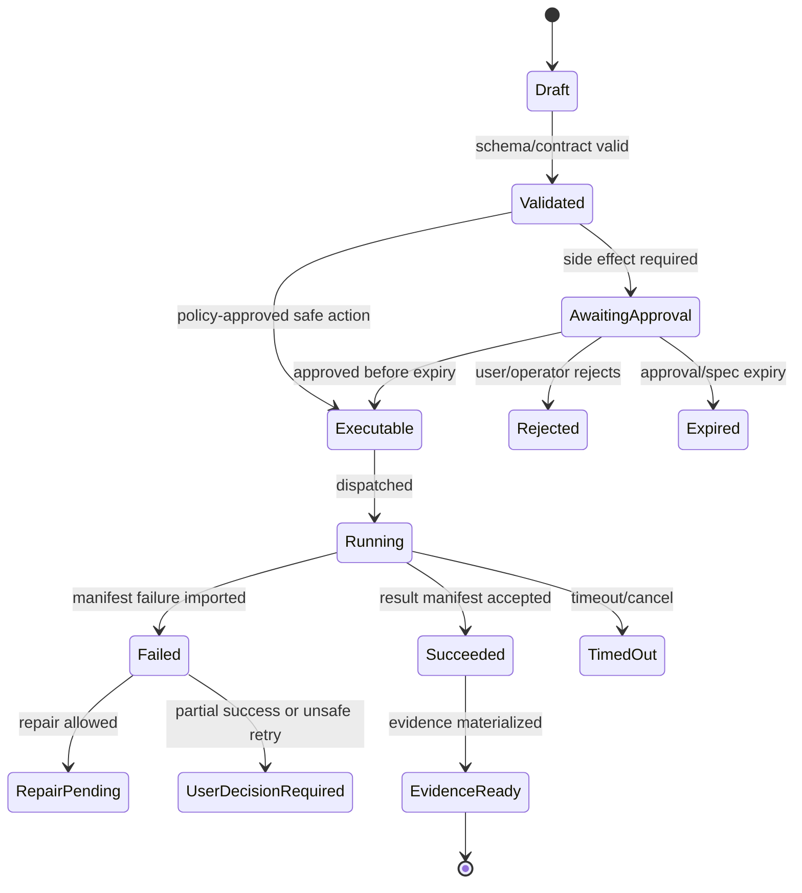

# Data Model - SQL and Blob

## V6.17 scope: web-managed and cloud support data

The SQL/Blob split in this note is authoritative for `web_managed` lifecycle/workspace/evidence and for bounded desktop support-plane records such as entitlements, package catalog, opt-in sync metadata, telemetry, and explicit remote jobs. It is not the persistence model for ordinary `windows_local` runs, approvals, execution, checkpoints, or file evidence.

Desktop authority uses SQLite plus encrypted local content-addressed payloads as specified in [[96 - Windows Local State, Evidence, Checkpoint, and Rollback]]. Azure records must use opaque desktop/project/device identifiers and relative/redacted metadata; local absolute paths and folder handles are prohibited.

## 1. Mission

Use Azure SQL for compact authoritative lifecycle state and Azure Blob for large immutable payloads, manifests, logs, snapshots, diffs, artifacts, and evidence bundles.

## 2. Responsibilities

- Define aggregates and SQL tables.
- Store lifecycle state, indexes, refs, hashes, and metadata in SQL.
- Store large payloads in Blob.
- Keep schema versions on every stored object.
- Support retention and cleanup.
- Enable replay by preserving event/payload refs.

## 3. Explicit Non-Responsibilities

- Do not bypass Airlock.
- Do not mutate authoritative state outside the Runtime API state transition path.
- Do not hide policy decisions inside UI-only code.
- Do not let model text become executable behavior without typed validation.
- Do not introduce a separate runtime semantics path unless an ADR approves it.

## 4. Interfaces and Ports

| Interface | Purpose |
|---|---|
| IRelationalStateStore | SQL aggregate state. |
| IBlobPayloadStore | Large payload storage. |
| IRetentionPolicy | Expiration and cleanup rules. |
| IMigrationRunner | Schema migrations. |
| IReplayLoader | Load run history from SQL + Blob refs. |

## 5. State and Lifecycle

SQL rows should be append-friendly but not a full event-log firehose. Use tables for projects, workspaces, snapshots, threads, messages, runs, proposals, approvals, executions, artifacts, trace indexes, policy decisions, model calls, checkpoints.

## 6. Data Contracts

Blob layout:

```text
snapshots/{projectId}/{snapshotId}/manifest.json
snapshots/{projectId}/{snapshotId}/files/{hash}
checkouts/{runId}/{checkoutId}/...
logs/{executionId}/stdout.ndjson
logs/{executionId}/stderr.ndjson
manifests/{executionId}/result.json
proposals/{proposalId}/patch.json
artifacts/{artifactId}/...
evidence/{runId}/bundle.json
trace-payloads/{traceId}/{payloadId}.json
```

SQL tables store blob URI/ref, hash, size, content type, retention class, and schema version.

## 7. Primary Flow

```text
API command
→ SQL transaction for state
→ Blob write for payload if needed
→ SQL payload ref update
→ outbox event
→ stream/materialization
```

## 8. Implementation Steps

- Create initial migrations.
- Implement Blob payload abstraction with hash verification.
- Implement retention classes.
- Implement result manifest import with idempotency.
- Implement event outbox.
- Create seed fixtures.
- Add migration tests and rollback tests.

## 9. Failure Modes and Mitigations

| Failure | Mitigation |
|---|---|
| SQL becomes log store | Enforce payload-size threshold and Blob refs. |
| Blob object orphaning | Sweeper compares SQL refs and retention rules. |
| Schema drift | Version every payload and add migration strategy. |
| Lost idempotency | Use idempotency keys and unique spec/execution hash. |
| Replay impossible | Persist enough refs/hashes to reconstruct evidence. |

## 10. Acceptance Criteria

- No large stdout/stderr stored in SQL.
- Every Blob payload has hash and schema version.
- Manifest import is idempotent.
- Retention policy can delete expired scratch data safely.
- Replay fixture loads a run from SQL + Blob refs.

---

## v2 Review Improvements

### 1. SQL vs Blob Rule

SQL stores compact, queryable lifecycle state. Blob stores large payloads, immutable manifests, logs, diffs, artifacts, and evidence bundles.

Do not put terminal logs, full context packs, raw prompts, or exported artifacts directly in SQL.

### 2. Core Entity Relationship

```text
Project 1-* Thread 1-* Run 1-* RunEvent
Project 1-* WorkspaceSnapshot 1-* Checkpoint
Run 1-* ModelCall
Run 1-* Proposal 1-* AirlockDecision
Proposal 1-* Approval 1-* Execution 1-* WorkerManifest
Execution 0-* Artifact
Checkpoint 0-* RollbackPlan
```

### 3. Blob Layout

```text
/projects/{projectId}/snapshots/{snapshotId}/manifest.json
/projects/{projectId}/runs/{runId}/context/{contextPackId}.json
/projects/{projectId}/runs/{runId}/proposals/{proposalId}/diff.patch
/projects/{projectId}/runs/{runId}/executions/{executionId}/logs/stdout.log
/projects/{projectId}/runs/{runId}/executions/{executionId}/manifest.json
/projects/{projectId}/runs/{runId}/evidence/{bundleId}/summary.md
/projects/{projectId}/artifacts/{artifactId}/output.pptx
```

### 4. Idempotency Keys

| Operation | Idempotency Key |
|---|---|
| create run from message | `threadId + messageClientId` |
| create proposal | `runId + modelOutputHash + proposalType` |
| approval decision | `proposalId + userId + decisionNonce` |
| dispatch execution | `approvalId + specHash` |
| import manifest | `executionId + manifestHash` |
| create checkpoint | `executionId + outputRootHash` |

### 5. Retention Classes

| Class | Examples | Default |
|---|---|---|
| lifecycle | run/proposal/approval state | retain. |
| evidence | evidence bundle, manifests, hashes | retain per project policy. |
| bulky logs | stdout/stderr, build output | shorter retention. |
| raw model payload | prompts/full context | off or privileged retention. |
| artifacts | exported files | project policy. |
| scratch | worker checkout/cache | TTL cleanup. |

### 6. Migration Rules

- Every schema migration has forward and rollback script where feasible.
- Contract version is stored on every JSON payload.
- Old evidence bundles remain readable after schema upgrades.
- Blob manifest schemas are versioned independently from SQL migrations.


---


---

## Implementation-depth contract

This file is part of the V6 implementation library. It is written as an implementation guide, not as a strategy memo. Every component must be built against the same system-wide constraints:

1. **The first executable slice comes before breadth.** The first demonstrable product must prove authenticated chat, workspace context, typed plan output, proposal creation, Airlock validation, approval, isolated execution, validation, checkpoint, and evidence.
2. **The delivery-specific authority owns lifecycle state.** The web Runtime API imports remote-worker facts into SQL; the signed desktop Rust host imports local-executor facts into SQLite. Workers, child processes, renderers, models, sync services, and support APIs do not advance authoritative lifecycle state.
3. **Airlock creates the only side-effect token.** Workspace writes, command runs, exports, package imports, dependency restores, and policy-sensitive actions require an `ApprovedExecutionSpec` issued by Airlock.
4. **The model does not own proposals.** Model Gateway returns typed model outputs. Run Orchestrator creates normalized `Proposal` records. Airlock validates proposals.
5. **No raw shell by default.** Commands are represented as `argv[]` plus policy metadata; `sh -c`, shell expansion, broad environment access, and open network access are blocked unless explicitly operator-approved.
6. **Every side effect is reconstructable.** Diffs, preimages, spec hashes, policy hashes, approvals, job image digests, result manifests, logs, artifacts, and rollback metadata must be traceable.
7. **Each module has ports.** Even inside a modular monolith, use explicit interfaces and contracts to avoid creating a god control plane.


## 1. Component identity

| Field | Value |
|---|---|
| Component | `Data Model: Azure SQL and Blob` |
| Area | `Persistence` |
| Primary implementation package | `src/Runtime.Infrastructure/Persistence` |
| Runtime/technology | `Azure SQL + Azure Blob Storage` |
| First-slice priority | `core` |


## 2. Purpose

Define relational lifecycle state in SQL and large/immutable payloads in Blob with deterministic references, retention, indexes, and migration policy.

The implementation must be narrow enough to fit the corrected first vertical slice, but designed so BMAD package execution, the existing presentation adapter, Builder Studio, SkillOps, replay, and operator controls can plug into the same contracts later.


## 3. Owns / does not own

### Owns
- SQL schema boundaries
- Blob namespace
- Migrations
- Data retention
- Payload/reference separation
- Lifecycle query design
- Blob hash verification

### Does not own
- UI rendering
- Worker execution logic
- Model prompt content generation


## 4. Public/API surface and internal ports

### Required API/routes or callable operations
- `GET /api/data/health`
- `POST /api/operator/retention/sweep`
- `GET /api/operator/storage/usage`
- `POST /api/operator/migrations/verify`


### Internal contract rules

- Every boundary uses typed, schema-versioned values. C# uses `Runtime.Contracts` / `Runtime.Domain`, Rust uses generated contract types plus `desktop-domain`, and TypeScript uses generated web or desktop facade types; no generated DTO grants runtime authority.
- External payloads must be schema-versioned. Internal objects may evolve faster but must not leak into OpenAPI without a contract version.
- Every state mutation must be idempotent or protected by optimistic concurrency.
- Every side-effect operation must receive an `ApprovedExecutionSpec` or be provably read-only.
- Every error response must use the standard error envelope with `code`, `message`, `correlationId`, `retryable`, and optional `detailsRef`.


### Starter interface/type sketch

```csharp
public interface IComponentPort<TRequest, TResult>
{
    Task<TResult> ExecuteAsync(TRequest request, CancellationToken ct);
}

public sealed record OperationContext(
    Guid ProjectId,
    Guid RunId,
    string ActorUserId,
    string CorrelationId,
    string PolicyVersion,
    DateTimeOffset RequestedAt);
```


## 5. State model

### Component states
- `migration_pending`
- `migration_applied`
- `blob_written`
- `blob_verified`
- `retention_marked`
- `retention_swept`
- `orphan_detected`
- `orphan_resolved`


### Generic side-effect lifecycle





## 6. Persistence responsibilities

### SQL tables or domain records touched
- `SchemaMigration`
- `BlobObjectRef`
- `Project`
- `Run`
- `Proposal`
- `Approval`
- `ExecutionJob`
- `Artifact`
- `EvidenceBundle`
- `RetentionPolicy`

### Blob/object storage paths touched
- `snapshots/*`
- `checkouts/*`
- `jobs/*`
- `artifacts/*`
- `evidence/*`
- `traces/*`
- `packages/*`


### Persistence rules

- In `web_managed`, SQL stores lifecycle state, compact indexes, ownership metadata, and references. In `windows_local`, SQLite stores the corresponding local authority records.
- In `web_managed`, Blob stores large immutable payloads: snapshots, logs, diffs, manifests, artifacts, exports, packages, traces, and validation reports. In `windows_local`, encrypted local content-addressed storage holds authority-owned payloads; cloud upload is explicit and purpose-scoped.
- Any Blob payload referenced from SQL must include content hash, schema version, created timestamp, and retention class.
- No raw secrets, broad credentials, or unredacted prompt/context payloads are stored by default.
- Migrations must be forward-safe and testable against fixture data.


## 7. Detailed implementation steps


### Phase 0 — Contract and spike

1. Create or update the relevant ADR before implementation when the decision affects hosting, policy, security, data ownership, or external dependencies.

2. Define public DTOs and durable JSON schemas first. Do not let implementation classes silently become external contracts.

3. Create a minimal fixture that exercises the component without requiring the whole platform.

4. Add negative tests for the most dangerous bypass or failure case before adding the happy path.

5. Record assumptions in the component file and in the ADR index if they are not final.

6. For `Data Model: Azure SQL and Blob`, implement only the smallest behavior that proves its contract in the first executable slice, then add extended BMAD/Builder/artifact behavior after gate approval.


### Phase 1 — Skeleton implementation

1. Create the package/module/folder with explicit ports/interfaces and dependency direction rules.

2. Add dependency injection registration with narrow interfaces rather than passing broad services everywhere.

3. Implement persistence only through repository/store abstractions that expose business operations, not raw table access.

4. Emit structured events for every important state transition even if the UI does not yet render them.

5. Add unit tests for object creation, invalid input, authorization/policy denial, and idempotency where relevant.

6. For `Data Model: Azure SQL and Blob`, implement only the smallest behavior that proves its contract in the first executable slice, then add extended BMAD/Builder/artifact behavior after gate approval.


### Phase 2 — First vertical integration

1. Connect the component to the first executable slice only. Avoid adding full future scope before the vertical path works.

2. Use fake/stub adapters for expensive external systems until the contract is proven.

3. Make all side effects flow through Proposal → AirlockDecision → Approval/Grant → ApprovedExecutionSpec → Dispatch.

4. Persist large payloads to Blob and store only compact references in SQL.

5. Return UI-consumable run events so the Chat Workbench can render progress without polling raw tables.

6. For `Data Model: Azure SQL and Blob`, implement only the smallest behavior that proves its contract in the first executable slice, then add extended BMAD/Builder/artifact behavior after gate approval.


### Phase 3 — Production hardening

1. Add telemetry attributes, correlation IDs, redaction, and audit events.

2. Add retry, timeout, cancellation, and stale-state handling.

3. Add migration scripts and seed data for dev/test.

4. Add operator visibility for status, errors, budget/policy impact, and cleanup status.

5. Document runbooks for the top failure modes.

6. For `Data Model: Azure SQL and Blob`, implement only the smallest behavior that proves its contract in the first executable slice, then add extended BMAD/Builder/artifact behavior after gate approval.


### Phase 4 — Regression and release gate

1. Add contract tests against OpenAPI/JSON Schema.

2. Add replay fixtures or golden outputs where deterministic behavior is expected.

3. Add security tests for prompt injection, secret leakage, excessive agency, insecure output handling, and supply-chain drift where relevant.

4. Update release gate evidence with screenshots/log excerpts/manifests rather than informal claims.

5. Mark open risks and deferred v1.5/v2 items explicitly.

6. For `Data Model: Azure SQL and Blob`, implement only the smallest behavior that proves its contract in the first executable slice, then add extended BMAD/Builder/artifact behavior after gate approval.


## 8. Validation and test plan

### Required tests
- SQL stores refs not large payloads
- blob hash mismatch detected
- migration reversible in dev
- orphan sweeper dry-run works
- retention preserves legal hold


### Minimum test layers

| Layer | What to test | Required before merge |
|---|---|---|
| Unit | object validation, state transitions, parsing, policy predicates | yes |
| Contract | OpenAPI/JSON Schema compatibility, generated clients, worker manifests | yes for public/durable payloads |
| Integration | SQL + Blob references, dispatch/import, authz, Airlock boundary | yes for side-effect paths |
| E2E | chat → proposal → approval → execution → evidence | yes for first slice files |
| Replay/golden | BMAD package fixtures, presentation adapter, evidence bundle | yes before v1 beta |
| Security negative | prompt injection, secret leak, policy bypass, path traversal, raw shell | yes for all side-effect components |


## 9. Failure modes and recovery

| Failure | Detection | Required behavior | User/operator visibility |
|---|---|---|---|
| Invalid schema | contract validation | reject before persistence or dispatch | show actionable error with correlation ID |
| Stale proposal/preimage | hash mismatch | void proposal or require rebase/new proposal | show stale context warning |
| Approval expired | expiry check | reject dispatch | show re-approve option |
| Policy mismatch | policy hash mismatch | reject spec | operator audit event |
| Worker timeout | job monitor | mark job timed out; preserve partial logs | timeline event + retry option if safe |
| Manifest missing/invalid | manifest import validation | do not advance success state | incident/failure card |
| Partial success | checkpoint/validation state | enter `user_decision_required` or `kept_for_repair` | explicit decision card |
| Secret detected | scanner/redactor | redact and block if high confidence | security finding card/operator event |


## 10. Security and policy requirements

- Treat workspace files, package files, generated artifacts, model outputs, and logs as untrusted input.
- Never let untrusted content override system instructions, Airlock policy, command allowlists, network policy, or secret handling.
- Enforce project-level authorization on every read and write.
- Log security-relevant denials as audit events, but do not include raw secret values.
- Prefer fail-closed behavior when policy, identity, schema, or storage checks are ambiguous.
- Add negative tests for the most likely bypass path before writing happy-path code.


## 11. Observability

Minimum telemetry fields for this component:

- `correlation.id`
- `project.id`
- `run.id` when available
- `component.name`
- `operation.name`
- `operation.outcome`
- `policy.version` when applicable
- `spec.id` when applicable
- `job.id` when applicable
- `artifact.id` when applicable
- redaction counters, not raw secrets

Metrics to consider: request latency, state-transition count, policy denials, approval wait time, job duration, manifest import failures, schema validation failures, retry count, budget blocks, and evidence materialization time.


## 12. Acceptance criteria

- [ ] The component has a clear owner package and does not leak responsibilities into unrelated modules.
- [ ] Public routes/payloads are represented in OpenAPI/JSON Schema where applicable.
- [ ] Side-effect paths cannot execute without Airlock evaluation and `ApprovedExecutionSpec`.
- [ ] SQL lifecycle state is mutated only by the Runtime API/Application layer.
- [ ] Blob payloads have content hashes and schema versions.
- [ ] Tests include at least one negative/bypass case.
- [ ] Events and evidence are emitted for user-visible actions.
- [ ] The component is represented in the release gate matrix.
- [ ] The implementation does not introduce Cortex as a runtime namespace.
- [ ] Documentation includes deferred v1.5/v2 scope explicitly rather than silently omitting it.


## 13. Integration checklist

- [ ] Update `32 - Integration Contract Map.md` with any new caller/callee relationship.
- [ ] Update `25 - OpenAPI, Schemas, and Generated Clients.md` for public route or schema changes.
- [ ] Update `22 - Data Model - SQL and Blob.md`, `47 - Database DDL Starter.md`, or `48 - Blob Storage Layout.md` for persistence changes.
- [ ] Update `27 - Testing, Validation, and Replay.md` for new fixtures or replay needs.
- [ ] Update `33 - Release Gates and Acceptance Matrix.md` if the change affects release readiness.
- [ ] Add or update ADR in `31 - Architecture Decision Records.md` if the change alters architecture, hosting, policy, or security posture.


## starter SQL table sketch

```sql
CREATE TABLE Projects (
  ProjectId UNIQUEIDENTIFIER NOT NULL PRIMARY KEY,
  Name NVARCHAR(200) NOT NULL,
  CreatedBy NVARCHAR(200) NOT NULL,
  CreatedAt DATETIMEOFFSET NOT NULL,
  Status NVARCHAR(40) NOT NULL
);

CREATE TABLE Runs (
  RunId UNIQUEIDENTIFIER NOT NULL PRIMARY KEY,
  ProjectId UNIQUEIDENTIFIER NOT NULL,
  ThreadId UNIQUEIDENTIFIER NOT NULL,
  State NVARCHAR(80) NOT NULL,
  CurrentCheckpointId UNIQUEIDENTIFIER NULL,
  CorrelationId NVARCHAR(100) NOT NULL,
  CreatedAt DATETIMEOFFSET NOT NULL,
  UpdatedAt DATETIMEOFFSET NOT NULL,
  RowVersion ROWVERSION NOT NULL
);

CREATE TABLE Proposals (
  ProposalId UNIQUEIDENTIFIER NOT NULL PRIMARY KEY,
  RunId UNIQUEIDENTIFIER NOT NULL,
  ProposalType NVARCHAR(80) NOT NULL,
  State NVARCHAR(80) NOT NULL,
  PayloadBlobRef NVARCHAR(500) NOT NULL,
  PayloadHash NVARCHAR(100) NOT NULL,
  CreatedAt DATETIMEOFFSET NOT NULL,
  RowVersion ROWVERSION NOT NULL
);

CREATE TABLE ApprovedExecutionSpecs (
  SpecId UNIQUEIDENTIFIER NOT NULL PRIMARY KEY,
  ProposalId UNIQUEIDENTIFIER NOT NULL,
  ApprovalId UNIQUEIDENTIFIER NOT NULL,
  PolicyVersion NVARCHAR(100) NOT NULL,
  PolicyHash NVARCHAR(100) NOT NULL,
  SpecHash NVARCHAR(100) NOT NULL,
  ExpiresAt DATETIMEOFFSET NOT NULL,
  PayloadBlobRef NVARCHAR(500) NOT NULL,
  CreatedAt DATETIMEOFFSET NOT NULL
);
```

This sketch is not the full production schema. It is the minimum spine needed for the first executable vertical slice.


---

## Historical Revision Notes (V3 -> V4 Hardening Pass)
### V4 audit finding applied to this file
The v3 library was detailed, but several files still behaved like expanded planning notes rather than implementation handbooks. This pass adds enforceable implementation details: exact build sequence, explicit boundaries, input/output contracts, database/blob ownership, event names, failure states, tests, and release gates.

## System invariants this component must obey

1. The first delivered slice remains: **authenticated chat → workspace context → implementation plan → proposal → Airlock → approval → isolated job → validation → checkpoint → evidence**.
2. No worker image receives Azure SQL write credentials. Workers produce signed/hashed append-only manifests in Blob; the Runtime API imports them and advances SQL lifecycle state.
3. No file write, command run, dependency restore, package import, artifact export, checkpoint mutation, or rollback can execute without an `ApprovedExecutionSpec` minted by Airlock.
4. The Model Gateway returns typed model outputs only. The Run Orchestrator creates platform `Proposal` records. Airlock validates proposals and creates approved specs.
5. Commands are `argv[]` specs, not raw shell strings. Shell execution is a separate high-risk command class.
6. Every state transition emits a run event and trace event with correlation ID, actor/service principal, schema version, and payload hash or payload reference.
7. Every persisted object carries schema version, retention class, project scope, created/updated timestamps, and hash/provenance where relevant.
8. Any component that reads workspace content treats it as untrusted user-controlled input and cannot allow it to override system policy, command allowlists, approval requirements, or secrets handling.


## Component build card

| Field | Value |
|---|---|
| Component | `Data Model SQL and Blob` |
| Primary package/path | `src/Runtime.Infrastructure/Persistence` |
| Current implementation status | `v6-validated` |
| Required for first vertical slice | `yes` |

## Validated API/port touchpoints

- `N/A - persistence module behind ports`

## Validated domain events to implement or consume

- `db.migration.applied`
- `blob.payload.written`
- `blob.lifecycle.applied`
- `retention.policy.evaluated`

## Validated SQL ownership / indexes

- `projects`
- `threads`
- `messages`
- `runs`
- `proposals`
- `execution_spec_candidates`
- `policy_decisions`
- `approvals`
- `approved_execution_specs`
- `executions`
- `work_items`
- `work_attempts`
- `work_leases`
- `work_completions`
- `evidence_ledger_events`
- `outbox_messages`
- `workspaces`
- `snapshots`
- `checkpoints`
- `artifacts`
- `source_snapshots`
- `source_verifications`
- `component_license_decisions`
- `model_profiles`
- `model_evaluation_bundles`
- `trace_events` (projection only)

Implementation notes:

- Tables listed here are owned by their module or exposed through its port; other modules must not perform direct ad-hoc writes.
- Mutable lifecycle tables need optimistic concurrency tokens.
- All records need `project_id`, `schema_version`, `created_at`, `updated_at`, and retention classification where applicable.

## Validated Blob payload layout

- `snapshots/*`
- `checkouts/*`
- `logs/*`
- `manifests/*`
- `traces/*`
- `artifacts/*`
- `packages/*`
- `evidence/*`

Implementation notes:

- Blob payloads are content-addressed or hash-checked before import.
- SQL stores compact payload references, not bulky logs/prompts/artifacts.
- Retention class and redaction level must be explicit for every payload family.

## Validated step-by-step build procedure

1. Use SQL for lifecycle state and compact indexes, Blob for large payloads, logs, manifests, snapshots, exports, evidence bundles.
2. Every Blob payload stored from SQL should have URI, content hash, media type, schema version, retention class, and encryption scope if needed.
3. Migrations are forward-only with rollback notes and data backfill scripts.
4. Add rowversion/optimistic concurrency on mutable lifecycle tables.
5. Commit each authoritative lifecycle transition, `EvidenceLedgerEvent`, and `OutboxMessage` atomically. Work completion/import uses a unique completion nonce and idempotent result hash so redelivery never re-executes.
6. Do not store raw log streams or raw prompts directly in SQL.

## Validated edge cases that must be tested

| Edge case | Expected behavior |
|---|---|
| Duplicate API request with same idempotency key | Returns original result; no duplicate state transition or worker dispatch. |
| Stale proposal after newer checkpoint | Proposal is voided or requires rebase; approval is blocked. |
| Expired approval/spec | Side-effect endpoint rejects request; UI asks for refresh. |
| Unknown schema version | Import/read path rejects or routes to migration handler. |
| Blob payload hash mismatch | Runtime refuses import and creates security/audit finding. |
| User lacks project role | API returns access denied; no object existence leakage. |
| Workspace contains prompt injection in docs/code | Treated as untrusted content; cannot change system policy or tool permissions. |
| Worker crashes after writing partial logs | Execution becomes failed/unknown with partial log refs; retry uses same spec rules. |

## Validated release gate for this component

- Unit tests cover all domain transitions owned by this component.
- Contract tests cover all listed API touchpoints or port methods.
- Integration tests prove SQL/Blob responsibility boundaries.
- Security tests cover unauthorized access and malformed payloads.
- Replay fixture includes at least one success path and one failure path relevant to this component.
- Observability emits trace/span/log attributes with the shared correlation ID.
- Documentation examples compile or validate against JSON Schema/OpenAPI where relevant.

## V6.16 persistence invariants

| Invariant | Required database behavior |
|---|---|
| Owner isolation | Every user/project resource and machine action is reachable through `OwnerScope`; cross-owner reads return non-disclosing not-found/denied behavior. |
| Exact approval | Candidate is immutable; approval stores candidate hash; spec stores candidate/proposal/approval/policy hashes, audience/template, issue/expiry, single-use nonce, and consumption time. |
| Durable work | `WorkItem -> WorkAttempt -> WorkLease -> WorkCompletion`; retry creates a new attempt, leases use database CAS, terminal completion is immutable. |
| Evidence/outbox | State transition + completion when applicable + sequenced `EvidenceLedgerEvent` + `OutboxMessage` are one transaction. Telemetry/audit/trace tables are projections. |
| Source and license | Snapshot identity/verification are separate from path-level component-license decisions; missing Git identity or unresolved license blocks promotion without erasing research evidence. |
| Model promotion | Exact deployment/capability/schema/credential-retention profile and immutable four-lane evaluation bundle precede canary/active state; rollback target is retained. |
| Blob reference | Every large payload ref includes hash, schema/media type, owner scope, retention/redaction class, created time, and expected prefix; imports verify all fields. |
