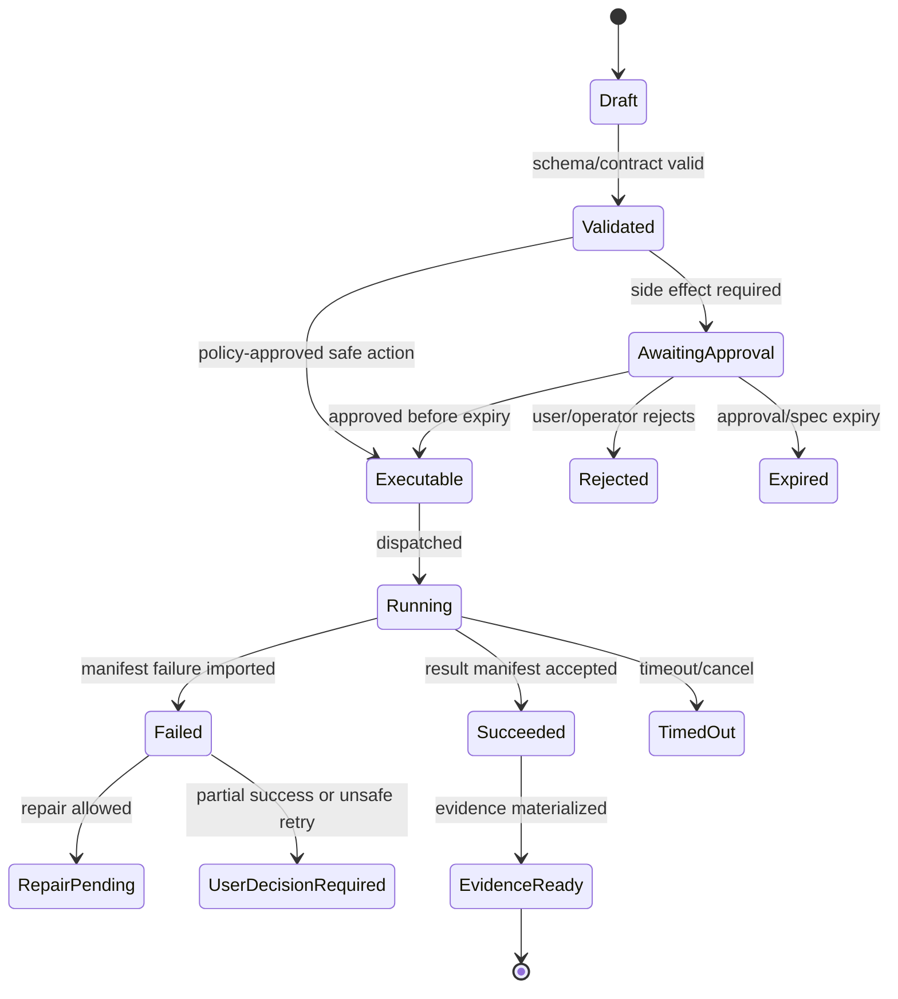

# Security, Identity, and Secrets

## V6.17 security applicability

This note remains the web/control-plane security baseline. The Windows product adds a native trust boundary, public-client Entra authentication, DPAPI-protected local key material, renderer/IPC authorization, selected-folder capabilities, signed installer/updater, local evidence integrity, and child-process containment claims defined in [[97 - Windows Desktop Security and Trust Model]].

Azure may authenticate/license the desktop and broker model/package/sync/remote services, but cannot hold a local folder handle, local approval token, provider key on device, or remote-control primitive. Job Objects are not filesystem/network isolation. If arbitrary child tools must be restricted to selected folders, DESK-01 is a release-blocking AppContainer/broker proof.

## 1. Mission

Enforce workforce identity, project-scoped authorization, least-privilege managed identities, Key Vault access, prompt-injection boundaries, secret redaction, and audit trails.

## 2. Responsibilities

- Use Microsoft Entra ID for users and service principals.
- Apply project-scoped RBAC and operator roles.
- Use managed identity for Azure resource access.
- Store secrets in Key Vault.
- Prevent workspace content from overriding instructions/policy.
- Redact secrets in prompts, logs, traces, and exports.
- Audit admin/operator actions separately.

## 3. Explicit Non-Responsibilities

- Do not bypass Airlock.
- Do not mutate authoritative state outside the Runtime API state transition path.
- Do not hide policy decisions inside UI-only code.
- Do not let model text become executable behavior without typed validation.
- Do not introduce a separate runtime semantics path unless an ADR approves it.

## 4. Interfaces and Ports

| Interface | Purpose |
|---|---|
| IUserContext | Authenticated principal, groups, scopes. |
| IAuthorizationService | Project/role checks. |
| ISecretProvider | Key Vault access through managed identity. |
| ISecretRedactor | Path/content/output redaction. |
| IPromptBoundaryBuilder | Trusted vs untrusted prompt sections. |
| IAuditWriter | Security and operator audit events. |

## 5. State and Lifecycle

Security decisions are evaluated before application commands. Authorization failures do not leak resource existence unless policy allows. Operator events have separate audit categories.

## 6. Data Contracts

Core roles:

| Role | Permissions |
|---|---|
| Viewer | read project threads/artifacts/evidence summaries. |
| Developer | create runs, approve own scoped side effects if policy allows. |
| Reviewer | approve/reject review-gated proposals. |
| Builder | import/validate Builder packages. |
| Operator | manage policies, budgets, incidents, worker images. |
| SecurityAdmin | access forensic trace views and sensitive audit. |

Secret classes: path secrets, pattern secrets, provider credentials, source tokens, model keys, signing keys, raw forensic payloads.

## 7. Primary Flow

```text
Request enters API
→ authenticate via Entra/App Service auth
→ map claims/groups to app roles
→ authorize project/action
→ apply policy-specific checks
→ write audit event
```

## 8. Implementation Steps

- Configure auth middleware and local dev auth mode.
- Define roles/scopes and project assignment model.
- Implement Key Vault secret adapter.
- Implement secret redaction tests.
- Add prompt boundary templates.
- Add LLM prompt-injection threat tests.
- Implement separate operator audit events.
- Add least-privilege managed identities for API and workers.

## 9. Failure Modes and Mitigations

| Failure | Mitigation |
|---|---|
| Prompt injection from repo file | Workspace content always quoted as untrusted data. |
| Secret leaks in logs | Redact before storage/stream/model context. |
| Overbroad worker identity | Per-worker managed identity where practical; no SQL write creds. |
| Operator panel exposed | Route + API scopes + audit. |
| Approval by wrong user | Approval records verify actor, role, project, policy. |

## 10. Acceptance Criteria

- Unauthorized user cannot access project thread.
- Worker cannot read unrelated Key Vault secrets.
- Secret fixture is redacted from context/log/evidence.
- Prompt-injection fixture cannot alter Airlock policy.
- Operator actions are audited with separate category.

## OpenClaw-Informed File and Config Safety

OpenClaw's secure-file and config-compatibility posture in [[84 - OpenClaw Source Review - Comparable Runtime Patterns]] maps directly to Sapphirus:

- Use safe filesystem helpers for root-bounded reads/writes, archive extraction, temporary workspaces, atomic replace, private secret/state files, symlink checks, hardlink checks, byte limits, and entry-count limits.
- Do not implement path safety with string prefix checks alone. Resolve through trusted roots and re-check after resolving existing ancestors so symlink-parent escapes fail closed.
- Archive/package extraction must enforce max total bytes, max file count, max path length, link policy, destination root, and blocked path classes before any package is registered.
- Steady-state runtime should read only canonical config shapes. Older package/runtime config shapes belong in explicit import/doctor/migration flows, not long-lived runtime fallback readers.
- Compatibility migrations must back up old user-owned files where practical and emit evidence showing what changed.

### Secrets Apply Plan Contract

Secret and config mutation must be planned before write:

| Plan field | Rule |
|---|---|
| `targets` | Each target declares type, normalized path segments, provider/account/package IDs, and expected existing hash where applicable. |
| `validation` | Reject empty paths, path traversal, prototype-pollution names, mismatched provider/account IDs, and unknown target types before any write. |
| `rollback` | Snapshot touched files/records first; restore on failure and emit rollback evidence. |
| `plainTextHandling` | Plaintext may exist only in approved memory/temp scope and must be scrubbed from logs, traces, evidence, and persisted payloads. |
| `migrationMode` | Old config shapes are accepted only by import/doctor flows that write the canonical shape and record migration evidence. |

---

## v2 Review Improvements

### 1. Threat Model Priorities

| Threat | Control |
|---|---|
| Prompt injection from workspace files | Mark workspace content untrusted; never allow content to modify policy/system instructions. |
| Insecure model output handling | Typed outputs, orchestrator normalization, Airlock validation. |
| Excessive agency | Model cannot write/run/export; side effects require approval/spec. |
| Secret leakage into prompts/logs | secret scanner, redaction, raw trace restrictions. |
| Command injection | `argv[]`, shell denied, cwd canonicalization. |
| Path traversal/symlink escape | workspace root canonicalization and worker checks. |
| Worker privilege abuse | minimal identity, network default-deny, digest-pinned images. |
| Operator misuse | route/API scope separation, audit events, least privilege. |

### 2. Role Model

| Role | Permissions |
|---|---|
| Viewer | read threads/artifacts/evidence summaries. |
| Contributor | create messages, proposals, approve low/medium project actions. |
| Reviewer | approve high-risk actions within project policy. |
| Operator | manage policies, budgets, worker images, incidents. |
| Security Admin | privileged trace access, policy changes, secret incident review. |

### 3. Identity Rules

- Authenticate users through Entra-backed application auth.
- Use group claims or app roles for project/operator/security permissions.
- Workers use managed identity with least privilege to specific Blob paths/queues only.
- Model/API keys stay in Key Vault or managed provider integration; never in app settings if avoidable.
- No workspace file can supply credentials to runtime policy.

### 4. Secret Redaction Requirements

| Location | Redaction Required? |
|---|---|
| model prompt | yes, before call. |
| model output | yes, before persistence/display. |
| terminal logs | yes, before stream/model repair. |
| trace events | yes, default. |
| evidence summary | yes. |
| privileged raw payload | access-controlled and audited. |

### 5. Security Acceptance Tests

- Start Here prompt injection cannot bypass approval.
- `.env` file is excluded from context pack.
- Token-like string in source is redacted before model call.
- Worker has no broad Blob write outside run prefix.
- Non-operator cannot access `/operator/*` or operator APIs.
- High-risk side effect requires reviewer/operator according to policy.
- External publish is denied in v1.


---


---

## Implementation-depth contract

This file is part of the V6 implementation library. It is written as an implementation guide, not as a strategy memo. Every component must be built against the same system-wide constraints:

1. **The first executable slice comes before breadth.** The first demonstrable product must prove authenticated chat, workspace context, typed plan output, proposal creation, Airlock validation, approval, isolated execution, validation, checkpoint, and evidence.
2. **The delivery-specific authority owns lifecycle state.** The web Runtime API imports remote-worker facts into SQL; the signed desktop Rust host imports local-executor facts into SQLite. Workers, child processes, renderers, models, sync services, and support APIs do not advance authoritative lifecycle state.
3. **Airlock creates the only side-effect token.** Workspace writes, command runs, exports, package imports, dependency restores, and policy-sensitive actions require an `ApprovedExecutionSpec` issued by Airlock.
4. **The model does not own proposals.** Model Gateway returns typed model outputs. Run Orchestrator creates normalized `Proposal` records. Airlock validates proposals.
5. **No raw shell by default.** Commands are represented as `argv[]` plus policy metadata; `sh -c`, shell expansion, broad environment access, and open network access are blocked unless explicitly operator-approved.
6. **Every side effect is reconstructable.** Diffs, preimages, spec hashes, policy hashes, approvals, job image digests, result manifests, logs, artifacts, and rollback metadata must be traceable.
7. **Each module has ports.** Even inside a modular monolith, use explicit interfaces and contracts to avoid creating a god control plane.


## 1. Component identity

| Field | Value |
|---|---|
| Component | `Security, Identity, and Secrets` |
| Area | `Security baseline` |
| Primary implementation package | `src/Runtime.Infrastructure/Security + apps/web auth` |
| Runtime/technology | `Entra ID + Managed Identity + Key Vault + policy code` |
| First-slice priority | `core` |


## 2. Purpose

Protect users, projects, secrets, prompts, traces, workspaces, executor credentials, and operator functions with least privilege and explicit trust boundaries.

The implementation must be narrow enough to fit the corrected first vertical slice, but designed so BMAD package execution, the existing presentation adapter, Builder Studio, SkillOps, replay, and operator controls can plug into the same contracts later.


## 3. Owns / does not own

### Owns
- Authentication
- RBAC authorization
- Project access checks
- Managed identity use
- Key Vault integration
- Secret redaction
- Prompt-injection boundaries
- Security audit events

### Does not own
- Business run routing
- Model judgment as a security boundary
- Broad user delegation without policy


## 4. Public/API surface and internal ports

### Required API/routes or callable operations
- `GET /api/me`
- `GET /api/authz/projects/{id}`
- `POST /api/operator/roles`
- `POST /api/security/redact`
- `GET /api/security/audit`


### Internal contract rules

- Every boundary uses typed, schema-versioned values. C# uses `Runtime.Contracts` / `Runtime.Domain`, Rust uses generated contract types plus `desktop-domain`, and TypeScript uses generated web or desktop facade types; no generated DTO grants runtime authority.
- External payloads must be schema-versioned. Internal objects may evolve faster but must not leak into OpenAPI without a contract version.
- Every state mutation must be idempotent or protected by optimistic concurrency.
- Every side-effect operation must receive an `ApprovedExecutionSpec` or be provably read-only.
- Every error response must use the standard error envelope with `code`, `message`, `correlationId`, `retryable`, and optional `detailsRef`.


### Starter interface/type sketch

```csharp
public interface IComponentPort<TRequest, TResult>
{
    Task<TResult> ExecuteAsync(TRequest request, CancellationToken ct);
}

public sealed record OperationContext(
    Guid ProjectId,
    Guid RunId,
    string ActorUserId,
    string CorrelationId,
    string PolicyVersion,
    DateTimeOffset RequestedAt);
```


## 5. State model

### Component states
- `authenticated`
- `authorized`
- `denied`
- `secret_detected`
- `secret_redacted`
- `break_glass_requested`
- `break_glass_approved`
- `security_incident_opened`


### Generic side-effect lifecycle





## 6. Persistence responsibilities

### SQL tables or domain records touched
- `UserProfile`
- `RoleAssignment`
- `ProjectAccess`
- `SecretFinding`
- `SecurityAuditEvent`
- `BreakGlassRequest`
- `Incident`

### Blob/object storage paths touched
- `security/redaction-rules.json`
- `security/incidents/{incidentId}/evidence.json`
- `security/secret-scan-results/{scanId}.json`


### Persistence rules

- In `web_managed`, SQL stores lifecycle state, compact indexes, ownership metadata, and references. In `windows_local`, SQLite stores the corresponding local authority records.
- In `web_managed`, Blob stores large immutable payloads: snapshots, logs, diffs, manifests, artifacts, exports, packages, traces, and validation reports. In `windows_local`, encrypted local content-addressed storage holds authority-owned payloads; cloud upload is explicit and purpose-scoped.
- Any Blob payload referenced from SQL must include content hash, schema version, created timestamp, and retention class.
- No raw secrets, broad credentials, or unredacted prompt/context payloads are stored by default.
- Migrations must be forward-safe and testable against fixture data.


## 7. Detailed implementation steps


### Phase 0 — Contract and spike

1. Create or update the relevant ADR before implementation when the decision affects hosting, policy, security, data ownership, or external dependencies.

2. Define public DTOs and durable JSON schemas first. Do not let implementation classes silently become external contracts.

3. Create a minimal fixture that exercises the component without requiring the whole platform.

4. Add negative tests for the most dangerous bypass or failure case before adding the happy path.

5. Record assumptions in the component file and in the ADR index if they are not final.

6. For `Security, Identity, and Secrets`, implement only the smallest behavior that proves its contract in the first executable slice, then add extended BMAD/Builder/artifact behavior after gate approval.


### Phase 1 — Skeleton implementation

1. Create the package/module/folder with explicit ports/interfaces and dependency direction rules.

2. Add dependency injection registration with narrow interfaces rather than passing broad services everywhere.

3. Implement persistence only through repository/store abstractions that expose business operations, not raw table access.

4. Emit structured events for every important state transition even if the UI does not yet render them.

5. Add unit tests for object creation, invalid input, authorization/policy denial, and idempotency where relevant.

6. For `Security, Identity, and Secrets`, implement only the smallest behavior that proves its contract in the first executable slice, then add extended BMAD/Builder/artifact behavior after gate approval.


### Phase 2 — First vertical integration

1. Connect the component to the first executable slice only. Avoid adding full future scope before the vertical path works.

2. Use fake/stub adapters for expensive external systems until the contract is proven.

3. Make all side effects flow through Proposal → AirlockDecision → Approval/Grant → ApprovedExecutionSpec → Dispatch.

4. Persist large payloads to Blob and store only compact references in SQL.

5. Return UI-consumable run events so the Chat Workbench can render progress without polling raw tables.

6. For `Security, Identity, and Secrets`, implement only the smallest behavior that proves its contract in the first executable slice, then add extended BMAD/Builder/artifact behavior after gate approval.


### Phase 3 — Production hardening

1. Add telemetry attributes, correlation IDs, redaction, and audit events.

2. Add retry, timeout, cancellation, and stale-state handling.

3. Add migration scripts and seed data for dev/test.

4. Add operator visibility for status, errors, budget/policy impact, and cleanup status.

5. Document runbooks for the top failure modes.

6. For `Security, Identity, and Secrets`, implement only the smallest behavior that proves its contract in the first executable slice, then add extended BMAD/Builder/artifact behavior after gate approval.


### Phase 4 — Regression and release gate

1. Add contract tests against OpenAPI/JSON Schema.

2. Add replay fixtures or golden outputs where deterministic behavior is expected.

3. Add security tests for prompt injection, secret leakage, excessive agency, insecure output handling, and supply-chain drift where relevant.

4. Update release gate evidence with screenshots/log excerpts/manifests rather than informal claims.

5. Mark open risks and deferred v1.5/v2 items explicitly.

6. For `Security, Identity, and Secrets`, implement only the smallest behavior that proves its contract in the first executable slice, then add extended BMAD/Builder/artifact behavior after gate approval.


## 8. Validation and test plan

### Required tests
- user cannot access another project
- secrets excluded from context pack
- prompt injection cannot override Airlock
- Key Vault access uses managed identity
- operator route requires admin scope


### Minimum test layers

| Layer | What to test | Required before merge |
|---|---|---|
| Unit | object validation, state transitions, parsing, policy predicates | yes |
| Contract | OpenAPI/JSON Schema compatibility, generated clients, worker manifests | yes for public/durable payloads |
| Integration | SQL + Blob references, dispatch/import, authz, Airlock boundary | yes for side-effect paths |
| E2E | chat → proposal → approval → execution → evidence | yes for first slice files |
| Replay/golden | BMAD package fixtures, presentation adapter, evidence bundle | yes before v1 beta |
| Security negative | prompt injection, secret leak, policy bypass, path traversal, raw shell | yes for all side-effect components |


## 9. Failure modes and recovery

| Failure | Detection | Required behavior | User/operator visibility |
|---|---|---|---|
| Invalid schema | contract validation | reject before persistence or dispatch | show actionable error with correlation ID |
| Stale proposal/preimage | hash mismatch | void proposal or require rebase/new proposal | show stale context warning |
| Approval expired | expiry check | reject dispatch | show re-approve option |
| Policy mismatch | policy hash mismatch | reject spec | operator audit event |
| Worker timeout | job monitor | mark job timed out; preserve partial logs | timeline event + retry option if safe |
| Manifest missing/invalid | manifest import validation | do not advance success state | incident/failure card |
| Partial success | checkpoint/validation state | enter `user_decision_required` or `kept_for_repair` | explicit decision card |
| Secret detected | scanner/redactor | redact and block if high confidence | security finding card/operator event |


## 10. Security and policy requirements

- Treat workspace files, package files, generated artifacts, model outputs, and logs as untrusted input.
- Never let untrusted content override system instructions, Airlock policy, command allowlists, network policy, or secret handling.
- Enforce project-level authorization on every read and write.
- Log security-relevant denials as audit events, but do not include raw secret values.
- Prefer fail-closed behavior when policy, identity, schema, or storage checks are ambiguous.
- Add negative tests for the most likely bypass path before writing happy-path code.


## 11. Observability

Minimum telemetry fields for this component:

- `correlation.id`
- `project.id`
- `run.id` when available
- `component.name`
- `operation.name`
- `operation.outcome`
- `policy.version` when applicable
- `spec.id` when applicable
- `job.id` when applicable
- `artifact.id` when applicable
- redaction counters, not raw secrets

Metrics to consider: request latency, state-transition count, policy denials, approval wait time, job duration, manifest import failures, schema validation failures, retry count, budget blocks, and evidence materialization time.


## 12. Acceptance criteria

- [ ] The component has a clear owner package and does not leak responsibilities into unrelated modules.
- [ ] Public routes/payloads are represented in OpenAPI/JSON Schema where applicable.
- [ ] Side-effect paths cannot execute without Airlock evaluation and `ApprovedExecutionSpec`.
- [ ] SQL lifecycle state is mutated only by the Runtime API/Application layer.
- [ ] Blob payloads have content hashes and schema versions.
- [ ] Tests include at least one negative/bypass case.
- [ ] Events and evidence are emitted for user-visible actions.
- [ ] The component is represented in the release gate matrix.
- [ ] The implementation does not introduce Cortex as a runtime namespace.
- [ ] Documentation includes deferred v1.5/v2 scope explicitly rather than silently omitting it.


## 13. Integration checklist

- [ ] Update `32 - Integration Contract Map.md` with any new caller/callee relationship.
- [ ] Update `25 - OpenAPI, Schemas, and Generated Clients.md` for public route or schema changes.
- [ ] Update `22 - Data Model - SQL and Blob.md`, `47 - Database DDL Starter.md`, or `48 - Blob Storage Layout.md` for persistence changes.
- [ ] Update `27 - Testing, Validation, and Replay.md` for new fixtures or replay needs.
- [ ] Update `33 - Release Gates and Acceptance Matrix.md` if the change affects release readiness.
- [ ] Add or update ADR in `31 - Architecture Decision Records.md` if the change alters architecture, hosting, policy, or security posture.


---

## Historical Revision Notes (V3 -> V4 Hardening Pass)
### V4 audit finding applied to this file
The v3 library was detailed, but several files still behaved like expanded planning notes rather than implementation handbooks. This pass adds enforceable implementation details: exact build sequence, explicit boundaries, input/output contracts, database/blob ownership, event names, failure states, tests, and release gates.

## System invariants this component must obey

1. The first delivered slice remains: **authenticated chat → workspace context → implementation plan → proposal → Airlock → approval → isolated job → validation → checkpoint → evidence**.
2. No worker image receives Azure SQL write credentials. Workers produce signed/hashed append-only manifests in Blob; the Runtime API imports them and advances SQL lifecycle state.
3. No file write, command run, dependency restore, package import, artifact export, checkpoint mutation, or rollback can execute without an `ApprovedExecutionSpec` minted by Airlock.
4. The Model Gateway returns typed model outputs only. The Run Orchestrator creates platform `Proposal` records. Airlock validates proposals and creates approved specs.
5. Commands are `argv[]` specs, not raw shell strings. Shell execution is a separate high-risk command class.
6. Every state transition emits a run event and trace event with correlation ID, actor/service principal, schema version, and payload hash or payload reference.
7. Every persisted object carries schema version, retention class, project scope, created/updated timestamps, and hash/provenance where relevant.
8. Any component that reads workspace content treats it as untrusted user-controlled input and cannot allow it to override system policy, command allowlists, approval requirements, or secrets handling.


## Component build card

| Field | Value |
|---|---|
| Component | `Security, Identity, Secrets` |
| Primary package/path | `src/Runtime.Infrastructure/Security + infra/bicep` |
| Current implementation status | `v6-validated` |
| Required for first vertical slice | `yes` |

## Validated API/port touchpoints

- `GET /api/me`
- `GET /api/projects/{projectId}/permissions`
- `POST /api/operator/policies`
- `POST /api/operator/secrets/rotate-request`

## Validated domain events to implement or consume

- `auth.user.mapped`
- `rbac.denied`
- `secret.redacted`
- `policy.changed`
- `credential.scope.issued`
- `security.finding.created`

## Validated SQL ownership / indexes

- `users`
- `groups`
- `project_memberships`
- `roles`
- `secret_refs`
- `security_findings`
- `policy_audit_events`

Implementation notes:

- Tables listed here are owned by their module or exposed through its port; other modules must not perform direct ad-hoc writes.
- Mutable lifecycle tables need optimistic concurrency tokens.
- All records need `project_id`, `schema_version`, `created_at`, `updated_at`, and retention classification where applicable.

## Validated Blob payload layout

- `security/reports/*`
- `redaction-samples/*`
- `policy-snapshots/*`

Implementation notes:

- Blob payloads are content-addressed or hash-checked before import.
- SQL stores compact payload references, not bulky logs/prompts/artifacts.
- Retention class and redaction level must be explicit for every payload family.

## Validated step-by-step build procedure

1. Use Entra ID for workforce auth and group-to-project-role mapping.
2. Use managed identities for Azure resource access; avoid shared long-lived secrets where possible.
3. Workers receive scoped temporary credentials only when spec permits it.
4. Secrets are excluded from context packs, logs, traces, model calls, exports, and evidence by default.
5. Implement security tests for prompt injection, path traversal, symlink escape, secret exfiltration, command injection, and excessive agency.
6. Operator policy changes require audit events and policy versioning.

## Validated edge cases that must be tested

| Edge case | Expected behavior |
|---|---|
| Duplicate API request with same idempotency key | Returns original result; no duplicate state transition or worker dispatch. |
| Stale proposal after newer checkpoint | Proposal is voided or requires rebase; approval is blocked. |
| Expired approval/spec | Side-effect endpoint rejects request; UI asks for refresh. |
| Unknown schema version | Import/read path rejects or routes to migration handler. |
| Blob payload hash mismatch | Runtime refuses import and creates security/audit finding. |
| User lacks project role | API returns access denied; no object existence leakage. |
| Workspace contains prompt injection in docs/code | Treated as untrusted content; cannot change system policy or tool permissions. |
| Worker crashes after writing partial logs | Execution becomes failed/unknown with partial log refs; retry uses same spec rules. |

## Validated release gate for this component

- Unit tests cover all domain transitions owned by this component.
- Contract tests cover all listed API touchpoints or port methods.
- Integration tests prove SQL/Blob responsibility boundaries.
- Security tests cover unauthorized access and malformed payloads.
- Replay fixture includes at least one success path and one failure path relevant to this component.
- Observability emits trace/span/log attributes with the shared correlation ID.
- Documentation examples compile or validate against JSON Schema/OpenAPI where relevant.

---

## V6 verified security note

- Microsoft Entra/App Service authentication validates user identity entry into the app. It does not replace Runtime API project authorization, row/resource checks, or operator route guards.
- User delegation SAS is preferred for scoped Blob delegation where possible, but expiration, permissions, path scope, and audit still need Runtime API enforcement.
- Workspace content remains untrusted even when it comes from an authenticated user or internal repository.

## Hermes-Informed Security Boundary Clarification

Source: [[86 - Hermes Source Code Review - Agent Runtime and Learning Loop]].

Sapphirus must use precise boundary language:

| Control | What it does | What it is not |
|---|---|---|
| Airlock | Authorizes, approves, denies, and audits side effects. | A sandbox or containment boundary. |
| Prompt/context scanner | Blocks or quarantines known risky instructions before model use. | A proof that prompt injection is impossible. |
| Secret redaction | Reduces accidental disclosure in logs and UI. | A guarantee that in-process code cannot access secrets. |
| Package scanner | Detects risky package patterns before activation. | A full supply-chain security boundary. |
| Container/process isolation | Constrains untrusted execution. | A replacement for approval and audit. |

External session ids, run ids, trace ids, and connector routing handles are not credentials. Every external surface must require authentication and authorization appropriate to its trust boundary.

In-process package hooks, plugins, MCP adapters, and generated code run with runtime privileges unless executed in an isolated worker. Production and shared deployments must prefer out-of-process extension execution for untrusted packages.

## Hermes Deep-Review Secret and Auth Contracts

Source: [[87 - Hermes Deep Review - Extension Runtime and Operational Contracts]].

Add these rules to the security plan:

| Area | Requirement |
|---|---|
| Secret source startup | Secret backends return `SecretSourceApplyReport`; they must not prompt, must not throw through startup, and must include provenance, conflicts, skipped vars, and timeout status. |
| Secret precedence | Mapped secrets beat bulk imports; first source claim wins; overrides may beat shell or `.env` values but never another source or protected bootstrap variable. |
| Profile scopes | Multiplex/profile workers use `ProfileSecretScope`; an unscoped secret read fails closed instead of falling back to process env. |
| Secret helper process | External secret helpers must be argv-only, minimal-env, stdin-closed, timeout-bound, and output-scrubbed. |
| Upstream auth delegation | Gateway may trust relay/upstream authorization only when the transport carries an authenticated upstream marker and the profile adapter resolves fail-closed. |
| Dashboard auth | Operator Console needs separate `DashboardSession`, `TokenPrincipal`, and `WebSocketTicket` contracts; token-like audit fields are redacted before disk write. |
| WebSocket tickets | Browser WebSocket tickets are short-lived, single-use, identity-bound, and never logged in full. Internal server credentials are separate and limited to loopback/internal channels. |

## Odysseus-Informed Identity and Egress Contracts

Source: [[88 - Odysseus Source Code Review - Self-Hosted AI Workspace]].

Add these security rules:

| Area | Requirement |
|---|---|
| Reserved principals | Reserve system names for internal/runtime use; user registration and import must reject them. |
| Deleted principals | Session and token validation re-checks the principal still exists and is allowed. |
| Token ownership | API token calls resolve to the token owner and scopes; they do not become a shared `api` user. |
| Internal loopback | Internal tool loopback uses a startup-only secret or equivalent private channel and is never persisted or exposed to browser code. |
| Admin-only tools | Shell, raw filesystem, model serving, MCP, email-send, and local provider management require both owner privilege and side-effect approval where applicable. |
| Outbound URLs | Public fetches, webhooks, search content, and chat-supplied endpoints use `OutboundUrlPolicy` with private-network, metadata, redirect, and DNS pin checks. |
| Local provider URLs | Loopback/private provider endpoints are allowed only as saved admin/operator configuration, not arbitrary user-supplied request fields. |
| Secret-at-rest caveat | Local encryption protects stolen database backups but not a live process that can read the key; docs and UI must say this plainly. |

## OpenClaw-Informed OutboundUrlPolicy Blocklist

Source: OpenClaw `packages/net-policy` (reviewed source under `_full/o/openclaw-main/`), the most complete SSRF address-class implementation among the reviewed apps. `OutboundUrlPolicy` must block at least:

| Class | Concrete requirement |
|---|---|
| IPv4 special-use | unspecified, broadcast, multicast, link-local, loopback, carrier-grade NAT (`100.64.0.0/10`), private, and reserved ranges. |
| IPv6 special-use | unspecified, loopback, link-local, unique-local (`fc00::/7`), multicast, reserved, benchmarking, discard, and ORCHID ranges. |
| Cloud metadata sentinels | Not just `169.254.169.254`: also vendor-specific sentinels such as `100.100.100.200` (Alibaba) and `fd00:ec2::254` (AWS IPv6). Keep the sentinel list as data so new vendors are an entry, not a code change. |
| Embedded IPv4 in IPv6 | Decode IPv4-mapped/embedded IPv6 forms and re-evaluate the embedded IPv4 against the IPv4 rules, so `::ffff:10.0.0.1`-style encodings cannot bypass the private-range block. |
| Exemptions | Any exemption (for example RFC 2544 benchmark space or IPv6 ULA for fake-ip proxy setups) is an explicit, documented, per-deployment operator flag with the use case recorded — never a silent default. |

Address-class checks run after DNS resolution on the pinned resolved address (per the DNS-pin rule above), and again on every redirect hop. URL logging must redact embedded credentials and sensitive query material.

## Consolidated Source-Review Security Doctrine

Source: [[89 - Consolidated AI Workspace Source Review and Architecture Improvements]].

Security controls are layered and non-substitutable:

| Control | Must protect | Must not be treated as |
|---|---|---|
| Airlock | Approval, policy, spec minting, and audit. | OS/process sandbox. |
| Worker isolation | Untrusted execution containment and resource limits. | Permission to skip approval or evidence. |
| Owner scope | Cross-user and cross-project access. | A substitute for role/permission checks. |
| Prompt injection handling | Model-context authority boundaries. | Proof that untrusted text is safe. |
| Secret storage | At-rest and scoped retrieval behavior. | Protection from a compromised live process. |
| Egress policy | SSRF, metadata, private-network, redirect, and provider endpoint abuse. | A one-off URL validator inside routes. |
| Package trust gates | Unsafe skills/packages before activation. | A reason to import untrusted package code during discovery. |

Any new integration must state which controls apply and which risks remain.
