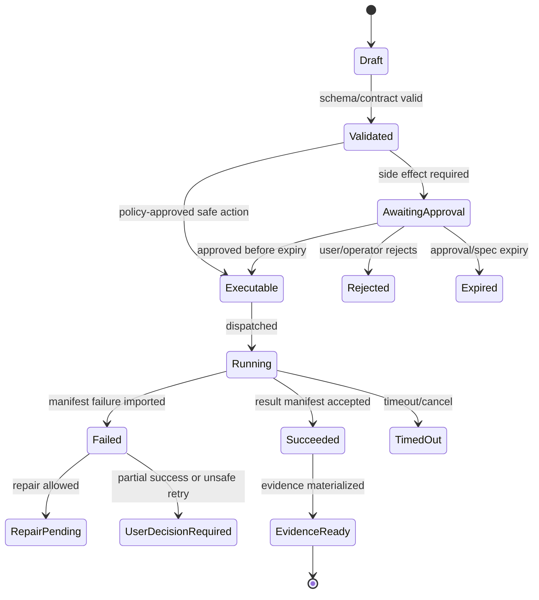

# Operator Console and Operations

## V6.17 operations split

The web operator console may inspect and control `web_managed` cloud resources according to role and evidence policy. Desktop fleet operations are limited to entitlements, supported-version/update rings, package revocation, policy/profile distribution, privacy-safe health telemetry, consented diagnostics, and optional sync/remote-job records.

There is no operator API to browse a local folder, mint/approve a local spec, start a local command, apply a remote patch, roll back local files, or rewrite local evidence. Device-side incident actions are user-visible revoke/sign-out/disable-package/disable-sync/update/export flows executed by the signed host.

## 1. Mission

Give internal operators controlled visibility into health, budgets, policies, incidents, worker images, queues, trace summaries, and user/project access without exposing unnecessary raw sensitive payloads.

## 2. Responsibilities

- Manage project assignment and roles.
- View queue/job health and failed executions.
- Manage policy versions and worker image allowlists.
- View model budgets/costs and quota pressure.
- Handle incidents and stuck locks/checkouts.
- Expose operational trace summaries and privileged forensic links only to authorized roles.

## 3. Explicit Non-Responsibilities

- Do not bypass Airlock.
- Do not mutate authoritative state outside the Runtime API state transition path.
- Do not hide policy decisions inside UI-only code.
- Do not let model text become executable behavior without typed validation.
- Do not introduce a separate runtime semantics path unless an ADR approves it.

## 4. Interfaces and Ports

| Interface | Purpose |
|---|---|
| IOperatorApi | Admin endpoints with separate scopes. |
| IPolicyAdmin | Policy version management. |
| IWorkerImageRegistry | Allowed images and digests. |
| IBudgetAdmin | Model/project/user budgets. |
| IIncidentStore | Incident records and resolution. |
| IAuditQuery | Operator audit trail. |

## 5. State and Lifecycle

Operator actions must be explicit state transitions with audit events: `policy_draft`, `policy_active`, `policy_retired`; `image_allowed`, `image_blocked`; `budget_changed`; `lock_force_released`; `incident_opened/resolved`.

## 6. Data Contracts

Operator views:

- queue health;
- current active jobs;
- failed jobs by class;
- stale locks/checkouts;
- budget consumption;
- model schema failure rate;
- Airlock blocks by rule;
- worker image versions;
- trace/evidence lookup by run ID;
- incident timeline.

## 7. Primary Flow

```text
Operator opens admin route
→ separate scope check
→ operational summaries loaded
→ sensitive payload hidden by default
→ admin action requires confirmation
→ audit event written
```

## 8. Implementation Steps

- Implement route partition `/operator` with guards.
- Implement API scopes separate from project chat.
- Implement queue/job dashboard.
- Implement policy/image/budget read views first.
- Implement controlled admin mutations later.
- Implement incident records.
- Add audit export.

## 9. Failure Modes and Mitigations

| Failure | Mitigation |
|---|---|
| Same React app leaks admin surface | Use route guards, lazy bundles if needed, API scopes, and tests. |
| Raw traces overexposed | Show summaries/hashes by default; forensic role required for raw refs. |
| Operator mutates policy silently | Policy changes require versioned draft/activate flow. |
| Budget override abuse | Audit and require Operator role. |
| Stuck lock manual release corrupts state | Force release requires reason and state validation. |

## 10. Acceptance Criteria

- Normal user cannot load operator data.
- Operator can see failed jobs without raw secrets.
- Policy changes are versioned and audited.
- Worker image allowlist uses digest, not tag only.
- Stuck checkout/lock cleanup is visible and logged.

---

## v2 Review Improvements

### 1. Operator Surface Scope

Operator Console manages runtime safety and operations. It is not a second product UI for normal project work.

### 2. Operator Areas

| Area | Capabilities |
|---|---|
| Users/roles | project assignment, role view, group mapping. |
| Policy | Airlock versions, command allowlists, blocked paths, network modes. |
| Budgets | model quotas, execution quotas, project caps. |
| Worker images | allowed image digests, SBOM/provenance status. |
| Incidents | failed jobs, policy denials, secret redaction hits. |
| Trace access | privileged trace request/approval/audit. |
| Retention | log/artifact/evidence retention policies. |
| Health | API/job/model/storage status. |

### 3. Operator Route Isolation

Even if the web app is one deployment, operator routes must have:

- separate navigation entry;
- role guard;
- admin API scope;
- separate audit event for each write;
- no raw trace expansion by default;
- explicit warning for policy changes.

### 4. Policy Change Workflow

```text
Draft policy change
→ validate policy schema
→ run policy regression fixtures
→ reviewer/security approval
→ publish new policy version/hash
→ old approvals become invalid if policy changed materially
→ audit event and rollback option
```

### 5. Operational Dashboards

| Dashboard | Metrics |
|---|---|
| Run health | success/failure rate, median duration, stuck states. |
| Execution health | ACA job latency, timeout rate, cold start, worker errors. |
| Model health | calls, schema failure rate, cost, latency, retry count. |
| Policy health | denials by reason, high-risk approvals, grant usage. |
| Storage health | Blob volume, retention cleanup, evidence bundle count. |
| Security health | secret redactions, prompt-injection fixture alerts, privileged trace access. |

### 6. Operator Acceptance Tests

- Policy change without regression pass cannot publish.
- Worker image without allowed digest cannot execute.
- Operator write produces audit event.
- Non-operator cannot infer raw trace URI.
- Budget cap prevents new expensive model call before provider request.


---


---

## Implementation-depth contract

This file is part of the V6 implementation library. It is written as an implementation guide, not as a strategy memo. Every component must be built against the same system-wide constraints:

1. **The first executable slice comes before breadth.** The first demonstrable product must prove authenticated chat, workspace context, typed plan output, proposal creation, Airlock validation, approval, isolated execution, validation, checkpoint, and evidence.
2. **The delivery-specific authority owns lifecycle state.** The web Runtime API imports remote-worker facts into SQL; the signed desktop Rust host imports local-executor facts into SQLite. Workers, child processes, renderers, models, sync services, and support APIs do not advance authoritative lifecycle state.
3. **Airlock creates the only side-effect token.** Workspace writes, command runs, exports, package imports, dependency restores, and policy-sensitive actions require an `ApprovedExecutionSpec` issued by Airlock.
4. **The model does not own proposals.** Model Gateway returns typed model outputs. Run Orchestrator creates normalized `Proposal` records. Airlock validates proposals.
5. **No raw shell by default.** Commands are represented as `argv[]` plus policy metadata; `sh -c`, shell expansion, broad environment access, and open network access are blocked unless explicitly operator-approved.
6. **Every side effect is reconstructable.** Diffs, preimages, spec hashes, policy hashes, approvals, job image digests, result manifests, logs, artifacts, and rollback metadata must be traceable.
7. **Each module has ports.** Even inside a modular monolith, use explicit interfaces and contracts to avoid creating a god control plane.


## 1. Component identity

| Field | Value |
|---|---|
| Component | `Operator Console and Operations` |
| Area | `Administration` |
| Primary implementation package | `apps/web operator routes + src/Operator` |
| Runtime/technology | `React + ASP.NET Core APIs` |
| First-slice priority | `after-core or supporting` |


## 2. Purpose

Give admins controlled views for users, roles, projects, policy, budgets, incidents, worker images, model profiles, retention, and operational health.

The implementation must be narrow enough to fit the corrected first vertical slice, but designed so BMAD package execution, the existing presentation adapter, Builder Studio, SkillOps, replay, and operator controls can plug into the same contracts later.


## 3. Owns / does not own

### Owns
- Admin route isolation
- Policy management UX
- Budget/quota dashboards
- Incident triage
- Worker image inventory
- Model profile management
- Retention controls
- Audit query UX

### Does not own
- Raw prompt browsing by default
- Project code editing
- Bypassing normal approval paths


## 4. Public/API surface and internal ports

### Required API/routes or callable operations
- `GET /api/operator/overview`
- `GET /api/operator/projects`
- `POST /api/operator/policies`
- `GET /api/operator/budgets`
- `GET /api/operator/incidents`
- `POST /api/operator/worker-images`
- `POST /api/operator/retention/sweep`


### Internal contract rules

- Every boundary uses typed, schema-versioned values. C# uses `Runtime.Contracts` / `Runtime.Domain`, Rust uses generated contract types plus `desktop-domain`, and TypeScript uses generated web or desktop facade types; no generated DTO grants runtime authority.
- External payloads must be schema-versioned. Internal objects may evolve faster but must not leak into OpenAPI without a contract version.
- Every state mutation must be idempotent or protected by optimistic concurrency.
- Every side-effect operation must receive an `ApprovedExecutionSpec` or be provably read-only.
- Every error response must use the standard error envelope with `code`, `message`, `correlationId`, `retryable`, and optional `detailsRef`.


### Starter interface/type sketch

```csharp
public interface IComponentPort<TRequest, TResult>
{
    Task<TResult> ExecuteAsync(TRequest request, CancellationToken ct);
}

public sealed record OperationContext(
    Guid ProjectId,
    Guid RunId,
    string ActorUserId,
    string CorrelationId,
    string PolicyVersion,
    DateTimeOffset RequestedAt);
```


## 5. State model

### Component states
- `healthy`
- `degraded`
- `budget_warning`
- `budget_exceeded`
- `policy_draft`
- `policy_active`
- `incident_open`
- `incident_mitigated`
- `retention_sweep_pending`


### Generic side-effect lifecycle





## 6. Persistence responsibilities

### SQL tables or domain records touched
- `OperatorAuditEvent`
- `PolicyVersion`
- `BudgetAccount`
- `ModelProfile`
- `ExecutorImage`
- `Incident`
- `RetentionSweep`
- `AdminAction`

### Blob/object storage paths touched
- `operator/reports/{date}.json`
- `operator/incidents/{incidentId}/*`
- `operator/policy-diffs/{policyVersion}.md`


### Persistence rules

- In `web_managed`, SQL stores lifecycle state, compact indexes, ownership metadata, and references. In `windows_local`, SQLite stores the corresponding local authority records.
- In `web_managed`, Blob stores large immutable payloads: snapshots, logs, diffs, manifests, artifacts, exports, packages, traces, and validation reports. In `windows_local`, encrypted local content-addressed storage holds authority-owned payloads; cloud upload is explicit and purpose-scoped.
- Any Blob payload referenced from SQL must include content hash, schema version, created timestamp, and retention class.
- No raw secrets, broad credentials, or unredacted prompt/context payloads are stored by default.
- Migrations must be forward-safe and testable against fixture data.


## 7. Detailed implementation steps


### Phase 0 — Contract and spike

1. Create or update the relevant ADR before implementation when the decision affects hosting, policy, security, data ownership, or external dependencies.

2. Define public DTOs and durable JSON schemas first. Do not let implementation classes silently become external contracts.

3. Create a minimal fixture that exercises the component without requiring the whole platform.

4. Add negative tests for the most dangerous bypass or failure case before adding the happy path.

5. Record assumptions in the component file and in the ADR index if they are not final.

6. For `Operator Console and Operations`, implement only the smallest behavior that proves its contract in the first executable slice, then add extended BMAD/Builder/artifact behavior after gate approval.


### Phase 1 — Skeleton implementation

1. Create the package/module/folder with explicit ports/interfaces and dependency direction rules.

2. Add dependency injection registration with narrow interfaces rather than passing broad services everywhere.

3. Implement persistence only through repository/store abstractions that expose business operations, not raw table access.

4. Emit structured events for every important state transition even if the UI does not yet render them.

5. Add unit tests for object creation, invalid input, authorization/policy denial, and idempotency where relevant.

6. For `Operator Console and Operations`, implement only the smallest behavior that proves its contract in the first executable slice, then add extended BMAD/Builder/artifact behavior after gate approval.


### Phase 2 — First vertical integration

1. Connect the component to the first executable slice only. Avoid adding full future scope before the vertical path works.

2. Use fake/stub adapters for expensive external systems until the contract is proven.

3. Make all side effects flow through Proposal → AirlockDecision → Approval/Grant → ApprovedExecutionSpec → Dispatch.

4. Persist large payloads to Blob and store only compact references in SQL.

5. Return UI-consumable run events so the Chat Workbench can render progress without polling raw tables.

6. For `Operator Console and Operations`, implement only the smallest behavior that proves its contract in the first executable slice, then add extended BMAD/Builder/artifact behavior after gate approval.


### Phase 3 — Production hardening

1. Add telemetry attributes, correlation IDs, redaction, and audit events.

2. Add retry, timeout, cancellation, and stale-state handling.

3. Add migration scripts and seed data for dev/test.

4. Add operator visibility for status, errors, budget/policy impact, and cleanup status.

5. Document runbooks for the top failure modes.

6. For `Operator Console and Operations`, implement only the smallest behavior that proves its contract in the first executable slice, then add extended BMAD/Builder/artifact behavior after gate approval.


### Phase 4 — Regression and release gate

1. Add contract tests against OpenAPI/JSON Schema.

2. Add replay fixtures or golden outputs where deterministic behavior is expected.

3. Add security tests for prompt injection, secret leakage, excessive agency, insecure output handling, and supply-chain drift where relevant.

4. Update release gate evidence with screenshots/log excerpts/manifests rather than informal claims.

5. Mark open risks and deferred v1.5/v2 items explicitly.

6. For `Operator Console and Operations`, implement only the smallest behavior that proves its contract in the first executable slice, then add extended BMAD/Builder/artifact behavior after gate approval.


## 8. Validation and test plan

### Required tests
- non-admin cannot load operator bundle route
- policy change audited
- budget exceeded blocks model calls
- incident timeline reconstructs actions
- raw trace disabled by default


### Minimum test layers

| Layer | What to test | Required before merge |
|---|---|---|
| Unit | object validation, state transitions, parsing, policy predicates | yes |
| Contract | OpenAPI/JSON Schema compatibility, generated clients, worker manifests | yes for public/durable payloads |
| Integration | SQL + Blob references, dispatch/import, authz, Airlock boundary | yes for side-effect paths |
| E2E | chat → proposal → approval → execution → evidence | yes for first slice files |
| Replay/golden | BMAD package fixtures, presentation adapter, evidence bundle | yes before v1 beta |
| Security negative | prompt injection, secret leak, policy bypass, path traversal, raw shell | yes for all side-effect components |


## 9. Failure modes and recovery

| Failure | Detection | Required behavior | User/operator visibility |
|---|---|---|---|
| Invalid schema | contract validation | reject before persistence or dispatch | show actionable error with correlation ID |
| Stale proposal/preimage | hash mismatch | void proposal or require rebase/new proposal | show stale context warning |
| Approval expired | expiry check | reject dispatch | show re-approve option |
| Policy mismatch | policy hash mismatch | reject spec | operator audit event |
| Worker timeout | job monitor | mark job timed out; preserve partial logs | timeline event + retry option if safe |
| Manifest missing/invalid | manifest import validation | do not advance success state | incident/failure card |
| Partial success | checkpoint/validation state | enter `user_decision_required` or `kept_for_repair` | explicit decision card |
| Secret detected | scanner/redactor | redact and block if high confidence | security finding card/operator event |


## 10. Security and policy requirements

- Treat workspace files, package files, generated artifacts, model outputs, and logs as untrusted input.
- Never let untrusted content override system instructions, Airlock policy, command allowlists, network policy, or secret handling.
- Enforce project-level authorization on every read and write.
- Log security-relevant denials as audit events, but do not include raw secret values.
- Prefer fail-closed behavior when policy, identity, schema, or storage checks are ambiguous.
- Add negative tests for the most likely bypass path before writing happy-path code.


## 11. Observability

Minimum telemetry fields for this component:

- `correlation.id`
- `project.id`
- `run.id` when available
- `component.name`
- `operation.name`
- `operation.outcome`
- `policy.version` when applicable
- `spec.id` when applicable
- `job.id` when applicable
- `artifact.id` when applicable
- redaction counters, not raw secrets

Metrics to consider: request latency, state-transition count, policy denials, approval wait time, job duration, manifest import failures, schema validation failures, retry count, budget blocks, and evidence materialization time.


## 12. Acceptance criteria

- [ ] The component has a clear owner package and does not leak responsibilities into unrelated modules.
- [ ] Public routes/payloads are represented in OpenAPI/JSON Schema where applicable.
- [ ] Side-effect paths cannot execute without Airlock evaluation and `ApprovedExecutionSpec`.
- [ ] SQL lifecycle state is mutated only by the Runtime API/Application layer.
- [ ] Blob payloads have content hashes and schema versions.
- [ ] Tests include at least one negative/bypass case.
- [ ] Events and evidence are emitted for user-visible actions.
- [ ] The component is represented in the release gate matrix.
- [ ] The implementation does not introduce Cortex as a runtime namespace.
- [ ] Documentation includes deferred v1.5/v2 scope explicitly rather than silently omitting it.


## 13. Integration checklist

- [ ] Update `32 - Integration Contract Map.md` with any new caller/callee relationship.
- [ ] Update `25 - OpenAPI, Schemas, and Generated Clients.md` for public route or schema changes.
- [ ] Update `22 - Data Model - SQL and Blob.md`, `47 - Database DDL Starter.md`, or `48 - Blob Storage Layout.md` for persistence changes.
- [ ] Update `27 - Testing, Validation, and Replay.md` for new fixtures or replay needs.
- [ ] Update `33 - Release Gates and Acceptance Matrix.md` if the change affects release readiness.
- [ ] Add or update ADR in `31 - Architecture Decision Records.md` if the change alters architecture, hosting, policy, or security posture.


---

## Historical Revision Notes (V3 -> V4 Hardening Pass)
### V4 audit finding applied to this file
The v3 library was detailed, but several files still behaved like expanded planning notes rather than implementation handbooks. This pass adds enforceable implementation details: exact build sequence, explicit boundaries, input/output contracts, database/blob ownership, event names, failure states, tests, and release gates.

## System invariants this component must obey

1. The first delivered slice remains: **authenticated chat → workspace context → implementation plan → proposal → Airlock → approval → isolated job → validation → checkpoint → evidence**.
2. No worker image receives Azure SQL write credentials. Workers produce signed/hashed append-only manifests in Blob; the Runtime API imports them and advances SQL lifecycle state.
3. No file write, command run, dependency restore, package import, artifact export, checkpoint mutation, or rollback can execute without an `ApprovedExecutionSpec` minted by Airlock.
4. The Model Gateway returns typed model outputs only. The Run Orchestrator creates platform `Proposal` records. Airlock validates proposals and creates approved specs.
5. Commands are `argv[]` specs, not raw shell strings. Shell execution is a separate high-risk command class.
6. Every state transition emits a run event and trace event with correlation ID, actor/service principal, schema version, and payload hash or payload reference.
7. Every persisted object carries schema version, retention class, project scope, created/updated timestamps, and hash/provenance where relevant.
8. Any component that reads workspace content treats it as untrusted user-controlled input and cannot allow it to override system policy, command allowlists, approval requirements, or secrets handling.


## Component build card

| Field | Value |
|---|---|
| Component | `Operator Console and Ops` |
| Primary package/path | `apps/web/operator + src/Operator` |
| Current implementation status | `v6-validated` |
| Required for first vertical slice | `after-first-slice or v1 extension` |

## Validated API/port touchpoints

- `GET /api/operator/health`
- `GET /api/operator/runs`
- `GET /api/operator/policy-decisions`
- `POST /api/operator/model-profiles`
- `POST /api/operator/worker-images`

## Validated domain events to implement or consume

- `operator.view.opened`
- `operator.policy.updated`
- `operator.model_profile.updated`
- `operator.worker_image.approved`
- `incident.created`

## Validated SQL ownership / indexes

- `operator_audit_events`
- `model_profiles`
- `worker_images`
- `policy_versions`
- `incidents`
- `budget_windows`

Implementation notes:

- Tables listed here are owned by their module or exposed through its port; other modules must not perform direct ad-hoc writes.
- Mutable lifecycle tables need optimistic concurrency tokens.
- All records need `project_id`, `schema_version`, `created_at`, `updated_at`, and retention classification where applicable.

## Validated Blob payload layout

- `operator/reports/*`
- `operator/audit-export/*`
- `incidents/{incidentId}/*`

Implementation notes:

- Blob payloads are content-addressed or hash-checked before import.
- SQL stores compact payload references, not bulky logs/prompts/artifacts.
- Retention class and redaction level must be explicit for every payload family.

## Validated step-by-step build procedure

1. Keep operator routes in same app only if route guards, API scopes, and audit isolation are strict.
2. Default operator views show summaries/hashes, not raw traces.
3. Add controls for policy versions, worker images, model profiles, budgets, retention, and incident review.
4. Implement run kill/cancel with audit and state-transition checks.
5. Expose queue/job health without giving direct worker shell access.
6. Add break-glass procedures but require explicit audit and time-bound privilege.

## Validated edge cases that must be tested

| Edge case | Expected behavior |
|---|---|
| Duplicate API request with same idempotency key | Returns original result; no duplicate state transition or worker dispatch. |
| Stale proposal after newer checkpoint | Proposal is voided or requires rebase; approval is blocked. |
| Expired approval/spec | Side-effect endpoint rejects request; UI asks for refresh. |
| Unknown schema version | Import/read path rejects or routes to migration handler. |
| Blob payload hash mismatch | Runtime refuses import and creates security/audit finding. |
| User lacks project role | API returns access denied; no object existence leakage. |
| Workspace contains prompt injection in docs/code | Treated as untrusted content; cannot change system policy or tool permissions. |
| Worker crashes after writing partial logs | Execution becomes failed/unknown with partial log refs; retry uses same spec rules. |

## Validated release gate for this component

- Unit tests cover all domain transitions owned by this component.
- Contract tests cover all listed API touchpoints or port methods.
- Integration tests prove SQL/Blob responsibility boundaries.
- Security tests cover unauthorized access and malformed payloads.
- Replay fixture includes at least one success path and one failure path relevant to this component.
- Observability emits trace/span/log attributes with the shared correlation ID.
- Documentation examples compile or validate against JSON Schema/OpenAPI where relevant.

## Hermes Deep-Review Operator Console Additions

Source: [[87 - Hermes Deep Review - Extension Runtime and Operational Contracts]].

Operator views should expose these operational states without raw secret or prompt leakage:

| View/state | What to show |
|---|---|
| Provider routing | Current `RuntimeProviderResolution`, fallback state, cache-break reason, credential source class, and cost-impact warning. |
| Connector health | Active `ConnectorCredentialLock`, delivery target resolution, slow-response request state, and adapter authorization mode. |
| Gateway drain | `GatewayDrainRequest` status, principal, reason, instantiation epoch, stale-marker status, and notification policy. |
| Secret resolution | Redacted `SecretSourceApplyReport` with conflicts, skipped protected vars, source timeouts, and profile scope health. |
| Task claims | `TaskClaim` owner, TTL, heartbeat age, stale/reclaim status, block kind, and unblock recurrence count. |
| Dashboard auth | Active session provider, token-principal requests, WebSocket ticket mint/consume failures, and redacted auth audit trail. |
| Context compression | Recent `ContextCompressionRecord` summaries with source token counts, protected ranges, and fail-closed events. |

## Odysseus-Informed Operator Views

Source: [[88 - Odysseus Source Code Review - Self-Hosted AI Workspace]].

Add operational views for:

| View | What operators need |
|---|---|
| Fresh install health | Auth state, first admin setup, storage paths, worker image availability, provider probes, and missing optional services. |
| Degraded dependencies | Search, vector memory, email, notifications, model providers, and local serve jobs with last error summary. |
| Outbound egress denials | Blocked URL, policy reason, resolved IP class, redirect hop, and requesting principal, with sensitive values redacted. |
| Upload and document safety | Quarantine count, MIME mismatches, owner mismatches, cleanup backlog, and retention pressure. |
| Background jobs | Running, paused, canceled, timed out, failed, and completed jobs with owner and approved spec. |
| Local model cookbook | Hardware fit, download/preflight/serve command summaries, copyable redacted logs, and next-step diagnosis. |

## Consolidated Source-Review Operator Dashboard

Source: [[89 - Consolidated AI Workspace Source Review and Architecture Improvements]].

The first operator dashboard should include these slices before marketplace-style breadth:

| Slice | Minimum signal |
|---|---|
| Runtime health | API version, schema version, event outbox lag, SQL/Blob connectivity, and active degraded modes. |
| Effective tools | Current tool availability snapshots, disabled reasons, package activation state, and policy denials. |
| Model gateway | Provider resolution, fallback events, credential-binding denials, prompt-cache transitions, and quota/budget state. |
| Execution lanes | ACA Job executions, fake/dev worker state, Dynamic Sessions spike status, worker image digest, and manifest import failures. |
| Security posture | Owner-scope denials, egress denials, prompt-injection findings, package scan findings, and secret redaction counters. |
| Release evidence | Latest vertical-slice replay, generated-client compile, TypeScript 7 gate, worker image gate, and fresh-install smoke status. |
