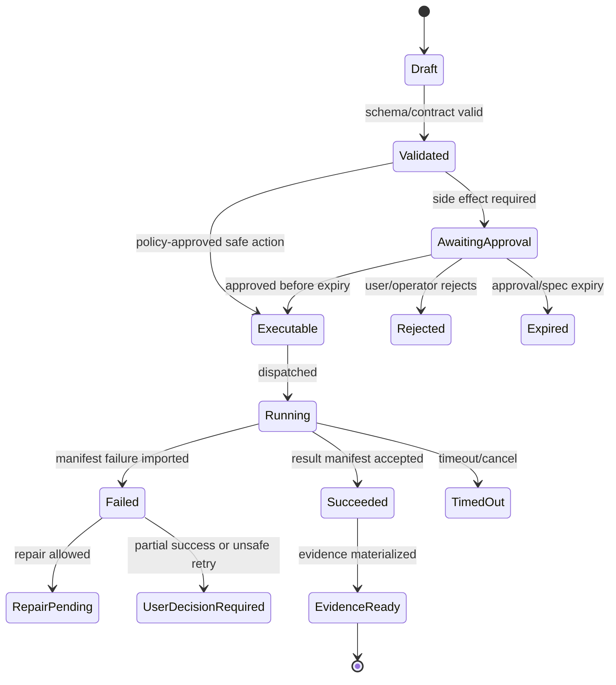

# OpenAPI, Schemas, and Generated Clients

## V6.17 contract surfaces

OpenAPI describes Azure HTTP APIs for the web control plane and desktop support plane. Canonical JSON Schema describes shared durable objects and discriminated delivery-model unions. Tauri IPC has a separate narrow command/event schema generated for Rust and TypeScript; it is not exposed as HTTP and must not include generic path, shell, SQL, or Blob primitives.

All project/run/workspace/candidate/spec/result/evidence contracts require `deliveryModel` and `authorityRef`. Code generation may share DTO shapes, but domain validation, storage transactions, and executor authority remain handwritten in C# or Rust. Cross-runtime golden vectors and compatibility gates are specified in [[99 - Dual-Delivery Contract and Conformance Specification]].

## 1. Mission

Make contracts explicit before implementation hardens: Runtime API, Package API, Operator API, JSON Schemas for model outputs, proposals, execution specs, manifests, trace bundles, and artifacts.

## 2. Responsibilities

- Define OpenAPI descriptions for all public API surfaces.
- Generate TypeScript clients for web.
- Generate or validate .NET DTOs from schema.
- Version every externally stored payload.
- Add compatibility rules and contract tests.
- Keep model-output schemas separate from platform Proposal schemas.

## 3. Explicit Non-Responsibilities

- Do not bypass Airlock.
- Do not mutate authoritative state outside the Runtime API state transition path.
- Do not hide policy decisions inside UI-only code.
- Do not let model text become executable behavior without typed validation.
- Do not introduce a separate runtime semantics path unless an ADR approves it.

## 4. Interfaces and Ports

| Interface | Purpose |
|---|---|
| IApiContractRegistry | Tracks versions and compatibility. |
| ISchemaValidator | Runtime JSON schema validation. |
| IClientGenerator | Generates TS/.NET clients. |
| ICompatibilityTester | Old fixture compatibility tests. |
| ISchemaMigration | Migrate or read old payloads. |

## 5. State and Lifecycle

Contract lifecycle: `draft`, `reviewed`, `implemented`, `contract_tested`, `compatible`, `deprecated`, `removed_after_adr`.

## 6. Data Contracts

Required schema families:

- `model.*_output.v1`;
- `proposal.patch.v1`, `proposal.command.v1`, `proposal.artifact_export.v1`;
- `airlock.decision.v1`;
- `execution.approved_spec.v1`;
- `worker.result_manifest.v1`;
- `workspace.snapshot_manifest.v1`;
- `trace.event.v1`;
- `evidence.bundle.v1`;
- `bmad.package_import_result.v1`;
- `artifact.presentation_trace.v1`.

OpenClaw's gateway and plugin schemas add these contract families to the Sapphirus backlog:

- `package.install_policy.v1`;
- `package.extension_manifest.v1`;
- `package.ui_descriptor.v1`;
- `skill_package_proposal.v1`;
- `approval.request.v1` and `approval.decision.v1`;
- `execution.binding.v1`;
- `scenario_manifest.v1`;
- `maturity_surface.v1`;
- `config_migration_plan.v1`;
- `safe_archive_extraction_report.v1`.

These schemas must be durable JSON contracts, not transient UI view models.

## 7. Primary Flow

```text
Schema update
→ compatibility review
→ generated clients
→ contract tests
→ fixture migration/read test
→ implementation PR
```

## 8. Implementation Steps

- Create `docs/api/openapi.yaml`.
- Create `schemas/` folder with JSON Schemas.
- Add client generation to CI.
- Add schema validation library.
- Add compatibility fixtures.
- Document breaking-change policy.
- Add linter rules for API descriptions.

## 9. Failure Modes and Mitigations

| Failure | Mitigation |
|---|---|
| Frontend/backend drift | Generated client only; no hand-written endpoint types. |
| Schema version missing | Reject persisted payloads without schema_version. |
| Model schema confused with proposal schema | Separate namespaces and conversion step. |
| Breaking changes silent | Contract tests against fixtures. |
| OpenAPI too vague for agents | Add operation IDs, examples, errors, and semantic descriptions. |

## 10. Acceptance Criteria

- OpenAPI exists before endpoint implementation.
- Web uses generated client.
- Payloads include schema_version.
- Old fixture can still be read or migrated.
- Model output and Proposal schemas are distinct.

---

## v2 Review Improvements

### 1. Contract-First Rule

Public API behavior must be described before implementation stabilizes. The OpenAPI file is the source for generated clients and integration tests.

### 2. API Groups

| Group | Example Paths |
|---|---|
| Projects | `/v1/projects`, `/v1/projects/{id}` |
| Threads | `/v1/threads`, `/v1/threads/{id}/messages` |
| Runs | `/v1/runs/{id}`, `/v1/runs/{id}/events` |
| Workspace | `/v1/projects/{id}/snapshots`, `/v1/checkpoints/{id}` |
| Proposals | `/v1/proposals/{id}` |
| Airlock | `/v1/proposals/{id}/airlock/evaluate` |
| Approvals | `/v1/approvals`, `/v1/approval-grants` |
| Execution | `/v1/executions`, `/v1/jobs/{id}/import-manifest` |
| Artifacts | `/v1/artifacts/{id}` |
| BMAD | `/v1/bmad/packages`, `/v1/bmad/help` |
| Operator | `/v1/operator/policies`, `/v1/operator/budgets` |

### 3. Schema Versioning

Every durable JSON payload includes:

```json
{
  "schema_id": "proposal.patch.v1",
  "schema_version": 1
}
```

Breaking changes require new schema ID or version. Existing evidence bundles must remain readable.

### 4. Compatibility Policy

| Change | Allowed In Same Version? |
|---|---|
| Add optional response field | yes |
| Add required request field | no |
| Rename field | no |
| Change enum meaning | no |
| Add enum value | only if clients tolerate unknown values |
| Remove endpoint | no; deprecate first |

### 5. Generated Client Gates

- TypeScript client compiles in web project.
- C# client/DTO compile in API/integration tests.
- Contract tests compare real API responses against schema.
- Mock server can drive frontend tests from OpenAPI examples.
- Error response schema is consistent across modules.

### 6. Example Error Response

```json
{
  "error": {
    "code": "POLICY_DENIED",
    "message": "The proposed command is not allowed under the current policy.",
    "correlation_id": "trace_...",
    "details": {
      "policy_version": "airlock-policy.v1",
      "reason": "shell_execution_denied"
    }
  }
}
```


---


---

## Implementation-depth contract

This file is part of the V6 implementation library. It is written as an implementation guide, not as a strategy memo. Every component must be built against the same system-wide constraints:

1. **The first executable slice comes before breadth.** The first demonstrable product must prove authenticated chat, workspace context, typed plan output, proposal creation, Airlock validation, approval, isolated execution, validation, checkpoint, and evidence.
2. **The delivery-specific authority owns lifecycle state.** The web Runtime API imports remote-worker facts into SQL; the signed desktop Rust host imports local-executor facts into SQLite. Workers, child processes, renderers, models, sync services, and support APIs do not advance authoritative lifecycle state.
3. **Airlock creates the only side-effect token.** Workspace writes, command runs, exports, package imports, dependency restores, and policy-sensitive actions require an `ApprovedExecutionSpec` issued by Airlock.
4. **The model does not own proposals.** Model Gateway returns typed model outputs. Run Orchestrator creates normalized `Proposal` records. Airlock validates proposals.
5. **No raw shell by default.** Commands are represented as `argv[]` plus policy metadata; `sh -c`, shell expansion, broad environment access, and open network access are blocked unless explicitly operator-approved.
6. **Every side effect is reconstructable.** Diffs, preimages, spec hashes, policy hashes, approvals, job image digests, result manifests, logs, artifacts, and rollback metadata must be traceable.
7. **Each module has ports.** Even inside a modular monolith, use explicit interfaces and contracts to avoid creating a god control plane.


## 1. Component identity

| Field | Value |
|---|---|
| Component | `OpenAPI, Schemas, and Generated Clients` |
| Area | `Contracts` |
| Primary implementation package | `schemas + src/Runtime.Contracts + apps/web generated clients` |
| Runtime/technology | `OpenAPI 3.1.2 canonical contract + JSON Schema + generators; OpenAPI 3.2 remains a .NET 11/tooling watch item` |
| First-slice priority | `core` |


## 2. Purpose

Make the API and durable payload formats contract-first, versioned, diffable, and testable across web, runtime, workers, replay, and future CLI.

The implementation must be narrow enough to fit the corrected first vertical slice, but designed so BMAD package execution, the existing presentation adapter, Builder Studio, SkillOps, replay, and operator controls can plug into the same contracts later.


## 3. Owns / does not own

### Owns
- OpenAPI document
- JSON schemas
- Contract versioning
- Generated TypeScript client
- Generated C# DTOs
- Schema compatibility tests
- Error envelope standard

### Does not own
- Handwritten divergent DTOs
- Undocumented route payloads
- Schema-breaking silent changes


## 4. Public/API surface and internal ports

### Required API/routes or callable operations
- `GET /api/openapi.json`
- `GET /api/schemas/{name}/{version}`
- `POST /api/contracts/validate`
- `GET /api/contracts/compatibility`


### Internal contract rules

- Every boundary uses typed, schema-versioned values. C# uses `Runtime.Contracts` / `Runtime.Domain`, Rust uses generated contract types plus `desktop-domain`, and TypeScript uses generated web or desktop facade types; no generated DTO grants runtime authority.
- External payloads must be schema-versioned. Internal objects may evolve faster but must not leak into OpenAPI without a contract version.
- Every state mutation must be idempotent or protected by optimistic concurrency.
- Every side-effect operation must receive an `ApprovedExecutionSpec` or be provably read-only.
- Every error response must use the standard error envelope with `code`, `message`, `correlationId`, `retryable`, and optional `detailsRef`.


### Starter interface/type sketch

```csharp
public interface IComponentPort<TRequest, TResult>
{
    Task<TResult> ExecuteAsync(TRequest request, CancellationToken ct);
}

public sealed record OperationContext(
    Guid ProjectId,
    Guid RunId,
    string ActorUserId,
    string CorrelationId,
    string PolicyVersion,
    DateTimeOffset RequestedAt);
```


## 5. State model

### Component states
- `schema_draft`
- `schema_locked`
- `client_generated`
- `compatibility_checked`
- `breaking_change_detected`
- `deprecated`
- `removed`


### Generic side-effect lifecycle





## 6. Persistence responsibilities

### SQL tables or domain records touched
- `ContractVersion`
- `SchemaVersion`
- `ApiClientBuild`
- `CompatibilityResult`
- `DeprecationNotice`

### Blob/object storage paths touched
- `schemas/openapi.json`
- `schemas/json/*.schema.json`
- `clients/typescript/*`
- `clients/dotnet/*`


### Persistence rules

- In `web_managed`, SQL stores lifecycle state, compact indexes, ownership metadata, and references. In `windows_local`, SQLite stores the corresponding local authority records.
- In `web_managed`, Blob stores large immutable payloads: snapshots, logs, diffs, manifests, artifacts, exports, packages, traces, and validation reports. In `windows_local`, encrypted local content-addressed storage holds authority-owned payloads; cloud upload is explicit and purpose-scoped.
- Any Blob payload referenced from SQL must include content hash, schema version, created timestamp, and retention class.
- No raw secrets, broad credentials, or unredacted prompt/context payloads are stored by default.
- Migrations must be forward-safe and testable against fixture data.


## 7. Detailed implementation steps


### Phase 0 — Contract and spike

1. Create or update the relevant ADR before implementation when the decision affects hosting, policy, security, data ownership, or external dependencies.

2. Define public DTOs and durable JSON schemas first. Do not let implementation classes silently become external contracts.

3. Create a minimal fixture that exercises the component without requiring the whole platform.

4. Add negative tests for the most dangerous bypass or failure case before adding the happy path.

5. Record assumptions in the component file and in the ADR index if they are not final.

6. For `OpenAPI, Schemas, and Generated Clients`, implement only the smallest behavior that proves its contract in the first executable slice, then add extended BMAD/Builder/artifact behavior after gate approval.


### Phase 1 — Skeleton implementation

1. Create the package/module/folder with explicit ports/interfaces and dependency direction rules.

2. Add dependency injection registration with narrow interfaces rather than passing broad services everywhere.

3. Implement persistence only through repository/store abstractions that expose business operations, not raw table access.

4. Emit structured events for every important state transition even if the UI does not yet render them.

5. Add unit tests for object creation, invalid input, authorization/policy denial, and idempotency where relevant.

6. For `OpenAPI, Schemas, and Generated Clients`, implement only the smallest behavior that proves its contract in the first executable slice, then add extended BMAD/Builder/artifact behavior after gate approval.


### Phase 2 — First vertical integration

1. Connect the component to the first executable slice only. Avoid adding full future scope before the vertical path works.

2. Use fake/stub adapters for expensive external systems until the contract is proven.

3. Make all side effects flow through Proposal → AirlockDecision → Approval/Grant → ApprovedExecutionSpec → Dispatch.

4. Persist large payloads to Blob and store only compact references in SQL.

5. Return UI-consumable run events so the Chat Workbench can render progress without polling raw tables.

6. For `OpenAPI, Schemas, and Generated Clients`, implement only the smallest behavior that proves its contract in the first executable slice, then add extended BMAD/Builder/artifact behavior after gate approval.


### Phase 3 — Production hardening

1. Add telemetry attributes, correlation IDs, redaction, and audit events.

2. Add retry, timeout, cancellation, and stale-state handling.

3. Add migration scripts and seed data for dev/test.

4. Add operator visibility for status, errors, budget/policy impact, and cleanup status.

5. Document runbooks for the top failure modes.

6. For `OpenAPI, Schemas, and Generated Clients`, implement only the smallest behavior that proves its contract in the first executable slice, then add extended BMAD/Builder/artifact behavior after gate approval.


### Phase 4 — Regression and release gate

1. Add contract tests against OpenAPI/JSON Schema.

2. Add replay fixtures or golden outputs where deterministic behavior is expected.

3. Add security tests for prompt injection, secret leakage, excessive agency, insecure output handling, and supply-chain drift where relevant.

4. Update release gate evidence with screenshots/log excerpts/manifests rather than informal claims.

5. Mark open risks and deferred v1.5/v2 items explicitly.

6. For `OpenAPI, Schemas, and Generated Clients`, implement only the smallest behavior that proves its contract in the first executable slice, then add extended BMAD/Builder/artifact behavior after gate approval.


## 8. Validation and test plan

### Required tests
- OpenAPI validates
- generated client builds
- breaking change fails CI
- error envelope consistent
- worker manifests validate against schema


### Minimum test layers

| Layer | What to test | Required before merge |
|---|---|---|
| Unit | object validation, state transitions, parsing, policy predicates | yes |
| Contract | OpenAPI/JSON Schema compatibility, generated clients, worker manifests | yes for public/durable payloads |
| Integration | SQL + Blob references, dispatch/import, authz, Airlock boundary | yes for side-effect paths |
| E2E | chat → proposal → approval → execution → evidence | yes for first slice files |
| Replay/golden | BMAD package fixtures, presentation adapter, evidence bundle | yes before v1 beta |
| Security negative | prompt injection, secret leak, policy bypass, path traversal, raw shell | yes for all side-effect components |


## 9. Failure modes and recovery

| Failure | Detection | Required behavior | User/operator visibility |
|---|---|---|---|
| Invalid schema | contract validation | reject before persistence or dispatch | show actionable error with correlation ID |
| Stale proposal/preimage | hash mismatch | void proposal or require rebase/new proposal | show stale context warning |
| Approval expired | expiry check | reject dispatch | show re-approve option |
| Policy mismatch | policy hash mismatch | reject spec | operator audit event |
| Worker timeout | job monitor | mark job timed out; preserve partial logs | timeline event + retry option if safe |
| Manifest missing/invalid | manifest import validation | do not advance success state | incident/failure card |
| Partial success | checkpoint/validation state | enter `user_decision_required` or `kept_for_repair` | explicit decision card |
| Secret detected | scanner/redactor | redact and block if high confidence | security finding card/operator event |


## 10. Security and policy requirements

- Treat workspace files, package files, generated artifacts, model outputs, and logs as untrusted input.
- Never let untrusted content override system instructions, Airlock policy, command allowlists, network policy, or secret handling.
- Enforce project-level authorization on every read and write.
- Log security-relevant denials as audit events, but do not include raw secret values.
- Prefer fail-closed behavior when policy, identity, schema, or storage checks are ambiguous.
- Add negative tests for the most likely bypass path before writing happy-path code.


## 11. Observability

Minimum telemetry fields for this component:

- `correlation.id`
- `project.id`
- `run.id` when available
- `component.name`
- `operation.name`
- `operation.outcome`
- `policy.version` when applicable
- `spec.id` when applicable
- `job.id` when applicable
- `artifact.id` when applicable
- redaction counters, not raw secrets

Metrics to consider: request latency, state-transition count, policy denials, approval wait time, job duration, manifest import failures, schema validation failures, retry count, budget blocks, and evidence materialization time.


## 12. Acceptance criteria

- [ ] The component has a clear owner package and does not leak responsibilities into unrelated modules.
- [ ] Public routes/payloads are represented in OpenAPI/JSON Schema where applicable.
- [ ] Side-effect paths cannot execute without Airlock evaluation and `ApprovedExecutionSpec`.
- [ ] SQL lifecycle state is mutated only by the Runtime API/Application layer.
- [ ] Blob payloads have content hashes and schema versions.
- [ ] Tests include at least one negative/bypass case.
- [ ] Events and evidence are emitted for user-visible actions.
- [ ] The component is represented in the release gate matrix.
- [ ] The implementation does not introduce Cortex as a runtime namespace.
- [ ] Documentation includes deferred v1.5/v2 scope explicitly rather than silently omitting it.


## 13. Integration checklist

- [ ] Update `32 - Integration Contract Map.md` with any new caller/callee relationship.
- [ ] Update `25 - OpenAPI, Schemas, and Generated Clients.md` for public route or schema changes.
- [ ] Update `22 - Data Model - SQL and Blob.md`, `47 - Database DDL Starter.md`, or `48 - Blob Storage Layout.md` for persistence changes.
- [ ] Update `27 - Testing, Validation, and Replay.md` for new fixtures or replay needs.
- [ ] Update `33 - Release Gates and Acceptance Matrix.md` if the change affects release readiness.
- [ ] Add or update ADR in `31 - Architecture Decision Records.md` if the change alters architecture, hosting, policy, or security posture.


---

## Historical Revision Notes (V3 -> V4 Hardening Pass)
### V4 audit finding applied to this file
The v3 library was detailed, but several files still behaved like expanded planning notes rather than implementation handbooks. This pass adds enforceable implementation details: exact build sequence, explicit boundaries, input/output contracts, database/blob ownership, event names, failure states, tests, and release gates.

## System invariants this component must obey

1. The first delivered slice remains: **authenticated chat → workspace context → implementation plan → proposal → Airlock → approval → isolated job → validation → checkpoint → evidence**.
2. No worker image receives Azure SQL write credentials. Workers produce signed/hashed append-only manifests in Blob; the Runtime API imports them and advances SQL lifecycle state.
3. No file write, command run, dependency restore, package import, artifact export, checkpoint mutation, or rollback can execute without an `ApprovedExecutionSpec` minted by Airlock.
4. The Model Gateway returns typed model outputs only. The Run Orchestrator creates platform `Proposal` records. Airlock validates proposals and creates approved specs.
5. Commands are `argv[]` specs, not raw shell strings. Shell execution is a separate high-risk command class.
6. Every state transition emits a run event and trace event with correlation ID, actor/service principal, schema version, and payload hash or payload reference.
7. Every persisted object carries schema version, retention class, project scope, created/updated timestamps, and hash/provenance where relevant.
8. Any component that reads workspace content treats it as untrusted user-controlled input and cannot allow it to override system policy, command allowlists, approval requirements, or secrets handling.


## Component build card

| Field | Value |
|---|---|
| Component | `OpenAPI Schemas and Clients` |
| Primary package/path | `schemas + src/Runtime.Contracts` |
| Current implementation status | `v6-validated` |
| Required for first vertical slice | `yes` |

## Validated API/port touchpoints

- `OpenAPI documents: runtime.yaml, package.yaml, operator.yaml`

## Validated domain events to implement or consume

- `contract.generated`
- `contract.test.passed`
- `schema.compatibility.failed`
- `client.generated`

## Validated SQL ownership / indexes

- `schema_versions`
- `contract_compatibility_results`

Implementation notes:

- Tables listed here are owned by their module or exposed through its port; other modules must not perform direct ad-hoc writes.
- Mutable lifecycle tables need optimistic concurrency tokens.
- All records need `project_id`, `schema_version`, `created_at`, `updated_at`, and retention classification where applicable.

## Validated Blob payload layout

- `contracts/{version}/openapi/*.yaml`
- `contracts/{version}/schemas/*.json`
- `contracts/{version}/generated-clients/*`

Implementation notes:

- Blob payloads are content-addressed or hash-checked before import.
- SQL stores compact payload references, not bulky logs/prompts/artifacts.
- Retention class and redaction level must be explicit for every payload family.

## Validated step-by-step build procedure

1. Write OpenAPI 3.1.2 canonical contracts before implementation for run, package, operator, artifact, evidence, and approval APIs.
2. Use JSON Schema for proposals, model outputs, execution specs, trace bundles, checkpoints, result manifests, and package imports.
3. Generate TypeScript and .NET clients; do not hand-roll DTO drift.
4. Add backward compatibility checks for persisted schema versions.
5. Add examples for every endpoint used in the vertical slice.
6. Block release if route implementation diverges from generated contract tests.

## Validated edge cases that must be tested

| Edge case | Expected behavior |
|---|---|
| Duplicate API request with same idempotency key | Returns original result; no duplicate state transition or worker dispatch. |
| Stale proposal after newer checkpoint | Proposal is voided or requires rebase; approval is blocked. |
| Expired approval/spec | Side-effect endpoint rejects request; UI asks for refresh. |
| Unknown schema version | Import/read path rejects or routes to migration handler. |
| Blob payload hash mismatch | Runtime refuses import and creates security/audit finding. |
| User lacks project role | API returns access denied; no object existence leakage. |
| Workspace contains prompt injection in docs/code | Treated as untrusted content; cannot change system policy or tool permissions. |
| Worker crashes after writing partial logs | Execution becomes failed/unknown with partial log refs; retry uses same spec rules. |

## Validated release gate for this component

- Unit tests cover all domain transitions owned by this component.
- Contract tests cover all listed API touchpoints or port methods.
- Integration tests prove SQL/Blob responsibility boundaries.
- Security tests cover unauthorized access and malformed payloads.
- Replay fixture includes at least one success path and one failure path relevant to this component.
- Observability emits trace/span/log attributes with the shared correlation ID.
- Documentation examples compile or validate against JSON Schema/OpenAPI where relevant.

---

## V6 verified OpenAPI note

- Use OpenAPI 3.1.2 as the one canonical contract for Runtime, Package, and Operator APIs in v1. This matches ASP.NET Core on .NET 10 and avoids maintaining a hand-authored 3.2 contract beside generated 3.1 output.
- Keep OpenAPI 3.2.0 on the platform watchlist for .NET 11 and adopt it only after generators, validators, mock servers, and both generated clients pass the same contract suite.
- ASP.NET Core has built-in OpenAPI support starting with .NET 9; Swashbuckle/NSwag can still be used if the team prefers their ecosystem, but no generator may become a second source of truth.
- Contract tests must validate route shape, auth requirements, error schemas, idempotency semantics, and schema versions.

### Provider structured-output projection

The canonical application JSON Schema remains richer than any one model provider's generation subset. Model Gateway must compile a provider-specific projection rather than weakening the canonical schema:

1. generate a provider-compatible schema with required properties, `additionalProperties: false`, and supported keywords only;
2. record both the canonical schema hash and provider projection hash on the model-call trace;
3. validate returned JSON against the full canonical schema and semantic/domain invariants before Agent Kernel can create a Proposal;
4. represent refusal, incomplete output, output-limit, and repair outcomes as typed results; and
5. split schemas into staged calls when provider nesting or property-count limits are exceeded.

Provider schema acceptance is a generation aid, not the authorization or policy boundary.

## Hermes-Informed Schema Additions

Source: [[86 - Hermes Source Code Review - Agent Runtime and Learning Loop]].

Add these schemas before implementing the corresponding features:

| Schema | Owner | Purpose |
|---|---|---|
| `TurnContext` | Run Orchestrator | Carries run/session/turn/tool-call/actor identity across model, policy, and execution boundaries. |
| `PromptCacheContract` | Model Gateway | Records system prompt, tool schema, context hash, provider cache strategy, and cache break reason. |
| `ToolAvailabilitySnapshot` | Runtime API / Tool Registry | Lists effective tools, package capabilities, health status, unavailable reasons, and schema hash. |
| `PendingKnowledgeWrite` | SkillOps / Builder Studio | Stages memory, skill, package, or context updates with origin, summary, read evidence, and replay payload. |
| `AutomationFireClaim` | Scheduler | Provides idempotent at-most-once claim for a scheduled fire event. |
| `ConnectorCapabilityDescriptor` | Integration Layer | Declares external platform capabilities before message/event exchange. |
| `SessionLifecycleRecord` | Runtime API | Persists session key, source discriminators, suspend/resume/reset/finalization flags, token/cost counters, and transcript pointers. |

Every public schema must include `schema_version`, `correlation_id`, and a forward-compatible `metadata` object unless an ADR explicitly rejects that pattern.

## Hermes Deep-Review Schema Additions

Source: [[87 - Hermes Deep Review - Extension Runtime and Operational Contracts]].

Add these second-pass schemas to the contract backlog:

| Schema | Owner | Purpose |
|---|---|---|
| `RuntimeProviderResolution` | Model Gateway | Effective provider/model/API mode/base URL/credential source/fallback state for each model call. |
| `ProviderCredentialBinding` | Model Gateway / Secrets | Restricts provider credentials to intended provider and endpoint. |
| `ContextCompressionRecord` | Workspace Intelligence / Model Gateway | Auditable compression summary with protected ranges and source provenance. |
| `EditorSessionContext` | Runtime API / Editor Adapter | Session id, cwd, history pointer, cancellation, permission bridge, and protocol/log separation. |
| `ToolEventCorrelation` | Tool Registry / Streaming API | Stable event mapping for duplicate same-name tool calls. |
| `ConnectorConfigBridge` | Integration Layer | Adapter-owned mapping from platform env/YAML/config into generic connector config. |
| `ConnectorCredentialLock` | Integration Layer / Secrets | Scoped lock for exclusive connector credentials. |
| `DeliveryTarget` | Scheduler / Gateway | Fire-time platform/channel/thread destination resolution. |
| `SecretSourceApplyReport` | Security / Secrets | Startup secret provenance, conflicts, skipped vars, and timeout status. |
| `ProfileSecretScope` | Security / Secrets | Fail-closed profile-local secret map for multiplex workers and gateway tasks. |
| `VerificationEvidenceRecord` | Trace / Evidence | Fresh verification proof tied to changed paths, command classification, and output summary. |
| `TaskClaim` | Scheduler / Work Queue | CAS claim with board id, worker id, TTL, heartbeat, and reclaim state. |
| `DashboardSession` | Operator Console | Authenticated human console session. |
| `TokenPrincipal` | Operator Console / API | Authenticated machine caller with provider and scopes. |
| `WebSocketTicket` | Operator Console | Short-lived single-use browser WebSocket upgrade credential. |
| `GatewayDrainRequest` | Operations | Drain marker with principal, reason, instantiation epoch, and notification policy. |

## Odysseus-Informed Schema Additions

Source: [[88 - Odysseus Source Code Review - Self-Hosted AI Workspace]].

Add these schemas to the contract backlog:

| Schema | Owner | Purpose |
|---|---|---|
| `DeploymentTrustProfile` | Operations / Security | Declares Azure environment exposure, trusted-network assumptions, auth posture, identities, and permitted execution lanes. Odysseus's `SelfHostedDeploymentProfile` is a source concept, not a v1 local-deployment requirement. |
| `OwnerScope` | Runtime API | Normalizes owner id, project id, legacy/null-owner behavior, and object-existence leakage rules. |
| `InternalLoopbackPrincipal` | Runtime API / Tool Registry | Private in-process caller identity with source, expiry/epoch, and allowed privileged dispatch rules. |
| `OutboundUrlPolicy` | Security / Network | URL class, allowed schemes, private-network policy, redirect policy, DNS pinning, and exception source. |
| `DnsPinnedFetch` | Network Adapter | Resolved public IP set, redirect hops, size cap, timeout, final URL, and sanitized error metadata. |
| `UploadObject` | Workspace Service | Upload id, owner, original name, safe name, media type, hash, size, source session, and retention class. |
| `UploadIndexRecord` | Workspace Service | Atomic upload index row with cleanup state, quarantine state, and owner scope. |
| `FileToolWorkspaceScope` | Workspace Service / Tool Registry | Allowed root, denied/sensitive paths, symlink policy, and read/search limits. |
| `UntrustedContextEnvelope` | Workspace Intelligence | Label, source kind, escaped delimiters, trust class, provenance, and model-role restriction. |
| `AdaptiveContextBudget` | Run Orchestrator / Model Gateway | Context-window-derived input budget, explicit cap, headroom, trim strategy, and small-model lane. |
| `ToolLoopProgressGuard` | Run Orchestrator | Canonical tool-call signatures, progress classification, stall counter, and halt action. |
| `ProviderEndpointProfile` | Model Gateway | Owner-scoped provider endpoint with local/private/public classification and credential binding. |
| `ModelCatalogEntry` | Model Gateway | Provider model metadata, modality, context window, hidden/pinned status, and visibility rules. |
| `ProviderProbeStatus` | Model Gateway / Operations | Last probe result, degraded reason, command/error summary, and safe remediation hint. |
| `ScheduledTaskChain` | Scheduler | Task chaining target, owner check, cycle guard, max depth, and handoff state. |
| `BackgroundJobRecord` | Execution Lanes | Long-running job identity, status, owner, spec, heartbeat, output refs, and cancel semantics. |
| `DocumentSourceBinding` | Workspace Service | Owner-checked document source image/PDF/signature/upload binding independent of session lifetime. |
| `SkillRetrievalAudit` | SkillOps | Retrieval precision, broad-trigger findings, test job status, and activation recommendation. |
| `MemoryProviderHealth` | Memory / Workspace Intelligence | Active provider, owner-filtered recall status, vector health, fallback mode, and last failure. |

## Consolidated Source-Review Contract Rule

Source: [[89 - Consolidated AI Workspace Source Review and Architecture Improvements]].

All durable or public contracts added from source reviews must follow this shape unless an ADR explains why not:

| Field | Requirement |
|---|---|
| `schema_version` | Required on persisted, streamed, manifest, replay, and package payloads. |
| `correlation_id` | Required on command/result/event payloads crossing module or process boundaries. |
| `owner_scope` | Required for user data, token actions, provider endpoints, uploads, documents, jobs, tasks, memory, and packages. |
| `principal` | Required when a machine, scheduler, connector, worker, or loopback caller acts. |
| `policy_ref` | Required for side-effect, egress, package activation, execution, and credential-use decisions. |
| `hash` or `payload_ref` | Required for bulky prompts, logs, manifests, artifacts, packages, and traces. |
| `retention_class` | Required before storing raw prompt, model output, trace, log, upload, or package content. |

The schema backlog from Hermes and Odysseus should be grouped by implementation slice, not shipped as one giant contract PR.
