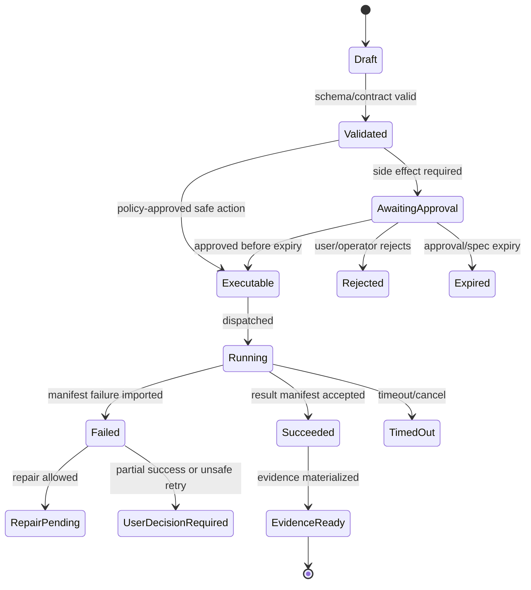

# Frontend Design System

## V6.17 shared UI, distinct host facades

Tokens, accessible components, conversation cards, diff views, approval summaries, evidence views, and BMAD vocabulary are shared React/TypeScript packages. Delivery-specific shells compose them through `WebRuntimeFacade` or `DesktopRuntimeFacade`.

The web facade uses generated OpenAPI/streaming clients. The desktop facade uses generated Tauri IPC commands/events and receives opaque workspace/candidate/spec IDs plus relative paths. Components must label Cloud Workspace versus Local Folder, Uploaded/Remote versus Local, and Sync/Remote Job as explicit actions; no generic “run” action may hide the authority boundary.

## V6.18 visual system and frontend UX baseline

The canonical direction is a **calm technical workbench**: neutral surfaces, precise typography, restrained indigo action color, strong semantic state colors, thin dividers, low elevation, and generous space around consequential decisions. It takes inspiration from Odysseus's dark workspace, collapsible rail, centered working area, density controls, and persistent composer, but deliberately removes novelty themes, decorative backgrounds, tiny all-monospace text, modal sprawl, and animation on routine controls.

### 1. Design-language decisions

| Area | Decision |
|---|---|
| Overall character | Professional, quiet, technical, trustworthy; no glossy SaaS gradients, glassmorphism, neon glow, or decorative dashboards. |
| Container model | Open workspace regions separated by 1 px dividers. Cards are reserved for conversational objects and decisions, not every block of content. |
| Shape | Mostly `6–10 px` radii. Pills are limited to compact status or delivery badges whose text benefits from a closed shape. |
| Elevation | Flat by default. One soft elevation level for menus, sheets, dialogs, and dragged panels; no shadow stacks. |
| Typography | `Inter Variable` for UI and content; `JetBrains Mono` for code, logs, hashes, paths, and `argv[]` only. Use licensed self-hosted files; do not copy Odysseus assets. |
| Iconography | Lucide React, `18 px` default, `20 px` prominent, `1.75` stroke. Filled icons are used only for selected status indicators where the metaphor remains clear. |
| Themes | Light, dark, and system. Add a tested forced-colors/high-contrast treatment; do not ship an open-ended theme builder in v1. |
| Density | Comfortable default and compact option. Density changes spacing and row height, never the root font size. |

### 2. Core semantic tokens

CSS custom properties are the source of truth. Tailwind theme variables expose them as utilities; component code does not embed raw palette values.

#### Light theme

| Token | Value | Use |
|---|---:|---|
| `--canvas` | `#F6F7F9` | Application background outside the main work surface. |
| `--surface-1` | `#FFFFFF` | Primary conversation and inspector surface. |
| `--surface-2` | `#F0F2F5` | Hover, selected rows, code-adjacent chrome. |
| `--surface-3` | `#E7EAF0` | Pressed state and stronger separation. |
| `--text-strong` | `#171B22` | Headings and primary content. |
| `--text` | `#303846` | Body and control labels. |
| `--text-muted` | `#667085` | Supporting metadata; never use below tested contrast. |
| `--border` | `#D8DDE6` | Region and component boundaries. |
| `--border-strong` | `#B9C1CE` | Selected/focused structural edges. |
| `--accent` | `#4F5FF7` | Primary action, selected navigation, links. |
| `--accent-hover` | `#3F4DDC` | Primary action hover. |
| `--focus` | `#3457D5` | Focus ring. |

#### Dark theme

| Token | Value | Use |
|---|---:|---|
| `--canvas` | `#0B0F14` | App background and global rail. |
| `--surface-1` | `#111720` | Conversation and inspector. |
| `--surface-2` | `#18202B` | Hover, selected rows, raised controls. |
| `--surface-3` | `#222C39` | Pressed state and stronger separation. |
| `--text-strong` | `#F4F7FB` | Headings and primary content. |
| `--text` | `#D7DEE8` | Body and control labels. |
| `--text-muted` | `#98A4B5` | Supporting metadata. |
| `--border` | `#283443` | Region and component boundaries. |
| `--border-strong` | `#415166` | Selected/focused structural edges. |
| `--accent` | `#7B8CFF` | Primary action, selected navigation, links. |
| `--accent-hover` | `#98A5FF` | Primary action hover. |
| `--focus` | `#9FB1FF` | Focus ring. |

These values are implementation targets, not claims of accessibility by inspection. Each text/background and component-state pairing must pass automated contrast checks and manual review in both themes and forced-colors mode.

#### Semantic state roles

| Role | Light foreground | Dark foreground | Required non-color cue |
|---|---:|---:|---|
| Information / running | `#1F63C5` | `#75B5FF` | `Info` or progress icon plus state text. |
| Proposed | `#6D45B8` | `#C4A7FF` | Draft/proposal icon plus `Proposed`. |
| Approval required | `#9A5B00` | `#FFC56E` | Shield/decision icon plus `Awaiting approval`. |
| Success / validated | `#147A4B` | `#65D6A0` | Check icon plus `Validated`. |
| Warning / partial | `#9A5B00` | `#FFC56E` | Warning icon plus specific state. |
| Danger / failed | `#B4232C` | `#FF8790` | Error icon plus failure text. |
| Stale / expired | `#596579` | `#AAB5C4` | Clock/refresh icon plus reason. |

`Applied` and `Validated` must not share the same visible label or icon. A successful green state is reserved for server- or host-confirmed outcomes; optimistic client actions remain neutral or informational.

### 3. Typography, spacing, and geometry

| Token family | Values |
|---|---|
| UI type | `12/16` metadata, `13/18` dense control, `14/20` default control/body, `16/24` emphasized body, `20/28` section title, `24/32` screen title, `32/40` onboarding only. |
| Font weight | `400` body, `500` controls/labels, `600` headings and high-emphasis values, `700` only for exceptional onboarding emphasis. |
| Mono type | `12/18` metadata, `13/20` default code/log, `14/22` readable code. |
| Spacing | `2, 4, 6, 8, 12, 16, 20, 24, 32, 40, 48, 64`. Components use the smallest sufficient value. |
| Radius | `4` code/token, `6` compact control, `8` default control/card, `10` sheet/dialog, `12` onboarding surface. |
| Control height | `28` dense utility, `32` compact, `36` default, `40` prominent, `44` minimum touch-oriented action. |
| Focus | `2 px` focus color plus `2 px` surface-colored offset; visible in light, dark, and forced colors. |
| Content measure | Conversation body `680–820 px`; long-form artifact text maximum `72 ch`; inspector `360–520 px`. |

The compact density retains at least `14 px` body/control text and compliant pointer targets. It reduces row padding and gaps only. Do not copy Odysseus's `13 px` root-font density or `zoom`-based accessibility scaling.

### 4. Approved frontend libraries

The first slice uses one primitive system and one visual token system. Do not mix React Aria, Radix, Base UI, MUI, and bespoke focus/overlay code in the same component layer.

| Concern | Decision | Status and constraints |
|---|---|---|
| Accessible primitives | `react-aria-components` | `LOCKED_WITH_COMPATIBILITY_GATE`. Wrap in `packages/ui`; route code imports Sapphirus components, not raw primitives. Own all styles and product anatomy. |
| Styling and tokens | Tailwind CSS 4 + CSS custom properties | `LOCKED`. Use Tailwind theme variables and source-owned component variants; no runtime CSS-in-JS. |
| Variant composition | `class-variance-authority`, `clsx`, `tailwind-merge` | `LOCKED`. Variants map to named design-system states rather than arbitrary class strings. |
| Icons | `lucide-react` | `LOCKED`. Static named imports only; no dynamic full-library import. Product-specific marks remain separate reviewed assets. |
| Structural motion | `motion/react` | `LOCKED_WITH_BUNDLE_GATE`. Use `LazyMotion` and global reduced-motion configuration. CSS handles hover/focus/pressed microstates. |
| Resizable layout | `react-resizable-panels` | `LOCKED_WITH_A11Y_GATE`. Persist only user layout preferences; verify keyboard separators and minimum hit areas. |
| Long lists/streams | `@tanstack/react-virtual` | `LOCKED`. Use for logs, file trees, long timelines, and search results; preserve focus and scroll anchors. |
| Diff rendering | `@pierre/diffs` React API | `PHASE-0 SPIKE`. Use read-only split/stacked diff and virtualization. Gate on React 19, CSP/Shadow DOM, keyboard/screen-reader behavior, 50k-line performance, and theme integration. Experimental conflict/worker APIs are out of v1. |
| Markdown | `react-markdown` + `remark-gfm` with a strict component/URL allowlist | `LOCKED_WITH_SECURITY_GATE`. Do not enable raw HTML. Unsafe rich artifacts render in a separately sandboxed preview. |
| Server data | React Router loaders/actions + generated facade clients | `LOCKED_FOR_V1`. Add a separate server-state library only after a measured cache/invalidation problem. The event reducer remains a projection, not authority. |
| Component catalog | Storybook for React/Vite | `LOCKED_WITH_VITE8_TS7_GATE`. Every stateful component has stories for light/dark, density, keyboard, reduced motion, loading, empty, error, stale, and permission states. |
| Component tests | Vitest + React Testing Library + `user-event` + axe | `LOCKED_WITH_TS7_GATE`. Test visible behavior and keyboard flow, not implementation internals. |
| End-to-end QA | Playwright + `@axe-core/playwright` | `LOCKED`. Include responsive, keyboard, reduced-motion, reconnect, approval expiry, and screenshot baselines. |

Do not add GSAP, Lottie, Rive, Three.js, Monaco, a second primitive library, a generic enterprise component suite, a second toast system, Redux/Zustand/XState, or a chart library to the first slice without a recorded product requirement and bundle/accessibility gate. Operator charts are selected when that surface enters scope.

### 5. Component ownership and composition

`packages/ui` owns tokens, primitives, recipes, icons, and delivery-neutral view components. `apps/web` and `apps/desktop-ui` own route composition and facade binding.

```text
packages/ui
├── tokens                 semantic color, type, space, radius, elevation, motion
├── primitives             Button, Dialog, Menu, Tabs, Tooltip, Toast, Field, Table
├── shell                  GlobalRail, ContextRail, Workbench, Inspector, ResizeHandle
├── run                    RunCapsule, StageRail, PlanSummary, ApprovalReview, RunOutcome
├── review                 DiffReview, CommandReview, RiskSummary, PolicyDetails
├── evidence               LogStream, EvidenceSummary, ArtifactPreview, CheckpointSummary
└── testing                fixtures, accessibility helpers, story decorators
```

Only `primitives` may import React Aria directly. Only the icon wrapper may import Lucide. Route packages do not invent one-off buttons, badges, dialogs, focus rings, or status colors.

### 6. Motion system

Motion is functional feedback, not brand decoration.

| Token | Value | Use |
|---|---:|---|
| `--motion-instant` | `80 ms` | Color/opacity response for hover and press. |
| `--motion-fast` | `120 ms` | Tooltip, small disclosure, focus-adjacent feedback. |
| `--motion-base` | `180 ms` | Menu, popover, capsule-stage crossfade. |
| `--motion-panel` | `220 ms` | Inspector/context rail open and close. |
| `--ease-standard` | `cubic-bezier(0.2, 0, 0, 1)` | Most UI transitions. |
| `--ease-enter` | `cubic-bezier(0, 0, 0, 1)` | Incoming content. |
| `--ease-exit` | `cubic-bezier(0.3, 0, 1, 1)` | Outgoing content. |

Approved recipes:

- hover/focus/pressed: CSS color, border, and opacity only;
- menu/popover: opacity plus `4 px` translation;
- inspector/sheet: opacity plus maximum `8 px` translation;
- new `RunCapsule`: one opacity/`6 px` entrance, never replayed on stream updates;
- approval-to-execution: crossfade within the same capsule, preserving geometry;
- success: icon draw or opacity transition once, without confetti or bounce;
- running: real phase text and elapsed time; a subtle progress indicator may animate, but never as the sole signal.

Global `MotionConfig` uses the user's reduced-motion preference. Reduced motion disables transform and layout animation, retains short opacity/color feedback, stops decorative loops, and never suppresses state information. Animations are interruptible and never postpone navigation, approval, stop, or rollback.

### 7. Performance and visual quality gates

- Initial project route JavaScript target: `≤ 250 kB` compressed excluding authenticated on-demand preview/diff chunks; record and revise the budget with real bundle evidence.
- Lazy-load Builder, Operator, artifact preview engines, diff syntax themes, and other non-first-route capabilities.
- No layout shift when fonts, panels, or run cards load. Use stable dimensions and `font-display: swap` with compatible fallbacks.
- Virtualized lists preserve selection, text search, focus, and reconnect scroll anchors.
- Use CSS containment only where it does not break overlays, sticky headers, or accessibility.
- Storybook screenshot baselines cover the canonical `1280×720`, `1440×900`, and narrow mobile review surfaces in light and dark themes.
- Visual QA checks hierarchy, copy, layout, typography, palette, icons, focus, overflow, density, and reduced motion—not only whether the build passes.

### 8. Current source validation

Official sources checked on 2026-07-10:

- [React Aria getting started](https://react-aria.adobe.com/getting-started)
- [Tailwind theme variables](https://tailwindcss.com/docs/theme)
- [Motion accessibility guidance](https://motion.dev/docs/react-accessibility)
- [React Resizable Panels](https://github.com/bvaughn/react-resizable-panels)
- [TanStack Virtual](https://tanstack.com/virtual/latest/docs/introduction)
- [Diffs documentation](https://diffs.com/docs)
- [Lucide React](https://lucide.dev/guide/react)
- [Storybook accessibility testing](https://storybook.js.org/docs/writing-tests/accessibility-testing)
- [Playwright accessibility testing](https://playwright.dev/docs/accessibility-testing)

## 1. Mission

Create a precise, operational, technical UI for governed agentic work: clear states, low ambiguity, high trust, and accessible interaction patterns.

## 2. Responsibilities

- Define information architecture around Project, Chat, Builder, Artifact Creator, Operator.
- Design card system for run events.
- Design side-panel system.
- Provide dense but readable technical surfaces.
- Support keyboard navigation and WCAG 2.2 AA target.
- Prepare localization-ready copy and layout.

## 3. Explicit Non-Responsibilities

- Do not bypass Airlock.
- Do not mutate authoritative state outside the Runtime API state transition path.
- Do not hide policy decisions inside UI-only code.
- Do not let model text become executable behavior without typed validation.
- Do not introduce a separate runtime semantics path unless an ADR approves it.

## 4. Interfaces and Ports

| Interface | Purpose |
|---|---|
| IDesignTokenSet | Typography, spacing, surfaces, status semantics. |
| IRunCardRegistry | Maps event kind to card component. |
| IPanelLayout | Resizable panels and persistence. |
| IAccessibilityAudit | Automated and manual checks. |
| ILocalizationProvider | String/resource handling. |

## 5. State and Lifecycle

UI state follows server state. Components must distinguish draft, proposed, approval-required, approved, running, succeeded, failed, blocked, stale, rolled-back.

## 6. Data Contracts

Core surfaces:

- project home;
- chat workbench;
- artifact creator;
- Builder Studio;
- package registry;
- operator console;
- evidence viewer.

Status language must be deterministic: proposed != approved != applied != validated.

## 7. Primary Flow

```text
Route shell
→ project sidebar
→ chat timeline
→ contextual right panels
→ command palette/search
→ modal/inline approvals
→ evidence/export drawer
```

## 8. Implementation Steps

- Create design tokens.
- Build card components.
- Build panel layout.
- Build diff/log/evidence viewers.
- Add empty/loading/error states.
- Add accessibility checks to CI.
- Add localization resource pattern.
- Add story/demo page for all run states.

## 9. Failure Modes and Mitigations

| Failure | Mitigation |
|---|---|
| Generic SaaS dashboard feel | Use operation-focused cards and precise technical states. |
| Approval ambiguity | Approval cards list exact side effects and policy hash. |
| Dense UI unreadable | Progressive disclosure and panel layout. |
| Accessibility regression | Automated + keyboard/manual tests. |
| Localization retrofit expensive | Use resource strings from start. |

## 10. Acceptance Criteria

- Every run state has visible card.
- Keyboard user can approve/reject after reviewing details.
- Diff/log panels handle large content.
- Error states explain next action.
- UI copy avoids implying side effects before execution.

---

## v2 Review Improvements

### 1. Product Design Direction

The UI should feel like a controlled engineering workbench: precise, calm, inspectable, and operational. Avoid generic SaaS dashboard patterns that hide execution details.

### 2. Information Architecture

| Surface | Primary Question It Answers |
|---|---|
| Conversation | What is happening and what decision is needed? |
| Context panel | What did the model see and why? |
| Diff panel | What will change? |
| Terminal/log panel | What ran and what happened? |
| Artifact preview | What was produced? |
| Evidence panel | Can this be audited or rolled back? |
| Operator console | Is the platform safe and healthy? |

### 3. Design Tokens To Define

- spacing scale;
- typography scale;
- mono font use for code/logs/hashes;
- status/risk tokens;
- elevation/surface tokens;
- focus ring token;
- diff added/removed/unchanged tokens;
- terminal severity tokens;
- card density modes.

Do not hard-code status colors across components; use semantic tokens.

### 4. Component Inventory

| Component | Required States |
|---|---|
| `RunStatusLabel` | idle, proposed, awaiting approval, running local/cloud, applied, validation failed, validated, blocked, stale, rolled back. |
| `ApprovalReview` | pending, expired, approved, rejected, denied, stale, disconnected. |
| `DiffViewer` | loading, clean, changed, drifted, blocked. |
| `ContextPackView` | empty, selected, redacted, over budget. |
| `TerminalStream` | streaming, paused, truncated, failed, complete. |
| `EvidenceSummary` | pending, complete, partial, failed. |
| `ArtifactPreview` | loading, unsupported, previewable, exportable. |
| `PolicyReasonList` | allow, deny, require approval, require operator. |

### 5. UX Anti-Patterns To Avoid

- Hiding approvals in a separate admin queue for normal v1 flow.
- Showing “done” before manifest import completes.
- Displaying model text as if it were execution truth.
- Omitting context selection reasons.
- Rendering terminal output without command/spec metadata.
- Making rollback look available when side effects are non-reversible.

### 6. Frontend Release Gate

- Keyboard-only user can approve/reject and inspect diffs.
- User can identify current run state without reading logs.
- Every side-effect card shows policy/version/spec details.
- Logs can be paused and searched.
- Evidence panel is generated for success and failure.
- Layout remains usable on laptop screen widths.


---


---

## Implementation-depth contract

This file is part of the V6 implementation library. It is written as an implementation guide, not as a strategy memo. Every component must be built against the same system-wide constraints:

1. **The first executable slice comes before breadth.** The first demonstrable product must prove authenticated chat, workspace context, typed plan output, proposal creation, Airlock validation, approval, isolated execution, validation, checkpoint, and evidence.
2. **The delivery-specific authority owns lifecycle state.** The web Runtime API imports remote-worker facts into SQL; the signed desktop Rust host imports local-executor facts into SQLite. Workers, child processes, renderers, models, sync services, and support APIs do not advance authoritative lifecycle state.
3. **Airlock creates the only side-effect token.** Workspace writes, command runs, exports, package imports, dependency restores, and policy-sensitive actions require an `ApprovedExecutionSpec` issued by Airlock.
4. **The model does not own proposals.** Model Gateway returns typed model outputs. Run Orchestrator creates normalized `Proposal` records. Airlock validates proposals.
5. **No raw shell by default.** Commands are represented as `argv[]` plus policy metadata; `sh -c`, shell expansion, broad environment access, and open network access are blocked unless explicitly operator-approved.
6. **Every side effect is reconstructable.** Diffs, preimages, spec hashes, policy hashes, approvals, job image digests, result manifests, logs, artifacts, and rollback metadata must be traceable.
7. **Each module has ports.** Even inside a modular monolith, use explicit interfaces and contracts to avoid creating a god control plane.


## 1. Component identity

| Field | Value |
|---|---|
| Component | `Frontend Design System` |
| Area | `User interface system` |
| Primary implementation package | `packages/ui` shared by `apps/web` and `apps/desktop-ui` |
| Runtime/technology | `React + TypeScript + Tailwind CSS 4 over semantic CSS custom properties` |
| First-slice priority | `foundational; tokens, shell, approvals, and evidence precede first-slice UI implementation` |


## 2. Purpose

Provide a precise, technical, accessible, enterprise-grade interface for chat, execution, evidence, BMAD workflows, and operator functions.

The implementation must be narrow enough to fit the corrected first vertical slice, but designed so BMAD package execution, the existing presentation adapter, Builder Studio, SkillOps, replay, and operator controls can plug into the same contracts later.


## 3. Owns / does not own

### Owns
- Design tokens
- Layout shells
- Timeline cards
- Approval cards
- Diff UI
- Log viewer
- Artifact preview
- Evidence views
- Empty/error/loading states
- Accessibility patterns

### Does not own
- Backend state transitions
- Policy decisions
- Model output correctness


## 4. Public/API surface and internal ports

### Required API/routes or callable operations
- `Consumes generated client only; no handwritten fetch outside api layer`


### Internal contract rules

- Every boundary uses typed, schema-versioned values. C# uses `Runtime.Contracts` / `Runtime.Domain`, Rust uses generated contract types plus `desktop-domain`, and TypeScript uses generated web or desktop facade types; no generated DTO grants runtime authority.
- External payloads must be schema-versioned. Internal objects may evolve faster but must not leak into OpenAPI without a contract version.
- Every state mutation must be idempotent or protected by optimistic concurrency.
- Every side-effect operation must receive an `ApprovedExecutionSpec` or be provably read-only.
- Every error response must use the standard error envelope with `code`, `message`, `correlationId`, `retryable`, and optional `detailsRef`.


### Starter interface/type sketch

```ts
export type UiLoadState = 'idle' | 'loading' | 'ready' | 'stale' | 'blocked' | 'error';

export interface RunEventViewModel {
  runId: string;
  eventId: string;
  kind: string;
  occurredAt: string;
  severity: 'info' | 'warning' | 'error';
  summary: string;
  payloadRef?: string;
}
```


## 5. State model

### Component states
- `loading`
- `empty`
- `ready`
- `blocked`
- `needs_attention`
- `streaming`
- `stale`
- `error`
- `permission_denied`


### Generic side-effect lifecycle





## 6. Persistence responsibilities

### SQL tables or domain records touched
- `N/A frontend only; maps to RunEvent, Approval, Proposal, Artifact, EvidenceBundle`

### Blob/object storage paths touched
- `N/A except downloaded artifact URLs`


### Persistence rules

- In `web_managed`, SQL stores lifecycle state, compact indexes, ownership metadata, and references. In `windows_local`, SQLite stores the corresponding local authority records.
- In `web_managed`, Blob stores large immutable payloads: snapshots, logs, diffs, manifests, artifacts, exports, packages, traces, and validation reports. In `windows_local`, encrypted local content-addressed storage holds authority-owned payloads; cloud upload is explicit and purpose-scoped.
- Any Blob payload referenced from SQL must include content hash, schema version, created timestamp, and retention class.
- No raw secrets, broad credentials, or unredacted prompt/context payloads are stored by default.
- Migrations must be forward-safe and testable against fixture data.


## 7. Detailed implementation steps


### Phase 0 — Contract and spike

1. Create or update the relevant ADR before implementation when the decision affects hosting, policy, security, data ownership, or external dependencies.

2. Define public DTOs and durable JSON schemas first. Do not let implementation classes silently become external contracts.

3. Create a minimal fixture that exercises the component without requiring the whole platform.

4. Add negative tests for the most dangerous bypass or failure case before adding the happy path.

5. Record assumptions in the component file and in the ADR index if they are not final.

6. For `Frontend Design System`, implement only the smallest behavior that proves its contract in the first executable slice, then add extended BMAD/Builder/artifact behavior after gate approval.


### Phase 1 — Skeleton implementation

1. Create the package/module/folder with explicit ports/interfaces and dependency direction rules.

2. Add dependency injection registration with narrow interfaces rather than passing broad services everywhere.

3. Implement persistence only through repository/store abstractions that expose business operations, not raw table access.

4. Emit structured events for every important state transition even if the UI does not yet render them.

5. Add unit tests for object creation, invalid input, authorization/policy denial, and idempotency where relevant.

6. For `Frontend Design System`, implement only the smallest behavior that proves its contract in the first executable slice, then add extended BMAD/Builder/artifact behavior after gate approval.


### Phase 2 — First vertical integration

1. Connect the component to the first executable slice only. Avoid adding full future scope before the vertical path works.

2. Use fake/stub adapters for expensive external systems until the contract is proven.

3. Make all side effects flow through Proposal → AirlockDecision → Approval/Grant → ApprovedExecutionSpec → Dispatch.

4. Persist large payloads to Blob and store only compact references in SQL.

5. Return UI-consumable run events so the Chat Workbench can render progress without polling raw tables.

6. For `Frontend Design System`, implement only the smallest behavior that proves its contract in the first executable slice, then add extended BMAD/Builder/artifact behavior after gate approval.


### Phase 3 — Production hardening

1. Add telemetry attributes, correlation IDs, redaction, and audit events.

2. Add retry, timeout, cancellation, and stale-state handling.

3. Add migration scripts and seed data for dev/test.

4. Add operator visibility for status, errors, budget/policy impact, and cleanup status.

5. Document runbooks for the top failure modes.

6. For `Frontend Design System`, implement only the smallest behavior that proves its contract in the first executable slice, then add extended BMAD/Builder/artifact behavior after gate approval.


### Phase 4 — Regression and release gate

1. Add contract tests against OpenAPI/JSON Schema.

2. Add replay fixtures or golden outputs where deterministic behavior is expected.

3. Add security tests for prompt injection, secret leakage, excessive agency, insecure output handling, and supply-chain drift where relevant.

4. Update release gate evidence with screenshots/log excerpts/manifests rather than informal claims.

5. Mark open risks and deferred v1.5/v2 items explicitly.

6. For `Frontend Design System`, implement only the smallest behavior that proves its contract in the first executable slice, then add extended BMAD/Builder/artifact behavior after gate approval.


## 8. Validation and test plan

### Required tests
- visual regression for core panels
- keyboard navigation through approval card
- color contrast AA
- large diff virtualization
- stream reconnection UI


### Minimum test layers

| Layer | What to test | Required before merge |
|---|---|---|
| Unit | object validation, state transitions, parsing, policy predicates | yes |
| Contract | OpenAPI/JSON Schema compatibility, generated clients, worker manifests | yes for public/durable payloads |
| Integration | SQL + Blob references, dispatch/import, authz, Airlock boundary | yes for side-effect paths |
| E2E | chat → proposal → approval → execution → evidence | yes for first slice files |
| Replay/golden | BMAD package fixtures, presentation adapter, evidence bundle | yes before v1 beta |
| Security negative | prompt injection, secret leak, policy bypass, path traversal, raw shell | yes for all side-effect components |


## 9. Failure modes and recovery

| Failure | Detection | Required behavior | User/operator visibility |
|---|---|---|---|
| Invalid schema | contract validation | reject before persistence or dispatch | show actionable error with correlation ID |
| Stale proposal/preimage | hash mismatch | void proposal or require rebase/new proposal | show stale context warning |
| Approval expired | expiry check | reject dispatch | show re-approve option |
| Policy mismatch | policy hash mismatch | reject spec | operator audit event |
| Worker timeout | job monitor | mark job timed out; preserve partial logs | timeline event + retry option if safe |
| Manifest missing/invalid | manifest import validation | do not advance success state | incident/failure card |
| Partial success | checkpoint/validation state | enter `user_decision_required` or `kept_for_repair` | explicit decision card |
| Secret detected | scanner/redactor | redact and block if high confidence | security finding card/operator event |


## 10. Security and policy requirements

- Treat workspace files, package files, generated artifacts, model outputs, and logs as untrusted input.
- Never let untrusted content override system instructions, Airlock policy, command allowlists, network policy, or secret handling.
- Enforce project-level authorization on every read and write.
- Log security-relevant denials as audit events, but do not include raw secret values.
- Prefer fail-closed behavior when policy, identity, schema, or storage checks are ambiguous.
- Add negative tests for the most likely bypass path before writing happy-path code.


## 11. Observability

Minimum telemetry fields for this component:

- `correlation.id`
- `project.id`
- `run.id` when available
- `component.name`
- `operation.name`
- `operation.outcome`
- `policy.version` when applicable
- `spec.id` when applicable
- `job.id` when applicable
- `artifact.id` when applicable
- redaction counters, not raw secrets

Metrics to consider: request latency, state-transition count, policy denials, approval wait time, job duration, manifest import failures, schema validation failures, retry count, budget blocks, and evidence materialization time.


## 12. Acceptance criteria

- [ ] The component has a clear owner package and does not leak responsibilities into unrelated modules.
- [ ] Public routes/payloads are represented in OpenAPI/JSON Schema where applicable.
- [ ] Side-effect paths cannot execute without Airlock evaluation and `ApprovedExecutionSpec`.
- [ ] SQL lifecycle state is mutated only by the Runtime API/Application layer.
- [ ] Blob payloads have content hashes and schema versions.
- [ ] Tests include at least one negative/bypass case.
- [ ] Events and evidence are emitted for user-visible actions.
- [ ] The component is represented in the release gate matrix.
- [ ] The implementation does not introduce Cortex as a runtime namespace.
- [ ] Documentation includes deferred v1.5/v2 scope explicitly rather than silently omitting it.


## 13. Integration checklist

- [ ] Update `32 - Integration Contract Map.md` with any new caller/callee relationship.
- [ ] Update `25 - OpenAPI, Schemas, and Generated Clients.md` for public route or schema changes.
- [ ] Update `22 - Data Model - SQL and Blob.md`, `47 - Database DDL Starter.md`, or `48 - Blob Storage Layout.md` for persistence changes.
- [ ] Update `27 - Testing, Validation, and Replay.md` for new fixtures or replay needs.
- [ ] Update `33 - Release Gates and Acceptance Matrix.md` if the change affects release readiness.
- [ ] Add or update ADR in `31 - Architecture Decision Records.md` if the change alters architecture, hosting, policy, or security posture.


---

## Historical Revision Notes (V3 -> V4 Hardening Pass)
### V4 audit finding applied to this file
The v3 library was detailed, but several files still behaved like expanded planning notes rather than implementation handbooks. This pass adds enforceable implementation details: exact build sequence, explicit boundaries, input/output contracts, database/blob ownership, event names, failure states, tests, and release gates.

## System invariants this component must obey

1. The first delivered slice remains: **authenticated chat → workspace context → implementation plan → proposal → Airlock → approval → isolated job → validation → checkpoint → evidence**.
2. No worker image receives Azure SQL write credentials. Workers produce signed/hashed append-only manifests in Blob; the Runtime API imports them and advances SQL lifecycle state.
3. No file write, command run, dependency restore, package import, artifact export, checkpoint mutation, or rollback can execute without an `ApprovedExecutionSpec` minted by Airlock.
4. The Model Gateway returns typed model outputs only. The Run Orchestrator creates platform `Proposal` records. Airlock validates proposals and creates approved specs.
5. Commands are `argv[]` specs, not raw shell strings. Shell execution is a separate high-risk command class.
6. Every state transition emits a run event and trace event with correlation ID, actor/service principal, schema version, and payload hash or payload reference.
7. Every persisted object carries schema version, retention class, project scope, created/updated timestamps, and hash/provenance where relevant.
8. Any component that reads workspace content treats it as untrusted user-controlled input and cannot allow it to override system policy, command allowlists, approval requirements, or secrets handling.


## Component build card

| Field | Value |
|---|---|
| Component | `Frontend Design System` |
| Primary package/path | `packages/ui` |
| Current implementation status | `v6-validated` |
| Required for first vertical slice | `yes — minimum token, shell, RunCapsule, approval, diff, log, and evidence subset` |

## Validated API/port touchpoints

- `N/A - UI system consumed by app routes`

## Validated domain events to implement or consume

- `ui.state.changed`
- `ui.approval.focused`
- `ui.diff.opened`
- `ui.evidence.opened`

## Validated SQL ownership / indexes

- `user_preferences(optional)`
- `layout_preferences(optional)`

Implementation notes:

- Tables listed here are owned by their module or exposed through its port; other modules must not perform direct ad-hoc writes.
- Mutable lifecycle tables need optimistic concurrency tokens.
- All records need `project_id`, `schema_version`, `created_at`, `updated_at`, and retention classification where applicable.

## Validated Blob payload layout

- `design-system/screenshots/*`
- `visual-regression/baselines/*`

Implementation notes:

- Blob payloads are content-addressed or hash-checked before import.
- SQL stores compact payload references, not bulky logs/prompts/artifacts.
- Retention class and redaction level must be explicit for every payload family.

## Validated step-by-step build procedure

1. Create components for run cards, approval cards, diff hunks, log chunks, evidence chips, risk labels, and artifact previews.
2. Use an operational/cockpit visual language without generic SaaS gradients.
3. Make proposals visually distinct from approved/executed states.
4. Implement WCAG 2.2 AA target: focus, contrast, keyboard, reduced motion, live-region discipline.
5. Add visual regression snapshots for key run states.
6. Do not allow CSS-only hiding as security for operator features.

## Validated edge cases that must be tested

| Edge case | Expected behavior |
|---|---|
| Duplicate API request with same idempotency key | Returns original result; no duplicate state transition or worker dispatch. |
| Stale proposal after newer checkpoint | Proposal is voided or requires rebase; approval is blocked. |
| Expired approval/spec | Side-effect endpoint rejects request; UI asks for refresh. |
| Unknown schema version | Import/read path rejects or routes to migration handler. |
| Blob payload hash mismatch | Runtime refuses import and creates security/audit finding. |
| User lacks project role | API returns access denied; no object existence leakage. |
| Workspace contains prompt injection in docs/code | Treated as untrusted content; cannot change system policy or tool permissions. |
| Worker crashes after writing partial logs | Execution becomes failed/unknown with partial log refs; retry uses same spec rules. |

## Validated release gate for this component

- Unit tests cover all domain transitions owned by this component.
- Contract tests cover all listed API touchpoints or port methods.
- Integration tests prove SQL/Blob responsibility boundaries.
- Security tests cover unauthorized access and malformed payloads.
- Replay fixture includes at least one success path and one failure path relevant to this component.
- Observability emits trace/span/log attributes with the shared correlation ID.
- Documentation examples compile or validate against JSON Schema/OpenAPI where relevant.


## V6 frontend technology baseline

The frontend implementation baseline is React 19.2, Vite 8, React Router 8 SPA mode, the TypeScript 7 application compiler, Node.js 24 LTS, and pnpm 11.x.

Implementation rules:

- Generate API clients from the one OpenAPI 3.1.2/JSON Schema 2020-12 contract used by ASP.NET Core 10. Do not hand-code fetch shapes or maintain a parallel 3.2 contract.
- Use React 19 Actions/transitions where they simplify long-running approval or form submission UX, but never hide authoritative Runtime API state.
- Keep streaming event handlers pure: events update local projections, but final lifecycle state is reconciled from Runtime API state.
- Treat all markdown/artifact previews as untrusted rendered content; sanitize and sandbox where possible.
- Use accessibility tests for chat cards, diff panels, approval dialogs, terminal logs, and evidence summaries.
- Pin Node/pnpm versions so CI and local builds use the same toolchain.
