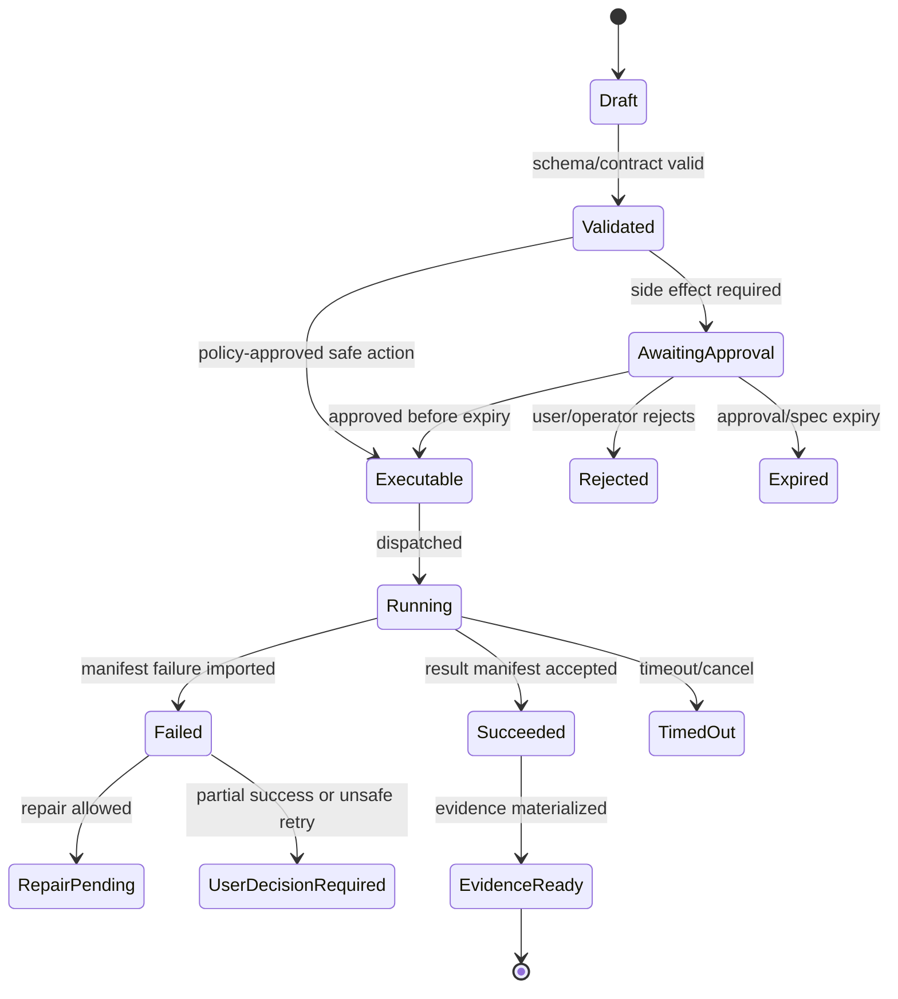

# Testing, Validation, and Replay

## V6.17 test lanes

The quality plan has three independent lanes:

1. `shared`: schema canonicalization, C#/Rust/TypeScript golden vectors, BMAD fixtures, Airlock rule parity, replay, UI contract tests;
2. `web_managed`: API/SQL/Blob transactions, fixed job dispatch/import, cloud workspace, identity/network, browser E2E and recovery;
3. `windows_local`: Rust unit/property tests, adversarial NTFS/reparse/hardlink cases, SQLite crash injection, journal recovery, IPC capability tests, signed update/auth tests, command containment evidence, and desktop E2E.

Passing the sealed fake does not release either real executor. Passing web isolation does not validate desktop containment. The remote-job handoff requires a cross-delivery test proving no direct local apply and fresh local approval.

## 1. Mission

Prove safety and correctness through deterministic tests, policy tests, integration tests, replay fixtures, package validation fixtures, and golden artifact outputs.

## 2. Responsibilities

- Build test pyramid for API/domain/workers/UI.
- Create policy test suite for Airlock.
- Create replay corpus for vertical slice.
- Create BMAD valid/invalid package fixtures.
- Create presentation adapter golden fixtures.
- Test failure states and partial success.
- Validate schemas and OpenAPI compatibility in CI.

## 3. Explicit Non-Responsibilities

- Do not bypass Airlock.
- Do not mutate authoritative state outside the Runtime API state transition path.
- Do not hide policy decisions inside UI-only code.
- Do not let model text become executable behavior without typed validation.
- Do not introduce a separate runtime semantics path unless an ADR approves it.

## 4. Interfaces and Ports

| Interface | Purpose |
|---|---|
| IReplayRunner | Loads stored run events and payload refs. |
| IPolicyTestHarness | Airlock unit/property tests. |
| IWorkerHarness | Runs sealed deterministic fake specs locally and fixed ACA integration specs remotely; never requires a local worker container. |
| IContractTestRunner | OpenAPI/schema tests. |
| IArtifactGoldenComparator | Compares presentation outputs or structured summaries. |

## 5. State and Lifecycle

Replay lifecycle: `fixture_recorded`, `sanitized`, `checked_in`, `replayed`, `diff_detected`, `accepted_update`.

## 6. Data Contracts

Required fixtures:

- successful patch/test run;
- policy-blocked path escape;
- command shell-string rejection;
- stale preimage rejection;
- validation failure with repair;
- infra timeout;
- valid BMAD package;
- invalid frontmatter package;
- presentation golden workflow;
- prompt-injection workspace file;
- secret redaction fixture.

## 7. Primary Flow

```text
Code change
→ unit tests
→ policy tests
→ contract tests
→ worker harness tests
→ replay fixtures
→ E2E vertical slice
```

## 8. Implementation Steps

- Set up unit test projects.
- Add schema validation tests.
- Add Airlock policy table tests.
- Add worker harness.
- Add Playwright E2E for vertical slice.
- Add replay runner.
- Add package validation fixtures.
- Add CI gates and artifact upload.

## 9. Failure Modes and Mitigations

| Failure | Mitigation |
|---|---|
| Only happy path tested | Required failure fixtures block release. |
| Model nondeterminism breaks tests | Use fake deterministic model for replay. |
| Golden PPTX binary diffs noisy | Compare structured slide manifest plus file hash when stable. |
| Policy gaps | Property tests for paths/commands. |
| Trace privacy untested | Fixtures assert raw secrets absent. |

## 10. Acceptance Criteria

- Vertical slice E2E passes.
- Airlock tests cover all command/path policy classes.
- Replay can run without live model.
- Secret fixture not present in prompts/logs/evidence.
- Presentation adapter has golden regression fixture.

## OpenClaw-Informed Scenario Pack Model

OpenClaw's QA scenario pack suggests a stronger replay/evidence shape for Sapphirus:

```yaml
scenario:
  id: vertical-slice-file-patch
  surface: runtime
  coverage:
    primary:
      - runtime.proposal-approval-execution
    secondary:
      - evidence.trace-bundle
  objective: Prove a chat request becomes an exact candidate/approval/spec and simulated result import locally; a separate ACA scenario proves real isolation.
  successCriteria:
    - Proposal is created from typed model output.
    - Airlock evaluates the candidate, binds exact approval, and mints a single-use audience-bound ApprovedExecutionSpec.
    - Trusted fake emits a simulated WebWorkerResultManifest without process/network/package execution.
    - Runtime API atomically imports completion/state/Evidence Ledger/outbox and materializes evidence.
  docsRefs:
    - 01 - First Build - Executable Vertical Slice.md
    - 19 - Airlock Policy and Approvals.md
  execution:
    kind: replay
    runtimeParityTier: standard
```

Scenario rules:

- Coverage IDs are proof targets, not prose summaries.
- `coverage.primary` means the scenario executes the required product boundary; `coverage.secondary` means supporting evidence.
- Scenario manifests should cite docs refs, code refs, execution kind, isolation needs, required fixtures, and success criteria.
- Runtime parity tiers should separate `standard`, `optional`, `live-only`, and `soak` tests.
- A scenario that mutates shared runtime state must declare isolation requirements.
- Replay reports must group results into worked, failed, blocked, and follow-up so missing proof is visible rather than buried.

### OpenClaw-Informed Maturity Taxonomy

Release readiness should connect scenario evidence to product surfaces:

| Level | Meaning | Promotion proof |
|---|---|---|
| M0 Planned | Direction exists, but no supported path. | Design issue, owner, and target surface. |
| M1 Experimental | Maintainer can run it with caveats. | Current-main scenario proof. |
| M2 Alpha | Real users can try it with incomplete UX. | Setup docs, basic tests, known caveats, and one real-environment proof. |
| M3 Beta | Main workflow is usable with bounded caveats. | Install/update docs, regression tests, support runbook, and expected-environment proof. |
| M4 Stable | Recommended path; failures are regressions. | Release gate, doctor/troubleshooting path, broad docs, and repeated proof. |
| M5 Polished | Stable plus representative user scorecard pass. | Stable criteria plus user-facing scorecard pass. |

First-slice surfaces: Chat Workbench, Runtime API, Run Orchestrator, BMAD Kernel, Airlock, Execution Lanes, Workspace Service, Evidence/Trace, and Package Import.

---

## v2 Review Improvements

### 1. Test Pyramid

| Layer | Tests |
|---|---|
| Unit | policy kernel, schema validators, state machines, path canonicalization. |
| Contract | OpenAPI request/response, JSON Schema payloads, generated clients. |
| Integration | SQL transactions, Blob manifests, API module ports. |
| Worker | patch apply, command execution, manifest emission, redaction. |
| End-to-end | chat → proposal → approval → job → evidence. |
| Security | prompt injection, secret leakage, command/path abuse. |
| Replay | stored traces/evidence regenerate summaries and validate state. |

### 2. Required Fixture Suites

```text
fixtures/
  sample-react-app/
  bmad-package-valid/
  bmad-package-invalid-frontmatter/
  bmad-package-invalid-help-catalog/
  presentation-workflow-golden/
  prompt-injection-readme/
  secret-redaction/
  path-traversal-patch/
  command-policy/
  flaky-test-simulation/
```

### 3. Replay Requirements

A replay fixture contains:

- user message;
- workspace snapshot manifest;
- context pack hash;
- typed model output or stub;
- proposal;
- Airlock decision;
- approval;
- worker result manifest;
- expected final run state;
- expected evidence summary hash.

### 4. Critical Policy Tests

| Test | Expected |
|---|---|
| no approval spec | deny. |
| expired approval | deny. |
| spec hash mismatch | deny. |
| path traversal | deny. |
| symlink escape | deny. |
| shell command | deny by default. |
| external publish | deny in v1. |
| prompt injection asks to skip approval | no policy effect. |

### 5. Validation Before Release Candidate

- 100% pass on vertical slice fixture.
- 100% pass on Airlock policy regression suite.
- Evidence generated for every e2e run, including failed runs.
- Model Gateway schema failure path tested with malformed outputs.
- Worker manifests validated against JSON Schema.
- BMAD valid/invalid package fixtures pass expected outcomes.
- Presentation adapter golden fixture produces structurally equivalent output.


---


---

## Implementation-depth contract

This file is part of the V6 implementation library. It is written as an implementation guide, not as a strategy memo. Every component must be built against the same system-wide constraints:

1. **The first executable slice comes before breadth.** The first demonstrable product must prove authenticated chat, workspace context, typed plan output, proposal creation, Airlock validation, approval, isolated execution, validation, checkpoint, and evidence.
2. **The delivery-specific authority owns lifecycle state.** The web Runtime API imports remote-worker facts into SQL; the signed desktop Rust host imports local-executor facts into SQLite. Workers, child processes, renderers, models, sync services, and support APIs do not advance authoritative lifecycle state.
3. **Airlock creates the only side-effect token.** Workspace writes, command runs, exports, package imports, dependency restores, and policy-sensitive actions require an `ApprovedExecutionSpec` issued by Airlock.
4. **The model does not own proposals.** Model Gateway returns typed model outputs. Run Orchestrator creates normalized `Proposal` records. Airlock validates proposals.
5. **No raw shell by default.** Commands are represented as `argv[]` plus policy metadata; `sh -c`, shell expansion, broad environment access, and open network access are blocked unless explicitly operator-approved.
6. **Every side effect is reconstructable.** Diffs, preimages, spec hashes, policy hashes, approvals, job image digests, result manifests, logs, artifacts, and rollback metadata must be traceable.
7. **Each module has ports.** Even inside a modular monolith, use explicit interfaces and contracts to avoid creating a god control plane.


## 1. Component identity

| Field | Value |
|---|---|
| Component | `Testing, Validation, and Replay` |
| Area | `Quality assurance` |
| Primary implementation package | `tests/* + replay fixtures` |
| Runtime/technology | `xUnit/Playwright/Python pytest/contracts` |
| First-slice priority | `after-core or supporting` |


## 2. Purpose

Build confidence with contract tests, policy tests, state machine tests, worker tests, replay fixtures, BMAD validation, and golden artifact outputs.

The implementation must be narrow enough to fit the corrected first vertical slice, but designed so BMAD package execution, the existing presentation adapter, Builder Studio, SkillOps, replay, and operator controls can plug into the same contracts later.


## 3. Owns / does not own

### Owns
- Test pyramid
- Replay corpus
- Golden fixtures
- Policy test corpus
- Schema validation tests
- Worker smoke tests
- E2E vertical slice
- Regression gates

### Does not own
- Manual-only validation
- Unversioned golden outputs
- Untested policy exceptions


## 4. Public/API surface and internal ports

### Required API/routes or callable operations
- `POST /api/replay/run`
- `GET /api/replay/{id}`
- `POST /api/validation/bmad-package`
- `POST /api/validation/execution-spec`


### Internal contract rules

- Every boundary uses typed, schema-versioned values. C# uses `Runtime.Contracts` / `Runtime.Domain`, Rust uses generated contract types plus `desktop-domain`, and TypeScript uses generated web or desktop facade types; no generated DTO grants runtime authority.
- External payloads must be schema-versioned. Internal objects may evolve faster but must not leak into OpenAPI without a contract version.
- Every state mutation must be idempotent or protected by optimistic concurrency.
- Every side-effect operation must receive an `ApprovedExecutionSpec` or be provably read-only.
- Every error response must use the standard error envelope with `code`, `message`, `correlationId`, `retryable`, and optional `detailsRef`.


### Starter interface/type sketch

```python
@dataclass(frozen=True)
class WorkerInvocation:
    job_id: str
    approved_spec_path: Path
    checkout_path: Path
    output_dir: Path
    log_dir: Path
```


## 5. State model

### Component states
- `fixture_created`
- `replay_started`
- `replay_running`
- `replay_matched`
- `replay_drifted`
- `golden_updated`
- `validation_failed`


### Generic side-effect lifecycle





## 6. Persistence responsibilities

### SQL tables or domain records touched
- `ReplayRun`
- `ReplayFixture`
- `GoldenArtifact`
- `ValidationRun`
- `ValidationFinding`
- `TestGateResult`

### Blob/object storage paths touched
- `fixtures/replay/*`
- `fixtures/golden/*`
- `validation/{runId}/report.json`
- `test-artifacts/{runId}/*`


### Persistence rules

- In `web_managed`, SQL stores lifecycle state, compact indexes, ownership metadata, and references. In `windows_local`, SQLite stores the corresponding local authority records.
- In `web_managed`, Blob stores large immutable payloads: snapshots, logs, diffs, manifests, artifacts, exports, packages, traces, and validation reports. In `windows_local`, encrypted local content-addressed storage holds authority-owned payloads; cloud upload is explicit and purpose-scoped.
- Any Blob payload referenced from SQL must include content hash, schema version, created timestamp, and retention class.
- No raw secrets, broad credentials, or unredacted prompt/context payloads are stored by default.
- Migrations must be forward-safe and testable against fixture data.


## 7. Detailed implementation steps


### Phase 0 — Contract and spike

1. Create or update the relevant ADR before implementation when the decision affects hosting, policy, security, data ownership, or external dependencies.

2. Define public DTOs and durable JSON schemas first. Do not let implementation classes silently become external contracts.

3. Create a minimal fixture that exercises the component without requiring the whole platform.

4. Add negative tests for the most dangerous bypass or failure case before adding the happy path.

5. Record assumptions in the component file and in the ADR index if they are not final.

6. For `Testing, Validation, and Replay`, implement only the smallest behavior that proves its contract in the first executable slice, then add extended BMAD/Builder/artifact behavior after gate approval.


### Phase 1 — Skeleton implementation

1. Create the package/module/folder with explicit ports/interfaces and dependency direction rules.

2. Add dependency injection registration with narrow interfaces rather than passing broad services everywhere.

3. Implement persistence only through repository/store abstractions that expose business operations, not raw table access.

4. Emit structured events for every important state transition even if the UI does not yet render them.

5. Add unit tests for object creation, invalid input, authorization/policy denial, and idempotency where relevant.

6. For `Testing, Validation, and Replay`, implement only the smallest behavior that proves its contract in the first executable slice, then add extended BMAD/Builder/artifact behavior after gate approval.


### Phase 2 — First vertical integration

1. Connect the component to the first executable slice only. Avoid adding full future scope before the vertical path works.

2. Use fake/stub adapters for expensive external systems until the contract is proven.

3. Make all side effects flow through Proposal → AirlockDecision → Approval/Grant → ApprovedExecutionSpec → Dispatch.

4. Persist large payloads to Blob and store only compact references in SQL.

5. Return UI-consumable run events so the Chat Workbench can render progress without polling raw tables.

6. For `Testing, Validation, and Replay`, implement only the smallest behavior that proves its contract in the first executable slice, then add extended BMAD/Builder/artifact behavior after gate approval.


### Phase 3 — Production hardening

1. Add telemetry attributes, correlation IDs, redaction, and audit events.

2. Add retry, timeout, cancellation, and stale-state handling.

3. Add migration scripts and seed data for dev/test.

4. Add operator visibility for status, errors, budget/policy impact, and cleanup status.

5. Document runbooks for the top failure modes.

6. For `Testing, Validation, and Replay`, implement only the smallest behavior that proves its contract in the first executable slice, then add extended BMAD/Builder/artifact behavior after gate approval.


### Phase 4 — Regression and release gate

1. Add contract tests against OpenAPI/JSON Schema.

2. Add replay fixtures or golden outputs where deterministic behavior is expected.

3. Add security tests for prompt injection, secret leakage, excessive agency, insecure output handling, and supply-chain drift where relevant.

4. Update release gate evidence with screenshots/log excerpts/manifests rather than informal claims.

5. Mark open risks and deferred v1.5/v2 items explicitly.

6. For `Testing, Validation, and Replay`, implement only the smallest behavior that proves its contract in the first executable slice, then add extended BMAD/Builder/artifact behavior after gate approval.


## 8. Validation and test plan

### Required tests
- vertical slice e2e
- policy bypass negative tests
- BMAD package fixture import
- presentation adapter golden output
- replay deterministic without live model


### Minimum test layers

| Layer | What to test | Required before merge |
|---|---|---|
| Unit | object validation, state transitions, parsing, policy predicates | yes |
| Contract | OpenAPI/JSON Schema compatibility, generated clients, worker manifests | yes for public/durable payloads |
| Integration | SQL + Blob references, dispatch/import, authz, Airlock boundary | yes for side-effect paths |
| E2E | chat → proposal → approval → execution → evidence | yes for first slice files |
| Replay/golden | BMAD package fixtures, presentation adapter, evidence bundle | yes before v1 beta |
| Security negative | prompt injection, secret leak, policy bypass, path traversal, raw shell | yes for all side-effect components |


## 9. Failure modes and recovery

| Failure | Detection | Required behavior | User/operator visibility |
|---|---|---|---|
| Invalid schema | contract validation | reject before persistence or dispatch | show actionable error with correlation ID |
| Stale proposal/preimage | hash mismatch | void proposal or require rebase/new proposal | show stale context warning |
| Approval expired | expiry check | reject dispatch | show re-approve option |
| Policy mismatch | policy hash mismatch | reject spec | operator audit event |
| Worker timeout | job monitor | mark job timed out; preserve partial logs | timeline event + retry option if safe |
| Manifest missing/invalid | manifest import validation | do not advance success state | incident/failure card |
| Partial success | checkpoint/validation state | enter `user_decision_required` or `kept_for_repair` | explicit decision card |
| Secret detected | scanner/redactor | redact and block if high confidence | security finding card/operator event |


## 10. Security and policy requirements

- Treat workspace files, package files, generated artifacts, model outputs, and logs as untrusted input.
- Never let untrusted content override system instructions, Airlock policy, command allowlists, network policy, or secret handling.
- Enforce project-level authorization on every read and write.
- Log security-relevant denials as audit events, but do not include raw secret values.
- Prefer fail-closed behavior when policy, identity, schema, or storage checks are ambiguous.
- Add negative tests for the most likely bypass path before writing happy-path code.


## 11. Observability

Minimum telemetry fields for this component:

- `correlation.id`
- `project.id`
- `run.id` when available
- `component.name`
- `operation.name`
- `operation.outcome`
- `policy.version` when applicable
- `spec.id` when applicable
- `job.id` when applicable
- `artifact.id` when applicable
- redaction counters, not raw secrets

Metrics to consider: request latency, state-transition count, policy denials, approval wait time, job duration, manifest import failures, schema validation failures, retry count, budget blocks, and evidence materialization time.


## 12. Acceptance criteria

- [ ] The component has a clear owner package and does not leak responsibilities into unrelated modules.
- [ ] Public routes/payloads are represented in OpenAPI/JSON Schema where applicable.
- [ ] Side-effect paths cannot execute without Airlock evaluation and `ApprovedExecutionSpec`.
- [ ] SQL lifecycle state is mutated only by the Runtime API/Application layer.
- [ ] Blob payloads have content hashes and schema versions.
- [ ] Tests include at least one negative/bypass case.
- [ ] Events and evidence are emitted for user-visible actions.
- [ ] The component is represented in the release gate matrix.
- [ ] The implementation does not introduce Cortex as a runtime namespace.
- [ ] Documentation includes deferred v1.5/v2 scope explicitly rather than silently omitting it.


## 13. Integration checklist

- [ ] Update `32 - Integration Contract Map.md` with any new caller/callee relationship.
- [ ] Update `25 - OpenAPI, Schemas, and Generated Clients.md` for public route or schema changes.
- [ ] Update `22 - Data Model - SQL and Blob.md`, `47 - Database DDL Starter.md`, or `48 - Blob Storage Layout.md` for persistence changes.
- [ ] Update `27 - Testing, Validation, and Replay.md` for new fixtures or replay needs.
- [ ] Update `33 - Release Gates and Acceptance Matrix.md` if the change affects release readiness.
- [ ] Add or update ADR in `31 - Architecture Decision Records.md` if the change alters architecture, hosting, policy, or security posture.


---

## Historical Revision Notes (V3 -> V4 Hardening Pass)
### V4 audit finding applied to this file
The v3 library was detailed, but several files still behaved like expanded planning notes rather than implementation handbooks. This pass adds enforceable implementation details: exact build sequence, explicit boundaries, input/output contracts, database/blob ownership, event names, failure states, tests, and release gates.

## System invariants this component must obey

1. Web delivery has two explicit gates: **sealed test simulation** proves chat → BMAD/context → proposal/candidate → policy/exact approval → fake result → checkpoint/Evidence Ledger; **internal alpha** later proves the same contracts through a remotely built fixed ACA Job for real isolation.
2. No worker image receives Azure SQL write credentials. Workers produce signed/hashed append-only manifests in Blob; the Runtime API imports them and advances SQL lifecycle state.
3. No file write, command run, dependency restore, package import, artifact export, checkpoint mutation, or rollback can execute without an `ApprovedExecutionSpec` minted by Airlock.
4. The Model Gateway returns typed model outputs only. The Run Orchestrator creates platform `Proposal` records. Airlock validates proposals and creates approved specs.
5. Commands are `argv[]` specs, not raw shell strings. Shell execution is a separate high-risk command class.
6. Every state transition emits a run event and trace event with correlation ID, actor/service principal, schema version, and payload hash or payload reference.
7. Every persisted object carries schema version, retention class, project scope, created/updated timestamps, and hash/provenance where relevant.
8. Any component that reads workspace content treats it as untrusted user-controlled input and cannot allow it to override system policy, command allowlists, approval requirements, or secrets handling.


## Component build card

| Field | Value |
|---|---|
| Component | `Testing, Validation, Replay` |
| Primary package/path | `tests/*` |
| Current implementation status | `v6-validated` |
| Required for first vertical slice | `yes` |

## Validated API/port touchpoints

- `POST /api/replay/run`
- `GET /api/replay/{replayId}`
- `POST /api/validation/bmad-package`
- `POST /api/validation/worker-result-manifest`

## Validated domain events to implement or consume

- `test.contract.completed`
- `test.policy.completed`
- `replay.started`
- `replay.completed`
- `replay.drift.detected`

## Validated SQL ownership / indexes

- `replay_fixtures`
- `replay_runs`
- `validation_results`
- `test_artifacts`

Implementation notes:

- Tables listed here are owned by their module or exposed through its port; other modules must not perform direct ad-hoc writes.
- Mutable lifecycle tables need optimistic concurrency tokens.
- All records need `project_id`, `schema_version`, `created_at`, `updated_at`, and retention classification where applicable.

## Validated Blob payload layout

- `replay/fixtures/*`
- `replay/results/*`
- `validation/reports/*`
- `test-artifacts/*`

Implementation notes:

- Blob payloads are content-addressed or hash-checked before import.
- SQL stores compact payload references, not bulky logs/prompts/artifacts.
- Retention class and redaction level must be explicit for every payload family.

## Validated step-by-step build procedure

1. Create the first-slice fixture with fake model and a non-isolating `sealed_test_fake` that cannot start processes, use network, restore dependencies, or run imported/generated code.
2. Add contract tests, policy tests, state machine tests, manifest import tests, replay tests, and e2e Playwright tests.
3. Add golden BMAD package fixture and golden presentation adapter fixture.
4. Replay uses stored inputs/outputs/hashes and compares deterministic fields; model output replay uses fake provider unless explicitly testing provider.
5. Add regression tests for critical review fixes: Airlock bypass, worker SQL writes, command argv, partial failure states, and build order.
6. Block release if replay fixture for vertical slice fails.

## Validated edge cases that must be tested

| Edge case | Expected behavior |
|---|---|
| Duplicate API request with same idempotency key | Returns original result; no duplicate state transition or worker dispatch. |
| Stale proposal after newer checkpoint | Proposal is voided or requires rebase; approval is blocked. |
| Expired approval/spec | Side-effect endpoint rejects request; UI asks for refresh. |
| Unknown schema version | Import/read path rejects or routes to migration handler. |
| Blob payload hash mismatch | Runtime refuses import and creates security/audit finding. |
| User lacks project role | API returns access denied; no object existence leakage. |
| Workspace contains prompt injection in docs/code | Treated as untrusted content; cannot change system policy or tool permissions. |
| Worker crashes after writing partial logs | Execution becomes failed/unknown with partial log refs; retry uses same spec rules. |

## Validated release gate for this component

- Unit tests cover all domain transitions owned by this component.
- Contract tests cover all listed API touchpoints or port methods.
- Integration tests prove SQL/Blob responsibility boundaries.
- Security tests cover unauthorized access and malformed payloads.
- Replay fixture includes at least one success path and one failure path relevant to this component.
- Observability emits trace/span/log attributes with the shared correlation ID.
- Documentation examples compile or validate against JSON Schema/OpenAPI where relevant.

## Hermes-Informed Test Obligations

Source: [[86 - Hermes Source Code Review - Agent Runtime and Learning Loop]].

Add invariant tests for:

| Test | Expected behavior |
|---|---|
| Prompt cache stability | Same run keeps stable system prompt, tool schema, and context hashes unless an explicit transition event exists. |
| Approval isolation | Parallel sessions cannot share approval callback identity, unsafe-mode state, or proposal grants. |
| Scheduled fire claiming | Duplicate scheduler callbacks produce at-most-once execution. |
| Background write staging | Autonomous self-improvement cannot directly mutate active packages and cannot edit content it did not read. |
| Tool availability grace | Transient provider health failures do not randomly mutate model tool schemas mid-run. |
| Plugin/package discovery | Catalog discovery reads metadata safely without importing untrusted code. |
| Connector routing | Platform/scope/chat/thread/author discriminators prevent cross-tenant or cross-channel collision. |
| Execution output limits | Workers enforce max bytes, max lines, max line length, and truncation metadata consistently. |
| SQLite/store fallback | State store reports degraded modes clearly instead of silently losing session/search features. |

Prefer behavior and invariant tests over snapshot tests that freeze incidental tool counts, prompt text, or provider lists.

## Hermes Deep-Review Test Fixtures

Source: [[87 - Hermes Deep Review - Extension Runtime and Operational Contracts]].

Add fixtures for these second-pass invariants:

| Fixture | Required assertion |
|---|---|
| Provider fallback cache break | Model/provider/account/credential change emits a cache/cost transition event. |
| Credential binding | A provider key is never sent to an unrelated custom base URL. |
| Compression fail-closed | Summary model with smaller context than main model cannot drop middle turns silently. |
| Tool event FIFO | Duplicate same-name tool calls correlate completions by tool id, not by name only. |
| Secret scope fail-closed | Multiplex worker without active `ProfileSecretScope` cannot read profile secrets from process env. |
| WebSocket ticket reuse | Single-use browser ticket cannot authenticate twice and is not logged in full on failure. |
| Task claim liveness | Stale heartbeat can reclaim a running claim; live-but-unresponsive duplicate spawn is prevented. |
| Block recurrence | Repeated unblock/re-block for the same true blocker routes to triage. |
| Verification evidence | Code changes without fresh evidence trigger bounded nudges; markdown-only changes do not. |
| Drain stale marker | Drain marker from a previous instantiation is ignored or surfaced as stale, not treated as current drain. |

## Odysseus-Informed Test Fixtures

Source: [[88 - Odysseus Source Code Review - Self-Hosted AI Workspace]].

Add fixtures for these invariants:

| Fixture | Required assertion |
|---|---|
| Internal loopback isolation | Browser requests cannot mint or replay internal loopback credentials. |
| Reserved/deleted principals | Reserved names cannot register/import, and deleted users invalidate sessions and tokens. |
| Token owner scope | API token actions resolve to the token owner and cannot access another owner's uploads, sessions, endpoints, or tasks. |
| Non-admin tool policy | Shell, raw filesystem, MCP, local provider serving, and admin actions are blocked before execution dispatch. |
| Untrusted context roles | Web pages, emails, notes, memory, skill text, documents, and tool output never enter the system role. |
| SSRF and DNS pinning | Localhost, metadata IPs, private ranges, `.local`, redirect-to-private, DNS failure, and rebinding are denied. |
| Upload confinement | Path traversal, symlink escape, MIME mismatch, dangerous extensions, and owner mismatch are blocked. |
| Context trim safety | Orphaned tool messages are sanitized and protected tail ranges survive compaction. |
| Tool stall handling | Repeated same-signature tool calls produce a halt or user-decision event. |
| Task chains | Self-chain and cycle attempts fail, duplicate webhook/task fires do not double-run, and max depth is enforced. |
| Provider endpoint leakage | A caller without endpoint access cannot fall back to another user's private endpoint or credential. |
| Skill retrieval audit | Broad skill triggers are flagged before activation and do not unlock excessive tools silently. |

## Consolidated Source-Review Test Matrix

Source: [[89 - Consolidated AI Workspace Source Review and Architecture Improvements]].

Before v1 beta, the replay library must include:

| Fixture family | Required coverage |
|---|---|
| Simulated vertical slice | Authenticated chat, snapshot, context pack, proposal, candidate, policy, exact approval, approved spec, simulated WebWorkerResultManifest, completion/outbox, checkpoint, Evidence Ledger/Bundle. |
| ACA internal alpha | Remote-build provenance, fixed job template, start-only identity, real attempt/result/import/recovery, output caps, and rollback without local Docker. |
| Source Intake/license | Archive hash/extraction/symlink/collision inventory, missing immutable ref quarantine, component include/exclude/clean-room/legal-review, restrictive Hermes skill exclusion, Odysseus clean-room boundary. |
| Package activation | Valid BMAD package, malformed package, malicious package text, dependency drift, install rehearsal failure, and invocation rehearsal failure. |
| Tool availability | Actor lacks privilege, dependency degraded, package inactive, policy denied, run schema stable, and explicit tool unlock transition. |
| Provider routing/evaluation | Exact Azure deployment capabilities, parsed credential binding/lookalikes, schema projection/canonical validation, `store=false`, hosted-tools-off, refusal/incomplete/errors, four-lane profile eval, canary/fallback/rollback. |
| Execution lane | Fixed ACA Job success, timeout, crash-after-completion, output truncation, manifest mismatch, worker without SQL credentials, request-time override denial; Dynamic Sessions/Sandboxes are later spike harnesses. |
| Infrastructure | Bicep build/what-if, AVM module review, managed-identity separation, ACR remote build, no-container clean-Windows onboarding, fresh cloud environment, degraded optional services, and rollback/teardown dry run. |
| Frontend stack | TypeScript 7 generated-client compile, React workbench stream reconnection, approval card state, and evidence panel rendering. |
