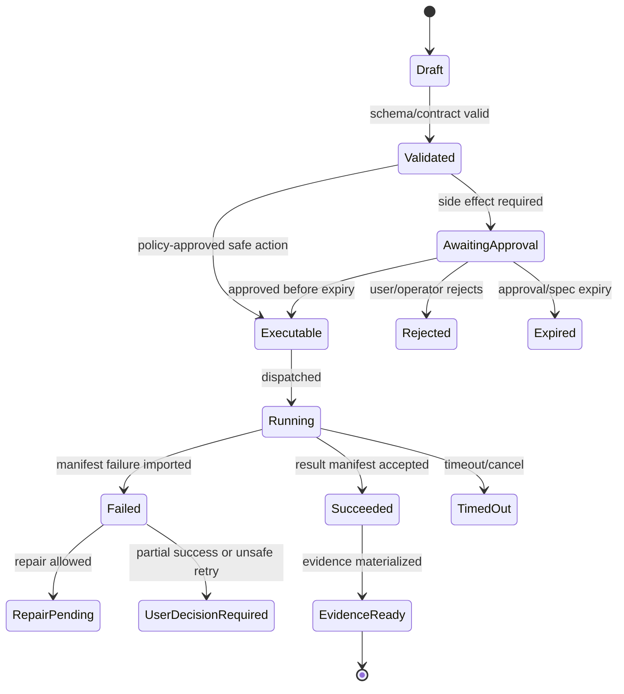

# Supply Chain, Deployment, and IaC

## V6.17 two release pipelines

`web_managed` releases build/sign container images and web/API artifacts, deploy Azure IaC, migrate cloud stores, and canary fixed job templates. `windows_local` releases build reproducible Rust/React binaries, verify WebView2 compatibility, sign MSI/NSIS and updater artifacts, publish SBOM/provenance, test clean install/update/rollback, and stage enterprise rings.

Desktop installation requires no Docker, Kubernetes, self-hosted service, local model, GPU, or administrator rights for ordinary use. Cloud IaC for desktop provisions only the support plane in [[98 - Azure Support Plane for Windows Desktop]]. A desktop update cannot migrate/erase local evidence without a tested forward/recovery path.

## 1. Mission

Deploy the internal Azure application with reproducible infrastructure, digest-pinned worker images, SBOM/provenance, environment separation, and operational safety.

## 2. Responsibilities

- Define Bicep infrastructure.
- Deploy App Service/React or static web + API as chosen by ADR.
- Deploy Runtime API to ACA.
- Deploy ACA Jobs and worker images.
- Use ACR with digest-pinned images.
- Use Key Vault and managed identities.
- Generate SBOM/provenance for worker images and packages.
- Configure Azure Monitor/App Insights/Log Analytics.

## 3. Explicit Non-Responsibilities

- Do not bypass Airlock.
- Do not mutate authoritative state outside the Runtime API state transition path.
- Do not hide policy decisions inside UI-only code.
- Do not let model text become executable behavior without typed validation.
- Do not introduce a separate runtime semantics path unless an ADR approves it.

## 4. Interfaces and Ports

| Interface | Purpose |
|---|---|
| IIaCModule | Bicep modules for Azure resources. |
| IImageBuildPipeline | Build/sign/push worker images. |
| IProvenanceWriter | SBOM/provenance artifacts. |
| IEnvironmentConfig | dev/test/prod settings. |
| IDeploymentGate | Policy checks before deploy. |

## 5. State and Lifecycle

Deployment lifecycle: `planned`, `validated`, `built`, `scanned`, `signed`, `deployed`, `smoke_tested`, `promoted`, `rolled_back`.

## 6. Data Contracts

Azure resources:

- Resource group(s);
- Container Apps environment with workload profiles baseline;
- Runtime API container app;
- ACA Jobs for workers;
- Azure SQL Database;
- Storage account/Blob containers;
- Key Vault with RBAC;
- ACR;
- App Service or web hosting;
- Application Insights/Log Analytics;
- optional SignalR;
- private endpoints/controlled egress where justified.

## 7. Primary Flow

```text
PR merge
→ build UI/API/workers
→ run tests
→ generate SBOM/provenance
→ push images by digest
→ deploy infra/app
→ smoke test vertical slice
→ record release evidence
```

## 8. Implementation Steps

- Create Bicep module skeleton.
- Create dev environment deployment.
- Build worker images with pinned dependencies.
- Generate SBOMs.
- Store image digest allowlist.
- Configure managed identities.
- Configure monitoring.
- Add deployment smoke tests.

## 9. Failure Modes and Mitigations

| Failure | Mitigation |
|---|---|
| Tag drift | Use image digest in Airlock policy and job templates. |
| Secret in pipeline | Use managed identity/federated credentials. |
| Infra snowflake | All resources in Bicep. |
| No rollback | Keep previous image digest and deployment params. |
| Provenance missing | Build pipeline uploads provenance artifacts. |

## 10. Acceptance Criteria

- Dev environment deploys from clean checkout.
- Worker images are referenced by digest.
- Key Vault access uses managed identity/RBAC.
- SBOM/provenance produced for worker images.
- Smoke test runs after deploy.

---

## v2 Review Improvements

### 1. Environment Plan

| Environment | Purpose | Constraints |
|---|---|---|
| local | direct toolchain contract/replay loop | deterministic fakes and temporary sealed fixtures only; no cloud secrets/data, Docker, Kubernetes, infrastructure emulators, or local model server. |
| dev | shared integration | cheaper SKU, test identities, sample projects. |
| staging | release validation | production-like policies, no broad debug access. |
| prod | internal use | locked policies, monitored budgets, retention. |

### 2. Azure Resource Baseline

| Resource | Purpose |
|---|---|
| App Service or static frontend host | web UI hosting. |
| Container Apps environment | Runtime API and jobs. |
| ACA Jobs | finite execution workers. |
| Azure SQL | lifecycle state. |
| Blob Storage | snapshots, logs, manifests, artifacts, evidence. |
| Key Vault | secrets/signing/material. |
| Container Registry | worker/API images. |
| Azure Monitor/App Insights/Log Analytics | telemetry. |
| Entra ID app registrations/groups | auth/RBAC. |

### 3. Build Pipeline

```text
checkout
→ restore dependencies from lockfiles
→ lint/test/build web
→ dotnet test runtime API
→ pytest workers
→ validate OpenAPI/JSON Schema
→ submit remote ACR Tasks/hosted-CI image builds
→ generate SBOM
→ sign/provenance attest images
→ publish to ACR
→ deploy Bicep to dev/staging
→ run e2e smoke fixture
```

### 4. Supply Chain Controls

- Lockfiles required for TypeScript and Python.
- Worker images are digest-pinned in policy.
- SBOM generated for API and worker images.
- Provenance attached to release artifacts.
- Base images pinned and scanned.
- No unreviewed image digest can execute jobs.
- Module packages get file inventory hashes and validation evidence.
- Package installs evaluate a `PackageInstallPolicy` before package registration, dependency restore, or migration.
- Lockfile drift, unpinned packages, and unexpected native/build steps block release until reviewed.
- Published package artifacts include a reviewed dependency graph equivalent to shrinkwrap/lockfile evidence.
- Package-local dependencies are reviewed separately from the root application dependency graph.
- Dependency age/provenance checks are documented where the package manager supports them.

OpenClaw's release model also treats plugin/package dependency files as security-sensitive artifacts. Sapphirus should apply the same review posture to `pnpm-lock.yaml`, Python/uv lockfiles, NuGet lock/restore files, container base image digests, package bundles, and generated Builder package dependency manifests.

### 5. IaC Module Breakdown

```text
infra/bicep/
  main.bicep
  modules/
    app-service.bicep
    container-apps-env.bicep
    container-app-job.bicep
    sql.bicep
    storage.bicep
    key-vault.bicep
    acr.bicep
    monitor.bicep
    identity-rbac.bicep
```

### 6. Deployment Release Gate

- Staging deploy is reproducible from clean checkout.
- Worker image digest in Airlock policy matches deployed image.
- Managed identities have least-privilege storage access.
- OpenAPI version in frontend matches API deployment.
- E2E vertical slice passes in staging.
- Evidence bundle includes build/version metadata.


---


---

## Implementation-depth contract

This file is part of the V6 implementation library. It is written as an implementation guide, not as a strategy memo. Every component must be built against the same system-wide constraints:

1. **The first executable slice comes before breadth.** The first demonstrable product must prove authenticated chat, workspace context, typed plan output, proposal creation, Airlock validation, approval, isolated execution, validation, checkpoint, and evidence.
2. **The delivery-specific authority owns lifecycle state.** The web Runtime API imports remote-worker facts into SQL; the signed desktop Rust host imports local-executor facts into SQLite. Workers, child processes, renderers, models, sync services, and support APIs do not advance authoritative lifecycle state.
3. **Airlock creates the only side-effect token.** Workspace writes, command runs, exports, package imports, dependency restores, and policy-sensitive actions require an `ApprovedExecutionSpec` issued by Airlock.
4. **The model does not own proposals.** Model Gateway returns typed model outputs. Run Orchestrator creates normalized `Proposal` records. Airlock validates proposals.
5. **No raw shell by default.** Commands are represented as `argv[]` plus policy metadata; `sh -c`, shell expansion, broad environment access, and open network access are blocked unless explicitly operator-approved.
6. **Every side effect is reconstructable.** Diffs, preimages, spec hashes, policy hashes, approvals, job image digests, result manifests, logs, artifacts, and rollback metadata must be traceable.
7. **Each module has ports.** Even inside a modular monolith, use explicit interfaces and contracts to avoid creating a god control plane.


## 1. Component identity

| Field | Value |
|---|---|
| Component | `Supply Chain, Deployment, and IaC` |
| Area | `Delivery platform` |
| Primary implementation package | `infra/bicep + .github/workflows + deployment scripts` |
| Runtime/technology | `Azure Bicep + ACR + CI/CD` |
| First-slice priority | `after-core or supporting` |


## 2. Purpose

Provision Azure infrastructure, build signed/verifiable worker images, deploy environments, maintain SBOM/provenance, and control release promotion.

The implementation must be narrow enough to fit the corrected first vertical slice, but designed so BMAD package execution, the existing presentation adapter, Builder Studio, SkillOps, replay, and operator controls can plug into the same contracts later.


## 3. Owns / does not own

### Owns
- Bicep modules
- Environment config
- Container image build
- ACR publishing
- SBOM generation
- Provenance attestations
- Release gates
- Deployment runbooks

### Does not own
- Runtime business logic
- Manual portal-only resources
- Unsigned execution images in production


## 4. Public/API surface and internal ports

### Required API/routes or callable operations
- `Deployment scripts call Azure APIs; runtime exposes GET /api/operator/worker-images`


### Internal contract rules

- Every boundary uses typed, schema-versioned values. C# uses `Runtime.Contracts` / `Runtime.Domain`, Rust uses generated contract types plus `desktop-domain`, and TypeScript uses generated web or desktop facade types; no generated DTO grants runtime authority.
- External payloads must be schema-versioned. Internal objects may evolve faster but must not leak into OpenAPI without a contract version.
- Every state mutation must be idempotent or protected by optimistic concurrency.
- Every side-effect operation must receive an `ApprovedExecutionSpec` or be provably read-only.
- Every error response must use the standard error envelope with `code`, `message`, `correlationId`, `retryable`, and optional `detailsRef`.


### Starter interface/type sketch

```python
@dataclass(frozen=True)
class WorkerInvocation:
    job_id: str
    approved_spec_path: Path
    checkout_path: Path
    output_dir: Path
    log_dir: Path
```


## 5. State model

### Component states
- `build_started`
- `image_built`
- `sbom_generated`
- `provenance_generated`
- `signed`
- `scanned`
- `deployed_dev`
- `deployed_stage`
- `deployed_prod`


### Generic side-effect lifecycle





## 6. Persistence responsibilities

### SQL tables or domain records touched
- `DeploymentRelease`
- `ExecutorImage`
- `SupplyChainAttestation`
- `EnvironmentConfig`
- `IaCDeployment`

### Blob/object storage paths touched
- `releases/{version}/sbom.json`
- `releases/{version}/provenance.intoto.jsonl`
- `iac/plans/{deploymentId}.json`


### Persistence rules

- In `web_managed`, SQL stores lifecycle state, compact indexes, ownership metadata, and references. In `windows_local`, SQLite stores the corresponding local authority records.
- In `web_managed`, Blob stores large immutable payloads: snapshots, logs, diffs, manifests, artifacts, exports, packages, traces, and validation reports. In `windows_local`, encrypted local content-addressed storage holds authority-owned payloads; cloud upload is explicit and purpose-scoped.
- Any Blob payload referenced from SQL must include content hash, schema version, created timestamp, and retention class.
- No raw secrets, broad credentials, or unredacted prompt/context payloads are stored by default.
- Migrations must be forward-safe and testable against fixture data.


## 7. Detailed implementation steps


### Phase 0 — Contract and spike

1. Create or update the relevant ADR before implementation when the decision affects hosting, policy, security, data ownership, or external dependencies.

2. Define public DTOs and durable JSON schemas first. Do not let implementation classes silently become external contracts.

3. Create a minimal fixture that exercises the component without requiring the whole platform.

4. Add negative tests for the most dangerous bypass or failure case before adding the happy path.

5. Record assumptions in the component file and in the ADR index if they are not final.

6. For `Supply Chain, Deployment, and IaC`, implement only the smallest behavior that proves its contract in the first executable slice, then add extended BMAD/Builder/artifact behavior after gate approval.


### Phase 1 — Skeleton implementation

1. Create the package/module/folder with explicit ports/interfaces and dependency direction rules.

2. Add dependency injection registration with narrow interfaces rather than passing broad services everywhere.

3. Implement persistence only through repository/store abstractions that expose business operations, not raw table access.

4. Emit structured events for every important state transition even if the UI does not yet render them.

5. Add unit tests for object creation, invalid input, authorization/policy denial, and idempotency where relevant.

6. For `Supply Chain, Deployment, and IaC`, implement only the smallest behavior that proves its contract in the first executable slice, then add extended BMAD/Builder/artifact behavior after gate approval.


### Phase 2 — First vertical integration

1. Connect the component to the first executable slice only. Avoid adding full future scope before the vertical path works.

2. Use fake/stub adapters for expensive external systems until the contract is proven.

3. Make all side effects flow through Proposal → AirlockDecision → Approval/Grant → ApprovedExecutionSpec → Dispatch.

4. Persist large payloads to Blob and store only compact references in SQL.

5. Return UI-consumable run events so the Chat Workbench can render progress without polling raw tables.

6. For `Supply Chain, Deployment, and IaC`, implement only the smallest behavior that proves its contract in the first executable slice, then add extended BMAD/Builder/artifact behavior after gate approval.


### Phase 3 — Production hardening

1. Add telemetry attributes, correlation IDs, redaction, and audit events.

2. Add retry, timeout, cancellation, and stale-state handling.

3. Add migration scripts and seed data for dev/test.

4. Add operator visibility for status, errors, budget/policy impact, and cleanup status.

5. Document runbooks for the top failure modes.

6. For `Supply Chain, Deployment, and IaC`, implement only the smallest behavior that proves its contract in the first executable slice, then add extended BMAD/Builder/artifact behavior after gate approval.


### Phase 4 — Regression and release gate

1. Add contract tests against OpenAPI/JSON Schema.

2. Add replay fixtures or golden outputs where deterministic behavior is expected.

3. Add security tests for prompt injection, secret leakage, excessive agency, insecure output handling, and supply-chain drift where relevant.

4. Update release gate evidence with screenshots/log excerpts/manifests rather than informal claims.

5. Mark open risks and deferred v1.5/v2 items explicitly.

6. For `Supply Chain, Deployment, and IaC`, implement only the smallest behavior that proves its contract in the first executable slice, then add extended BMAD/Builder/artifact behavior after gate approval.


## 8. Validation and test plan

### Required tests
- Bicep what-if clean
- image digest pinned
- unsigned image rejected by policy
- SBOM exists for worker image
- rollback deployment documented


### Minimum test layers

| Layer | What to test | Required before merge |
|---|---|---|
| Unit | object validation, state transitions, parsing, policy predicates | yes |
| Contract | OpenAPI/JSON Schema compatibility, generated clients, worker manifests | yes for public/durable payloads |
| Integration | SQL + Blob references, dispatch/import, authz, Airlock boundary | yes for side-effect paths |
| E2E | chat → proposal → approval → execution → evidence | yes for first slice files |
| Replay/golden | BMAD package fixtures, presentation adapter, evidence bundle | yes before v1 beta |
| Security negative | prompt injection, secret leak, policy bypass, path traversal, raw shell | yes for all side-effect components |


## 9. Failure modes and recovery

| Failure | Detection | Required behavior | User/operator visibility |
|---|---|---|---|
| Invalid schema | contract validation | reject before persistence or dispatch | show actionable error with correlation ID |
| Stale proposal/preimage | hash mismatch | void proposal or require rebase/new proposal | show stale context warning |
| Approval expired | expiry check | reject dispatch | show re-approve option |
| Policy mismatch | policy hash mismatch | reject spec | operator audit event |
| Worker timeout | job monitor | mark job timed out; preserve partial logs | timeline event + retry option if safe |
| Manifest missing/invalid | manifest import validation | do not advance success state | incident/failure card |
| Partial success | checkpoint/validation state | enter `user_decision_required` or `kept_for_repair` | explicit decision card |
| Secret detected | scanner/redactor | redact and block if high confidence | security finding card/operator event |


## 10. Security and policy requirements

- Treat workspace files, package files, generated artifacts, model outputs, and logs as untrusted input.
- Never let untrusted content override system instructions, Airlock policy, command allowlists, network policy, or secret handling.
- Enforce project-level authorization on every read and write.
- Log security-relevant denials as audit events, but do not include raw secret values.
- Prefer fail-closed behavior when policy, identity, schema, or storage checks are ambiguous.
- Add negative tests for the most likely bypass path before writing happy-path code.


## 11. Observability

Minimum telemetry fields for this component:

- `correlation.id`
- `project.id`
- `run.id` when available
- `component.name`
- `operation.name`
- `operation.outcome`
- `policy.version` when applicable
- `spec.id` when applicable
- `job.id` when applicable
- `artifact.id` when applicable
- redaction counters, not raw secrets

Metrics to consider: request latency, state-transition count, policy denials, approval wait time, job duration, manifest import failures, schema validation failures, retry count, budget blocks, and evidence materialization time.


## 12. Acceptance criteria

- [ ] The component has a clear owner package and does not leak responsibilities into unrelated modules.
- [ ] Public routes/payloads are represented in OpenAPI/JSON Schema where applicable.
- [ ] Side-effect paths cannot execute without Airlock evaluation and `ApprovedExecutionSpec`.
- [ ] SQL lifecycle state is mutated only by the Runtime API/Application layer.
- [ ] Blob payloads have content hashes and schema versions.
- [ ] Tests include at least one negative/bypass case.
- [ ] Events and evidence are emitted for user-visible actions.
- [ ] The component is represented in the release gate matrix.
- [ ] The implementation does not introduce Cortex as a runtime namespace.
- [ ] Documentation includes deferred v1.5/v2 scope explicitly rather than silently omitting it.


## 13. Integration checklist

- [ ] Update `32 - Integration Contract Map.md` with any new caller/callee relationship.
- [ ] Update `25 - OpenAPI, Schemas, and Generated Clients.md` for public route or schema changes.
- [ ] Update `22 - Data Model - SQL and Blob.md`, `47 - Database DDL Starter.md`, or `48 - Blob Storage Layout.md` for persistence changes.
- [ ] Update `27 - Testing, Validation, and Replay.md` for new fixtures or replay needs.
- [ ] Update `33 - Release Gates and Acceptance Matrix.md` if the change affects release readiness.
- [ ] Add or update ADR in `31 - Architecture Decision Records.md` if the change alters architecture, hosting, policy, or security posture.


---

## Historical Revision Notes (V3 -> V4 Hardening Pass)
### V4 audit finding applied to this file
The v3 library was detailed, but several files still behaved like expanded planning notes rather than implementation handbooks. This pass adds enforceable implementation details: exact build sequence, explicit boundaries, input/output contracts, database/blob ownership, event names, failure states, tests, and release gates.

## System invariants this component must obey

1. The first delivered slice remains: **authenticated chat → workspace context → implementation plan → proposal → Airlock → approval → isolated job → validation → checkpoint → evidence**.
2. No worker image receives Azure SQL write credentials. Workers produce signed/hashed append-only manifests in Blob; the Runtime API imports them and advances SQL lifecycle state.
3. No file write, command run, dependency restore, package import, artifact export, checkpoint mutation, or rollback can execute without an `ApprovedExecutionSpec` minted by Airlock.
4. The Model Gateway returns typed model outputs only. The Run Orchestrator creates platform `Proposal` records. Airlock validates proposals and creates approved specs.
5. Commands are `argv[]` specs, not raw shell strings. Shell execution is a separate high-risk command class.
6. Every state transition emits a run event and trace event with correlation ID, actor/service principal, schema version, and payload hash or payload reference.
7. Every persisted object carries schema version, retention class, project scope, created/updated timestamps, and hash/provenance where relevant.
8. Any component that reads workspace content treats it as untrusted user-controlled input and cannot allow it to override system policy, command allowlists, approval requirements, or secrets handling.


## Component build card

| Field | Value |
|---|---|
| Component | `Supply Chain, Deployment, IaC` |
| Primary package/path | `infra/bicep + .github/workflows` |
| Current implementation status | `v6-validated` |
| Required for first vertical slice | `after-first-slice or v1 extension` |

## Validated API/port touchpoints

- `N/A - deployment pipelines and infra modules`

## Validated domain events to implement or consume

- `build.started`
- `sbom.generated`
- `provenance.generated`
- `image.signed`
- `deployment.completed`
- `deployment.rollback.started`

## Validated SQL ownership / indexes

- `deployment_records`
- `worker_images`
- `release_artifacts`
- `supply_chain_attestations`

Implementation notes:

- Tables listed here are owned by their module or exposed through its port; other modules must not perform direct ad-hoc writes.
- Mutable lifecycle tables need optimistic concurrency tokens.
- All records need `project_id`, `schema_version`, `created_at`, `updated_at`, and retention classification where applicable.

## Validated Blob payload layout

- `releases/{version}/sbom/*`
- `releases/{version}/provenance/*`
- `releases/{version}/iac-whatif/*`

Implementation notes:

- Blob payloads are content-addressed or hash-checked before import.
- SQL stores compact payload references, not bulky logs/prompts/artifacts.
- Retention class and redaction level must be explicit for every payload family.

## Validated step-by-step build procedure

1. Bicep modules define App Service/web, ACA environment, Runtime API, fixed ACA Jobs, SQL, Blob, Key Vault, ACR, Monitor, Log Analytics, and the selected SSE resources early, before real model/job consumers.
2. ACR Tasks (`az acr build`) or hosted CI—not a local Docker daemon—builds images from immutable source/lockfiles and generates license, vulnerability, SBOM, provenance/attestation, signature, and digest evidence.
3. Pin worker image digests in policy; latest tags are not allowed for production execution.
4. Use environment-specific parameter files with explicit secrets references, not embedded secrets.
5. Run IaC what-if and policy checks before deployment.
6. Add rollback runbook for runtime API, web, worker image, policy version, and database migration.

## Validated edge cases that must be tested

| Edge case | Expected behavior |
|---|---|
| Duplicate API request with same idempotency key | Returns original result; no duplicate state transition or worker dispatch. |
| Stale proposal after newer checkpoint | Proposal is voided or requires rebase; approval is blocked. |
| Expired approval/spec | Side-effect endpoint rejects request; UI asks for refresh. |
| Unknown schema version | Import/read path rejects or routes to migration handler. |
| Blob payload hash mismatch | Runtime refuses import and creates security/audit finding. |
| User lacks project role | API returns access denied; no object existence leakage. |
| Workspace contains prompt injection in docs/code | Treated as untrusted content; cannot change system policy or tool permissions. |
| Worker crashes after writing partial logs | Execution becomes failed/unknown with partial log refs; retry uses same spec rules. |

## Validated release gate for this component

- Unit tests cover all domain transitions owned by this component.
- Contract tests cover all listed API touchpoints or port methods.
- Integration tests prove SQL/Blob responsibility boundaries.
- Security tests cover unauthorized access and malformed payloads.
- Replay fixture includes at least one success path and one failure path relevant to this component.
- Observability emits trace/span/log attributes with the shared correlation ID.
- Documentation examples compile or validate against JSON Schema/OpenAPI where relevant.

---

## V6 verified supply-chain note

- Treat SBOM, provenance, signatures, digest pinning, image scanning, and deployment gates as complementary controls.
- SLSA provenance should be described as provenance for where/how artifacts were produced; do not cite retired SLSA versions as current.
- CycloneDX is valid for BOM inventory; it does not by itself prove build integrity.

## Hermes-Informed Dependency Policy

Source: [[86 - Hermes Source Code Review - Agent Runtime and Learning Loop]].

Runtime core dependencies must be exact-pinned and represented in an authoritative lockfile. Provider-specific, connector-specific, and optional package dependencies must stay outside the core path unless an ADR proves they are required for every deployment.

Required CI gates:

- dependency manifest and lockfile are in sync;
- SBOM is generated from the lockfile, not hand-curated metadata;
- security-motivated pins and overrides include rationale and review date;
- optional provider dependencies are lazy-loaded or isolated from the default runtime image;
- package imports cannot install unpinned transitive dependencies during active runs;
- dependency changes require Airlock-style review when proposed by Builder or SkillOps.

## Consolidated Source-Review Supply Chain and IaC Gates

Source: [[89 - Consolidated AI Workspace Source Review and Architecture Improvements]].

Add these gates to CI/CD and infrastructure review:

| Gate | Required evidence |
|---|---|
| Worker image gate | Remote build identity/source/definition, component licenses, digest pin, SBOM, provenance/attestation, signature, vulnerability scan, base image patch date, and fixed-entrypoint command DSL smoke; no local daemon dependency. |
| Package activation gate | Manifest parse, trust classification, scanner verdict, dependency lock validation, install rehearsal, invocation rehearsal, and capability snapshot. |
| TypeScript 7 gate | Generated client compile, `tsc --build`, bundler/dev-server smoke, declaration diff review, and editor/LSP config note. |
| IaC what-if gate | Bicep build, what-if output, policy check, identity assignment review, egress/private endpoint review, and rollback note. |
| AVM gate | If an Azure Verified Module is used, record module version, exposed parameters, hidden defaults, and any policy/security gaps patched outside the module. |
| Optional dependency gate | Provider/connector dependencies stay lazy or isolated; no optional package may mutate the core image or lockfile during a run. |
| Fixed ACA template gate | Runtime callers cannot override image, entrypoint, identity, secret, network profile, or arbitrary environment; dispatcher may start but not mutate the allowlisted template. |
| No-container DevEx gate | A clean Windows developer machine runs local contract/replay tests, submits the remote build, deploys IaC, and observes ACA result import without Docker/Kubernetes/emulators/local model serving. |
