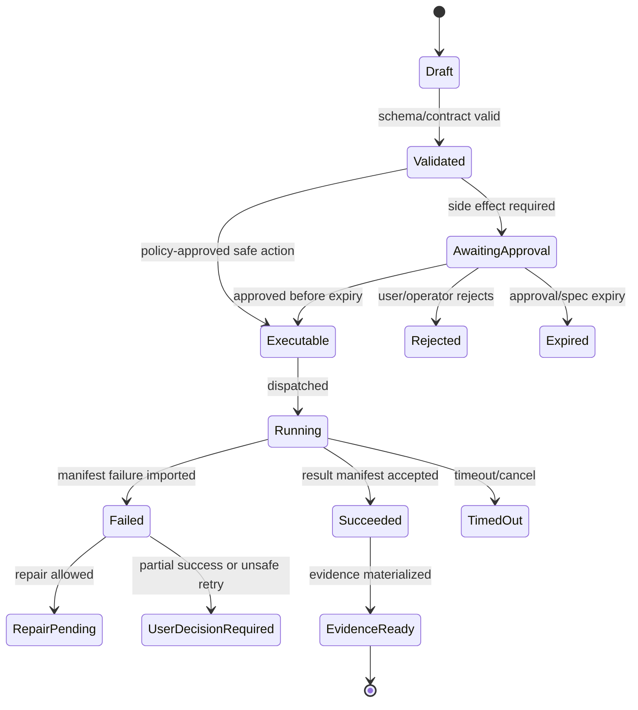

# Concurrency, Transactions, and Failures

## V6.17 authority-specific consistency

Web invariants use SQL transactions, optimistic versions, outbox, Blob hash verification, leases, and idempotent manifest import. Desktop invariants use one local writer, SQLite transactions/WAL, app-instance and workspace locks, selected-root identity checks, file preimage hashes, a durable operation journal, encrypted payload fsync/rename ordering, and startup recovery.

Neither product claims a distributed transaction across its metadata and filesystem/object store. Desktop multi-file apply is a journaled crash-recoverable batch with per-file atomic replacement where supported. External editor changes invalidate stale candidates. Sync conflicts never use last-write-wins for approvals, specs, executions, evidence events, checkpoints, or policy decisions.

## 1. Purpose

This file closes the most dangerous gaps identified in the critical review: multi-run edits, partial success, state ownership, retries, stale context, repair loops, and failure classification.

## 2. Concurrency Policy

| Policy | v1 Rule |
|---|---|
| Readers | Multiple read-only context/build/ask runs can execute concurrently. |
| Writers | One writer per workspace checkpoint chain. |
| Proposal validity | A proposal is valid only against the snapshot/checkpoint/context IDs it references. |
| New checkpoint | Newer checkpoint voids older unapplied proposals unless explicitly rebased. |
| Branching | v1 can represent branches internally but should not build full merge UI. |
| Rebase | Deferred. Stale proposal requires regeneration. |

## 3. Write Transaction Shape

```text
approval received
→ reload proposal
→ verify approval actor/scope
→ verify policy hash/currentness
→ verify spec not expired
→ acquire workspace write lock
→ verify preimages
→ create checkout
→ dispatch execution
→ release lock after API imports manifest and checkpoint decision is recorded
```

The worker must not decide authoritative transaction success. It reports what happened. The Runtime API decides state transition after validating manifest and expected spec hash.

## 4. Partial Success States

| State | Meaning | User Choice |
|---|---|---|
| `patch_apply_failed_no_changes` | Patch failed before any file changed. | Revise patch. |
| `patch_applied_validation_pending` | Patch applied; validation not run yet. | Run validation / rollback / keep. |
| `patch_applied_validation_failed` | Patch applied; validation failed. | Repair / rollback / keep as failed checkpoint. |
| `patch_applied_validation_passed` | Patch applied and validation passed. | Finalize / continue. |
| `partial_artifact_export_failed` | Some artifact outputs failed. | Retry export / keep successful outputs / discard. |
| `rollback_failed` | Rollback attempted but not completed. | Escalate operator; preserve evidence. |

## 5. Failure Taxonomy

| Class | Example | Repair Behavior |
|---|---|---|
| `test_failure` | Unit test assertion fails. | Model may analyze logs and propose repair. |
| `flake_suspected` | Same test passes on rerun or known flaky pattern. | One policy-bound rerun; then escalate. |
| `infra_failure` | ACA job provisioning fails. | Retry infra; no code repair. |
| `dependency_restore_failure` | `pnpm install` fails or network blocked. | Ask for dependency/network approval. |
| `policy_block` | Command/path denied. | Explain; no repair. |
| `patch_generation_error` | Patch cannot apply. | Ask model for revised patch. |
| `timeout` | Command exceeds limit. | Narrow command or request limit increase. |
| `output_limit_exceeded` | Logs too large. | Summarize chunks and rerun targeted command. |
| `schema_failure` | Model output invalid. | Retry once with schema errors; then fail. |
| `secret_detected` | Secret in output/context. | Redact and block model exposure. |

## 6. Idempotency

Every mutation endpoint must accept an idempotency key. Duplicate approval/dispatch/import requests must not duplicate jobs or transitions.

```json
{
  "idempotency_key": "run_123:proposal_456:approval_789:dispatch",
  "expected_state": "approved",
  "operation": "dispatch_execution"
}
```

## 7. Retry Rules

| Operation | Retry Rule |
|---|---|
| Model call schema failure | Retry once with validation error summary. |
| Provider timeout | Retry according to gateway policy if budget remains. |
| ACA job dispatch failure | Retry idempotently if no job started. |
| Worker manifest upload failure | Worker retries upload; API marks import timeout if absent. |
| Manifest import | API import is idempotent by execution/spec hash. |
| Validation command | Rerun only with user approval or scoped grant. |

## 8. Release Gate Acceptance Criteria

- Two simultaneous write attempts cannot corrupt checkpoint chain.
- A stale proposal is voided after newer checkpoint.
- Validation failure after patch apply enters explicit partial-success state.
- API can safely retry manifest import.
- Failed rollback preserves forensic evidence.
- Repair loop stops at configured cap and explains why.

---

## v2 Review Improvements

### 1. Workspace Concurrency Model

```text
multiple readers allowed
single writer lock required for checkpoint-changing operation
new checkpoint voids stale proposals based on older checkpoint
rollback is a write operation and requires lock + approval
```

### 2. Proposal Freshness States

| State | Meaning |
|---|---|
| `fresh` | base checkpoint and preimages still valid. |
| `stale_context` | context changed but targeted preimages still valid. |
| `stale_preimage` | targeted file hash changed. |
| `voided_by_checkpoint` | newer checkpoint invalidates proposal. |
| `requires_regeneration` | cannot safely apply without new model/context pass. |

### 3. Partial Success States

| State | Meaning | User Options |
|---|---|---|
| `patch_applied_validation_not_run` | patch applied, validation not attempted. | run validation, rollback, continue. |
| `patch_applied_validation_failed` | patch applied, validation failed. | repair, keep, rollback. |
| `patch_applied_output_truncated` | command output capped. | inspect full logs, rerun narrower command. |
| `artifact_export_failed` | source changes may exist, export failed. | retry export, repair, rollback artifact files. |
| `infra_failed_no_workspace_change` | job infra failed before mutation. | retry or escalate. |
| `unknown_worker_result` | manifest missing/invalid. | quarantine checkout, operator review. |

### 4. Retry Rules

| Failure | Retry? | Notes |
|---|---|---|
| model timeout | yes | idempotent retry with same context. |
| model schema invalid | one retry | include validation errors. |
| policy denial | no | requires proposal/policy change. |
| ACA job start failure | yes | bounded retries. |
| command nonzero | no automatic retry | repair/classify first. |
| flaky test suspected | controlled rerun | must label as flake suspicion. |
| manifest import conflict | yes | idempotency key required. |

### 5. Idempotent Manifest Import

The Runtime API imports worker manifests with:

```text
execution_id + manifest_hash + spec_hash
```

Duplicate imports return the original result. Conflicting manifests for the same execution are quarantined.

### 6. Recovery UX Rules

- Never hide a partial-success state behind a generic failure toast.
- Show whether workspace changed.
- Show whether rollback is available.
- Show whether validation failed due to code, environment, dependency, timeout, or policy.
- Show next safe actions.


---


---

## Implementation-depth contract

This file is part of the V6 implementation library. It is written as an implementation guide, not as a strategy memo. Every component must be built against the same system-wide constraints:

1. **The first executable slice comes before breadth.** The first demonstrable product must prove authenticated chat, workspace context, typed plan output, proposal creation, Airlock validation, approval, isolated execution, validation, checkpoint, and evidence.
2. **The delivery-specific authority owns lifecycle state.** The web Runtime API imports remote-worker facts into SQL; the signed desktop Rust host imports local-executor facts into SQLite. Workers, child processes, renderers, models, sync services, and support APIs do not advance authoritative lifecycle state.
3. **Airlock creates the only side-effect token.** Workspace writes, command runs, exports, package imports, dependency restores, and policy-sensitive actions require an `ApprovedExecutionSpec` issued by Airlock.
4. **The model does not own proposals.** Model Gateway returns typed model outputs. Run Orchestrator creates normalized `Proposal` records. Airlock validates proposals.
5. **No raw shell by default.** Commands are represented as `argv[]` plus policy metadata; `sh -c`, shell expansion, broad environment access, and open network access are blocked unless explicitly operator-approved.
6. **Every side effect is reconstructable.** Diffs, preimages, spec hashes, policy hashes, approvals, job image digests, result manifests, logs, artifacts, and rollback metadata must be traceable.
7. **Each module has ports.** Even inside a modular monolith, use explicit interfaces and contracts to avoid creating a god control plane.


## 1. Component identity

| Field | Value |
|---|---|
| Component | `Concurrency, Transactions, and Failures` |
| Area | `Reliability semantics` |
| Primary implementation package | `src/Runtime.Domain/StateMachines + Runtime.Application/Transactions` |
| Runtime/technology | `C# state machines and transaction services` |
| First-slice priority | `core` |


## 2. Purpose

Define single-writer/multi-reader behavior, stale proposals, partial success, idempotency, retries, repair-loop categories, and transactional boundaries.

The implementation must be narrow enough to fit the corrected first vertical slice, but designed so BMAD package execution, the existing presentation adapter, Builder Studio, SkillOps, replay, and operator controls can plug into the same contracts later.


## 3. Owns / does not own

### Owns
- Run state machines
- Proposal state machine
- Execution job state machine
- Partial failure states
- Concurrency policy
- Idempotency rules
- Retry/backoff rules
- Failure taxonomy

### Does not own
- UI display details
- Worker implementation internals
- Model-generated repair content


## 4. Public/API surface and internal ports

### Required API/routes or callable operations
- `POST /api/runs/{id}/cancel`
- `POST /api/runs/{id}/resume`
- `POST /api/proposals/{id}/void`
- `POST /api/jobs/{id}/retry`
- `POST /api/checkpoints/{id}/decision`


### Internal contract rules

- Every boundary uses typed, schema-versioned values. C# uses `Runtime.Contracts` / `Runtime.Domain`, Rust uses generated contract types plus `desktop-domain`, and TypeScript uses generated web or desktop facade types; no generated DTO grants runtime authority.
- External payloads must be schema-versioned. Internal objects may evolve faster but must not leak into OpenAPI without a contract version.
- Every state mutation must be idempotent or protected by optimistic concurrency.
- Every side-effect operation must receive an `ApprovedExecutionSpec` or be provably read-only.
- Every error response must use the standard error envelope with `code`, `message`, `correlationId`, `retryable`, and optional `detailsRef`.


### Starter interface/type sketch

```csharp
public interface IComponentPort<TRequest, TResult>
{
    Task<TResult> ExecuteAsync(TRequest request, CancellationToken ct);
}

public sealed record OperationContext(
    Guid ProjectId,
    Guid RunId,
    string ActorUserId,
    string CorrelationId,
    string PolicyVersion,
    DateTimeOffset RequestedAt);
```


## 5. State model

### Component states
- `single_writer_locked`
- `proposal_voided_by_checkpoint`
- `patch_applied_validation_failed`
- `kept_for_repair`
- `rolled_back`
- `user_decision_required`
- `retry_scheduled`
- `dead_lettered`


### Generic side-effect lifecycle





## 6. Persistence responsibilities

### SQL tables or domain records touched
- `StateTransition`
- `IdempotencyKey`
- `RunLock`
- `FailureRecord`
- `RetryRecord`
- `RepairAttempt`
- `DeadLetterItem`

### Blob/object storage paths touched
- `failures/{runId}/{failureId}.json`
- `deadletters/{itemId}.json`
- `transactions/{transactionId}/trace.json`


### Persistence rules

- In `web_managed`, SQL stores lifecycle state, compact indexes, ownership metadata, and references. In `windows_local`, SQLite stores the corresponding local authority records.
- In `web_managed`, Blob stores large immutable payloads: snapshots, logs, diffs, manifests, artifacts, exports, packages, traces, and validation reports. In `windows_local`, encrypted local content-addressed storage holds authority-owned payloads; cloud upload is explicit and purpose-scoped.
- Any Blob payload referenced from SQL must include content hash, schema version, created timestamp, and retention class.
- No raw secrets, broad credentials, or unredacted prompt/context payloads are stored by default.
- Migrations must be forward-safe and testable against fixture data.


## 7. Detailed implementation steps


### Phase 0 — Contract and spike

1. Create or update the relevant ADR before implementation when the decision affects hosting, policy, security, data ownership, or external dependencies.

2. Define public DTOs and durable JSON schemas first. Do not let implementation classes silently become external contracts.

3. Create a minimal fixture that exercises the component without requiring the whole platform.

4. Add negative tests for the most dangerous bypass or failure case before adding the happy path.

5. Record assumptions in the component file and in the ADR index if they are not final.

6. For `Concurrency, Transactions, and Failures`, implement only the smallest behavior that proves its contract in the first executable slice, then add extended BMAD/Builder/artifact behavior after gate approval.


### Phase 1 — Skeleton implementation

1. Create the package/module/folder with explicit ports/interfaces and dependency direction rules.

2. Add dependency injection registration with narrow interfaces rather than passing broad services everywhere.

3. Implement persistence only through repository/store abstractions that expose business operations, not raw table access.

4. Emit structured events for every important state transition even if the UI does not yet render them.

5. Add unit tests for object creation, invalid input, authorization/policy denial, and idempotency where relevant.

6. For `Concurrency, Transactions, and Failures`, implement only the smallest behavior that proves its contract in the first executable slice, then add extended BMAD/Builder/artifact behavior after gate approval.


### Phase 2 — First vertical integration

1. Connect the component to the first executable slice only. Avoid adding full future scope before the vertical path works.

2. Use fake/stub adapters for expensive external systems until the contract is proven.

3. Make all side effects flow through Proposal → AirlockDecision → Approval/Grant → ApprovedExecutionSpec → Dispatch.

4. Persist large payloads to Blob and store only compact references in SQL.

5. Return UI-consumable run events so the Chat Workbench can render progress without polling raw tables.

6. For `Concurrency, Transactions, and Failures`, implement only the smallest behavior that proves its contract in the first executable slice, then add extended BMAD/Builder/artifact behavior after gate approval.


### Phase 3 — Production hardening

1. Add telemetry attributes, correlation IDs, redaction, and audit events.

2. Add retry, timeout, cancellation, and stale-state handling.

3. Add migration scripts and seed data for dev/test.

4. Add operator visibility for status, errors, budget/policy impact, and cleanup status.

5. Document runbooks for the top failure modes.

6. For `Concurrency, Transactions, and Failures`, implement only the smallest behavior that proves its contract in the first executable slice, then add extended BMAD/Builder/artifact behavior after gate approval.


### Phase 4 — Regression and release gate

1. Add contract tests against OpenAPI/JSON Schema.

2. Add replay fixtures or golden outputs where deterministic behavior is expected.

3. Add security tests for prompt injection, secret leakage, excessive agency, insecure output handling, and supply-chain drift where relevant.

4. Update release gate evidence with screenshots/log excerpts/manifests rather than informal claims.

5. Mark open risks and deferred v1.5/v2 items explicitly.

6. For `Concurrency, Transactions, and Failures`, implement only the smallest behavior that proves its contract in the first executable slice, then add extended BMAD/Builder/artifact behavior after gate approval.


## 8. Validation and test plan

### Required tests
- two writers conflict deterministically
- stale approval rejected
- partial failure requires decision
- idempotent manifest import
- flaky test not auto-repaired as code bug


### Minimum test layers

| Layer | What to test | Required before merge |
|---|---|---|
| Unit | object validation, state transitions, parsing, policy predicates | yes |
| Contract | OpenAPI/JSON Schema compatibility, generated clients, worker manifests | yes for public/durable payloads |
| Integration | SQL + Blob references, dispatch/import, authz, Airlock boundary | yes for side-effect paths |
| E2E | chat → proposal → approval → execution → evidence | yes for first slice files |
| Replay/golden | BMAD package fixtures, presentation adapter, evidence bundle | yes before v1 beta |
| Security negative | prompt injection, secret leak, policy bypass, path traversal, raw shell | yes for all side-effect components |


## 9. Failure modes and recovery

| Failure | Detection | Required behavior | User/operator visibility |
|---|---|---|---|
| Invalid schema | contract validation | reject before persistence or dispatch | show actionable error with correlation ID |
| Stale proposal/preimage | hash mismatch | void proposal or require rebase/new proposal | show stale context warning |
| Approval expired | expiry check | reject dispatch | show re-approve option |
| Policy mismatch | policy hash mismatch | reject spec | operator audit event |
| Worker timeout | job monitor | mark job timed out; preserve partial logs | timeline event + retry option if safe |
| Manifest missing/invalid | manifest import validation | do not advance success state | incident/failure card |
| Partial success | checkpoint/validation state | enter `user_decision_required` or `kept_for_repair` | explicit decision card |
| Secret detected | scanner/redactor | redact and block if high confidence | security finding card/operator event |


## 10. Security and policy requirements

- Treat workspace files, package files, generated artifacts, model outputs, and logs as untrusted input.
- Never let untrusted content override system instructions, Airlock policy, command allowlists, network policy, or secret handling.
- Enforce project-level authorization on every read and write.
- Log security-relevant denials as audit events, but do not include raw secret values.
- Prefer fail-closed behavior when policy, identity, schema, or storage checks are ambiguous.
- Add negative tests for the most likely bypass path before writing happy-path code.


## 11. Observability

Minimum telemetry fields for this component:

- `correlation.id`
- `project.id`
- `run.id` when available
- `component.name`
- `operation.name`
- `operation.outcome`
- `policy.version` when applicable
- `spec.id` when applicable
- `job.id` when applicable
- `artifact.id` when applicable
- redaction counters, not raw secrets

Metrics to consider: request latency, state-transition count, policy denials, approval wait time, job duration, manifest import failures, schema validation failures, retry count, budget blocks, and evidence materialization time.


## 12. Acceptance criteria

- [ ] The component has a clear owner package and does not leak responsibilities into unrelated modules.
- [ ] Public routes/payloads are represented in OpenAPI/JSON Schema where applicable.
- [ ] Side-effect paths cannot execute without Airlock evaluation and `ApprovedExecutionSpec`.
- [ ] SQL lifecycle state is mutated only by the Runtime API/Application layer.
- [ ] Blob payloads have content hashes and schema versions.
- [ ] Tests include at least one negative/bypass case.
- [ ] Events and evidence are emitted for user-visible actions.
- [ ] The component is represented in the release gate matrix.
- [ ] The implementation does not introduce Cortex as a runtime namespace.
- [ ] Documentation includes deferred v1.5/v2 scope explicitly rather than silently omitting it.


## 13. Integration checklist

- [ ] Update `32 - Integration Contract Map.md` with any new caller/callee relationship.
- [ ] Update `25 - OpenAPI, Schemas, and Generated Clients.md` for public route or schema changes.
- [ ] Update `22 - Data Model - SQL and Blob.md`, `47 - Database DDL Starter.md`, or `48 - Blob Storage Layout.md` for persistence changes.
- [ ] Update `27 - Testing, Validation, and Replay.md` for new fixtures or replay needs.
- [ ] Update `33 - Release Gates and Acceptance Matrix.md` if the change affects release readiness.
- [ ] Add or update ADR in `31 - Architecture Decision Records.md` if the change alters architecture, hosting, policy, or security posture.


---

## Historical Revision Notes (V3 -> V4 Hardening Pass)
### V4 audit finding applied to this file
The v3 library was detailed, but several files still behaved like expanded planning notes rather than implementation handbooks. This pass adds enforceable implementation details: exact build sequence, explicit boundaries, input/output contracts, database/blob ownership, event names, failure states, tests, and release gates.

## System invariants this component must obey

1. The first delivered slice remains: **authenticated chat → workspace context → implementation plan → proposal → Airlock → approval → isolated job → validation → checkpoint → evidence**.
2. No worker image receives Azure SQL write credentials. Workers produce signed/hashed append-only manifests in Blob; the Runtime API imports them and advances SQL lifecycle state.
3. No file write, command run, dependency restore, package import, artifact export, checkpoint mutation, or rollback can execute without an `ApprovedExecutionSpec` minted by Airlock.
4. The Model Gateway returns typed model outputs only. The Run Orchestrator creates platform `Proposal` records. Airlock validates proposals and creates approved specs.
5. Commands are `argv[]` specs, not raw shell strings. Shell execution is a separate high-risk command class.
6. Every state transition emits a run event and trace event with correlation ID, actor/service principal, schema version, and payload hash or payload reference.
7. Every persisted object carries schema version, retention class, project scope, created/updated timestamps, and hash/provenance where relevant.
8. Any component that reads workspace content treats it as untrusted user-controlled input and cannot allow it to override system policy, command allowlists, approval requirements, or secrets handling.


## Component build card

| Field | Value |
|---|---|
| Component | `Concurrency, Transactions, Failures` |
| Primary package/path | `src/Runtime.Domain/StateMachines` |
| Current implementation status | `v6-validated` |
| Required for first vertical slice | `yes` |

## Validated API/port touchpoints

- `N/A - domain state-machine reference`

## Validated domain events to implement or consume

- `state.conflict.detected`
- `proposal.voided`
- `checkpoint.superseded`
- `validation.failed`
- `user.decision.required`
- `rollback.completed`

## Validated SQL ownership / indexes

- `runs`
- `proposals`
- `approvals`
- `executions`
- `workspace_locks`
- `checkpoints`
- `failure_classifications`

Implementation notes:

- Tables listed here are owned by their module or exposed through its port; other modules must not perform direct ad-hoc writes.
- Mutable lifecycle tables need optimistic concurrency tokens.
- All records need `project_id`, `schema_version`, `created_at`, `updated_at`, and retention classification where applicable.

## Validated Blob payload layout

- `failures/{runId}/{failureId}.json`
- `rollback/{checkpointId}/report.json`

Implementation notes:

- Blob payloads are content-addressed or hash-checked before import.
- SQL stores compact payload references, not bulky logs/prompts/artifacts.
- Retention class and redaction level must be explicit for every payload family.

## Validated step-by-step build procedure

1. Implement single-writer/multi-reader policy per workspace.
2. Void proposals when a newer checkpoint changes affected preimages.
3. Define partial success states: patch_applied_validation_failed, kept_for_repair, rolled_back, user_decision_required.
4. Classify failures before repair: test_failure, flake_suspected, infra_failure, dependency_restore_failure, policy_block, patch_generation_error, timeout, output_limit_exceeded.
5. Make retry decisions idempotent and budget-bounded.
6. Use transactions for state transition + run event append + outbox enqueue.

## Validated edge cases that must be tested

| Edge case | Expected behavior |
|---|---|
| Duplicate API request with same idempotency key | Returns original result; no duplicate state transition or worker dispatch. |
| Stale proposal after newer checkpoint | Proposal is voided or requires rebase; approval is blocked. |
| Expired approval/spec | Side-effect endpoint rejects request; UI asks for refresh. |
| Unknown schema version | Import/read path rejects or routes to migration handler. |
| Blob payload hash mismatch | Runtime refuses import and creates security/audit finding. |
| User lacks project role | API returns access denied; no object existence leakage. |
| Workspace contains prompt injection in docs/code | Treated as untrusted content; cannot change system policy or tool permissions. |
| Worker crashes after writing partial logs | Execution becomes failed/unknown with partial log refs; retry uses same spec rules. |

## Validated release gate for this component

- Unit tests cover all domain transitions owned by this component.
- Contract tests cover all listed API touchpoints or port methods.
- Integration tests prove SQL/Blob responsibility boundaries.
- Security tests cover unauthorized access and malformed payloads.
- Replay fixture includes at least one success path and one failure path relevant to this component.
- Observability emits trace/span/log attributes with the shared correlation ID.
- Documentation examples compile or validate against JSON Schema/OpenAPI where relevant.

## Hermes-Informed Concurrency Rules

Source: [[86 - Hermes Source Code Review - Agent Runtime and Learning Loop]].

Add these race-sensitive contracts:

| Area | Rule |
|---|---|
| Approval state | Store per run/session/turn/tool-call identity in context records; never share mutable process-global approval state. |
| Scheduled jobs | Use `AutomationFireClaim` with compare-and-swap semantics before dispatch. |
| Tool availability | Snapshot active tool definitions for a run; transient health failures may mark degraded state but cannot silently alter an in-flight schema. |
| Session lifecycle | Persist suspend, resume-pending, reset, expiry, and finalization state explicitly. |
| State database | Use short write timeouts, retry with jitter, and report fallback/degraded modes clearly. |
| Background writes | Stage proposals atomically with origin and replay payload; approval applies the staged payload exactly once. |

## Hermes Deep-Review Failure and Claim Rules

Source: [[87 - Hermes Deep Review - Extension Runtime and Operational Contracts]].

Add these concurrency contracts:

| Area | Rule |
|---|---|
| Task claiming | `TaskClaim` uses compare-and-swap state transitions with board/workspace isolation key, owner id, TTL, heartbeat, and reclaim reason. |
| Worker liveness | Reclaim considers both process liveness and heartbeat freshness; if a previous worker may still be alive, extend a short grace instead of spawning a duplicate. |
| Block reasons | Distinguish `dependency`, `needs_input`, `capability`, and `transient`; dependency blocks route through dependency gating, not human-blocked queues. |
| Recurring blockers | Repeated unblock/re-block for the same true blocker escalates to triage instead of creating retry loops. |
| Profile secrets | Concurrent profile workers carry `ProfileSecretScope`; missing scope is a hard error for protected secret reads. |
| Drain markers | `GatewayDrainRequest` carries instantiation epoch so stale markers after restart do not wedge a fresh process. |

## Odysseus-Informed Failure Rules

Source: [[88 - Odysseus Source Code Review - Self-Hosted AI Workspace]].

Add these race and failure contracts:

| Area | Rule |
|---|---|
| Upload index writes | Metadata sidecars and upload indexes use atomic replace and backup/recovery paths; partial writes become degraded, not silent loss. |
| Active run compaction | Compaction during an active generation returns conflict/deferred state rather than rewriting context underneath the run. |
| Task chains | Chain dispatch checks owner, self-chain, cycle, max depth, and in-flight duplicate state before enqueue. |
| Background jobs | Scheduler ticks cannot double-dispatch a still-running background job with the same owner/run/spec. |
| Provider fallback | Fallback failures keep the original resolution evidence and do not silently retry against unauthorized endpoints. |
| Ownerless migration | Legacy ownerless records require explicit claim/migration steps and audit events. |
