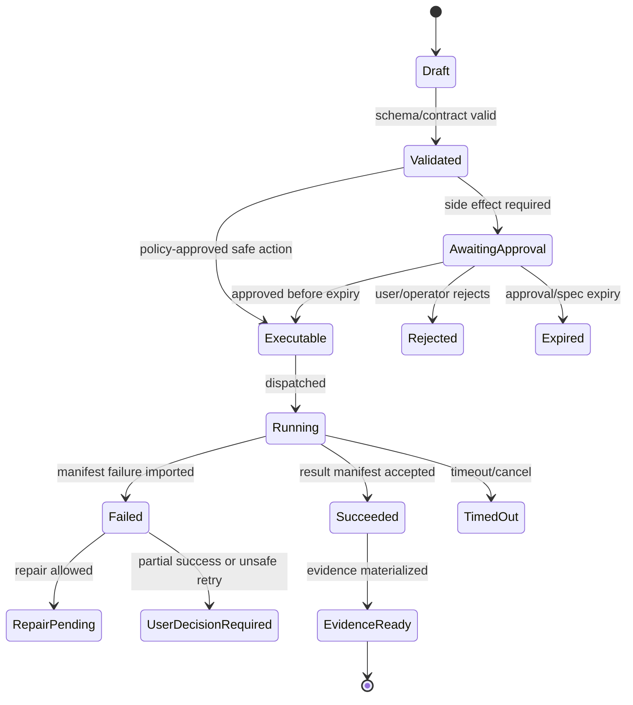

# Implementation Epics and Backlog

## V6.17 backlog topology

All work items are tagged `S-*` (shared contracts/fixtures/UI semantics), `W-*` (`web_managed`), or `D-*` (`windows_local`). A story may depend across tracks but may not combine both delivery authorities in one acceptance flow.

Desktop D0 contains release-blocking spikes for Tauri IPC scopes, native Entra/WAM-or-PKCE, selected-folder/path/reparse rules, journaled recovery, signed packaging/update, and DESK-01 child-process containment. Web W0–W5 retain the cloud-first ASP.NET/Azure/ACA sequence. Remote-job collaboration is a later cross-track handoff story, not an MVP executor abstraction.

## V6.18 mandatory BMAD/Builder backlog slices

Source: [[100 - BMAD Method and Builder Deep Comprehension Audit]]. Add these dependency-ordered slices to the existing S/W/D backlog; they refine the older single late “Builder Studio MVP” epic.

| Slice | Required scope | Done when |
|---|---|---|
| `S-BMAD-0` semantic freeze | Source/install/validation/runtime profiles, source conflicts, real skill archetypes, and golden fixtures | Every normalized field and rule cites its profile/source evidence. |
| `S-BMAD-1` sealed Method + early Builder draft | One real, source-derived sealed Method path; inactive `Build`/`Edit`/`Analyze` for one stateless agent and one simple workflow | Fake-safe flow persists lineage and cannot activate or execute generated content. |
| `S/W/D-BMAD-2` conversational authoring | Model-assisted draft generation after Model Gateway | Draft hashes bind model/profile/prompt/config/source and remain inactive. |
| `W/D-BMAD-3` isolated eval and rehearsal | Static scans plus isolated four-mode evaluation, install rehearsal, and invocation rehearsal | Exact digest runs only behind the target authority's governed execution boundary and produces durable evidence. |
| `W/D-BMAD-4` promotion | Evaluation decision, signing/publication where applicable, reversible activation | Only the evidenced digest activates; deactivation/rollback restores the prior capability surface. |
| `S/W/D-BMAD-5` advanced agents | Memory, then autonomy | Owner-scoped storage passes first; scheduler, quiet-hours, lifecycle, and containment pass before autonomy. |

There is no upstream Builder `Convert` intent in the pinned source. Any conversion story is explicitly a Sapphirus adapter using `Build`/`Edit`; it must not be counted as upstream parity or named as a native Builder command.

## 1. Build Order

The build order is intentionally execution-first:

```text
Foundation contracts
→ Chat shell
→ Run state
→ Workspace snapshot
→ Airlock
→ Executor
→ Evidence
→ Minimal patch/test loop
→ BMAD package loader
→ Presentation adapter
→ Builder Studio MVP
→ Hardening
```

## 2. Epic 0 — Contract and Spike Lock

### Stories

- Define OpenAPI skeleton for threads, runs, proposals, approvals, executions, evidence.
- Define JSON Schemas for model outputs, proposals, Airlock decisions, ApprovedExecutionSpec, worker result manifest.
- Run ACA Job latency spike.
- Run Azure OpenAI structured output schema spike.
- Run snapshot/checkout performance spike.
- Lock ADRs for hosting, streaming, worker protocol, command model.

### Done

- Contract tests exist.
- Spike results are documented.
- Contradictory open decisions are removed or marked `PHASE-0 SPIKE`.

## 3. Epic 1 — Cloud Foundation

### Stories

- Provision dev Azure resources with Bicep.
- Configure Entra/App Service auth or API auth path.
- Deploy Runtime API container to ACA.
- Deploy React shell.
- Provision SQL/Blob/KeyVault/ACR/Monitor.
- Add managed identities and least-privilege roles.

### Done

- Clean environment deploy succeeds.
- Smoke test reaches authenticated API.
- Telemetry spans appear in App Insights/Log Analytics.

## 4. Epic 2 — Chat Shell and Run State

### Stories

- Implement project/thread/message/run tables.
- Implement message endpoint and run creation.
- Implement event stream.
- Implement chat timeline and run cards.
- Implement evidence placeholder panel.

### Done

- User message creates run and event cards.
- Events survive refresh.

## 5. Epic 3 — Workspace Foundation

### Stories

- Import uploaded repo archive fixture.
- Create immutable snapshot manifest.
- Materialize checkout.
- Capture preimage hashes.
- Implement checkpoint metadata and rollback stub.

### Done

- Snapshot/checkpoint tests pass.
- Path traversal and symlink escape tests pass.

## 6. Epic 4 — Model Gateway and Context Packs

### Stories

- Implement fake deterministic Model Gateway.
- Implement Azure model adapter with structured outputs.
- Implement minimal context pack builder.
- Implement secret/path redaction.
- Implement model-call telemetry.

### Done

- Replay tests run with fake model.
- Live model call validates schema.
- Secret fixture is excluded.

## 7. Epic 5 — Airlock and Approvals

### Stories

- Implement proposal records.
- Implement patch path policy.
- Implement command allowlist policy.
- Implement approval UI card.
- Implement ApprovedExecutionSpec factory.
- Implement candidate-bound, expiring, single-use execution approvals; any reusable policy grant changes future policy evaluation only and never authorizes a regenerated spec by itself.

### Done

- Executor cannot dispatch without spec.
- Shell-string command is rejected.
- Approval card shows exact side effects.

## 8. Epic 6 — Execution Lane

This is the Phase-4 real Azure lane, not the Phase-1 sealed test simulation.

### Stories

- Build base Python worker protocol through ACR Tasks/hosted CI remote image builds.
- Implement patch worker.
- Implement command worker.
- Configure a digest-pinned fixed ACA Job template with start-only dispatcher identity and no request-time image/entrypoint/identity/secret/environment override.
- Implement result manifest importer.
- Implement log chunk storage and stream.

### Done

- Patch applies in isolated checkout.
- Command runs as argv.
- API imports manifest and advances state.
- Build and smoke evidence requires no local Docker engine.

## 9. Epic 7 — Evidence and Rollback

### Stories

- Implement evidence bundle builder.
- Implement evidence panel.
- Implement rollback execution path.
- Add trace privacy modes.

### Done

- Final evidence shows changed files, approvals, policy, logs, model calls, checkpoint.
- Rollback fixture works.

## 10. Epic 8 — Minimal Agentic Coding MVP

### Stories

- Implement plan generation.
- Implement patch proposal generation.
- Implement validation command proposal.
- Implement repair loop for test failure.
- Implement partial-success states.

### Done

- Demo completes chat → context → plan → proposal → approval → job → evidence.
- Failed validation can be repaired or rolled back.

## 11. Epic 9 — BMAD Package Runtime

### Stories

- Implement BMAD root detection.
- Parse `SKILL.md`, `module.yaml`, `module-help.csv`, configs.
- Build capability catalog.
- Implement Help Advisor.
- Implement package import result UI.

### Done

- Valid package registers.
- Invalid fixture gives actionable blocker.
- Help Advisor suggests source-grounded next action.

## 12. Epic 10 — Existing Presentation Workflow Adapter

### Stories

- Inventory existing workflow.
- Create adapter package shape.
- Preserve prompts/templates/export behavior.
- Implement Artifact Creator UI.
- Add outline approval.
- Add PPTX export job.
- Add golden regression fixture.

### Done

- User can create presentation through UI.
- Evidence includes source/prompt/template/export hashes.
- Golden fixture detects adapter drift.

## 13. Epic 11 — Builder Studio MVP

### Stories

- Import/convert workflow package.
- Validate module package.
- Show validation report.
- Register validated package.

### Done

- Builder output cannot bypass validation.
- One workflow package can be imported, validated, registered.

## 14. Epic 12 — Hardening

### Stories

- Add replay corpus.
- Add performance budgets.
- Add operator views.
- Add policy/image/budget admin reads.
- Add retention cleanup.
- Add accessibility and localization baseline.

### Done

- Internal release demo is reliable.
- Critical audit/policy/security tests pass.

---

## v2 Review Improvements

### 1. Dependency-Ordered Delivery Board

| Order | Epic | Must Complete Before |
|---:|---|---|
| 0 | Contract and spike lock | all development branches stabilize. |
| 1 | UX blueprint, tokens, component catalog, and responsive shell fixtures | production route UI. |
| 2 | Cloud/dev foundation | shared integration. |
| 3 | Chat shell and RunCapsule state | any agent workflow. |
| 4 | Workspace foundation | patch proposal/apply. |
| 5 | Model Gateway/context packs | model-assisted plan/patch. |
| 6 | Airlock/approval review | any side effect. |
| 7 | Execution lane | validation and patch apply. |
| 8 | Evidence/rollback | developer MVP. |
| 9 | Minimal agentic coding MVP | BMAD integration. |
| 10 | BMAD package runtime | presentation adapter. |
| 11 | Presentation adapter | artifact creator MVP. |
| 12 | Builder import/convert/validate | SkillOps later. |
| 13 | Hardening | internal release. |

### 2. First 20 Implementation Stories

| # | Story | Output | Dependency |
|---:|---|---|---|
| 1 | Define OpenAPI skeleton for projects/threads/runs/events. | `openapi.yaml` | none |
| 2 | Create SQL migrations for slice tables. | migration files | 1 |
| 3 | Build run event append/read API. | API + tests | 2 |
| 4 | Build the approved responsive AppShell and RunCapsule fixture renderer. | `packages/ui` + route shell + stories | 3 |
| 5 | Create sample React fixture importer. | project fixture | 2 |
| 6 | Build snapshot manifest creator. | snapshot service | 5 |
| 7 | Build context pack builder v0. | context pack | 6 |
| 8 | Add Model Gateway stub. | deterministic model output | 7 |
| 9 | Add Azure OpenAI adapter behind same port. | provider adapter | 8 |
| 10 | Define proposal schemas. | JSON Schema + DTOs | 1 |
| 11 | Create proposal record + inspector-based diff review. | proposal UI/API | 10 |
| 12 | Implement Airlock policy kernel v0. | policy tests | 11 |
| 13 | Implement approval endpoint and full ApprovalReview surface. | keyboard-safe, boundary-labeled approval flow | 12 |
| 14 | Implement ApprovedExecutionSpec factory. | spec object | 13 |
| 15 | Build patch-worker. | worker image | 14 |
| 16 | Dispatch ACA Job from API. | execution dispatch | 15 |
| 17 | Worker result manifest import. | execution lifecycle | 16 |
| 18 | Build command-worker with `argv[]`. | validation command | 14 |
| 19 | Create checkpoint/rollback metadata. | workspace recovery | 17 |
| 20 | Generate evidence bundle. | evidence UI/blob | 17-19 |

### 3. Release Milestones

| Milestone | Demo |
|---|---|
| M0 | API contract compiles; approved AppShell/RunCapsule/ApprovalReview fixtures pass visual, keyboard, theme, and reduced-motion gates. |
| M1 | Chat thread emits run events from user message. |
| M2 | Context pack and model stub produce proposal. |
| M3 | Airlock blocks/permits proposal with approval card. |
| M4 | ACA Job applies patch and API imports manifest. |
| M5 | Validation command runs as `argv[]`. |
| M6 | Evidence bundle and rollback metadata generated. |
| M7 | BMAD package loader parses valid/invalid fixtures. |
| M8 | Presentation adapter generates/export regression artifact. |
| M9 | Builder imports/converts/validates one package. |

### 4. “Do Not Start Yet” List

Do not start these before M6 unless explicitly needed:

- full visual Builder authoring;
- package marketplace;
- remote Git push;
- public SaaS tenancy;
- broad connector framework;
- durable orchestration engine;
- full semantic codebase indexing;
- operator analytics beyond minimum policy/budget/health;
- complex theme/design polish unrelated to workbench usability.


---


---

## Implementation-depth contract

This file is part of the V6 implementation library. It is written as an implementation guide, not as a strategy memo. Every component must be built against the same system-wide constraints:

1. **The first executable slice comes before breadth.** The first demonstrable product must prove authenticated chat, workspace context, typed plan output, proposal creation, Airlock validation, approval, isolated execution, validation, checkpoint, and evidence.
2. **The delivery-specific authority owns lifecycle state.** The web Runtime API imports remote-worker facts into SQL; the signed desktop Rust host imports local-executor facts into SQLite. Workers, child processes, renderers, models, sync services, and support APIs do not advance authoritative lifecycle state.
3. **Airlock creates the only side-effect token.** Workspace writes, command runs, exports, package imports, dependency restores, and policy-sensitive actions require an `ApprovedExecutionSpec` issued by Airlock.
4. **The model does not own proposals.** Model Gateway returns typed model outputs. Run Orchestrator creates normalized `Proposal` records. Airlock validates proposals.
5. **No raw shell by default.** Commands are represented as `argv[]` plus policy metadata; `sh -c`, shell expansion, broad environment access, and open network access are blocked unless explicitly operator-approved.
6. **Every side effect is reconstructable.** Diffs, preimages, spec hashes, policy hashes, approvals, job image digests, result manifests, logs, artifacts, and rollback metadata must be traceable.
7. **Each module has ports.** Even inside a modular monolith, use explicit interfaces and contracts to avoid creating a god control plane.


## 1. Component identity

| Field | Value |
|---|---|
| Component | `Implementation Epics and Backlog` |
| Area | `Delivery planning` |
| Primary implementation package | `project-management docs` |
| Runtime/technology | `Markdown planning artifact` |
| First-slice priority | `after-core or supporting` |


## 2. Purpose

Break the project into executable epics, stories, tasks, dependencies, exit gates, and sequencing rules that prevent building a broad shallow platform.

The implementation must be narrow enough to fit the corrected first vertical slice, but designed so BMAD package execution, the existing presentation adapter, Builder Studio, SkillOps, replay, and operator controls can plug into the same contracts later.


## 3. Owns / does not own

### Owns
- Build sequence
- Epic dependencies
- Story acceptance criteria
- Risk-driven spikes
- DoD checklists
- Implementation order

### Does not own
- Changing architecture decisions without ADR
- Parallelizing Builder before execution core


## 4. Public/API surface and internal ports

### Required API/routes or callable operations
- `N/A`


### Internal contract rules

- Every boundary uses typed, schema-versioned values. C# uses `Runtime.Contracts` / `Runtime.Domain`, Rust uses generated contract types plus `desktop-domain`, and TypeScript uses generated web or desktop facade types; no generated DTO grants runtime authority.
- External payloads must be schema-versioned. Internal objects may evolve faster but must not leak into OpenAPI without a contract version.
- Every state mutation must be idempotent or protected by optimistic concurrency.
- Every side-effect operation must receive an `ApprovedExecutionSpec` or be provably read-only.
- Every error response must use the standard error envelope with `code`, `message`, `correlationId`, `retryable`, and optional `detailsRef`.


### Starter interface/type sketch

```python
@dataclass(frozen=True)
class WorkerInvocation:
    job_id: str
    approved_spec_path: Path
    checkout_path: Path
    output_dir: Path
    log_dir: Path
```


## 5. State model

### Component states
- `not_started`
- `spike`
- `in_progress`
- `blocked`
- `review`
- `accepted`
- `deferred`


### Generic side-effect lifecycle





## 6. Persistence responsibilities

### SQL tables or domain records touched
- `Tracked in project board; maps to ADRs, gates, acceptance matrix`

### Blob/object storage paths touched
- `N/A`


### Persistence rules

- In `web_managed`, SQL stores lifecycle state, compact indexes, ownership metadata, and references. In `windows_local`, SQLite stores the corresponding local authority records.
- In `web_managed`, Blob stores large immutable payloads: snapshots, logs, diffs, manifests, artifacts, exports, packages, traces, and validation reports. In `windows_local`, encrypted local content-addressed storage holds authority-owned payloads; cloud upload is explicit and purpose-scoped.
- Any Blob payload referenced from SQL must include content hash, schema version, created timestamp, and retention class.
- No raw secrets, broad credentials, or unredacted prompt/context payloads are stored by default.
- Migrations must be forward-safe and testable against fixture data.


## 7. Detailed implementation steps


### Phase 0 — Contract and spike

1. Create or update the relevant ADR before implementation when the decision affects hosting, policy, security, data ownership, or external dependencies.

2. Define public DTOs and durable JSON schemas first. Do not let implementation classes silently become external contracts.

3. Create a minimal fixture that exercises the component without requiring the whole platform.

4. Add negative tests for the most dangerous bypass or failure case before adding the happy path.

5. Record assumptions in the component file and in the ADR index if they are not final.

6. For `Implementation Epics and Backlog`, implement only the smallest behavior that proves its contract in the first executable slice, then add extended BMAD/Builder/artifact behavior after gate approval.


### Phase 1 — Skeleton implementation

1. Create the package/module/folder with explicit ports/interfaces and dependency direction rules.

2. Add dependency injection registration with narrow interfaces rather than passing broad services everywhere.

3. Implement persistence only through repository/store abstractions that expose business operations, not raw table access.

4. Emit structured events for every important state transition even if the UI does not yet render them.

5. Add unit tests for object creation, invalid input, authorization/policy denial, and idempotency where relevant.

6. For `Implementation Epics and Backlog`, implement only the smallest behavior that proves its contract in the first executable slice, then add extended BMAD/Builder/artifact behavior after gate approval.


### Phase 2 — First vertical integration

1. Connect the component to the first executable slice only. Avoid adding full future scope before the vertical path works.

2. Use fake/stub adapters for expensive external systems until the contract is proven.

3. Make all side effects flow through Proposal → AirlockDecision → Approval/Grant → ApprovedExecutionSpec → Dispatch.

4. Persist large payloads to Blob and store only compact references in SQL.

5. Return UI-consumable run events so the Chat Workbench can render progress without polling raw tables.

6. For `Implementation Epics and Backlog`, implement only the smallest behavior that proves its contract in the first executable slice, then add extended BMAD/Builder/artifact behavior after gate approval.


### Phase 3 — Production hardening

1. Add telemetry attributes, correlation IDs, redaction, and audit events.

2. Add retry, timeout, cancellation, and stale-state handling.

3. Add migration scripts and seed data for dev/test.

4. Add operator visibility for status, errors, budget/policy impact, and cleanup status.

5. Document runbooks for the top failure modes.

6. For `Implementation Epics and Backlog`, implement only the smallest behavior that proves its contract in the first executable slice, then add extended BMAD/Builder/artifact behavior after gate approval.


### Phase 4 — Regression and release gate

1. Add contract tests against OpenAPI/JSON Schema.

2. Add replay fixtures or golden outputs where deterministic behavior is expected.

3. Add security tests for prompt injection, secret leakage, excessive agency, insecure output handling, and supply-chain drift where relevant.

4. Update release gate evidence with screenshots/log excerpts/manifests rather than informal claims.

5. Mark open risks and deferred v1.5/v2 items explicitly.

6. For `Implementation Epics and Backlog`, implement only the smallest behavior that proves its contract in the first executable slice, then add extended BMAD/Builder/artifact behavior after gate approval.


## 8. Validation and test plan

### Required tests
- backlog item has acceptance criteria
- dependency order respected
- no story bypasses Airlock
- vertical slice acceptance executable


### Minimum test layers

| Layer | What to test | Required before merge |
|---|---|---|
| Unit | object validation, state transitions, parsing, policy predicates | yes |
| Contract | OpenAPI/JSON Schema compatibility, generated clients, worker manifests | yes for public/durable payloads |
| Integration | SQL + Blob references, dispatch/import, authz, Airlock boundary | yes for side-effect paths |
| E2E | chat → proposal → approval → execution → evidence | yes for first slice files |
| Replay/golden | BMAD package fixtures, presentation adapter, evidence bundle | yes before v1 beta |
| Security negative | prompt injection, secret leak, policy bypass, path traversal, raw shell | yes for all side-effect components |


## 9. Failure modes and recovery

| Failure | Detection | Required behavior | User/operator visibility |
|---|---|---|---|
| Invalid schema | contract validation | reject before persistence or dispatch | show actionable error with correlation ID |
| Stale proposal/preimage | hash mismatch | void proposal or require rebase/new proposal | show stale context warning |
| Approval expired | expiry check | reject dispatch | show re-approve option |
| Policy mismatch | policy hash mismatch | reject spec | operator audit event |
| Worker timeout | job monitor | mark job timed out; preserve partial logs | timeline event + retry option if safe |
| Manifest missing/invalid | manifest import validation | do not advance success state | incident/failure card |
| Partial success | checkpoint/validation state | enter `user_decision_required` or `kept_for_repair` | explicit decision card |
| Secret detected | scanner/redactor | redact and block if high confidence | security finding card/operator event |


## 10. Security and policy requirements

- Treat workspace files, package files, generated artifacts, model outputs, and logs as untrusted input.
- Never let untrusted content override system instructions, Airlock policy, command allowlists, network policy, or secret handling.
- Enforce project-level authorization on every read and write.
- Log security-relevant denials as audit events, but do not include raw secret values.
- Prefer fail-closed behavior when policy, identity, schema, or storage checks are ambiguous.
- Add negative tests for the most likely bypass path before writing happy-path code.


## 11. Observability

Minimum telemetry fields for this component:

- `correlation.id`
- `project.id`
- `run.id` when available
- `component.name`
- `operation.name`
- `operation.outcome`
- `policy.version` when applicable
- `spec.id` when applicable
- `job.id` when applicable
- `artifact.id` when applicable
- redaction counters, not raw secrets

Metrics to consider: request latency, state-transition count, policy denials, approval wait time, job duration, manifest import failures, schema validation failures, retry count, budget blocks, and evidence materialization time.


## 12. Acceptance criteria

- [ ] The component has a clear owner package and does not leak responsibilities into unrelated modules.
- [ ] Public routes/payloads are represented in OpenAPI/JSON Schema where applicable.
- [ ] Side-effect paths cannot execute without Airlock evaluation and `ApprovedExecutionSpec`.
- [ ] SQL lifecycle state is mutated only by the Runtime API/Application layer.
- [ ] Blob payloads have content hashes and schema versions.
- [ ] Tests include at least one negative/bypass case.
- [ ] Events and evidence are emitted for user-visible actions.
- [ ] The component is represented in the release gate matrix.
- [ ] The implementation does not introduce Cortex as a runtime namespace.
- [ ] Documentation includes deferred v1.5/v2 scope explicitly rather than silently omitting it.


## 13. Integration checklist

- [ ] Update `32 - Integration Contract Map.md` with any new caller/callee relationship.
- [ ] Update `25 - OpenAPI, Schemas, and Generated Clients.md` for public route or schema changes.
- [ ] Update `22 - Data Model - SQL and Blob.md`, `47 - Database DDL Starter.md`, or `48 - Blob Storage Layout.md` for persistence changes.
- [ ] Update `27 - Testing, Validation, and Replay.md` for new fixtures or replay needs.
- [ ] Update `33 - Release Gates and Acceptance Matrix.md` if the change affects release readiness.
- [ ] Add or update ADR in `31 - Architecture Decision Records.md` if the change alters architecture, hosting, policy, or security posture.


---

## Historical Revision Notes (V3 -> V4)
## Review finding

`30 - Implementation Epics and Backlog.md` is part of the implementation library support layer. In v3, support files were useful but not always testable. In v4, every support file must provide either a decision, reference contract, release gate, mapping, runbook, or checklist that can be executed by a developer or coding agent.

## Required usage

1. Read this file before changing the related implementation area.
2. Cross-check it against `07 - Source Coverage Matrix.md` and `50 - V4 Full Library Audit.md`.
3. When implementing a task, copy the relevant checklist items into the issue/story.
4. When a decision changes, update this file and `31 - Architecture Decision Records.md` in the same PR.
5. When a contract changes, update `25 - OpenAPI, Schemas, and Generated Clients.md`, `46 - API Route Catalog.md`, and generated clients.

## V4 quality rules for this file

- It must not contradict locked architecture decisions.
- It must not reintroduce a broad v1 scope that competes with the executable vertical slice.
- It must preserve BMAD source contracts and the existing presentation workflow adapter decision.
- It must reflect the Runtime API as lifecycle state owner and the worker as manifest/log producer only.
- It must identify whether guidance is `LOCKED`, `TEMPORARY`, `PHASE-0 SPIKE`, `V1`, `V1.5`, or `V2`.

## Implementation checklist linkages

| Related guide | What to cross-check |
|---|---|
| `01 - First Build - Executable Vertical Slice.md` | Does this file support or distract from the first slice? |
| `29 - Concurrency, Transactions, and Failures.md` | Are state and partial failure semantics compatible? |
| `32 - Integration Contract Map.md` | Are producer/consumer boundaries clear? |
| `33 - Release Gates and Acceptance Matrix.md` | Is there a release gate for this guidance? |
| `49 - Detailed Component Build Checklists.md` | Are implementation tasks represented as checklist items? |

## Consolidated Source-Review Backlog Inserts

Source: [[89 - Consolidated AI Workspace Source Review and Architecture Improvements]].

Add these backlog epics before broad feature expansion:

| Epic | Why it moves up |
|---|---|
| Runtime principal and owner-scope foundation | Token, loopback, scheduler, worker, connector, and human actions need one authorization model. |
| Tool availability snapshot service | Chat, orchestrator, model gateway, and operator console need the same effective tool view. |
| Outbound URL policy adapter | Webhooks, search fetches, provider probes, and document/media fetches need one SSRF/DNS-pinning implementation. |
| Package activation pipeline | BMAD/Builder/SkillOps cannot safely grow without staged package validation and rehearsal. |
| Provider resolution fixture pack | Foundry/OpenAI/local/custom routing needs fallback, cache, and credential-binding evidence. |
| Fresh-install and degraded-state test pack | Self-hosted and local dev must show what works, what is disabled, and what to do next. |
| Dynamic Sessions spike | Interactive execution should be tested against ACA Jobs before becoming an execution lane. |
| TypeScript 7 migration gate | The native compiler is valuable, but generated API clients and build tooling must prove compatibility. |
