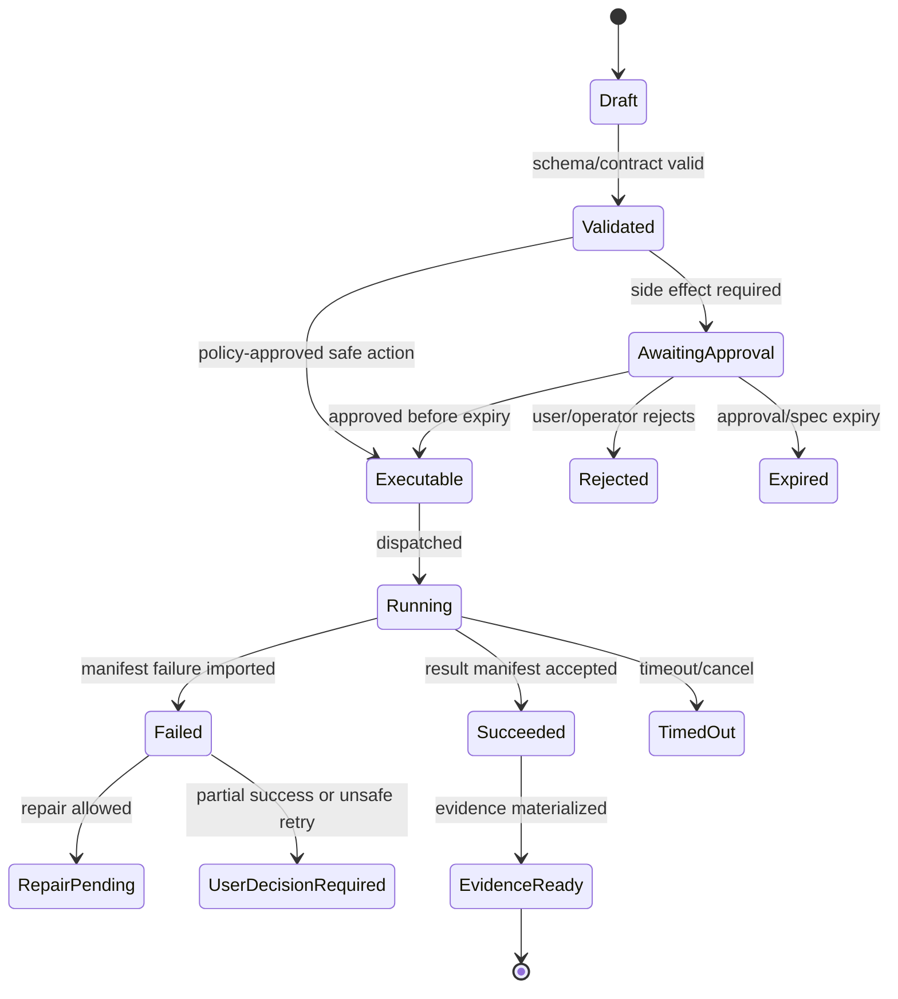

# ADR-004: Exact Candidate-Bound Execution Authority

## V6.17 delivery-model decision namespace

ADRs 001–030 remain valid with their original applicability; ASP.NET, Azure SQL/Blob, Python workers, ACA, and SPA decisions apply to `web_managed` unless explicitly shared. ADRs 031–039 and 045–048 define the separate Windows-local authority and cross-delivery boundary. ADRs 040–044 remain reserved deferred decisions.

## 1. ADR Rules

ADRs are required when a `LOCKED` decision changes, when a Phase-0 spike resolves an implementation path, or when a side-effect/security boundary changes.

ADR template:

```markdown
# ADR-NNNN: Short Decision Title

## Status
Proposed | Accepted | Superseded

## Context

## Decision

## Consequences

## Alternatives Considered

## Validation Evidence

## Related Files
```

## 2. ADRs to Write Before Implementation Stabilizes

| ADR | Title | Status Target | Why It Matters |
|---|---|---|---|
| ADR-001 | Chat-first product shell | Accepted | Prevents drift into generic dashboard/tool UI. |
| ADR-002 | Modular ASP.NET Core Runtime API | Accepted | Locks control-plane shape. |
| ADR-003 | Per-image workers in fixed Azure Container Apps Jobs | Accepted | Locks first real isolation model without assuming one global Python runtime. |
| ADR-004 | Exact candidate-bound, single-use ApprovedExecutionSpec | Accepted | Core safety/TOCTOU boundary. |
| ADR-005 | API-owned state transitions | Accepted | Prevents worker SQL mutation. |
| ADR-006 | Commands represented as argv arrays | Accepted | Security-critical command model. |
| ADR-007 | Azure SQL + Blob split | Accepted | Prevents SQL log bottleneck. |
| ADR-008 | OpenAPI-first API contracts | Accepted | Prevents web/API drift. |
| ADR-009 | Evidence Ledger authority and diagnostic trace privacy views | Accepted | Reconciles durable proof, observability failure, and privacy. |
| ADR-010 | No auto-push in v1 | Accepted | Limits high-risk external side effects. |
| ADR-011 | BMAD Kernel does not route general runtime tasks | Accepted | Prevents BMAD kernel overreach. |
| ADR-012 | Model Gateway returns typed outputs only | Accepted | Separates model access from proposals/policy. |
| ADR-013 | Workspace single-writer policy | Accepted | Prevents concurrent edit corruption. |
| ADR-014 | Existing presentation workflow adapter, not rewrite | Accepted | Preserves existing asset and reduces scope. |
| ADR-015 | Builder Studio v1 cut line | Accepted | Prevents Builder platform scope explosion. |
| ADR-016 | BMAD Method and Builder as product foundation | Accepted | Preserves method/artifact/help and authoring/eval authority without granting runtime authority. |
| ADR-017 | Source Intake and path-level component-license decisions | Accepted | Archive completeness/root license cannot authorize promotion or redistribution. |
| ADR-018 | Durable WorkItem/Attempt/Lease/Completion/Outbox | Accepted | Prevents lost/duplicate effects and in-memory recovery authority. |
| ADR-019 | `sealed_test_fake` is not containment or the desktop product | Accepted | Keeps Phase 1 possible on constrained hardware without confusing a deterministic fake with `windows_local`. |
| ADR-021 | SSE over durable Evidence Ledger projection for v1 | Accepted | One-way status stream fits the SPA while durable cursors/gaps remain server-owned. |
| ADR-026 | No-container cloud-first development and ACR remote builds | Accepted | Supported hardware requires no Docker/Kubernetes/emulators/local models. |
| ADR-027 | React 19.2 + Vite 8 + React Router 8 SPA | Accepted with compatibility gate | Avoids a second server authority absent SSR/BFF need. |
| ADR-028 | OpenAPI 3.1.2 + JSON Schema 2020-12 canonical v1 | Accepted | Matches ASP.NET Core 10 and avoids dual 3.1/3.2 truth. |
| ADR-029 | App-owned LLM state and evaluated exact ModelProfiles | Accepted | Locks `store=false`, hosted-tools-off, capability/schema/credential/eval/canary/fallback/rollback. |
| ADR-030 | Fixed ACA templates and start-only dispatcher identity | Accepted | Prevents request-time image/entrypoint/identity/secret/network/environment mutation. |
| ADR-031 | Two delivery models and immutable project discriminator | Accepted | Prevents silent authority switching; transfer creates a linked project/handoff. |
| ADR-032 | Tauri 2/Rust desktop host with narrow capability-checked IPC | Accepted | Keeps filesystem/process/tokens out of renderer authority. |
| ADR-033 | SQLite/encrypted-CAS desktop state and evidence authority | Accepted | Azure sync remains a replica/support plane. |
| ADR-034 | Selected-folder capability and NTFS path/reparse policy | Accepted with D0 verification | Makes app file APIs root-bounded without using string-prefix security. |
| ADR-035 | Evidence-calibrated child-process containment | Evidence-gated | Job Objects are not filesystem/network isolation; DESK-01 determines release claims. |
| ADR-036 | Desktop Entra public-client authentication | Evidence-gated | Prefer WAM where support/SSO evidence permits; otherwise system-browser auth code + PKCE. |
| ADR-037 | Cloud Model Access API; no provider key on device | Accepted | Separates model entitlement/credentials from local execution authority. |
| ADR-038 | Context egress consent, classification, and retention | Accepted | Folder selection is not repository-upload consent. |
| ADR-039 | Signed desktop installer/updater and enterprise rings | Accepted with release proof | Makes native supply chain and recovery explicit. |
| ADR-045 | DPAPI-protected local encryption, backup, and recovery | Accepted with recovery proof | Protects local payload keys and defines unrecoverable-state handling. |
| ADR-046 | Optional sync/collaboration is non-authoritative replication | Accepted | No cloud command or merge rewrites protected local facts. |
| ADR-047 | Explicit remote-job handoff and local reapproval | Accepted | Remote output cannot directly mutate the selected folder. |
| ADR-048 | C#/Rust/TypeScript contract conformance | Accepted | Golden vectors prevent semantic drift without sharing authority code. |

## 3. Evidence-gated spike ADRs

| ADR | Spike | Decision Options |
|---|---|---|
| ADR-020 | Post-Phase-4 execution latency | Keep fixed ACA Jobs only vs add Dynamic Sessions/Sandboxes without changing spec/result/evidence contracts. |
| ADR-022 | Frontend hosting | App Service integrated vs separate static hosting. |
| ADR-023 | Structural indexing | API module + async worker vs separate service. |
| ADR-024 | OpenAI structured output limits | Schema simplification rules and retry policy. |
| ADR-025 | Networking profile | ACA workload profiles/private endpoints baseline vs simpler dev topology. |

## 4. Deferred ADRs

| ADR | Topic | Trigger |
|---|---|---|
| ADR-040 | AKS migration | ACA cannot satisfy workloads. |
| ADR-041 | Durable orchestration engine | Approval-aware long-running workflows require it. |
| ADR-042 | Git push/publish automation | v1.5/v2 wants remote side effects. |
| ADR-043 | Full SkillOps release registry | Builder package volume requires release channels. |
| ADR-044 | Public SaaS tenancy | Product shifts outside internal app. |

---

## v2 Review Improvements

### 1. ADR Acceptance Criteria

An ADR is accepted only when it includes:

- context and problem statement;
- decision and non-decision;
- alternatives considered;
- security implications;
- operational implications;
- test/spike evidence;
- rollback/supersession path;
- affected Markdown library files;
- affected OpenAPI/schema files.

### 2. ADRs To Write First (V6.16 ids)

| ADR | Title | Must Exist Before |
|---|---|---|
| ADR-016 | BMAD Method/Builder foundation and compatibility profiles | deriving package/workflow/artifact contracts |
| ADR-017 | Source Intake/component-license decisions | accepting source-derived code or fixtures |
| ADR-002 | Runtime API modular monolith with internal ports | runtime module implementation |
| ADR-018 | Durable work/completion/evidence/outbox authority | first lifecycle migration |
| ADR-004 | Exact candidate-bound single-use spec gate | any governed worker dispatch |
| ADR-009 | Evidence Ledger authority vs diagnostic trace projections | first run/evidence implementation |
| ADR-026 | No-container cloud-first workflow and ACR remote build | developer onboarding or image build |
| ADR-027 / ADR-028 | SPA delivery and canonical OpenAPI 3.1 contracts | frontend/API skeleton |
| ADR-029 | App-owned LLM state and evaluated ModelProfiles | real provider integration |
| ADR-030 | Fixed ACA templates/start-only dispatcher | first real effect/internal alpha |
| ADR-014 / ADR-015 | Presentation adapter and Builder cut line | Phase 6A/6B expansion |

### 3. ADR Example: Airlock Spec Gate

```markdown
# Architecture Decision Records

## Status
Accepted

## Context
Models can propose patches/commands but must not execute governed effects. Policy and any human decision must cover the exact executable meaning, not a generic approval record.

## Decision
Every governed worker dispatch starts from an immutable `ExecutionSpecCandidate`. Airlock evaluates that candidate; when policy requires a human, the approval binds its exact hash. Airlock may then mint an audience-bound, expiring, single-use `ApprovedExecutionSpec` containing candidate/proposal/approval/policy hashes, owner/actor, fixed template/audience, workspace and every mutable-input hash, effect/command, limits, issue/expiry, and nonce/consumption state.

## Non-decision
This does not decide the long-term deployment boundary of Airlock as separate service vs in-process module.

## Consequences
Executors reject raw proposals, generic approval booleans, changed candidates, consumed/wrong-audience specs, and request-time template overrides. Ordinary authenticated CRUD and offline Source Intake use separate non-execution authority classes.

## Validation Evidence
Policy tests: missing/expired/reused/wrong-audience spec, candidate A vs B, policy/mutable-input drift, stale preimage, blocked command, fixed-template mismatch, and grant-not-executable.
```

### 4. ADR Debt Register

If a team makes a temporary implementation shortcut, record it here until an ADR resolves it:

| Debt | Owner | Expiry | Resolution |
|---|---|---|---|
| local-only Blob emulator accepted for dev | platform | before staging | deploy real storage and update evidence paths |
| mock Model Gateway used for vertical slice | AI/runtime | before M3 | wire Azure OpenAI adapter |
| simplified secret scanner | security/runtime | before M6 | add fixture suite and redaction tests |


---


---

## Implementation-depth contract

This file is part of the V6 implementation library. It is written as an implementation guide, not as a strategy memo. Every component must be built against the same system-wide constraints:

1. **The first executable slice comes before breadth.** The first demonstrable product must prove authenticated chat, workspace context, typed plan output, proposal creation, Airlock validation, approval, isolated execution, validation, checkpoint, and evidence.
2. **The delivery-specific authority owns lifecycle state.** The web Runtime API imports remote-worker facts into SQL; the signed desktop Rust host imports local-executor facts into SQLite. Workers, child processes, renderers, models, sync services, and support APIs do not advance authoritative lifecycle state.
3. **Airlock creates the only side-effect token.** Workspace writes, command runs, exports, package imports, dependency restores, and policy-sensitive actions require an `ApprovedExecutionSpec` issued by Airlock.
4. **The model does not own proposals.** Model Gateway returns typed model outputs. Run Orchestrator creates normalized `Proposal` records. Airlock validates proposals.
5. **No raw shell by default.** Commands are represented as `argv[]` plus policy metadata; `sh -c`, shell expansion, broad environment access, and open network access are blocked unless explicitly operator-approved.
6. **Every side effect is reconstructable.** Diffs, preimages, spec hashes, policy hashes, approvals, job image digests, result manifests, logs, artifacts, and rollback metadata must be traceable.
7. **Each module has ports.** Even inside a modular monolith, use explicit interfaces and contracts to avoid creating a god control plane.


## 1. Component identity

| Field | Value |
|---|---|
| Component | `ADR Index` |
| Area | `Architecture governance` |
| Primary implementation package | `docs/adr` |
| Runtime/technology | `Markdown ADR records` |
| First-slice priority | `after-core or supporting` |


## 2. Purpose

Lock, defer, or spike implementation decisions with traceable context, consequences, and review dates.

The implementation must be narrow enough to fit the corrected first vertical slice, but designed so BMAD package execution, the existing presentation adapter, Builder Studio, SkillOps, replay, and operator controls can plug into the same contracts later.


## 3. Owns / does not own

### Owns
- ADR numbering
- Decision status
- Decision rationale
- Consequences
- Review schedule
- Supersession rules

### Does not own
- Implicit architecture changes without ADR
- Contradictory open decisions


## 4. Public/API surface and internal ports

### Required API/routes or callable operations
- `N/A`


### Internal contract rules

- Every boundary uses typed, schema-versioned values. C# uses `Runtime.Contracts` / `Runtime.Domain`, Rust uses generated contract types plus `desktop-domain`, and TypeScript uses generated web or desktop facade types; no generated DTO grants runtime authority.
- External payloads must be schema-versioned. Internal objects may evolve faster but must not leak into OpenAPI without a contract version.
- Every state mutation must be idempotent or protected by optimistic concurrency.
- Every side-effect operation must receive an `ApprovedExecutionSpec` or be provably read-only.
- Every error response must use the standard error envelope with `code`, `message`, `correlationId`, `retryable`, and optional `detailsRef`.


### Starter interface/type sketch

```python
@dataclass(frozen=True)
class WorkerInvocation:
    job_id: str
    approved_spec_path: Path
    checkout_path: Path
    output_dir: Path
    log_dir: Path
```


## 5. State model

### Component states
- `proposed`
- `accepted`
- `locked`
- `temporary`
- `phase_0_spike`
- `deferred`
- `superseded`
- `rejected`


### Generic side-effect lifecycle





## 6. Persistence responsibilities

### SQL tables or domain records touched
- `Optional ADR table in SQL later for operator visibility`

### Blob/object storage paths touched
- `docs/adr/ADR-*.md`


### Persistence rules

- In `web_managed`, SQL stores lifecycle state, compact indexes, ownership metadata, and references. In `windows_local`, SQLite stores the corresponding local authority records.
- In `web_managed`, Blob stores large immutable payloads: snapshots, logs, diffs, manifests, artifacts, exports, packages, traces, and validation reports. In `windows_local`, encrypted local content-addressed storage holds authority-owned payloads; cloud upload is explicit and purpose-scoped.
- Any Blob payload referenced from SQL must include content hash, schema version, created timestamp, and retention class.
- No raw secrets, broad credentials, or unredacted prompt/context payloads are stored by default.
- Migrations must be forward-safe and testable against fixture data.


## 7. Detailed implementation steps


### Phase 0 — Contract and spike

1. Create or update the relevant ADR before implementation when the decision affects hosting, policy, security, data ownership, or external dependencies.

2. Define public DTOs and durable JSON schemas first. Do not let implementation classes silently become external contracts.

3. Create a minimal fixture that exercises the component without requiring the whole platform.

4. Add negative tests for the most dangerous bypass or failure case before adding the happy path.

5. Record assumptions in the component file and in the ADR index if they are not final.

6. For `ADR Index`, implement only the smallest behavior that proves its contract in the first executable slice, then add extended BMAD/Builder/artifact behavior after gate approval.


### Phase 1 — Skeleton implementation

1. Create the package/module/folder with explicit ports/interfaces and dependency direction rules.

2. Add dependency injection registration with narrow interfaces rather than passing broad services everywhere.

3. Implement persistence only through repository/store abstractions that expose business operations, not raw table access.

4. Emit structured events for every important state transition even if the UI does not yet render them.

5. Add unit tests for object creation, invalid input, authorization/policy denial, and idempotency where relevant.

6. For `ADR Index`, implement only the smallest behavior that proves its contract in the first executable slice, then add extended BMAD/Builder/artifact behavior after gate approval.


### Phase 2 — First vertical integration

1. Connect the component to the first executable slice only. Avoid adding full future scope before the vertical path works.

2. Use fake/stub adapters for expensive external systems until the contract is proven.

3. Make all side effects flow through Proposal → AirlockDecision → Approval/Grant → ApprovedExecutionSpec → Dispatch.

4. Persist large payloads to Blob and store only compact references in SQL.

5. Return UI-consumable run events so the Chat Workbench can render progress without polling raw tables.

6. For `ADR Index`, implement only the smallest behavior that proves its contract in the first executable slice, then add extended BMAD/Builder/artifact behavior after gate approval.


### Phase 3 — Production hardening

1. Add telemetry attributes, correlation IDs, redaction, and audit events.

2. Add retry, timeout, cancellation, and stale-state handling.

3. Add migration scripts and seed data for dev/test.

4. Add operator visibility for status, errors, budget/policy impact, and cleanup status.

5. Document runbooks for the top failure modes.

6. For `ADR Index`, implement only the smallest behavior that proves its contract in the first executable slice, then add extended BMAD/Builder/artifact behavior after gate approval.


### Phase 4 — Regression and release gate

1. Add contract tests against OpenAPI/JSON Schema.

2. Add replay fixtures or golden outputs where deterministic behavior is expected.

3. Add security tests for prompt injection, secret leakage, excessive agency, insecure output handling, and supply-chain drift where relevant.

4. Update release gate evidence with screenshots/log excerpts/manifests rather than informal claims.

5. Mark open risks and deferred v1.5/v2 items explicitly.

6. For `ADR Index`, implement only the smallest behavior that proves its contract in the first executable slice, then add extended BMAD/Builder/artifact behavior after gate approval.


## 8. Validation and test plan

### Required tests
- no conflicting locked decisions
- open decisions have owner/date
- decision changes update affected docs
- ADR status vocabulary consistent


### Minimum test layers

| Layer | What to test | Required before merge |
|---|---|---|
| Unit | object validation, state transitions, parsing, policy predicates | yes |
| Contract | OpenAPI/JSON Schema compatibility, generated clients, worker manifests | yes for public/durable payloads |
| Integration | SQL + Blob references, dispatch/import, authz, Airlock boundary | yes for side-effect paths |
| E2E | chat → proposal → approval → execution → evidence | yes for first slice files |
| Replay/golden | BMAD package fixtures, presentation adapter, evidence bundle | yes before v1 beta |
| Security negative | prompt injection, secret leak, policy bypass, path traversal, raw shell | yes for all side-effect components |


## 9. Failure modes and recovery

| Failure | Detection | Required behavior | User/operator visibility |
|---|---|---|---|
| Invalid schema | contract validation | reject before persistence or dispatch | show actionable error with correlation ID |
| Stale proposal/preimage | hash mismatch | void proposal or require rebase/new proposal | show stale context warning |
| Approval expired | expiry check | reject dispatch | show re-approve option |
| Policy mismatch | policy hash mismatch | reject spec | operator audit event |
| Worker timeout | job monitor | mark job timed out; preserve partial logs | timeline event + retry option if safe |
| Manifest missing/invalid | manifest import validation | do not advance success state | incident/failure card |
| Partial success | checkpoint/validation state | enter `user_decision_required` or `kept_for_repair` | explicit decision card |
| Secret detected | scanner/redactor | redact and block if high confidence | security finding card/operator event |


## 10. Security and policy requirements

- Treat workspace files, package files, generated artifacts, model outputs, and logs as untrusted input.
- Never let untrusted content override system instructions, Airlock policy, command allowlists, network policy, or secret handling.
- Enforce project-level authorization on every read and write.
- Log security-relevant denials as audit events, but do not include raw secret values.
- Prefer fail-closed behavior when policy, identity, schema, or storage checks are ambiguous.
- Add negative tests for the most likely bypass path before writing happy-path code.


## 11. Observability

Minimum telemetry fields for this component:

- `correlation.id`
- `project.id`
- `run.id` when available
- `component.name`
- `operation.name`
- `operation.outcome`
- `policy.version` when applicable
- `spec.id` when applicable
- `job.id` when applicable
- `artifact.id` when applicable
- redaction counters, not raw secrets

Metrics to consider: request latency, state-transition count, policy denials, approval wait time, job duration, manifest import failures, schema validation failures, retry count, budget blocks, and evidence materialization time.


## 12. Acceptance criteria

- [ ] The component has a clear owner package and does not leak responsibilities into unrelated modules.
- [ ] Public routes/payloads are represented in OpenAPI/JSON Schema where applicable.
- [ ] Side-effect paths cannot execute without Airlock evaluation and `ApprovedExecutionSpec`.
- [ ] SQL lifecycle state is mutated only by the Runtime API/Application layer.
- [ ] Blob payloads have content hashes and schema versions.
- [ ] Tests include at least one negative/bypass case.
- [ ] Events and evidence are emitted for user-visible actions.
- [ ] The component is represented in the release gate matrix.
- [ ] The implementation does not introduce Cortex as a runtime namespace.
- [ ] Documentation includes deferred v1.5/v2 scope explicitly rather than silently omitting it.


## 13. Integration checklist

- [ ] Update `32 - Integration Contract Map.md` with any new caller/callee relationship.
- [ ] Update `25 - OpenAPI, Schemas, and Generated Clients.md` for public route or schema changes.
- [ ] Update `22 - Data Model - SQL and Blob.md`, `47 - Database DDL Starter.md`, or `48 - Blob Storage Layout.md` for persistence changes.
- [ ] Update `27 - Testing, Validation, and Replay.md` for new fixtures or replay needs.
- [ ] Update `33 - Release Gates and Acceptance Matrix.md` if the change affects release readiness.
- [ ] Add or update ADR in `31 - Architecture Decision Records.md` if the change alters architecture, hosting, policy, or security posture.


---

## Historical Revision Notes (V3 -> V4)
## Review finding

`31 - Architecture Decision Records.md` is part of the implementation library support layer. In v3, support files were useful but not always testable. In v4, every support file must provide either a decision, reference contract, release gate, mapping, runbook, or checklist that can be executed by a developer or coding agent.

## Required usage

1. Read this file before changing the related implementation area.
2. Cross-check it against `07 - Source Coverage Matrix.md` and `50 - V4 Full Library Audit.md`.
3. When implementing a task, copy the relevant checklist items into the issue/story.
4. When a decision changes, update this file and `31 - Architecture Decision Records.md` in the same PR.
5. When a contract changes, update `25 - OpenAPI, Schemas, and Generated Clients.md`, `46 - API Route Catalog.md`, and generated clients.

## V4 quality rules for this file

- It must not contradict locked architecture decisions.
- It must not reintroduce a broad v1 scope that competes with the executable vertical slice.
- It must preserve BMAD source contracts and the existing presentation workflow adapter decision.
- It must reflect the Runtime API as lifecycle state owner and the worker as manifest/log producer only.
- It must identify whether guidance is `LOCKED`, `TEMPORARY`, `PHASE-0 SPIKE`, `V1`, `V1.5`, or `V2`.

## Implementation checklist linkages

| Related guide | What to cross-check |
|---|---|
| `01 - First Build - Executable Vertical Slice.md` | Does this file support or distract from the first slice? |
| `29 - Concurrency, Transactions, and Failures.md` | Are state and partial failure semantics compatible? |
| `32 - Integration Contract Map.md` | Are producer/consumer boundaries clear? |
| `33 - Release Gates and Acceptance Matrix.md` | Is there a release gate for this guidance? |
| `49 - Detailed Component Build Checklists.md` | Are implementation tasks represented as checklist items? |
