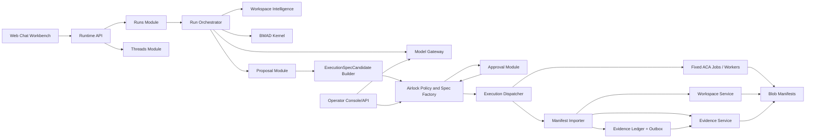
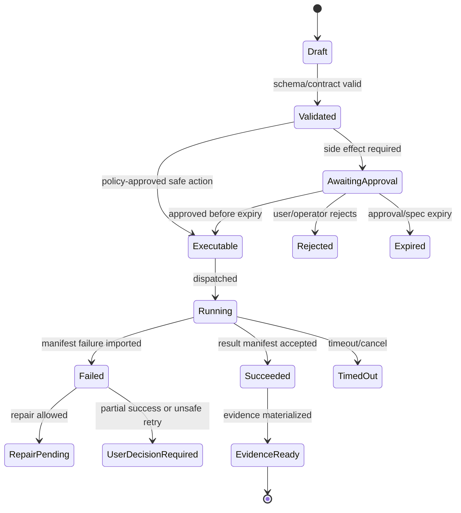

# Integration Contract Map

## V6.17 dual call graphs and forbidden bypasses

The web graph is `React → Runtime API → cloud domain/Airlock → Cloud Workspace Service/fixed remote executor → manifest import → SQL/Blob evidence`. The desktop graph is `React/WebView2 → narrow Tauri IPC → Rust domain/Airlock → local workspace/runner → SQLite/encrypted evidence` plus outbound support-plane calls.

Forbidden edges include renderer→filesystem/process/token store, Azure→local host command, sync→local lifecycle transition, desktop→SQL/Blob workspace authority, web API→local folder, model→executor, remote result→local apply, and any spec consumed by an audience or delivery model different from the one hashed into it. Shared schemas are not shared runtime authority.

## 1. Purpose

This file prevents architecture blocks from becoming vague boxes. It defines who may call whom, what object must cross the boundary, and what bypasses are forbidden.

## 2. Allowed Call Graph



## 3. Forbidden Bypasses

| Bypass | Why Forbidden |
|---|---|
| Web calls worker directly. | Skips auth, policy, state, evidence. |
| Orchestrator dispatches worker without Airlock. | Skips approval/spec. |
| Model Gateway creates `Proposal`. | Blurs model/provider and platform control. |
| BMAD Kernel routes general coding intent. | Couples BMAD semantics to runtime orchestration. |
| Worker writes run lifecycle state to SQL. | Breaks idempotency and authority. |
| Workspace content changes Airlock policy. | Prompt-injection/policy injection risk. |
| Operator policy update skips regression tests. | Can break safety guarantees. |

## 4. Boundary Objects

| From | To | Object |
|---|---|---|
| Web | Runtime API | `CreateMessageRequest`, `ApprovalDecisionRequest`. |
| Orchestrator | Workspace Intelligence | `ContextRequest`. |
| Workspace Intelligence | Orchestrator | `ContextPackRef`. |
| Orchestrator | Model Gateway | `ModelRequest<TOutput>`. |
| Model Gateway | Orchestrator | `ModelOutput<T>`. |
| Orchestrator | Proposal Module | `CreateProposalCommand`. |
| Proposal Module | Candidate Builder | `Proposal + exact effect/lane/input/output context`. |
| Candidate Builder | Airlock | Immutable `ExecutionSpecCandidate + PolicyContext`. |
| Airlock | Approval Module | `AirlockDecision + exact candidate id/hash + required reviewer/audience`. |
| Approval Module | Airlock | Candidate-bound `ApprovalDecision`; never an executable token. |
| Airlock | Execution Dispatcher | Audience-bound, expiring, single-use `ApprovedExecutionSpec`. |
| Worker | Blob | `WebWorkerResultManifest`. |
| Manifest Importer / Runtime API | Evidence Ledger + Outbox | Atomic `WorkCompletion + EvidenceLedgerEvent + OutboxMessage`. |
| Runtime API | Evidence Service | `EvidenceMaterializationRequest` with ledger stream/range and canonical object hashes. |

## 4.1 Package and Extension Descriptor Boundary

OpenClaw's manifest and protocol schemas show that extension breadth stays safer when descriptors are data contracts instead of private imports. Sapphirus keeps BMAD packages first, but any package/extension descriptor crossing a module boundary must use a typed boundary object.

| From | To | Object | Rule |
|---|---|---|---|
| Source Intake | Package Importer | `SourceSnapshot + SourceVerificationRecord + ComponentLicenseDecision[]` | No source-derived fixture or implementation is promoted without URL/ref, archive and path-level license/notice hashes, extraction completeness, verification, and explicit include/exclude/clean-room/legal-review decisions. |
| Package Importer | BMAD Kernel | `BmadPackageDescriptor` | Contains parsed BMAD metadata, file inventory hash, help catalog refs, config schema refs, and validation report refs. |
| Package Importer | BMAD Kernel | `BmadConfigLayer[]` | Import declares `BmadInstallProfile` and preserves ordered layer ownership; mixed or ambiguous Method/Builder layouts fail review instead of being silently merged. |
| BMAD Kernel | Run Orchestrator | `BmadMethodState` + `BmadArtifactExpectation` | A run may select only a capability/step present in the normalized graph; method/artifact state advances only after authoritative manifest import. |
| Builder Studio | Package Importer | `SkillPackageProposal` | Generated packages remain proposals until validation, scan, rehearsal, and Airlock approval complete. |
| Package Registry | Runtime API | `PackageInstallPolicyResult` | Install policy is evaluated separately from tool policy and execution approval. |
| Package Registry | Chat Workbench | `PackageUiDescriptor` | UI hints, config forms, actions, and display text are schema-versioned data, not hard-coded package code. |
| Runtime API | Airlock | `PackageCapabilityContext` | Package-declared tools/capabilities are advisory until allowed by Airlock policy. |
| Runtime API / Airlock | Execution Dispatcher | `ApprovedExecutionSpec` containing typed package-validation/rehearsal operation | Package executable validation begins only in the fixed Azure lane with no workspace write access unless rehearsing an approved exact-digest install. |

Forbidden boundary shortcuts:

- Package content must not import runtime internals or mutate Airlock policy.
- Builder output must not become an installed package without a `SkillPackageProposal` record.
- Config migrations must not be implemented as runtime fallback readers.
- UI actions declared by a package must resolve to typed platform actions, not arbitrary callbacks.

## 5. Integration Tests

- A fake model output cannot skip proposal creation.
- A fake approval cannot mint an execution spec unless Airlock decision permits it.
- Approval for candidate hash A cannot mint or dispatch a spec for candidate hash B, a changed mutable input, or a different audience/template.
- A fake worker manifest cannot transition a run unless Runtime API imports it.
- A BMAD workflow execution uses the same proposal/approval/execution/evidence pipeline as coding actions.
- Presentation export uses the same execution spec and evidence pipeline as patch/test.


---


---

## Implementation-depth contract

This file is part of the V6 implementation library. It is written as an implementation guide, not as a strategy memo. Every component must be built against the same system-wide constraints:

1. **The first executable slice comes before breadth.** The first demonstrable product must prove authenticated chat, workspace context, typed plan output, proposal creation, Airlock validation, approval, isolated execution, validation, checkpoint, and evidence.
2. **The delivery-specific authority owns lifecycle state.** The web Runtime API imports remote-worker facts into SQL; the signed desktop Rust host imports local-executor facts into SQLite. Workers, child processes, renderers, models, sync services, and support APIs do not advance authoritative lifecycle state.
3. **Airlock creates the only side-effect token.** Workspace writes, command runs, exports, package imports, dependency restores, and policy-sensitive actions require an `ApprovedExecutionSpec` issued by Airlock.
4. **The model does not own proposals.** Model Gateway returns typed model outputs. Run Orchestrator creates normalized `Proposal` records. Airlock validates proposals.
5. **No raw shell by default.** Commands are represented as `argv[]` plus policy metadata; `sh -c`, shell expansion, broad environment access, and open network access are blocked unless explicitly operator-approved.
6. **Every side effect is reconstructable.** Diffs, preimages, spec hashes, policy hashes, approvals, job image digests, result manifests, logs, artifacts, and rollback metadata must be traceable.
7. **Each module has ports.** Even inside a modular monolith, use explicit interfaces and contracts to avoid creating a god control plane.


## 1. Component identity

| Field | Value |
|---|---|
| Component | `Integration Contract Map` |
| Area | `Cross-component contracts` |
| Primary implementation package | `docs/contracts` |
| Runtime/technology | `Markdown + schema references` |
| First-slice priority | `after-core or supporting` |


## 2. Purpose

Make every component boundary explicit: caller, callee, object, ownership, side effects, state mutation rule, and bypass tests.

The implementation must be narrow enough to fit the corrected first vertical slice, but designed so BMAD package execution, the existing presentation adapter, Builder Studio, SkillOps, replay, and operator controls can plug into the same contracts later.


## 3. Owns / does not own

### Owns
- Component call graph
- Port map
- Boundary objects
- Forbidden bypasses
- Integration test requirements
- Cross-file consistency

### Does not own
- Implementation code
- Duplicating all component internals


## 4. Public/API surface and internal ports

### Required API/routes or callable operations
- `References all public/internal APIs`


### Internal contract rules

- Every boundary uses typed, schema-versioned values. C# uses `Runtime.Contracts` / `Runtime.Domain`, Rust uses generated contract types plus `desktop-domain`, and TypeScript uses generated web or desktop facade types; no generated DTO grants runtime authority.
- External payloads must be schema-versioned. Internal objects may evolve faster but must not leak into OpenAPI without a contract version.
- Every state mutation must be idempotent or protected by optimistic concurrency.
- Every governed mutation/worker dispatch must receive an audience-bound, unconsumed `ApprovedExecutionSpec`; ordinary owner-scoped CRUD and offline Source Intake use their declared non-execution authority classes.
- Every error response must use the standard error envelope with `code`, `message`, `correlationId`, `retryable`, and optional `detailsRef`.


### Starter interface/type sketch

```python
@dataclass(frozen=True)
class WorkerInvocation:
    job_id: str
    approved_spec_path: Path
    checkout_path: Path
    output_dir: Path
    log_dir: Path
```


## 5. State model

### Component states
- `contract_draft`
- `contract_locked`
- `implementation_mapped`
- `test_added`
- `drift_detected`


### Generic side-effect lifecycle





## 6. Persistence responsibilities

### SQL tables or domain records touched
- `ContractMap`
- `IntegrationTestCoverage`
- `BoundaryObject`

### Blob/object storage paths touched
- `contracts/maps/*.json`
- `contracts/diagrams/*.mmd`


### Persistence rules

- In `web_managed`, SQL stores lifecycle state, compact indexes, ownership metadata, and references. In `windows_local`, SQLite stores the corresponding local authority records.
- In `web_managed`, Blob stores large immutable payloads: snapshots, logs, diffs, manifests, artifacts, exports, packages, traces, and validation reports. In `windows_local`, encrypted local content-addressed storage holds authority-owned payloads; cloud upload is explicit and purpose-scoped.
- Any Blob payload referenced from SQL must include content hash, schema version, created timestamp, and retention class.
- No raw secrets, broad credentials, or unredacted prompt/context payloads are stored by default.
- Migrations must be forward-safe and testable against fixture data.


## 7. Detailed implementation steps


### Phase 0 — Contract and spike

1. Create or update the relevant ADR before implementation when the decision affects hosting, policy, security, data ownership, or external dependencies.

2. Define public DTOs and durable JSON schemas first. Do not let implementation classes silently become external contracts.

3. Create a minimal fixture that exercises the component without requiring the whole platform.

4. Add negative tests for the most dangerous bypass or failure case before adding the happy path.

5. Record assumptions in the component file and in the ADR index if they are not final.

6. For `Integration Contract Map`, implement only the smallest behavior that proves its contract in the first executable slice, then add extended BMAD/Builder/artifact behavior after gate approval.


### Phase 1 — Skeleton implementation

1. Create the package/module/folder with explicit ports/interfaces and dependency direction rules.

2. Add dependency injection registration with narrow interfaces rather than passing broad services everywhere.

3. Implement persistence only through repository/store abstractions that expose business operations, not raw table access.

4. Emit structured events for every important state transition even if the UI does not yet render them.

5. Add unit tests for object creation, invalid input, authorization/policy denial, and idempotency where relevant.

6. For `Integration Contract Map`, implement only the smallest behavior that proves its contract in the first executable slice, then add extended BMAD/Builder/artifact behavior after gate approval.


### Phase 2 — First vertical integration

1. Connect the component to the first executable slice only. Avoid adding full future scope before the vertical path works.

2. Use fake/stub adapters for expensive external systems until the contract is proven.

3. Make governed effects flow through `Proposal → ExecutionSpecCandidate → AirlockDecision → exact candidate approval when required → Airlock-minted ApprovedExecutionSpec → Dispatch`.

4. Persist large payloads to Blob and store only compact references in SQL.

5. Return UI-consumable run events so the Chat Workbench can render progress without polling raw tables.

6. For `Integration Contract Map`, implement only the smallest behavior that proves its contract in the first executable slice, then add extended BMAD/Builder/artifact behavior after gate approval.


### Phase 3 — Production hardening

1. Add telemetry attributes, correlation IDs, redaction, and audit events.

2. Add retry, timeout, cancellation, and stale-state handling.

3. Add migration scripts and seed data for dev/test.

4. Add operator visibility for status, errors, budget/policy impact, and cleanup status.

5. Document runbooks for the top failure modes.

6. For `Integration Contract Map`, implement only the smallest behavior that proves its contract in the first executable slice, then add extended BMAD/Builder/artifact behavior after gate approval.


### Phase 4 — Regression and release gate

1. Add contract tests against OpenAPI/JSON Schema.

2. Add replay fixtures or golden outputs where deterministic behavior is expected.

3. Add security tests for prompt injection, secret leakage, excessive agency, insecure output handling, and supply-chain drift where relevant.

4. Update release gate evidence with screenshots/log excerpts/manifests rather than informal claims.

5. Mark open risks and deferred v1.5/v2 items explicitly.

6. For `Integration Contract Map`, implement only the smallest behavior that proves its contract in the first executable slice, then add extended BMAD/Builder/artifact behavior after gate approval.


## 8. Validation and test plan

### Required tests
- each side-effect path crosses Airlock
- workers never update lifecycle SQL
- Model Gateway not proposal owner
- all public routes in OpenAPI


### Minimum test layers

| Layer | What to test | Required before merge |
|---|---|---|
| Unit | object validation, state transitions, parsing, policy predicates | yes |
| Contract | OpenAPI/JSON Schema compatibility, generated clients, worker manifests | yes for public/durable payloads |
| Integration | SQL + Blob references, dispatch/import, authz, Airlock boundary | yes for side-effect paths |
| E2E | chat → proposal → approval → execution → evidence | yes for first slice files |
| Replay/golden | BMAD package fixtures, presentation adapter, evidence bundle | yes before v1 beta |
| Security negative | prompt injection, secret leak, policy bypass, path traversal, raw shell | yes for all side-effect components |


## 9. Failure modes and recovery

| Failure | Detection | Required behavior | User/operator visibility |
|---|---|---|---|
| Invalid schema | contract validation | reject before persistence or dispatch | show actionable error with correlation ID |
| Stale proposal/preimage | hash mismatch | void proposal or require rebase/new proposal | show stale context warning |
| Approval expired | expiry check | reject dispatch | show re-approve option |
| Policy mismatch | policy hash mismatch | reject spec | operator audit event |
| Worker timeout | job monitor | mark job timed out; preserve partial logs | timeline event + retry option if safe |
| Manifest missing/invalid | manifest import validation | do not advance success state | incident/failure card |
| Partial success | checkpoint/validation state | enter `user_decision_required` or `kept_for_repair` | explicit decision card |
| Secret detected | scanner/redactor | redact and block if high confidence | security finding card/operator event |


## 10. Security and policy requirements

- Treat workspace files, package files, generated artifacts, model outputs, and logs as untrusted input.
- Never let untrusted content override system instructions, Airlock policy, command allowlists, network policy, or secret handling.
- Enforce project-level authorization on every read and write.
- Log security-relevant denials as audit events, but do not include raw secret values.
- Prefer fail-closed behavior when policy, identity, schema, or storage checks are ambiguous.
- Add negative tests for the most likely bypass path before writing happy-path code.


## 11. Observability

Minimum telemetry fields for this component:

- `correlation.id`
- `project.id`
- `run.id` when available
- `component.name`
- `operation.name`
- `operation.outcome`
- `policy.version` when applicable
- `spec.id` when applicable
- `job.id` when applicable
- `artifact.id` when applicable
- redaction counters, not raw secrets

Metrics to consider: request latency, state-transition count, policy denials, approval wait time, job duration, manifest import failures, schema validation failures, retry count, budget blocks, and evidence materialization time.


## 12. Acceptance criteria

- [ ] The component has a clear owner package and does not leak responsibilities into unrelated modules.
- [ ] Public routes/payloads are represented in OpenAPI/JSON Schema where applicable.
- [ ] Governed effect paths cannot execute without exact-candidate Airlock evaluation and an audience-bound, single-use `ApprovedExecutionSpec`.
- [ ] SQL lifecycle state is mutated only by the Runtime API/Application layer.
- [ ] Blob payloads have content hashes and schema versions.
- [ ] Tests include at least one negative/bypass case.
- [ ] Events and evidence are emitted for user-visible actions.
- [ ] The component is represented in the release gate matrix.
- [ ] The implementation does not introduce Cortex as a runtime namespace.
- [ ] Documentation includes deferred v1.5/v2 scope explicitly rather than silently omitting it.


## 13. Integration checklist

- [ ] Update `32 - Integration Contract Map.md` with any new caller/callee relationship.
- [ ] Update `25 - OpenAPI, Schemas, and Generated Clients.md` for public route or schema changes.
- [ ] Update `22 - Data Model - SQL and Blob.md`, `47 - Database DDL Starter.md`, or `48 - Blob Storage Layout.md` for persistence changes.
- [ ] Update `27 - Testing, Validation, and Replay.md` for new fixtures or replay needs.
- [ ] Update `33 - Release Gates and Acceptance Matrix.md` if the change affects release readiness.
- [ ] Add or update ADR in `31 - Architecture Decision Records.md` if the change alters architecture, hosting, policy, or security posture.


---

## Historical Revision Notes (V3 -> V4)
## Review finding

`32 - Integration Contract Map.md` is part of the implementation library support layer. In v3, support files were useful but not always testable. In v4, every support file must provide either a decision, reference contract, release gate, mapping, runbook, or checklist that can be executed by a developer or coding agent.

## Required usage

1. Read this file before changing the related implementation area.
2. Cross-check it against `07 - Source Coverage Matrix.md` and `50 - V4 Full Library Audit.md`.
3. When implementing a task, copy the relevant checklist items into the issue/story.
4. When a decision changes, update this file and `31 - Architecture Decision Records.md` in the same PR.
5. When a contract changes, update `25 - OpenAPI, Schemas, and Generated Clients.md`, `46 - API Route Catalog.md`, and generated clients.

## V4 quality rules for this file

- It must not contradict locked architecture decisions.
- It must not reintroduce a broad v1 scope that competes with the executable vertical slice.
- It must preserve BMAD source contracts and the existing presentation workflow adapter decision.
- It must reflect the Runtime API as lifecycle state owner and the worker as manifest/log producer only.
- It must identify whether guidance is `LOCKED`, `TEMPORARY`, `PHASE-0 SPIKE`, `V1`, `V1.5`, or `V2`.

## Implementation checklist linkages

| Related guide | What to cross-check |
|---|---|
| `01 - First Build - Executable Vertical Slice.md` | Does this file support or distract from the first slice? |
| `29 - Concurrency, Transactions, and Failures.md` | Are state and partial failure semantics compatible? |
| `32 - Integration Contract Map.md` | Are producer/consumer boundaries clear? |
| `33 - Release Gates and Acceptance Matrix.md` | Is there a release gate for this guidance? |
| `49 - Detailed Component Build Checklists.md` | Are implementation tasks represented as checklist items? |

## Hermes-Informed Connector Contracts

Source: [[86 - Hermes Source Code Review - Agent Runtime and Learning Loop]].

External adapters must handshake with a `ConnectorCapabilityDescriptor` before normalized events flow.

Minimum descriptor fields:

- connector id;
- platform;
- contract version;
- max message length and length unit;
- markdown/content dialect;
- thread support;
- edit support;
- draft/streaming support;
- attachment support;
- required source discriminators;
- auth and routing mode;
- idle/buffer behavior.

Routing must be author-first for multi-tenant platforms. A shared workspace, tenant, or channel cannot select an agent instance unless the authenticated author binding also matches. Missing or revoked bindings fail closed.

## Hermes Deep-Review Integration Boundaries

Source: [[87 - Hermes Deep Review - Extension Runtime and Operational Contracts]].

Add these caller/callee boundaries:

| Producer | Consumer | Contract |
|---|---|---|
| Model Gateway resolver | Run Orchestrator, Scheduler, Editor Adapter | `RuntimeProviderResolution` and provider fallback events. |
| Secret source framework | Runtime API, Gateway, Worker Launcher | `SecretSourceApplyReport` and `ProfileSecretScope`. |
| Platform adapter | Gateway / Scheduler | `ConnectorConfigBridge`, `ConnectorCapabilityDescriptor`, `DeliveryTarget`, and `ConnectorCredentialLock`. |
| Editor adapter | Runtime API / Stream API | `EditorSessionContext`, cancellation, permission bridge, and stdout/stderr protocol separation. |
| Tool registry | Model Gateway / Stream API | Availability-filtered tool schema plus `ToolEventCorrelation`. |
| Operator Console auth | Operator routes / WebSocket gateway | `DashboardSession`, `TokenPrincipal`, and `WebSocketTicket`. |
| Worker dispatcher | Task board / Scheduler | `TaskClaim`, heartbeat, block reason, and reclaim event. |
| Gateway lifecycle manager | Operator Console / Active sessions | `GatewayDrainRequest` and per-session interrupt notification. |

## Odysseus-Informed Integration Boundaries

Source: [[88 - Odysseus Source Code Review - Self-Hosted AI Workspace]].

Add these caller/callee boundaries:

| Producer | Consumer | Contract |
|---|---|---|
| Chat Workbench | Runtime API / Tool Registry | `ToolAvailabilitySnapshot`, owner privilege, degraded tool state, and user-visible unavailable reasons. |
| Runtime API | Tool Registry / Execution Lanes | `InternalLoopbackPrincipal`, owner scope, admin-only tool decision, and Airlock decision reference. |
| Workspace Service | Run Orchestrator / Model Gateway | `UntrustedContextEnvelope`, `FileToolWorkspaceScope`, and safe source provenance. |
| Network Adapter | Webhook, Search, Provider Probe, Document Fetch | `OutboundUrlPolicy` and `DnsPinnedFetch`. |
| Upload Service | Workspace Service / Document Adapter | `UploadObject`, `UploadIndexRecord`, and `DocumentSourceBinding`. |
| Scheduler | Execution Lanes / Chat Workbench | `ScheduledTaskChain`, webhook token, background job event, and output target. |
| Model Gateway | Operator Console / Chat Workbench | `ProviderEndpointProfile`, `ModelCatalogEntry`, and `ProviderProbeStatus`. |
| SkillOps / Memory | Workspace Intelligence / Run Orchestrator | `SkillRetrievalAudit`, `MemoryProviderHealth`, and owner-filtered recall results. |

## Consolidated Source-Review Integration Rule

Source: [[89 - Consolidated AI Workspace Source Review and Architecture Improvements]].

Every new integration must declare:

1. producer and consumer;
2. durable schema name;
3. owner/principal context;
4. policy gate;
5. idempotency or claim rule;
6. failure state;
7. evidence payload or trace event;
8. test fixture that proves a negative/bypass case.

No feature may exchange raw provider SDK objects, raw package objects, raw tool-call blobs, or raw worker output across a module boundary without a typed adapter contract.
