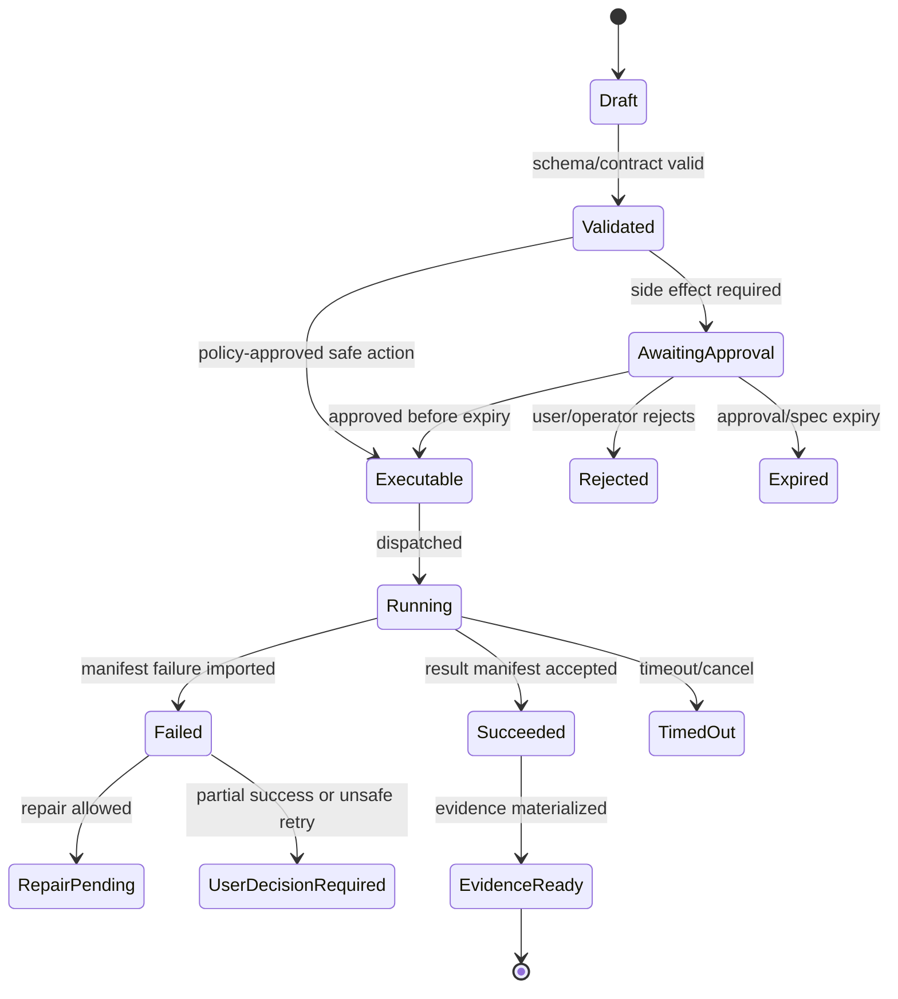

# Release Gates and Acceptance Matrix

## V6.17 independent release gates

Shared conformance, BMAD compatibility, schema evolution, Airlock rule parity, and UI accessibility gates apply to both products. Web release additionally gates cloud identity/network, SQL/Blob recovery, fixed-template isolation, manifest import, SLOs, and Azure rollback. Desktop release additionally gates signed install/update, IPC least privilege, folder/path adversarial tests, SQLite/journal recovery, encryption/key loss behavior, privacy/egress, local approval/evidence, and offline/degraded behavior.

DESK-01 is explicit: if marketing/product promises that arbitrary child tools cannot access outside selected folders, no desktop release occurs until an AppContainer/brokered or equivalent enforcement profile is proven. Otherwise the UI/docs must state the narrower guarantee and high-risk commands must be disabled or warning-gated. A remote-job release gate proves `cannotApplyDirectly: true` and fresh local approval.

## 1. Gate Levels

| Level | Meaning |
|---|---|
| G0 | Local contract compiles. |
| G1 | Module tests pass. |
| G2 | Cross-module integration works. |
| G3 | End-to-end vertical slice works. |
| G4 | Security/policy regression passes. |
| G5 | Staging release candidate. |

## 2. Gate Matrix

| Capability | G0 | G1 | G2 | G3 | G4 | G5 |
|---|---|---|---|---|---|---|
| OpenAPI contracts | schema valid | generated clients compile | API contract tests | frontend uses generated client | auth errors standardized | versioned release artifact |
| Run state | migrations compile | state machine tests | event append/read | chat renders run | invalid transitions rejected | replay evidence works |
| Workspace | manifest schema | hash/preimage tests | snapshot/checkpoint integration | patch fixture works | path abuse blocked | rollback tested in staging |
| Model Gateway | DTOs compile | schema validation tests | provider/stub swap | typed plan/patch works | no raw secret retention | budget telemetry works |
| Airlock | policy schema | denial/approval tests | approval spec mint | execution blocked without spec | prompt injection fixtures pass | policy version/audit visible |
| Execution | worker image builds | worker protocol tests | manifest import | ACA job patch/test works | no SQL mutation by worker | image digest policy enforced |
| Evidence | schema valid | bundle generation tests | Blob/SQL refs linked | evidence panel complete | redaction tests pass | retained per policy |
| BMAD | parser schemas | valid/invalid fixtures | package registry integration | Help Advisor works | unsafe paths blocked | package import evidence |
| Presentation | adapter schema | golden fixture tests | export worker integration | presentation export works | source/provenance retained | artifact evidence complete |
| Builder | package DTOs | validation tests | registration flow | one package validated | injection fixture passes | package evidence retained |

## 2.1 Evidence-Led Maturity Surfaces

OpenClaw's scorecard model is useful because it separates implementation existence from release credibility. Sapphirus release gates should track each major surface with:

| Field | Meaning |
|---|---|
| `surface` | Chat Workbench, Runtime API, Run Orchestrator, BMAD Kernel, Airlock, Execution Lanes, Workspace Service, Evidence/Trace, Package Import, Builder Studio. |
| `coverage` | Percent of required scenario coverage IDs with executed evidence. |
| `quality` | Human-reviewed quality score from tests, UX review, reliability, and support readiness. |
| `completeness` | Required capabilities implemented and documented. |
| `support` | None, partial, or full runbook/support coverage. |
| `maturityLevel` | M0 planned through M5 polished as defined in [[27 - Testing, Validation, and Replay]]. |

A surface cannot move to stable on code presence alone; it needs scenario proof, docs, support path, and repeated gate evidence.

## 3. Non-Negotiable Exit Criteria For Internal Alpha

- The first real vertical slice succeeds through a remotely built, digest-pinned, fixed-template ACA Job; the local simulated slice alone cannot qualify.
- All governed mutations require candidate-bound Airlock policy and an audience-bound, expiring, single-use `ApprovedExecutionSpec`; ordinary authenticated CRUD uses its documented authority class.
- Worker lifecycle state is imported by Runtime API, not written directly by workers.
- Atomic Evidence Ledger records and materialized Evidence Bundles exist for successful and failed/unknown runs.
- Prompt-injection and secret-redaction fixtures pass.
- OpenAPI-generated client is used by the frontend.
- At least one rollback demo succeeds.

## 4. Non-Negotiable Exit Criteria For Internal Beta

- BMAD package loader validates valid/invalid fixtures.
- Existing presentation workflow is adapted with golden regression fixture.
- Builder can import/convert/validate one workflow package.
- Operator can view policy version, worker image digest, budget use, failed executions.
- Trace ID links browser/API/model/Airlock/job/evidence.


---


---

## Implementation-depth contract

This file is part of the V6 implementation library. It is written as an implementation guide, not as a strategy memo. Every component must be built against the same system-wide constraints:

1. **The first real executable slice comes before breadth.** A sealed test simulation proves the web contracts first; internal alpha then proves authenticated chat, workspace context, typed plan output, exact candidate/approval, fixed ACA execution, validation, checkpoint, and durable evidence.
2. **The delivery-specific authority owns lifecycle state.** The web Runtime API imports remote-worker facts into SQL; the signed desktop Rust host imports local-executor facts into SQLite. Workers, child processes, renderers, models, sync services, and support APIs do not advance authoritative lifecycle state.
3. **Airlock creates the only side-effect token.** Workspace writes, command runs, exports, package imports, dependency restores, and policy-sensitive actions require an `ApprovedExecutionSpec` issued by Airlock.
4. **The model does not own proposals.** Model Gateway returns typed model outputs. Run Orchestrator creates normalized `Proposal` records. Airlock validates proposals.
5. **No raw shell by default.** Commands are represented as `argv[]` plus policy metadata; `sh -c`, shell expansion, broad environment access, and open network access are blocked unless explicitly operator-approved.
6. **Every side effect is reconstructable.** Diffs, preimages, spec hashes, policy hashes, approvals, job image digests, result manifests, logs, artifacts, and rollback metadata must be traceable.
7. **Each module has ports.** Even inside a modular monolith, use explicit interfaces and contracts to avoid creating a god control plane.


## 1. Component identity

| Field | Value |
|---|---|
| Component | `Release Gates and Acceptance Matrix` |
| Area | `Release quality` |
| Primary implementation package | `docs/release` |
| Runtime/technology | `Markdown gate matrix + CI references` |
| First-slice priority | `after-core or supporting` |


## 2. Purpose

Define alpha/beta/v1 gates with required tests, security checks, UX checks, source-alignment checks, and operational readiness.

The implementation must be narrow enough to fit the corrected first vertical slice, but designed so BMAD package execution, the existing presentation adapter, Builder Studio, SkillOps, replay, and operator controls can plug into the same contracts later.


## 3. Owns / does not own

### Owns
- Gate criteria
- Evidence required for release
- Risk acceptance rules
- Non-negotiable checks
- Readiness matrix

### Does not own
- Skipping tests due to schedule
- Accepting broad feature claims without evidence


## 4. Public/API surface and internal ports

### Required API/routes or callable operations
- `N/A`


### Internal contract rules

- Every boundary uses typed, schema-versioned values. C# uses `Runtime.Contracts` / `Runtime.Domain`, Rust uses generated contract types plus `desktop-domain`, and TypeScript uses generated web or desktop facade types; no generated DTO grants runtime authority.
- External payloads must be schema-versioned. Internal objects may evolve faster but must not leak into OpenAPI without a contract version.
- Every state mutation must be idempotent or protected by optimistic concurrency.
- Every side-effect operation must receive an `ApprovedExecutionSpec` or be provably read-only.
- Every error response must use the standard error envelope with `code`, `message`, `correlationId`, `retryable`, and optional `detailsRef`.


### Starter interface/type sketch

```python
@dataclass(frozen=True)
class WorkerInvocation:
    job_id: str
    approved_spec_path: Path
    checkout_path: Path
    output_dir: Path
    log_dir: Path
```


## 5. State model

### Component states
- `gate_not_started`
- `gate_running`
- `gate_failed`
- `gate_exception_requested`
- `gate_passed`
- `release_blocked`


### Generic side-effect lifecycle





## 6. Persistence responsibilities

### SQL tables or domain records touched
- `ReleaseGate`
- `GateEvidence`
- `RiskAcceptance`
- `ExceptionRecord`

### Blob/object storage paths touched
- `release-gates/{version}/evidence/*`
- `release-gates/{version}/exceptions.md`


### Persistence rules

- In `web_managed`, SQL stores lifecycle state, compact indexes, ownership metadata, and references. In `windows_local`, SQLite stores the corresponding local authority records.
- In `web_managed`, Blob stores large immutable payloads: snapshots, logs, diffs, manifests, artifacts, exports, packages, traces, and validation reports. In `windows_local`, encrypted local content-addressed storage holds authority-owned payloads; cloud upload is explicit and purpose-scoped.
- Any Blob payload referenced from SQL must include content hash, schema version, created timestamp, and retention class.
- No raw secrets, broad credentials, or unredacted prompt/context payloads are stored by default.
- Migrations must be forward-safe and testable against fixture data.


## 7. Detailed implementation steps


### Phase 0 — Contract and spike

1. Create or update the relevant ADR before implementation when the decision affects hosting, policy, security, data ownership, or external dependencies.

2. Define public DTOs and durable JSON schemas first. Do not let implementation classes silently become external contracts.

3. Create a minimal fixture that exercises the component without requiring the whole platform.

4. Add negative tests for the most dangerous bypass or failure case before adding the happy path.

5. Record assumptions in the component file and in the ADR index if they are not final.

6. For `Release Gates and Acceptance Matrix`, implement only the smallest behavior that proves its contract in the first executable slice, then add extended BMAD/Builder/artifact behavior after gate approval.


### Phase 1 — Skeleton implementation

1. Create the package/module/folder with explicit ports/interfaces and dependency direction rules.

2. Add dependency injection registration with narrow interfaces rather than passing broad services everywhere.

3. Implement persistence only through repository/store abstractions that expose business operations, not raw table access.

4. Emit structured events for every important state transition even if the UI does not yet render them.

5. Add unit tests for object creation, invalid input, authorization/policy denial, and idempotency where relevant.

6. For `Release Gates and Acceptance Matrix`, implement only the smallest behavior that proves its contract in the first executable slice, then add extended BMAD/Builder/artifact behavior after gate approval.


### Phase 2 — First vertical integration

1. Connect the component to the first executable slice only. Avoid adding full future scope before the vertical path works.

2. Use fake/stub adapters for expensive external systems until the contract is proven.

3. Make all side effects flow through Proposal → AirlockDecision → Approval/Grant → ApprovedExecutionSpec → Dispatch.

4. Persist large payloads to Blob and store only compact references in SQL.

5. Return UI-consumable run events so the Chat Workbench can render progress without polling raw tables.

6. For `Release Gates and Acceptance Matrix`, implement only the smallest behavior that proves its contract in the first executable slice, then add extended BMAD/Builder/artifact behavior after gate approval.


### Phase 3 — Production hardening

1. Add telemetry attributes, correlation IDs, redaction, and audit events.

2. Add retry, timeout, cancellation, and stale-state handling.

3. Add migration scripts and seed data for dev/test.

4. Add operator visibility for status, errors, budget/policy impact, and cleanup status.

5. Document runbooks for the top failure modes.

6. For `Release Gates and Acceptance Matrix`, implement only the smallest behavior that proves its contract in the first executable slice, then add extended BMAD/Builder/artifact behavior after gate approval.


### Phase 4 — Regression and release gate

1. Add contract tests against OpenAPI/JSON Schema.

2. Add replay fixtures or golden outputs where deterministic behavior is expected.

3. Add security tests for prompt injection, secret leakage, excessive agency, insecure output handling, and supply-chain drift where relevant.

4. Update release gate evidence with screenshots/log excerpts/manifests rather than informal claims.

5. Mark open risks and deferred v1.5/v2 items explicitly.

6. For `Release Gates and Acceptance Matrix`, implement only the smallest behavior that proves its contract in the first executable slice, then add extended BMAD/Builder/artifact behavior after gate approval.


## 8. Validation and test plan

### Required tests
- every gate has automated or manual evidence
- blocking gate cannot be ignored
- exception has owner/expiry
- release notes link evidence


### Minimum test layers

| Layer | What to test | Required before merge |
|---|---|---|
| Unit | object validation, state transitions, parsing, policy predicates | yes |
| Contract | OpenAPI/JSON Schema compatibility, generated clients, worker manifests | yes for public/durable payloads |
| Integration | SQL + Blob references, dispatch/import, authz, Airlock boundary | yes for side-effect paths |
| E2E | chat → proposal → approval → execution → evidence | yes for first slice files |
| Replay/golden | BMAD package fixtures, presentation adapter, evidence bundle | yes before v1 beta |
| Security negative | prompt injection, secret leak, policy bypass, path traversal, raw shell | yes for all side-effect components |


## 9. Failure modes and recovery

| Failure | Detection | Required behavior | User/operator visibility |
|---|---|---|---|
| Invalid schema | contract validation | reject before persistence or dispatch | show actionable error with correlation ID |
| Stale proposal/preimage | hash mismatch | void proposal or require rebase/new proposal | show stale context warning |
| Approval expired | expiry check | reject dispatch | show re-approve option |
| Policy mismatch | policy hash mismatch | reject spec | operator audit event |
| Worker timeout | job monitor | mark job timed out; preserve partial logs | timeline event + retry option if safe |
| Manifest missing/invalid | manifest import validation | do not advance success state | incident/failure card |
| Partial success | checkpoint/validation state | enter `user_decision_required` or `kept_for_repair` | explicit decision card |
| Secret detected | scanner/redactor | redact and block if high confidence | security finding card/operator event |


## 10. Security and policy requirements

- Treat workspace files, package files, generated artifacts, model outputs, and logs as untrusted input.
- Never let untrusted content override system instructions, Airlock policy, command allowlists, network policy, or secret handling.
- Enforce project-level authorization on every read and write.
- Log security-relevant denials as audit events, but do not include raw secret values.
- Prefer fail-closed behavior when policy, identity, schema, or storage checks are ambiguous.
- Add negative tests for the most likely bypass path before writing happy-path code.


## 11. Observability

Minimum telemetry fields for this component:

- `correlation.id`
- `project.id`
- `run.id` when available
- `component.name`
- `operation.name`
- `operation.outcome`
- `policy.version` when applicable
- `spec.id` when applicable
- `job.id` when applicable
- `artifact.id` when applicable
- redaction counters, not raw secrets

Metrics to consider: request latency, state-transition count, policy denials, approval wait time, job duration, manifest import failures, schema validation failures, retry count, budget blocks, and evidence materialization time.


## 12. Acceptance criteria

- [ ] The component has a clear owner package and does not leak responsibilities into unrelated modules.
- [ ] Public routes/payloads are represented in OpenAPI/JSON Schema where applicable.
- [ ] Side-effect paths cannot execute without Airlock evaluation and `ApprovedExecutionSpec`.
- [ ] SQL lifecycle state is mutated only by the Runtime API/Application layer.
- [ ] Blob payloads have content hashes and schema versions.
- [ ] Tests include at least one negative/bypass case.
- [ ] Events and evidence are emitted for user-visible actions.
- [ ] The component is represented in the release gate matrix.
- [ ] The implementation does not introduce Cortex as a runtime namespace.
- [ ] Documentation includes deferred v1.5/v2 scope explicitly rather than silently omitting it.


## 13. Integration checklist

- [ ] Update `32 - Integration Contract Map.md` with any new caller/callee relationship.
- [ ] Update `25 - OpenAPI, Schemas, and Generated Clients.md` for public route or schema changes.
- [ ] Update `22 - Data Model - SQL and Blob.md`, `47 - Database DDL Starter.md`, or `48 - Blob Storage Layout.md` for persistence changes.
- [ ] Update `27 - Testing, Validation, and Replay.md` for new fixtures or replay needs.
- [ ] Update `33 - Release Gates and Acceptance Matrix.md` if the change affects release readiness.
- [ ] Add or update ADR in `31 - Architecture Decision Records.md` if the change alters architecture, hosting, policy, or security posture.


---

## Historical Revision Notes (V3 -> V4)
## Review finding

`33 - Release Gates and Acceptance Matrix.md` is part of the implementation library support layer. In v3, support files were useful but not always testable. In v4, every support file must provide either a decision, reference contract, release gate, mapping, runbook, or checklist that can be executed by a developer or coding agent.

## Required usage

1. Read this file before changing the related implementation area.
2. Cross-check it against `07 - Source Coverage Matrix.md` and `50 - V4 Full Library Audit.md`.
3. When implementing a task, copy the relevant checklist items into the issue/story.
4. When a decision changes, update this file and `31 - Architecture Decision Records.md` in the same PR.
5. When a contract changes, update `25 - OpenAPI, Schemas, and Generated Clients.md`, `46 - API Route Catalog.md`, and generated clients.

## V4 quality rules for this file

- It must not contradict locked architecture decisions.
- It must not reintroduce a broad v1 scope that competes with the executable vertical slice.
- It must preserve BMAD source contracts and the existing presentation workflow adapter decision.
- It must reflect the Runtime API as lifecycle state owner and the worker as manifest/log producer only.
- It must identify whether guidance is `LOCKED`, `TEMPORARY`, `PHASE-0 SPIKE`, `V1`, `V1.5`, or `V2`.

## Implementation checklist linkages

| Related guide | What to cross-check |
|---|---|
| `01 - First Build - Executable Vertical Slice.md` | Does this file support or distract from the first slice? |
| `29 - Concurrency, Transactions, and Failures.md` | Are state and partial failure semantics compatible? |
| `32 - Integration Contract Map.md` | Are producer/consumer boundaries clear? |
| `33 - Release Gates and Acceptance Matrix.md` | Is there a release gate for this guidance? |
| `49 - Detailed Component Build Checklists.md` | Are implementation tasks represented as checklist items? |

## Consolidated Source-Review Release Gates

Source: [[89 - Consolidated AI Workspace Source Review and Architecture Improvements]].

Add these blocking gates:

| Gate | Blocks release when |
|---|---|
| Effective tool surface gate | The prompt tool schema differs from computed `ToolAvailabilitySnapshot` without a recorded transition. |
| Owner-scope gate | Any route can reveal or mutate another owner's session, upload, document, task, memory, endpoint, package, or job. |
| Egress policy gate | Any outbound fetch path bypasses `OutboundUrlPolicy` or lacks SSRF/private-network fixtures. |
| Package activation gate | A package can activate without scan, rehearsal, trust classification, approval, and capability snapshot. |
| Worker state gate | Any worker can mutate lifecycle SQL or return success without a valid hash-checked manifest. |
| Provider credential gate | A credential can be sent to an unrelated provider/base URL or fallback endpoint. |
| TypeScript 7 gate | Generated clients, `tsc --build`, and web bundling do not pass on the pinned compiler. |
| Fresh-install gate | A clean environment cannot prove auth/setup, fake provider, fake worker, storage, and degraded optional services. |
| Source and component-license gate | A source-derived file/fixture/package lacks immutable provenance, extraction evidence, copied/derived map, or an explicit path-level `ComponentLicenseDecision`; restrictive Hermes PowerPoint content is present. |
| BMAD fidelity gate | Method/Builder install profiles, config layering, package/skill/help/workflow/artifact lineage, or sealed fixture hashes differ from the accepted foundation contract without reviewed migration evidence. |
| Candidate-bound approval gate | Approval is not bound to the exact `ExecutionSpecCandidate` hash or the minted spec is reusable, wrong-audience, unexpired after use, or no longer matches mutable inputs/policy. |
| Durable evidence/recovery gate | Lifecycle, `EvidenceLedgerEvent`, and outbox are not atomic; attempt/lease/completion recovery can lose/duplicate effects; replay can re-execute. |
| Model evaluation gate | A model/prompt/context profile or fallback can become active without exact deployment capabilities, schema projection/canonical validation, four-lane eval, canary, rollback, and critical safety/privacy thresholds. |
| Provider state/privacy gate | Responses omit `store=false`, provider-hosted tools are enabled without a governed adapter, or provider-side response/background state becomes recovery authority. |
| No-container developer gate | A clean supported developer machine requires Docker, Kubernetes, infrastructure emulators, or local model serving, or `sealed_test_fake` is presented as containment. |
| Remote build/fixed ACA gate | Images are locally/mutably built, lack lock/license/scan/SBOM/provenance/digest evidence, or a runtime request can override ACA Job image/entrypoint/identity/secret/network/environment. |

## Senior LLM Plan Reinforcement Gates

Source: [[90 - LLM-Tailored Development Plan and Agent Workflow]].

These gates turn the LLM-tailored plan into release enforcement. They apply to AI-authored code, human-authored code that follows an AI work packet, and any story implemented from the backlog template.

| Gate | Blocks merge or release when |
|---|---|
| Work-packet completeness gate | The story lacks LLM development mode, story size, stop conditions, rollback/disable path, observability impact, or context ledger. |
| WIP discipline gate | One work packet changes multiple durable contract families, unrelated UI surfaces, unrelated infrastructure modules, or an L/XL scope without split/spike approval. |
| Test-first gate | Risky work starts without the required contract, negative, replay, characterization, or migration test named by the selected development mode. |
| Rollback gate | A stateful, provider, package, worker, migration, or user-visible change cannot be disabled, rolled back, or safely quarantined. |
| Observability gate | New failure, denial, timeout, retry, partial-success, budget, or degraded states have no event, metric, trace attribute, dashboard surface, or user/operator message. |
| Ownership gate | New SQL rows, Blob payloads, events, package metadata, traces, or persisted model outputs lack owner, schema version, and retention class. |
| Exception gate | A requested exception lacks owner, reason, compensating control, expiry, or exit plan. |
| Flake gate | A failing or flaky test is ignored without ticket, owner, expiry, and containment. |
| Context handoff gate | The final implementation note does not identify files changed, tests run, skipped checks, remaining risk, and next safe step. |

## QA Maturity Register (OpenClaw Pattern)

Source: OpenClaw `qa/maturity-scores.yaml` and `qa/scenarios/`, reviewed directly in `_full/o/openclaw-main`.

OpenClaw maintains a versioned, per-surface maturity register that turns "is this ready?" from opinion into data. Sapphirus adopts the same structure as release-gate evidence:

| Element | Requirement |
|---|---|
| Register file | A versioned YAML register in the repo scoring every product surface (component) on quality and completeness, with a maturity level per surface (e.g. experimental → alpha → beta → stable) and rollup averages. |
| Scenario-driven scores | Every score links to a scenario/evidence run. A named human override is allowed only with reason, owner, timestamp, expiry, and explicit separation from automated evidence; model-authored or unexplained hand-edited scores cannot promote a surface. |
| Three QA lanes | An executable regression suite (the gate), a scoped manual/style probe run only after the executable subset is green, and a coverage inventory printed from scenario metadata so gaps are visible. |
| Gate binding | A component's release-gate evidence includes its current register entry; promoting a surface's claimed maturity without a fresh score run is itself a gate violation. |
| Support status | Each surface records which acceptance categories it supports vs. totals, so "partial" support is explicit instead of implied. |

Start the register with the first vertical slice's surfaces. An honest `experimental` label on a shipped surface is compliant; an unscored `stable` claim is not.
