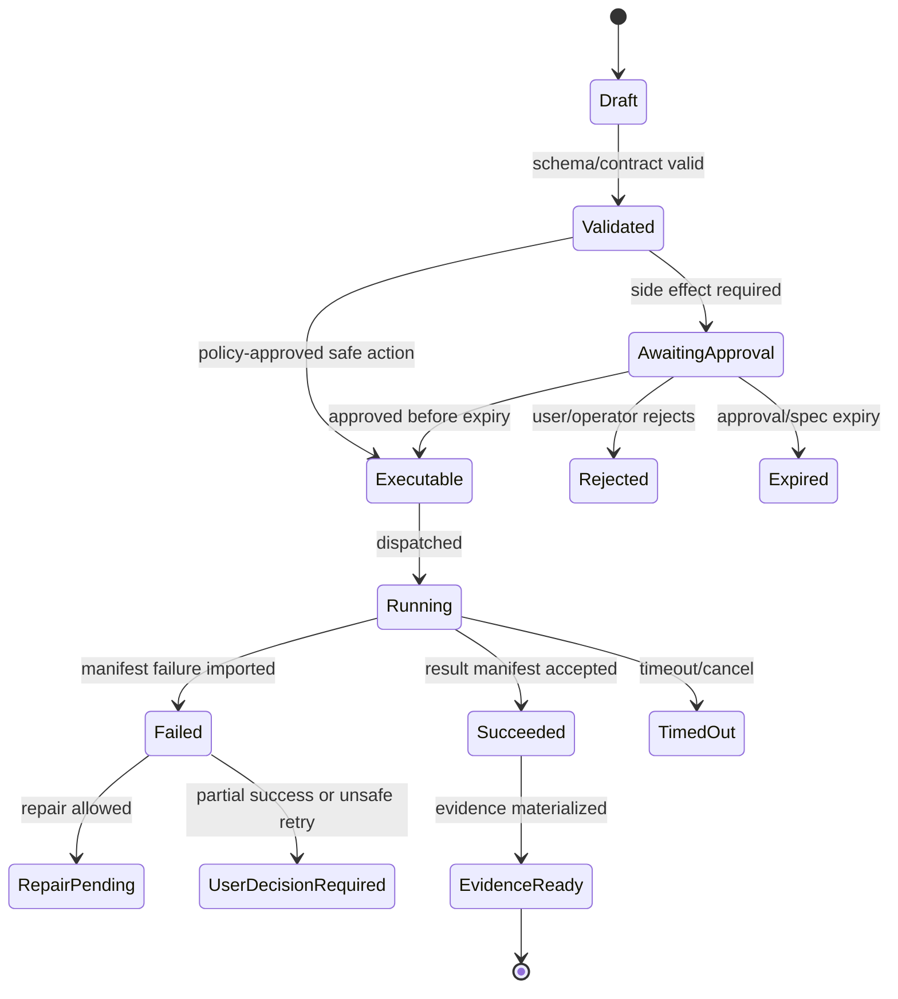

# Source Alignment Notes

## V6.18 BMAD source precedence and alignment

For BMAD Method/Builder, use [[100 - BMAD Method and Builder Deep Comprehension Audit]] and this precedence: live skill entrypoint and invoked files/scripts/tests → manifests/help → changelog → emitted templates/samples → published docs → contributor/historical prose. The audit confirms that Method is prompt-native with multiple execution archetypes, Builder v2 uses a goal-driven Process loop, Convert was removed upstream, and clean directories are not containment.

Alignment now requires explicit distribution, install, execution, and validation profiles. It must distinguish source metadata from installed projections, final observed host-native inventory from upstream staging manifests, installed skills from advertised help actions, and early inactive Builder authoring from later evaluation/promotion/activation.

## V6.17 alignment rule

Earlier source reviews remain valid evidence for BMAD and comparable-runtime patterns, but they do not decide the new delivery boundary. Apply reusable patterns only after classifying them as `shared`, `web_managed`, or `windows_local`. Current authority is [[93 - Split Web and Windows Desktop Architecture Plans]] through [[99 - Dual-Delivery Contract and Conformance Specification]].

In particular, “local” references in historical sources must not be mapped automatically to the installed Windows product, and self-hosted/container patterns do not create a desktop requirement for Docker, Kubernetes, a server, a local model, or a GPU.

## 1. Public Platform Guidance Checked

The library aligns its platform posture with these current public references checked on 2026-07-09:

| Topic | Implementation Implication |
|---|---|
| Azure Container Apps Jobs | Use for finite patch/test/validate/export tasks. |
| Azure Container Apps environments/workload profiles | Treat workload profiles as production baseline unless ADR proves simpler topology is enough. |
| Azure Container Apps Dynamic Sessions | Keep as v1.5 latency optimization candidate, not v1 default. |
| Azure App Service authentication and Microsoft Entra provider setup | Use Entra-backed auth/RBAC for internal workforce app. |
| Azure OpenAI/Azure AI Foundry structured outputs | Use JSON-schema-constrained model outputs where supported and keep schema-failure handling. |
| OpenAPI 3.1 | Use contract-first APIs and generated clients. |
| OpenTelemetry semantic conventions | Use consistent spans/attributes across browser/API/model/job/evidence. |
| OWASP Top 10 for LLM Applications | Treat prompt injection, insecure output handling, sensitive information disclosure, and excessive agency as design threats. |
| SLSA | Use provenance/SBOM/image digest controls for worker images and release artifacts. |

## 2. Design Consequences

- ACA Jobs are suitable for finite execution, but cold-start latency must be benchmarked.
- Dynamic Sessions may improve interactive sandbox latency but should not complicate v1 until the ACA Job slice works.
- Structured outputs improve model-output reliability but do not replace orchestrator normalization or Airlock policy.
- OpenAPI and JSON Schema are engineering contracts, not documentation afterthoughts.
- OpenTelemetry must be designed into IDs and events early; retrofitting trace correlation later will be expensive.
- Prompt injection is handled by containment and least privilege, not by trusting model alignment.
- Supply-chain controls matter because workers execute code and generate artifacts that may later be trusted.

## 3. Source Link Registry

- Azure Container Apps Jobs: https://learn.microsoft.com/en-us/azure/container-apps/jobs
- Azure Container Apps environments: https://learn.microsoft.com/en-us/azure/container-apps/environment
- Azure Container Apps Dynamic Sessions: https://learn.microsoft.com/en-us/azure/container-apps/sessions
- Azure App Service auth: https://learn.microsoft.com/en-us/azure/app-service/overview-authentication-authorization
- Microsoft Entra provider for App Service: https://learn.microsoft.com/en-us/azure/app-service/configure-authentication-provider-aad
- Azure OpenAI structured outputs: https://learn.microsoft.com/en-us/azure/foundry/openai/how-to/structured-outputs
- OpenAPI Specification: https://swagger.io/specification/
- OpenTelemetry semantic conventions: https://opentelemetry.io/docs/specs/semconv/
- OWASP Top 10 for LLM Applications: https://owasp.org/www-project-top-10-for-large-language-model-applications/
- SLSA: https://slsa.dev/


---


---

## Implementation-depth contract

This file is part of the V6 implementation library. It is written as an implementation guide, not as a strategy memo. Every component must be built against the same system-wide constraints:

1. **The first executable slice comes before breadth.** The first demonstrable product must prove authenticated chat, workspace context, typed plan output, proposal creation, Airlock validation, approval, isolated execution, validation, checkpoint, and evidence.
2. **The delivery-specific authority owns lifecycle state.** The web Runtime API imports remote-worker facts into SQL; the signed desktop Rust host imports local-executor facts into SQLite. Workers, child processes, renderers, models, sync services, and support APIs do not advance authoritative lifecycle state.
3. **Airlock creates the only side-effect token.** Workspace writes, command runs, exports, package imports, dependency restores, and policy-sensitive actions require an `ApprovedExecutionSpec` issued by Airlock.
4. **The model does not own proposals.** Model Gateway returns typed model outputs. Run Orchestrator creates normalized `Proposal` records. Airlock validates proposals.
5. **No raw shell by default.** Commands are represented as `argv[]` plus policy metadata; `sh -c`, shell expansion, broad environment access, and open network access are blocked unless explicitly operator-approved.
6. **Every side effect is reconstructable.** Diffs, preimages, spec hashes, policy hashes, approvals, job image digests, result manifests, logs, artifacts, and rollback metadata must be traceable.
7. **Each module has ports.** Even inside a modular monolith, use explicit interfaces and contracts to avoid creating a god control plane.


## 1. Component identity

| Field | Value |
|---|---|
| Component | `Source Alignment Notes` |
| Area | `External and internal source alignment` |
| Primary implementation package | `docs/source-alignment` |
| Runtime/technology | `Markdown references` |
| First-slice priority | `after-core or supporting` |


## 2. Purpose

Track why current platform/security choices are aligned with official docs and project source context.

The implementation must be narrow enough to fit the corrected first vertical slice, but designed so BMAD package execution, the existing presentation adapter, Builder Studio, SkillOps, replay, and operator controls can plug into the same contracts later.


## 3. Owns / does not own

### Owns
- Source references
- Decision-source mapping
- Update notes
- Freshness checks
- Disagreement notes

### Does not own
- Replacing ADRs
- Treating public docs as project-specific requirements without reasoning


## 4. Public/API surface and internal ports

### Required API/routes or callable operations
- `N/A`


### Internal contract rules

- Every boundary uses typed, schema-versioned values. C# uses `Runtime.Contracts` / `Runtime.Domain`, Rust uses generated contract types plus `desktop-domain`, and TypeScript uses generated web or desktop facade types; no generated DTO grants runtime authority.
- External payloads must be schema-versioned. Internal objects may evolve faster but must not leak into OpenAPI without a contract version.
- Every state mutation must be idempotent or protected by optimistic concurrency.
- Every side-effect operation must receive an `ApprovedExecutionSpec` or be provably read-only.
- Every error response must use the standard error envelope with `code`, `message`, `correlationId`, `retryable`, and optional `detailsRef`.


### Starter interface/type sketch

```python
@dataclass(frozen=True)
class WorkerInvocation:
    job_id: str
    approved_spec_path: Path
    checkout_path: Path
    output_dir: Path
    log_dir: Path
```


## 5. State model

### Component states
- `source_checked`
- `source_changed`
- `decision_revalidated`
- `decision_superseded`


### Generic side-effect lifecycle





## 6. Persistence responsibilities

### SQL tables or domain records touched
- `Optional SourceCheck table later`

### Blob/object storage paths touched
- `docs/source-alignment/*`


### Persistence rules

- In `web_managed`, SQL stores lifecycle state, compact indexes, ownership metadata, and references. In `windows_local`, SQLite stores the corresponding local authority records.
- In `web_managed`, Blob stores large immutable payloads: snapshots, logs, diffs, manifests, artifacts, exports, packages, traces, and validation reports. In `windows_local`, encrypted local content-addressed storage holds authority-owned payloads; cloud upload is explicit and purpose-scoped.
- Any Blob payload referenced from SQL must include content hash, schema version, created timestamp, and retention class.
- No raw secrets, broad credentials, or unredacted prompt/context payloads are stored by default.
- Migrations must be forward-safe and testable against fixture data.


## 7. Detailed implementation steps


### Phase 0 — Contract and spike

1. Create or update the relevant ADR before implementation when the decision affects hosting, policy, security, data ownership, or external dependencies.

2. Define public DTOs and durable JSON schemas first. Do not let implementation classes silently become external contracts.

3. Create a minimal fixture that exercises the component without requiring the whole platform.

4. Add negative tests for the most dangerous bypass or failure case before adding the happy path.

5. Record assumptions in the component file and in the ADR index if they are not final.

6. For `Source Alignment Notes`, implement only the smallest behavior that proves its contract in the first executable slice, then add extended BMAD/Builder/artifact behavior after gate approval.


### Phase 1 — Skeleton implementation

1. Create the package/module/folder with explicit ports/interfaces and dependency direction rules.

2. Add dependency injection registration with narrow interfaces rather than passing broad services everywhere.

3. Implement persistence only through repository/store abstractions that expose business operations, not raw table access.

4. Emit structured events for every important state transition even if the UI does not yet render them.

5. Add unit tests for object creation, invalid input, authorization/policy denial, and idempotency where relevant.

6. For `Source Alignment Notes`, implement only the smallest behavior that proves its contract in the first executable slice, then add extended BMAD/Builder/artifact behavior after gate approval.


### Phase 2 — First vertical integration

1. Connect the component to the first executable slice only. Avoid adding full future scope before the vertical path works.

2. Use fake/stub adapters for expensive external systems until the contract is proven.

3. Make all side effects flow through Proposal → AirlockDecision → Approval/Grant → ApprovedExecutionSpec → Dispatch.

4. Persist large payloads to Blob and store only compact references in SQL.

5. Return UI-consumable run events so the Chat Workbench can render progress without polling raw tables.

6. For `Source Alignment Notes`, implement only the smallest behavior that proves its contract in the first executable slice, then add extended BMAD/Builder/artifact behavior after gate approval.


### Phase 3 — Production hardening

1. Add telemetry attributes, correlation IDs, redaction, and audit events.

2. Add retry, timeout, cancellation, and stale-state handling.

3. Add migration scripts and seed data for dev/test.

4. Add operator visibility for status, errors, budget/policy impact, and cleanup status.

5. Document runbooks for the top failure modes.

6. For `Source Alignment Notes`, implement only the smallest behavior that proves its contract in the first executable slice, then add extended BMAD/Builder/artifact behavior after gate approval.


### Phase 4 — Regression and release gate

1. Add contract tests against OpenAPI/JSON Schema.

2. Add replay fixtures or golden outputs where deterministic behavior is expected.

3. Add security tests for prompt injection, secret leakage, excessive agency, insecure output handling, and supply-chain drift where relevant.

4. Update release gate evidence with screenshots/log excerpts/manifests rather than informal claims.

5. Mark open risks and deferred v1.5/v2 items explicitly.

6. For `Source Alignment Notes`, implement only the smallest behavior that proves its contract in the first executable slice, then add extended BMAD/Builder/artifact behavior after gate approval.


## 8. Validation and test plan

### Required tests
- locked decision cites source or ADR
- changed source triggers review
- no stale platform assumptions in Start Here


### Minimum test layers

| Layer | What to test | Required before merge |
|---|---|---|
| Unit | object validation, state transitions, parsing, policy predicates | yes |
| Contract | OpenAPI/JSON Schema compatibility, generated clients, worker manifests | yes for public/durable payloads |
| Integration | SQL + Blob references, dispatch/import, authz, Airlock boundary | yes for side-effect paths |
| E2E | chat → proposal → approval → execution → evidence | yes for first slice files |
| Replay/golden | BMAD package fixtures, presentation adapter, evidence bundle | yes before v1 beta |
| Security negative | prompt injection, secret leak, policy bypass, path traversal, raw shell | yes for all side-effect components |


## 9. Failure modes and recovery

| Failure | Detection | Required behavior | User/operator visibility |
|---|---|---|---|
| Invalid schema | contract validation | reject before persistence or dispatch | show actionable error with correlation ID |
| Stale proposal/preimage | hash mismatch | void proposal or require rebase/new proposal | show stale context warning |
| Approval expired | expiry check | reject dispatch | show re-approve option |
| Policy mismatch | policy hash mismatch | reject spec | operator audit event |
| Worker timeout | job monitor | mark job timed out; preserve partial logs | timeline event + retry option if safe |
| Manifest missing/invalid | manifest import validation | do not advance success state | incident/failure card |
| Partial success | checkpoint/validation state | enter `user_decision_required` or `kept_for_repair` | explicit decision card |
| Secret detected | scanner/redactor | redact and block if high confidence | security finding card/operator event |


## 10. Security and policy requirements

- Treat workspace files, package files, generated artifacts, model outputs, and logs as untrusted input.
- Never let untrusted content override system instructions, Airlock policy, command allowlists, network policy, or secret handling.
- Enforce project-level authorization on every read and write.
- Log security-relevant denials as audit events, but do not include raw secret values.
- Prefer fail-closed behavior when policy, identity, schema, or storage checks are ambiguous.
- Add negative tests for the most likely bypass path before writing happy-path code.


## 11. Observability

Minimum telemetry fields for this component:

- `correlation.id`
- `project.id`
- `run.id` when available
- `component.name`
- `operation.name`
- `operation.outcome`
- `policy.version` when applicable
- `spec.id` when applicable
- `job.id` when applicable
- `artifact.id` when applicable
- redaction counters, not raw secrets

Metrics to consider: request latency, state-transition count, policy denials, approval wait time, job duration, manifest import failures, schema validation failures, retry count, budget blocks, and evidence materialization time.


## 12. Acceptance criteria

- [ ] The component has a clear owner package and does not leak responsibilities into unrelated modules.
- [ ] Public routes/payloads are represented in OpenAPI/JSON Schema where applicable.
- [ ] Side-effect paths cannot execute without Airlock evaluation and `ApprovedExecutionSpec`.
- [ ] SQL lifecycle state is mutated only by the Runtime API/Application layer.
- [ ] Blob payloads have content hashes and schema versions.
- [ ] Tests include at least one negative/bypass case.
- [ ] Events and evidence are emitted for user-visible actions.
- [ ] The component is represented in the release gate matrix.
- [ ] The implementation does not introduce Cortex as a runtime namespace.
- [ ] Documentation includes deferred v1.5/v2 scope explicitly rather than silently omitting it.


## 13. Integration checklist

- [ ] Update `32 - Integration Contract Map.md` with any new caller/callee relationship.
- [ ] Update `25 - OpenAPI, Schemas, and Generated Clients.md` for public route or schema changes.
- [ ] Update `22 - Data Model - SQL and Blob.md`, `47 - Database DDL Starter.md`, or `48 - Blob Storage Layout.md` for persistence changes.
- [ ] Update `27 - Testing, Validation, and Replay.md` for new fixtures or replay needs.
- [ ] Update `33 - Release Gates and Acceptance Matrix.md` if the change affects release readiness.
- [ ] Add or update ADR in `31 - Architecture Decision Records.md` if the change alters architecture, hosting, policy, or security posture.


---

## Historical Revision Notes (V3 -> V4)
## Review finding

`35 - Source Alignment Notes.md` is part of the implementation library support layer. In v3, support files were useful but not always testable. In v4, every support file must provide either a decision, reference contract, release gate, mapping, runbook, or checklist that can be executed by a developer or coding agent.

## Required usage

1. Read this file before changing the related implementation area.
2. Cross-check it against `07 - Source Coverage Matrix.md` and `50 - V4 Full Library Audit.md`.
3. When implementing a task, copy the relevant checklist items into the issue/story.
4. When a decision changes, update this file and `31 - Architecture Decision Records.md` in the same PR.
5. When a contract changes, update `25 - OpenAPI, Schemas, and Generated Clients.md`, `46 - API Route Catalog.md`, and generated clients.

## V4 quality rules for this file

- It must not contradict locked architecture decisions.
- It must not reintroduce a broad v1 scope that competes with the executable vertical slice.
- It must preserve BMAD source contracts and the existing presentation workflow adapter decision.
- It must reflect the Runtime API as lifecycle state owner and the worker as manifest/log producer only.
- It must identify whether guidance is `LOCKED`, `TEMPORARY`, `PHASE-0 SPIKE`, `V1`, `V1.5`, or `V2`.

## Implementation checklist linkages

| Related guide | What to cross-check |
|---|---|
| `01 - First Build - Executable Vertical Slice.md` | Does this file support or distract from the first slice? |
| `29 - Concurrency, Transactions, and Failures.md` | Are state and partial failure semantics compatible? |
| `32 - Integration Contract Map.md` | Are producer/consumer boundaries clear? |
| `33 - Release Gates and Acceptance Matrix.md` | Is there a release gate for this guidance? |
| `49 - Detailed Component Build Checklists.md` | Are implementation tasks represented as checklist items? |

## Hermes Alignment Notes

Source: [[86 - Hermes Source Code Review - Agent Runtime and Learning Loop]].

The Hermes review aligns the plan around agent-runtime maturity concerns that were under-specified before:

- prompt-cache and active-tool-schema stability are now explicit run invariants;
- Airlock wording now separates governance from containment;
- approval state is carried through typed context rather than mutable process globals;
- scheduled-job execution requires an idempotent claim object;
- SkillOps writes from background review are staged and provenance-backed;
- connector routing requires source discriminators and author-first binding;
- core dependencies are exact-pinned while optional provider dependencies remain outside the core runtime path.

## Hermes Second Deep Review Alignment

Source: [[87 - Hermes Deep Review - Extension Runtime and Operational Contracts]].

The second Hermes pass tightens the plan around operational contracts:

- provider identity, credential source, endpoint binding, and fallback state are first-class model-call data;
- context compression is an auditable record with protected ranges and fail-closed summary-model checks;
- editor sessions isolate cwd, cancellation, permission bridge, stdout protocol, and log stream;
- platform adapters own config translation, slow-response delivery state, and credential locks;
- secret resolution produces provenance reports and profile-scoped secret maps;
- cron and task-board execution use fresh sessions, recursion guards, CAS claims, heartbeats, and typed block reasons;
- dashboard/browser WebSocket auth uses short-lived single-use tickets distinct from internal credentials;
- verification evidence is passive, bounded, and tied to changed behavior rather than raw output hoarding.

## Odysseus Alignment Notes

Source: [[88 - Odysseus Source Code Review - Self-Hosted AI Workspace]].

The Odysseus review tightens the plan around self-hosted workspace realities:

- self-hosted/local deployment is treated as a privileged admin-console profile, not a reason to weaken auth or Airlock;
- owner scope is now explicit for sessions, uploads, documents, memory, skills, tasks, tokens, endpoints, and background jobs;
- internal tool loopback has a distinct principal and startup-only credential rather than relying on ambient trust;
- outbound URL handling is a shared network policy with private-network, redirect, DNS pinning, and metadata-service tests;
- uploaded and generated files use canonical ids, atomic sidecar metadata, MIME/extension checks, path confinement, and symlink rejection;
- context compaction, tool budgets, repeated tool-call stalls, and small-local-model lanes are runtime contracts;
- provider endpoints, model catalogs, probes, hidden/pinned models, and credential binding are owner-scoped and observable;
- memory providers and skill retrieval are owner-filtered, health-aware, and audit-backed before activation;
- task chains, webhook tokens, background jobs, and active-run compaction conflicts are modeled as concurrency cases;
- fresh-install smoke tests, degraded optional services, redacted copyable logs, offline assets, and empty-state UX are release-readiness concerns.

## Consolidated Source Review Alignment

Source: [[89 - Consolidated AI Workspace Source Review and Architecture Improvements]].

The consolidated review aligns the plan around one operating doctrine:

- BMAD defines the package/workflow/help substrate, not the full runtime;
- OpenClaw contributes selective approval-binding, extension-contract, context, task/audit/replay test, and release-evidence patterns, while its hosted-unsafe defaults and in-process plugin trust are rejected;
- Hermes contributes provider/cache and narrow-extension patterns plus turn/memory/credential/automation/budget failure cases; skill staging is conditional in source and Sapphirus makes it fail-closed by design;
- Odysseus contributes self-hosted workspace hardening, owner scope, internal loopback, egress policy, upload confinement, and degraded-state operations;
- official platform verification confirms the stack baseline while adding gates for TypeScript 7 plus isolated TS6 compiler-API tooling, Vite 8/React Router 8, provider capability/schema adaptation, OpenAPI 3.1.2 canonical with 3.2 watched, ACR remote builds, fixed ACA Jobs, and AVM usage.

Any future plan update should explain whether it strengthens or weakens this doctrine: models propose, Runtime normalizes, policy evaluates an exact candidate, a human approves its hash when risk requires it, Airlock mints single-use authority, fixed workers execute, `WebWorkerResultManifest` reports, Runtime imports, the Evidence Ledger proves, and packages extend only after validation/rehearsal/evaluation.
