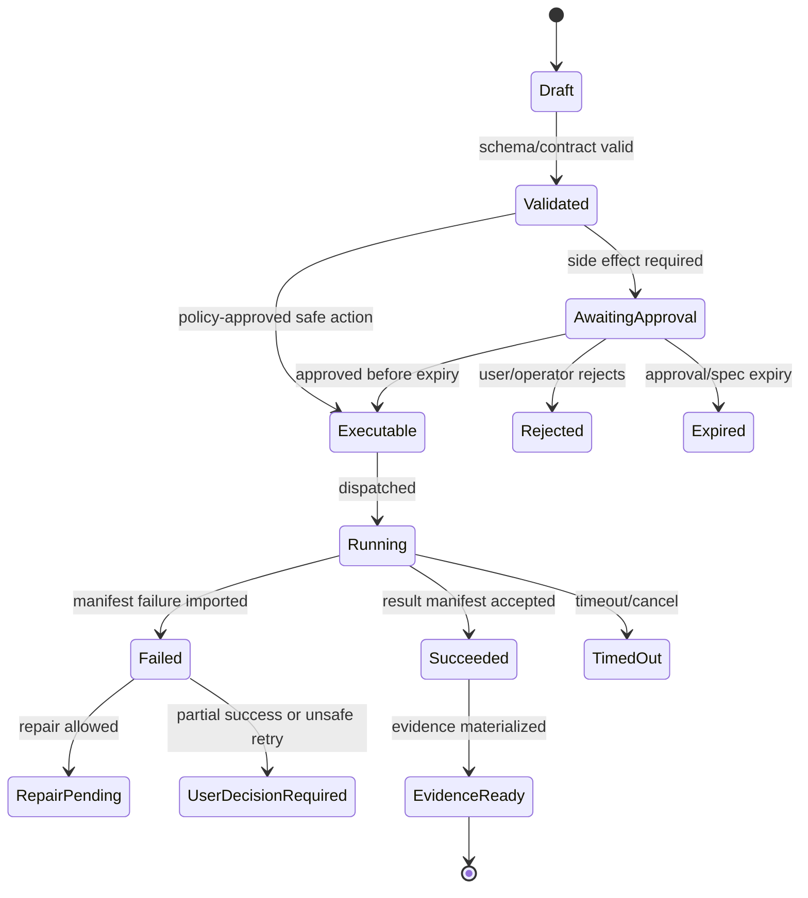

# BMAD Package Format

## V6.17 cross-delivery package contract

Package descriptors and bundles are delivery-neutral only when they carry a signed `PackageCompatibility` block: package/schema/BMAD versions, compatible product/host ranges, required capabilities, content inventory/digests, publisher/signing chain, revocation ID, and platform-specific assets. C# and Rust loaders must pass the same golden fixtures.

Cloud catalog registration/activation and desktop download/cache/activation are separate evidence events. Desktop never executes setup hooks merely from signature validity; local policy and an exact approved candidate still apply. Cloud revocation prevents new activation and is reconciled locally under explicit offline-grace rules.

## V6.18 current-authority package overlay

This overlay is the current authority for Method and Builder package interpretation. It is grounded in [[100 - BMAD Method and Builder Deep Comprehension Audit]] and supersedes conflicting universal-schema assumptions later in this historical reference.

### Source contract versus Sapphirus envelope

An upstream `SKILL.md` requires `name` and `description` frontmatter plus body content. Inputs, outputs, invocation metadata, permissions, compatibility, owner scope, and release provenance are not universal upstream frontmatter fields. Sapphirus stores those additions in its normalized, schema-versioned package envelope and must not reject an otherwise valid source skill merely because it lacks invented upstream metadata.

Likewise, source `module.yaml` shapes vary by Method/Builder profile. Do not require every upstream module to declare dependencies, capabilities, target metadata, or even the same version field. Normalize observed fields, preserve unknown metadata without trusting it, and require Sapphirus compatibility/security fields in the outer envelope before promotion.

### Explicit format profiles

Every parsed skill/package records one validation profile rather than passing through one universal Method validator:

| Profile | Meaning |
|---|---|
| `MethodOfficialSkillV6` | Official `bmad-*` skill and Method naming/path rules. |
| `MethodStepWorkflowV6` | Method step-file workflow using applicable `STEP-*` and sequence rules. |
| `BuilderOutcomeSkillV2` | User-built inline-first workflow/utility with descriptive progressive-disclosure references. |
| `BuilderUserAgentV2` | Stateless, memory, or autonomous agent output with agent metadata and archetype-specific assets. |
| `BuilderModuleV2` | Standalone self-registering or multi-skill setup-skill source module. |
| `InstalledPackage` | Installed workspace evidence and profile-specific config/help/manifests. |
| `SapphirusPromotion` | Delivery-neutral signed envelope, compatibility, inventory, provenance, and policy gates. |

Method `step-NN-*` rules apply only to the Method step-workflow profile. Builder v2 workflows are inline-first and use descriptive reference filenames; they must not be forced into numbered step files. Official `bmad-` naming rules likewise do not apply to user-built Builder skills, for which the prefix is reserved.

### Builder source shapes

| Output | Runtime package content | External/runtime state |
|---|---|---|
| Workflow/utility | `SKILL.md`; optional `references/`, `assets/`, approved `scripts/`, `agents/`, and opt-in `customize.toml`. | Working memlog or generated artifact state when the workflow declares it. |
| Stateless agent | Full-identity `SKILL.md`, always-present agent metadata in `customize.toml`, capability references/assets/scripts as needed. | None required. |
| Memory agent | Lean bootloader, agent metadata, First Breath and memory guidance, sanctum seed assets, `wake.py`, `init-sanctum.py`, capability references. | Owner/project-scoped sanctum outside package bytes. |
| Autonomous agent | Memory-agent package plus PULSE seed/routing declarations. | Sanctum plus a separately approved platform schedule; package installation does not schedule or activate it. |
| Multi-skill module | Member skills plus dedicated `{code}-setup` skill containing module assets and setup implementation. | Profile-specific installed config/help/manifests. |
| Standalone module | Skill plus `assets/module-setup.md`, `assets/module.yaml`, `assets/module-help.csv`, merge implementation, and optional distribution metadata. | Profile-specific installed config/help/manifests. |

Convert is not an upstream Builder v2 output flow. A converted package, when supported, is produced by a Sapphirus-owned import adapter and records both the source bytes and adapter identity in provenance.

### Package inclusion and exclusion

Build the package inventory from an allowlist. Recursive copying of an authoring directory is invalid.

| Class | Default treatment |
|---|---|
| Runtime instructions/resources | Include and hash `SKILL.md`, declared references/assets, approved scripts, agent definitions, and the baked customization base. |
| Module registration | Include only the assets/scripts required by the declared standalone or setup-skill shape. |
| Eval definitions | Optional, separately inventoried test component with its own schema/trust profile. |
| Authoring evidence | Exclude `.memlog.md`, module ideation plans, scratch files, source captures, and draft support files from runtime bytes; retain as scoped evidence. |
| Analysis/eval results | Exclude `.analysis/**`, HTML/Markdown reports, transcripts, grading, timing, run workspaces, and generated reports. Store under evidence retention policy. |
| Runtime state | Never include sanctums, session logs, learned capabilities, secrets, caches, checkpoints, or user/team override files. |

Symlinks, junctions/reparse points, device files, path traversal, duplicate normalized paths, case-colliding paths, and inventory entries outside the package root block import.

### Three configuration graphs and two install profiles

Keep these graphs distinct:

1. **Method central TOML:** installer-managed team/user config plus team/user custom overlays.
2. **Per-skill customization TOML:** baked `customize.toml` plus team and personal skill overrides, resolved by immutable package/skill identity rather than display name alone.
3. **Compatibility YAML:** profile-specific root or per-module YAML consumed by current Method/Builder skills and direct Builder setup.

`MethodCliV6` preserves canonical manifests, assembled help, central TOML, and compatibility YAML expected by installed skills. `StandaloneBuilderSetupV2` writes root YAML/help and performs a different migration. The loader normalizes both but never silently merges them, and the standalone cleanup flow must not execute against a Method CLI workspace.

### Eval components

Support explicit schemas instead of fuzzy discovery:

- `LegacyArtifactEvalV1`: `prompt`, `expectations`, optional expected output/setup overlays;
- `BuilderCaseV2`: `input`, `rubric`, optional `state_prefix` and fixture files;
- trigger cases: `query` plus `should_trigger`;
- normalized Sapphirus suite: immutable case IDs, bounded fixtures, adapter reference, baseline/candidate identity, grading contract, and expected result semantics.

Candidate packages cannot provide executable adapter argv or environment passthrough. Only platform-owned adapter IDs may bind a suite to a model/runtime. Setup overlays and fixtures are package data, remain within a sealed run root, and cannot replace the candidate, adapter, policy, or system instructions.

### Dependency and compatibility declaration

Every promoted envelope declares exact skill/tool/runtime dependencies, optional versus required status, immutable source/digest, runtime prerequisites, required capabilities, and delivery support. A textual skill reference or setup note is not a dependency lock. The Builder source package version, Builder module version, output format profile/version, BMAD compatibility, and Sapphirus release version remain separate fields.

> This file is part of the V6 implementation library, generated from the project context, review corrections, and the decomposed architecture library.


---

## Implementation-depth contract

This file is part of the V6 implementation library. It is written as an implementation guide, not as a strategy memo. Every component must be built against the same system-wide constraints:

1. **The first executable slice comes before breadth.** The first demonstrable product must prove authenticated chat, workspace context, typed plan output, proposal creation, Airlock validation, approval, isolated execution, validation, checkpoint, and evidence.
2. **The delivery-specific authority owns lifecycle state.** The web Runtime API imports remote-worker facts into SQL; the signed desktop Rust host imports local-executor facts into SQLite. Workers, child processes, renderers, models, sync services, and support APIs do not advance authoritative lifecycle state.
3. **Airlock creates the only side-effect token.** Workspace writes, command runs, exports, package imports, dependency restores, and policy-sensitive actions require an `ApprovedExecutionSpec` issued by Airlock.
4. **The model does not own proposals.** Model Gateway returns typed model outputs. Run Orchestrator creates normalized `Proposal` records. Airlock validates proposals.
5. **No raw shell by default.** Commands are represented as `argv[]` plus policy metadata; `sh -c`, shell expansion, broad environment access, and open network access are blocked unless explicitly operator-approved.
6. **Every side effect is reconstructable.** Diffs, preimages, spec hashes, policy hashes, approvals, job image digests, result manifests, logs, artifacts, and rollback metadata must be traceable.
7. **Each module has ports.** Even inside a modular monolith, use explicit interfaces and contracts to avoid creating a god control plane.


## 1. Component identity

| Field | Value |
|---|---|
| Component | `BMAD Package Format Reference` |
| Area | `BMAD contracts` |
| Primary implementation package | `packages/*` |
| Runtime/technology | `Markdown/YAML/TOML/CSV` |
| First-slice priority | `after-core or supporting` |


## 2. Purpose

Document expected BMAD package layouts, parser behavior, validation rules, and examples.

The implementation must be narrow enough to fit the corrected first vertical slice, but designed so BMAD package execution, the existing presentation adapter, Builder Studio, SkillOps, replay, and operator controls can plug into the same contracts later.

## Source-Aligned Package Contracts

These contracts are grounded in the reviewed BMAD Method and Builder source archives. See [[83 - BMAD Source Code Review - Method and Builder]].

### Skill Contract

| Field | Rule |
|---|---|
| Directory | A skill is a directory with a `SKILL.md` entrypoint. |
| Frontmatter | `SKILL.md` requires at least `name` and `description`; `name` must match the directory. |
| Optional content | Profile-specific content may include `references/`, `assets/`, `scripts/`, `agents/`, opt-in `customize.toml`, eval definitions, and legacy/source variants such as `resources/`, `prompts/`, or `templates/`. Every included path is declared and inventoried. |
| Official naming | Official BMAD skills use the `bmad-` prefix. |
| Builder naming | User-built standalone agents use `agent-{name}`; module agents use `{modulecode}-agent-{name}`; module workflows use `{modulecode}-{name}`. The `bmad-` prefix is reserved for official BMAD creations. |

### Module Contract

| Shape | Required files |
|---|---|
| Installed module | Module folder under `_bmad/{module-code}/` plus generated manifest/config evidence. |
| Source module | `module.yaml`, `module-help.csv`, and one or more skill directories. |
| Multi-skill Builder module | Setup skill with `assets/module.yaml` and `assets/module-help.csv`. |
| Standalone Builder module | Skill with `assets/module-setup.md`, `assets/module.yaml`, and `assets/module-help.csv`. |
| Distribution metadata | Optional `.claude-plugin/marketplace.json`. |

### Installed BMAD Folder Contract

| Artifact | Expected content |
|---|---|
| `_bmad/_config/manifest.yaml` | Installed package manifest. |
| `_bmad/_config/skill-manifest.csv` | `canonicalId,name,description,module,path`. |
| `_bmad/_config/files-manifest.csv` | `type,name,module,path,hash`. |
| `_bmad/_config/bmad-help.csv` | Assembled help catalog: the installer merges every installed module's `module-help.csv` into this single file, and the source `bmad-help` skill reads this file (not the per-module CSVs) at runtime. Rows with `_meta` in the `skill` column carry a module documentation URL/path in `output-location` (for example `llms.txt`) used to ground general help answers. |
| `_bmad/scripts/resolve_config.py` | Installed config resolver: four-layer TOML merge emitting merged JSON; stdlib-only, Python 3.11+ (`tomllib`), invoked via `uv run`. Companion scripts `resolve_customization.py` and `memlog.py` follow the same conventions. See [[69 - BMAD Validation Rules]] for the exact merge order and semantics. |
| `_bmad/config.toml` | Installer-managed central config. |
| `_bmad/config.user.toml` | Installer-managed user config. |
| `_bmad/custom/config.toml` | Team-owned override. |
| `_bmad/custom/config.user.toml` | User-owned override. |
| `_bmad/custom/{skill-name}.toml` | Team-owned per-skill override. |
| `_bmad/custom/{skill-name}.user.toml` | User-owned per-skill override. |

### Help Catalog Contract

`module-help.csv` must use this exact header:

```csv
module,skill,display-name,menu-code,description,action,args,phase,preceded-by,followed-by,required,output-location,outputs
```

Rows define user-visible capabilities and workflow graph hints. `phase`, `preceded-by`, `followed-by`, `required`, `output-location`, and `outputs` must be preserved as structured fields for the Help Advisor and validation reports.

### Registry and Web Bundle Contracts

- `bmad-modules.yaml` is the official bundled registry and supports channels, aliases, deprecation markers, npm package references, module definitions, and marketplace plugin metadata.
- `web-bundles/bundles.json` is a separate web-bundle shelf for ChatGPT/Gemini-style use. It has release metadata, personas, knowledge files, browsing/deep-research flags, and Stitch integration flags. Do not treat these bundles as installed runtime skills unless an adapter explicitly imports them.

### OpenClaw-Informed Descriptor Additions

BMAD package metadata stays canonical, but the package format should reserve typed extension fields for future compatibility:

| Field | Purpose |
|---|---|
| `compatibility` | Runtime API version, BMAD schema version, Builder output version, minimum host version, and migration requirements. |
| `configSchema` | JSON Schema for package-owned configuration. |
| `uiHints` | Data-only hints for package settings, commands, forms, and display labels. |
| `contracts` | Declared artifacts, tools, workflows, outputs, and validation contracts. |
| `installPolicy` | Required trust level, allowed dependency restore behavior, network needs, and migration permissions. |
| `provenance` | Source archive hash, file inventory hash, builder version, validation run, scan result, and install rehearsal refs. |

Runtime loaders must preserve unknown extension metadata in a typed extension bag, but unknown metadata cannot grant capabilities or relax policy.


## 3. Owns / does not own

### Owns
- Detailed implementation guidance
- Cross-reference to related component files
- Acceptance criteria
- Test expectations

### Does not own
- Replacing source context
- Implicit architecture changes without ADR


## 4. Public/API surface and internal ports

### Required API/routes or callable operations
- `See route catalog and block-specific files`


### Internal contract rules

- Every boundary uses typed, schema-versioned values. C# uses `Runtime.Contracts` / `Runtime.Domain`, Rust uses generated contract types plus `desktop-domain`, and TypeScript uses generated web or desktop facade types; no generated DTO grants runtime authority.
- External payloads must be schema-versioned. Internal objects may evolve faster but must not leak into OpenAPI without a contract version.
- Every state mutation must be idempotent or protected by optimistic concurrency.
- Every side-effect operation must receive an `ApprovedExecutionSpec` or be provably read-only.
- Every error response must use the standard error envelope with `code`, `message`, `correlationId`, `retryable`, and optional `detailsRef`.


### Starter interface/type sketch

```python
@dataclass(frozen=True)
class WorkerInvocation:
    job_id: str
    approved_spec_path: Path
    checkout_path: Path
    output_dir: Path
    log_dir: Path
```


## 5. State model

### Component states
- `draft`
- `reviewed`
- `accepted`
- `implemented`
- `verified`


### Generic side-effect lifecycle





## 6. Persistence responsibilities

### SQL tables or domain records touched
- `See data model and DDL starter where applicable`

### Blob/object storage paths touched
- `See blob layout reference where applicable`


### Persistence rules

- In `web_managed`, SQL stores lifecycle state, compact indexes, ownership metadata, and references. In `windows_local`, SQLite stores the corresponding local authority records.
- In `web_managed`, Blob stores large immutable payloads: snapshots, logs, diffs, manifests, artifacts, exports, packages, traces, and validation reports. In `windows_local`, encrypted local content-addressed storage holds authority-owned payloads; cloud upload is explicit and purpose-scoped.
- Any Blob payload referenced from SQL must include content hash, schema version, created timestamp, and retention class.
- No raw secrets, broad credentials, or unredacted prompt/context payloads are stored by default.
- Migrations must be forward-safe and testable against fixture data.


## 7. Detailed implementation steps


### Phase 0 — Contract and spike

1. Create or update the relevant ADR before implementation when the decision affects hosting, policy, security, data ownership, or external dependencies.

2. Define public DTOs and durable JSON schemas first. Do not let implementation classes silently become external contracts.

3. Create a minimal fixture that exercises the component without requiring the whole platform.

4. Add negative tests for the most dangerous bypass or failure case before adding the happy path.

5. Record assumptions in the component file and in the ADR index if they are not final.

6. For `BMAD Package Format Reference`, implement only the smallest behavior that proves its contract in the first executable slice, then add extended BMAD/Builder/artifact behavior after gate approval.


### Phase 1 — Skeleton implementation

1. Create the package/module/folder with explicit ports/interfaces and dependency direction rules.

2. Add dependency injection registration with narrow interfaces rather than passing broad services everywhere.

3. Implement persistence only through repository/store abstractions that expose business operations, not raw table access.

4. Emit structured events for every important state transition even if the UI does not yet render them.

5. Add unit tests for object creation, invalid input, authorization/policy denial, and idempotency where relevant.

6. For `BMAD Package Format Reference`, implement only the smallest behavior that proves its contract in the first executable slice, then add extended BMAD/Builder/artifact behavior after gate approval.


### Phase 2 — First vertical integration

1. Connect the component to the first executable slice only. Avoid adding full future scope before the vertical path works.

2. Use fake/stub adapters for expensive external systems until the contract is proven.

3. Make all side effects flow through Proposal → AirlockDecision → Approval/Grant → ApprovedExecutionSpec → Dispatch.

4. Persist large payloads to Blob and store only compact references in SQL.

5. Return UI-consumable run events so the Chat Workbench can render progress without polling raw tables.

6. For `BMAD Package Format Reference`, implement only the smallest behavior that proves its contract in the first executable slice, then add extended BMAD/Builder/artifact behavior after gate approval.


### Phase 3 — Production hardening

1. Add telemetry attributes, correlation IDs, redaction, and audit events.

2. Add retry, timeout, cancellation, and stale-state handling.

3. Add migration scripts and seed data for dev/test.

4. Add operator visibility for status, errors, budget/policy impact, and cleanup status.

5. Document runbooks for the top failure modes.

6. For `BMAD Package Format Reference`, implement only the smallest behavior that proves its contract in the first executable slice, then add extended BMAD/Builder/artifact behavior after gate approval.


### Phase 4 — Regression and release gate

1. Add contract tests against OpenAPI/JSON Schema.

2. Add replay fixtures or golden outputs where deterministic behavior is expected.

3. Add security tests for prompt injection, secret leakage, excessive agency, insecure output handling, and supply-chain drift where relevant.

4. Update release gate evidence with screenshots/log excerpts/manifests rather than informal claims.

5. Mark open risks and deferred v1.5/v2 items explicitly.

6. For `BMAD Package Format Reference`, implement only the smallest behavior that proves its contract in the first executable slice, then add extended BMAD/Builder/artifact behavior after gate approval.


## 8. Validation and test plan

### Required tests
- guide completeness review
- cross-reference check
- acceptance criteria check


### Minimum test layers

| Layer | What to test | Required before merge |
|---|---|---|
| Unit | object validation, state transitions, parsing, policy predicates | yes |
| Contract | OpenAPI/JSON Schema compatibility, generated clients, worker manifests | yes for public/durable payloads |
| Integration | SQL + Blob references, dispatch/import, authz, Airlock boundary | yes for side-effect paths |
| E2E | chat → proposal → approval → execution → evidence | yes for first slice files |
| Replay/golden | BMAD package fixtures, presentation adapter, evidence bundle | yes before v1 beta |
| Security negative | prompt injection, secret leak, policy bypass, path traversal, raw shell | yes for all side-effect components |


## 9. Failure modes and recovery

| Failure | Detection | Required behavior | User/operator visibility |
|---|---|---|---|
| Invalid schema | contract validation | reject before persistence or dispatch | show actionable error with correlation ID |
| Stale proposal/preimage | hash mismatch | void proposal or require rebase/new proposal | show stale context warning |
| Approval expired | expiry check | reject dispatch | show re-approve option |
| Policy mismatch | policy hash mismatch | reject spec | operator audit event |
| Worker timeout | job monitor | mark job timed out; preserve partial logs | timeline event + retry option if safe |
| Manifest missing/invalid | manifest import validation | do not advance success state | incident/failure card |
| Partial success | checkpoint/validation state | enter `user_decision_required` or `kept_for_repair` | explicit decision card |
| Secret detected | scanner/redactor | redact and block if high confidence | security finding card/operator event |


## 10. Security and policy requirements

- Treat workspace files, package files, generated artifacts, model outputs, and logs as untrusted input.
- Never let untrusted content override system instructions, Airlock policy, command allowlists, network policy, or secret handling.
- Enforce project-level authorization on every read and write.
- Log security-relevant denials as audit events, but do not include raw secret values.
- Prefer fail-closed behavior when policy, identity, schema, or storage checks are ambiguous.
- Add negative tests for the most likely bypass path before writing happy-path code.


## 11. Observability

Minimum telemetry fields for this component:

- `correlation.id`
- `project.id`
- `run.id` when available
- `component.name`
- `operation.name`
- `operation.outcome`
- `policy.version` when applicable
- `spec.id` when applicable
- `job.id` when applicable
- `artifact.id` when applicable
- redaction counters, not raw secrets

Metrics to consider: request latency, state-transition count, policy denials, approval wait time, job duration, manifest import failures, schema validation failures, retry count, budget blocks, and evidence materialization time.


## 12. Acceptance criteria

- [ ] The component has a clear owner package and does not leak responsibilities into unrelated modules.
- [ ] Public routes/payloads are represented in OpenAPI/JSON Schema where applicable.
- [ ] Side-effect paths cannot execute without Airlock evaluation and `ApprovedExecutionSpec`.
- [ ] SQL lifecycle state is mutated only by the Runtime API/Application layer.
- [ ] Blob payloads have content hashes and schema versions.
- [ ] Tests include at least one negative/bypass case.
- [ ] Events and evidence are emitted for user-visible actions.
- [ ] The component is represented in the release gate matrix.
- [ ] The implementation does not introduce Cortex as a runtime namespace.
- [ ] Documentation includes deferred v1.5/v2 scope explicitly rather than silently omitting it.


## 13. Integration checklist

- [ ] Update `32 - Integration Contract Map.md` with any new caller/callee relationship.
- [ ] Update `25 - OpenAPI, Schemas, and Generated Clients.md` for public route or schema changes.
- [ ] Update `22 - Data Model - SQL and Blob.md`, `47 - Database DDL Starter.md`, or `48 - Blob Storage Layout.md` for persistence changes.
- [ ] Update `27 - Testing, Validation, and Replay.md` for new fixtures or replay needs.
- [ ] Update `33 - Release Gates and Acceptance Matrix.md` if the change affects release readiness.
- [ ] Add or update ADR in `31 - Architecture Decision Records.md` if the change alters architecture, hosting, policy, or security posture.


## BMAD package parser checklist

1. Detect BMAD root and `_bmad` folder.
2. Parse `bmad-modules.yaml` registry metadata if present.
3. Discover each module folder and parse `module.yaml`.
4. Parse `module-help.csv`; validate columns, menu codes, action names, expected outputs, and phase hints.
5. Discover `SKILL.md`; resolve its format/validation profile and parse source-required frontmatter separately from the Sapphirus envelope.
6. Resolve the declared install profile and validate central TOML, per-skill customization TOML, and compatibility YAML as separate graphs.
7. Preserve unknown metadata in a typed extension bag without granting authority.
8. Build capability, dependency, customization, and external-runtime requirement graphs.
9. Validate duplicate capabilities, missing dependencies, orphan help rows, invalid output paths, setup assets, generated skill directories, unsafe paths/links, and package inclusion/exclusion rules.
10. Register only validated packages/capabilities as inactive; promotion and activation remain separate gates.

### Do not do this

- Do not treat generic workflow YAML as BMAD without an adapter.
- Do not execute package scripts during parse.
- Do not let package content mutate Airlock policy.
- Do not fabricate Help Advisor actions outside installed package metadata.


---

## Historical Revision Notes (V3 -> V4)
## Review finding

`39 - BMAD Package Format.md` is part of the implementation library support layer. In v3, support files were useful but not always testable. In v4, every support file must provide either a decision, reference contract, release gate, mapping, runbook, or checklist that can be executed by a developer or coding agent.

## Required usage

1. Read this file before changing the related implementation area.
2. Cross-check it against `07 - Source Coverage Matrix.md` and `50 - V4 Full Library Audit.md`.
3. When implementing a task, copy the relevant checklist items into the issue/story.
4. When a decision changes, update this file and `31 - Architecture Decision Records.md` in the same PR.
5. When a contract changes, update `25 - OpenAPI, Schemas, and Generated Clients.md`, `46 - API Route Catalog.md`, and generated clients.

## V4 quality rules for this file

- It must not contradict locked architecture decisions.
- It must not reintroduce a broad v1 scope that competes with the executable vertical slice.
- It must preserve BMAD source contracts and the existing presentation workflow adapter decision.
- It must reflect the Runtime API as lifecycle state owner and the worker as manifest/log producer only.
- It must identify whether guidance is `LOCKED`, `TEMPORARY`, `PHASE-0 SPIKE`, `V1`, `V1.5`, or `V2`.

## Implementation checklist linkages

| Related guide | What to cross-check |
|---|---|
| `01 - First Build - Executable Vertical Slice.md` | Does this file support or distract from the first slice? |
| `29 - Concurrency, Transactions, and Failures.md` | Are state and partial failure semantics compatible? |
| `32 - Integration Contract Map.md` | Are producer/consumer boundaries clear? |
| `33 - Release Gates and Acceptance Matrix.md` | Is there a release gate for this guidance? |
| `49 - Detailed Component Build Checklists.md` | Are implementation tasks represented as checklist items? |

## Hermes-Informed SkillOps and Package Safety

Source: [[86 - Hermes Source Code Review - Agent Runtime and Learning Loop]].

Add these package-safety rules:

| Rule | Requirement |
|---|---|
| Trust-aware scan | External BMAD packages and skills are scanned before activation. Dangerous community findings block activation. |
| Entrypoint always scanned | `SKILL.md`, package manifests, and help catalogs cannot be excluded by ignore files. |
| Metadata before import | Catalog discovery parses metadata without importing package code. |
| Synthetic namespace | User package code cannot shadow first-party runtime modules. |
| Staged writes | Builder and background SkillOps write `SkillPackageProposal` records before changing active package state. |
| Read-before-write | Autonomous package maintenance may patch only content it has read in the same review context. |
| Pinned package deletion guard | Pinned packages cannot be deleted by automated cleanup, though reviewed patches may still apply. |
| Optional dependencies | Provider/package-specific dependencies are optional/lazy and must not mutate the core dependency graph during a run. |

Package activation requires: manifest parse, trust classification, scanner verdict, dependency lock validation, capability registration, Airlock approval when side effects exist, and post-activation availability snapshot.

## Hermes Deep-Review Package Interface Requirements

Source: [[87 - Hermes Deep Review - Extension Runtime and Operational Contracts]].

Package manifests should declare the extension surface they provide rather than relying on path conventions alone:

| Manifest field | Requirement |
|---|---|
| `extension_type` | One of `skill`, `tool`, `platform_adapter`, `model_provider`, `memory_provider`, `context_engine`, `secret_source`, `dashboard_auth`, or `artifact_adapter`. |
| `activation_mode` | `explicit`, `profile_default`, or `operator_enabled`; context engines and external memory providers cannot be auto-enabled by install. |
| `cloud_data_disclosure` | Required for memory/context/search providers that send messages, tool results, file paths, or workspace data off-device. |
| `setup_schema` | Minimal required fields only; secret fields map to secret storage, not plain package config. |
| `tool_contract` | Required for tools: schema, availability check, result shape, error shape, dangerous-action class, and toolset membership. |
| `credential_scope` | Required for adapters/providers using exclusive credentials or endpoint-bound API keys. |

## Odysseus-Informed Skill Retrieval Rules

Source: [[88 - Odysseus Source Code Review - Self-Hosted AI Workspace]].

Add these package and skill metadata requirements:

| Rule | Requirement |
|---|---|
| Stable skill id | Stored skill id is stable even when frontmatter display name changes. |
| Owner scope | User-authored skills, memory providers, and package overrides carry owner scope and cannot shadow first-party packages. |
| Retrieval audit | `SkillRetrievalAudit` records trigger terms, broad tag findings, necessary/not-necessary examples, and advisory LLM-judge output. |
| Tool unlock scope | Skills that unlock tools declare exact toolsets; broad skills cannot silently unlock privileged execution tools. |
| Untrusted skill text | Skill text is model data until activated by package policy; it cannot override system policy during review. |
