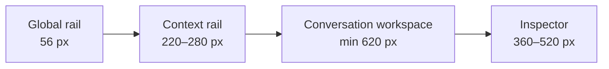
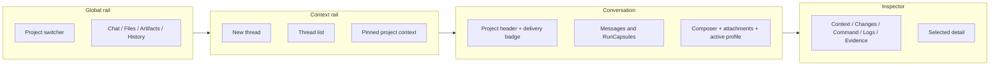
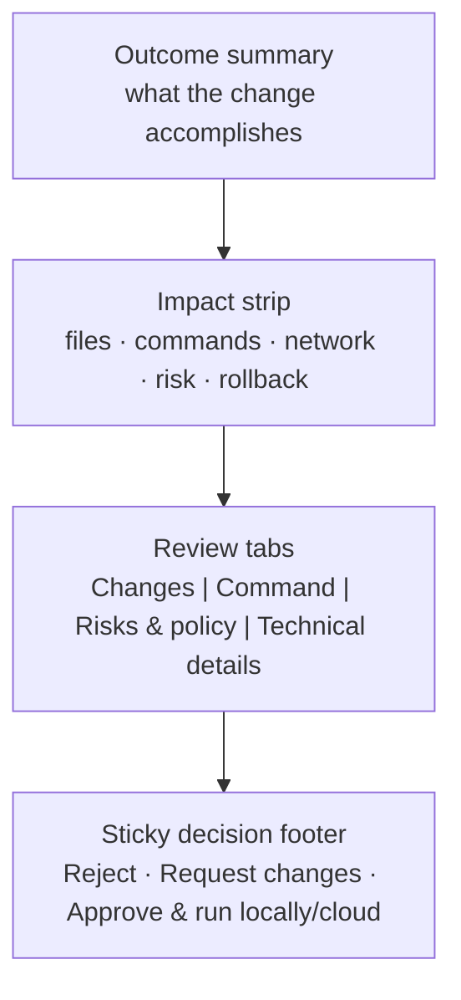
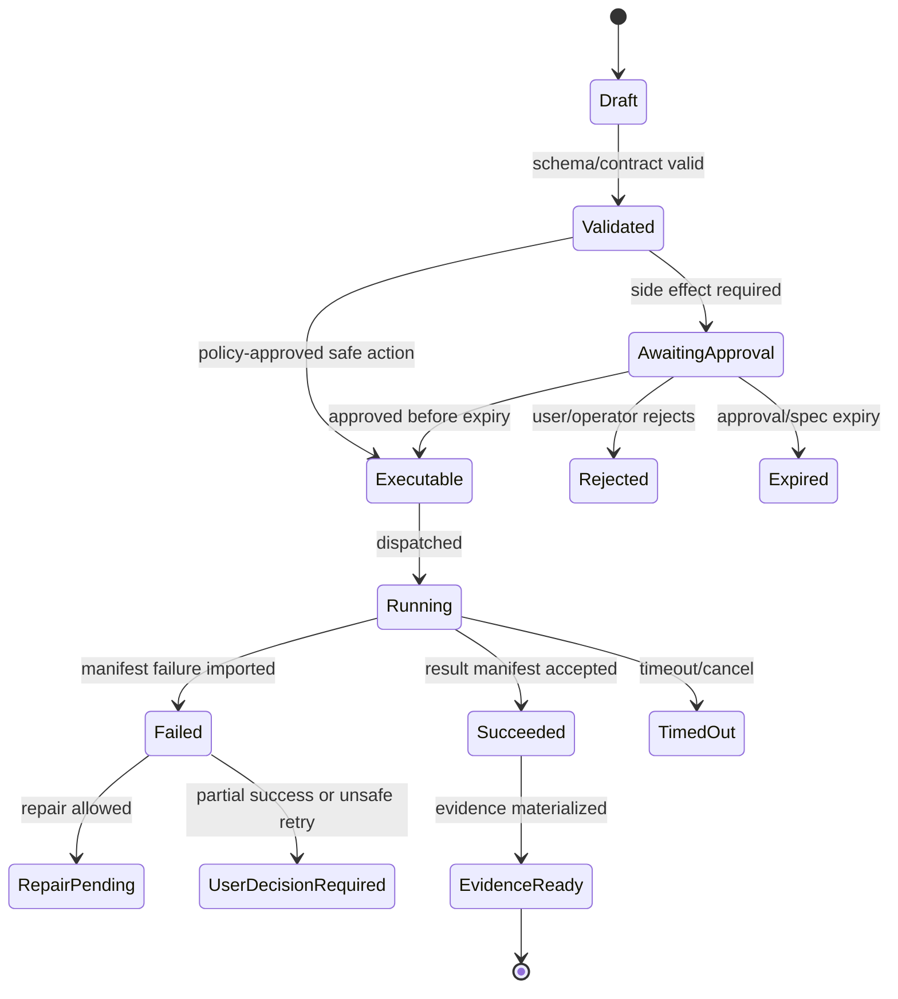

# Product UX Flows and Wireframe Notes

## V6.17 user journeys must show the boundary

The web flow starts with sign-in and cloud project creation/import/upload; files are copied/cloned into a managed workspace and changes execute remotely. The desktop flow starts with signed install, sign-in/entitlement, data-boundary explanation, native folder selection, local context preview, local diff/command approval, checkpoint, local execution, evidence, and rollback.

Every workspace header visibly says **Cloud workspace** or **Local folder**. Desktop context egress, sync, diagnostic upload, and remote job each have separate consent/review screens. A returned remote patch is labeled **Cloud result — not applied**, then enters a new local proposal/approval flow. Containment warnings reflect the verified DESK-01 profile rather than claiming a sandbox.

> This file is part of the V6 implementation library, generated from the project context, review corrections, and the decomposed architecture library.

## V6.18 canonical UX blueprint

This section is the product-design source of truth for the first user-facing implementation. It replaces generic dashboard assumptions with a **calm technical workbench**: conversation-led, evidence-backed, compact without feeling cramped, and explicit about every authority boundary.

The visual reference is Odysseus's productive workspace model, not its implementation. Keep the useful patterns—persistent navigation, collapsible work areas, density preferences, dark/light themes, keyboard paths, and visible background-job state—while avoiding its monolithic stylesheet, all-monospace chrome, decorative background effects, modal sprawl, and animation on nearly every control. Sapphirus must feel quieter, more structured, and easier to audit.

### 1. Product experience principles

1. **One obvious next decision.** Every state emphasizes the next safe action; secondary technical detail remains available without competing for attention.
2. **Conversation is the narrative, the inspector is the evidence.** Chat explains intent and outcomes. Context, diffs, commands, logs, policy, and evidence open in a stable inspector rather than becoming an endless stack of large cards.
3. **A run is one object.** Context, plan, proposal, approval, execution, validation, and evidence are grouped into one `RunCapsule` with a five-stage rail: `Understand → Plan → Review → Execute → Evidence`.
4. **State language is literal.** Use `Proposed`, `Awaiting approval`, `Running locally`, `Running in cloud`, `Applied`, `Validation failed`, `Validated`, `Rolled back`, `Blocked`, `Stale`, and `Expired`. Never use a generic `Done` state.
5. **Trust before speed.** The user can always answer: what will change, where it will run, what data leaves the device, what command will execute, whether rollback exists, and what evidence will remain.
6. **Progressive disclosure, not hidden state.** Summaries are concise, but important detail is one click or keyboard action away and never buried behind an unlabeled icon.
7. **Density without visual noise.** Use open surfaces, dividers, rows, and a single inspector. Avoid nested cards, bento layouts, excessive pills, glow effects, and decorative metrics.

### 2. Primary information architecture

Normal users see only the surfaces needed for project work. Builder and Operator remain capability-gated and do not crowd the main project navigation.

| Level | Navigation | Purpose |
|---|---|---|
| Global | Projects, Activity, command palette, account | Find a workspace or resume an attention-requiring run. |
| Project | Chat, Files, Artifacts, History | Perform work and inspect its durable outputs. |
| Context rail | Threads when in Chat; tree when in Files; versions when in Artifacts | Navigate within the selected project surface. |
| Inspector | Context, Changes, Command, Logs, Evidence | Review the selected run or artifact without losing conversational position. |
| Capability-gated | Builder Studio | Import, validate, rehearse, and register BMAD packages. |
| Separately gated | Operator Console | Operate platform health and policy; never appear as a normal project tab. |

Do not put model health, raw budget, user role, every active service, or operator status in the global header. Surface those only when they affect the current action. The project header contains only the project name, persistent delivery badge, current branch/checkpoint summary, current run state when active, and a compact overflow menu.

### 3. Responsive application shell

The desktop shell uses four regions, but only the conversation and global rail are mandatory at every wide breakpoint.



| Viewport | Required behavior |
|---|---|
| `≥ 1440 px` | Show global rail, context rail, conversation, and inspector when opened. Both secondary regions are resizable and collapsible. |
| `1200–1439 px` | Keep the global rail and conversation. Collapse the context rail after selection; allow either context rail or inspector beside the conversation, not both by default. |
| `768–1199 px` | Use one primary workspace plus the global rail. Context and inspector open as non-modal sheets that preserve selection and focus. |
| `< 768 px` | Use a single-column review companion: Chat, Review, and Activity become full-screen routes. Mobile supports review, approval, stop, evidence, and rollback decisions; it is not a miniature desktop IDE. |

Desktop and web may use the same geometry, but their persistent delivery badge is never collapsed into color alone:

- `Cloud workspace` with a cloud icon and remote execution wording;
- `Local folder` with a device/folder icon and local execution wording;
- `Cloud result — not applied` for a returned remote patch on desktop.

### 4. Workbench wireframe — default state



The default conversation column should read comfortably at `680–820 px`. The composer is sticky inside that column, not across the inspector. The inspector never covers the approval footer on desktop. Empty conversation copy offers three grounded actions only: ask about the workspace, plan a small change, or select a BMAD action recommended by Help Advisor.

### 5. RunCapsule anatomy

Replace the current one-card-per-event presentation with this hierarchy:

| Layer | Visible by default | Purpose |
|---|---|---|
| Run header | User request summary, current stage, elapsed time, delivery target | Orient the user without exposing implementation noise. |
| Stage rail | Understand, Plan, Review, Execute, Evidence | Show progress and where attention is required. |
| Active stage body | One concise summary and at most one primary action | Keep the next decision obvious. |
| Inspector link | `Review context`, `Review changes`, `View command`, `Open logs`, `View evidence` | Move dense material to the stable inspector. |
| Technical details | IDs, hashes, provider calls, policy version, correlation ID | Support audit and troubleshooting without dominating the workflow. |

Completed stages collapse to a single summary row. A completed run collapses to its outcome, changed-file count, validation result, evidence link, and rollback availability. The user may expand it without losing scroll position.

### 6. First vertical-slice journey

#### Step 1 — Project entry

**Web:** offer `Clone repository`, `Import archive`, or `Upload files`. Explain that the result becomes a managed cloud workspace before the user continues.

**Desktop:** open with `Choose local folder`. Before indexing, show a short data-boundary review: what stays local, what context may be sent to the selected model, and that writes/commands require a separate review.

Health: the user should reach a useful empty workspace without configuring optional services. Provider or service degradation appears as a contextual banner with `Retry`, `Reconfigure`, and `View redacted details`.

#### Step 2 — Ask and understand

The user submits a request. The new `RunCapsule` opens at `Understand` and shows plain-language progress such as `Selecting relevant workspace context`. The Context inspector lists each included source with reason, trust label, line range, token estimate, and redaction state.

Do not animate every discovered file into the timeline. Update a stable count and announce only meaningful state changes through a controlled live region.

#### Step 3 — Plan

The capsule moves to `Plan` and shows:

- the intended outcome in one sentence;
- 3–7 ordered steps;
- affected areas, not raw path dumps;
- known risks;
- validation strategy;
- `Review full plan` when more detail exists.

The primary action is `Continue to review`; `Revise plan` is secondary. Planning does not imply approval or execution.

#### Step 4 — Review proposal

The capsule shows an impact summary and a single primary action: `Review changes`. Opening it focuses the inspector on a dedicated review surface.



Approval is never a small icon next to a hash. The exact candidate hash and policy hash remain available under `Technical details`, while the first view explains the human impact. High-risk actions require an explicit confirmation step, but never ask the user to retype arbitrary phrases for routine approvals.

Button labels include the boundary: `Approve & run in cloud`, `Approve & run locally`, `Approve export`, or `Approve package activation`. A generic `Run` button is prohibited.

#### Step 5 — Execute and validate

After approval, the same capsule advances to `Execute`. It shows current phase, elapsed time, safe stop availability, and the most recent meaningful output. Logs stream in the inspector with pause-autoscroll, search, copy-redacted-output, and truncation notice.

Do not use an indeterminate spinner for a known multi-phase job. Use discrete phases such as `Preparing checkpoint`, `Applying patch`, `Running validation`, and `Importing evidence`. Never estimate a percentage unless the executor supplies real progress.

#### Step 6 — Resolve partial failure

Partial failure is an explicit decision state, not a red toast. The capsule says what succeeded, what failed, and what currently exists in the workspace. Available actions are shown only when valid:

- `Propose repair`;
- `Rollback to checkpoint`;
- `Keep current state`;
- `View failure evidence`.

The default focus is the safest reversible option, but focus placement must not trigger it. Non-reversible side effects state that rollback is unavailable and explain why.

#### Step 7 — Evidence and completion

The final stage is `Evidence`, not `Done`. Show outcome, validation status, changed files, execution location, approval identity, checkpoint/rollback state, and artifact links. Technical hashes and trace references live in the Evidence inspector.

On success the capsule collapses after the user moves on, but the evidence link remains visible. On failure it stays expanded until the user makes a decision or dismisses it explicitly.

### 7. Approval review content order

Every governed approval surface uses the same order:

1. **Outcome:** what the user is authorizing.
2. **Workspace impact:** file count, named high-risk paths, create/update/delete summary.
3. **Execution:** local/cloud location, command display as `argv[]`, working directory, timeout, and worker identity when applicable.
4. **External access:** network mode, domains or service class, and which data class may leave the workspace.
5. **Safety:** risk reasons, checkpoint, rollback availability, expiry, and stale/preimage state.
6. **Decision:** reject, request revision, or a boundary-specific approval action.
7. **Technical details:** candidate/spec/policy hashes, IDs, schema versions, and correlation references.

The decision footer remains visible while details scroll. Approval controls disable with a visible reason when state becomes stale, expired, denied, or disconnected. Reconnection never silently re-enables an old decision.

### 8. Empty, loading, stale, and degraded states

| State | Required treatment |
|---|---|
| Initial load | Shell skeleton mirrors final geometry; no fake card content or shimmering paragraph blocks. |
| Empty project | One explanation, one primary action, up to two secondary examples. |
| No search result | Preserve the query, explain which scope was searched, offer clear reset. |
| Stream reconnecting | Non-blocking status near the run header; keep last confirmed state visible. |
| Stale proposal | Lock approval, name the source of drift, and offer `Refresh proposal`. |
| Provider degraded | Explain effect on this request; show retry/fallback only when policy allows it. |
| Tool unavailable | Name the category: permission, policy, missing dependency, health, or unsupported delivery target. |
| Context compacted | Add a subtle stage event with summarized token count and protected recent-message status. |
| Output truncated | Keep bounded preview, show total/retained size, and link the durable redacted output. |
| Permission denied | Do not leak resource existence; explain the role or project access needed. |

Toasts are for transient confirmations such as `Copied`. Failures that affect the task remain inline in the owning capsule or inspector.

### 9. Keyboard, focus, and screen-reader contract

- `Ctrl/Cmd + K` opens the command palette; `Ctrl/Cmd + Enter` submits the composer when focus is inside it.
- All shortcuts are discoverable, remappable where practical, and disabled while typing unless scoped to the focused control.
- Opening the inspector moves focus to its heading only when the user explicitly requested it. Closing restores focus to the exact trigger.
- Panel resize handles are keyboard operable, have a visible focus state, and announce current size.
- New run stages use one polite live-region announcement; streaming tokens and log lines are not announced individually.
- Diff review supports next/previous file and hunk commands, line-number labels, and a non-color change indicator.
- Status, risk, and delivery target always combine icon, text, and semantic description; color is supplementary.
- At `200%` browser zoom the flow remains operable without two-dimensional page scrolling. Internal diff/code regions may scroll horizontally when line wrapping is disabled.

### 10. Motion behavior

Motion supports orientation and state continuity only. The canonical timing and library rules live in [[26 - Frontend Design System]]. For these flows:

- animate inspector and context-rail entrance with opacity plus no more than `8 px` translation;
- animate a new capsule or stage summary once, never on every stream update;
- morph approval to execution with a restrained crossfade so the decision feels causally connected;
- keep logs, diffs, risk indicators, errors, and approval buttons free of bounce, shake, parallax, glow, and perpetual pulse;
- replace large transforms with opacity-only transitions when reduced motion is requested;
- never delay a user action so an animation can finish.

### 11. Usability and visual acceptance gate

Before implementation is considered ready, test the first slice with at least five representative participants or internal proxies and record evidence for these tasks:

1. identify whether the workspace is local or cloud in under five seconds;
2. explain the difference between proposed, approved, applied, and validated;
3. find every file and command affected by an approval;
4. identify whether network access and rollback are available;
5. stop a running job and recover from validation failure;
6. find evidence for a completed run after the capsule collapses;
7. complete the review flow at `1280×720`, `1440×900`, narrow tablet width, keyboard-only, and reduced-motion mode.

Release blocks on ambiguous approval wording, clipped decision controls, inaccessible resize handles, focus loss, mobile overflow, status expressed only by color, unbounded timeline-card growth, or any screen where the next safe action is not clear.


---

## Implementation-depth contract

This file is part of the V6 implementation library. It is written as an implementation guide, not as a strategy memo. Every component must be built against the same system-wide constraints:

1. **The first executable slice comes before breadth.** The first demonstrable product must prove authenticated chat, workspace context, typed plan output, proposal creation, Airlock validation, approval, isolated execution, validation, checkpoint, and evidence.
2. **The delivery-specific authority owns lifecycle state.** The web Runtime API imports remote-worker facts into SQL; the signed desktop Rust host imports local-executor facts into SQLite. Workers, child processes, renderers, models, sync services, and support APIs do not advance authoritative lifecycle state.
3. **Airlock creates the only side-effect token.** Workspace writes, command runs, exports, package imports, dependency restores, and policy-sensitive actions require an `ApprovedExecutionSpec` issued by Airlock.
4. **The model does not own proposals.** Model Gateway returns typed model outputs. Run Orchestrator creates normalized `Proposal` records. Airlock validates proposals.
5. **No raw shell by default.** Commands are represented as `argv[]` plus policy metadata; `sh -c`, shell expansion, broad environment access, and open network access are blocked unless explicitly operator-approved.
6. **Every side effect is reconstructable.** Diffs, preimages, spec hashes, policy hashes, approvals, job image digests, result manifests, logs, artifacts, and rollback metadata must be traceable.
7. **Each module has ports.** Even inside a modular monolith, use explicit interfaces and contracts to avoid creating a god control plane.


## 1. Component identity

| Field | Value |
|---|---|
| Component | `Product UX Flows and Wireframe Notes` |
| Area | `product design` |
| Primary implementation package | `packages/ui`, `apps/web`, and `apps/desktop-ui` |
| Runtime/technology | `Markdown + mermaid` |
| First-slice priority | `foundational; approve the UX blueprint before first-slice route implementation` |


## 2. Purpose

Detail user flows for developer, everyday user, builder, reviewer, and operator personas.

The implementation must be narrow enough to fit the corrected first vertical slice, but designed so BMAD package execution, the existing presentation adapter, Builder Studio, SkillOps, replay, and operator controls can plug into the same contracts later.


## 3. Owns / does not own

### Owns
- Detailed implementation guidance
- Cross-reference to related component files
- Acceptance criteria
- Test expectations

### Does not own
- Replacing source context
- Implicit architecture changes without ADR


## 4. Public/API surface and internal ports

### Required API/routes or callable operations
- `See route catalog and block-specific files`


### Internal contract rules

- Every boundary uses typed, schema-versioned values. C# uses `Runtime.Contracts` / `Runtime.Domain`, Rust uses generated contract types plus `desktop-domain`, and TypeScript uses generated web or desktop facade types; no generated DTO grants runtime authority.
- External payloads must be schema-versioned. Internal objects may evolve faster but must not leak into OpenAPI without a contract version.
- Every state mutation must be idempotent or protected by optimistic concurrency.
- Every side-effect operation must receive an `ApprovedExecutionSpec` or be provably read-only.
- Every error response must use the standard error envelope with `code`, `message`, `correlationId`, `retryable`, and optional `detailsRef`.


### Starter interface/type sketch

```ts
export type UiLoadState = 'idle' | 'loading' | 'ready' | 'stale' | 'blocked' | 'error';

export interface RunEventViewModel {
  runId: string;
  eventId: string;
  kind: string;
  occurredAt: string;
  severity: 'info' | 'warning' | 'error';
  summary: string;
  payloadRef?: string;
}
```


## 5. State model

### Component states
- `draft`
- `reviewed`
- `accepted`
- `implemented`
- `verified`


### Generic side-effect lifecycle





## 6. Persistence responsibilities

### SQL tables or domain records touched
- `See data model and DDL starter where applicable`

### Blob/object storage paths touched
- `See blob layout reference where applicable`


### Persistence rules

- In `web_managed`, SQL stores lifecycle state, compact indexes, ownership metadata, and references. In `windows_local`, SQLite stores the corresponding local authority records.
- In `web_managed`, Blob stores large immutable payloads: snapshots, logs, diffs, manifests, artifacts, exports, packages, traces, and validation reports. In `windows_local`, encrypted local content-addressed storage holds authority-owned payloads; cloud upload is explicit and purpose-scoped.
- Any Blob payload referenced from SQL must include content hash, schema version, created timestamp, and retention class.
- No raw secrets, broad credentials, or unredacted prompt/context payloads are stored by default.
- Migrations must be forward-safe and testable against fixture data.


## 7. Detailed implementation steps


### Phase 0 — Contract and spike

1. Create or update the relevant ADR before implementation when the decision affects hosting, policy, security, data ownership, or external dependencies.

2. Define public DTOs and durable JSON schemas first. Do not let implementation classes silently become external contracts.

3. Create a minimal fixture that exercises the component without requiring the whole platform.

4. Add negative tests for the most dangerous bypass or failure case before adding the happy path.

5. Record assumptions in the component file and in the ADR index if they are not final.

6. For `Product UX Flows and Wireframe Notes`, implement only the smallest behavior that proves its contract in the first executable slice, then add extended BMAD/Builder/artifact behavior after gate approval.


### Phase 1 — Skeleton implementation

1. Create the package/module/folder with explicit ports/interfaces and dependency direction rules.

2. Add dependency injection registration with narrow interfaces rather than passing broad services everywhere.

3. Implement persistence only through repository/store abstractions that expose business operations, not raw table access.

4. Emit structured events for every important state transition even if the UI does not yet render them.

5. Add unit tests for object creation, invalid input, authorization/policy denial, and idempotency where relevant.

6. For `Product UX Flows and Wireframe Notes`, implement only the smallest behavior that proves its contract in the first executable slice, then add extended BMAD/Builder/artifact behavior after gate approval.


### Phase 2 — First vertical integration

1. Connect the component to the first executable slice only. Avoid adding full future scope before the vertical path works.

2. Use fake/stub adapters for expensive external systems until the contract is proven.

3. Make all side effects flow through Proposal → AirlockDecision → Approval/Grant → ApprovedExecutionSpec → Dispatch.

4. Persist large payloads to Blob and store only compact references in SQL.

5. Return UI-consumable run events so the Chat Workbench can render progress without polling raw tables.

6. For `Product UX Flows and Wireframe Notes`, implement only the smallest behavior that proves its contract in the first executable slice, then add extended BMAD/Builder/artifact behavior after gate approval.


### Phase 3 — Production hardening

1. Add telemetry attributes, correlation IDs, redaction, and audit events.

2. Add retry, timeout, cancellation, and stale-state handling.

3. Add migration scripts and seed data for dev/test.

4. Add operator visibility for status, errors, budget/policy impact, and cleanup status.

5. Document runbooks for the top failure modes.

6. For `Product UX Flows and Wireframe Notes`, implement only the smallest behavior that proves its contract in the first executable slice, then add extended BMAD/Builder/artifact behavior after gate approval.


### Phase 4 — Regression and release gate

1. Add contract tests against OpenAPI/JSON Schema.

2. Add replay fixtures or golden outputs where deterministic behavior is expected.

3. Add security tests for prompt injection, secret leakage, excessive agency, insecure output handling, and supply-chain drift where relevant.

4. Update release gate evidence with screenshots/log excerpts/manifests rather than informal claims.

5. Mark open risks and deferred v1.5/v2 items explicitly.

6. For `Product UX Flows and Wireframe Notes`, implement only the smallest behavior that proves its contract in the first executable slice, then add extended BMAD/Builder/artifact behavior after gate approval.


## 8. Validation and test plan

### Required tests
- guide completeness review
- cross-reference check
- acceptance criteria check


### Minimum test layers

| Layer | What to test | Required before merge |
|---|---|---|
| Unit | object validation, state transitions, parsing, policy predicates | yes |
| Contract | OpenAPI/JSON Schema compatibility, generated clients, worker manifests | yes for public/durable payloads |
| Integration | SQL + Blob references, dispatch/import, authz, Airlock boundary | yes for side-effect paths |
| E2E | chat → proposal → approval → execution → evidence | yes for first slice files |
| Replay/golden | BMAD package fixtures, presentation adapter, evidence bundle | yes before v1 beta |
| Security negative | prompt injection, secret leak, policy bypass, path traversal, raw shell | yes for all side-effect components |


## 9. Failure modes and recovery

| Failure | Detection | Required behavior | User/operator visibility |
|---|---|---|---|
| Invalid schema | contract validation | reject before persistence or dispatch | show actionable error with correlation ID |
| Stale proposal/preimage | hash mismatch | void proposal or require rebase/new proposal | show stale context warning |
| Approval expired | expiry check | reject dispatch | show re-approve option |
| Policy mismatch | policy hash mismatch | reject spec | operator audit event |
| Worker timeout | job monitor | mark job timed out; preserve partial logs | timeline event + retry option if safe |
| Manifest missing/invalid | manifest import validation | do not advance success state | incident/failure card |
| Partial success | checkpoint/validation state | enter `user_decision_required` or `kept_for_repair` | explicit decision card |
| Secret detected | scanner/redactor | redact and block if high confidence | security finding card/operator event |


## 10. Security and policy requirements

- Treat workspace files, package files, generated artifacts, model outputs, and logs as untrusted input.
- Never let untrusted content override system instructions, Airlock policy, command allowlists, network policy, or secret handling.
- Enforce project-level authorization on every read and write.
- Log security-relevant denials as audit events, but do not include raw secret values.
- Prefer fail-closed behavior when policy, identity, schema, or storage checks are ambiguous.
- Add negative tests for the most likely bypass path before writing happy-path code.


## 11. Observability

Minimum telemetry fields for this component:

- `correlation.id`
- `project.id`
- `run.id` when available
- `component.name`
- `operation.name`
- `operation.outcome`
- `policy.version` when applicable
- `spec.id` when applicable
- `job.id` when applicable
- `artifact.id` when applicable
- redaction counters, not raw secrets

Metrics to consider: request latency, state-transition count, policy denials, approval wait time, job duration, manifest import failures, schema validation failures, retry count, budget blocks, and evidence materialization time.


## 12. Acceptance criteria

- [ ] The component has a clear owner package and does not leak responsibilities into unrelated modules.
- [ ] Public routes/payloads are represented in OpenAPI/JSON Schema where applicable.
- [ ] Side-effect paths cannot execute without Airlock evaluation and `ApprovedExecutionSpec`.
- [ ] SQL lifecycle state is mutated only by the Runtime API/Application layer.
- [ ] Blob payloads have content hashes and schema versions.
- [ ] Tests include at least one negative/bypass case.
- [ ] Events and evidence are emitted for user-visible actions.
- [ ] The component is represented in the release gate matrix.
- [ ] The implementation does not introduce Cortex as a runtime namespace.
- [ ] Documentation includes deferred v1.5/v2 scope explicitly rather than silently omitting it.


## 13. Integration checklist

- [ ] Update `32 - Integration Contract Map.md` with any new caller/callee relationship.
- [ ] Update `25 - OpenAPI, Schemas, and Generated Clients.md` for public route or schema changes.
- [ ] Update `22 - Data Model - SQL and Blob.md`, `47 - Database DDL Starter.md`, or `48 - Blob Storage Layout.md` for persistence changes.
- [ ] Update `27 - Testing, Validation, and Replay.md` for new fixtures or replay needs.
- [ ] Update `33 - Release Gates and Acceptance Matrix.md` if the change affects release readiness.
- [ ] Add or update ADR in `31 - Architecture Decision Records.md` if the change alters architecture, hosting, policy, or security posture.


---

## Historical Revision Notes (V3 -> V4)
## Review finding

`43 - Product UX Flows and Wireframe Notes.md` is part of the implementation library support layer. In v3, support files were useful but not always testable. In v4, every support file must provide either a decision, reference contract, release gate, mapping, runbook, or checklist that can be executed by a developer or coding agent.

## Required usage

1. Read this file before changing the related implementation area.
2. Cross-check it against `07 - Source Coverage Matrix.md` and `50 - V4 Full Library Audit.md`.
3. When implementing a task, copy the relevant checklist items into the issue/story.
4. When a decision changes, update this file and `31 - Architecture Decision Records.md` in the same PR.
5. When a contract changes, update `25 - OpenAPI, Schemas, and Generated Clients.md`, `46 - API Route Catalog.md`, and generated clients.

## V4 quality rules for this file

- It must not contradict locked architecture decisions.
- It must not reintroduce a broad v1 scope that competes with the executable vertical slice.
- It must preserve BMAD source contracts and the existing presentation workflow adapter decision.
- It must reflect the Runtime API as lifecycle state owner and the worker as manifest/log producer only.
- It must identify whether guidance is `LOCKED`, `TEMPORARY`, `PHASE-0 SPIKE`, `V1`, `V1.5`, or `V2`.

## Implementation checklist linkages

| Related guide | What to cross-check |
|---|---|
| `01 - First Build - Executable Vertical Slice.md` | Does this file support or distract from the first slice? |
| `29 - Concurrency, Transactions, and Failures.md` | Are state and partial failure semantics compatible? |
| `32 - Integration Contract Map.md` | Are producer/consumer boundaries clear? |
| `33 - Release Gates and Acceptance Matrix.md` | Is there a release gate for this guidance? |
| `49 - Detailed Component Build Checklists.md` | Are implementation tasks represented as checklist items? |

## Odysseus-Informed UX Flow Additions

Source: [[88 - Odysseus Source Code Review - Self-Hosted AI Workspace]].

Add UX flows for:

| Flow | Required user affordance |
|---|---|
| Fresh install | Clear setup state, first operator creation, missing optional services, and next safe command. |
| Degraded provider | Visible provider/model health with retry, reconfigure, and view redacted logs. |
| Context compaction | Subtle event that context was summarized, with why and whether protected recent messages remain intact. |
| Tool unavailable | Tool card explains policy, owner privilege, health, or dependency reason without exposing internals. |
| Background job | Job progress, cancel/stop, output truncation, completion event, and safe re-run path. |
| Upload quarantine | User sees why a file was rejected or quarantined and what action is available. |
| Egress blocked | User sees URL/network policy denial and a safe request path for operator exception. |
