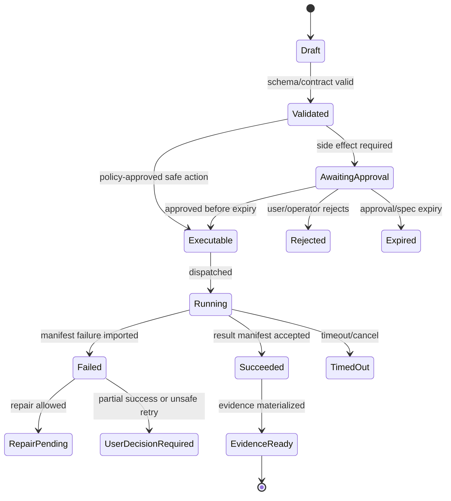

# API Route Catalog

## V6.17 route ownership

Existing project/thread/run/workspace/approval/execution routes are `web_managed` control-plane routes. Desktop local reads, proposals, approvals, apply, commands, checkpoints, rollback, and evidence are not HTTP routes; they are narrow Tauri IPC commands authorized by the Rust host.

Desktop cloud routes are limited to `/desktop/entitlements`, `/desktop/model-responses`, `/desktop/packages`, `/desktop/sync`, `/desktop/telemetry`, `/desktop/updates` where applicable, and `/desktop/remote-handoffs`. Each rejects local absolute paths/folder handles and cannot return a local execution token. Remote-result APIs set `cannotApplyDirectly: true`.

> This file is part of the V6 implementation library, generated from the project context, review corrections, and the decomposed architecture library.


---

## Implementation-depth contract

This file is part of the V6 implementation library. It is written as an implementation guide, not as a strategy memo. Every component must be built against the same system-wide constraints:

1. **The first executable slice comes before breadth.** The first demonstrable product must prove authenticated chat, workspace context, typed plan output, proposal creation, Airlock validation, approval, isolated execution, validation, checkpoint, and evidence.
2. **The delivery-specific authority owns lifecycle state.** The web Runtime API imports remote-worker facts into SQL; the signed desktop Rust host imports local-executor facts into SQLite. Workers, child processes, renderers, models, sync services, and support APIs do not advance authoritative lifecycle state.
3. **Airlock creates the only side-effect token.** Workspace writes, command runs, exports, package imports, dependency restores, and policy-sensitive actions require an `ApprovedExecutionSpec` issued by Airlock.
4. **The model does not own proposals.** Model Gateway returns typed model outputs. Run Orchestrator creates normalized `Proposal` records. Airlock validates proposals.
5. **No raw shell by default.** Commands are represented as `argv[]` plus policy metadata; `sh -c`, shell expansion, broad environment access, and open network access are blocked unless explicitly operator-approved.
6. **Every side effect is reconstructable.** Diffs, preimages, spec hashes, policy hashes, approvals, job image digests, result manifests, logs, artifacts, and rollback metadata must be traceable.
7. **Each module has ports.** Even inside a modular monolith, use explicit interfaces and contracts to avoid creating a god control plane.


## 1. Component identity

| Field | Value |
|---|---|
| Component | `API Route Catalog` |
| Area | `API contracts` |
| Primary implementation package | `Runtime.Api` |
| Runtime/technology | `OpenAPI` |
| First-slice priority | `after-core or supporting` |


## 2. Purpose

List required routes, ownership, auth, request/response contracts, idempotency, and side-effect class.

The implementation must be narrow enough to fit the corrected first vertical slice, but designed so BMAD package execution, the existing presentation adapter, Builder Studio, SkillOps, replay, and operator controls can plug into the same contracts later.


## 3. Owns / does not own

### Owns
- Detailed implementation guidance
- Cross-reference to related component files
- Acceptance criteria
- Test expectations

### Does not own
- Replacing source context
- Implicit architecture changes without ADR


## 4. Public/API surface and internal ports

### Required API/routes or callable operations
- `See route catalog and block-specific files`


### Internal contract rules

- Every boundary uses typed, schema-versioned values. C# uses `Runtime.Contracts` / `Runtime.Domain`, Rust uses generated contract types plus `desktop-domain`, and TypeScript uses generated web or desktop facade types; no generated DTO grants runtime authority.
- External payloads must be schema-versioned. Internal objects may evolve faster but must not leak into OpenAPI without a contract version.
- Every state mutation must be idempotent or protected by optimistic concurrency.
- Every side-effect operation must receive an `ApprovedExecutionSpec` or be provably read-only.
- Every error response must use the standard error envelope with `code`, `message`, `correlationId`, `retryable`, and optional `detailsRef`.


### Starter interface/type sketch

```python
@dataclass(frozen=True)
class WorkerInvocation:
    job_id: str
    approved_spec_path: Path
    checkout_path: Path
    output_dir: Path
    log_dir: Path
```


## 5. State model

### Component states
- `draft`
- `reviewed`
- `accepted`
- `implemented`
- `verified`


### Generic side-effect lifecycle





## 6. Persistence responsibilities

### SQL tables or domain records touched
- `See data model and DDL starter where applicable`

### Blob/object storage paths touched
- `See blob layout reference where applicable`


### Persistence rules

- In `web_managed`, SQL stores lifecycle state, compact indexes, ownership metadata, and references. In `windows_local`, SQLite stores the corresponding local authority records.
- In `web_managed`, Blob stores large immutable payloads: snapshots, logs, diffs, manifests, artifacts, exports, packages, traces, and validation reports. In `windows_local`, encrypted local content-addressed storage holds authority-owned payloads; cloud upload is explicit and purpose-scoped.
- Any Blob payload referenced from SQL must include content hash, schema version, created timestamp, and retention class.
- No raw secrets, broad credentials, or unredacted prompt/context payloads are stored by default.
- Migrations must be forward-safe and testable against fixture data.


## 7. Detailed implementation steps


### Phase 0 — Contract and spike

1. Create or update the relevant ADR before implementation when the decision affects hosting, policy, security, data ownership, or external dependencies.

2. Define public DTOs and durable JSON schemas first. Do not let implementation classes silently become external contracts.

3. Create a minimal fixture that exercises the component without requiring the whole platform.

4. Add negative tests for the most dangerous bypass or failure case before adding the happy path.

5. Record assumptions in the component file and in the ADR index if they are not final.

6. For `API Route Catalog`, implement only the smallest behavior that proves its contract in the first executable slice, then add extended BMAD/Builder/artifact behavior after gate approval.


### Phase 1 — Skeleton implementation

1. Create the package/module/folder with explicit ports/interfaces and dependency direction rules.

2. Add dependency injection registration with narrow interfaces rather than passing broad services everywhere.

3. Implement persistence only through repository/store abstractions that expose business operations, not raw table access.

4. Emit structured events for every important state transition even if the UI does not yet render them.

5. Add unit tests for object creation, invalid input, authorization/policy denial, and idempotency where relevant.

6. For `API Route Catalog`, implement only the smallest behavior that proves its contract in the first executable slice, then add extended BMAD/Builder/artifact behavior after gate approval.


### Phase 2 — First vertical integration

1. Connect the component to the first executable slice only. Avoid adding full future scope before the vertical path works.

2. Use fake/stub adapters for expensive external systems until the contract is proven.

3. Make all side effects flow through Proposal → AirlockDecision → Approval/Grant → ApprovedExecutionSpec → Dispatch.

4. Persist large payloads to Blob and store only compact references in SQL.

5. Return UI-consumable run events so the Chat Workbench can render progress without polling raw tables.

6. For `API Route Catalog`, implement only the smallest behavior that proves its contract in the first executable slice, then add extended BMAD/Builder/artifact behavior after gate approval.


### Phase 3 — Production hardening

1. Add telemetry attributes, correlation IDs, redaction, and audit events.

2. Add retry, timeout, cancellation, and stale-state handling.

3. Add migration scripts and seed data for dev/test.

4. Add operator visibility for status, errors, budget/policy impact, and cleanup status.

5. Document runbooks for the top failure modes.

6. For `API Route Catalog`, implement only the smallest behavior that proves its contract in the first executable slice, then add extended BMAD/Builder/artifact behavior after gate approval.


### Phase 4 — Regression and release gate

1. Add contract tests against OpenAPI/JSON Schema.

2. Add replay fixtures or golden outputs where deterministic behavior is expected.

3. Add security tests for prompt injection, secret leakage, excessive agency, insecure output handling, and supply-chain drift where relevant.

4. Update release gate evidence with screenshots/log excerpts/manifests rather than informal claims.

5. Mark open risks and deferred v1.5/v2 items explicitly.

6. For `API Route Catalog`, implement only the smallest behavior that proves its contract in the first executable slice, then add extended BMAD/Builder/artifact behavior after gate approval.


## 8. Validation and test plan

### Required tests
- guide completeness review
- cross-reference check
- acceptance criteria check


### Minimum test layers

| Layer | What to test | Required before merge |
|---|---|---|
| Unit | object validation, state transitions, parsing, policy predicates | yes |
| Contract | OpenAPI/JSON Schema compatibility, generated clients, worker manifests | yes for public/durable payloads |
| Integration | SQL + Blob references, dispatch/import, authz, Airlock boundary | yes for side-effect paths |
| E2E | chat → proposal → approval → execution → evidence | yes for first slice files |
| Replay/golden | BMAD package fixtures, presentation adapter, evidence bundle | yes before v1 beta |
| Security negative | prompt injection, secret leak, policy bypass, path traversal, raw shell | yes for all side-effect components |


## 9. Failure modes and recovery

| Failure | Detection | Required behavior | User/operator visibility |
|---|---|---|---|
| Invalid schema | contract validation | reject before persistence or dispatch | show actionable error with correlation ID |
| Stale proposal/preimage | hash mismatch | void proposal or require rebase/new proposal | show stale context warning |
| Approval expired | expiry check | reject dispatch | show re-approve option |
| Policy mismatch | policy hash mismatch | reject spec | operator audit event |
| Worker timeout | job monitor | mark job timed out; preserve partial logs | timeline event + retry option if safe |
| Manifest missing/invalid | manifest import validation | do not advance success state | incident/failure card |
| Partial success | checkpoint/validation state | enter `user_decision_required` or `kept_for_repair` | explicit decision card |
| Secret detected | scanner/redactor | redact and block if high confidence | security finding card/operator event |


## 10. Security and policy requirements

- Treat workspace files, package files, generated artifacts, model outputs, and logs as untrusted input.
- Never let untrusted content override system instructions, Airlock policy, command allowlists, network policy, or secret handling.
- Enforce project-level authorization on every read and write.
- Log security-relevant denials as audit events, but do not include raw secret values.
- Prefer fail-closed behavior when policy, identity, schema, or storage checks are ambiguous.
- Add negative tests for the most likely bypass path before writing happy-path code.


## 11. Observability

Minimum telemetry fields for this component:

- `correlation.id`
- `project.id`
- `run.id` when available
- `component.name`
- `operation.name`
- `operation.outcome`
- `policy.version` when applicable
- `spec.id` when applicable
- `job.id` when applicable
- `artifact.id` when applicable
- redaction counters, not raw secrets

Metrics to consider: request latency, state-transition count, policy denials, approval wait time, job duration, manifest import failures, schema validation failures, retry count, budget blocks, and evidence materialization time.


## 12. Acceptance criteria

- [ ] The component has a clear owner package and does not leak responsibilities into unrelated modules.
- [ ] Public routes/payloads are represented in OpenAPI/JSON Schema where applicable.
- [ ] Side-effect paths cannot execute without Airlock evaluation and `ApprovedExecutionSpec`.
- [ ] SQL lifecycle state is mutated only by the Runtime API/Application layer.
- [ ] Blob payloads have content hashes and schema versions.
- [ ] Tests include at least one negative/bypass case.
- [ ] Events and evidence are emitted for user-visible actions.
- [ ] The component is represented in the release gate matrix.
- [ ] The implementation does not introduce Cortex as a runtime namespace.
- [ ] Documentation includes deferred v1.5/v2 scope explicitly rather than silently omitting it.


## 13. Integration checklist

- [ ] Update `32 - Integration Contract Map.md` with any new caller/callee relationship.
- [ ] Update `25 - OpenAPI, Schemas, and Generated Clients.md` for public route or schema changes.
- [ ] Update `22 - Data Model - SQL and Blob.md`, `47 - Database DDL Starter.md`, or `48 - Blob Storage Layout.md` for persistence changes.
- [ ] Update `27 - Testing, Validation, and Replay.md` for new fixtures or replay needs.
- [ ] Update `33 - Release Gates and Acceptance Matrix.md` if the change affects release readiness.
- [ ] Add or update ADR in `31 - Architecture Decision Records.md` if the change alters architecture, hosting, policy, or security posture.

## V6.16 route authority rules

- `read`, `write-metadata`, `message`, `run`, `snapshot`, `read-derived`, and inactive `draft` are ordinary application operations governed by authentication, owner scope, validation, idempotency, audit, and domain transactions. They do not create execution tokens.
- `execution`, executable package rehearsal/activation, external mutation/fetch, dependency restore, and renderer/export worker dispatch are governed mutations. They require exact-candidate Airlock policy and an `ApprovedExecutionSpec`; high-risk cases require human approval of the candidate hash.
- Source Intake acquisition/verification/component-license decisions use repository/CI trust and provenance authority. Intake is not activation and cannot dispatch package code.
- A route never accepts a generic approval boolean, dynamic worker image/entrypoint/identity/secret/network override, provider SDK response object, or model-selected credential.

| Route | Method | Owner | Auth | Side-effect class | Idempotency | Notes |
|---|---:|---|---|---|---|---|
| `/api/me` | GET | Security | authenticated | read | no | Returns user profile and role summary. |
| `/api/projects` | GET | Runtime API | authenticated | read | no | Project list filtered by RBAC. |
| `/api/projects` | POST | Runtime API | project creator | write-metadata | yes | Creates project only; no workspace side effects. |
| `/api/projects/{id}/sources` | POST | Workspace Service | project editor | import | yes | Creates source ref; import may require approval for external clone. |
| `/api/workspaces/{id}/snapshots` | POST | Workspace Service | project editor | snapshot | yes | Snapshot is immutable and hash-addressed. |
| `/api/workspaces/{id}/scan` | POST | Workspace Intelligence | project editor | job | yes | Dispatches scanner job; no direct code mutation. |
| `/api/context-packs` | POST | Workspace Intelligence | project editor | read-derived | yes | Produces context pack with provenance. |
| `/api/threads/{id}/messages` | POST | Runtime API | project member | message | yes | Creates message and usually starts/continues run. |
| `/api/runs` | POST | Run Orchestrator | project member | run | yes | Creates run state machine. |
| `/api/runs/{id}/events` | GET | Evidence Stream Projection | project member | read | no | SSE over durable Evidence Ledger cursor; explicit gap reconciliation. |
| `/api/model-gateway/calls` | POST | Model Gateway | internal only | model-call | yes | Not exposed directly to normal UI. |
| `/api/proposals/{id}` | GET | Run Orchestrator | project member | read | no | Returns normalized proposal metadata and payload refs. |
| `/api/execution-candidates/{id}` | GET | Run Orchestrator/Airlock | authorized reviewer | read | no | Returns immutable candidate fields/hash shown for policy/approval. |
| `/api/airlock/evaluate` | POST | Airlock | internal only | policy | yes | Evaluates exact candidate and produces decision; no execution. |
| `/api/approvals/{id}/decisions` | POST | Runtime API/Airlock | authorized approver | approval | yes | Records approve/reject for the exact candidate hash; decision is not executable. |
| `/api/airlock/approved-specs` | POST | Airlock | internal only | authority-mint | yes | Revalidates unchanged candidate/policy/mutable inputs and mints audience-bound expiring single-use spec. |
| `/api/executions/dispatch` | POST | Execution Dispatcher | internal only | execution | yes | Requires `ApprovedExecutionSpec`. |
| `/api/executions/{id}/worker-result` | POST | Runtime API | worker/completion identity | result-import | yes | Validates `WebWorkerResultManifest`; atomically records completion/state/Evidence Ledger/outbox; worker has no lifecycle SQL. |
| `/api/evidence/{runId}` | GET | Evidence Service | project member | read | no | Returns evidence summary and refs. |
| `/api/source-intake/snapshots` | POST | Source Intake | source reviewer | source-intake | yes | Records origin/ref/archive/extraction evidence; no runtime activation. |
| `/api/source-intake/snapshots/{id}/license-decisions` | POST | Source Intake | source/legal reviewer | source-license | yes | Path-level include/exclude/clean-room/legal-review decision. |
| `/api/packages/import` | POST | BMAD Kernel | project editor | static-package-import | yes | Parses normalized data only; no scripts/import side effects. |
| `/api/packages/{id}/rehearse` | POST | Package Registry/Airlock | package reviewer | execution | yes | Exact-digest install/invocation rehearsal in fixed ACA lane. |
| `/api/packages/{id}/activate` | POST | Package Registry/Airlock | package approver | governed-activation | yes | Requires accepted license/trust/scan/rehearsal/evaluation and exact policy/approval. |
| `/api/bmad/help` | POST | BMAD Help Advisor | project member | read-derived | yes | Source-grounded recommendations only. |
| `/api/artifacts/create` | POST | Artifact Creator | project member | artifact-run | yes | Starts artifact workflow. |
| `/api/artifacts/{runId}/export` | POST | Artifact Creator | project editor | export | yes | Requires policy/approval depending destination/path. |
| `/api/builder/drafts` | POST | Builder Studio | builder role | draft | yes | Draft only; not active package. |
| `/api/builder/drafts/{id}/validate` | POST | Builder Studio | builder role | validation-job | yes | Runs validation job and stores report. |
| `/api/model-profiles/{id}/evaluations` | POST | Model Evaluation | model evaluator | evaluation | yes | Stores immutable four-lane evaluation bundle; candidate cannot self-promote. |
| `/api/model-profiles/{id}/activate` | POST | Model Gateway/Operator | model operator | profile-promotion | yes | Requires exact capability/schema/credential-retention policy, canary, fallback and rollback evidence. |
| `/api/model-profiles/{id}/rollback` | POST | Model Gateway/Operator | model operator | profile-rollback | yes | Restores the last evaluated allowed profile and records ledger evidence. |
| `/api/operator/overview` | GET | Operator | admin | read | no | No raw prompts by default. |
| `/api/operator/policies` | POST | Operator/Airlock | admin | policy-change | yes | Audited and versioned. |
| `/api/operator/worker-images` | POST | Operator/Execution | admin | image-registration | yes | Requires digest, SBOM/provenance refs. |


---

## Historical Revision Notes (V3 -> V4)
## Review finding

`46 - API Route Catalog.md` is part of the implementation library support layer. In v3, support files were useful but not always testable. In v4, every support file must provide either a decision, reference contract, release gate, mapping, runbook, or checklist that can be executed by a developer or coding agent.

## Required usage

1. Read this file before changing the related implementation area.
2. Cross-check it against `07 - Source Coverage Matrix.md` and `50 - V4 Full Library Audit.md`.
3. When implementing a task, copy the relevant checklist items into the issue/story.
4. When a decision changes, update this file and `31 - Architecture Decision Records.md` in the same PR.
5. When a contract changes, update `25 - OpenAPI, Schemas, and Generated Clients.md`, `46 - API Route Catalog.md`, and generated clients.

## V4 quality rules for this file

- It must not contradict locked architecture decisions.
- It must not reintroduce a broad v1 scope that competes with the executable vertical slice.
- It must preserve BMAD source contracts and the existing presentation workflow adapter decision.
- It must reflect the Runtime API as lifecycle state owner and the worker as manifest/log producer only.
- It must identify whether guidance is `LOCKED`, `TEMPORARY`, `PHASE-0 SPIKE`, `V1`, `V1.5`, or `V2`.

## Implementation checklist linkages

| Related guide | What to cross-check |
|---|---|
| `01 - First Build - Executable Vertical Slice.md` | Does this file support or distract from the first slice? |
| `29 - Concurrency, Transactions, and Failures.md` | Are state and partial failure semantics compatible? |
| `32 - Integration Contract Map.md` | Are producer/consumer boundaries clear? |
| `33 - Release Gates and Acceptance Matrix.md` | Is there a release gate for this guidance? |
| `49 - Detailed Component Build Checklists.md` | Are implementation tasks represented as checklist items? |
