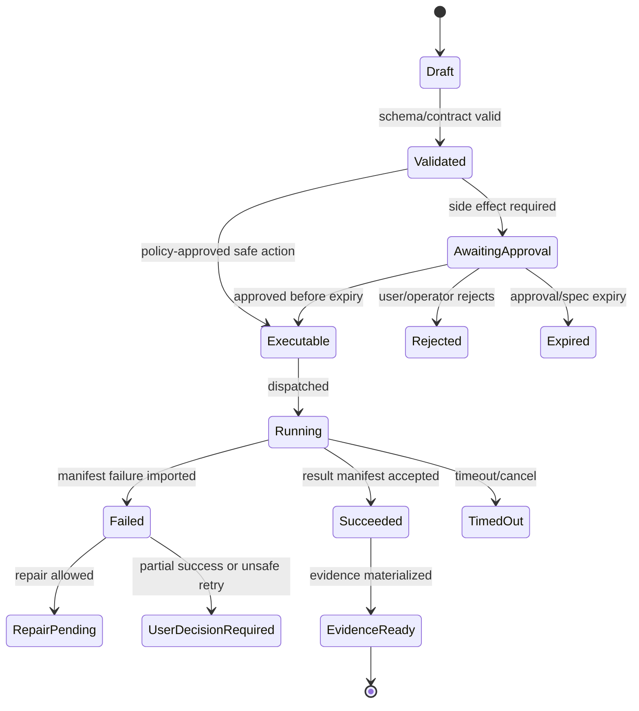

# Database DDL Starter

## V6.17 database scope

DDL in this note targets Azure SQL for `web_managed` lifecycle/workspace/evidence indexes and desktop cloud-support metadata. It must not be deployed as the ordinary Windows-local state store. All web/project descendant tables add or inherit an immutable `delivery_model` check constrained to `web_managed`; support-plane records use explicit replica/remote-handoff classes.

The authoritative desktop SQLite schema and table ownership are defined in [[96 - Windows Local State, Evidence, Checkpoint, and Rollback]]. Do not attempt bidirectional row replication between Azure SQL and SQLite for approvals, specs, executions, evidence events, checkpoints, or journals.

> This file is part of the V6 implementation library, generated from the project context, review corrections, and the decomposed architecture library.


---

## Implementation-depth contract

This file is part of the V6 implementation library. It is written as an implementation guide, not as a strategy memo. Every component must be built against the same system-wide constraints:

1. **The first executable slice comes before breadth.** The first demonstrable product must prove authenticated chat, workspace context, typed plan output, proposal creation, Airlock validation, approval, isolated execution, validation, checkpoint, and evidence.
2. **The delivery-specific authority owns lifecycle state.** The web Runtime API imports remote-worker facts into SQL; the signed desktop Rust host imports local-executor facts into SQLite. Workers, child processes, renderers, models, sync services, and support APIs do not advance authoritative lifecycle state.
3. **Airlock creates the only side-effect token.** Workspace writes, command runs, exports, package imports, dependency restores, and policy-sensitive actions require an `ApprovedExecutionSpec` issued by Airlock.
4. **The model does not own proposals.** Model Gateway returns typed model outputs. Run Orchestrator creates normalized `Proposal` records. Airlock validates proposals.
5. **No raw shell by default.** Commands are represented as `argv[]` plus policy metadata; `sh -c`, shell expansion, broad environment access, and open network access are blocked unless explicitly operator-approved.
6. **Every side effect is reconstructable.** Diffs, preimages, spec hashes, policy hashes, approvals, job image digests, result manifests, logs, artifacts, and rollback metadata must be traceable.
7. **Each module has ports.** Even inside a modular monolith, use explicit interfaces and contracts to avoid creating a god control plane.


## 1. Component identity

| Field | Value |
|---|---|
| Component | `Database DDL Starter` |
| Area | `persistence implementation` |
| Primary implementation package | `Runtime.Infrastructure/Persistence` |
| Runtime/technology | `SQL` |
| First-slice priority | `after-core or supporting` |


## 2. Purpose

Provide starter SQL table definitions and indexes for the first implementation slice.

The implementation must be narrow enough to fit the corrected first vertical slice, but designed so BMAD package execution, the existing presentation adapter, Builder Studio, SkillOps, replay, and operator controls can plug into the same contracts later.


## 3. Owns / does not own

### Owns
- Detailed implementation guidance
- Cross-reference to related component files
- Acceptance criteria
- Test expectations

### Does not own
- Replacing source context
- Implicit architecture changes without ADR


## 4. Public/API surface and internal ports

### Required API/routes or callable operations
- `See route catalog and block-specific files`


### Internal contract rules

- Every boundary uses typed, schema-versioned values. C# uses `Runtime.Contracts` / `Runtime.Domain`, Rust uses generated contract types plus `desktop-domain`, and TypeScript uses generated web or desktop facade types; no generated DTO grants runtime authority.
- External payloads must be schema-versioned. Internal objects may evolve faster but must not leak into OpenAPI without a contract version.
- Every state mutation must be idempotent or protected by optimistic concurrency.
- Every side-effect operation must receive an `ApprovedExecutionSpec` or be provably read-only.
- Every error response must use the standard error envelope with `code`, `message`, `correlationId`, `retryable`, and optional `detailsRef`.


### Starter interface/type sketch

```csharp
public interface IComponentPort<TRequest, TResult>
{
    Task<TResult> ExecuteAsync(TRequest request, CancellationToken ct);
}

public sealed record OperationContext(
    Guid ProjectId,
    Guid RunId,
    string ActorUserId,
    string CorrelationId,
    string PolicyVersion,
    DateTimeOffset RequestedAt);
```


## 5. State model

### Component states
- `draft`
- `reviewed`
- `accepted`
- `implemented`
- `verified`


### Generic side-effect lifecycle





## 6. Persistence responsibilities

### SQL tables or domain records touched
- `See data model and DDL starter where applicable`

### Blob/object storage paths touched
- `See blob layout reference where applicable`


### Persistence rules

- In `web_managed`, SQL stores lifecycle state, compact indexes, ownership metadata, and references. In `windows_local`, SQLite stores the corresponding local authority records.
- In `web_managed`, Blob stores large immutable payloads: snapshots, logs, diffs, manifests, artifacts, exports, packages, traces, and validation reports. In `windows_local`, encrypted local content-addressed storage holds authority-owned payloads; cloud upload is explicit and purpose-scoped.
- Any Blob payload referenced from SQL must include content hash, schema version, created timestamp, and retention class.
- No raw secrets, broad credentials, or unredacted prompt/context payloads are stored by default.
- Migrations must be forward-safe and testable against fixture data.


## 7. Detailed implementation steps


### Phase 0 — Contract and spike

1. Create or update the relevant ADR before implementation when the decision affects hosting, policy, security, data ownership, or external dependencies.

2. Define public DTOs and durable JSON schemas first. Do not let implementation classes silently become external contracts.

3. Create a minimal fixture that exercises the component without requiring the whole platform.

4. Add negative tests for the most dangerous bypass or failure case before adding the happy path.

5. Record assumptions in the component file and in the ADR index if they are not final.

6. For `Database DDL Starter`, implement only the smallest behavior that proves its contract in the first executable slice, then add extended BMAD/Builder/artifact behavior after gate approval.


### Phase 1 — Skeleton implementation

1. Create the package/module/folder with explicit ports/interfaces and dependency direction rules.

2. Add dependency injection registration with narrow interfaces rather than passing broad services everywhere.

3. Implement persistence only through repository/store abstractions that expose business operations, not raw table access.

4. Emit structured events for every important state transition even if the UI does not yet render them.

5. Add unit tests for object creation, invalid input, authorization/policy denial, and idempotency where relevant.

6. For `Database DDL Starter`, implement only the smallest behavior that proves its contract in the first executable slice, then add extended BMAD/Builder/artifact behavior after gate approval.


### Phase 2 — First vertical integration

1. Connect the component to the first executable slice only. Avoid adding full future scope before the vertical path works.

2. Use fake/stub adapters for expensive external systems until the contract is proven.

3. Make all side effects flow through Proposal → AirlockDecision → Approval/Grant → ApprovedExecutionSpec → Dispatch.

4. Persist large payloads to Blob and store only compact references in SQL.

5. Return UI-consumable run events so the Chat Workbench can render progress without polling raw tables.

6. For `Database DDL Starter`, implement only the smallest behavior that proves its contract in the first executable slice, then add extended BMAD/Builder/artifact behavior after gate approval.


### Phase 3 — Production hardening

1. Add telemetry attributes, correlation IDs, redaction, and audit events.

2. Add retry, timeout, cancellation, and stale-state handling.

3. Add migration scripts and seed data for dev/test.

4. Add operator visibility for status, errors, budget/policy impact, and cleanup status.

5. Document runbooks for the top failure modes.

6. For `Database DDL Starter`, implement only the smallest behavior that proves its contract in the first executable slice, then add extended BMAD/Builder/artifact behavior after gate approval.


### Phase 4 — Regression and release gate

1. Add contract tests against OpenAPI/JSON Schema.

2. Add replay fixtures or golden outputs where deterministic behavior is expected.

3. Add security tests for prompt injection, secret leakage, excessive agency, insecure output handling, and supply-chain drift where relevant.

4. Update release gate evidence with screenshots/log excerpts/manifests rather than informal claims.

5. Mark open risks and deferred v1.5/v2 items explicitly.

6. For `Database DDL Starter`, implement only the smallest behavior that proves its contract in the first executable slice, then add extended BMAD/Builder/artifact behavior after gate approval.


## 8. Validation and test plan

### Required tests
- guide completeness review
- cross-reference check
- acceptance criteria check


### Minimum test layers

| Layer | What to test | Required before merge |
|---|---|---|
| Unit | object validation, state transitions, parsing, policy predicates | yes |
| Contract | OpenAPI/JSON Schema compatibility, generated clients, worker manifests | yes for public/durable payloads |
| Integration | SQL + Blob references, dispatch/import, authz, Airlock boundary | yes for side-effect paths |
| E2E | chat → proposal → approval → execution → evidence | yes for first slice files |
| Replay/golden | BMAD package fixtures, presentation adapter, evidence bundle | yes before v1 beta |
| Security negative | prompt injection, secret leak, policy bypass, path traversal, raw shell | yes for all side-effect components |


## 9. Failure modes and recovery

| Failure | Detection | Required behavior | User/operator visibility |
|---|---|---|---|
| Invalid schema | contract validation | reject before persistence or dispatch | show actionable error with correlation ID |
| Stale proposal/preimage | hash mismatch | void proposal or require rebase/new proposal | show stale context warning |
| Approval expired | expiry check | reject dispatch | show re-approve option |
| Policy mismatch | policy hash mismatch | reject spec | operator audit event |
| Worker timeout | job monitor | mark job timed out; preserve partial logs | timeline event + retry option if safe |
| Manifest missing/invalid | manifest import validation | do not advance success state | incident/failure card |
| Partial success | checkpoint/validation state | enter `user_decision_required` or `kept_for_repair` | explicit decision card |
| Secret detected | scanner/redactor | redact and block if high confidence | security finding card/operator event |


## 10. Security and policy requirements

- Treat workspace files, package files, generated artifacts, model outputs, and logs as untrusted input.
- Never let untrusted content override system instructions, Airlock policy, command allowlists, network policy, or secret handling.
- Enforce project-level authorization on every read and write.
- Log security-relevant denials as audit events, but do not include raw secret values.
- Prefer fail-closed behavior when policy, identity, schema, or storage checks are ambiguous.
- Add negative tests for the most likely bypass path before writing happy-path code.


## 11. Observability

Minimum telemetry fields for this component:

- `correlation.id`
- `project.id`
- `run.id` when available
- `component.name`
- `operation.name`
- `operation.outcome`
- `policy.version` when applicable
- `spec.id` when applicable
- `job.id` when applicable
- `artifact.id` when applicable
- redaction counters, not raw secrets

Metrics to consider: request latency, state-transition count, policy denials, approval wait time, job duration, manifest import failures, schema validation failures, retry count, budget blocks, and evidence materialization time.


## 12. Acceptance criteria

- [ ] The component has a clear owner package and does not leak responsibilities into unrelated modules.
- [ ] Public routes/payloads are represented in OpenAPI/JSON Schema where applicable.
- [ ] Side-effect paths cannot execute without Airlock evaluation and `ApprovedExecutionSpec`.
- [ ] SQL lifecycle state is mutated only by the Runtime API/Application layer.
- [ ] Blob payloads have content hashes and schema versions.
- [ ] Tests include at least one negative/bypass case.
- [ ] Events and evidence are emitted for user-visible actions.
- [ ] The component is represented in the release gate matrix.
- [ ] The implementation does not introduce Cortex as a runtime namespace.
- [ ] Documentation includes deferred v1.5/v2 scope explicitly rather than silently omitting it.


## 13. Integration checklist

- [ ] Update `32 - Integration Contract Map.md` with any new caller/callee relationship.
- [ ] Update `25 - OpenAPI, Schemas, and Generated Clients.md` for public route or schema changes.
- [ ] Update `22 - Data Model - SQL and Blob.md`, `47 - Database DDL Starter.md`, or `48 - Blob Storage Layout.md` for persistence changes.
- [ ] Update `27 - Testing, Validation, and Replay.md` for new fixtures or replay needs.
- [ ] Update `33 - Release Gates and Acceptance Matrix.md` if the change affects release readiness.
- [ ] Add or update ADR in `31 - Architecture Decision Records.md` if the change alters architecture, hosting, policy, or security posture.


## starter SQL table sketch

```sql
CREATE TABLE Projects (
  ProjectId UNIQUEIDENTIFIER NOT NULL PRIMARY KEY,
  Name NVARCHAR(200) NOT NULL,
  CreatedBy NVARCHAR(200) NOT NULL,
  CreatedAt DATETIMEOFFSET NOT NULL,
  Status NVARCHAR(40) NOT NULL
);

CREATE TABLE Runs (
  RunId UNIQUEIDENTIFIER NOT NULL PRIMARY KEY,
  ProjectId UNIQUEIDENTIFIER NOT NULL,
  ThreadId UNIQUEIDENTIFIER NOT NULL,
  State NVARCHAR(80) NOT NULL,
  CurrentCheckpointId UNIQUEIDENTIFIER NULL,
  CorrelationId NVARCHAR(100) NOT NULL,
  CreatedAt DATETIMEOFFSET NOT NULL,
  UpdatedAt DATETIMEOFFSET NOT NULL,
  RowVersion ROWVERSION NOT NULL
);

CREATE TABLE Proposals (
  ProposalId UNIQUEIDENTIFIER NOT NULL PRIMARY KEY,
  RunId UNIQUEIDENTIFIER NOT NULL,
  ProposalType NVARCHAR(80) NOT NULL,
  State NVARCHAR(80) NOT NULL,
  PayloadBlobRef NVARCHAR(500) NOT NULL,
  PayloadHash NVARCHAR(100) NOT NULL,
  CreatedAt DATETIMEOFFSET NOT NULL,
  RowVersion ROWVERSION NOT NULL
);

CREATE TABLE ApprovedExecutionSpecs (
  SpecId UNIQUEIDENTIFIER NOT NULL PRIMARY KEY,
  ProposalId UNIQUEIDENTIFIER NOT NULL,
  CandidateId UNIQUEIDENTIFIER NOT NULL,
  CandidateHash NVARCHAR(100) NOT NULL,
  ApprovalId UNIQUEIDENTIFIER NOT NULL,
  PolicyVersion NVARCHAR(100) NOT NULL,
  PolicyHash NVARCHAR(100) NOT NULL,
  SpecHash NVARCHAR(100) NOT NULL,
  ExecutorAudience NVARCHAR(240) NOT NULL,
  JobTemplateId NVARCHAR(200) NOT NULL,
  SingleUseNonce NVARCHAR(200) NOT NULL UNIQUE,
  IssuedAt DATETIMEOFFSET NOT NULL,
  ExpiresAt DATETIMEOFFSET NOT NULL,
  ConsumedAt DATETIMEOFFSET NULL,
  PayloadBlobRef NVARCHAR(500) NOT NULL,
  CreatedAt DATETIMEOFFSET NOT NULL
);
```

This sketch is not the full production schema. It is the minimum spine needed for the first executable vertical slice.

### V6.16 required companion tables and constraints

The first migration set also includes these normalized records; exact column types/names may change only through the canonical object/schema review:

```sql
CREATE TABLE ExecutionSpecCandidates (
  CandidateId UNIQUEIDENTIFIER NOT NULL PRIMARY KEY,
  ProposalId UNIQUEIDENTIFIER NOT NULL,
  OwnerScopeId UNIQUEIDENTIFIER NOT NULL,
  CandidateHash NVARCHAR(100) NOT NULL UNIQUE,
  State NVARCHAR(60) NOT NULL,
  ExecutorAudience NVARCHAR(240) NOT NULL,
  JobTemplateId NVARCHAR(200) NOT NULL,
  PayloadBlobRef NVARCHAR(500) NOT NULL,
  CreatedAt DATETIMEOFFSET NOT NULL,
  ExpiresAt DATETIMEOFFSET NOT NULL
);

CREATE TABLE WorkItems (
  WorkItemId UNIQUEIDENTIFIER NOT NULL PRIMARY KEY,
  OwnerScopeId UNIQUEIDENTIFIER NOT NULL,
  RunId UNIQUEIDENTIFIER NULL,
  IdempotencyKey NVARCHAR(240) NOT NULL,
  State NVARCHAR(60) NOT NULL,
  CreatedAt DATETIMEOFFSET NOT NULL,
  UpdatedAt DATETIMEOFFSET NOT NULL,
  RowVersion ROWVERSION NOT NULL,
  CONSTRAINT UQ_WorkItems_Owner_Idempotency UNIQUE (OwnerScopeId, IdempotencyKey)
);

CREATE TABLE WorkAttempts (
  AttemptId UNIQUEIDENTIFIER NOT NULL PRIMARY KEY,
  WorkItemId UNIQUEIDENTIFIER NOT NULL,
  AttemptNumber INT NOT NULL,
  State NVARCHAR(60) NOT NULL,
  SpecId UNIQUEIDENTIFIER NULL,
  CreatedAt DATETIMEOFFSET NOT NULL,
  CONSTRAINT UQ_WorkAttempts_Item_Number UNIQUE (WorkItemId, AttemptNumber)
);

CREATE TABLE WorkLeases (
  LeaseId UNIQUEIDENTIFIER NOT NULL PRIMARY KEY,
  AttemptId UNIQUEIDENTIFIER NOT NULL UNIQUE,
  HolderId NVARCHAR(240) NOT NULL,
  ExpiresAt DATETIMEOFFSET NOT NULL,
  HeartbeatAt DATETIMEOFFSET NOT NULL,
  State NVARCHAR(40) NOT NULL,
  RowVersion ROWVERSION NOT NULL
);

CREATE TABLE WorkCompletions (
  CompletionId UNIQUEIDENTIFIER NOT NULL PRIMARY KEY,
  AttemptId UNIQUEIDENTIFIER NOT NULL,
  ExecutorAudience NVARCHAR(240) NOT NULL,
  CompletionNonce NVARCHAR(200) NOT NULL,
  ResultHash NVARCHAR(100) NOT NULL,
  ResultBlobRef NVARCHAR(500) NOT NULL,
  Outcome NVARCHAR(60) NOT NULL,
  RecordedAt DATETIMEOFFSET NOT NULL,
  ImportAcknowledgedAt DATETIMEOFFSET NULL,
  CONSTRAINT UQ_WorkCompletion_Attempt_Nonce UNIQUE (AttemptId, ExecutorAudience, CompletionNonce)
);

CREATE TABLE EvidenceLedgerEvents (
  EventId UNIQUEIDENTIFIER NOT NULL PRIMARY KEY,
  StreamId NVARCHAR(240) NOT NULL,
  Sequence BIGINT NOT NULL,
  AggregateType NVARCHAR(100) NOT NULL,
  AggregateId NVARCHAR(240) NOT NULL,
  OwnerScopeId UNIQUEIDENTIFIER NOT NULL,
  SchemaVersion NVARCHAR(80) NOT NULL,
  EventType NVARCHAR(160) NOT NULL,
  PayloadHash NVARCHAR(100) NOT NULL,
  PayloadBlobRef NVARCHAR(500) NULL,
  OccurredAt DATETIMEOFFSET NOT NULL,
  CONSTRAINT UQ_EvidenceLedger_Stream_Sequence UNIQUE (StreamId, Sequence)
);

CREATE TABLE OutboxMessages (
  OutboxId UNIQUEIDENTIFIER NOT NULL PRIMARY KEY,
  EventId UNIQUEIDENTIFIER NOT NULL UNIQUE,
  State NVARCHAR(40) NOT NULL,
  AvailableAt DATETIMEOFFSET NOT NULL,
  AttemptCount INT NOT NULL DEFAULT 0,
  DeliveredAt DATETIMEOFFSET NULL,
  LastErrorRef NVARCHAR(500) NULL,
  RowVersion ROWVERSION NOT NULL
);
```

The application transaction that accepts a completion must persist the lifecycle transition, `WorkCompletion`, `EvidenceLedgerEvent`, and `OutboxMessage` together. Azure SQL constraints/indexes enforce candidate/spec consumption, owner-idempotency, attempt numbering, lease CAS, completion nonce uniqueness, and stream sequencing; application checks alone are insufficient.


---

## Historical Revision Notes (V3 -> V4)
## Review finding

`47 - Database DDL Starter.md` is part of the implementation library support layer. In v3, support files were useful but not always testable. In v4, every support file must provide either a decision, reference contract, release gate, mapping, runbook, or checklist that can be executed by a developer or coding agent.

## Required usage

1. Read this file before changing the related implementation area.
2. Cross-check it against `07 - Source Coverage Matrix.md` and `50 - V4 Full Library Audit.md`.
3. When implementing a task, copy the relevant checklist items into the issue/story.
4. When a decision changes, update this file and `31 - Architecture Decision Records.md` in the same PR.
5. When a contract changes, update `25 - OpenAPI, Schemas, and Generated Clients.md`, `46 - API Route Catalog.md`, and generated clients.

## V4 quality rules for this file

- It must not contradict locked architecture decisions.
- It must not reintroduce a broad v1 scope that competes with the executable vertical slice.
- It must preserve BMAD source contracts and the existing presentation workflow adapter decision.
- It must reflect the Runtime API as lifecycle state owner and the worker as manifest/log producer only.
- It must identify whether guidance is `LOCKED`, `TEMPORARY`, `PHASE-0 SPIKE`, `V1`, `V1.5`, or `V2`.

## Implementation checklist linkages

| Related guide | What to cross-check |
|---|---|
| `01 - First Build - Executable Vertical Slice.md` | Does this file support or distract from the first slice? |
| `29 - Concurrency, Transactions, and Failures.md` | Are state and partial failure semantics compatible? |
| `32 - Integration Contract Map.md` | Are producer/consumer boundaries clear? |
| `33 - Release Gates and Acceptance Matrix.md` | Is there a release gate for this guidance? |
| `49 - Detailed Component Build Checklists.md` | Are implementation tasks represented as checklist items? |
