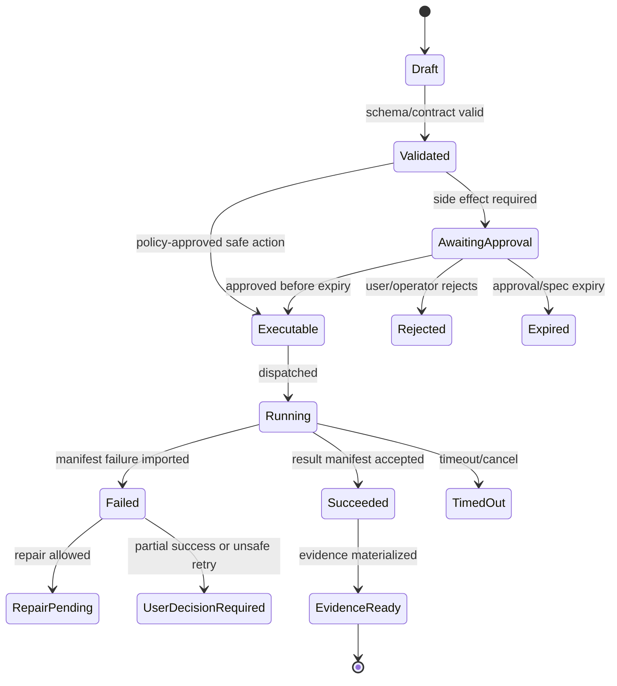

# Detailed Component Build Checklists

## V6.17 checklist partition

Run shared, web, and desktop checklists independently. Shared completion requires schemas, canonical hashes, BMAD fixtures, Airlock rule parity, UI contracts, and C#/Rust/TypeScript conformance. Web completion requires cloud authority, workspace, remote isolation, manifest import, SQL/Blob recovery, and browser E2E. Desktop completion requires signed Tauri host, least-privilege IPC, selected-folder/path controls, SQLite/encrypted-CAS recovery, journaled apply/rollback, local command policy, auth/model egress, privacy, installer/update, and DESK-01 evidence.

A component is not complete when only its shared interface exists. Each delivery adapter must pass its own security and failure tests, and remote handoff must pass cross-authority non-apply/reapproval tests.

> This file is part of the V6 implementation library, generated from the project context, review corrections, and the decomposed architecture library.


---

## Implementation-depth contract

This file is part of the V6 implementation library. It is written as an implementation guide, not as a strategy memo. Every component must be built against the same system-wide constraints:

1. **The first executable slice comes before breadth.** The first demonstrable product must prove authenticated chat, workspace context, typed plan output, proposal creation, Airlock validation, approval, isolated execution, validation, checkpoint, and evidence.
2. **The delivery-specific authority owns lifecycle state.** The web Runtime API imports remote-worker facts into SQL; the signed desktop Rust host imports local-executor facts into SQLite. Workers, child processes, renderers, models, sync services, and support APIs do not advance authoritative lifecycle state.
3. **Airlock creates the only side-effect token.** Workspace writes, command runs, exports, package imports, dependency restores, and policy-sensitive actions require an `ApprovedExecutionSpec` issued by Airlock.
4. **The model does not own proposals.** Model Gateway returns typed model outputs. Run Orchestrator creates normalized `Proposal` records. Airlock validates proposals.
5. **No raw shell by default.** Commands are represented as `argv[]` plus policy metadata; `sh -c`, shell expansion, broad environment access, and open network access are blocked unless explicitly operator-approved.
6. **Every side effect is reconstructable.** Diffs, preimages, spec hashes, policy hashes, approvals, job image digests, result manifests, logs, artifacts, and rollback metadata must be traceable.
7. **Each module has ports.** Even inside a modular monolith, use explicit interfaces and contracts to avoid creating a god control plane.


## 1. Component identity

| Field | Value |
|---|---|
| Component | `Detailed Component Build Checklists` |
| Area | `implementation QA` |
| Primary implementation package | `docs/checklists` |
| Runtime/technology | `Markdown` |
| First-slice priority | `after-core or supporting` |


## 2. Purpose

Provide step-by-step build checklists for every component, mapped to gates and tests.

The implementation must be narrow enough to fit the corrected first vertical slice, but designed so BMAD package execution, the existing presentation adapter, Builder Studio, SkillOps, replay, and operator controls can plug into the same contracts later.


## 3. Owns / does not own

### Owns
- Detailed implementation guidance
- Cross-reference to related component files
- Acceptance criteria
- Test expectations

### Does not own
- Replacing source context
- Implicit architecture changes without ADR


## 4. Public/API surface and internal ports

### Required API/routes or callable operations
- `See route catalog and block-specific files`


### Internal contract rules

- Every boundary uses typed, schema-versioned values. C# uses `Runtime.Contracts` / `Runtime.Domain`, Rust uses generated contract types plus `desktop-domain`, and TypeScript uses generated web or desktop facade types; no generated DTO grants runtime authority.
- External payloads must be schema-versioned. Internal objects may evolve faster but must not leak into OpenAPI without a contract version.
- Every state mutation must be idempotent or protected by optimistic concurrency.
- Every side-effect operation must receive an `ApprovedExecutionSpec` or be provably read-only.
- Every error response must use the standard error envelope with `code`, `message`, `correlationId`, `retryable`, and optional `detailsRef`.


### Starter interface/type sketch

```python
@dataclass(frozen=True)
class WorkerInvocation:
    job_id: str
    approved_spec_path: Path
    checkout_path: Path
    output_dir: Path
    log_dir: Path
```


## 5. State model

### Component states
- `draft`
- `reviewed`
- `accepted`
- `implemented`
- `verified`


### Generic side-effect lifecycle





## 6. Persistence responsibilities

### SQL tables or domain records touched
- `See data model and DDL starter where applicable`

### Blob/object storage paths touched
- `See blob layout reference where applicable`


### Persistence rules

- In `web_managed`, SQL stores lifecycle state, compact indexes, ownership metadata, and references. In `windows_local`, SQLite stores the corresponding local authority records.
- In `web_managed`, Blob stores large immutable payloads: snapshots, logs, diffs, manifests, artifacts, exports, packages, traces, and validation reports. In `windows_local`, encrypted local content-addressed storage holds authority-owned payloads; cloud upload is explicit and purpose-scoped.
- Any Blob payload referenced from SQL must include content hash, schema version, created timestamp, and retention class.
- No raw secrets, broad credentials, or unredacted prompt/context payloads are stored by default.
- Migrations must be forward-safe and testable against fixture data.


## 7. Detailed implementation steps


### Phase 0 — Contract and spike

1. Create or update the relevant ADR before implementation when the decision affects hosting, policy, security, data ownership, or external dependencies.

2. Define public DTOs and durable JSON schemas first. Do not let implementation classes silently become external contracts.

3. Create a minimal fixture that exercises the component without requiring the whole platform.

4. Add negative tests for the most dangerous bypass or failure case before adding the happy path.

5. Record assumptions in the component file and in the ADR index if they are not final.

6. For `Detailed Component Build Checklists`, implement only the smallest behavior that proves its contract in the first executable slice, then add extended BMAD/Builder/artifact behavior after gate approval.


### Phase 1 — Skeleton implementation

1. Create the package/module/folder with explicit ports/interfaces and dependency direction rules.

2. Add dependency injection registration with narrow interfaces rather than passing broad services everywhere.

3. Implement persistence only through repository/store abstractions that expose business operations, not raw table access.

4. Emit structured events for every important state transition even if the UI does not yet render them.

5. Add unit tests for object creation, invalid input, authorization/policy denial, and idempotency where relevant.

6. For `Detailed Component Build Checklists`, implement only the smallest behavior that proves its contract in the first executable slice, then add extended BMAD/Builder/artifact behavior after gate approval.


### Phase 2 — First vertical integration

1. Connect the component to the first executable slice only. Avoid adding full future scope before the vertical path works.

2. Use fake/stub adapters for expensive external systems until the contract is proven.

3. Make all side effects flow through Proposal → AirlockDecision → Approval/Grant → ApprovedExecutionSpec → Dispatch.

4. Persist large payloads to Blob and store only compact references in SQL.

5. Return UI-consumable run events so the Chat Workbench can render progress without polling raw tables.

6. For `Detailed Component Build Checklists`, implement only the smallest behavior that proves its contract in the first executable slice, then add extended BMAD/Builder/artifact behavior after gate approval.


### Phase 3 — Production hardening

1. Add telemetry attributes, correlation IDs, redaction, and audit events.

2. Add retry, timeout, cancellation, and stale-state handling.

3. Add migration scripts and seed data for dev/test.

4. Add operator visibility for status, errors, budget/policy impact, and cleanup status.

5. Document runbooks for the top failure modes.

6. For `Detailed Component Build Checklists`, implement only the smallest behavior that proves its contract in the first executable slice, then add extended BMAD/Builder/artifact behavior after gate approval.


### Phase 4 — Regression and release gate

1. Add contract tests against OpenAPI/JSON Schema.

2. Add replay fixtures or golden outputs where deterministic behavior is expected.

3. Add security tests for prompt injection, secret leakage, excessive agency, insecure output handling, and supply-chain drift where relevant.

4. Update release gate evidence with screenshots/log excerpts/manifests rather than informal claims.

5. Mark open risks and deferred v1.5/v2 items explicitly.

6. For `Detailed Component Build Checklists`, implement only the smallest behavior that proves its contract in the first executable slice, then add extended BMAD/Builder/artifact behavior after gate approval.


## 8. Validation and test plan

### Required tests
- guide completeness review
- cross-reference check
- acceptance criteria check


### Minimum test layers

| Layer | What to test | Required before merge |
|---|---|---|
| Unit | object validation, state transitions, parsing, policy predicates | yes |
| Contract | OpenAPI/JSON Schema compatibility, generated clients, worker manifests | yes for public/durable payloads |
| Integration | SQL + Blob references, dispatch/import, authz, Airlock boundary | yes for side-effect paths |
| E2E | chat → proposal → approval → execution → evidence | yes for first slice files |
| Replay/golden | BMAD package fixtures, presentation adapter, evidence bundle | yes before v1 beta |
| Security negative | prompt injection, secret leak, policy bypass, path traversal, raw shell | yes for all side-effect components |


## 9. Failure modes and recovery

| Failure | Detection | Required behavior | User/operator visibility |
|---|---|---|---|
| Invalid schema | contract validation | reject before persistence or dispatch | show actionable error with correlation ID |
| Stale proposal/preimage | hash mismatch | void proposal or require rebase/new proposal | show stale context warning |
| Approval expired | expiry check | reject dispatch | show re-approve option |
| Policy mismatch | policy hash mismatch | reject spec | operator audit event |
| Worker timeout | job monitor | mark job timed out; preserve partial logs | timeline event + retry option if safe |
| Manifest missing/invalid | manifest import validation | do not advance success state | incident/failure card |
| Partial success | checkpoint/validation state | enter `user_decision_required` or `kept_for_repair` | explicit decision card |
| Secret detected | scanner/redactor | redact and block if high confidence | security finding card/operator event |


## 10. Security and policy requirements

- Treat workspace files, package files, generated artifacts, model outputs, and logs as untrusted input.
- Never let untrusted content override system instructions, Airlock policy, command allowlists, network policy, or secret handling.
- Enforce project-level authorization on every read and write.
- Log security-relevant denials as audit events, but do not include raw secret values.
- Prefer fail-closed behavior when policy, identity, schema, or storage checks are ambiguous.
- Add negative tests for the most likely bypass path before writing happy-path code.


## 11. Observability

Minimum telemetry fields for this component:

- `correlation.id`
- `project.id`
- `run.id` when available
- `component.name`
- `operation.name`
- `operation.outcome`
- `policy.version` when applicable
- `spec.id` when applicable
- `job.id` when applicable
- `artifact.id` when applicable
- redaction counters, not raw secrets

Metrics to consider: request latency, state-transition count, policy denials, approval wait time, job duration, manifest import failures, schema validation failures, retry count, budget blocks, and evidence materialization time.


## 12. Acceptance criteria

- [ ] The component has a clear owner package and does not leak responsibilities into unrelated modules.
- [ ] Public routes/payloads are represented in OpenAPI/JSON Schema where applicable.
- [ ] Side-effect paths cannot execute without Airlock evaluation and `ApprovedExecutionSpec`.
- [ ] SQL lifecycle state is mutated only by the Runtime API/Application layer.
- [ ] Blob payloads have content hashes and schema versions.
- [ ] Tests include at least one negative/bypass case.
- [ ] Events and evidence are emitted for user-visible actions.
- [ ] The component is represented in the release gate matrix.
- [ ] The implementation does not introduce Cortex as a runtime namespace.
- [ ] Documentation includes deferred v1.5/v2 scope explicitly rather than silently omitting it.


## 13. Integration checklist

- [ ] Update `32 - Integration Contract Map.md` with any new caller/callee relationship.
- [ ] Update `25 - OpenAPI, Schemas, and Generated Clients.md` for public route or schema changes.
- [ ] Update `22 - Data Model - SQL and Blob.md`, `47 - Database DDL Starter.md`, or `48 - Blob Storage Layout.md` for persistence changes.
- [ ] Update `27 - Testing, Validation, and Replay.md` for new fixtures or replay needs.
- [ ] Update `33 - Release Gates and Acceptance Matrix.md` if the change affects release readiness.
- [ ] Add or update ADR in `31 - Architecture Decision Records.md` if the change alters architecture, hosting, policy, or security posture.


## 07 - Source Coverage Matrix.md — Source Coverage Matrix

### Build steps
1. Read `07 - Source Coverage Matrix.md` and identify whether the component is first-slice core or after-core.
2. Create/update the contract first: OpenAPI route, JSON schema, C# interface, TypeScript type, or worker manifest schema.
3. Add the smallest fixture needed to exercise the component.
4. Implement the core happy path through existing ports only.
5. Add the primary negative test, especially policy bypass, stale state, invalid schema, unauthorized access, or secret leakage.
6. Add run events and telemetry fields.
7. Add persistence with SQL references and Blob payloads where needed.
8. Connect it to the vertical slice or explicitly mark it deferred.
9. Update release gate evidence.
10. Update ADR/index/contract map if any boundary changed.

### Done checklist
- [ ] contract exists
- [ ] tests pass
- [ ] negative test included
- [ ] telemetry added
- [ ] authorization enforced
- [ ] no Airlock bypass
- [ ] evidence updated
- [ ] docs cross-linked

## 08 - Phased Roadmap and Build Order.md — Phased Roadmap and Build Order

### Build steps
1. Read `08 - Phased Roadmap and Build Order.md` and identify whether the component is first-slice core or after-core.
2. Create/update the contract first: OpenAPI route, JSON schema, C# interface, TypeScript type, or worker manifest schema.
3. Add the smallest fixture needed to exercise the component.
4. Implement the core happy path through existing ports only.
5. Add the primary negative test, especially policy bypass, stale state, invalid schema, unauthorized access, or secret leakage.
6. Add run events and telemetry fields.
7. Add persistence with SQL references and Blob payloads where needed.
8. Connect it to the vertical slice or explicitly mark it deferred.
9. Update release gate evidence.
10. Update ADR/index/contract map if any boundary changed.

### Done checklist
- [ ] contract exists
- [ ] tests pass
- [ ] negative test included
- [ ] telemetry added
- [ ] authorization enforced
- [ ] no Airlock bypass
- [ ] evidence updated
- [ ] docs cross-linked

## 09 - Glossary and Naming.md — Project Glossary and Naming

### Build steps
1. Read `09 - Glossary and Naming.md` and identify whether the component is first-slice core or after-core.
2. Create/update the contract first: OpenAPI route, JSON schema, C# interface, TypeScript type, or worker manifest schema.
3. Add the smallest fixture needed to exercise the component.
4. Implement the core happy path through existing ports only.
5. Add the primary negative test, especially policy bypass, stale state, invalid schema, unauthorized access, or secret leakage.
6. Add run events and telemetry fields.
7. Add persistence with SQL references and Blob payloads where needed.
8. Connect it to the vertical slice or explicitly mark it deferred.
9. Update release gate evidence.
10. Update ADR/index/contract map if any boundary changed.

### Done checklist
- [ ] contract exists
- [ ] tests pass
- [ ] negative test included
- [ ] telemetry added
- [ ] authorization enforced
- [ ] no Airlock bypass
- [ ] evidence updated
- [ ] docs cross-linked

## 10 - Chat Workbench.md — Chat Workbench

### Build steps
1. Read `10 - Chat Workbench.md` and identify whether the component is first-slice core or after-core.
2. Create/update the contract first: OpenAPI route, JSON schema, C# interface, TypeScript type, or worker manifest schema.
3. Add the smallest fixture needed to exercise the component.
4. Implement the core happy path through existing ports only.
5. Add the primary negative test, especially policy bypass, stale state, invalid schema, unauthorized access, or secret leakage.
6. Add run events and telemetry fields.
7. Add persistence with SQL references and Blob payloads where needed.
8. Connect it to the vertical slice or explicitly mark it deferred.
9. Update release gate evidence.
10. Update ADR/index/contract map if any boundary changed.

### Done checklist
- [ ] contract exists
- [ ] tests pass
- [ ] negative test included
- [ ] telemetry added
- [ ] authorization enforced
- [ ] no Airlock bypass
- [ ] evidence updated
- [ ] docs cross-linked

## 11 - Runtime API Control Plane.md — Runtime API Control Plane

### Build steps
1. Read `11 - Runtime API Control Plane.md` and identify whether the component is first-slice core or after-core.
2. Create/update the contract first: OpenAPI route, JSON schema, C# interface, TypeScript type, or worker manifest schema.
3. Add the smallest fixture needed to exercise the component.
4. Implement the core happy path through existing ports only.
5. Add the primary negative test, especially policy bypass, stale state, invalid schema, unauthorized access, or secret leakage.
6. Add run events and telemetry fields.
7. Add persistence with SQL references and Blob payloads where needed.
8. Connect it to the vertical slice or explicitly mark it deferred.
9. Update release gate evidence.
10. Update ADR/index/contract map if any boundary changed.

### Done checklist
- [ ] contract exists
- [ ] tests pass
- [ ] negative test included
- [ ] telemetry added
- [ ] authorization enforced
- [ ] no Airlock bypass
- [ ] evidence updated
- [ ] docs cross-linked

## 12 - Run Orchestrator and Agent Kernel.md — Run Orchestrator and Agent Kernel

### Build steps
1. Read `12 - Run Orchestrator and Agent Kernel.md` and identify whether the component is first-slice core or after-core.
2. Create/update the contract first: OpenAPI route, JSON schema, C# interface, TypeScript type, or worker manifest schema.
3. Add the smallest fixture needed to exercise the component.
4. Implement the core happy path through existing ports only.
5. Add the primary negative test, especially policy bypass, stale state, invalid schema, unauthorized access, or secret leakage.
6. Add run events and telemetry fields.
7. Add persistence with SQL references and Blob payloads where needed.
8. Connect it to the vertical slice or explicitly mark it deferred.
9. Update release gate evidence.
10. Update ADR/index/contract map if any boundary changed.

### Done checklist
- [ ] contract exists
- [ ] tests pass
- [ ] negative test included
- [ ] telemetry added
- [ ] authorization enforced
- [ ] no Airlock bypass
- [ ] evidence updated
- [ ] docs cross-linked

## 13 - BMAD Kernel, Package Loader, and Help Advisor.md — BMAD Kernel, Package Loader, and Help Advisor

### Build steps
1. Read `13 - BMAD Kernel, Package Loader, and Help Advisor.md` and identify whether the component is first-slice core or after-core.
2. Create/update the contract first: OpenAPI route, JSON schema, C# interface, TypeScript type, or worker manifest schema.
3. Add the smallest fixture needed to exercise the component.
4. Implement the core happy path through existing ports only.
5. Add the primary negative test, especially policy bypass, stale state, invalid schema, unauthorized access, or secret leakage.
6. Add run events and telemetry fields.
7. Add persistence with SQL references and Blob payloads where needed.
8. Connect it to the vertical slice or explicitly mark it deferred.
9. Update release gate evidence.
10. Update ADR/index/contract map if any boundary changed.

### Done checklist
- [ ] contract exists
- [ ] tests pass
- [ ] negative test included
- [ ] telemetry added
- [ ] authorization enforced
- [ ] no Airlock bypass
- [ ] evidence updated
- [ ] docs cross-linked

## 14 - Builder Studio and SkillOps.md — Builder Studio and SkillOps

### Build steps
1. Read `14 - Builder Studio and SkillOps.md` and identify whether the component is first-slice core or after-core.
2. Create/update the contract first: OpenAPI route, JSON schema, C# interface, TypeScript type, or worker manifest schema.
3. Add the smallest fixture needed to exercise the component.
4. Implement the core happy path through existing ports only.
5. Add the primary negative test, especially policy bypass, stale state, invalid schema, unauthorized access, or secret leakage.
6. Add run events and telemetry fields.
7. Add persistence with SQL references and Blob payloads where needed.
8. Connect it to the vertical slice or explicitly mark it deferred.
9. Update release gate evidence.
10. Update ADR/index/contract map if any boundary changed.

### Done checklist
- [ ] contract exists
- [ ] tests pass
- [ ] negative test included
- [ ] telemetry added
- [ ] authorization enforced
- [ ] no Airlock bypass
- [ ] evidence updated
- [ ] docs cross-linked

## 15 - Artifact Creator and Presentation Adapter.md — Artifact Creator and Existing Presentation Adapter

### Build steps
1. Read `15 - Artifact Creator and Presentation Adapter.md` and identify whether the component is first-slice core or after-core.
2. Create/update the contract first: OpenAPI route, JSON schema, C# interface, TypeScript type, or worker manifest schema.
3. Add the smallest fixture needed to exercise the component.
4. Implement the core happy path through existing ports only.
5. Add the primary negative test, especially policy bypass, stale state, invalid schema, unauthorized access, or secret leakage.
6. Add run events and telemetry fields.
7. Add persistence with SQL references and Blob payloads where needed.
8. Connect it to the vertical slice or explicitly mark it deferred.
9. Update release gate evidence.
10. Update ADR/index/contract map if any boundary changed.

### Done checklist
- [ ] contract exists
- [ ] tests pass
- [ ] negative test included
- [ ] telemetry added
- [ ] authorization enforced
- [ ] no Airlock bypass
- [ ] evidence updated
- [ ] docs cross-linked

## 16 - Workspace Service.md — Workspace Service

### Build steps
1. Read `16 - Workspace Service.md` and identify whether the component is first-slice core or after-core.
2. Create/update the contract first: OpenAPI route, JSON schema, C# interface, TypeScript type, or worker manifest schema.
3. Add the smallest fixture needed to exercise the component.
4. Implement the core happy path through existing ports only.
5. Add the primary negative test, especially policy bypass, stale state, invalid schema, unauthorized access, or secret leakage.
6. Add run events and telemetry fields.
7. Add persistence with SQL references and Blob payloads where needed.
8. Connect it to the vertical slice or explicitly mark it deferred.
9. Update release gate evidence.
10. Update ADR/index/contract map if any boundary changed.

### Done checklist
- [ ] contract exists
- [ ] tests pass
- [ ] negative test included
- [ ] telemetry added
- [ ] authorization enforced
- [ ] no Airlock bypass
- [ ] evidence updated
- [ ] docs cross-linked

## 17 - Workspace Intelligence and Context Packs.md — Workspace Intelligence and Context Packs

### Build steps
1. Read `17 - Workspace Intelligence and Context Packs.md` and identify whether the component is first-slice core or after-core.
2. Create/update the contract first: OpenAPI route, JSON schema, C# interface, TypeScript type, or worker manifest schema.
3. Add the smallest fixture needed to exercise the component.
4. Implement the core happy path through existing ports only.
5. Add the primary negative test, especially policy bypass, stale state, invalid schema, unauthorized access, or secret leakage.
6. Add run events and telemetry fields.
7. Add persistence with SQL references and Blob payloads where needed.
8. Connect it to the vertical slice or explicitly mark it deferred.
9. Update release gate evidence.
10. Update ADR/index/contract map if any boundary changed.

### Done checklist
- [ ] contract exists
- [ ] tests pass
- [ ] negative test included
- [ ] telemetry added
- [ ] authorization enforced
- [ ] no Airlock bypass
- [ ] evidence updated
- [ ] docs cross-linked

## 18 - Model Gateway and Microsoft Foundry.md — Model Gateway and Azure AI Foundry

### Build steps
1. Read `18 - Model Gateway and Microsoft Foundry.md` and identify whether the component is first-slice core or after-core.
2. Create/update the contract first: OpenAPI route, JSON schema, C# interface, TypeScript type, or worker manifest schema.
3. Add the smallest fixture needed to exercise the component.
4. Implement the core happy path through existing ports only.
5. Add the primary negative test, especially policy bypass, stale state, invalid schema, unauthorized access, or secret leakage.
6. Add run events and telemetry fields.
7. Add persistence with SQL references and Blob payloads where needed.
8. Connect it to the vertical slice or explicitly mark it deferred.
9. Update release gate evidence.
10. Update ADR/index/contract map if any boundary changed.

### Done checklist
- [ ] contract exists
- [ ] tests pass
- [ ] negative test included
- [ ] telemetry added
- [ ] authorization enforced
- [ ] no Airlock bypass
- [ ] evidence updated
- [ ] docs cross-linked

## 19 - Airlock Policy and Approvals.md — Airlock Policy and Approvals

### Build steps
1. Read `19 - Airlock Policy and Approvals.md` and identify whether the component is first-slice core or after-core.
2. Create/update the contract first: OpenAPI route, JSON schema, C# interface, TypeScript type, or worker manifest schema.
3. Add the smallest fixture needed to exercise the component.
4. Implement the core happy path through existing ports only.
5. Add the primary negative test, especially policy bypass, stale state, invalid schema, unauthorized access, or secret leakage.
6. Add run events and telemetry fields.
7. Add persistence with SQL references and Blob payloads where needed.
8. Connect it to the vertical slice or explicitly mark it deferred.
9. Update release gate evidence.
10. Update ADR/index/contract map if any boundary changed.

### Done checklist
- [ ] contract exists
- [ ] tests pass
- [ ] negative test included
- [ ] telemetry added
- [ ] authorization enforced
- [ ] no Airlock bypass
- [ ] evidence updated
- [ ] docs cross-linked

## 20 - Execution Lanes and Container App Jobs.md — Execution Lanes and Azure Container Apps Jobs

### Build steps
1. Read `20 - Execution Lanes and Container App Jobs.md` and identify whether the component is first-slice core or after-core.
2. Create/update the contract first: OpenAPI route, JSON schema, C# interface, TypeScript type, or worker manifest schema.
3. Add the smallest fixture needed to exercise the component.
4. Implement the core happy path through existing ports only.
5. Add the primary negative test, especially policy bypass, stale state, invalid schema, unauthorized access, or secret leakage.
6. Add run events and telemetry fields.
7. Add persistence with SQL references and Blob payloads where needed.
8. Connect it to the vertical slice or explicitly mark it deferred.
9. Update release gate evidence.
10. Update ADR/index/contract map if any boundary changed.

### Done checklist
- [ ] contract exists
- [ ] tests pass
- [ ] negative test included
- [ ] telemetry added
- [ ] authorization enforced
- [ ] no Airlock bypass
- [ ] evidence updated
- [ ] docs cross-linked

## 21 - Trace, Evidence, and Observability.md — Trace, Evidence, and Observability

### Build steps
1. Read `21 - Trace, Evidence, and Observability.md` and identify whether the component is first-slice core or after-core.
2. Create/update the contract first: OpenAPI route, JSON schema, C# interface, TypeScript type, or worker manifest schema.
3. Add the smallest fixture needed to exercise the component.
4. Implement the core happy path through existing ports only.
5. Add the primary negative test, especially policy bypass, stale state, invalid schema, unauthorized access, or secret leakage.
6. Add run events and telemetry fields.
7. Add persistence with SQL references and Blob payloads where needed.
8. Connect it to the vertical slice or explicitly mark it deferred.
9. Update release gate evidence.
10. Update ADR/index/contract map if any boundary changed.

### Done checklist
- [ ] contract exists
- [ ] tests pass
- [ ] negative test included
- [ ] telemetry added
- [ ] authorization enforced
- [ ] no Airlock bypass
- [ ] evidence updated
- [ ] docs cross-linked

## 22 - Data Model - SQL and Blob.md — Data Model: Azure SQL and Blob

### Build steps
1. Read `22 - Data Model - SQL and Blob.md` and identify whether the component is first-slice core or after-core.
2. Create/update the contract first: OpenAPI route, JSON schema, C# interface, TypeScript type, or worker manifest schema.
3. Add the smallest fixture needed to exercise the component.
4. Implement the core happy path through existing ports only.
5. Add the primary negative test, especially policy bypass, stale state, invalid schema, unauthorized access, or secret leakage.
6. Add run events and telemetry fields.
7. Add persistence with SQL references and Blob payloads where needed.
8. Connect it to the vertical slice or explicitly mark it deferred.
9. Update release gate evidence.
10. Update ADR/index/contract map if any boundary changed.

### Done checklist
- [ ] contract exists
- [ ] tests pass
- [ ] negative test included
- [ ] telemetry added
- [ ] authorization enforced
- [ ] no Airlock bypass
- [ ] evidence updated
- [ ] docs cross-linked

## 23 - Security, Identity, and Secrets.md — Security, Identity, and Secrets

### Build steps
1. Read `23 - Security, Identity, and Secrets.md` and identify whether the component is first-slice core or after-core.
2. Create/update the contract first: OpenAPI route, JSON schema, C# interface, TypeScript type, or worker manifest schema.
3. Add the smallest fixture needed to exercise the component.
4. Implement the core happy path through existing ports only.
5. Add the primary negative test, especially policy bypass, stale state, invalid schema, unauthorized access, or secret leakage.
6. Add run events and telemetry fields.
7. Add persistence with SQL references and Blob payloads where needed.
8. Connect it to the vertical slice or explicitly mark it deferred.
9. Update release gate evidence.
10. Update ADR/index/contract map if any boundary changed.

### Done checklist
- [ ] contract exists
- [ ] tests pass
- [ ] negative test included
- [ ] telemetry added
- [ ] authorization enforced
- [ ] no Airlock bypass
- [ ] evidence updated
- [ ] docs cross-linked

## 24 - Operator Console and Operations.md — Operator Console and Operations

### Build steps
1. Read `24 - Operator Console and Operations.md` and identify whether the component is first-slice core or after-core.
2. Create/update the contract first: OpenAPI route, JSON schema, C# interface, TypeScript type, or worker manifest schema.
3. Add the smallest fixture needed to exercise the component.
4. Implement the core happy path through existing ports only.
5. Add the primary negative test, especially policy bypass, stale state, invalid schema, unauthorized access, or secret leakage.
6. Add run events and telemetry fields.
7. Add persistence with SQL references and Blob payloads where needed.
8. Connect it to the vertical slice or explicitly mark it deferred.
9. Update release gate evidence.
10. Update ADR/index/contract map if any boundary changed.

### Done checklist
- [ ] contract exists
- [ ] tests pass
- [ ] negative test included
- [ ] telemetry added
- [ ] authorization enforced
- [ ] no Airlock bypass
- [ ] evidence updated
- [ ] docs cross-linked

## 25 - OpenAPI, Schemas, and Generated Clients.md — OpenAPI, Schemas, and Generated Clients

### Build steps
1. Read `25 - OpenAPI, Schemas, and Generated Clients.md` and identify whether the component is first-slice core or after-core.
2. Create/update the contract first: OpenAPI route, JSON schema, C# interface, TypeScript type, or worker manifest schema.
3. Add the smallest fixture needed to exercise the component.
4. Implement the core happy path through existing ports only.
5. Add the primary negative test, especially policy bypass, stale state, invalid schema, unauthorized access, or secret leakage.
6. Add run events and telemetry fields.
7. Add persistence with SQL references and Blob payloads where needed.
8. Connect it to the vertical slice or explicitly mark it deferred.
9. Update release gate evidence.
10. Update ADR/index/contract map if any boundary changed.

### Done checklist
- [ ] contract exists
- [ ] tests pass
- [ ] negative test included
- [ ] telemetry added
- [ ] authorization enforced
- [ ] no Airlock bypass
- [ ] evidence updated
- [ ] docs cross-linked

## 26 - Frontend Design System.md — Frontend Design System

### Build steps
1. Read `26 - Frontend Design System.md` and identify whether the component is first-slice core or after-core.
2. Create/update the contract first: OpenAPI route, JSON schema, C# interface, TypeScript type, or worker manifest schema.
3. Add the smallest fixture needed to exercise the component.
4. Implement the core happy path through existing ports only.
5. Add the primary negative test, especially policy bypass, stale state, invalid schema, unauthorized access, or secret leakage.
6. Add run events and telemetry fields.
7. Add persistence with SQL references and Blob payloads where needed.
8. Connect it to the vertical slice or explicitly mark it deferred.
9. Update release gate evidence.
10. Update ADR/index/contract map if any boundary changed.

### Done checklist
- [ ] contract exists
- [ ] tests pass
- [ ] negative test included
- [ ] telemetry added
- [ ] authorization enforced
- [ ] no Airlock bypass
- [ ] evidence updated
- [ ] docs cross-linked

## 27 - Testing, Validation, and Replay.md — Testing, Validation, and Replay

### Build steps
1. Read `27 - Testing, Validation, and Replay.md` and identify whether the component is first-slice core or after-core.
2. Create/update the contract first: OpenAPI route, JSON schema, C# interface, TypeScript type, or worker manifest schema.
3. Add the smallest fixture needed to exercise the component.
4. Implement the core happy path through existing ports only.
5. Add the primary negative test, especially policy bypass, stale state, invalid schema, unauthorized access, or secret leakage.
6. Add run events and telemetry fields.
7. Add persistence with SQL references and Blob payloads where needed.
8. Connect it to the vertical slice or explicitly mark it deferred.
9. Update release gate evidence.
10. Update ADR/index/contract map if any boundary changed.

### Done checklist
- [ ] contract exists
- [ ] tests pass
- [ ] negative test included
- [ ] telemetry added
- [ ] authorization enforced
- [ ] no Airlock bypass
- [ ] evidence updated
- [ ] docs cross-linked

## 28 - Supply Chain, Deployment, and IaC.md — Supply Chain, Deployment, and IaC

### Build steps
1. Read `28 - Supply Chain, Deployment, and IaC.md` and identify whether the component is first-slice core or after-core.
2. Create/update the contract first: OpenAPI route, JSON schema, C# interface, TypeScript type, or worker manifest schema.
3. Add the smallest fixture needed to exercise the component.
4. Implement the core happy path through existing ports only.
5. Add the primary negative test, especially policy bypass, stale state, invalid schema, unauthorized access, or secret leakage.
6. Add run events and telemetry fields.
7. Add persistence with SQL references and Blob payloads where needed.
8. Connect it to the vertical slice or explicitly mark it deferred.
9. Update release gate evidence.
10. Update ADR/index/contract map if any boundary changed.

### Done checklist
- [ ] contract exists
- [ ] tests pass
- [ ] negative test included
- [ ] telemetry added
- [ ] authorization enforced
- [ ] no Airlock bypass
- [ ] evidence updated
- [ ] docs cross-linked

## 29 - Concurrency, Transactions, and Failures.md — Concurrency, Transactions, and Failures

### Build steps
1. Read `29 - Concurrency, Transactions, and Failures.md` and identify whether the component is first-slice core or after-core.
2. Create/update the contract first: OpenAPI route, JSON schema, C# interface, TypeScript type, or worker manifest schema.
3. Add the smallest fixture needed to exercise the component.
4. Implement the core happy path through existing ports only.
5. Add the primary negative test, especially policy bypass, stale state, invalid schema, unauthorized access, or secret leakage.
6. Add run events and telemetry fields.
7. Add persistence with SQL references and Blob payloads where needed.
8. Connect it to the vertical slice or explicitly mark it deferred.
9. Update release gate evidence.
10. Update ADR/index/contract map if any boundary changed.

### Done checklist
- [ ] contract exists
- [ ] tests pass
- [ ] negative test included
- [ ] telemetry added
- [ ] authorization enforced
- [ ] no Airlock bypass
- [ ] evidence updated
- [ ] docs cross-linked

## 30 - Implementation Epics and Backlog.md — Implementation Epics and Backlog

### Build steps
1. Read `30 - Implementation Epics and Backlog.md` and identify whether the component is first-slice core or after-core.
2. Create/update the contract first: OpenAPI route, JSON schema, C# interface, TypeScript type, or worker manifest schema.
3. Add the smallest fixture needed to exercise the component.
4. Implement the core happy path through existing ports only.
5. Add the primary negative test, especially policy bypass, stale state, invalid schema, unauthorized access, or secret leakage.
6. Add run events and telemetry fields.
7. Add persistence with SQL references and Blob payloads where needed.
8. Connect it to the vertical slice or explicitly mark it deferred.
9. Update release gate evidence.
10. Update ADR/index/contract map if any boundary changed.

### Done checklist
- [ ] contract exists
- [ ] tests pass
- [ ] negative test included
- [ ] telemetry added
- [ ] authorization enforced
- [ ] no Airlock bypass
- [ ] evidence updated
- [ ] docs cross-linked

## 31 - Architecture Decision Records.md — ADR Index

### Build steps
1. Read `31 - Architecture Decision Records.md` and identify whether the component is first-slice core or after-core.
2. Create/update the contract first: OpenAPI route, JSON schema, C# interface, TypeScript type, or worker manifest schema.
3. Add the smallest fixture needed to exercise the component.
4. Implement the core happy path through existing ports only.
5. Add the primary negative test, especially policy bypass, stale state, invalid schema, unauthorized access, or secret leakage.
6. Add run events and telemetry fields.
7. Add persistence with SQL references and Blob payloads where needed.
8. Connect it to the vertical slice or explicitly mark it deferred.
9. Update release gate evidence.
10. Update ADR/index/contract map if any boundary changed.

### Done checklist
- [ ] contract exists
- [ ] tests pass
- [ ] negative test included
- [ ] telemetry added
- [ ] authorization enforced
- [ ] no Airlock bypass
- [ ] evidence updated
- [ ] docs cross-linked

## 32 - Integration Contract Map.md — Integration Contract Map

### Build steps
1. Read `32 - Integration Contract Map.md` and identify whether the component is first-slice core or after-core.
2. Create/update the contract first: OpenAPI route, JSON schema, C# interface, TypeScript type, or worker manifest schema.
3. Add the smallest fixture needed to exercise the component.
4. Implement the core happy path through existing ports only.
5. Add the primary negative test, especially policy bypass, stale state, invalid schema, unauthorized access, or secret leakage.
6. Add run events and telemetry fields.
7. Add persistence with SQL references and Blob payloads where needed.
8. Connect it to the vertical slice or explicitly mark it deferred.
9. Update release gate evidence.
10. Update ADR/index/contract map if any boundary changed.

### Done checklist
- [ ] contract exists
- [ ] tests pass
- [ ] negative test included
- [ ] telemetry added
- [ ] authorization enforced
- [ ] no Airlock bypass
- [ ] evidence updated
- [ ] docs cross-linked

## 33 - Release Gates and Acceptance Matrix.md — Release Gates and Acceptance Matrix

### Build steps
1. Read `33 - Release Gates and Acceptance Matrix.md` and identify whether the component is first-slice core or after-core.
2. Create/update the contract first: OpenAPI route, JSON schema, C# interface, TypeScript type, or worker manifest schema.
3. Add the smallest fixture needed to exercise the component.
4. Implement the core happy path through existing ports only.
5. Add the primary negative test, especially policy bypass, stale state, invalid schema, unauthorized access, or secret leakage.
6. Add run events and telemetry fields.
7. Add persistence with SQL references and Blob payloads where needed.
8. Connect it to the vertical slice or explicitly mark it deferred.
9. Update release gate evidence.
10. Update ADR/index/contract map if any boundary changed.

### Done checklist
- [ ] contract exists
- [ ] tests pass
- [ ] negative test included
- [ ] telemetry added
- [ ] authorization enforced
- [ ] no Airlock bypass
- [ ] evidence updated
- [ ] docs cross-linked

## 34 - Canonical Object Model.md — Canonical Object Model

### Build steps
1. Read `34 - Canonical Object Model.md` and identify whether the component is first-slice core or after-core.
2. Create/update the contract first: OpenAPI route, JSON schema, C# interface, TypeScript type, or worker manifest schema.
3. Add the smallest fixture needed to exercise the component.
4. Implement the core happy path through existing ports only.
5. Add the primary negative test, especially policy bypass, stale state, invalid schema, unauthorized access, or secret leakage.
6. Add run events and telemetry fields.
7. Add persistence with SQL references and Blob payloads where needed.
8. Connect it to the vertical slice or explicitly mark it deferred.
9. Update release gate evidence.
10. Update ADR/index/contract map if any boundary changed.

### Done checklist
- [ ] contract exists
- [ ] tests pass
- [ ] negative test included
- [ ] telemetry added
- [ ] authorization enforced
- [ ] no Airlock bypass
- [ ] evidence updated
- [ ] docs cross-linked

## 35 - Source Alignment Notes.md — Source Alignment Notes

### Build steps
1. Read `35 - Source Alignment Notes.md` and identify whether the component is first-slice core or after-core.
2. Create/update the contract first: OpenAPI route, JSON schema, C# interface, TypeScript type, or worker manifest schema.
3. Add the smallest fixture needed to exercise the component.
4. Implement the core happy path through existing ports only.
5. Add the primary negative test, especially policy bypass, stale state, invalid schema, unauthorized access, or secret leakage.
6. Add run events and telemetry fields.
7. Add persistence with SQL references and Blob payloads where needed.
8. Connect it to the vertical slice or explicitly mark it deferred.
9. Update release gate evidence.
10. Update ADR/index/contract map if any boundary changed.

### Done checklist
- [ ] contract exists
- [ ] tests pass
- [ ] negative test included
- [ ] telemetry added
- [ ] authorization enforced
- [ ] no Airlock bypass
- [ ] evidence updated
- [ ] docs cross-linked

## 36 - Local Development and DevEx.md — Local Development and DevEx

### Build steps
1. Read `36 - Local Development and DevEx.md` and identify whether the component is first-slice core or after-core.
2. Create/update the contract first: OpenAPI route, JSON schema, C# interface, TypeScript type, or worker manifest schema.
3. Add the smallest fixture needed to exercise the component.
4. Implement the core happy path through existing ports only.
5. Add the primary negative test, especially policy bypass, stale state, invalid schema, unauthorized access, or secret leakage.
6. Add run events and telemetry fields.
7. Add persistence with SQL references and Blob payloads where needed.
8. Connect it to the vertical slice or explicitly mark it deferred.
9. Update release gate evidence.
10. Update ADR/index/contract map if any boundary changed.

### Done checklist
- [ ] contract exists
- [ ] tests pass
- [ ] negative test included
- [ ] telemetry added
- [ ] authorization enforced
- [ ] no Airlock bypass
- [ ] evidence updated
- [ ] docs cross-linked

## 37 - Azure Environments and Deployment Runbooks.md — Azure Environments and Deployment Runbooks

### Build steps
1. Read `37 - Azure Environments and Deployment Runbooks.md` and identify whether the component is first-slice core or after-core.
2. Create/update the contract first: OpenAPI route, JSON schema, C# interface, TypeScript type, or worker manifest schema.
3. Add the smallest fixture needed to exercise the component.
4. Implement the core happy path through existing ports only.
5. Add the primary negative test, especially policy bypass, stale state, invalid schema, unauthorized access, or secret leakage.
6. Add run events and telemetry fields.
7. Add persistence with SQL references and Blob payloads where needed.
8. Connect it to the vertical slice or explicitly mark it deferred.
9. Update release gate evidence.
10. Update ADR/index/contract map if any boundary changed.

### Done checklist
- [ ] contract exists
- [ ] tests pass
- [ ] negative test included
- [ ] telemetry added
- [ ] authorization enforced
- [ ] no Airlock bypass
- [ ] evidence updated
- [ ] docs cross-linked

## 38 - Worker Images and Command DSL.md — Worker Image and Command DSL Reference

### Build steps
1. Read `38 - Worker Images and Command DSL.md` and identify whether the component is first-slice core or after-core.
2. Create/update the contract first: OpenAPI route, JSON schema, C# interface, TypeScript type, or worker manifest schema.
3. Add the smallest fixture needed to exercise the component.
4. Implement the core happy path through existing ports only.
5. Add the primary negative test, especially policy bypass, stale state, invalid schema, unauthorized access, or secret leakage.
6. Add run events and telemetry fields.
7. Add persistence with SQL references and Blob payloads where needed.
8. Connect it to the vertical slice or explicitly mark it deferred.
9. Update release gate evidence.
10. Update ADR/index/contract map if any boundary changed.

### Done checklist
- [ ] contract exists
- [ ] tests pass
- [ ] negative test included
- [ ] telemetry added
- [ ] authorization enforced
- [ ] no Airlock bypass
- [ ] evidence updated
- [ ] docs cross-linked

## 39 - BMAD Package Format.md — BMAD Package Format Reference

### Build steps
1. Read `39 - BMAD Package Format.md` and identify whether the component is first-slice core or after-core.
2. Create/update the contract first: OpenAPI route, JSON schema, C# interface, TypeScript type, or worker manifest schema.
3. Add the smallest fixture needed to exercise the component.
4. Implement the core happy path through existing ports only.
5. Add the primary negative test, especially policy bypass, stale state, invalid schema, unauthorized access, or secret leakage.
6. Add run events and telemetry fields.
7. Add persistence with SQL references and Blob payloads where needed.
8. Connect it to the vertical slice or explicitly mark it deferred.
9. Update release gate evidence.
10. Update ADR/index/contract map if any boundary changed.

### Done checklist
- [ ] contract exists
- [ ] tests pass
- [ ] negative test included
- [ ] telemetry added
- [ ] authorization enforced
- [ ] no Airlock bypass
- [ ] evidence updated
- [ ] docs cross-linked

## 40 - Threat Model and Security Tests.md — Threat Model and Security Tests

### Build steps
1. Read `40 - Threat Model and Security Tests.md` and identify whether the component is first-slice core or after-core.
2. Create/update the contract first: OpenAPI route, JSON schema, C# interface, TypeScript type, or worker manifest schema.
3. Add the smallest fixture needed to exercise the component.
4. Implement the core happy path through existing ports only.
5. Add the primary negative test, especially policy bypass, stale state, invalid schema, unauthorized access, or secret leakage.
6. Add run events and telemetry fields.
7. Add persistence with SQL references and Blob payloads where needed.
8. Connect it to the vertical slice or explicitly mark it deferred.
9. Update release gate evidence.
10. Update ADR/index/contract map if any boundary changed.

### Done checklist
- [ ] contract exists
- [ ] tests pass
- [ ] negative test included
- [ ] telemetry added
- [ ] authorization enforced
- [ ] no Airlock bypass
- [ ] evidence updated
- [ ] docs cross-linked

## 41 - Observability Dashboards and Alerts.md — Observability Dashboards and Alerts

### Build steps
1. Read `41 - Observability Dashboards and Alerts.md` and identify whether the component is first-slice core or after-core.
2. Create/update the contract first: OpenAPI route, JSON schema, C# interface, TypeScript type, or worker manifest schema.
3. Add the smallest fixture needed to exercise the component.
4. Implement the core happy path through existing ports only.
5. Add the primary negative test, especially policy bypass, stale state, invalid schema, unauthorized access, or secret leakage.
6. Add run events and telemetry fields.
7. Add persistence with SQL references and Blob payloads where needed.
8. Connect it to the vertical slice or explicitly mark it deferred.
9. Update release gate evidence.
10. Update ADR/index/contract map if any boundary changed.

### Done checklist
- [ ] contract exists
- [ ] tests pass
- [ ] negative test included
- [ ] telemetry added
- [ ] authorization enforced
- [ ] no Airlock bypass
- [ ] evidence updated
- [ ] docs cross-linked

## 42 - Migrations, Retention, and Cleanup.md — Migrations, Retention, and Cleanup

### Build steps
1. Read `42 - Migrations, Retention, and Cleanup.md` and identify whether the component is first-slice core or after-core.
2. Create/update the contract first: OpenAPI route, JSON schema, C# interface, TypeScript type, or worker manifest schema.
3. Add the smallest fixture needed to exercise the component.
4. Implement the core happy path through existing ports only.
5. Add the primary negative test, especially policy bypass, stale state, invalid schema, unauthorized access, or secret leakage.
6. Add run events and telemetry fields.
7. Add persistence with SQL references and Blob payloads where needed.
8. Connect it to the vertical slice or explicitly mark it deferred.
9. Update release gate evidence.
10. Update ADR/index/contract map if any boundary changed.

### Done checklist
- [ ] contract exists
- [ ] tests pass
- [ ] negative test included
- [ ] telemetry added
- [ ] authorization enforced
- [ ] no Airlock bypass
- [ ] evidence updated
- [ ] docs cross-linked

## 43 - Product UX Flows and Wireframe Notes.md — Product UX Flows and Wireframe Notes

### Build steps
1. Read `43 - Product UX Flows and Wireframe Notes.md` and identify whether the component is first-slice core or after-core.
2. Create/update the contract first: OpenAPI route, JSON schema, C# interface, TypeScript type, or worker manifest schema.
3. Add the smallest fixture needed to exercise the component.
4. Implement the core happy path through existing ports only.
5. Add the primary negative test, especially policy bypass, stale state, invalid schema, unauthorized access, or secret leakage.
6. Add run events and telemetry fields.
7. Add persistence with SQL references and Blob payloads where needed.
8. Connect it to the vertical slice or explicitly mark it deferred.
9. Update release gate evidence.
10. Update ADR/index/contract map if any boundary changed.

### Done checklist
- [ ] contract exists
- [ ] tests pass
- [ ] negative test included
- [ ] telemetry added
- [ ] authorization enforced
- [ ] no Airlock bypass
- [ ] evidence updated
- [ ] docs cross-linked

## 44 - AI Coding Agent Handoff Prompts.md — AI Coding Agent Handoff Prompts

### Build steps
1. Read `44 - AI Coding Agent Handoff Prompts.md` and identify whether the component is first-slice core or after-core.
2. Create/update the contract first: OpenAPI route, JSON schema, C# interface, TypeScript type, or worker manifest schema.
3. Add the smallest fixture needed to exercise the component.
4. Implement the core happy path through existing ports only.
5. Add the primary negative test, especially policy bypass, stale state, invalid schema, unauthorized access, or secret leakage.
6. Add run events and telemetry fields.
7. Add persistence with SQL references and Blob payloads where needed.
8. Connect it to the vertical slice or explicitly mark it deferred.
9. Update release gate evidence.
10. Update ADR/index/contract map if any boundary changed.

### Done checklist
- [ ] contract exists
- [ ] tests pass
- [ ] negative test included
- [ ] telemetry added
- [ ] authorization enforced
- [ ] no Airlock bypass
- [ ] evidence updated
- [ ] docs cross-linked

## 45 - Trace Bundle Schema.md — Trace Bundle Schema Reference

### Build steps
1. Read `45 - Trace Bundle Schema.md` and identify whether the component is first-slice core or after-core.
2. Create/update the contract first: OpenAPI route, JSON schema, C# interface, TypeScript type, or worker manifest schema.
3. Add the smallest fixture needed to exercise the component.
4. Implement the core happy path through existing ports only.
5. Add the primary negative test, especially policy bypass, stale state, invalid schema, unauthorized access, or secret leakage.
6. Add run events and telemetry fields.
7. Add persistence with SQL references and Blob payloads where needed.
8. Connect it to the vertical slice or explicitly mark it deferred.
9. Update release gate evidence.
10. Update ADR/index/contract map if any boundary changed.

### Done checklist
- [ ] contract exists
- [ ] tests pass
- [ ] negative test included
- [ ] telemetry added
- [ ] authorization enforced
- [ ] no Airlock bypass
- [ ] evidence updated
- [ ] docs cross-linked

## 46 - API Route Catalog.md — API Route Catalog

### Build steps
1. Read `46 - API Route Catalog.md` and identify whether the component is first-slice core or after-core.
2. Create/update the contract first: OpenAPI route, JSON schema, C# interface, TypeScript type, or worker manifest schema.
3. Add the smallest fixture needed to exercise the component.
4. Implement the core happy path through existing ports only.
5. Add the primary negative test, especially policy bypass, stale state, invalid schema, unauthorized access, or secret leakage.
6. Add run events and telemetry fields.
7. Add persistence with SQL references and Blob payloads where needed.
8. Connect it to the vertical slice or explicitly mark it deferred.
9. Update release gate evidence.
10. Update ADR/index/contract map if any boundary changed.

### Done checklist
- [ ] contract exists
- [ ] tests pass
- [ ] negative test included
- [ ] telemetry added
- [ ] authorization enforced
- [ ] no Airlock bypass
- [ ] evidence updated
- [ ] docs cross-linked

## 47 - Database DDL Starter.md — Database DDL Starter

### Build steps
1. Read `47 - Database DDL Starter.md` and identify whether the component is first-slice core or after-core.
2. Create/update the contract first: OpenAPI route, JSON schema, C# interface, TypeScript type, or worker manifest schema.
3. Add the smallest fixture needed to exercise the component.
4. Implement the core happy path through existing ports only.
5. Add the primary negative test, especially policy bypass, stale state, invalid schema, unauthorized access, or secret leakage.
6. Add run events and telemetry fields.
7. Add persistence with SQL references and Blob payloads where needed.
8. Connect it to the vertical slice or explicitly mark it deferred.
9. Update release gate evidence.
10. Update ADR/index/contract map if any boundary changed.

### Done checklist
- [ ] contract exists
- [ ] tests pass
- [ ] negative test included
- [ ] telemetry added
- [ ] authorization enforced
- [ ] no Airlock bypass
- [ ] evidence updated
- [ ] docs cross-linked

## 48 - Blob Storage Layout.md — Blob Storage Layout Reference

### Build steps
1. Read `48 - Blob Storage Layout.md` and identify whether the component is first-slice core or after-core.
2. Create/update the contract first: OpenAPI route, JSON schema, C# interface, TypeScript type, or worker manifest schema.
3. Add the smallest fixture needed to exercise the component.
4. Implement the core happy path through existing ports only.
5. Add the primary negative test, especially policy bypass, stale state, invalid schema, unauthorized access, or secret leakage.
6. Add run events and telemetry fields.
7. Add persistence with SQL references and Blob payloads where needed.
8. Connect it to the vertical slice or explicitly mark it deferred.
9. Update release gate evidence.
10. Update ADR/index/contract map if any boundary changed.

### Done checklist
- [ ] contract exists
- [ ] tests pass
- [ ] negative test included
- [ ] telemetry added
- [ ] authorization enforced
- [ ] no Airlock bypass
- [ ] evidence updated
- [ ] docs cross-linked

## 49 - Detailed Component Build Checklists.md — Detailed Component Build Checklists

### Build steps
1. Read `49 - Detailed Component Build Checklists.md` and identify whether the component is first-slice core or after-core.
2. Create/update the contract first: OpenAPI route, JSON schema, C# interface, TypeScript type, or worker manifest schema.
3. Add the smallest fixture needed to exercise the component.
4. Implement the core happy path through existing ports only.
5. Add the primary negative test, especially policy bypass, stale state, invalid schema, unauthorized access, or secret leakage.
6. Add run events and telemetry fields.
7. Add persistence with SQL references and Blob payloads where needed.
8. Connect it to the vertical slice or explicitly mark it deferred.
9. Update release gate evidence.
10. Update ADR/index/contract map if any boundary changed.

### Done checklist
- [ ] contract exists
- [ ] tests pass
- [ ] negative test included
- [ ] telemetry added
- [ ] authorization enforced
- [ ] no Airlock bypass
- [ ] evidence updated
- [ ] docs cross-linked


## V6.16 mandatory overlay for every component checklist

Before a component-specific “done” box can pass, apply the relevant rows below in addition to its older checklist:

| Area | Additional required proof |
|---|---|
| Authority class | Classify each mutation as ordinary authenticated CRUD, governed mutation, high-risk exact human approval, or offline Source Intake/build. Governed flow is `Proposal -> ExecutionSpecCandidate -> policy -> exact approval when required -> single-use ApprovedExecutionSpec`. |
| BMAD foundation | Record Method/Builder source/install profile, package/skill/config/help/step/artifact lineage and hashes; Builder output remains inactive until Azure rehearsal/evaluation/activation gates pass. |
| Source/license | `SourceSnapshot`, verification confidence, path-level `ComponentLicenseDecision`, copied/derived map, dependency lock/SBOM/provenance; exclude restrictive Hermes PowerPoint content and keep Odysseus reuse clean-room by default. |
| Durable work/evidence | Persist `WorkItem -> WorkAttempt -> WorkLease -> WorkCompletion`; lifecycle + `EvidenceLedgerEvent` + outbox are atomic; replay/projection cannot execute effects. |
| Result protocol | Use `WebWorkerResultManifest`, never ambiguous `ExecutionManifest`; import validates candidate/spec/policy/approval/audience/attempt/template/image/workspace/mutable-input/output/completion bindings. |
| LLM | Exact `ProviderCapabilities`, parsed credential binding, `ProviderSchemaProjection` plus canonical validation, `store=false`, hosted tools off, typed refusal/incomplete/errors, role `ModelProfile`, four-lane eval, canary/fallback/rollback. |
| Dev/build | Local tests use direct pinned toolchains and non-isolating deterministic fakes only. No Docker/Kubernetes/emulator/local model requirement. Images build in ACR Tasks/hosted CI with immutable evidence. |
| Real execution | Fixed ACA Job template is the first real isolated lane; runtime cannot override image/entrypoint/identity/secret/network/arbitrary environment and dispatcher has start-only privilege. |
| UX/operations | Simulated runs are labeled; denials/degradation/gaps/unknown outcomes are visible; profile/package/image/lane kill switches and rollback do not require redeploy. |

Use [[91 - Technology, Language, Method, and LLM Implementation Review]], [[92 - Source Snapshot Verification and Adoption Ledger]], [[54 - State Machine Reference]], and [[33 - Release Gates and Acceptance Matrix]] as the authoritative V6.16 overlay when an older generic checklist conflicts.

---

## Historical Revision Notes (V3 -> V4)
## Review finding

`49 - Detailed Component Build Checklists.md` is part of the implementation library support layer. In v3, support files were useful but not always testable. In v4, every support file must provide either a decision, reference contract, release gate, mapping, runbook, or checklist that can be executed by a developer or coding agent.

## Required usage

1. Read this file before changing the related implementation area.
2. Cross-check it against `07 - Source Coverage Matrix.md` and `50 - V4 Full Library Audit.md`.
3. When implementing a task, copy the relevant checklist items into the issue/story.
4. When a decision changes, update this file and `31 - Architecture Decision Records.md` in the same PR.
5. When a contract changes, update `25 - OpenAPI, Schemas, and Generated Clients.md`, `46 - API Route Catalog.md`, and generated clients.

## V4 quality rules for this file

- It must not contradict locked architecture decisions.
- It must not reintroduce a broad v1 scope that competes with the executable vertical slice.
- It must preserve BMAD source contracts and the existing presentation workflow adapter decision.
- It must reflect the Runtime API as lifecycle state owner and the worker as manifest/log producer only.
- It must identify whether guidance is `LOCKED`, `TEMPORARY`, `PHASE-0 SPIKE`, `V1`, `V1.5`, or `V2`.

## Implementation checklist linkages

| Related guide | What to cross-check |
|---|---|
| `01 - First Build - Executable Vertical Slice.md` | Does this file support or distract from the first slice? |
| `29 - Concurrency, Transactions, and Failures.md` | Are state and partial failure semantics compatible? |
| `32 - Integration Contract Map.md` | Are producer/consumer boundaries clear? |
| `33 - Release Gates and Acceptance Matrix.md` | Is there a release gate for this guidance? |
| `49 - Detailed Component Build Checklists.md` | Are implementation tasks represented as checklist items? |
