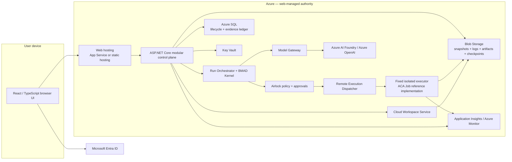
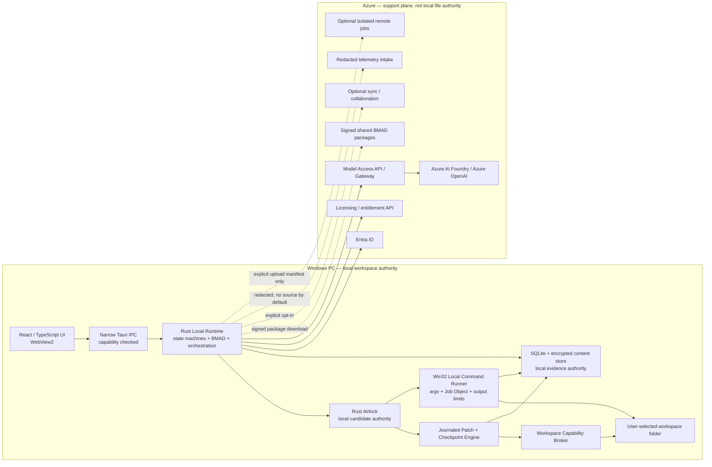

# Split Web and Windows Desktop Architecture Plans

## 1. Review verdict

The existing vault is an internally coherent **cloud-first web architecture**. It explicitly treats Azure-managed snapshots and fixed Azure Container Apps Jobs as the first real execution boundary, and it explicitly supersedes the older desktop-first plans. That remains the correct basis for the web product.

The requested Windows product cannot be represented as another execution lane inside that architecture. A Windows-installed coding agent needs a different authority boundary: the signed local Rust host owns the selected folder, local lifecycle, local execution, checkpoints, rollback, and local evidence. Azure remains a support plane for identity, entitlement, model access, packages, optional sync, telemetry, and explicitly requested remote jobs. Azure must not be in the ordinary local file-write path.

The plans therefore use this non-negotiable discriminator. Contract/domain payloads use `deliveryModel`; persistence columns use `delivery_model`:

```text
DeliveryModel = web_managed | windows_local
```

It is chosen when a `Project` is created and is immutable for the lifetime of that project. Every `Run` inherits the project's discriminator. A run cannot silently switch workspace authority or executor authority. Moving work between products creates a linked project, handoff, or run under the other delivery model; it never mutates the original discriminator. A Windows user who explicitly requests a remote job creates a separate `web_managed` cloud work record from an exact, consented upload manifest. Any returned patch is imported as a new local proposal and requires fresh local policy evaluation, approval, checkpoint, and apply.

## 2. Shared product doctrine

Both products preserve the same governance sequence:

```text
BMAD frames work
-> model returns typed output
-> runtime normalizes a proposal
-> Airlock evaluates an exact candidate
-> human approval when policy requires it
-> an audience-bound, expiring, single-use spec is minted
-> the delivery-specific executor performs the side effect
-> result is validated
-> checkpoint and rollback metadata are recorded
-> durable evidence explains the outcome
```

Shared doctrine does not mean shared execution. The web executor is remote and isolated; the desktop executor is a local Windows process under the signed host.

## 3. Shared versus delivery-specific components

| Concern | Shared across products | Web-specific | Windows-desktop-specific |
|---|---|---|---|
| BMAD | Package format, Method/Builder semantics, help catalog, validation rules, lineage, conformance fixtures | Cloud package catalog and cloud rehearsal | Signed package cache and local activation/rehearsal |
| Contracts | JSON Schema/OpenAPI object shapes, hashes, error codes, event taxonomy, policy rule IDs, replay fixtures | C# generated types and HTTP/SSE APIs | Rust types and narrow Tauri IPC commands/events |
| Model access | Model roles, schema projection, evaluation bundles, budgets, provider capability records | .NET Model Gateway called by the web control plane | Desktop calls the Azure Model Access API; no provider key is stored locally |
| Airlock semantics | Proposal/candidate/approval/spec invariants and policy fixtures | C# policy kernel binds an Azure lane/template/image | Rust policy kernel binds a device, workspace capability, executable, argv, cwd, inputs, and limits |
| UI | React components, design tokens, diff/evidence card vocabulary, accessibility expectations | Browser navigation, Entra SPA auth, remote run/reconnect states | Desktop window lifecycle, folder picker, local terminal, updater, offline/degraded states |
| Workspace | Relative-path, preimage, checkpoint, rollback, evidence, and hash contracts | Blob-backed immutable snapshot and job checkout | User-selected NTFS folder plus app-local encrypted checkpoint store |
| Execution | Structured `argv[]`, output limits, cancellation, result-manifest concepts | Fixed ACA Job or another approved isolated remote executor | Custom Rust/Win32 process runner; no browser shell API |
| State/evidence | Canonical lifecycle and evidence concepts | Runtime API + Azure SQL/Blob are authoritative | Rust host + SQLite/encrypted content store are authoritative; cloud sync is a replica |
| Identity | Entra tenant/user identity and product roles | Browser auth and project RBAC | Native public-client auth, device registration, entitlement lease |
| Distribution | Signed artifacts, SBOM, provenance, release channels | Azure deployment through Bicep/CI | Signed MSI/NSIS package and signed update feed |

The safest sharing strategy is **shared specifications and conformance tests**, not a shared process or a shared database. C#, Rust, and TypeScript implementations must pass the same canonical fixtures.

---

## Plan A — Web application

### A1. Product boundary and target users

This is the existing Sapphirus/BMAD Runtime product refined as an explicitly web-managed delivery model.

Target users:

- enterprise product, engineering, and transformation teams that want centrally governed BMAD workflows;
- users on managed or locked-down devices who should not install a local coding runtime;
- teams that need shared projects, reviewer approvals, centralized evidence, retention, audit, and operator controls;
- organizations willing and permitted to clone or upload source into an Azure-managed workspace;
- builders and reviewers of shared BMAD packages and presentation/artifact workflows.

It is not the local Windows agent. The browser never receives a local folder handle and the web plan does not run ordinary edits or tests on the user's PC.

### A2. End-user onboarding journey

1. An administrator provisions the Azure environment, Entra app registrations/app roles, tenant policy, model deployments, budgets, storage, and an isolated execution lane.
2. The user opens the web URL; there is no end-user installation.
3. Entra sign-in establishes tenant, owner scope, project roles, and reviewer eligibility.
4. The user creates or joins a project and selects a centrally approved BMAD package/profile.
5. The user imports a repository by approved clone or archive upload. The Runtime API creates an immutable cloud snapshot; the browser does not retain source authority.
6. Workspace Intelligence scans the snapshot, excludes sensitive/noise paths, and creates a reviewable `ContextPack`.
7. The user works in chat, reviews plans and diffs, and approves exact candidates inline.
8. The remote execution lane materializes an isolated checkout, applies the approved patch or command, and writes a bounded result manifest.
9. The Runtime API validates/imports the result, records a checkpoint, and materializes evidence. Rollback is another governed remote action.
10. Operators can investigate failures and policy events without gaining implicit access to raw prompts or unrelated project content.

### A3. Architecture diagram



The important boundary is that the Runtime API owns lifecycle state. The executor reports facts through a result manifest and never writes authoritative SQL state.

### A4. Component boundaries

| Component | Owns | Must not own |
|---|---|---|
| React Workbench | Chat, file/context views, diff/approval cards, streamed status, artifact/evidence views | Policy, durable lifecycle truth, workspace mutation |
| Runtime API | Authentication context, owner/project authorization, commands, idempotency, state machines, SQL transactions, outbox, evidence ledger | Provider SDK state or worker internals |
| BMAD Kernel | Method phases, capabilities, package/config semantics, artifact expectations, validation | Identity, approval, secrets, worker dispatch |
| Run Orchestrator | Intent routing, context/model call coordination, typed-output normalization, proposal creation, bounded repair loop | Direct writes or commands |
| Model Gateway | Exact deployment/profile resolution, schema projection, budget, redaction, typed provider errors, evaluation gates | Proposal authority, policy decisions, durable thread truth |
| Airlock | Pure evaluation of an exact candidate, risk, required approval, single-use remote execution authority | Command execution or containment |
| Cloud Workspace Service | Imports, immutable snapshots, checkouts, preimages, locks, checkpoints, rollback manifests, cleanup | Model calls or policy decisions |
| Remote executor | One approved attempt in a job-scoped checkout; bounded logs/artifacts/result manifest | SQL lifecycle writes, policy reinterpretation, dynamic image or identity choice |
| Evidence/Observability | Authoritative ledger materialization, redacted evidence, telemetry projections | Treating sampled telemetry as domain truth |
| Operator Console | Policies, budgets, kill switches, incidents, health and release evidence | Bypassing project authorization or silently viewing privileged content |

### A5. Technology baseline

| Layer | Technology |
|---|---|
| UI | React + TypeScript, Vite SPA, React Router, generated API client |
| Control plane | .NET/C# ASP.NET Core modular monolith |
| Streaming | SSE first; SignalR/WebSocket only where reconnect or duplex needs justify it |
| Contracts | OpenAPI 3.1.x, JSON Schema 2020-12, canonical JSON/hash rules |
| Worker/tooling | Per-image Python/uv or purpose-built worker runtime; digest-pinned and stateless |
| State | Azure SQL for compact lifecycle, locks, outbox, evidence ledger, indexes |
| Payloads | Blob Storage for snapshots, diffs, logs, artifacts, manifests, checkpoints, evidence bundles |
| AI | Azure AI Foundry/Azure OpenAI through the evaluated Model Gateway; app-owned state and typed outputs |
| IaC/build | Bicep, pinned modules, hosted CI/ACR remote image builds, SBOM/provenance/signing |
| Telemetry | OpenTelemetry server/worker instrumentation plus Application Insights/Azure Monitor |

### A6. Azure services

Required for the production reference deployment:

- Microsoft Entra ID for user and workload identity;
- Azure App Service or an ADR-approved static host for the React surface;
- Azure Container Apps for the .NET Runtime API where selected by the hosting ADR;
- Azure AI Foundry/Azure OpenAI for model deployments;
- Azure SQL Database;
- Azure Blob Storage;
- Azure Key Vault;
- Azure Container Registry and hosted CI/ACR Tasks for immutable worker builds;
- Application Insights, Azure Monitor, and Log Analytics;
- managed identities and least-privilege Azure RBAC.

Execution service rule:

- The reference v1 uses fixed, digest-pinned Azure Container Apps Jobs for finite patch/test/build/export work.
- A read-only/planning deployment may omit the job lane, but it must not claim coding execution.
- Another remote executor can replace ACA Jobs only through an ADR proving equivalent isolation, immutable-spec binding, identity, output limits, manifest, evidence, cancellation, and recovery behavior.
- Dynamic Sessions or newer sandbox services remain measured alternatives, not hidden defaults.

### A7. Security model

- Entra authenticates users; Runtime API authorization still enforces owner/project/app roles on every object and command.
- Managed identities access SQL, Blob, Key Vault, ACR, and Foundry; no user-facing provider keys exist.
- Workspace files, package text, tool output, and model output are untrusted data and cannot become policy or system authority.
- Models emit typed outputs only. They cannot write, execute, export, activate a package, or mutate external services.
- Airlock evaluates the exact candidate hash. Approval is bound to that hash; the issued spec is audience-bound, expiring, and single-use.
- Commands are `argv[]`; raw shell strings and inline interpreter forms are blocked by default.
- Remote execution uses a fixed template, digest, entrypoint, identity, secret bindings, network profile, resource limits, and output locations provisioned by IaC. Runtime requests cannot override them.
- Workers have no lifecycle SQL credentials. The Runtime API validates the `WebWorkerResultManifest` and performs atomic state/evidence/outbox transitions.
- Prompt, log, diff, trace, and evidence retention is classified and redacted. Operational telemetry may sample/drop and is never evidence authority.
- Rollback guarantees only tracked workspace files. External effects are blocked in v1 or shown as explicitly non-reversible.

### A8. Execution and workspace model

```text
clone/upload
-> immutable Blob snapshot
-> context/index projection
-> exact proposal with snapshot/checkpoint/preimage hashes
-> Airlock and approval
-> fixed remote executor materializes an isolated checkout
-> patch/argv command executes
-> result manifest and bounded logs land in Blob
-> Runtime API validates/imports
-> cloud checkpoint and rollback plan
-> EvidenceLedgerEvent + outbox + EvidenceBundle
```

Rules:

- Cloud Workspace Service is the only workspace authority.
- A canonical snapshot is never edited in place.
- Single-writer/multi-reader locking and stale-preimage detection are server-side.
- Local user folders are not mounted or addressed by the web product.
- Git push remains out of v1. Export or a prepared commit/bundle is an explicit governed action.

### A9. Phased MVP roadmap

| Phase | Outcome | Exit gate |
|---|---|---|
| W0 — contracts and governance | Delivery discriminator, BMAD fixtures, canonical objects/states, owner scope, Airlock/evidence fixtures | Shared schemas compile in C#/TS and replay deterministically |
| W1 — managed read-only slice | Entra web app, project/thread, repository import, snapshot, file/context views, fake model, plan | No side-effect claim; cross-project access tests pass |
| W2 — governed proposal slice | Real evaluated model profile, typed patch/command candidates, diff and approval UI, no execution | Candidate hash and stale-preimage negative tests pass |
| W3 — isolated execution | Fixed remote executor, manifest import, logs, checkpoint, rollback, repair cap | First end-to-end governed remote side effect and crash/retry evidence |
| W4 — BMAD/package/artifact breadth | Arbitrary package scan/rehearsal/activation, Builder draft lifecycle, presentation adapter | Untrusted package code never enters the control plane; activation is reversible |
| W5 — production hardening | Operator controls, retention/deletion, backup/restore, cost/load, DR, supply chain, accessibility | Fresh-environment deploy, security gates, rollback and evidence regeneration pass |

### A10. Principal risks

| Risk | Consequence | Mitigation |
|---|---|---|
| Remote job latency | Slow edit/test loop | Stream queued/starting states; benchmark after the fixed-job baseline; add a compatible low-latency lane only with evidence |
| Source residency restrictions | Some users cannot upload repositories | Make suitability explicit; offer the separate Windows product, not a hidden hybrid web connector |
| Control-plane concentration | Modular monolith becomes a god object | Enforce ports, table/blob ownership, state-machine authority, contract tests |
| Approval fatigue | Users approve blindly | Exact diff/argv/risk presentation, scoped grants that never become execution authority, safe read-only modes |
| Worker escape or over-privilege | Source/secrets compromise | Fixed templates, minimal identity, network policy, no SQL credentials, signed images, security tests |
| Evidence/privacy conflict | Too much data retained or too little proof | Evidence ledger with hashes/refs, retention classes, redaction, privileged raw view only when enabled |
| Azure cost/quota | Unpredictable unit economics | Model profiles, budgets, quotas, job limits, cost dashboards, tenant kill switches |

### A11. Unresolved web decisions

- **WEB-01 — SPA hosting:** App Service versus static hosting. Keep App Service as the reference until an ADR proves static hosting meets Entra, CSP, deployment, rollback, and environment configuration needs.
- **WEB-02 — Runtime API hosting:** Container Apps versus App Service. Current recommendation remains Container Apps for the API.
- **WEB-03 — Low-latency remote execution:** Whether ACA Jobs alone meet the interactive p95 target. Decide only after the fixed-job benchmark.
- **WEB-04 — Private networking profile:** Exact private endpoint/VNet/egress topology by environment and customer tier.
- **WEB-05 — Repository ingress:** OAuth clone credentials, archive upload, and enterprise source connectors; v1 should start with the smallest approved set.
- **WEB-06 — Evidence retention:** Tenant-specific raw prompt/context retention and legal hold policy.

---

## Plan B — Windows desktop application

### B1. Product boundary and target users

This is a Windows-installed, local-first coding agent. It uses React/TypeScript for the experience and Tauri/Rust as the native authority. Tauri is preferred over Electron because the product needs a small signed native host with explicit IPC permissions and should use the Windows WebView2 runtime instead of shipping a full browser plus Node runtime. Electron is not justified for the MVP; a .NET/WPF or WinUI host would improve native Microsoft auth integration but would discard the requested Rust security/core boundary and split the UI stack.

Target users:

- Windows developers who want an agent beside their local editor and toolchain;
- users whose repositories must remain on their device except for the exact context sent to the organization's Azure-hosted model;
- teams that want BMAD packages, approvals, diffs, evidence, and rollback without a local server or container platform;
- enterprise users who need Entra licensing, shared policy/packages, optional collaboration, and centrally governed model access.

No local Docker, Kubernetes, self-hosted service, model server, GPU, or always-running daemon is required. Installed compilers/test tools are used only when the user approves their execution.

### B2. End-user install and onboarding journey

1. The user downloads a signed Windows installer from an enterprise portal, Intune/winget channel, or approved update service. The installer verifies publisher signature and ensures an acceptable WebView2 runtime.
2. The app starts as a normal per-user Windows application; it does not install a system service or require administrator rights for ordinary use.
3. The user signs in through the system browser using an Entra native/public-client authorization-code flow with PKCE.
4. The cloud entitlement API returns product roles, tenant policy, package channels, model availability, sync policy, and a signed offline entitlement lease. Tokens and device secrets are protected with user-scoped Windows DPAPI.
5. The app explains the data boundary: local folders stay local; only selected/redacted `ContextPack` material is sent to the Azure model service; code/evidence sync and remote jobs are separate opt-in actions.
6. The user selects a workspace through the native folder picker. The Rust host records a revocable `LocalWorkspaceCapability`; the React UI receives a workspace ID and relative paths, not a general filesystem API.
7. The Rust host scans within that root, applies ignore/secret rules, detects BMAD packages/toolchains, and displays the context selection.
8. The user asks for work. The cloud model returns typed output; the local runtime normalizes it into a proposal.
9. The user reviews the diff or exact command. Local Airlock evaluates the candidate and the user approves the candidate hash where required.
10. The Rust host checkpoints affected files, performs a journaled crash-recoverable batch apply with per-file atomic replacement where the filesystem supports it or runs the approved local command, captures bounded/redacted output, validates results, and records local evidence.
11. The user may roll back tracked file changes. Sync, collaboration, and remote execution remain separately labeled actions and never become implicit parts of local apply.

### B3. Architecture diagram



No Azure component has a local path, folder handle, or file-write primitive. The only ordinary file mutation path is `Rust Airlock -> local patch/checkpoint engine -> selected folder`.

### B4. Component boundaries

| Component | Owns | Must not own |
|---|---|---|
| React desktop UI | Chat, explorer, context review, diff, approval, terminal/evidence presentation, settings | Direct filesystem, shell, tokens, policy, durable lifecycle transitions |
| Tauri IPC boundary | Small typed commands/events, window-specific capabilities, request size/rate limits | Generic `read(path)`, `write(path)`, or `shell(command)` primitives exposed to web content |
| Rust Local Runtime | Local state machines, BMAD interpretation, context coordination, typed model-result normalization, proposal/evidence lifecycle | Azure provider secrets or unreviewed side effects |
| Workspace Capability Broker | Folder-picker grants, canonical root identity, relative path resolution, reparse/hardlink policy, ignore/secret rules, revocation | Paths outside selected roots or silent root expansion |
| Local Airlock | Pure local policy, exact candidate hash, risk, approval, audience-bound single-use local spec | Performing writes/commands or claiming OS sandboxing |
| Patch/Checkpoint Engine | Preimages, affected-file checkpoint, journaled batch apply, per-file atomic replacement where supported, rollback manifest, stale-write detection | Commands, network activity, external effects |
| Local Command Runner | Resolve executable, bind argv/cwd/env, create/terminate process tree, stream bounded output, result manifest | Shell-string interpretation, UI-originated unrestricted spawn, policy decisions |
| Local Evidence Store | SQLite lifecycle/outbox/ledger indexes, encrypted content-addressed payloads, retention and export | Becoming cloud-authoritative merely because sync is enabled |
| Azure Model Access API | Authenticate user/device, enforce entitlement/model policy/budget, use managed identity for Foundry, return typed responses | Local path access, local patch apply, durable local run authority |
| Sync/Collaboration API | Optional replicated settings, package pins, review metadata, explicitly selected evidence/artifacts | Automatic source upload or remote control of local execution |
| Optional Remote Job API | Explicit upload manifest, isolated remote attempt, signed result/evidence | Applying returned changes to the local folder |

### B5. Technology baseline

| Layer | Technology |
|---|---|
| UI | React + TypeScript + Vite rendered by WebView2 |
| Native host | Tauri 2 with stable Rust, Tokio, Serde, generated IPC types |
| Local state | SQLite in WAL mode for metadata/state; encrypted content-addressed payload store under `%LOCALAPPDATA%` |
| Secret protection | User-scoped Windows DPAPI protects refresh/device keys and the local payload-encryption master key |
| File operations | Custom Rust service using canonicalized Windows paths, file IDs, reparse-point checks, byte/entry limits, journaled crash recovery, per-file atomic replacement where supported, SHA-256 |
| Search/context | Rust `ignore`/glob/walk and lexical search first; Tree-sitter is optional after a measured relevance/size gate |
| Diff/patch | Canonical structured patch model and a Rust apply engine; Git status/HEAD may be read but Git is not checkpoint authority |
| Process execution | Custom Rust/Win32 `CreateProcess` path with structured argv, sanitized environment, selected-root cwd, Job Object process-tree control, timeout/cancel/output caps |
| Cloud API | HTTPS/JSON or streaming HTTP with generated Rust contracts; Entra bearer tokens scoped to Sapphirus APIs |
| Packaging | Signed Tauri Windows MSI or NSIS installer, signed update artifacts/feed, SBOM and provenance |
| Telemetry | Local redaction and opt-in policy; batched HTTPS/OTLP-style intake to Azure Monitor/Application Insights |

Tauri's generic filesystem and shell plugins must not be granted broad scopes to the main webview. The application should expose purpose-built Rust commands such as `read_workspace_file(workspace_id, relative_path)`, `evaluate_candidate(candidate_id)`, and `execute_approved_spec(spec_id)`.

### B6. Azure services

Azure remains required for connected product capabilities, not for ordinary local mutation:

- Microsoft Entra ID for workforce sign-in and tenant identity;
- ASP.NET Core support-plane APIs for licensing/entitlements, model access, policy/package distribution, sync, collaboration, and update metadata;
- Azure AI Foundry/Azure OpenAI behind the Model Access API;
- managed identity from the cloud API to Foundry/OpenAI, SQL, Blob, and Key Vault;
- Azure SQL for tenants, entitlements, package catalog, sync metadata, collaboration records, and server-side model/evaluation records;
- Blob Storage for signed BMAD packages, opted-in synced evidence/artifacts, installers/update payloads, and explicit remote-job snapshots;
- Key Vault for service secrets/signing references and provider credentials where managed identity is not available;
- Application Insights/Azure Monitor for redacted service and opted-in desktop telemetry;
- Azure Container Registry and optional Container Apps Jobs only for explicit remote jobs or package rehearsal, never for normal local edits/tests.

### B7. Security model

#### B7.1 Local folder authority

- “Selected folders only” applies to user workspace content. The app may also access its own signed installation resources and app-owned `%LOCALAPPDATA%` state/cache/log locations, which are never offered to the model as workspace content.
- A native folder-picker action creates a `LocalWorkspaceCapability` containing a generated ID, canonical root, volume/file identity where available, grant time, owner/device, and policy version.
- The UI calls Rust with the capability ID and relative paths. It never receives an unrestricted Rust filesystem bridge.
- Every operation re-resolves the target beneath the current root and rejects traversal, unsafe device paths, alternate data streams where disallowed, reparse-point escapes, unexpected hardlinks, and changed root identity.
- Sensitive paths (`.git` internals, `.ssh`, credential files, environment secrets, dependency caches, ignored binaries) have separate read/context/write policies.
- Grants are visible and revocable. Missing, moved, or identity-changed roots require user re-selection.

#### B7.2 Model and data egress

- The desktop never contains an Azure OpenAI key. It calls the Sapphirus Model Access API with an Entra token; the cloud service uses managed identity.
- Only the exact, hashed, size-bounded, redacted `ContextPack` needed for a call is transmitted. Whole-repository upload is off by default.
- The UI shows which files/snippets will leave the device and why. Tenant policy may require explicit approval for each context egress or may grant a scoped workspace/session policy.
- Model output is untrusted typed data. It returns to the Rust host and cannot invoke Tauri commands directly.
- Telemetry excludes source, prompts, terminal payloads, diffs, and paths by default. Diagnostic upload is explicit and previewable.

#### B7.3 Local Airlock and execution

- Local `ExecutionSpecCandidate` binds device/install audience, workspace capability/root identity, base checkpoint, preimage hashes, exact resolved executable, executable identity/hash where feasible, argv, cwd, environment names/value-source hashes, declared writes, network declaration, timeout, output limits, and rollback class.
- Approval binds the exact candidate hash. Issuance revalidates all mutable inputs and creates a single-use local spec.
- Patch apply checkpoints every affected file before mutation, journals batch progress, and uses per-file atomic replacement where supported. Multi-file atomicity is not claimed.
- The command runner does not expose `cmd /c`, PowerShell `-Command`, arbitrary script text, or Tauri shell execution as the default interface. Interpreter/script files can be allowed only as explicit operands with their own hashes and risk label.
- Child processes are assigned to a Windows Job Object for process-tree cancellation and resource/accounting controls.
- Output is size/line/time bounded, redacted before model reuse or sync, and linked to the local result manifest.

#### B7.4 Important containment limit

Airlock and Windows Job Objects are not a filesystem or network sandbox. An ordinary locally launched compiler/test process normally inherits the signed-in user's OS permissions and may read outside the selected workspace even if Sapphirus itself never asks it to. Strongly confining arbitrary existing developer tools to one folder without containers can break toolchains and requires a proven AppContainer/restricted-token/broker design.

Until that mechanism is proven, a candidate's network declaration is policy/evidence and a user warning, not a claim that arbitrary child-process egress is technically blocked.

The MVP may claim **workspace-bounded application file APIs and approval-gated local execution**, but must not claim that every child process is strongly sandboxed until the Phase D0 containment spike passes. If strict child-process folder confinement is a hard release requirement, that spike is a go/no-go gate rather than a deferred enhancement.

#### B7.5 Local secrets and evidence

- Entra refresh/device material and the local data-encryption key are protected with user-scoped DPAPI. Machine-wide DPAPI is not used for user tokens.
- SQLite stores minimal indexed state. Sensitive prompts, logs, diffs, and evidence payloads are encrypted with an authenticated key protected by DPAPI.
- Local evidence is append-only/hash-linked and remains authoritative for local runs. Optional cloud sync stores a replica or signed materialization, not the source of truth for file changes.
- Rollback covers only checkpointed file mutations. Package installs, registry changes, network calls, databases, and external services are non-reversible unless a specific adapter provides a tested compensating action.

### B8. Execution and workspace model

Ordinary local path:

```text
folder picker grant
-> local scan and ContextPack
-> selected/redacted context sent to Azure model
-> typed model output returns
-> local proposal/candidate
-> local Airlock + approval
-> local preimage recheck and checkpoint
-> local patch apply OR local approved argv process
-> local result validation
-> local checkpoint/rollback plan
-> local evidence ledger/bundle
```

Optional remote-job path:

```text
explicit user action
-> previewed upload manifest and policy decision
-> immutable selected snapshot uploaded to Azure
-> separate remote execution record
-> signed result manifest / patch proposal returned
-> local user reviews a new local candidate
-> local Airlock applies locally only after local approval
```

Rules:

- Local mode is the default and cannot silently fall back to remote execution.
- Azure sync cannot mutate the selected folder.
- Cloud collaboration can request/recommend a change but cannot mint local execution authority.
- A local run remains usable for history, diff, rollback, and deterministic BMAD operations when offline; new model calls require connectivity unless a future non-Azure model policy is explicitly adopted.
- No local server, daemon, Docker engine, Kubernetes cluster, GPU, or model runtime is installed.

### B9. Phased MVP roadmap

| Phase | Outcome | Exit gate |
|---|---|---|
| D0 — feasibility/security spikes | Tauri/WebView2 shell, signed installer, native Entra PKCE, dynamic folder capability, path/reparse tests, journaled checkpoint/rollback, Win32 argv runner, Job Object, containment evaluation | Go/no-go on folder guarantee and auth/packaging approach; no broad shell/fs plugin permission |
| D1 — local read-only companion | Select/revoke folder, tree/read/search, BMAD detection/help, local SQLite state, fake model, context review | App-owned file API cannot escape selected root; clean uninstall leaves workspace unchanged |
| D2 — connected planning agent | Entra entitlement, Azure Model Access API, typed model responses, plan/diff proposal, egress preview/redaction, local evidence | No provider secret on device; exact sent context and model output hashes reconstructable |
| D3 — governed local edits | Rust Airlock, exact approval cards, checkpoints, journaled patch apply, rollback, stale-preimage detection | Crash-at-boundary and rollback suites pass; every write has candidate/spec/evidence |
| D4 — governed local commands | Allowlisted tool discovery, exact argv approval, custom runner, output streaming/redaction, cancel/timeout, validation and bounded repair | No generic UI shell; process-tree cleanup and non-reversible warnings pass |
| D5 — BMAD packages and collaboration | Signed shared package catalog/cache, governed local package activation, opt-in settings/evidence sync, review requests | Package signature/compatibility/revocation and sync privacy tests pass |
| D6 — optional remote jobs and enterprise release | Explicit upload manifest, remote result import as proposal, managed update rings, Intune/winget path, telemetry controls, recovery/export | Remote job cannot edit local files; signed update/rollback and enterprise deployment pass |

### B10. Principal risks

| Risk | Consequence | Mitigation |
|---|---|---|
| Child process inherits user permissions | A test/tool can access files outside the selected root | Explicit limitation, exact approvals, sanitized env, executable policy, Job Objects, D0 AppContainer/restricted-token spike, no sandbox claim before proof |
| Frontend compromise/XSS | WebView attempts privileged native calls | Strict CSP, local assets only, no remote web content, narrow Tauri capabilities, typed Rust commands, all side effects revalidated in Rust |
| Path/reparse races | Escape or wrong-file mutation | Handle/file-ID aware checks, no string-prefix security, preimage recheck, atomic operations, adversarial NTFS tests |
| Cloud model egress surprises users | Source confidentiality breach | Context preview, secret scanning/redaction, tenant policy, no whole-repo upload, evidence of exact sent content |
| Local state corruption or app crash | Lost history or partial write | SQLite transactions/WAL, file journal, pre-write checkpoint, crash-injection tests, repair/doctor flow |
| Rollback overclaim | External effects remain after rollback | File-scoped guarantee, non-reversible labels, block risky external commands by default |
| Auth library gap in Rust | Weak SSO/token lifecycle or maintenance burden | D0 standards-compliant PKCE spike; consider a narrowly scoped signed WAM/MSAL helper only if required by enterprise SSO evidence |
| Update-channel compromise | Malicious native binary | Authenticode, mandatory updater signatures, protected signing keys, staged rings, rollback, SBOM/provenance |
| Dual implementations drift | Web and desktop policy/state semantics diverge | Shared schemas, golden fixtures, language-neutral conformance suite, compatibility matrix, cross-product release gate |
| Offline licensing/model expectations | Confusing degraded mode | Signed entitlement lease with explicit expiry/grace policy; UI distinguishes local tools from connected model capabilities |

### B11. Unresolved desktop decisions

- **DESK-01 — Child-process containment:** local-user permissions only, restricted token, or AppContainer/brokered process. This is the most important security decision and must be resolved by D0 evidence.
- **DESK-02 — Entra native auth implementation:** pure Rust system-browser PKCE with loopback redirect versus a minimal signed Windows Web Account Manager/MSAL helper. Prefer pure Rust unless Conditional Access/SSO tests prove it insufficient.
- **DESK-03 — Installer/update channel:** MSI/WiX versus NSIS for direct distribution, and how enterprise Intune/winget deployment interacts with in-app updates. All channels require signing and staged rollback.
- **DESK-04 — Local database encryption:** encrypted payload store with minimal SQLite metadata versus SQLCipher. Decide from threat model, support burden, backup/recovery, and licensing evidence.
- **DESK-05 — Executable identity binding:** path + file metadata versus mandatory binary hash/signature binding for reusable grants; measure performance and toolchain update behavior.
- **DESK-06 — Context egress consent:** every model call versus scoped workspace/session grants, with tenant policy able to require the stricter mode.
- **DESK-07 — Sync scope and encryption:** metadata only, selected evidence/artifacts, or end-to-end encrypted collaboration payloads. Source sync remains off by default.
- **DESK-08 — Offline entitlement:** exact grace duration, revocation response, and behavior under clock tampering or extended disconnection.
- **DESK-09 — Workspace metadata location:** app-local only is recommended; writing `.sapphirus/` into repositories requires explicit opt-in and ignore guidance.
- **DESK-10 — Git integration:** read-only status/diff in MVP versus optional commit creation later. Auto-push remains out of scope.

---

## 4. Cross-product compatibility rules

1. `delivery_model` is mandatory on projects, runs, candidates, specs, executions, checkpoints, result manifests, and evidence bundles.
2. `executor_audience` is delivery-specific: an Azure template/lane for web; a device/install/local-host identity for desktop.
3. A shared schema may use discriminated unions, but it must not create fields that are meaningless and silently ignored by one executor.
4. Web state is authoritative in Azure SQL/Blob. Desktop local-run state is authoritative in the local store. Sync never changes that fact.
5. Web checkpoints reference cloud snapshot/checkouts. Desktop checkpoints reference selected-folder identity and encrypted local content hashes.
6. `WebWorkerResultManifest` and `WindowsLocalExecutionResultManifest` share an `ExecutionResultManifest` evidence envelope but have separate executor-specific payloads.
7. Remote results imported by desktop are proposals/evidence, not local write authority.
8. Shared BMAD packages are immutable, signed, versioned, compatibility-declared, cached locally, and revocable. Discovery never implies activation.
9. Model profiles/evaluations are shared, but every call records the delivery model, data/retention class, exact context hash, and credential/capability profile.
10. Release cannot promote one delivery model on evidence gathered only from the other.

## 5. Architecture document migration record

V6.17 applied the following vault-wide changes so cloud-first delivery is no longer presented as the single product shape. The tables remain the maintenance coverage map: future changes to either delivery model must keep these notes consistent.

### 5.1 New authority documents created

| New document | Purpose |
|---|---|
| `93 - Split Web and Windows Desktop Architecture Plans.md` | This plan and the no-mixing rule |
| `94 - Windows Desktop Native Host and IPC.md` | Tauri/Rust boundaries, commands, capabilities, WebView/CSP, lifecycle |
| `95 - Windows Local Workspace and Execution.md` | Folder grants, path safety, local Airlock, patch/command runner, containment decision |
| `96 - Windows Local State, Evidence, Checkpoint, and Rollback.md` | SQLite/encrypted store, state machines, crash recovery, evidence and rollback |
| `97 - Windows Desktop Security and Trust Model.md` | Native trust boundaries, containment claims, identity/token security, egress, signing/update, privacy, tests, release gates |
| `98 - Azure Support Plane for Windows Desktop.md` | Entra, entitlements, Model Access, packages, opt-in sync/telemetry, update metadata, explicit remote jobs |
| `99 - Dual-Delivery Contract and Conformance Specification.md` | Discriminated schemas, canonical hashing, golden fixtures, compatibility matrix, release gate |

### 5.2 Existing authority documents requiring a structural rewrite

| Documents | Required change |
|---|---|
| `Start Here.md`, `Vault Map.md`, `manifest.json` | Add two reading paths, identify this split as current authority, and regenerate inventory/hashes |
| `00 - Common Rules and Product Shape.md` | Define the shared doctrine plus two product/delivery boundaries; remove the claim that desktop-first is globally superseded |
| `01 - First Build - Executable Vertical Slice.md` | Split into W1–W3 web slice and D0–D4 desktop slice; never use the fake/cloud sequence as the desktop roadmap |
| `02 - Locked Architecture Decisions.md` | Scope existing cloud locks to `web_managed`; add Tauri/Rust, local authority, no-container local execution, model-broker, and no-silent-remote-fallback decisions |
| `08 - Phased Roadmap and Build Order.md`, `51 - Master Implementation Sequence.md`, `72 - Week-by-Week Build Plan.md`, `90 - LLM-Tailored Development Plan and Agent Workflow.md` | Publish separate web and desktop sequences and gates |
| `31 - Architecture Decision Records.md` | Add ADRs for delivery split, authority ownership, desktop containment, native auth, installer/update, local encryption, sync scope, and remote-job import semantics |
| `76 - Current Stack Baseline.md`, `82 - Current Technology Decision Summary.md`, `91 - Technology, Language, Method, and LLM Implementation Review.md` | Replace the single cloud-first verdict with a shared baseline plus explicit web and Windows baselines |

### 5.3 Existing component documents requiring web/desktop separation

| Documents | Required change |
|---|---|
| `10 - Chat Workbench.md`, `26 - Frontend Design System.md`, `43 - Product UX Flows and Wireframe Notes.md`, `66 - Frontend Component Specification.md` | Separate browser and desktop shells, onboarding, offline/degraded, folder, terminal, update, and remote-job UX; retain shared cards/tokens |
| `11 - Runtime API Control Plane.md`, `12 - Run Orchestrator and Agent Kernel.md`, `63 - Backend Port Interfaces.md` | Keep .NET authority for web; define cloud support APIs and Rust local ports without making desktop call web workspace mutation routes |
| `13 - BMAD Kernel, Package Loader, and Help Advisor.md`, `14 - Builder Studio and SkillOps.md`, `15 - Artifact Creator and Presentation Adapter.md`, `39 - BMAD Package Format.md`, `69 - BMAD Validation Rules.md`, `70 - Presentation Adapter Mapping Workbook.md` | Mark portable BMAD semantics and define cloud catalog versus signed local cache/activation/rehearsal |
| `16 - Workspace Service.md`, `17 - Workspace Intelligence and Context Packs.md` | Split cloud snapshots/checkouts from local selected-folder capabilities; add context-egress policy and local path rules |
| `18 - Model Gateway and Microsoft Foundry.md` | Add desktop public-client-to-model-broker flow, entitlement/budget checks, exact egress evidence, and prohibition on device provider keys |
| `19 - Airlock Policy and Approvals.md`, `55 - Airlock Policy Rulebook.md` | Define delivery-specific candidate/spec unions and executor audiences; add local executable/workspace/device bindings |
| `20 - Execution Lanes and Container App Jobs.md`, `38 - Worker Images and Command DSL.md`, `56 - Worker Manifest Protocol.md` | Scope ACA lanes to web/explicit remote jobs; create a separate local runner/result protocol and forbid treating it as ACA-equivalent isolation |
| `21 - Trace, Evidence, and Observability.md`, `41 - Observability Dashboards and Alerts.md`, `45 - Trace Bundle Schema.md` | Define local evidence authority, opt-in sync, desktop privacy/telemetry, and cross-device diagnostic export |
| `22 - Data Model - SQL and Blob.md`, `47 - Database DDL Starter.md`, `48 - Blob Storage Layout.md`, `65 - SQL Migration and Index Plan.md` | Keep web Azure persistence; add a separate desktop SQLite/encrypted-store schema and cloud sync schema without dual authority |
| `23 - Security, Identity, and Secrets.md`, `40 - Threat Model and Security Tests.md`, `68 - Security Test Case Catalog.md` | Add Tauri/WebView, IPC, path/reparse race, local process, token/DPAPI, update supply-chain, egress, and physical-device threats |
| `24 - Operator Console and Operations.md` | Separate web operators from desktop fleet/support controls; operators cannot remotely execute on local folders |
| `27 - Testing, Validation, and Replay.md`, `33 - Release Gates and Acceptance Matrix.md`, `57 - Replay Fixture Library Plan.md`, `59 - Definition of Done by Component.md` | Add delivery-specific conformance, crash, security, installer, offline, sync, and no-silent-remote-fallback gates |
| `28 - Supply Chain, Deployment, and IaC.md`, `36 - Local Development and DevEx.md`, `37 - Azure Environments and Deployment Runbooks.md`, `67 - Azure IaC Module Specification.md` | Preserve web IaC; add Rust/Tauri dependency, Windows build/sign/update, clean-machine, and enterprise install pipelines |
| `29 - Concurrency, Transactions, and Failures.md`, `42 - Migrations, Retention, and Cleanup.md`, `54 - State Machine Reference.md` | Add local locks/file watchers, desktop crash recovery, local migrations/retention, sync conflicts, and immutable delivery-specific transitions |
| `34 - Canonical Object Model.md`, `52 - API, Event, Table, and Blob Ownership.md`, `53 - Event Taxonomy and Stream Protocol.md`, `64 - JSON Schema Contract Examples.md` | Add delivery discriminator and executor-specific types; define local store ownership separately from SQL/Blob ownership |

### 5.4 Planning and verification documents requiring follow-through updates

- `03 - Repository and Vault Usage.md`
- `04 - Review Findings and Changelog.md`
- `07 - Source Coverage Matrix.md`
- `09 - Glossary and Naming.md`
- `25 - OpenAPI, Schemas, and Generated Clients.md`
- `30 - Implementation Epics and Backlog.md`
- `32 - Integration Contract Map.md`
- `35 - Source Alignment Notes.md`
- `44 - AI Coding Agent Handoff Prompts.md`
- `46 - API Route Catalog.md`
- `49 - Detailed Component Build Checklists.md`
- `58 - Risk Register and Mitigation Plan.md`
- `60 - External Platform References and Verification Sources.md`
- `61 - First Vertical Slice User Stories.md`
- `62 - Component Interview Prompts.md`
- `71 - Backlog Story Template and Ready Rules.md`
- `73 - Verification Register.md`
- `74 - Targeted Corrections.md`
- `75 - Library Validation Protocol.md`
- `77 - Platform Revalidation Register.md`
- `78 - Deprecation and Preview Watchlist.md`
- `80 - Modern Engineering Methods.md`
- `81 - Modernization Spike Backlog.md`
- `89 - Consolidated AI Workspace Source Review and Architecture Improvements.md`

These files now use explicit shared/web/desktop sections or applicability rules. Contract/domain payloads use `deliveryModel`, persistence uses `delivery_model`, and `sealed_test_fake` is reserved for the deterministic development adapter.

### 5.5 Historical documents that should remain historical

`05 - Preserved Source Context.md`, `06 - Preserved Critical Review.md`, `50 - V4 Full Library Audit.md`, `83` through `88` source reviews, and `92 - Source Snapshot Verification and Adoption Ledger.md` were preserved as historical evidence and received only concise supersession notices.

## 6. Required ADR set

| ADR | Decision |
|---|---|
| ADR-031 | Two delivery models and immutable authority discriminator |
| ADR-032 | Tauri 2/Rust desktop host and no broad filesystem/shell bridge |
| ADR-033 | Desktop local state/evidence authority versus cloud replica |
| ADR-034 | Local workspace capability, NTFS path/reparse policy, and grant revocation |
| ADR-035 | Local command containment claim and D0 go/no-go criteria |
| ADR-036 | Desktop Entra public-client authentication implementation |
| ADR-037 | Cloud Model Access API; no provider credential on device |
| ADR-038 | Context egress consent, redaction, and retention policy |
| ADR-039 | Desktop installer, signing, updater, and enterprise distribution |
| ADR-045 | Local encryption, DPAPI key protection, backup and recovery |
| ADR-046 | Sync/collaboration scope and conflict authority |
| ADR-047 | Explicit remote-job upload and local re-approval semantics |
| ADR-048 | Shared contract/conformance strategy across C#, Rust, and TypeScript |

## 7. Immediate implementation recommendation

Do not start by extracting the existing .NET Workspace Service into a shared service for desktop. Start with two executable proofs against the same contract fixtures:

1. Keep the current web proof: cloud snapshot -> exact candidate -> Airlock -> fixed remote executor -> manifest import -> cloud checkpoint/evidence.
2. Build the desktop D0/D1 proof: selected folder -> Rust-bounded read -> exact candidate -> local Airlock -> checkpoint -> journaled local patch -> local rollback/evidence.

Only after both proofs pass should shared generated schemas, UI components, BMAD fixtures, and cloud Model Access/package services be consolidated. This sequence proves the authority split before code sharing can accidentally blur it.

## 8. Detailed architecture contract set

This decision note is the product-level authority. Implementation must also follow the delivery-specific contract notes:

- [[94 - Windows Desktop Native Host and IPC]] for the Tauri/Rust process boundary and narrow IPC contract;
- [[95 - Windows Local Workspace and Execution]] for folder capabilities, context selection, journaled patching, command execution, and remote-job handoff;
- [[96 - Windows Local State, Evidence, Checkpoint, and Rollback]] for SQLite, encrypted payloads, ledger integrity, recovery, and rollback;
- [[97 - Windows Desktop Security and Trust Model]] for containment claims, identity, supply-chain security, and release gates;
- [[98 - Azure Support Plane for Windows Desktop]] for identity, licensing, model access, packages, opt-in sync, telemetry, and remote jobs;
- [[99 - Dual-Delivery Contract and Conformance Specification]] for the C#, Rust, and TypeScript interoperability contract.

## 9. Primary external validation references

- Tauri permissions and capabilities: [Tauri permissions](https://v2.tauri.app/security/permissions/) and [Tauri capabilities](https://v2.tauri.app/security/capabilities/)
- Tauri filesystem security/scopes: [Tauri file system plugin](https://v2.tauri.app/plugin/file-system/)
- Tauri shell risk and permissions: [Tauri shell plugin](https://v2.tauri.app/plugin/shell/)
- Tauri Windows installers/WebView2: [Tauri Windows installer](https://v2.tauri.app/distribute/windows-installer/) and [WebView versions](https://v2.tauri.app/reference/webview-versions/)
- Tauri signed updates: [Tauri updater](https://v2.tauri.app/plugin/updater/)
- Entra native/desktop authorization code with PKCE: [Microsoft identity platform auth-code flow](https://learn.microsoft.com/en-us/entra/identity-platform/v2-oauth2-auth-code-flow)
- Windows user-scoped data protection: [CryptProtectData](https://learn.microsoft.com/en-us/windows/win32/api/dpapi/nf-dpapi-cryptprotectdata)
- Windows process-tree management: [Windows Job Objects](https://learn.microsoft.com/en-us/windows/win32/procthread/job-objects)
- Azure-hosted model access with managed identity: [Authenticate an Azure-hosted app to Azure OpenAI](https://learn.microsoft.com/en-us/dotnet/ai/how-to/app-service-aoai-auth)
