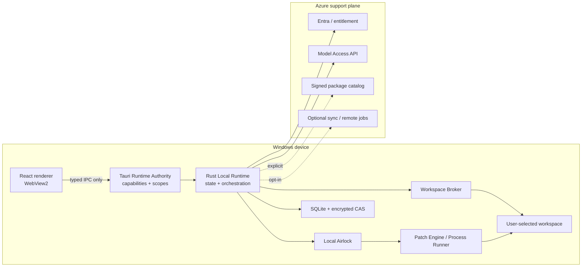

# Windows Desktop Native Host and IPC

## 1. Scope and authority

This document is the implementation authority for the installed Windows shell, the Tauri/Rust trust boundary, and renderer-to-host communication for `deliveryModel = windows_local`.

The signed Rust process is the desktop authority. The React renderer is an untrusted presentation client. It may request typed application operations, but it never receives a general filesystem, process, token, database, or updater primitive.

The desktop product does not install a local web server, background service, Docker engine, Kubernetes runtime, model server, or GPU runtime. The Tauri host and its WebView2 renderer run as a normal per-user application.

## 2. Locked process model



Process rules:

1. Only bundled local HTML/CSS/JavaScript may load in the primary WebView. Remote web content opens in the system browser.
2. The renderer cannot load Node.js, use a browser extension bridge, or call unrestricted Tauri filesystem or shell APIs.
3. The Rust process owns every durable state transition, Airlock decision, local spec, workspace grant, checkpoint, result import, and evidence event.
4. Approved child processes are effects, not authorities. They never receive SQLite/evidence keys and never write authority state.
5. Azure APIs may authenticate, license, provide model output, distribute signed packages, replicate selected records, or perform an explicit remote job. They cannot address a local path or mint a local execution spec.

## 3. Native module boundaries

| Rust module/crate | Owns | Must not own |
|---|---|---|
| `desktop_app` | Tauri startup, windows, lifecycle, capability registration | Domain state or direct file/process effects |
| `desktop_ipc` | Command/event DTOs, request validation, rate/size limits | Business rules or raw OS handles |
| `desktop_runtime` | Local commands, state machines, orchestration, cancellation | Provider secrets or renderer state |
| `desktop_workspace` | Folder grants, path resolution, scans, file identity | Approval or model calls |
| `desktop_airlock` | Pure policy, exact candidate validation, local spec issuance | File/process execution |
| `desktop_execution` | Journaled patch apply and approved process execution | Policy reinterpretation or state-store SQL outside its port |
| `desktop_store` | SQLite transactions, encrypted payloads, migrations, local outbox | Workspace mutation |
| `desktop_cloud` | Entra, entitlement, model, packages, sync, remote-job clients | Local run/workspace authority |
| `desktop_update` | Release metadata, signed update validation, channel policy | Silent update or state migration outside the update protocol |

The initial repository layout should use separate crates even if one executable links them:

```text
apps/desktop-ui/
crates/desktop-app/
crates/desktop-ipc/
crates/desktop-runtime/
crates/desktop-workspace/
crates/desktop-airlock/
crates/desktop-execution/
crates/desktop-store/
crates/desktop-cloud/
crates/desktop-update/
```

## 4. Renderer security profile

The production renderer profile is fail-closed:

- local application assets only;
- a strict Content Security Policy with no `unsafe-eval`, no remote scripts, and no wildcard network origin;
- network calls from the renderer disabled; Rust owns cloud HTTP;
- remote navigation denied; external HTTPS links use an allowlisted opener in the system browser;
- clipboard, dialog, notification, deep-link, and opener capabilities granted only where used;
- no generic `fs:write-all`, `fs:read-all`, `shell:allow-execute`, or `shell:allow-spawn` permission;
- no secrets, access tokens, absolute workspace paths, encryption keys, or raw support payloads in renderer storage;
- renderer logging is redacted before it crosses IPC.

Tauri capabilities reduce the renderer attack surface but are not the sole policy boundary. Every Rust command re-authorizes its object, owner, project, delivery model, and current state.

## 5. IPC envelope

Every command uses a common envelope:

```json
{
  "schemaVersion": "desktop-ipc-command.v1",
  "requestId": "req_...",
  "command": "run.submit_message",
  "windowLabel": "main",
  "rendererSessionId": "rs_...",
  "installationId": "install_...",
  "issuedAt": "2026-07-10T10:00:00Z",
  "payload": {}
}
```

Validation rules:

- `requestId` is unique and idempotent for mutating commands;
- `rendererSessionId` is generated by Rust at window creation and invalidated on navigation/reload/restart;
- the runtime derives `windowLabel`; the renderer cannot assert another window identity;
- command and payload schema are exact; unknown fields fail validation for security-sensitive commands;
- payload byte, collection, string, and nesting limits are enforced before domain parsing;
- commands carry object IDs and relative paths, never arbitrary database queries or raw OS handles;
- replies use a typed success/error union and never expose panic/backtrace/secret material.

## 6. Allowed command catalog

| Command | Window | Side effect | Authority behavior |
|---|---|---:|---|
| `app.get_boot_state` | main | no | Returns redacted version/auth/store/update status |
| `auth.begin_sign_in` | main | opens system browser | Creates a native auth attempt; no URL is accepted from the renderer |
| `auth.sign_out` | main | yes | Revokes local token cache/session through the cloud client |
| `workspace.select_folder` | main | native user gesture | Opens the host-owned folder picker and creates a grant after validation |
| `workspace.list` | main | no | Returns workspace IDs and display metadata |
| `workspace.revoke` | main | yes | Revokes future access; active effects are cancelled or moved to explicit recovery |
| `workspace.list_entries` | main | no | Bounded relative tree projection |
| `workspace.read_text` | main | no | Bounded, redacted relative-path read through the broker |
| `workspace.search` | main | no | Bounded local search; no raw glob-to-filesystem bridge |
| `run.create` | main | yes | Creates a `windows_local` run in the Rust authority |
| `run.submit_message` | main | yes | Starts orchestration/model work under a run command |
| `run.cancel` | main | yes | Requests bounded cancellation |
| `approval.decide` | main | yes | Records a decision for the exact displayed candidate hash |
| `execution.cancel` | main | yes | Cancels the active journal/process tree through the runtime |
| `rollback.request` | main | yes | Creates a new governed rollback candidate |
| `evidence.materialize` | main | yes | Builds a local evidence bundle from the ledger |
| `evidence.export` | main | native save gesture | Exports a previewed/redacted bundle to a user-selected destination |
| `sync.configure` | settings | yes | Changes opt-in sync categories; cannot add workspace source implicitly |
| `remote_job.preview` | main | no | Builds an exact upload/retention preview |
| `remote_job.request` | main | governed | Requires a local candidate, policy, and approval |
| `update.check` | settings | network | Uses configured release channel only |
| `update.install` | settings | privileged app effect | Validates release policy/signatures and requires safe runtime shutdown |

Prohibited commands include `read_path`, `write_path`, `run_shell`, `spawn`, `execute_sql`, `set_token`, `set_provider_endpoint`, `apply_patch_text`, and `download_and_execute`.

The UI never invokes an `execute_approved_spec` primitive directly. It submits an approval decision; the Rust domain workflow revalidates current state, issues/consumes the local spec, and dispatches through an internal port.

## 7. Event catalog

Rust emits typed, sequenced projection events:

| Event | Purpose |
|---|---|
| `app.boot_state_changed` | Auth/store/policy/update/degraded state |
| `workspace.changed` | Bounded tree/status invalidation; not raw watcher traffic |
| `run.event` | Projected local ledger event for one run |
| `approval.required` | Candidate ID/hash, summary, risk, decision options |
| `execution.output` | Bounded redacted stdout/stderr chunk |
| `execution.state_changed` | Queue/start/cancel/terminal/recovery state |
| `checkpoint.changed` | Checkpoint/rollback availability |
| `cloud.connectivity_changed` | Online/offline/limited state without token details |
| `sync.state_changed` | Opt-in replica progress/conflict |
| `update.state_changed` | Available/downloaded/ready/failed/required state |

Each event carries a monotonic renderer-projection sequence. Reconnect obtains a snapshot plus the next sequence; WebView memory is never recovery authority.

## 8. Rust ports

```rust
pub trait LocalRuntimeCommandBus {
    async fn execute(&self, command: LocalCommand) -> Result<CommandReceipt, LocalError>;
}

pub trait RendererProjection {
    async fn snapshot(&self, scope: ProjectionScope) -> Result<ProjectionSnapshot, LocalError>;
    async fn events_after(&self, cursor: ProjectionCursor) -> Result<Vec<ProjectionEvent>, LocalError>;
}

pub trait DesktopCloudClient {
    async fn entitlement(&self) -> Result<EntitlementLease, CloudError>;
    async fn complete_model_call(&self, request: ModelAccessRequest) -> Result<TypedModelOutput, CloudError>;
}
```

Ports accept domain identifiers and discriminated contracts. A port must not use a single structure with ignored Azure and Windows fields.

## 9. Startup and shutdown

Startup order:

1. Verify executable/release identity and load immutable build metadata.
2. Open the per-user app-data directory with safe permissions.
3. Unwrap the local store key and open/migrate/validate SQLite.
4. Reconcile incomplete local effect journals before enabling workspace mutation.
5. Load signed policy/package/entitlement caches and calculate degraded mode.
6. Register the minimum Tauri capabilities and commands.
7. Create the renderer session and boot snapshot.
8. Begin optional cloud refresh, update check, and sync after the UI is available.

Shutdown order:

1. Stop accepting new governed effects.
2. Request cancellation of model/remote/local work.
3. Terminate or reconcile owned process trees according to policy.
4. Flush journal/evidence/outbox transactions.
5. Close renderer subscriptions and the local store.
6. Hand control to the signed updater only when an update state authorizes it.

Forced OS shutdown must leave enough journal state for deterministic startup recovery.

## 10. Error model

Stable error classes:

- `ipc_unauthorized`
- `ipc_payload_invalid`
- `renderer_session_expired`
- `object_not_found_or_not_visible`
- `workspace_grant_revoked`
- `workspace_identity_changed`
- `state_conflict`
- `approval_required`
- `policy_denied`
- `entitlement_unavailable`
- `cloud_offline`
- `store_recovery_required`
- `update_required`
- `operation_cancelled`

Errors shown to the renderer include a safe message, correlation ID, retry classification, and permitted next actions. Raw OS, SQL, OAuth, and HTTP payloads stay in the redacted local diagnostic channel.

## 11. Testing and release gates

Required tests:

- capability snapshot proves no broad filesystem/shell/network permission;
- every IPC command rejects the wrong window/session, delivery model, owner, state, and oversized payload;
- XSS fixture cannot invoke an unregistered or out-of-scope command;
- remote navigation, remote script, `eval`, and unsafe CSP fixtures fail;
- renderer never receives access/refresh tokens, provider credentials, local store keys, or unrestricted absolute paths;
- reload/reconnect rebuilds projection state from Rust;
- duplicate mutating IPC request is idempotent;
- shutdown/crash tests leave recoverable journal/store state;
- desktop works as a standard user on a clean supported Windows image;
- no local server/daemon/container/model process is installed or required.

The component is releasable only when a generated capability inventory and IPC schema are reviewed as supply-chain artifacts.

## 12. Unresolved decisions

- **DESK-02:** pure Rust system-browser PKCE versus a minimal signed MSAL.NET/WAM helper for Windows SSO, Conditional Access, and Windows Hello.
- **DESK-03:** MSI/WiX versus NSIS/direct channel, and enterprise-managed versus in-app updater ownership.
- Whether a secondary read-only evidence/support window needs a separate Tauri capability file.
- Whether hardware-backed installation keys are required beyond user-scoped DPAPI.

## 13. Primary references

- [Tauri Runtime Authority](https://v2.tauri.app/security/runtime-authority/)
- [Tauri Command Scopes](https://v2.tauri.app/security/scope/)
- [Tauri capabilities](https://v2.tauri.app/security/capabilities/)
- [Tauri filesystem plugin](https://v2.tauri.app/plugin/file-system/)
- [Tauri shell plugin](https://v2.tauri.app/plugin/shell/)
