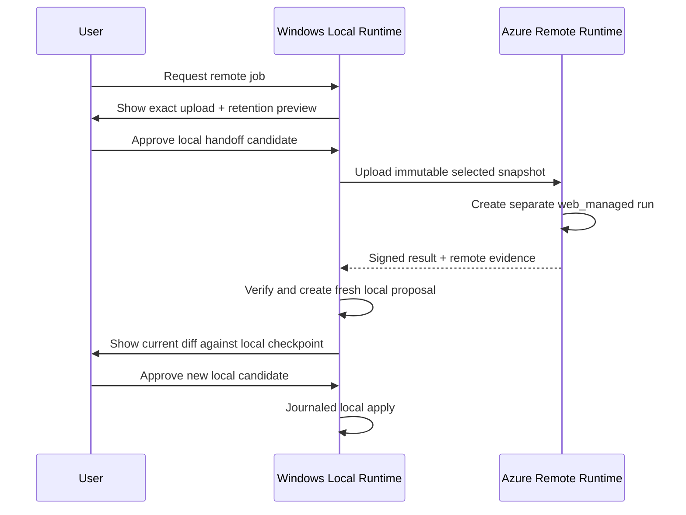

# Windows Local Workspace and Execution

## 1. Scope

This document owns selected-folder access, path safety, local context reads, journaled file mutation, approved Windows process execution, local result manifests, and the explicit remote-job handoff for `windows_local`.

It does not own UI, identity/model access, SQLite implementation, sync, package semantics, or release packaging. Those are defined in [[94 - Windows Desktop Native Host and IPC]], [[96 - Windows Local State, Evidence, Checkpoint, and Rollback]], [[97 - Windows Desktop Security and Trust Model]], and [[98 - Azure Support Plane for Windows Desktop]].

## 2. Security claim

Sapphirus native file operations are constrained to user-selected workspace roots plus app-owned installation/state/cache/log directories. The renderer never receives a general file primitive.

Approved child processes are a different boundary. A Windows Job Object controls their process tree, cancellation, accounting, and selected resource limits. It does **not** confine filesystem or network access. Until DESK-01 proves a compatible AppContainer/brokered or equivalent design, local commands run with the signed-in user's effective file/network permissions and the product must not claim otherwise.

If “only selected folders” is required to apply transitively to all child tools, DESK-01 is a release go/no-go for command execution.

## 3. Workspace capability contract

```json
{
  "schemaVersion": "local-workspace-capability.v1",
  "workspaceCapabilityId": "lwc_...",
  "projectId": "project_...",
  "deliveryModel": "windows_local",
  "installationId": "install_...",
  "grantEpoch": 4,
  "rootIdentityHash": "sha256:...",
  "filesystemCapabilityHash": "sha256:...",
  "displayName": "bmad-runtime",
  "permissions": ["read", "propose_write", "approved_write", "approved_execute"],
  "policyHash": "sha256:...",
  "grantedAt": "...",
  "revokedAt": null
}
```

The canonical absolute root is encrypted local data and is excluded from cloud payloads, telemetry, evidence summaries, and model context unless a user deliberately exports it.

`grantEpoch` increments on reauthorization or permission change. Candidates/specs bound to an earlier epoch are stale.

## 4. Filesystem capability snapshot

At grant and before every governed mutation, record:

- volume identity hash and filesystem type;
- local, UNC, removable, virtual, cloud-placeholder, and case-sensitive flags;
- root directory file identity;
- support for stable file IDs, reparse inspection, per-file atomic replace, durable flush, and hardlink count;
- free space and maximum path behavior;
- policy decision and support tier.

Initial MVP recommendation:

- writable projects: fixed local NTFS volumes with stable identity;
- read-only evaluation: other filesystems only after explicit classification;
- UNC, removable media, developer-mode case-sensitive directories, and unresolved cloud placeholders: blocked from mutation until dedicated tests pass;
- reparse points: rejected by default for writable paths;
- Windows reserved names, device namespaces, alternate data streams, trailing-dot/space aliases, and case-colliding paths: rejected.

## 5. Path resolution algorithm

Every file operation:

1. Accepts `workspaceCapabilityId` plus a normalized relative path.
2. Rejects absolute, device, UNC, drive-relative, parent, empty, alternate-stream, reserved-name, and invalid-normalization forms.
3. Resolves the current grant and verifies installation/project/delivery/epoch.
4. Opens the root using a host-owned handle and verifies the current root identity.
5. Walks existing ancestors without following unexpected reparse points.
6. Opens the target/parent with link-safe flags where supported and verifies final path/file identity remains beneath the root.
7. Applies path, ignore, secret, binary, size, and operation-specific policy.
8. Revalidates identity and preimage immediately before mutation.

String prefix checks are never sufficient. A watcher notification is an invalidation hint, not proof of identity or freshness.

Hardlink policy:

- refuse mutation when a target has an unexpected external hardlink or when containment cannot be proven;
- record file ID/link count in the preimage;
- never assume two paths with different names are different files.

## 6. Local workspace objects

| Object | Purpose |
|---|---|
| `LocalWorkspaceCapability` | Revocable user grant and root identity |
| `FilesystemCapabilitySnapshot` | Measured guarantee/enforcement profile |
| `LocalWorkspaceManifest` | Relative file inventory, hashes, ignore/redaction summary |
| `LocalPreimageManifest` | Exact files/file IDs/hashes before a proposed effect |
| `LocalEffectJournal` | Durable batch effect plan/progress/recovery state |
| `WindowsLocalExecutionResultManifest` | Host-observed terminal facts |
| `LocalCheckpoint` | Durable pre/post file-state reference |
| `LocalRollbackPlan` | New governed effect that restores tracked state |

## 7. Workspace scan and context

The Rust scanner uses bounded traversal and ignore rules. It excludes dependency trees, build outputs, VCS internals, binary/oversized content, secrets, and policy-denied paths before any renderer or model exposure.

The scanner persists hashes/summaries locally and supports incremental invalidation. It does not upload an index. A `ContextEgressManifest` is built separately before a model call as specified in [[97 - Windows Desktop Security and Trust Model]] and [[98 - Azure Support Plane for Windows Desktop]].

## 8. File-mutation candidate

```json
{
  "effectKind": "patch_apply",
  "deliveryModel": "windows_local",
  "workspaceTarget": {
    "targetKind": "local_folder_capability",
    "workspaceCapabilityId": "lwc_...",
    "grantEpoch": 4,
    "rootIdentityHash": "sha256:...",
    "baseCheckpointId": "lcp_...",
    "workspaceManifestHash": "sha256:..."
  },
  "patchRef": "cas://sha256/...",
  "preimages": [
    {"path":"src/App.tsx","fileIdHash":"sha256:...","sha256":"...","exists":true}
  ],
  "declaredWrites": ["src/App.tsx"],
  "rollbackClass": "file_tracked",
  "limits": {"files":20,"bytes":1000000},
  "candidateHash": "sha256:..."
}
```

The model never supplies authority fields. The Rust orchestrator normalizes typed model output into this contract and computes all workspace/identity hashes.

## 9. Journaled batch apply

Windows does not provide a reliable globally atomic multi-file transaction for this use case. Sapphirus guarantees a journaled, crash-recoverable batch with per-file atomic replacement where supported.

```text
durably store pre-write checkpoint payloads
-> persist prepared journal + exact operations
-> revalidate grant/root/preimages/free space
-> mark journal applying
-> apply each create/replace/delete and persist progress
-> flush and verify postimages
-> create WindowsLocalExecutionResultManifest
-> commit domain transition + evidence + outbox
-> mark journal completed
```

Rules:

- temporary files are created on the same volume and in a policy-safe location;
- existing files use per-file atomic replace when supported;
- create/delete operations remain separately journaled;
- file metadata preservation is explicit, not assumed;
- partial apply, antivirus lock, disk full, power loss, or external edit enters recovery;
- recovery either completes, restores the pre-write checkpoint, or enters `manual_review`; it never invents success;
- every affected file has pre/post identity and content hashes.

## 10. Command candidate

```json
{
  "effectKind": "command_run",
  "deliveryModel": "windows_local",
  "workspaceCapabilityId": "lwc_...",
  "grantEpoch": 4,
  "resolvedExecutable": {
    "displayName":"dotnet",
    "pathRef":"local-encrypted://exe/...",
    "fileIdHash":"sha256:...",
    "sha256":"...",
    "signatureStatus":"valid|unsigned|invalid|unknown"
  },
  "argv": ["dotnet","test","--no-restore"],
  "cwd": ".",
  "environment": {
    "allowedNames":["PATH","TEMP","TMP","DOTNET_CLI_HOME"],
    "valueSourceHash":"sha256:..."
  },
  "inputs": [],
  "expectedWrites": ["TestResults/**"],
  "network": {"declared":"none","enforcement":"declared_only"},
  "limits": {"timeoutSeconds":600,"maxOutputBytes":4000000},
  "rollbackClass":"file_tracked|non_reversible"
}
```

Execution rules:

- resolve an executable without `cmd.exe /c`, PowerShell `-Command`, shell parsing, file associations, or current-directory executable search;
- bind final executable file identity/hash/signature after resolution and revalidate before start;
- use Windows argument handling deliberately and test the exact child `argv` reconstruction for each supported tool class;
- close unintended inherited handles and scrub the environment;
- set cwd through the workspace broker;
- attach the process tree to a Job Object before untrusted work can escape the tree where Windows permits;
- enforce timeout, cancel, output byte/line limits, heartbeat, exit classification, and owned-tree cleanup;
- redact output before renderer display, persistence, model repair, telemetry, or sync;
- child processes receive no local-store key, Azure provider secret, authority token, or SQL/Blob credential.

## 11. Execution profiles

| Profile | Status | Filesystem/network guarantee |
|---|---|---|
| `standard_user_job` | MVP baseline | Host file APIs are root-bounded; child runs as user; Job Object controls tree/resources; filesystem/network not confined |
| `restricted_token_job` | D0 spike | Privileges/SIDs reduced; filesystem/network confinement only as specifically measured |
| `appcontainer_brokered` | D0 evidence-gated | May support stronger capability boundaries; toolchain compatibility must be proven |
| `azure_remote_handoff` | Optional | Separate cloud authority and uploaded snapshot; cannot apply local files |

Approval UI and evidence display the measured containment profile. Policy cannot label `declared_only` network as blocked.

## 12. Local result manifest

`WindowsLocalExecutionResultManifest` shares the envelope defined in [[99 - Dual-Delivery Contract and Conformance Specification]] and includes:

- installation/host build/binary digest;
- workspace capability/grant/root identity before/after;
- candidate/spec/policy/approval/consumption refs and hashes;
- effect journal and pre-write checkpoint IDs;
- per-file observed pre/post identity and content hashes;
- executable identity, argv hash, exit code, timing, cancellation and process-tree result;
- redacted log/artifact refs;
- rollback plan;
- `recoveryDisposition = clean | recovered | manual_review`.

The Rust host creates the manifest. A child process cannot create or authenticate it.

## 13. Explicit remote-job handoff



The originating project/run remains `windows_local`. The cloud execution is a separately identified `web_managed` work record. A remote result always sets `cannotApplyDirectly: true`.

Remote handoff states:

```text
draft -> upload_previewed -> locally_approved -> uploading
-> cloud_accepted -> remote_running -> result_available
-> result_verified -> imported_as_local_proposal -> closed
```

Failure states: `cancelled`, `expired`, `upload_failed`, `remote_failed`, `result_rejected`.

## 14. Failure and recovery matrix

| Failure | Required outcome |
|---|---|
| Root moved/replaced | Revoke active candidate/spec; require re-selection |
| Reparse/file identity changed | Block and record security evidence |
| Preimage changed | Candidate becomes stale; regenerate |
| Disk full mid-apply | Reconcile journal; restore or manual review |
| External editor writes mid-apply | Detect identity/hash conflict; never overwrite silently |
| App/OS crash | Startup reconciliation from durable journal |
| Process spawns descendants | Job Object owns/terminates tree or execution fails closed |
| Output cap exceeded | Truncate with hash/count evidence; process policy decides cancel |
| Command modifies undeclared files | Record finding; rollback only if checkpoint coverage exists |
| Folder grant revoked | Stop new reads/effects; cancel or recover active operation |

## 15. Test catalog

Blocking suites:

- traversal, device path, ADS, reserved name, Unicode/case alias, trailing dot/space;
- junction/symlink/mount point/reparse change before and during open;
- hardlink outside root, file replacement, root replacement, TOCTOU races;
- UNC/removable/cloud-placeholder/case-sensitive root policy;
- stale grant epoch, stale preimage, external editor conflict;
- multi-file crash at every journal boundary and deterministic recovery;
- disk full, read-only, ACL denial, antivirus lock, long path, large/binary file;
- executable search/hijack, signature/hash drift, quoting, environment/handle inheritance;
- process tree escape, cancellation, timeout, output flood/redaction;
- remote result cannot call local apply and always requires a new current local candidate.

## 16. Unresolved decisions

- **DESK-01:** whether strict child-process folder/network confinement is required and which AppContainer/broker model can support real toolchains.
- Supported writable filesystems and treatment of UNC, removable, WSL, Dev Drive, and cloud-placeholder roots.
- Exact executable identity policy for one-time versus reusable approval grants.
- Checkpoint coverage for commands with unknown writes.
- Git status/commit scope; remote push remains excluded.

## 17. Primary references

- [Windows Job Objects](https://learn.microsoft.com/en-us/windows/win32/procthread/job-objects)
- [CreateRestrictedToken](https://learn.microsoft.com/en-us/windows/win32/api/securitybaseapi/nf-securitybaseapi-createrestrictedtoken)
- [Launch an AppContainer](https://learn.microsoft.com/en-us/windows/win32/secauthz/implementing-an-appcontainer)
- [Windows app capability declarations](https://learn.microsoft.com/en-us/windows/apps/package-and-deploy/app-capability-declarations)
