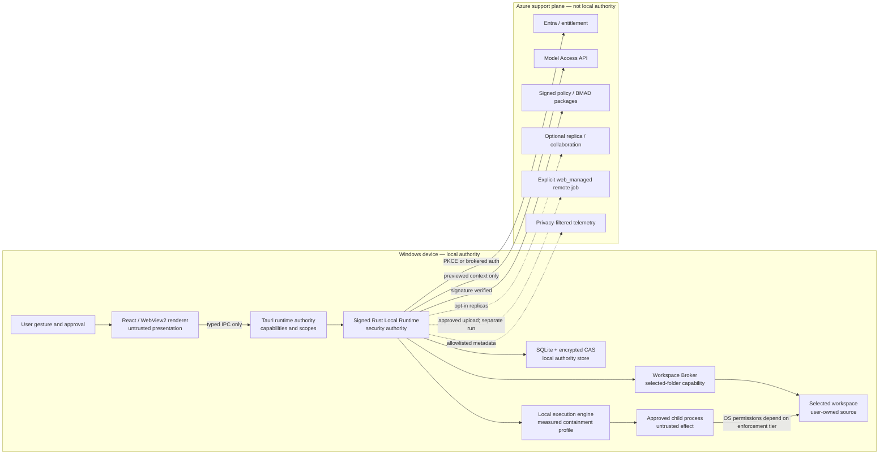

# Windows Desktop Security and Trust Model

## 1. Scope and delivery-model boundary

This document is the security authority for `deliveryModel = windows_local`. It covers the installed Tauri/Rust application, its React/WebView2 renderer, user-selected local workspaces, local commands, local state and evidence, Azure support-plane calls, packaging, and updates.

The security model does not turn the desktop product into a local instance of the web control plane:

- the signed Rust host owns local lifecycle state, Airlock evaluation, approved-spec issuance and consumption, workspace capabilities, checkpoints, rollback, and evidence;
- ordinary file reads, edits, commands, tests, diffs, and recovery remain on the Windows device;
- Azure supplies identity, entitlement, model access, signed BMAD packages and policy, optional replicas/collaboration, telemetry, update metadata, and explicitly requested remote jobs;
- Azure cannot address a local path, mint or consume a local execution spec, transition a local run, or apply a remote result to the local workspace;
- any remote job is a separately authoritative `web_managed` work record created from an exact user-approved upload.

The web product retains the cloud security model in [[23 - Security, Identity, and Secrets]] and [[40 - Threat Model and Security Tests]]. Shared schemas and policy fixtures do not merge these authority boundaries.

## 2. Security objectives and honest non-objectives

### Objectives

1. Limit native application file operations to a currently valid user-selected workspace capability and app-owned directories.
2. Prevent a compromised renderer from acquiring general filesystem, process, credential, database, updater, or network primitives.
3. Require an exact, current, audience-bound Airlock spec before each local side effect.
4. Make every governed local effect reviewable, journaled, recoverable where promised, and attributable in tamper-evident local evidence.
5. Minimize source and secret egress, disclose the exact context leaving the device, and keep provider credentials out of the installation.
6. Authenticate cloud services with a native public-client flow and protect tokens and local encryption keys at rest.
7. Ship only signed, provenance-backed application and package artifacts through controlled release channels.
8. Preserve usable local development without Docker, Kubernetes, a self-hosted server, a local model/GPU, administrator rights, or an always-running service.

### Non-objectives and residual trust

- Sapphirus does not protect a workspace from the signed-in user, an administrator, kernel compromise, a debugger attached with sufficient rights, or malware already executing as the user.
- User-selected source is not a secrecy boundary from other applications running with the same effective Windows permissions.
- DPAPI and encrypted local storage protect data at rest; they do not protect plaintext from a compromised live Rust process or the signed-in user.
- The local evidence chain is tamper-evident, not non-repudiable against a device owner who controls the store and clock.
- A Job Object controls process-tree lifecycle, accounting, cancellation, and selected resource limits. It does **not** restrict child-process filesystem or network access.
- Prompt-injection controls prevent content from becoming policy or authority; they cannot guarantee that a model will never produce incorrect or malicious suggestions.
- Rollback covers only declared and checkpointed filesystem effects. Arbitrary command effects on registries, services, credentials, package caches, databases, remote systems, or undeclared files are not inherently reversible.

Product copy, approval UI, evidence, and release claims must preserve these limitations.

## 3. Assets and classification

| Asset | Primary owner | Default classification | Required protection |
|---|---|---|---|
| Selected workspace source | User | confidential/customer content | Root-bounded native access; never synced or uploaded implicitly |
| Absolute local paths and file identities | Workspace Broker | sensitive device metadata | Encrypted locally; replaced by relative paths/hashes outside the host |
| Local lifecycle, approvals, specs, journals, checkpoints | Rust Local Runtime | authoritative security state | Renderer/child isolation, transactional store, authenticated encryption |
| Local evidence ledger and materializations | Evidence Module | authoritative audit data | Hash chain, encrypted payloads, retention controls, export preview |
| Entra access/refresh tokens | Identity Client or broker | credential | Rust/broker only, least scope, protected token cache, never logged |
| Local CAS encryption key | Local Store | secret | Random key protected by user-scoped DPAPI; versioned rotation metadata |
| Entitlement/policy/package leases | Desktop Cloud Client | signed control data | Signature, issuer, audience, version, expiry, rollback protection |
| Model context and output | User/tenant | confidential transient content | Secret scanning, egress manifest, retention classification, redaction |
| Update artifacts and metadata | Release authority | privileged code | TLS plus independent signing, channel/version binding, provenance |
| Telemetry and diagnostics | Product operator | privacy-sensitive metadata | Data minimization, schema allowlist, sampling/consent, no source by default |
| Remote-job upload and result | Local user plus cloud project | explicit transferred copy | Exact manifest/consent, separate authority, retention, integrity verification |

## 4. Threat actors and assumptions

| Actor | Capability considered | Security posture |
|---|---|---|
| Malicious workspace/package content | Controls filenames, source text, instructions, build scripts, output, archives, and reparse/hardlink races | Untrusted data; cannot grant capabilities or change policy |
| Compromised model/model output | Returns arbitrary text or schema-shaped hostile proposals | Suggestion only; canonical validation, policy, approval, and spec binding remain local |
| Compromised renderer/XSS | Executes JavaScript in WebView2 and can call exposed IPC | Renderer is untrusted; minimum capabilities and per-command Rust authorization |
| Malicious or compromised child tool | Executes as the current execution profile and may spawn descendants | Job-controlled process tree; filesystem/network authority depends on measured enforcement tier |
| Network attacker | Can observe/disrupt traffic but not break modern TLS | TLS validation, endpoint allowlist, signed control artifacts, replay defenses |
| Rogue/compromised support-plane service | Returns malformed data or attempts excess collection | Typed contracts, signatures where applicable, local authority checks, no local-path addressing |
| Supply-chain attacker | Attempts dependency, build, package, installer, or update substitution | Locked dependencies, review, SBOM/provenance, signatures, channel/version policy |
| Another local user/process | May read accessible files or invoke registered protocols | Per-user state ACLs, single-instance/authenticated handoff, no secrets in command line/protocol payload |
| Signed-in user/administrator | Has legitimate OS authority and may alter files, processes, clock, or store | Explicitly outside tamper-proof/non-repudiation guarantee; actions remain visible where observable |

Assumptions that must be verified per release: supported Windows version and patch level, acceptable WebView2 runtime, application binaries and app-data ACLs, functioning code-signing trust, correct tenant configuration, and an uncompromised Rust host.

## 5. Trust boundaries

No edge from Azure terminates at `Files`, `Broker`, `Store`, or local Airlock authority. No renderer or child-process edge terminates directly at `Store`.

## 6. Locked security invariants

| ID | Invariant | Enforcement owner |
|---|---|---|
| DSEC-01 | Every desktop project/run is immutably `windows_local`; a remote handoff creates a distinct linked `web_managed` record | Local Runtime and contracts |
| DSEC-02 | The renderer receives no raw filesystem, shell/process, SQL, token, key, updater, or unrestricted HTTP primitive | Tauri capability manifest and IPC router |
| DSEC-03 | Native workspace access requires a live capability bound to installation, project, root identity, policy hash, and grant epoch | Workspace Broker |
| DSEC-04 | Every side effect consumes one exact, unexpired, audience-bound spec once | Local Airlock and Execution Engine |
| DSEC-05 | Approval is bound to the displayed candidate hash; a changed executable, argv, file identity, preimage, containment profile, policy, or egress manifest invalidates it | Local Airlock |
| DSEC-06 | Model/package/workspace/command-output content is untrusted and cannot become policy, identity, entitlement, capability, or spec authority | Orchestrator and policy kernel |
| DSEC-07 | Provider credentials and Azure resource secrets do not exist in the renderer, child environment, command line, or local config | Desktop Cloud Client |
| DSEC-08 | Telemetry is diagnostic and optional/policy-scoped; local evidence remains authoritative even when telemetry is disabled or lost | Evidence and Telemetry modules |
| DSEC-09 | A remote result always has `cannotApplyDirectly: true` and is imported only as a fresh local proposal against current state | Handoff and Local Runtime |
| DSEC-10 | Security guarantees are labelled by measured enforcement tier; an unenforced declaration is never presented as confinement | Security policy and UX |

## 7. Tauri runtime authority and renderer isolation

Tauri capabilities are the first renderer boundary, not the complete authorization system. The release build must generate and review a machine-readable capability inventory.

Baseline renderer profile:

- bundle the main UI locally; deny remote application content and remote navigation;
- enforce a strict CSP without `unsafe-eval`, remote scripts, wildcard origins, or renderer-owned arbitrary network calls;
- open allowlisted external HTTPS links in the system browser through a narrow host command;
- do not enable generic Tauri filesystem or shell permissions such as broad read/write, execute, or spawn;
- scope dialog, clipboard, notification, deep-link, single-instance, and opener features to specific windows and commands;
- issue a Rust-created `rendererSessionId` per window load and invalidate it on reload, navigation, window close, lock/sign-out, and update;
- keep access/refresh tokens, entitlement payloads, encryption keys, absolute paths, support bundles, and raw command output out of Web Storage and renderer logs;
- treat WebView developer tools as disabled in production except an explicitly signed support build with separate policy and evidence.

The Rust IPC router re-authorizes every request after Tauri capability checks. A permission entry must never be interpreted as durable domain authorization.

## 8. IPC authorization model

Every renderer request carries the schema version, unique request ID, Rust-issued renderer session, intended command, and typed payload. Rust derives the calling window and installation; the renderer cannot assert them.

Authorization order:

1. Validate envelope size, exact schema, command/window pairing, session freshness, and idempotency key.
2. Resolve all object IDs through the local store and return non-enumerating errors on scope mismatch.
3. Verify `windows_local`, installation, local owner/project, current lifecycle state, entitlement/policy lease where required, and user-presence requirement.
4. Convert any relative path into a Workspace Broker operation; never accept a raw absolute path or OS handle from JavaScript.
5. For a side effect, locate the exact candidate and approval. Rust revalidates, issues the spec, atomically records its consumption, and invokes an internal execution port.
6. Return a bounded projection or stable error envelope. Remove OS error payloads, stack traces, credentials, and sensitive paths.

Security-sensitive commands use closed payloads; unknown fields fail. Rate, byte, collection, nesting, and output limits apply before parsing into domain objects. Mutating requests are idempotent. The renderer cannot directly call `execute_spec`, `run_shell`, `read_path`, `write_path`, `execute_sql`, `set_token`, `set_endpoint`, or `download_and_execute`.

XSS testing must prove that arbitrary JavaScript cannot expand the command catalog, change window scope, reuse an expired session, manufacture a user gesture, or access another project/workspace.

## 9. Selected-folder capability and Windows path policy

The native folder picker creates a revocable `LocalWorkspaceCapability`; selecting a folder is not approval for future writes or commands. The capability binds:

- installation, project, `windows_local`, permission set, policy hash, grant time, and revocation state;
- opaque local root reference, root directory file identity, volume identity, filesystem capability hash, and monotonically increasing `grantEpoch`;
- measured support for stable file IDs, reparse inspection, hardlink count, case sensitivity, per-file atomic replacement, and durable flush.

For the first writable MVP, support fixed local NTFS volumes with stable file identity. Block mutation for UNC shares, removable volumes, case-sensitive directories, unresolved cloud placeholders, and other filesystems until dedicated compatibility/security evidence exists.

For each operation the Workspace Broker must:

1. reject absolute, device-namespace, UNC, drive-relative, parent, alternate-data-stream, reserved-name, invalid-normalization, trailing-dot/space, and case-collision forms;
2. resolve from a host-owned root handle, verify root identity, and walk existing ancestors without following unexpected reparse points;
3. verify the final object/parent identity remains beneath the selected root; string-prefix checks are insufficient;
4. apply ignore, secret, binary, file-size, operation, and protected-path policy;
5. bind file IDs, link counts, metadata, and content hashes into the preimage and revalidate immediately before the effect;
6. fail closed when an unexpected reparse point, external hardlink, root replacement, identity race, or unsupported filesystem prevents proof.

Default writable-path policy rejects reparse points. A target with an unexplained hardlink is not mutated because the same file may be reachable outside the selected root. Watcher events are invalidation hints only.

Native file updates use the journaled, crash-recoverable batch described in [[95 - Windows Local Workspace and Execution]], with per-file atomic replacement only where measured and supported. The product must not promise atomic multi-file changes.

## 10. Child-process containment and DESK-01

### Security truth

Windows Job Objects provide process-tree ownership, kill-on-close behavior, accounting, cancellation, and configurable CPU/memory/process limits. They do **not** create a filesystem or network sandbox. A child started as the signed-in user normally retains that user's accessible files and network capabilities, even if Sapphirus requested only one workspace.

`CreateRestrictedToken` can remove privileges and disable/restrict SIDs. It is a defense-in-depth mechanism, not proof that the process can access only one folder or no network. AppContainer can provide a stronger capability boundary, but real developer toolchains may depend on user profile paths, SDK caches, compilers, package managers, named objects, child processes, or network access that the container does not expose. A brokered AppContainer design must be proven against supported tools; capability declarations alone are not evidence.

### Enforcement tiers

| Tier | Profile | Proven guarantee | Allowed product claim |
|---|---|---|---|
| E0 | `native_file_ops_only` | Rust file APIs are selected-root bounded; no arbitrary child command executes | “Edits are limited to the selected workspace.” |
| E1 | `standard_user_job` | Process tree, cancellation, and measured resource/output limits; child retains user filesystem/network authority | “Command is approved and supervised”; never “sandboxed to this folder” |
| E2 | `restricted_token_verified` | E1 plus specifically tested privilege/SID reduction | Only the exact measured restrictions; no general folder/network confinement claim |
| E3 | `appcontainer_brokered_verified` or equivalent | Measured filesystem/network boundary for an explicit supported-tool matrix | Exact capability guarantee recorded in the spec/evidence |
| ER | `azure_remote_handoff` | Separate uploaded cloud snapshot and web executor boundary | “Runs remotely on the uploaded copy”; cannot apply locally |

Every candidate, approval view, spec, result manifest, and evidence bundle records the requested and achieved tier, filesystem enforcement, network enforcement, and known gaps. `declared_only` network is not `blocked`.

### Release-blocking decision

**DESK-01 — child-process containment requirement is a release go/no-go.** Product and security owners must choose one of these mutually exclusive MVP postures before local command execution ships:

- **Strict selected-folder promise:** if “the app accesses only user-selected folders” applies transitively to arbitrary child tools, disable local command execution and ship E0 until E3 (or an equivalent verified design) passes the supported-tool matrix. Planning, diffs, native patch application, checkpoint, and rollback may still ship.
- **Disclosed developer-tool posture:** E1 may ship only if the requirement is scoped to Sapphirus native file APIs, the approval screen explicitly states that the tool runs with the user's normal access, commands are narrow and deny-by-default, and policy can disable them tenant-wide. Marketing and onboarding must use the same disclosure.

This decision cannot be hidden behind a beta label, a Job Object, a restricted token, a working-directory setting, an allowlisted executable name, or an unverified AppContainer prototype.

## 11. Command candidate, approval, and spec binding

The local command candidate includes and hashes:

- installation/device authority, project/run, `windows_local`, workspace capability ID, `grantEpoch`, root/filesystem capability hashes, and base checkpoint;
- resolved executable path reference, file identity, SHA-256, publisher/signature status, and resolution method;
- exact `argv[]`, normalized cwd relative to the workspace, script/input file hashes, and any interpreter identity;
- allowlisted environment variable names plus value-source hashes; no inherited broad environment;
- inherited-handle policy, expected reads/writes, declared network destinations/purpose, and actual network enforcement level;
- containment profile/tier, timeout, output/process/memory limits, cancellation, checkpoint coverage, and rollback class;
- policy version/hash, risk, approval requirement, candidate hash, expiry, audience, and nonce.

Rules:

- resolve the executable without current-directory search, file associations, `cmd.exe /c`, PowerShell `-Command`, shell expansion, or a raw command string; v1 denies general shell interpreter forms;
- an allowlisted executable name is insufficient—bind and revalidate final path, file identity, hash, and signature before process creation;
- close unintended inherited handles and construct a minimal environment; never inject Entra/provider tokens, local-store keys, Azure secrets, or raw authority objects;
- bind scripts/config inputs separately so an unchanged interpreter cannot authorize changed code;
- bind approval to the exact user-visible diff/argv, identity, containment disclosure, egress/network intent, and rollback coverage;
- at dispatch, revalidate capability epoch, root/preimages, executable/scripts, current policy/entitlement, approval actor eligibility, expiry, and unused spec nonce;
- consume the spec atomically before start and issue no retry authority; a retry creates a new attempt/spec;
- attach the child tree to its Job Object before untrusted work can escape where Windows permits, and fail if the selected profile cannot be established;
- redact and bound stdout/stderr before UI, persistence, model repair, telemetry, or sync.

Unexpected writes are security findings. Rollback is attempted only for checkpointed files and cannot convert undeclared external effects into a reversible claim.

## 12. Model-context egress and prompt-injection boundary

The model runs in Azure, so context selected for a model request leaves the device. “Local-first” must never be presented as “all source remains local.” Before each request, the Rust host builds a reviewable `ContextEgressManifest` containing:

- tenant/project/run/model profile and purpose;
- relative path labels or privacy-preserving labels, source content hashes, byte/token counts, and classification;
- excluded paths, secret findings, redaction transformations, truncation/summarization, and generated instruction sections;
- requested endpoint/deployment, retention mode, provider capability profile, residency classification, and request expiry;
- whether raw source, diff, command output, evidence, or user-selected attachments are included;
- manifest hash, policy decision, and explicit consent/approval when tenant policy or sensitivity requires it.

Absolute roots, unrelated files, local identity metadata, tokens, `.env` content, credential stores, and app-local authority data are excluded. Context is scanned and minimized before the renderer preview and again before transport. The preview must explain that redaction reduces risk but cannot prove that all secrets were found.

Workspace files, BMAD packages, model output, retrieved collaboration content, command output, and remote-job results are delimited as untrusted data. They cannot change system instructions, policy, endpoint selection, tool availability, entitlement, approval requirement, or spec fields. Model output is validated against canonical schema and semantic invariants, normalized into a local proposal, and remains non-executable until Airlock completes.

The desktop calls a tenant-owned Model Access API; no Azure OpenAI/Foundry provider key is stored on the device. Provider state is disabled where the evaluated deployment supports that mode, and any provider-side retention/background feature requires an explicit retention ADR and user/tenant disclosure.

## 13. Entra authentication, WAM/PKCE, and entitlement

The desktop is an Entra public client and must not contain a client secret.

Preferred authentication is a brokered Microsoft Authentication Library flow using Web Account Manager (WAM) when the integration can remain narrow, signed, supportable, and compatible with the Rust authority. It provides the strongest fit for Windows SSO, Conditional Access, account selection, and Windows Hello. The alternative is authorization-code flow with PKCE in the system browser. An embedded WebView credential flow is prohibited.

Both implementations require:

- exact tenant/authority and client registration; no endpoint supplied by workspace/model/renderer content;
- cryptographically random `state`, `nonce`, and PKCE verifier; exact redirect binding and one-time attempt expiry;
- minimum API scopes and audience validation; no provider-resource token exposed to the renderer;
- account/tenant-change invalidation of local cloud sessions and re-evaluation of project visibility;
- sign-out that clears the relevant local/broker cache and disables new cloud calls without corrupting local evidence;
- Conditional Access and broker-error mapping that does not leak token payloads into UI or logs.

If a WAM/MSAL.NET helper is used, it is a minimal signed companion with a versioned authenticated IPC contract. It owns broker calls only and cannot access workspace paths, local Airlock, SQLite, checkpoints, or command execution. DESK-02 records the final choice and its threat analysis.

Licensing and tenant policy arrive as signed, audience-bound, expiring leases. Expiry disables new model/sync/remote-job actions and any feature explicitly governed by the lease; it does not silently delete source or authority records. Offline local-read/planning/edit behavior is an explicit tenant/product policy. A cloud service cannot use entitlement refresh to trigger a local command or file mutation.

## 14. Token, secret, and local-key handling

- Prefer the broker-managed token cache when WAM is selected. Otherwise store refresh/access material only through the Rust identity component in an OS-protected cache with user-scoped DPAPI and restrictive ACLs.
- Protect the random local CAS master key with user-scoped DPAPI; encrypt CAS objects with authenticated encryption, unique nonces, and object/schema/hash associated data.
- Store minimal non-sensitive indexes in SQLite. Absolute paths, prompts, diffs, logs, checkpoints, support payloads, and evidence materializations are encrypted payloads.
- Do not put secrets in renderer storage, command-line arguments, environment variables, crash metadata, update URLs, deep links, clipboard, telemetry, or child-process handles.
- The desktop never stores a Foundry/OpenAI provider key. Azure services access providers and Key Vault through managed identity or another server-side credential boundary.
- Redact secret-like content before UI/log/model/telemetry/sync boundaries. Raw privileged diagnostics, if enabled, require explicit user action, a short retention class, and an audit event.
- Key unwrap failure, wrong Windows user, authentication-tag failure, or evidence-chain tamper enters a fail-closed recovery state; the app does not reset the store and discard authority evidence silently.

Key rotation, backup portability, and recovery are governed by DESK-04 and [[96 - Windows Local State, Evidence, Checkpoint, and Rollback]].

## 15. Signing, updater, and supply-chain controls

### Build and release

- Pin Rust, Node/pnpm, Tauri, WebView2 assumptions, package-manager locks, and build actions; review dependency/source changes.
- Produce an SBOM, vulnerability/license report, build provenance, immutable source/lock hashes, and reproducible-or-explained build evidence for each release.
- Authenticode-sign the installer and installed executable/companions with a protected organizational certificate. Verify publisher identity during install, repair, and update.
- Sign Tauri update artifacts/metadata with the updater signing mechanism in addition to TLS and Authenticode; separate update signing authority from routine build workers where practical.
- Sign BMAD packages, policy bundles, compatibility declarations, and offline entitlement leases with distinct purposes/keys and explicit issuer/audience/version/expiry.
- Release symbols and support builds through controlled access; production packages do not enable debug features or broad capabilities.

### Update policy

- The update endpoint and release channel are installation policy, not renderer/workspace input.
- Verify metadata signature, artifact hash/signature, product/channel/architecture, minimum supported version, compatibility, and monotonic version before staging.
- Reject expired/replayed metadata and silent downgrade. A recovery downgrade requires explicit enterprise/user action, compatibility proof, backup, and evidence.
- Do not activate an update while a local effect journal is nonterminal. Flush state, stop new effects, reconcile child trees, create the required backup, then hand off to the signed updater.
- On startup, validate store/schema compatibility and fail safely rather than opening a newer store with an older binary.
- Enterprise deployment may own update timing through Intune/winget/MSI policy; the in-app updater must detect and respect that ownership.

Compromise of an update/package signing key triggers channel freeze, revocation metadata, customer notification, forced minimum-version policy where supported, and an evidence-preserving recovery playbook. Azure must not use an update mechanism as a general remote code/command channel.

## 16. Telemetry, diagnostics, and privacy

Telemetry is a support-plane projection, not evidence authority. Default telemetry uses a positive allowlist and excludes:

- source, prompts, outputs, diffs, file content, absolute paths, filenames where avoidable, argv values, environment values, tokens, clipboard data, raw terminal output, local evidence payloads, and uploaded artifacts;
- stable user identity when a short-lived/pseudonymous installation or tenant-scoped correlation is sufficient;
- high-cardinality hashes that can function as source fingerprints unless explicitly justified.

Allowed baseline fields include application/build version, Windows/WebView compatibility band, feature/state/error code, bounded duration/size buckets, containment profile ID, policy rule ID, redaction counts, and coarse success/failure. Crash collection is off or scrubbed by default; memory dumps require explicit support consent and separate protected handling.

The app shows tenant-enforced versus user-controllable collection, retention, destination, current consent, and export/delete controls. A telemetry outage, sampling, opt-out, or deletion cannot remove or change local evidence. Support-bundle export is an explicit previewed save action, applies redaction again, and records what left the device.

## 17. Local evidence integrity and limitations

Each authoritative event carries the local authority/install/store epoch, stream, monotonic sequence, event type, actor kind, payload hash/reference, previous event hash, event hash, and local timestamp. Each accepted domain transition commits its state record, ledger event, and local outbox in one SQLite transaction.

Filesystem effects are reconciled with `LocalEffectJournal`, checkpoint, host-observed file identities/hashes, executable identity, containment profile, output/result hashes, rollback coverage, and `recoveryDisposition`. Child processes and the renderer cannot author or authenticate result manifests.

Verification can detect missing, modified, or reordered records and payload substitution. It cannot prove that the device clock was correct, that a controlling user did not replace the entire store with an older coherent copy, or that a device owner did not forge a new local history after acquiring keys. Optional device signing, TPM-backed keys, and cloud-anchored ledger heads are unresolved enterprise assurance features; cloud anchoring would strengthen verification but would not transfer lifecycle authority.

## 18. Remote-job handoff security

An optional remote job follows a two-authority protocol:

1. Local Runtime creates an exact upload manifest from the current selected workspace: relative files, content hashes, exclusions/redactions, size, purpose, destination tenant/project, retention, network/tool profile, and base checkpoint.
2. The user previews and approves a local handoff candidate. Policy can deny classes of files or require a reviewer.
3. The client uploads only the immutable manifest contents over authenticated transport. Absolute paths, local grants, local specs, tokens, and checkpoint encryption keys never transfer.
4. Azure creates a separately identified `web_managed` project/run/workspace and uses web Airlock/executor/evidence authority.
5. The desktop verifies the returned manifest, content hashes, remote authority, schema compatibility, and remote evidence reference. It never accepts an executable or auto-runs a returned script.
6. The result is marked `cannotApplyDirectly: true`, compared with the current local checkpoint, and imported as a new untrusted local proposal.
7. Current local policy, preimages, diff, approval, spec, checkpoint, journal, and evidence are required before apply.

Cancellation or deletion on either side does not silently mutate the other authority. Sync acknowledgements and review comments are inputs/replicas, never local state transitions.

## 19. Abuse cases and required controls

| Abuse case | Prevent/detect/respond controls |
|---|---|
| Workspace file says to disable Airlock or upload secrets | Untrusted-context delimiter; secret scan; typed output; local policy cannot be model-modified |
| XSS invokes a hidden filesystem/shell API | No generic capability; window/session command allowlist; Rust object/state authorization; XSS negative suite |
| Renderer replays an approval request after reload | Rust-issued session invalidation; idempotency; approval/candidate/spec nonce and expiry |
| Malicious path uses `..`, ADS, device name, case alias, junction, or root replacement | Handle-based resolution; normalization rejection; reparse/file/root identity verification |
| Hardlink makes an in-root path mutate an external file | Bind file ID/link count; deny when containment cannot be proven |
| Executable is swapped after approval | Bind/revalidate path, file ID, hash, signature, scripts, and policy immediately before start |
| `PATH` or cwd hijacks executable resolution | Host resolution by approved absolute identity; no current-directory search; minimal environment |
| Tool spawns a process that survives cancellation | Establish Job Object before untrusted execution; kill-on-close; escape tests; fail if profile cannot be created |
| E1 tool reads outside workspace or accesses network | Explicit disclosure; narrow command policy; expected-effect detection; DESK-01 gate; no confinement claim |
| Restricted token is marketed as a sandbox | Enforcement-tier vocabulary; measured claims only; release review rejects overclaim |
| Command floods or emits credentials | Output/time/process limits; streaming redactor before UI/store/model/telemetry; hash/count evidence |
| Model call includes `.env` or unrelated files | ContextEgressManifest; deny paths; secret scan; exact manifest hash; consent/policy |
| OAuth callback/deep link is replayed or confused | State/nonce/PKCE, exact redirect, attempt expiry, tenant/audience checks, no token in URI/log |
| Token is exposed to renderer/child | Broker/Rust-only cache; IPC projection tests; scrubbed environment/handles; no auth fields in events |
| Fake update/package is delivered over a valid TLS connection | Independent signature, issuer/audience/channel/version/hash verification and rollback protection |
| Cloud service requests a local path or command | Contract rejects local path/spec addressing; no cloud-to-local execution route; security evidence |
| Remote result auto-applies | `cannotApplyDirectly`, separate authority, new local proposal/policy/approval/spec |
| Local evidence is modified or records removed | Hash-chain/CAS authentication/integrity checks; recovery state; optional anchor under ADR |
| Support bundle exfiltrates sensitive content | Preview, redaction, bounded categories, user-selected destination, export evidence |
| Sync tombstone deletes source or authority | Replica schema forbids source; no LWW for approvals/specs/executions/checkpoints; no source deletion |

## 20. Security verification matrix

| Area | Blocking tests | Required evidence |
|---|---|---|
| Tauri/renderer | Capability inventory diff; CSP/XSS; remote navigation/script denial; wrong-window/session; prohibited-command enumeration | Signed capability manifest, CSP report, automated test log |
| IPC/domain | Schema fuzzing; oversize/rate; scope/state/delivery mismatch; replay/idempotency; error redaction | Contract fixtures across Rust/TypeScript |
| Workspace | Traversal, device path, ADS, reserved names, Unicode/case alias, trailing dot/space, junction/symlink/mount point, hardlink, root/target replacement, TOCTOU | Supported-filesystem matrix and race-test results |
| Local file apply | Stale preimage, external editor race, antivirus lock, disk full, crash at each journal boundary, rollback conflict | Recovery disposition for every nonterminal state |
| Process execution | Executable/search/hash/signature swap, quoting, script drift, environment/handle leak, process-tree escape, cancel/timeout/output flood | Per-profile measured containment report |
| DESK-01 | Outside-root read/write, user-profile access, network, toolchain child/cache behavior for each proposed tier | Signed go/no-go decision and exact customer claim |
| Model egress | Secret fixtures, excluded paths, manifest/content mismatch, endpoint/profile substitution, retention disclosure, prompt injection | ContextEgressManifest fixtures and privacy review |
| Identity/secrets | PKCE state/nonce/verifier replay, tenant/audience mix-up, sign-out, CA/broker failures, DPAPI wrong user, token projection scan | Auth threat-test log and secret inventory |
| Store/evidence | ACL, key loss/rotation interruption, AEAD tamper, chain gap/reorder/replay, older coherent-store restore, telemetry disabled | Integrity/recovery report with documented limitations |
| Updates/supply chain | Invalid/expired/replayed metadata, wrong channel/product/arch, artifact substitution, downgrade, signing-key rotation/revocation, store incompatibility | SBOM, provenance, signatures, update matrix |
| Telemetry/privacy | Schema allowlist, source/path/token canaries, crash behavior, opt-out, delete/export, outage/sampling | Data inventory and automated leak scan |
| Remote handoff | Upload-manifest substitution, excess file inclusion, wrong tenant, result tamper, direct-apply attempt, stale local base | Linked dual-authority evidence and reapproval test |

Fuzzers and race suites run against the Rust boundary, not only TypeScript mocks. Clean supported Windows images test standard-user install, first run, update, uninstall, and recovery without Docker, a local server, a GPU, or administrator rights.

## 21. Release gates

Desktop release is blocked until all applicable gates have durable evidence:

1. **Boundary gate:** generated Tauri capability/IPC inventory contains no generic filesystem, shell, network, SQL, token, or updater escape.
2. **Workspace gate:** the supported NTFS/path/reparse/hardlink race suite passes and unsupported roots fail closed.
3. **DESK-01 gate:** strict E0/E3 or disclosed E1 posture is formally chosen; the binary, policy, onboarding, approval UI, evidence, documentation, and marketing make the same claim.
4. **Airlock gate:** bypass, replay, stale preimage, executable/script drift, policy drift, double-consumption, wrong audience, and retry-with-old-spec tests fail closed.
5. **Recovery gate:** every nonterminal journal/store/update state has a tested deterministic recovery or an explicit `manual_review` path that preserves user files/evidence.
6. **Identity/privacy gate:** native public-client flow, token/DPAPI handling, context egress, telemetry allowlist, support export, retention, and deletion pass security/privacy review.
7. **Supply-chain gate:** signed installer/binaries/update/package metadata, SBOM, provenance, vulnerability disposition, channel rollback protection, and signing-key incident exercise pass.
8. **Remote-handoff gate:** no cloud route can directly mutate a local workspace; returned work always requires a new local proposal and approval.
9. **Clean-machine gate:** signed per-user installation and the promised local workflow succeed as a standard user on each supported Windows/WebView2 band.

A known-gap register is reviewed at every release. “Known” does not waive a release-blocking gate; accepted residual risk needs an owner, rationale, affected claim, containment, expiry, and approving role.

## 22. Incident response

### Detection and local containment

- Security-relevant failures emit local evidence with stable rule/error IDs and redacted diagnostics.
- On spec/evidence/store/update integrity failure, freeze new side effects, preserve journals/checkpoints, cancel owned child trees where safe, and enter a visible recovery state.
- On suspected token compromise, stop cloud calls, clear/revoke the applicable broker/cache session, and require reauthentication. Do not delete local source or authority history.
- On malicious package/policy detection, quarantine activation locally, retain hashes/evidence, and reject newer work that depends on it.
- On suspected renderer compromise, invalidate renderer sessions, close the window, preserve Rust authority state, and restart only with the production capability profile.

### Fleet/support-plane response

Azure operators may revoke entitlement/model/sync/remote-job access, publish signed package/update revocations, require a minimum safe version, and notify users. They may not remotely execute a local command, inspect arbitrary local source, delete a workspace, consume a local spec, or rewrite local evidence.

### Investigation and recovery

1. Record incident ID, affected installation/build/channel/tenant, first observed event, containment profile, and known data egress.
2. Offer a previewed, redacted support bundle; never upload it silently.
3. Verify installer/update/package signatures, capability inventory, evidence chain, journal, executable identities, token events, and egress/remote-job manifests.
4. Recover through a signed update, key/token rotation, package rollback, journal reconciliation, or explicit manual-review workflow.
5. Document user impact, residual uncertainty, data-retention action, and whether local evidence assurance is limited by device-owner control.
6. Add regression fixtures and update the known-gap register/ADR before reopening the affected capability.

## 23. Unresolved decisions

- **DESK-01 — release blocking:** Does the selected-folder promise apply to arbitrary child tools? If yes, which AppContainer/brokered or equivalent E3 design supports the approved toolchain matrix? Until decided, no command-execution release claim is valid.
- **DESK-02:** Pure Rust system-browser authorization code + PKCE versus a minimal signed MSAL/WAM helper; decide from Conditional Access, Windows Hello/SSO, broker support, helper IPC risk, and maintenance evidence.
- **DESK-03:** MSI/WiX, NSIS, MSIX, or enterprise-managed packaging/updater ownership; define signing, repair, channel, rollback, and standard-user behavior.
- **DESK-04:** SQLite/encrypted-CAS implementation, key rotation, backup portability, key-loss recovery, optional TPM/device binding, and downgrade compatibility.
- **DESK-05:** Executable identity binding: path/file identity versus mandatory binary hash/signature binding, including performance and toolchain-update invalidation.
- **DESK-06:** Context-egress consent: per model call versus time-bounded workspace/session grants, with tenant policy able to require the stricter mode.
- **DESK-07:** Sync scope and encryption: metadata-only versus selected evidence/artifacts; source remains off by default and protected facts never auto-merge.
- **DESK-08:** Offline entitlement/policy lease duration, revocation/clock-tamper response, and which local deterministic operations remain available after expiry.
- **DESK-09:** Workspace metadata location: app-local by default; a repository `.sapphirus/` directory requires explicit opt-in, ignore guidance, and migration rules.
- **DESK-10:** Git integration: read-only status/diff in MVP versus later commit creation; auto-push remains excluded.

Additional security questions use non-conflicting identifiers: **SEC-U01** for TPM/device signing or cloud ledger-head anchoring, **FS-U01** for the writable filesystem/root support matrix, and **EXEC-U01** for the approved executable/interpreter/toolchain matrix. Resolving them cannot weaken DESK-01 or transfer local authority.

## 24. Primary references

- [Tauri Runtime Authority](https://v2.tauri.app/security/runtime-authority/)
- [Tauri command scopes](https://v2.tauri.app/security/scope/)
- [Tauri capabilities](https://v2.tauri.app/security/capabilities/)
- [Tauri Content Security Policy](https://v2.tauri.app/security/csp/)
- [Tauri updater](https://v2.tauri.app/plugin/updater/)
- [Tauri Windows installer guidance](https://v2.tauri.app/distribute/windows-installer/)
- [Microsoft identity platform authorization code flow with PKCE](https://learn.microsoft.com/en-us/entra/identity-platform/v2-oauth2-auth-code-flow)
- [Web Account Manager and OAuth2Manager for Windows apps](https://learn.microsoft.com/en-us/windows/apps/develop/security/oauth2)
- [MSAL.NET WAM broker guidance](https://learn.microsoft.com/en-us/entra/msal/dotnet/acquiring-tokens/desktop-mobile/wam)
- [Windows Job Objects](https://learn.microsoft.com/en-us/windows/win32/procthread/job-objects)
- [CreateRestrictedToken](https://learn.microsoft.com/en-us/windows/win32/api/securitybaseapi/nf-securitybaseapi-createrestrictedtoken)
- [Implementing an AppContainer](https://learn.microsoft.com/en-us/windows/win32/secauthz/implementing-an-appcontainer)
- [Windows app capability declarations](https://learn.microsoft.com/en-us/windows/apps/package-and-deploy/app-capability-declarations)
- [Windows Data Protection API: CryptProtectData](https://learn.microsoft.com/en-us/windows/win32/api/dpapi/nf-dpapi-cryptprotectdata)
- [Authenticode signing for Windows applications](https://learn.microsoft.com/en-us/windows-hardware/drivers/install/authenticode)

## 25. Related authorities

- [[93 - Split Web and Windows Desktop Architecture Plans]] — delivery-model split and product boundary
- [[94 - Windows Desktop Native Host and IPC]] — process/module boundary and renderer command catalog
- [[95 - Windows Local Workspace and Execution]] — path, patch, process, result, and remote-handoff contracts
- [[96 - Windows Local State, Evidence, Checkpoint, and Rollback]] — store, encryption, journal, checkpoint, and evidence authority
- [[68 - Security Test Case Catalog]] — cross-product negative-test catalog
- [[81 - Modernization Spike Backlog]] — evidence-gated feasibility decisions
