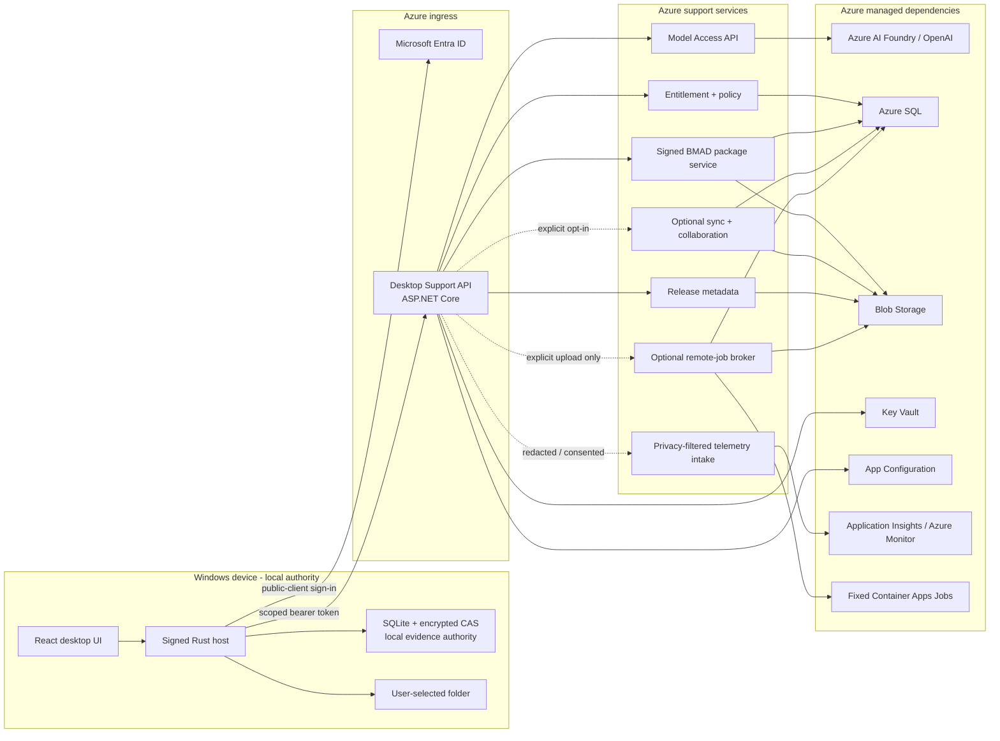
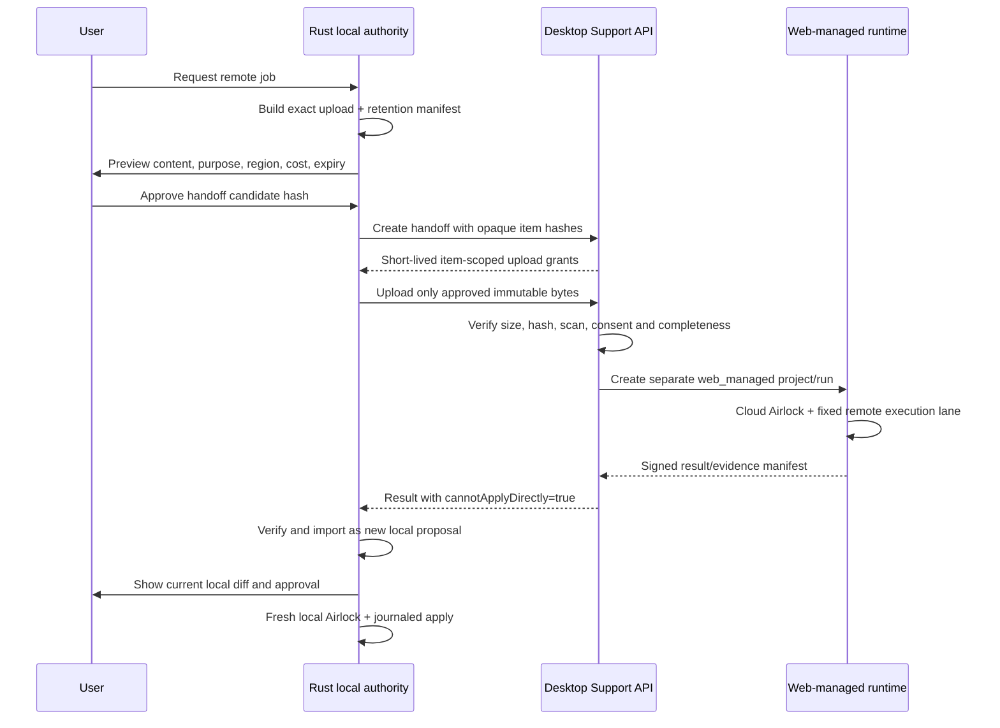

# Azure Support Plane for Windows Desktop

## 1. Scope and authority

This document is the implementation authority for the Azure services that support `deliveryModel = windows_local`. It defines connected identity and licensing, model brokerage, signed BMAD package distribution, optional sync and collaboration, privacy-safe telemetry, configuration and release metadata, and explicit remote jobs.

The support plane is not the desktop runtime. The signed Rust host, local SQLite/encrypted content store, selected-folder capability, local Airlock, local execution engine, checkpoint engine, and local Evidence Ledger remain authoritative for ordinary desktop work.

Normative terms use **MUST**, **MUST NOT**, **SHOULD**, and **MAY** in their usual engineering sense.

### 1.1 Non-negotiable boundary

Azure MUST NOT:

- receive a local folder handle or a filesystem primitive;
- store a Windows absolute path, UNC path, drive letter, user-profile path, or local workspace root;
- address, create, edit, delete, rename, or watch ordinary local workspace files;
- own or transition a `windows_local` run, checkpoint, rollback plan, approval, approved local spec, spec-consumption record, or local execution;
- mint a local execution spec or tell the Rust host that a local candidate is approved;
- treat synchronized material as the source of truth for local lifecycle or evidence;
- remotely invoke desktop IPC, launch a local process, or silently convert local work into a remote job;
- return a remote result that can be applied without a new local proposal, current diff, local policy evaluation, and local approval when required.

Azure MAY own cloud product records such as tenants, subscriptions, entitlements, package releases, server-side model receipts, explicitly synchronized replicas, collaboration requests, release metadata, telemetry, and separately created `web_managed` remote-job records.

### 1.2 Relationship to the two delivery models

| Concern | `windows_local` authority | Azure support-plane role |
|---|---|---|
| Project/run lifecycle | Rust host and local store | Entitlement checks and optional replica metadata only |
| Workspace | Selected-folder capability on device | No local path or handle; explicit opaque uploads only |
| Proposal and approval | Local runtime and local Airlock | Model output and review feedback are untrusted inputs |
| Execution | Local patch engine/process runner | Optional, separate `web_managed` remote job |
| Checkpoint/rollback | Local checkpoint engine and encrypted CAS | No authority; optional evidence materialization replica only |
| Evidence | Local hash-linked ledger | Optional replica, anchor, or diagnostic export |
| Identity/licensing | Local session uses Entra and cached signed lease | Entra validation, subscription, policy, lease issuance |
| Model access | Desktop chooses exact local context and records egress | Authenticated broker to Azure AI Foundry/OpenAI |
| BMAD package activation | Signed local cache and local activation decision | Package publication, signing metadata, revocation, distribution |
| Sync/collaboration | Local opt-in and import decision | Store allowed replicas and advisory review records |

The `deliveryModel` discriminator is mandatory on every support-plane request or record that relates to a product work item. This API accepts `windows_local` only on desktop endpoints. An explicit remote job creates a separate cloud record with `deliveryModel = web_managed`; it never mutates the originating discriminator.

## 2. Reference topology



Solid arrows represent connected product calls. Dashed arrows require a separately visible opt-in or explicit action. No arrow from Azure terminates at the selected folder.

## 3. Cloud component boundaries

The first implementation SHOULD use independently testable modules and separate managed identities even if several modules are deployed in one ASP.NET Core application initially.

| Component | Owns | MUST NOT own |
|---|---|---|
| Desktop Support API | Versioned public desktop surface, token validation, tenant routing, request limits, idempotency | Local run orchestration or generic file/process endpoints |
| Identity/Entitlement Service | Device registration, subscription/seat evaluation, signed entitlement leases, tenant desktop policy | Windows credentials, provider keys on device, local authorization state |
| Model Access API | Model admission, budget, provider profile, transient payload forwarding, typed response validation, receipt | Proposal construction, approval, local file apply, durable raw prompt storage by default |
| BMAD Package Service | Package catalog, immutable releases, signatures, compatibility, channels, revocation | Local package activation or execution |
| Sync Service | Allowed replica envelopes, cursors, tombstones, deduplication, conflict records | Last-writer-wins for authority objects, source-code sync by default, local transitions |
| Collaboration Service | Review request/feedback, comments, membership, notification metadata | Local approval or a command to execute/apply |
| Telemetry Intake | Schema allowlist, consent validation, sampling, redaction checks, operational ingestion | Evidence authority or workspace content collection |
| Release Metadata Service | Signed update metadata and channel eligibility | Running the updater or migrating the local database |
| Remote Job Broker | Explicit handoff, upload receipts, separate cloud run, result verification and retrieval | Direct local apply or reuse of a local execution spec |
| Operator Plane | Tenant policy, entitlement, budgets, package/update channels, incident controls | Remote local-shell, local-path lookup, or local state repair |

`11 - Runtime API Control Plane.md` remains the `web_managed` lifecycle authority. Desktop support endpoints are a separate route family and cannot call web workspace-mutation routes on behalf of ordinary local work.

## 4. Identity, device registration, licensing, and entitlements

### 4.1 Sign-in flow

The Windows application is an Entra public client and cannot protect a client secret. It uses authorization code with PKCE through the system browser or an approved Windows broker. Device-code flow is not the normal interactive path.

1. The Rust host creates a high-entropy PKCE verifier, state, and nonce.
2. The system browser or approved broker performs Entra authentication and Conditional Access.
3. The redirect returns only to the registered loopback/custom-URI mechanism selected by ADR-036.
4. The host validates state/nonce and obtains a token scoped to the Sapphirus Desktop Support API.
5. The desktop never requests a token for Azure AI Foundry/OpenAI, Blob, SQL, Key Vault, or Azure management APIs.
6. Refresh/token-cache material stays on the device and is protected as specified by the desktop security authority.
7. The API derives tenant and user identifiers from the validated token, never from a caller-supplied `tenantId` override.

Required application scopes are narrow and separately consentable:

| Scope | Purpose |
|---|---|
| `Desktop.Access` | Bootstrap, device registration, entitlement and policy |
| `Desktop.Model.Invoke` | Submit an explicitly prepared model request |
| `Desktop.Package.Read` | Read allowed package channels and immutable releases |
| `Desktop.Sync` | Use tenant-enabled, user-enabled replica categories |
| `Desktop.Collaboration` | Create/read review records |
| `Desktop.RemoteJob.Submit` | Preview and submit explicit remote jobs |
| `Desktop.Diagnostics.Upload` | Upload a separately consented diagnostic bundle |

Operators use separate delegated/application roles. An operator role never implies permission to call a local desktop effect.

### 4.2 Device registration

`DeviceRegistration` is a product installation record, not an Azure AD joined-device replacement.

```json
{
  "schemaVersion": "desktop-device-registration.v1",
  "registrationId": "dreg_...",
  "installationPublicKeyHash": "sha256:...",
  "clientRelease": "1.2.0",
  "platform": "windows",
  "architecture": "x64",
  "tenantPolicyVersion": "tp_...",
  "createdAt": "...",
  "lastSeenAt": "...",
  "status": "active"
}
```

It MUST NOT contain computer name, Windows username, selected-folder name, local path, repository remote, source filename, IP history, or hardware serial number. Coarse platform/architecture and a pseudonymous installation identifier are sufficient unless an enterprise attestation ADR proves a stronger requirement.

Registration operations are idempotent, user/tenant scoped, revocable, and rate limited. Revocation blocks new cloud calls after token/lease policy takes effect; it cannot erase or alter local files.

### 4.3 Entitlement lease

The service evaluates subscription, assigned seat, tenant policy, user roles, release channel, model permissions, quota class, package channels, sync categories, remote-job eligibility, and minimum supported client version.

It returns an offline-verifiable, signed `EntitlementLease`:

```json
{
  "schemaVersion": "desktop-entitlement-lease.v1",
  "leaseId": "lease_...",
  "registrationId": "dreg_...",
  "subjectHash": "sha256:...",
  "deliveryModel": "windows_local",
  "issuedAt": "...",
  "notBefore": "...",
  "expiresAt": "...",
  "offlineGraceEndsAt": "...",
  "features": ["local_runtime", "model_access", "package_catalog"],
  "modelPolicyRef": "mp_...",
  "packageChannels": ["stable"],
  "syncCategories": [],
  "remoteJobsEnabled": false,
  "minimumClientVersion": "1.2.0",
  "tenantPolicyHash": "sha256:...",
  "signature": "..."
}
```

Lease rules:

- the desktop verifies signature, audience, registration binding, time window, policy hash, and client compatibility before use;
- a lease grants connected product features, not permission to read or mutate a workspace;
- expiry or revocation cannot invalidate local evidence, delete a checkpoint, or prevent safe local history/export/rollback;
- clock rollback, duplicated lease, unknown signing key, and policy-version downgrade fail closed for new connected actions;
- grace behavior is explicit in UI and determined by DESK-08;
- emergency server policy MAY block future model, sync, package, update, or remote-job calls, but MUST NOT issue a local command.

## 5. Model Access API and provider-token isolation

### 5.1 Connected model path

```text
local context selection and secret scan
-> local ContextEgressManifest + user/policy decision
-> Desktop Support API admission
-> entitlement, tenant policy, quota, residency and size checks
-> Model Access API resolves exact model profile
-> managed-identity call to Azure AI Foundry/OpenAI
-> provider response projected and validated against canonical schema
-> typed result streamed to the Rust host
-> cloud stores a receipt/hash/usage record, not raw local context
-> Rust host normalizes the result into a local proposal
```

The model output is untrusted data. The Model Access API cannot create a local `Proposal`, candidate, approval, spec, execution, checkpoint, or evidence event. The Rust host does that after canonical validation under local authority.

### 5.2 Context egress contract

The device owns the exact `ContextEgressManifest`, including the local mapping from a workspace-relative item to its content hash. The cloud receives only the minimum call projection:

```json
{
  "schemaVersion": "desktop-model-access-request.v1",
  "requestId": "mar_...",
  "deliveryModel": "windows_local",
  "registrationId": "dreg_...",
  "purpose": "plan_patch",
  "modelRole": "planner",
  "canonicalOutputSchemaId": "proposal-plan.v3",
  "canonicalOutputSchemaHash": "sha256:...",
  "localEgressManifestHash": "sha256:...",
  "consentReceiptHash": "sha256:...",
  "items": [
    {
      "clientItemId": "ctx_01",
      "semanticRole": "source",
      "language": "typescript",
      "contentHash": "sha256:...",
      "byteCount": 8421,
      "classification": "source-confidential",
      "content": "..."
    }
  ],
  "retentionMode": "transient_no_store",
  "budgetClass": "interactive-standard"
}
```

The durable server record omits `items[].content` and any transient labels. It stores request/result hashes, byte/token counts, policy/profile/capability hashes, latency, usage, redaction outcome, schema outcome, and a safe error class.

Path handling is strict:

- an absolute Windows path, UNC path, drive letter, username-bearing path, or local root is rejected at ingress;
- the user MAY approve a normalized workspace-relative logical label when model quality requires it, but it is transient request content: it is excluded from SQL, Blob, Application Insights, exception details, queues, caches, and support exports;
- the server uses opaque `clientItemId` values in durable records;
- request-body logging is disabled; structured error handling never echoes content;
- provider requests use `store=false` unless an explicit, separately approved retention feature exists; the desktop baseline remains no-store;
- prompts, responses, source, diffs, terminal output, and local paths are not persisted by the support plane in the default model flow.

If a tenant requires zero source egress, the Model Access API denies source-bearing calls and the desktop remains useful for local deterministic BMAD/history/diff/rollback features. The service must not silently substitute a whole-repository upload.

### 5.3 Provider isolation

- The desktop receives only a Sapphirus API token. It never receives a provider key, Foundry access token, Key Vault reference, provider base URL that carries credentials, or Blob account key.
- The Model Access workload uses a dedicated managed identity for the exact approved Foundry/OpenAI resources and deployments.
- If managed identity is unavailable for a required provider edge, only the cloud service may resolve the credential from Key Vault; the exception requires a credential-binding record and rotation runbook.
- Provider endpoints are fixed deployment profiles. Caller-supplied base URLs, API versions, deployment names, tool definitions, and credentials are rejected.
- Outbound routing validates exact HTTPS host/resource/region and blocks private/loopback/arbitrary redirects.
- The profile records deployment snapshot, region, API version, schema projection, retention mode, content-filter policy, quota pool, fallback boundary, and credential class.
- Fallback cannot cross provider, tenant, region, retention, schema, or materially different quality boundaries without a pre-approved profile transition.
- Provider-hosted tools and provider background execution are off in the desktop baseline.

### 5.4 Model receipt

`ModelAccessReceipt` is cloud-authoritative evidence that the broker performed a call, but is not local run evidence until the desktop imports its hash into the local ledger.

Required fields include request/result hashes, delivery model, registration/user/tenant opaque references, local egress manifest hash, consent hash, model profile/capability/schema projection hashes, provider request ID if safe, usage/cost, retry/fallback events, retention mode, region, started/completed timestamps, and terminal status.

The receipt MUST NOT contain raw prompt/output, source text, transient file label, local path, approval, or local execution status.

## 6. Signed BMAD package distribution

The cloud package registry is authoritative for publication, review evidence, release channels, revocation, and immutable package bytes. The desktop is authoritative for download acceptance, cache integrity, compatibility evaluation, local activation, and any local rehearsal or execution.

### 6.1 Package release contract

```json
{
  "schemaVersion": "bmad-package-release.v1",
  "packageId": "pkg_...",
  "version": "2.4.1",
  "channel": "stable",
  "archiveHash": "sha256:...",
  "manifestHash": "sha256:...",
  "publisherId": "publisher_...",
  "signatureKeyId": "key_...",
  "publishedAt": "...",
  "minimumDesktopVersion": "1.2.0",
  "contractCompatibility": {
    "minimum": "3.0",
    "maximum": "3.x"
  },
  "permissions": ["read_context", "propose_patch"],
  "rehearsalEvidenceHash": "sha256:...",
  "sbomHash": "sha256:...",
  "revocationStatus": "active",
  "signature": "..."
}
```

Distribution rules:

1. Releases are immutable and addressed by exact digest; a channel pointer is mutable but signed and audited.
2. The client validates trust root, signature chain, archive/manifest hashes, package identity/version, compatibility, permission declaration, and revocation state before cache admission.
3. Download URLs are short-lived, package-specific, read-only, and offer no container listing.
4. Package-internal relative paths are package data, not local workspace paths. The registry never learns where a package is cached or which local folder consumes it.
5. Activation is a local governed transition. A server `package.available` or `package.revoked` event is input to local policy, not an activation command.
6. Revocation blocks new activation/use according to signed policy. Existing local evidence remains readable.
7. Offline use is limited to previously verified package versions allowed by the cached entitlement/policy lease.
8. Package authoring or rehearsal that uploads content to Azure is a separate explicit workflow and cannot read a selected folder without the desktop constructing an upload manifest.

## 7. Optional sync and collaboration

### 7.1 Default and scope

Sync is off by default for source content. Tenant enablement does not equal user consent. The desktop must enable each allowed replica category explicitly and show its retention/encryption policy.

Initial replica categories:

| Category | Default | Cloud semantics |
|---|---:|---|
| Product preferences | Off | Mergeable versioned user setting |
| Package pins/channels | Off | Desired metadata; local activation still required |
| Evidence materialization | Off | Read-only signed/hashed replica |
| Review request | Off | Advisory collaboration record |
| Review feedback/comments | Off | New local input after import |
| Diagnostic bundle | Explicit per upload | Time-limited support artifact |
| Source files/repository mirror | Forbidden baseline | Requires a future explicit feature/ADR; never implicit |
| Local approvals/specs/checkpoints | Not synchronizable as authority | May appear only inside a read-only evidence export |

### 7.2 Sync envelope

```json
{
  "schemaVersion": "desktop-sync-envelope.v1",
  "envelopeId": "sync_...",
  "deliveryModel": "windows_local",
  "sourceAuthority": {
    "kind": "desktop_local_store",
    "authorityId": "auth_...",
    "sequence": 184
  },
  "entityType": "evidence_materialization",
  "entityId": "em_...",
  "entityVersion": 3,
  "replicaClass": "read_only",
  "operation": "upsert",
  "payloadHash": "sha256:...",
  "payloadRef": "upload_...",
  "classification": "governance-metadata",
  "consentReceiptHash": "sha256:...",
  "encryptionProfile": "tenant-managed",
  "createdAt": "...",
  "signature": "..."
}
```

Replica rules:

- deduplicate by source authority, source sequence, entity/version, and hash;
- preserve source authority and never relabel a replica as Azure-authored local truth;
- return an acknowledgement/receipt, not a local state transition;
- no last-writer-wins merge for approvals, specs, executions, checkpoints, policy decisions, or evidence events;
- tombstones remove only the cloud replica and cannot delete a local file, checkpoint, or evidence event;
- out-of-order, conflicting, unknown-schema, or invalid-signature envelopes become visible conflicts;
- server-to-client changes are typed advisory records. There is no generic command envelope;
- notifications may say that review feedback or a package release exists, never that the desktop should execute or apply it;
- retries are idempotent and cursors are per authority/category, not a single global last-write timestamp.

### 7.3 Collaboration semantics

A collaborator may review an explicitly shared evidence/diff materialization and create `ReviewFeedback`. On import, the local host records the feedback as external input and may create a new proposal. A cloud reviewer cannot approve a local candidate, mint a local spec, consume a spec, or advance the local run.

If a future enterprise workflow requires a remote attestation, it must be modeled as a signed advisory attestation bound to a content hash. Local Airlock still performs its own current-state policy and approval decision.

## 8. Telemetry, crash reporting, and privacy

### 8.1 Privacy classes

Telemetry is operational sampling, not Evidence Ledger material. Disabling, sampling, dropping, or deleting it must not change product state or proof of a local operation.

| Consent level | Permitted data | Prohibited data |
|---|---|---|
| Essential service telemetry | API availability, version, safe error class, latency, rate-limit counters | Paths, source, prompt/output, diff, terminal payload, command arguments, workspace/repository names |
| Optional product analytics | Feature counters, coarse duration/size buckets, anonymized funnel state | Content, filenames, free text, exact timestamps that unnecessarily identify a user |
| Optional crash diagnostics | Sanitized stack/module versions and a separately previewed support bundle | Full memory dump by default, tokens, local DB/CAS, source buffers, environment values |
| Explicit support upload | User-previewed, redacted files listed in a consent receipt | Undisclosed collection or background workspace upload |

The client performs schema allowlisting and redaction before transmission. The intake repeats validation and rejects unknown properties, obvious path patterns, token formats, oversized fields, free-form exception payloads, and content-like entropy where a metric field is expected.

### 8.2 Required telemetry envelope

Telemetry fields are limited to schema version, event name/version, release/channel, coarse platform/architecture, pseudonymous rotating installation/tenant buckets, consent class/version, correlation ID, numeric measurements, bounded enumerations, sampling decision, and event time rounded where possible.

Application Insights and Log Analytics MUST NOT ingest request/response bodies, authorization headers, local object IDs that reveal names, source labels, command arguments, or workspace paths. URL route templates are recorded; raw query strings are not.

Crash reporting is off unless tenant policy and user consent allow it. Full dumps are not an MVP capability. Any diagnostic upload requires a manifest, preview, expiry, hash, size, classification, and deletion receipt.

### 8.3 Privacy verification

Release tests seed canary values that resemble:

- `C:\\Users\\Alice\\secret-project`;
- UNC and device paths;
- API keys, bearer tokens, connection strings, `.env` values;
- source fragments, diff hunks, terminal output, prompts, and filenames.

The pipeline must prove these values do not appear in Azure SQL, Blob metadata, Application Insights, Log Analytics, queues, exception tracking, support exports, deployment logs, or operator screens.

## 9. Secrets, configuration, policy, and release metadata

### 9.1 Cloud secret ownership

Key Vault stores only cloud workload secrets, signing-key references, and exceptional provider credentials. Workloads use distinct managed identities and private endpoints where required. Secrets are referenced by version; values never appear in Bicep parameters, App Configuration, logs, telemetry, package metadata, or desktop responses.

No API distributes a Foundry/OpenAI key, SQL credential, Blob account key, Key Vault token, certificate private key, or service principal secret to a desktop installation.

### 9.2 Tenant configuration and policy

Azure App Configuration and SQL may hold cloud configuration and versioned tenant policy. The desktop receives a signed, minimal `DesktopPolicyBundle` with:

- allowed model roles and data classifications;
- context limits and required consent mode;
- package channels/trust roots/revocation epoch;
- allowed sync categories and encryption profile;
- telemetry consent ceiling;
- remote-job eligibility, region, size, and retention limits;
- minimum client/contract versions;
- offline entitlement behavior;
- policy ID, version, hash, issue/expiry times, and signature.

A feature flag or policy bundle cannot expand a selected-folder grant, bypass local Airlock, add a broad IPC capability, authorize a command, or turn on source sync without local UI consent. Unknown or downgraded security policy fails closed for connected high-risk actions.

### 9.3 Update metadata

The support plane MAY publish signed release manifests and immutable installer/update artifacts:

```json
{
  "schemaVersion": "desktop-release-manifest.v1",
  "releaseId": "rel_...",
  "version": "1.3.0",
  "channel": "stable",
  "architecture": "x64",
  "artifactHash": "sha256:...",
  "artifactSize": 12345678,
  "minimumStoreSchema": 12,
  "maximumStoreSchema": 14,
  "minimumWindowsBuild": "...",
  "publishedAt": "...",
  "rolloutPercent": 10,
  "supersedes": "1.2.0",
  "revocationEpoch": 4,
  "signatureKeyId": "update-key-...",
  "signature": "..."
}
```

The native updater verifies the release-manifest signature, artifact hash, updater signature, Authenticode publisher, channel policy, architecture, and migration compatibility. The support plane supplies metadata; it cannot start the updater, suppress local recovery, or run a database migration. Enterprise management may disable in-app updates and own installation timing.

## 10. Optional remote jobs

### 10.1 Authority transition is a handoff, not a mode switch

An explicit remote job creates a separately identified `web_managed` work record. The originating desktop project/run remains `windows_local` and locally authoritative.



### 10.2 Cloud handoff manifest

The device retains the local mapping from each item to a workspace-relative path. Azure receives opaque items:

```json
{
  "schemaVersion": "desktop-remote-handoff.v1",
  "handoffId": "handoff_...",
  "origin": {
    "deliveryModel": "windows_local",
    "authorityHash": "sha256:...",
    "localHandoffEvidenceHash": "sha256:..."
  },
  "requestedRemoteAction": "run_test_profile",
  "items": [
    {
      "itemId": "item_01",
      "contentHash": "sha256:...",
      "byteCount": 8421,
      "mediaType": "text/plain",
      "classification": "source-confidential"
    }
  ],
  "region": "tenant-home",
  "retentionClass": "remote-job-ephemeral",
  "expiresAt": "...",
  "consentReceiptHash": "sha256:..."
}
```

No local path, root, username, drive, or repository name is stored. If the remote tool requires a file layout, the local host may create a sanitized logical archive layout explicitly shown in the preview. That layout is remote-job input, not a reference to a device path.

### 10.3 Handoff states and controls

```text
draft -> previewed -> locally_consented -> upload_authorized
-> uploading -> verifying -> cloud_record_created -> remote_running
-> result_available -> result_retrieved -> imported_as_local_proposal -> closed
```

Terminal alternatives are `cancelled`, `expired`, `rejected`, `upload_failed`, `verification_failed`, `remote_failed`, and `result_rejected`.

Rules:

- upload authorization binds exact tenant/user/registration, item IDs, hashes, byte limits, content types, region, expiry, and write-only object targets;
- upload tokens are short-lived, cannot list/read unrelated content, and are invalid after completion/expiry;
- malware/secret/policy scanning does not broaden the upload; failures are safe and visible;
- cloud execution uses the normal `web_managed` Airlock, fixed-template/digest-pinned remote lane, SQL/Blob authority, and result-manifest import rules;
- a local approval/spec is not a cloud execution token; cloud policy issues its own cloud authority;
- a remote approval/spec is not a local execution token;
- every result sets `cannotApplyDirectly: true`, names its remote authority, and carries immutable content/evidence hashes;
- result retrieval cannot invoke a Tauri command. The local host imports it as untrusted data;
- remote upload/result retention is time bounded and deletion is acknowledged; legal hold is disclosed before consent;
- remote jobs are disabled by default and never used as an automatic fallback for local failure, offline model access, or unsupported local commands.

## 11. Public API surface

All routes are under `/desktop/v1`, require HTTPS, validated Entra bearer tokens except public release discovery where explicitly approved, tenant/object authorization, versioned schemas, size limits, rate limits, correlation IDs, and safe errors. Mutations require an idempotency key.

| Route | Method | Scope | Side effect | Notes |
|---|---:|---|---|---|
| `/bootstrap` | GET | `Desktop.Access` | Read | Region endpoint, server/contract versions, no tenant data body logging |
| `/devices/registrations` | POST | `Desktop.Access` | Cloud metadata | Create/recover pseudonymous installation registration |
| `/devices/registrations/{id}` | DELETE | `Desktop.Access` | Revoke | Revokes cloud registration only |
| `/entitlements/current` | GET | `Desktop.Access` | Read | Current subscription/seat/feature summary |
| `/entitlements/leases` | POST | `Desktop.Access` | Signed lease | Idempotent lease issue/refresh |
| `/policy/current` | GET | `Desktop.Access` | Signed policy | Minimal desktop policy bundle |
| `/model-access/calls` | POST | `Desktop.Model.Invoke` | Provider call | Transient body; returns typed stream/result and receipt hash |
| `/model-access/receipts/{id}` | GET | `Desktop.Model.Invoke` | Read | Metadata/hash/usage only, no raw content |
| `/packages/channels/{channel}` | GET | `Desktop.Package.Read` | Read | Signed channel index |
| `/packages/{id}/versions/{version}` | GET | `Desktop.Package.Read` | Read | Immutable signed release metadata/download grant |
| `/packages/revocations` | GET | `Desktop.Package.Read` | Read | Signed monotonic revocation set |
| `/sync/envelopes` | POST | `Desktop.Sync` | Replica ingest | Allowed type/consent/signature checks |
| `/sync/changes` | GET | `Desktop.Sync` | Replica read | Cursor/category scoped; no command messages |
| `/sync/conflicts/{id}` | GET | `Desktop.Sync` | Read | Safe conflict metadata |
| `/collaboration/reviews` | POST | `Desktop.Collaboration` | Cloud record | Explicitly shared material only |
| `/collaboration/reviews/{id}/feedback` | GET/POST | `Desktop.Collaboration` | Advisory data | Cannot be local approval |
| `/telemetry/batches` | POST | base + consent | Operational ingest | Strict allowlist; never blocks product work |
| `/diagnostics/uploads` | POST | `Desktop.Diagnostics.Upload` | Explicit artifact | Preview/consent/expiry required |
| `/releases/current` | GET | `Desktop.Access` | Read | Signed release metadata only |
| `/remote-handoffs` | POST | `Desktop.RemoteJob.Submit` | Cloud handoff draft | Exact opaque manifest and cost/retention preview |
| `/remote-handoffs/{id}/upload-grants` | POST | `Desktop.RemoteJob.Submit` | Upload authorization | Exact approved item set only |
| `/remote-handoffs/{id}/submit` | POST | `Desktop.RemoteJob.Submit` | Create cloud work | Only after complete verified upload |
| `/remote-handoffs/{id}` | GET | `Desktop.RemoteJob.Submit` | Read | Status and immutable receipts |
| `/remote-handoffs/{id}/result` | GET | `Desktop.RemoteJob.Submit` | Read | Signed result with `cannotApplyDirectly` |
| `/remote-handoffs/{id}/cancel` | POST | `Desktop.RemoteJob.Submit` | Cloud cancel | Best effort; no local operation |

There are deliberately no `/files`, `/folders`, `/shell`, `/commands`, `/local-approvals`, `/local-specs`, `/local-checkpoints`, or `/apply` routes.

## 12. Events and streaming

Server events are durable cloud facts or advisory notifications. They do not carry executable instructions.

| Event | Producer | Consumer | Meaning |
|---|---|---|---|
| `desktop.registration.revoked` | Entitlement | Desktop poll/stream | Future connected access is blocked |
| `desktop.entitlement.lease_issued` | Entitlement | Audit/metrics | Signed lease was issued |
| `desktop.policy.published` | Policy | Desktop | New signed policy is available for local validation |
| `desktop.model.call_completed` | Model Access | Receipt projection | Broker call completed; no local state implication |
| `desktop.package.release_published` | Package service | Desktop | Signed package version is available |
| `desktop.package.release_revoked` | Package service | Desktop | Local policy must reevaluate future use |
| `desktop.sync.envelope_accepted` | Sync | Desktop | Cloud replica acknowledged |
| `desktop.sync.conflict_detected` | Sync | Desktop | User/local policy must resolve input |
| `desktop.collaboration.feedback_created` | Collaboration | Desktop | Advisory feedback is available |
| `desktop.remote_handoff.state_changed` | Remote broker | Desktop | Cloud handoff state changed |
| `desktop.remote_handoff.result_available` | Remote broker | Desktop | Signed remote result can be retrieved as input |
| `desktop.release.published` | Release service | Desktop | Signed update metadata is available |

Streaming uses resumable cursors and explicit gap reconciliation. A push notification contains only event ID/type and causes a normal authenticated fetch. Unknown events are ignored and recorded safely. No event may encode a local IPC command, path, command line, approval decision, or auto-apply instruction.

## 13. Azure data objects and storage ownership

### 13.1 SQL objects

| Object/table | Azure authority | Key constraints |
|---|---|---|
| `desktop_tenant_policies` | Current signed tenant desktop policy | Version/hash/region; no local roots |
| `desktop_device_registrations` | Cloud registration/revocation | Pseudonymous, tenant/user scoped |
| `desktop_entitlement_leases` | Lease issuance audit | Signed hash and times; no token value |
| `desktop_model_access_receipts` | Broker receipt/usage | No raw prompt/output/path |
| `desktop_package_channels` | Channel pointers | Signed, monotonic revision |
| `desktop_package_releases` | Immutable package metadata | Exact digest/signature/SBOM |
| `desktop_package_revocations` | Revocation set | Monotonic epoch, reason class |
| `desktop_sync_envelopes` | Replica envelope/receipt | Source authority retained |
| `desktop_sync_conflicts` | Unresolved replica conflict | No authority auto-merge |
| `desktop_collaboration_reviews` | Cloud review workflow | Advisory, hash-bound material only |
| `desktop_release_manifests` | Signed release metadata | No updater command |
| `desktop_remote_handoffs` | Handoff/cloud work linkage | Separate `web_managed` authority link |
| `desktop_remote_handoff_items` | Opaque upload item metadata | Hash/size/classification; no local path |
| `desktop_privacy_consents` | Consent/version receipt | No content body |
| `desktop_deletion_receipts` | Deletion/expiry proof | Scope, time, outcome |

SQL does not contain authoritative local `projects`, `runs`, `proposals`, `approvals`, `approved_specs`, `spec_consumptions`, `executions`, `checkpoints`, `rollback_plans`, or evidence-ledger streams. If their hashes appear in a replica or remote-handoff record, the source authority remains explicit and the row cannot drive a local transition.

### 13.2 Blob object classes

Recommended opaque prefixes:

```text
desktop-packages/{packageId}/{version}/{digest}/...
desktop-releases/{channel}/{version}/{architecture}/{digest}/...
desktop-sync/{tenantScope}/{authorityHash}/{envelopeId}/...
desktop-diagnostics/{tenantScope}/{uploadId}/...
desktop-remote/{tenantScope}/{handoffId}/input/{itemId}/...
desktop-remote/{tenantScope}/{handoffId}/result/{attemptId}/...
```

Object names and metadata use generated IDs/hashes, never local paths or repository names. Containers are private, encryption is enabled, public listing is disabled, lifecycle/immutability policies are per class, and every access is tenant/operation scoped. A client grant cannot list a prefix or access another handoff.

### 13.3 Object envelope

Every durable support-plane object includes schema version, object type/ID, tenant/owner scope, delivery model where relevant, Azure authority reference, created/updated time, region, classification, retention class, content hash/reference, and concurrency/version token.

Replica objects additionally include source authority, source sequence, source entity/version, operation, consent receipt, encryption profile, signature, and cloud receipt. Authority is never inferred from storage location.

## 14. Tenancy, regions, residency, and retention

### 14.1 Tenant isolation

- Entra tenant/user claims are mapped to an internal `OwnerScope`; caller-supplied owner IDs are validated against that scope.
- Every query and object access includes tenant/owner scope. Object-level authorization is mandatory; SQL row-level security MAY be defense in depth, not the only control.
- Managed identities, queues, caches, SAS grants, telemetry dimensions, and support tools preserve tenant boundaries.
- Cross-tenant deduplication of source, model context, evidence, diagnostics, or remote uploads is forbidden even when hashes match.
- Operators receive least-privilege, audited, just-in-time access. Raw synchronized/diagnostic/remote-job content is hidden by default.

### 14.2 Regional topology

The recommended deployment is a regional stamp per supported geography with a tenant home region:

- Desktop Support API, SQL, Blob, Key Vault, model deployment, telemetry boundary, and remote-job environment reside in or are explicitly mapped to that geography.
- A global bootstrap endpoint may return the tenant's regional API endpoint but stores no workspace/model payload.
- Model fallback stays inside the allowed residency boundary unless the tenant has explicitly approved another region.
- Cross-region failover is enabled only when storage replication, model availability, keys, logs, and support access meet the same classification policy.
- Sovereign clouds use separate app registrations, endpoints, keys, deployments, and operations boundaries.
- When an allowed region is unavailable, the service fails visibly rather than silently routing source to another geography.

### 14.3 Initial retention classes

These are starting engineering defaults, subject to tenant/legal validation before GA:

| Class | Default | Notes |
|---|---:|---|
| Transient model payload | No durable retention | Request body logging/caching disabled; hashes/usage receipt only |
| Model access receipt | 90 days | Configurable metadata/audit; no raw content |
| Entitlement/registration audit | 400 days | Security/licensing metadata only |
| Package/release bytes | While supported + defined archive period | Immutable supply-chain evidence retained |
| Sync replica | Until user/tenant deletion or category retention | Tombstone window is explicit |
| Collaboration review | Project/team policy | Explicit participant/deletion controls |
| Essential service telemetry | 30 days | Aggregates may retain longer without identifiers |
| Optional product analytics | 30 days | Consent withdrawal stops new intake |
| Explicit diagnostic upload | 7 days | Shorter when incident closes; deletion receipt |
| Remote-job input/output | Delete within 24 hours after terminal retrieval/expiry | Legal hold disclosed before upload |
| Remote-job audit metadata | 90 days | Hashes/status/cost/consent, no local path |

Deletion jobs are idempotent, evidence-producing, observable, and cover SQL, Blob versions/soft delete, queue payloads, caches, search indexes, analytics exports, and support copies. Backup expiry is documented; a delete receipt distinguishes immediate deletion, soft-delete recovery window, and backup aging.

## 15. Azure deployment topology

### 15.1 Baseline resources

| Azure service | Desktop support-plane use |
|---|---|
| Microsoft Entra ID | Public-client sign-in, API scopes, roles, Conditional Access |
| Azure App Service or Container Apps | ASP.NET Core Desktop Support API and independently scalable Model Access API |
| Azure AI Foundry/Azure OpenAI | Exact governed model deployments behind the broker |
| Azure SQL | Tenant, entitlement, package, replica, collaboration, receipt, handoff metadata |
| Blob Storage | Signed packages/releases, explicit replica/diagnostic/remote-job objects |
| Key Vault | Cloud-only signing/credential references and rotation |
| Azure App Configuration | Cloud flags plus source for signed tenant policy bundles |
| Application Insights/Log Analytics | Redacted service telemetry and opted-in desktop telemetry |
| Azure Service Bus or durable SQL outbox | Async package, sync, deletion, notification, remote-job work |
| Azure Container Registry | Digest-pinned remote-job/package-rehearsal images only |
| Azure Container Apps Jobs | Optional fixed-template remote jobs only |
| Azure Front Door/WAF | Optional regional ingress/routing; never payload authority |

No desktop feature requires local Docker, Kubernetes, a local server, a GPU, or a local model runtime.

### 15.2 Managed identity split

At minimum, use separate identities for:

- Support API read/write to its SQL domain and App Configuration;
- Model Access API access to only approved model deployments and its receipt store;
- Package publisher access to package containers and signing operation;
- Sync/diagnostic ingestion access to only its containers/queues;
- Remote Job Broker start permission on fixed job templates;
- remote worker attempt-scoped input read/result write;
- deletion/retention worker access to enumerated classes;
- monitoring exporter ingestion.

The public API identity cannot mutate a remote job template, retrieve signing-key material, or list unrelated Blob prefixes. Remote workers cannot write lifecycle SQL. Signing operations use Key Vault/HSM-backed keys where the release threat model requires it.

### 15.3 Network and IaC rules

- Bicep is source of truth; dev/test/staging/prod are separate environments.
- SQL, Blob, Key Vault, Foundry/OpenAI, ACR, and monitoring use private endpoints or controlled service access where required by environment policy.
- Outbound access is allowlisted by workload. Model Access cannot reach caller-selected URLs.
- Remote-job templates bind image digest, identity, input/output scopes, command/entrypoint, network, resources, timeout, and log policy. Request-time overrides are prohibited.
- Secrets are references, not IaC values. Role assignments and effective access are deployment evidence.
- Resource tags include environment, region, owner, data class, cost center, and expiry policy, never tenant source names.
- Dev has budgets, minimum scaling, short retention, and remote jobs disabled until a test explicitly enables a fixed template.

## 16. Security model

### 16.1 Trust boundaries

1. The desktop is a public client; possession of the binary is not trust.
2. Entra authenticates a principal; the support plane still performs tenant, entitlement, object, device-registration, policy, and consent authorization.
3. Desktop input, including hashes and signatures, is untrusted until schema, scope, replay, size, classification, and signature checks pass.
4. Model output, package content, sync input, review feedback, release metadata, and remote results are untrusted on the device until the Rust host validates them.
5. Telemetry is never accepted into authority stores.
6. Cloud administration cannot grant local filesystem or process authority.

### 16.2 Required controls

- PKCE, state/nonce validation, exact redirect URI, short token lifetime, Conditional Access compatibility, and token-cache isolation;
- strict API audience/issuer/signature/time validation and scope/role separation;
- tenant/object authorization on every route and storage reference;
- idempotency and replay windows for all mutations;
- per-user/device/tenant rate, request-size, token, storage, and remote-job limits;
- schema allowlists with unknown-field rejection on privacy-sensitive intake;
- managed identity and least-privilege RBAC; no shared production credentials;
- encryption in transit and at rest, versioned key rotation, backup/restore tests;
- fixed provider and remote-job endpoints; outbound URL/redirect policy;
- package/update/result signatures, immutable digests, SBOM/provenance, revocation and rollback;
- WAF/API throttling, dependency scanning, secret scanning, SAST/DAST, and penetration tests;
- tamper-evident operator/security audit for entitlement, policy, package, release, remote-job and deletion actions;
- support access approvals and automatic expiry;
- privacy/DLP tests that prove local paths and source do not enter unauthorized stores.

### 16.3 No remote-control channel

The API and event system have no generic command, shell, IPC, file, apply, or policy-bypass message. Server-originated data is informational and versioned. The Rust host decides whether a package, policy, review, result, or update metadata item is valid and what local UI action is available.

## 17. Offline and degraded behavior

| Cloud condition | Desktop behavior |
|---|---|
| Entra unavailable but valid cached lease | Local history, BMAD packages, diff, checkpoint, rollback and allowed deterministic features continue; connected calls wait |
| Entitlement endpoint unavailable | Use valid signed lease within defined grace; show expiry; no guessed entitlement |
| Lease expired/revoked | Block new connected licensed actions; preserve local inspect/export/recovery/rollback |
| Model service unavailable/rate limited | Keep request local or retry with policy; never upload more context or switch provider/region silently |
| Package service unavailable | Use previously verified, policy-allowed cache; no unsigned fallback |
| Sync unavailable | Queue allowed envelopes locally; local work continues; deduplicate on reconnect |
| Collaboration unavailable | Preserve local review request draft; no impact on local authority |
| Telemetry unavailable | Drop or bounded-queue according to consent; never block product work |
| Update metadata unavailable | Continue current supported binary; enterprise policy may require later update |
| Remote jobs unavailable | Local mode remains active; no automatic remote retry/fallback |
| Region outage | Fail visibly or use an already-approved same-residency failover; never cross boundary silently |
| Policy/signature invalid | Reject new cloud artifact/policy; keep last valid non-expired cache where policy permits |

Reconnect order is entitlement/policy, security revocations, model/package metadata, sync, release check, then optional telemetry. Reconnect cannot retroactively approve or mutate a completed local operation.

## 18. SLOs, observability, and operational controls

### 18.1 Initial SLO targets

Targets are measured per production region and must be validated before GA:

| Capability | Availability | Latency / freshness | Notes |
|---|---:|---:|---|
| Bootstrap and entitlement | 99.9% monthly | p95 < 1 s excluding interactive Entra | Cached signed lease provides bounded degradation |
| Model admission/broker overhead | 99.9% monthly | p95 < 750 ms excluding provider generation | End-to-end provider latency tracked separately |
| Package index/release metadata | 99.9% monthly | p95 < 1 s | Blob artifact download excluded from API latency |
| Sync envelope ingest/read | 99.9% monthly | p95 ack < 2 s; change visible < 30 s | Replica service, not local-authority SLO |
| Collaboration metadata | 99.5% monthly | p95 < 2 s | Advisory capability |
| Release metadata | 99.9% monthly | publication visible < 10 min | Signed artifacts remain cacheable |
| Remote-job control plane | 99.5% monthly | submit acknowledgement < 5 s | Job runtime has separate queue/runtime SLO |
| Telemetry intake | 99.0% monthly | best effort | Must never block desktop operation |

Initial recovery objectives: SQL metadata RPO <= 5 minutes/RTO <= 60 minutes within approved geography; package/release artifacts are immutable and reproducible; sync/remote upload classes follow their documented replication/retention policy. Exact production objectives require a cost/residency ADR.

### 18.2 Metrics and dashboards

Required service signals:

- authentication/authorization failures by safe reason and route template;
- entitlement issue/refresh/revocation latency and invalid-signature/time anomalies;
- model admission, provider latency, schema success, retries/fallbacks, rate limits, tokens and cost by role/profile/tenant budget class;
- context bytes/classification counts and redaction rejects without content or names;
- package publication/download/signature/revocation/compatibility failures;
- sync ingress lag, duplicates, conflicts, tombstones, invalid signatures and category denials;
- telemetry schema rejects and path/secret canary detections;
- release publication, update-manifest signature and channel health;
- remote handoff stage latency, upload verification, scans, queue time, job result/import retrieval and cleanup backlog;
- SQL/Blob/queue/outbox/deletion lag, Key Vault access, managed-identity/RBAC failures, regional health and cost budget state.

Telemetry dimensions use route/template, region, environment, release, safe error code, model role/profile, and coarse tenant budget class. High-cardinality user, source, filename, path, prompt, command, item hash, or free text is excluded.

### 18.3 Operator controls

Operators may disable a model profile, package version/channel, sync category, telemetry schema, update channel, tenant entitlement, or remote-job template. Actions are versioned, reasoned, reviewed where required, and audited.

Operators cannot browse local folders, retrieve local paths, execute local commands, apply a remote patch, issue local approval, consume a local spec, delete local evidence, or force a local updater. Support tooling reflects this boundary in both UI and API permissions.

## 19. Cost controls

- Per-tenant/user/model-role token and currency budgets with hard limits, alerts, and explicit fallback policy.
- Request byte/token caps before provider submission; no whole-repository default.
- Exact model deployment/profile selection; auxiliary calls require purpose and budget.
- Package/release downloads use immutable caching and conditional requests.
- Sync quotas are per replica class; large evidence/diagnostic content requires explicit limit and retention.
- Telemetry uses client/server sampling, bounded dimensions, daily ingestion caps, and short raw retention.
- Remote jobs are off by default, fixed-size/profile, concurrency/queue/time/output limited, and show an estimate before consent.
- Blob lifecycle deletes ephemeral diagnostics/remote data; orphan scans compare SQL refs and exact object classes.
- Dev/test environments have teardown schedules, minimum scaling, model/job quotas, and budget alerts.
- Cost throttling returns a typed denial/defer response; it never silently changes region, provider, retention, upload scope, or execution model.

## 20. Failure modes and required outcomes

| Failure | Required outcome |
|---|---|
| Invalid/expired Entra token | 401 safe error; no object existence leak; local work unaffected |
| Cross-tenant/object attempt | 404/403 policy response, security audit, no metadata leakage |
| Registration revoked | New cloud calls denied after policy window; no local delete/lock command |
| Entitlement signer/key unavailable | No unsigned lease; valid cached lease rules apply |
| Device clock rollback | Lease anomaly and connected high-risk actions fail closed |
| Model provider timeout/rate limit | Typed retry/defer; exact context is not broadened; no silent provider/region change |
| Schema-invalid model output | Bounded validated repair or failure; never a proposal/spec on server |
| Request contains local path/secret | Reject or redact according to explicit policy; record safe counter only |
| Provider credential misbinding | Fail closed before egress; credential never returned/logged |
| Package hash/signature mismatch | Quarantine/reject release; alert; no local activation instruction |
| Package revoked while offline | Apply signed cached revocation/expiry policy on reconnect; preserve evidence |
| Duplicate/out-of-order sync | Idempotent ack or visible conflict; no LWW authority merge |
| Sync category policy changed | Stop new upload; retain/delete replica according to disclosed policy; no local mutation |
| Telemetry schema/path canary rejected | Drop batch, alert privacy pipeline, no product-work failure |
| Update feed/signature compromise | Native verification rejects artifact; revoke key/channel and publish signed recovery metadata |
| Remote upload incomplete/hash mismatch | Never create cloud run; expire/quarantine exact objects |
| Remote worker/job failure | Signed terminal cloud result/evidence; no local side effect |
| Remote result signature/authority mismatch | Local host rejects import; support plane cannot override |
| Retention/deletion job partial failure | Retry idempotently, expose backlog, issue receipt only after every class is resolved |
| Region outage | Approved failover or visible unavailability; no residency bypass |
| SQL/Blob/queue split failure | Transactional outbox/reconciliation; never report durable success before authority record |

## 21. Test and release gates

### 21.1 Contract and authority tests

- Every desktop route rejects a missing/wrong `deliveryModel`, tenant, owner scope, registration, schema, scope, version, and oversized body.
- API schemas contain no generic local `path`, `absolutePath`, `workspaceRoot`, `command`, `shell`, `approval`, `approvedSpec`, `checkpointApply`, or `ipcCommand` field.
- A cloud service cannot call a desktop IPC endpoint; no such endpoint or reverse channel exists.
- Cloud review feedback, package/update events, and remote results cannot transition local fixtures.
- C#, Rust, and TypeScript conformance fixtures agree on entitlement, model receipt, package release, sync envelope, and remote handoff contracts.

### 21.2 Identity and tenant tests

- Authorization code/PKCE state, nonce, redirect, replay, cancellation, Conditional Access, tenant switch, guest, disabled user, revoked consent, and token expiry.
- Public-client secret absence and token-cache separation; desktop cannot obtain provider/storage/management tokens.
- Cross-tenant ID substitution, cache key poisoning, SAS reuse, queue replay, operator overreach, and support-access expiry.
- Lease signature/key rotation, expiry/grace, clock tamper, registration recovery/revocation, downgrade and offline behavior.

### 21.3 Model and privacy tests

- Exact provider resource/deployment/region/credential binding and blocked caller-supplied endpoint.
- Canonical schema projection/validation, incomplete/refusal handling, bounded repair, retry/fallback boundary and usage accounting.
- `store=false`, request-body logging disabled, cache exclusion, safe exception serialization, and transient-content disposal.
- Seeded path/source/secret canaries are absent from SQL, Blob, telemetry, queues, logs, traces, exports, and operator screens.
- Consent policy modes, classification denial, byte/token limits, whole-repository refusal, and no-source tenant mode.

### 21.4 Package, sync, release, and remote-job tests

- Package/update signature chain, digest, compatibility, revocation, key rotation, channel rollback, truncated/malicious archive and cache poisoning.
- Sync duplicate, reorder, tombstone, conflict, signature failure, category denial, consent withdrawal, encryption profile and replica deletion.
- No last-writer-wins or cloud-source promotion for approvals/specs/executions/checkpoints/evidence.
- Update rollout/ring, downgrade/migration compatibility, enterprise-managed mode and compromised-feed recovery.
- Remote preview/consent/hash/size/region/retention/cost binding; write-only upload grants; scan/expiry/cleanup; fixed job template; signed result.
- Every remote result has a separate `web_managed` authority and `cannotApplyDirectly: true`; the only accepted desktop import creates a fresh local proposal fixture.

### 21.5 Resilience, performance, and compliance tests

- Regional dependency failures, Key Vault throttling, SQL failover, Blob/queue unavailability, outbox replay, provider quota, deletion backlog and DNS/endpoint denial.
- Load at tenant/user rate limits, model concurrency, package release spikes, sync reconnect storms, telemetry batching and remote-job queue caps.
- Backup/restore and DR inside approved geography; restored replicas retain original source authority.
- Retention/deletion across active, versioned, soft-deleted, cached, queued, backed-up and exported copies.
- Accessibility/localized consent copy and clear offline/degraded/retention/cost presentation.

Promotion is blocked if any test demonstrates Azure storing a local path, owning a local authority object, exposing a provider credential, accepting implicit source sync, or allowing a remote result to apply directly.

## 22. Phased rollout

| Phase | Support-plane scope | Exit gate |
|---|---|---|
| C0 - contracts and privacy harness | Schemas, route namespace, authority negative tests, tenant stamps, path/secret canary scanner, fake provider | No local-authority route/object; privacy canary clean |
| C1 - identity and entitlement | Entra public-client flow, registration, signed policy/lease, offline/degraded fixtures | Conditional Access/offline/revocation/security tests pass |
| C2 - Model Access API | Managed identity, exact profiles, egress consent projection, transient no-store proxy, receipts, budgets | No provider token/device; no content/path persistence; typed-result conformance |
| C3 - signed packages and releases | Package catalog, signatures, channels, revocation, immutable download, release metadata | Supply-chain, compatibility, rollback and offline-cache tests pass |
| C4 - opt-in sync/collaboration | Replica envelopes, consent categories, conflict/tombstone, review feedback | No authority merge/source default; deletion/privacy tests pass |
| C5 - telemetry and enterprise operations | Allowlisted telemetry, diagnostics consent, dashboards, tenant controls, SLO/DR | Canary/privacy, support-access and regional runbooks pass |
| C6 - optional remote jobs | Handoff preview, exact uploads, fixed cloud lane, signed result, cleanup | Separate authority and fresh-local-proposal gates pass |

Each phase is deployable behind tenant/region flags. A cloud flag cannot bypass desktop validation. Sync and remote jobs stay off by default through GA unless the tenant and user separately enable them.

## 23. Unresolved decisions

- **DESK-02 - Native Entra implementation:** pure Rust system-browser PKCE/loopback versus a minimal signed WAM/MSAL helper for enterprise SSO, Windows Hello, broker policy, and Conditional Access evidence.
- **DESK-03 - Release channel ownership:** MSI/WiX versus NSIS/direct updater; Intune/winget interaction; emergency revocation and rollback behavior.
- **DESK-06 - Context egress consent:** approval per call versus time-bounded workspace/session grant; whether transient normalized relative labels are permitted for model quality in each classification.
- **DESK-07 - Sync scope and encryption:** metadata-only baseline versus selected evidence/artifacts; tenant-managed encryption versus end-to-end encryption where the service cannot read collaboration content.
- **DESK-08 - Offline entitlement:** lease/grace duration, revocation propagation, clock-tamper response, and which local deterministic capabilities remain licensed after expiry.
- **SUPPORT-01 - Licensing source:** first-party tenant subscription/seat tables, Azure Marketplace integration, or enterprise license service; define reconciliation authority and refund/seat-transfer behavior.
- **SUPPORT-02 - API hosting:** App Service versus Container Apps for the Support and Model Access APIs; choose from identity, private networking, scaling, streaming, operations, and cost evidence, not stack fashion.
- **SUPPORT-03 - Regional routing/DR:** tenant home-region discovery, approved paired region, sovereign deployment, RPO/RTO, and whether any model role may use cross-region fallback.
- **SUPPORT-04 - Signing hierarchy:** package, policy/lease, update, and remote-result keys; shared versus separated roots, HSM requirement, offline root, rotation, compromise, and client trust-store recovery.
- **SUPPORT-05 - Model response retention:** no-store baseline is locked; decide whether an explicit enterprise collaboration feature may persist encrypted model output without weakening local authority or path prohibition.
- **SUPPORT-06 - Telemetry consent:** user versus tenant control precedence, diagnostic preview format, rotating pseudonymous identifier period, and jurisdiction-specific defaults.
- **SUPPORT-07 - Remote upload scanning:** exact malware/secret/license checks, false-positive appeal, encrypted payload handling, maximum archive/layout, and cleanup proof.
- **SUPPORT-08 - Service SLO/cost tier:** validate the initial SLO, DR, retention, and per-tenant quota targets against expected usage and enterprise contracts before GA.

No unresolved decision may weaken the local-authority boundary. A proposed resolution that requires Azure to know a local root, own a local approval/spec/checkpoint, or directly apply a result is a different product architecture and requires a new ADR rather than an implementation choice.

## 24. Cross-references

- [[93 - Split Web and Windows Desktop Architecture Plans]] - delivery-model split and shared doctrine.
- [[94 - Windows Desktop Native Host and IPC]] - signed Rust host and renderer/native boundary.
- [[95 - Windows Local Workspace and Execution]] - selected-folder capability, local effects, and remote-handoff import.
- [[96 - Windows Local State, Evidence, Checkpoint, and Rollback]] - local authority, replica semantics, evidence, and recovery.
- [[11 - Runtime API Control Plane]] - `web_managed` cloud lifecycle authority; not the local desktop authority.
- [[18 - Model Gateway and Microsoft Foundry]] - canonical provider/profile/schema rules reused by Model Access.
- [[24 - Operator Console and Operations]] - cloud operator controls with the desktop no-remote-control restriction.
- [[37 - Azure Environments and Deployment Runbooks]] and [[67 - Azure IaC Module Specification]] - environment/IaC baseline, extended by the desktop support modules in this document.
- [[41 - Observability Dashboards and Alerts]] - shared Azure service signals; desktop telemetry remains privacy scoped.
- [[46 - API Route Catalog]] - web route catalog; `/desktop/v1` is the separate public desktop support surface.
- [[48 - Blob Storage Layout]] - web storage layout; desktop support objects use the opaque prefixes defined here.

## 25. Primary platform references

- [Microsoft identity platform authorization code flow with PKCE](https://learn.microsoft.com/en-us/entra/identity-platform/v2-oauth2-auth-code-flow)
- [Microsoft Entra desktop application guidance](https://learn.microsoft.com/en-us/entra/identity-platform/scenario-desktop-overview)
- [Authenticate Azure OpenAI with managed identity](https://learn.microsoft.com/en-us/azure/ai-services/openai/how-to/managed-identity)
- [Managed identities for Azure resources](https://learn.microsoft.com/en-us/entra/identity/managed-identities-azure-resources/overview)
- [Azure Key Vault security](https://learn.microsoft.com/en-us/azure/key-vault/general/security-features)
- [Azure Blob Storage security recommendations](https://learn.microsoft.com/en-us/azure/storage/blobs/security-recommendations)
- [Azure App Configuration overview](https://learn.microsoft.com/en-us/azure/azure-app-configuration/overview)
- [Azure Monitor Application Insights data collection and privacy](https://learn.microsoft.com/en-us/azure/azure-monitor/app/data-retention-privacy)
